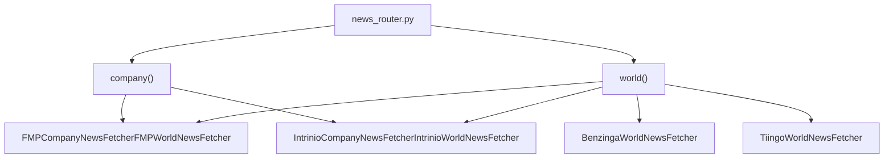
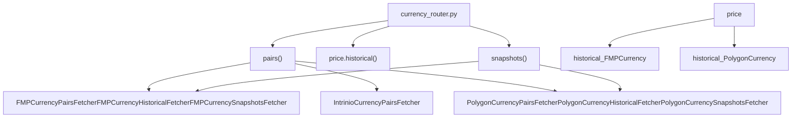
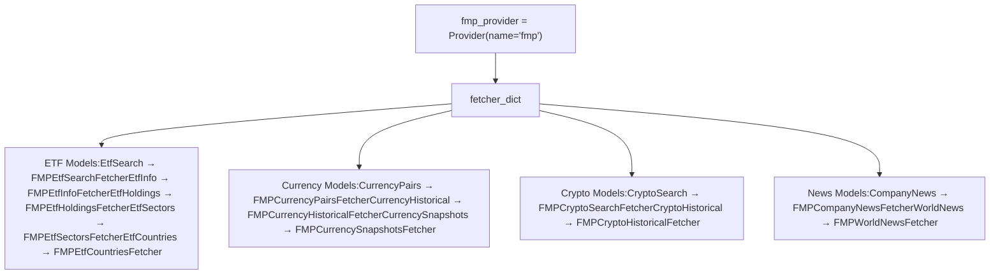
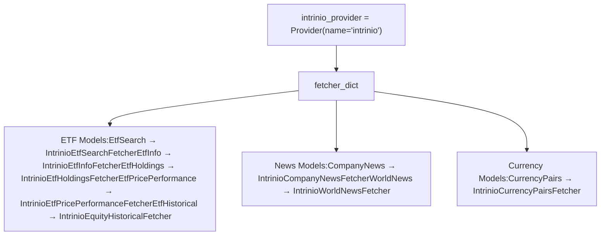
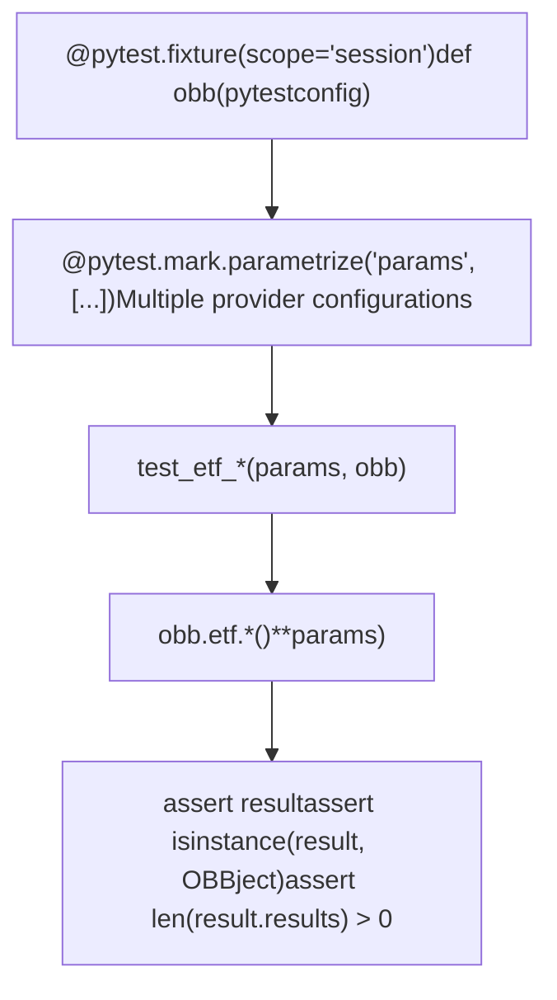

# ETF 及其它扩展 (ETF and Other Extensions)

相关源文件

-   [cli/poetry.lock](https://github.com/OpenBB-finance/OpenBB/blob/dddc3b32/cli/poetry.lock)
-   [openbb\_platform/core/openbb/assets/reference.json](https://github.com/OpenBB-finance/OpenBB/blob/dddc3b32/openbb_platform/core/openbb/assets/reference.json)
-   [openbb\_platform/core/openbb\_core/provider/standard\_models/company\_filings.py](https://github.com/OpenBB-finance/OpenBB/blob/dddc3b32/openbb_platform/core/openbb_core/provider/standard_models/company_filings.py)
-   [openbb\_platform/core/poetry.lock](https://github.com/OpenBB-finance/OpenBB/blob/dddc3b32/openbb_platform/core/poetry.lock)
-   [openbb\_platform/core/pyproject.toml](https://github.com/OpenBB-finance/OpenBB/blob/dddc3b32/openbb_platform/core/pyproject.toml)
-   [openbb\_platform/dev\_install.py](https://github.com/OpenBB-finance/OpenBB/blob/dddc3b32/openbb_platform/dev_install.py)
-   [openbb\_platform/extensions/devtools/poetry.lock](https://github.com/OpenBB-finance/OpenBB/blob/dddc3b32/openbb_platform/extensions/devtools/poetry.lock)
-   [openbb\_platform/extensions/devtools/pyproject.toml](https://github.com/OpenBB-finance/OpenBB/blob/dddc3b32/openbb_platform/extensions/devtools/pyproject.toml)
-   [openbb\_platform/extensions/equity/integration/test\_equity\_api.py](https://github.com/OpenBB-finance/OpenBB/blob/dddc3b32/openbb_platform/extensions/equity/integration/test_equity_api.py)
-   [openbb\_platform/extensions/equity/integration/test\_equity\_python.py](https://github.com/OpenBB-finance/OpenBB/blob/dddc3b32/openbb_platform/extensions/equity/integration/test_equity_python.py)
-   [openbb\_platform/extensions/equity/openbb\_equity/fundamental/fundamental\_router.py](https://github.com/OpenBB-finance/OpenBB/blob/dddc3b32/openbb_platform/extensions/equity/openbb_equity/fundamental/fundamental_router.py)
-   [openbb\_platform/extensions/etf/integration/test\_etf\_api.py](https://github.com/OpenBB-finance/OpenBB/blob/dddc3b32/openbb_platform/extensions/etf/integration/test_etf_api.py)
-   [openbb\_platform/extensions/etf/integration/test\_etf\_python.py](https://github.com/OpenBB-finance/OpenBB/blob/dddc3b32/openbb_platform/extensions/etf/integration/test_etf_python.py)
-   [openbb\_platform/poetry.lock](https://github.com/OpenBB-finance/OpenBB/blob/dddc3b32/openbb_platform/poetry.lock)
-   [openbb\_platform/providers/fmp/openbb\_fmp/\_\_init\_\_.py](https://github.com/OpenBB-finance/OpenBB/blob/dddc3b32/openbb_platform/providers/fmp/openbb_fmp/__init__.py)
-   [openbb\_platform/providers/fmp/openbb\_fmp/models/company\_filings.py](https://github.com/OpenBB-finance/OpenBB/blob/dddc3b32/openbb_platform/providers/fmp/openbb_fmp/models/company_filings.py)
-   [openbb\_platform/providers/fmp/pyproject.toml](https://github.com/OpenBB-finance/OpenBB/blob/dddc3b32/openbb_platform/providers/fmp/pyproject.toml)
-   [openbb\_platform/providers/fmp/tests/test\_fmp\_fetchers.py](https://github.com/OpenBB-finance/OpenBB/blob/dddc3b32/openbb_platform/providers/fmp/tests/test_fmp_fetchers.py)
-   [openbb\_platform/providers/intrinio/openbb\_intrinio/\_\_init\_\_.py](https://github.com/OpenBB-finance/OpenBB/blob/dddc3b32/openbb_platform/providers/intrinio/openbb_intrinio/__init__.py)
-   [openbb\_platform/providers/intrinio/openbb\_intrinio/models/company\_filings.py](https://github.com/OpenBB-finance/OpenBB/blob/dddc3b32/openbb_platform/providers/intrinio/openbb_intrinio/models/company_filings.py)
-   [openbb\_platform/providers/intrinio/tests/test\_intrinio\_fetchers.py](https://github.com/OpenBB-finance/OpenBB/blob/dddc3b32/openbb_platform/providers/intrinio/tests/test_intrinio_fetchers.py)
-   [openbb\_platform/providers/sec/openbb\_sec/\_\_init\_\_.py](https://github.com/OpenBB-finance/OpenBB/blob/dddc3b32/openbb_platform/providers/sec/openbb_sec/__init__.py)
-   [openbb\_platform/providers/sec/openbb\_sec/utils/form4.py](https://github.com/OpenBB-finance/OpenBB/blob/dddc3b32/openbb_platform/providers/sec/openbb_sec/utils/form4.py)
-   [openbb\_platform/providers/sec/tests/test\_sec\_fetchers.py](https://github.com/OpenBB-finance/OpenBB/blob/dddc3b32/openbb_platform/providers/sec/tests/test_sec_fetchers.py)
-   [openbb\_platform/providers/tmx/openbb\_tmx/models/company\_filings.py](https://github.com/OpenBB-finance/OpenBB/blob/dddc3b32/openbb_platform/providers/tmx/openbb_tmx/models/company_filings.py)
-   [openbb\_platform/providers/yfinance/poetry.lock](https://github.com/OpenBB-finance/OpenBB/blob/dddc3b32/openbb_platform/providers/yfinance/poetry.lock)
-   [openbb\_platform/pyproject.toml](https://github.com/OpenBB-finance/OpenBB/blob/dddc3b32/openbb_platform/pyproject.toml)

本文档涵盖了 OpenBB 平台中的 ETF 扩展和其他领域专用扩展。ETF 扩展提供了分析交易所交易基金的综合工具，包括持仓、行业分配和业绩指标。涵盖的其他扩展包括新闻 (News)、加密货币 (Crypto) 和货币 (Currency) 模块。

有关股票分析，请参阅 [股票扩展 (Equity Extension)](/OpenBB-finance/OpenBB/3.2-equity-extension)。有关经济数据，请参阅 [经济扩展 (Economy Extension)](/OpenBB-finance/OpenBB/3.1-economy-extension)。

## ETF 扩展

OpenBB 平台中的 ETF 扩展提供了通过多个提供商访问交易所交易基金数据的途径。该扩展实现为一个基于路由的系统，将端点映射到特定于提供商的抓取器。

### ETF 路由架构

ETF 路由公开了多个用于访问 ETF 数据的端点：

```mermaid
flowchart TD
    Router["etf_router.py"]
    search["search()"]
    info["info()"]
    sectors["sectors()"]
    countries["countries()"]
    holdings["holdings()"]
    equity_exposure["equity_exposure()"]
    price_performance["price_performance()"]
    nport_disclosure["nport_disclosure()"]
    DiscoveryRouter["discovery_router.py"]
    gainers["gainers()"]
    losers["losers()"]
    active["active()"]
    FMPEtfSearch["FMPEtfSearchFetcher"]
    FMPEtfInfo["FMPEtfInfoFetcher"]
    FMPEtfSectors["FMPEtfSectorsFetcher"]
    FMPEtfCountries["FMPEtfCountriesFetcher"]
    FMPEtfHoldings["FMPEtfHoldingsFetcher"]
    IntrinioEtfSearch["IntrinioEtfSearchFetcher"]
    IntrinioEtfInfo["IntrinioEtfInfoFetcher"]
    IntrinioEtfHoldings["IntrinioEtfHoldingsFetcher"]
    SecEtfHoldings["SecEtfHoldingsFetcher"]
    TmxEtfSearch["TmxEtfSearchFetcher"]

    Router --> search
    Router --> info
    Router --> sectors
    Router --> countries
    Router --> holdings
    Router --> equity_exposure
    Router --> price_performance
    Router --> nport_disclosure
    DiscoveryRouter --> gainers
    DiscoveryRouter --> losers
    DiscoveryRouter --> active
    Router --> DiscoveryRouter
    search --> FMPEtfSearch
    search --> IntrinioEtfSearch
    search --> TmxEtfSearch
    info --> FMPEtfInfo
    info --> IntrinioEtfInfo
    sectors --> FMPEtfSectors
    countries --> FMPEtfCountries
    holdings --> FMPEtfHoldings
    holdings --> IntrinioEtfHoldings
    holdings --> SecEtfHoldings
```


来源： [openbb\_platform/extensions/etf/integration/test\_etf\_python.py1-459](https://github.com/OpenBB-finance/OpenBB/blob/dddc3b32/openbb_platform/extensions/etf/integration/test_etf_python.py#L1-L459) [openbb\_platform/providers/fmp/openbb\_fmp/\_\_init\_\_.py35-44](https://github.com/OpenBB-finance/OpenBB/blob/dddc3b32/openbb_platform/providers/fmp/openbb_fmp/__init__.py#L35-L44) [openbb\_platform/providers/intrinio/openbb\_intrinio/\_\_init\_\_.py14-19](https://github.com/OpenBB-finance/OpenBB/blob/dddc3b32/openbb_platform/providers/intrinio/openbb_intrinio/__init__.py#L14-L19)

### 关键 ETF 端点

ETF 扩展提供以下核心功能：

| 端点 | 描述 | 主要提供商 | 标准模型 |
| --- | --- | --- | --- |
| `search()` | 按名称或标准搜索 ETF | FMP, Intrinio, TMX | EtfSearch |
| `info()` | 获取 ETF 元数据和特征 | FMP, Intrinio, YFinance | EtfInfo |
| `holdings()` | 检索 ETF 投资组合持仓 | FMP, SEC, Intrinio, TMX | EtfHoldings |
| `sectors()` | 获取行业分配明细 | FMP, TMX | EtfSectors |
| `countries()` | 获取国家风险敞口明细 | FMP, TMX | EtfCountries |
| `equity_exposure()` | 查找哪些 ETF 持有特定股票 | FMP | EtfEquityExposure |
| `price_performance()` | 获取业绩指标 | FMP, Intrinio, Finviz | EtfPricePerformance |
| `nport_disclosure()` | 访问 N-PORT 监管公告 | FMP, SEC | NportDisclosure |

来源： [openbb\_platform/extensions/etf/integration/test\_etf\_python.py42-458](https://github.com/OpenBB-finance/OpenBB/blob/dddc3b32/openbb_platform/extensions/etf/integration/test_etf_python.py#L42-L458)

### ETF 持仓数据流

持仓端点从多个提供商检索投资组合构成数据。每个提供商都实现了具有提供商特定扩展的 `EtfHoldings` 标准模型：

来源： [openbb\_platform/extensions/etf/integration/test\_etf\_python.py343-353](https://github.com/OpenBB-finance/OpenBB/blob/dddc3b32/openbb_platform/extensions/etf/integration/test_etf_python.py#L343-L353) [openbb\_platform/providers/fmp/tests/test\_fmp\_fetchers.py594-600](https://github.com/OpenBB-finance/OpenBB/blob/dddc3b32/openbb_platform/providers/fmp/tests/test_fmp_fetchers.py#L594-L600) [openbb\_platform/providers/intrinio/tests/test\_intrinio\_fetchers.py446-453](https://github.com/OpenBB-finance/OpenBB/blob/dddc3b32/openbb_platform/providers/intrinio/tests/test_intrinio_fetchers.py#L446-L453)

### ETF 提供商比较

不同的提供商为 ETF 数据提供不同级别的详细信息：

| 特性 | FMP | Intrinio | SEC | TMX | YFinance |
| --- | --- | --- | --- | --- | --- |
| 搜索 | ✓ | ✓ | \- | ✓ | \- |
| 信息 | ✓ | ✓ | \- | ✓ | ✓ |
| 持仓 | ✓ | ✓ | ✓ | ✓ | \- |
| 行业 | ✓ | \- | \- | ✓ | \- |
| 国家 | ✓ | \- | \- | ✓ | \- |
| 历史价格 | ✓ | ✓ | \- | ✓ | ✓ |
| N-PORT 公告 | ✓ | \- | ✓ | \- | \- |

来源： [openbb\_platform/extensions/etf/integration/test\_etf\_python.py20-458](https://github.com/OpenBB-finance/OpenBB/blob/dddc3b32/openbb_platform/extensions/etf/integration/test_etf_python.py#L20-L458) [openbb\_platform/providers/fmp/openbb\_fmp/\_\_init\_\_.py110-116](https://github.com/OpenBB-finance/OpenBB/blob/dddc3b32/openbb_platform/providers/fmp/openbb_fmp/__init__.py#L110-L116) [openbb\_platform/providers/intrinio/openbb\_intrinio/\_\_init\_\_.py84-87](https://github.com/OpenBB-finance/OpenBB/blob/dddc3b32/openbb_platform/providers/intrinio/openbb_intrinio/__init__.py#L84-L87)

## 新闻 (News) 扩展

新闻扩展提供了访问来自多个提供商的公司和市场新闻的途径。它支持按代码、主题和日期范围进行过滤。

### 新闻路由结构


新闻端点使用 `CompanyNews` 和 `WorldNews` 标准模型。每个提供商实现的抓取器将新闻数据归一化为包含 `date`、`title`、`text`、`url` 和 `symbols` 等字段的一致格式。

来源： [openbb\_platform/providers/fmp/tests/test\_fmp\_fetchers.py179-186](https://github.com/OpenBB-finance/OpenBB/blob/dddc3b32/openbb_platform/providers/fmp/tests/test_fmp_fetchers.py#L179-L186) [openbb\_platform/providers/intrinio/tests/test\_intrinio\_fetchers.py128-141](https://github.com/OpenBB-finance/OpenBB/blob/dddc3b32/openbb_platform/providers/intrinio/tests/test_intrinio_fetchers.py#L128-L141)

## 加密货币 (Crypto) 扩展

加密货币扩展提供加密货币市场数据，包括历史价格和搜索功能。

### 加密货币端点

| 端点 | 描述 | 提供商 | 标准模型 |
| --- | --- | --- | --- |
| `search()` | 搜索加密货币 | FMP | CryptoSearch |
| `price.historical()` | 获取加密货币历史价格 | FMP, Polygon, YFinance | CryptoHistorical |

加密货币扩展复用了股票数据的历史价格基础设施，但具有加密货币特定的代码格式和数据源。

来源： [openbb\_platform/providers/fmp/tests/test\_fmp\_fetchers.py122-133](https://github.com/OpenBB-finance/OpenBB/blob/dddc3b32/openbb_platform/providers/fmp/tests/test_fmp_fetchers.py#L122-L133) [openbb\_platform/providers/fmp/openbb\_fmp/\_\_init\_\_.py18-22](https://github.com/OpenBB-finance/OpenBB/blob/dddc3b32/openbb_platform/providers/fmp/openbb_fmp/__init__.py#L18-L22)

## 货币 (Currency) 扩展

货币扩展提供外汇数据，包括货币对、历史汇率和快照。

### 货币路由结构


货币数据使用 `CurrencyPairs`、`CurrencyHistorical` 和 `CurrencySnapshots` 等标准模型。提供商将外汇汇率归一化为具有基准/计价货币对的一致格式。

来源： [openbb\_platform/providers/fmp/tests/test\_fmp\_fetchers.py136-147](https://github.com/OpenBB-finance/OpenBB/blob/dddc3b32/openbb_platform/providers/fmp/tests/test_fmp_fetchers.py#L136-L147) [openbb\_platform/providers/fmp/openbb\_fmp/\_\_init\_\_.py20-26](https://github.com/OpenBB-finance/OpenBB/blob/dddc3b32/openbb_platform/providers/fmp/openbb_fmp/__init__.py#L20-L26) [openbb\_platform/providers/intrinio/tests/test\_intrinio\_fetchers.py118-125](https://github.com/OpenBB-finance/OpenBB/blob/dddc3b32/openbb_platform/providers/intrinio/tests/test_intrinio_fetchers.py#L118-L125)

## 其他扩展

### 指数 (Index) 扩展

指数扩展提供了访问市场指数数据的途径，包括历史价格和成份股。

**关键端点：**

-   `price.historical()` - 历史指数价格
-   `constituents()` - 指数成份股成员
-   `available()` - 列出可用指数

**提供商：** FMP, Intrinio, Polygon, Cboe, YFinance

来源： [openbb\_platform/providers/fmp/tests/test\_fmp\_fetchers.py150-161](https://github.com/OpenBB-finance/OpenBB/blob/dddc3b32/openbb_platform/providers/fmp/tests/test_fmp_fetchers.py#L150-L161) [openbb\_platform/providers/intrinio/tests/test\_intrinio\_fetchers.py303-314](https://github.com/OpenBB-finance/OpenBB/blob/dddc3b32/openbb_platform/providers/intrinio/tests/test_intrinio_fetchers.py#L303-L314)

### 衍生品 (Derivatives) 扩展

衍生品扩展涵盖期权和期货数据。

**期权端点：**

-   `options.chains()` - 完整期权链
-   `options.unusual()` - 异常期权活动
-   `options.snapshots()` - 全市场期权快照

**提供商：** Intrinio, CBOE, Tradier

来源： [openbb\_platform/providers/intrinio/tests/test\_intrinio\_fetchers.py169-193](https://github.com/OpenBB-finance/OpenBB/blob/dddc3b32/openbb_platform/providers/intrinio/tests/test_intrinio_fetchers.py#L169-L193)

### 监管机构 (Regulators) 扩展

监管机构扩展提供了访问 SEC 公告和监管数据的途径。这包括公司公告、内幕交易报告和机构持有数据。

**关键抓取器：**

-   `SecCompanyFilingsFetcher` - SEC 公司公告
-   `SecInsiderTradingFetcher` - Form 4 内幕交易
-   `SecForm13FHRFetcher` - 机构持有情况
-   `SecEtfHoldingsFetcher` - 来自 N-PORT 的 ETF 持仓

来源： [openbb\_platform/providers/sec/openbb\_sec/utils/form4.py1-548](https://github.com/OpenBB-finance/OpenBB/blob/dddc3b32/openbb_platform/providers/sec/openbb_sec/utils/form4.py#L1-L548) [openbb\_platform/providers/fmp/openbb\_fmp/models/company\_filings.py1-130](https://github.com/OpenBB-finance/OpenBB/blob/dddc3b32/openbb_platform/providers/fmp/openbb_fmp/models/company_filings.py#L1-L130) [openbb\_platform/providers/intrinio/openbb\_intrinio/models/company\_filings.py1-174](https://github.com/OpenBB-finance/OpenBB/blob/dddc3b32/openbb_platform/providers/intrinio/openbb_intrinio/models/company_filings.py#L1-L174) [openbb\_platform/providers/tmx/openbb\_tmx/models/company\_filings.py1-185](https://github.com/OpenBB-finance/OpenBB/blob/dddc3b32/openbb_platform/providers/tmx/openbb_tmx/models/company_filings.py#L1-L185)

## 扩展提供商注册

扩展通过每个提供商 `__init__.py` 中的 `fetcher_dict` 注册其提供商实现。此映射将标准模型名称连接到特定于提供商的抓取器类。

### FMP 提供商注册

FMP 为多个扩展注册抓取器：


来源： [openbb\_platform/providers/fmp/openbb\_fmp/\_\_init\_\_.py72-148](https://github.com/OpenBB-finance/OpenBB/blob/dddc3b32/openbb_platform/providers/fmp/openbb_fmp/__init__.py#L72-L148)

### Intrinio 提供商注册


来源： [openbb\_platform/providers/intrinio/openbb\_intrinio/\_\_init\_\_.py66-116](https://github.com/OpenBB-finance/OpenBB/blob/dddc3b32/openbb_platform/providers/intrinio/openbb_intrinio/__init__.py#L66-L116)

## 标准模型与提供商实现

每个扩展都使用定义了数据检索接口的标准模型。提供商实现的抓取器符合这些模型。

### 标准模型到抓取器的映射

```mermaid
flowchart TD
    EtfSearch["EtfSearch"]
    EtfInfo["EtfInfo"]
    EtfHoldings["EtfHoldings"]
    CompanyFilings["CompanyFilings"]
    CurrencyPairs["CurrencyPairs"]
    FMPEtfSearch["FMPEtfSearchFetcher"]
    IntrinioEtfSearch["IntrinioEtfSearchFetcher"]
    FMPEtfInfo["FMPEtfInfoFetcher"]
    FMPEtfHoldings["FMPEtfHoldingsFetcher"]
    SecEtfHoldings["SecEtfHoldingsFetcher"]
    FMPFilings["FMPCompanyFilingsFetcher"]
    SecFilings["SecCompanyFilingsFetcher"]
    IntrinioFilings["IntrinioCompanyFilingsFetcher"]
    TmxFilings["TmxCompanyFilingsFetcher"]
    FMPCurrency["FMPCurrencyPairsFetcher"]
    IntrinioCurrency["IntrinioCurrencyPairsFetcher"]

    EtfSearch --> FMPEtfSearch
    EtfSearch --> IntrinioEtfSearch
    EtfInfo --> FMPEtfInfo
    EtfHoldings --> FMPEtfHoldings
    EtfHoldings --> SecEtfHoldings
    CompanyFilings --> FMPFilings
    CompanyFilings --> SecFilings
    CompanyFilings --> IntrinioFilings
    CompanyFilings --> TmxFilings
    CurrencyPairs --> FMPCurrency
    CurrencyPairs --> IntrinioCurrency
```


来源： [openbb\_platform/core/openbb\_core/provider/standard\_models/company\_filings.py1-44](https://github.com/OpenBB-finance/OpenBB/blob/dddc3b32/openbb_platform/core/openbb_core/provider/standard_models/company_filings.py#L1-L44) [openbb\_platform/providers/fmp/openbb\_fmp/models/company\_filings.py1-130](https://github.com/OpenBB-finance/OpenBB/blob/dddc3b32/openbb_platform/providers/fmp/openbb_fmp/models/company_filings.py#L1-L130) [openbb\_platform/providers/intrinio/openbb\_intrinio/models/company\_filings.py1-174](https://github.com/OpenBB-finance/OpenBB/blob/dddc3b32/openbb_platform/providers/intrinio/openbb_intrinio/models/company_filings.py#L1-L174) [openbb\_platform/providers/tmx/openbb\_tmx/models/company\_filings.py1-185](https://github.com/OpenBB-finance/OpenBB/blob/dddc3b32/openbb_platform/providers/tmx/openbb_tmx/models/company_filings.py#L1-L185)

### 抓取器生命周期

所有抓取器都遵循提供商架构定义的三个阶段生命周期：

1.  **transform\_query()** - 验证并转换查询参数
2.  **aextract\_data()** - 对外部 API 的异步 HTTP 请求
3.  **transform\_data()** - 使用 Pydantic 模型解析并验证响应

此模式在所有扩展和提供商中保持一致，确保了统一的数据检索接口。

来源： [openbb\_platform/extensions/equity/integration/test\_equity\_python.py1-50](https://github.com/OpenBB-finance/OpenBB/blob/dddc3b32/openbb_platform/extensions/equity/integration/test_equity_python.py#L1-L50) [openbb\_platform/extensions/etf/integration/test\_etf\_python.py1-50](https://github.com/OpenBB-finance/OpenBB/blob/dddc3b32/openbb_platform/extensions/etf/integration/test_etf_python.py#L1-L50)

## 集成测试

扩展集成测试验证了从 API 调用到返回数据的完整数据流。测试涵盖了 Python SDK 和 REST API 接口。

### ETF 集成测试结构


集成测试使用参数化来测试具有不同查询参数的多个提供商。每个测试验证 OBBject 响应结构并确保返回数据。

来源： [openbb\_platform/extensions/etf/integration/test\_etf\_python.py7-50](https://github.com/OpenBB-finance/OpenBB/blob/dddc3b32/openbb_platform/extensions/etf/integration/test_etf_python.py#L7-L50) [openbb\_platform/extensions/etf/integration/test\_etf\_api.py11-56](https://github.com/OpenBB-finance/OpenBB/blob/dddc3b32/openbb_platform/extensions/etf/integration/test_etf_api.py#L11-L56)

### 提供商专用测试

提供商测试使用 VCR (录像机) 录制 HTTP 交互，以进行确定性测试：

```python
@pytest.mark.record_http
def test_intrinio_etf_holdings_fetcher(credentials=test_credentials):
    params = {"symbol": "DJIA"}
    fetcher = IntrinioEtfHoldingsFetcher()
    result = fetcher.test(params, credentials)
    assert result is None
```
VCR 配置在录制前过滤掉 API 密钥等敏感数据：

```python
@pytest.fixture(scope="module")
def vcr_config():
    return {
        "filter_headers": [("User-Agent", None)],
        "filter_query_parameters": [("api_key", "MOCK_API_KEY")],
    }
```
来源： [openbb\_platform/providers/intrinio/tests/test\_intrinio\_fetchers.py75-99](https://github.com/OpenBB-finance/OpenBB/blob/dddc3b32/openbb_platform/providers/intrinio/tests/test_intrinio_fetchers.py#L75-L99) [openbb\_platform/providers/intrinio/tests/test\_intrinio\_fetchers.py446-453](https://github.com/OpenBB-finance/OpenBB/blob/dddc3b32/openbb_platform/providers/intrinio/tests/test_intrinio_fetchers.py#L446-L453) [openbb\_platform/providers/fmp/tests/test\_fmp\_fetchers.py83-103](https://github.com/OpenBB-finance/OpenBB/blob/dddc3b32/openbb_platform/providers/fmp/tests/test_fmp_fetchers.py#L83-L103)

## 总结

OpenBB 中的 ETF 和监管数据系统为分析交易所交易基金和相关的监管信息提供了强大的工具。通过集成市场数据和监管公告，用户可以全面了解 ETF 的构成、业绩和合规方面。模块化的提供商架构允许在访问此信息时灵活选择数据源，同时保持一致的 API。

对于需要理解这些投资工具的市场和监管维度的机构投资者、合规官和研究人员来说，ETF 和监管数据之间的集成特别有价值。

来源： [openbb\_platform/openbb/package/etf.py1-744](https://github.com/OpenBB-finance/OpenBB/blob/dddc3b32/openbb_platform/openbb/package/etf.py#L1-L744) [openbb\_platform/openbb/package/regulators\_sec.py1-303](https://github.com/OpenBB-finance/OpenBB/blob/dddc3b32/openbb_platform/openbb/package/regulators_sec.py#L1-L303) [openbb\_platform/providers/sec/openbb\_sec/\_\_init\_\_.py1-51](https://github.com/OpenBB-finance/OpenBB/blob/dddc3b32/openbb_platform/providers/sec/openbb_sec/__init__.py#L1-L51)

Co-Authored-By: Claude Opus 4.6 <noreply@anthropic.com>
