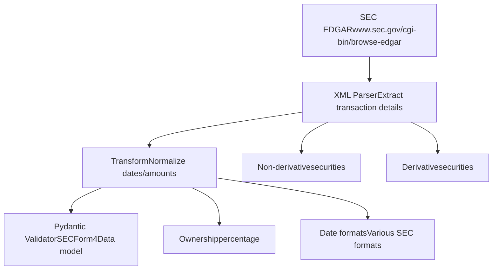
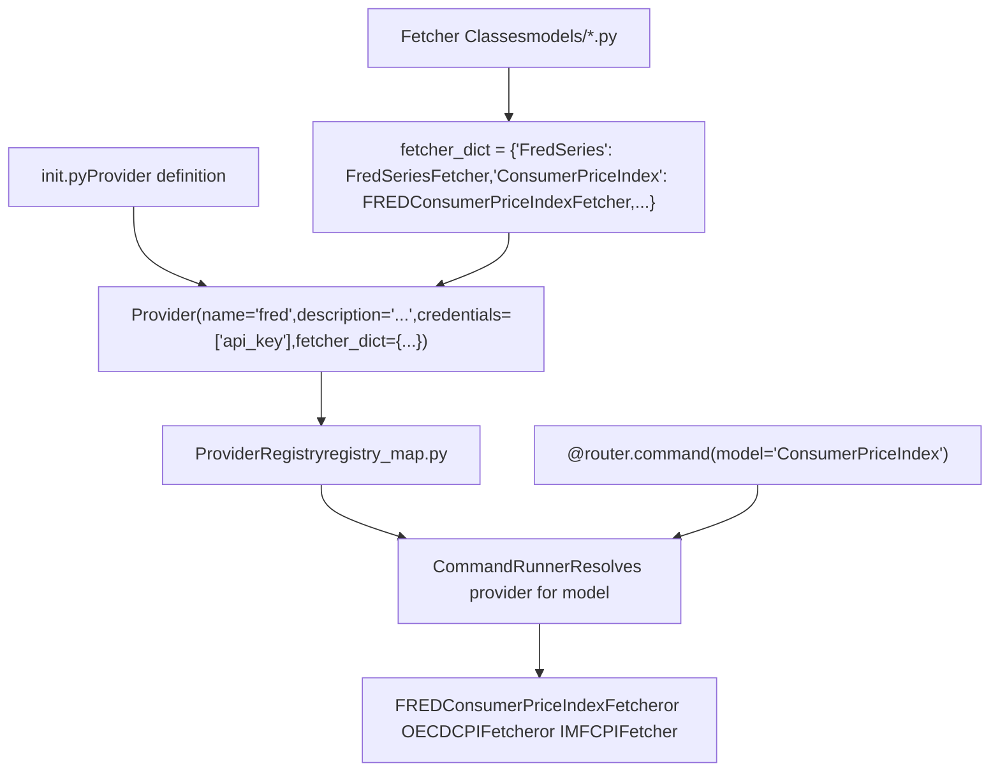

# 数据提供商

相关源文件

-   [cli/tests/test\_argparse\_translator\_obbject\_registry.py](https://github.com/OpenBB-finance/OpenBB/blob/dddc3b32/cli/tests/test_argparse_translator_obbject_registry.py)
-   [openbb\_platform/core/openbb\_core/api/app\_loader.py](https://github.com/OpenBB-finance/OpenBB/blob/dddc3b32/openbb_platform/core/openbb_core/api/app_loader.py)
-   [openbb\_platform/core/openbb\_core/api/exception\_handlers.py](https://github.com/OpenBB-finance/OpenBB/blob/dddc3b32/openbb_platform/core/openbb_core/api/exception_handlers.py)
-   [openbb\_platform/core/openbb\_core/api/rest\_api.py](https://github.com/OpenBB-finance/OpenBB/blob/dddc3b32/openbb_platform/core/openbb_core/api/rest_api.py)
-   [openbb\_platform/core/openbb\_core/api/router/coverage.py](https://github.com/OpenBB-finance/OpenBB/blob/dddc3b32/openbb_platform/core/openbb_core/api/router/coverage.py)
-   [openbb\_platform/core/openbb\_core/app/model/charts/chart.py](https://github.com/OpenBB-finance/OpenBB/blob/dddc3b32/openbb_platform/core/openbb_core/app/model/charts/chart.py)
-   [openbb\_platform/core/openbb\_core/app/provider\_interface.py](https://github.com/OpenBB-finance/OpenBB/blob/dddc3b32/openbb_platform/core/openbb_core/app/provider_interface.py)
-   [openbb\_platform/core/openbb\_core/app/router.py](https://github.com/OpenBB-finance/OpenBB/blob/dddc3b32/openbb_platform/core/openbb_core/app/router.py)
-   [openbb\_platform/core/openbb\_core/app/static/package\_builder.py](https://github.com/OpenBB-finance/OpenBB/blob/dddc3b32/openbb_platform/core/openbb_core/app/static/package_builder.py)
-   [openbb\_platform/core/openbb\_core/app/static/utils/filters.py](https://github.com/OpenBB-finance/OpenBB/blob/dddc3b32/openbb_platform/core/openbb_core/app/static/utils/filters.py)
-   [openbb\_platform/core/openbb\_core/app/utils.py](https://github.com/OpenBB-finance/OpenBB/blob/dddc3b32/openbb_platform/core/openbb_core/app/utils.py)
-   [openbb\_platform/core/openbb\_core/provider/registry\_map.py](https://github.com/OpenBB-finance/OpenBB/blob/dddc3b32/openbb_platform/core/openbb_core/provider/registry_map.py)
-   [openbb\_platform/core/openbb\_core/provider/standard\_models/company\_filings.py](https://github.com/OpenBB-finance/OpenBB/blob/dddc3b32/openbb_platform/core/openbb_core/provider/standard_models/company_filings.py)
-   [openbb\_platform/core/openbb\_core/provider/standard\_models/fred\_release\_table.py](https://github.com/OpenBB-finance/OpenBB/blob/dddc3b32/openbb_platform/core/openbb_core/provider/standard_models/fred_release_table.py)
-   [openbb\_platform/core/openbb\_core/provider/standard\_models/futures\_curve.py](https://github.com/OpenBB-finance/OpenBB/blob/dddc3b32/openbb_platform/core/openbb_core/provider/standard_models/futures_curve.py)
-   [openbb\_platform/core/openbb\_core/provider/standard\_models/primary\_dealer\_fails.py](https://github.com/OpenBB-finance/OpenBB/blob/dddc3b32/openbb_platform/core/openbb_core/provider/standard_models/primary_dealer_fails.py)
-   [openbb\_platform/core/openbb\_core/provider/standard\_models/yield\_curve.py](https://github.com/OpenBB-finance/OpenBB/blob/dddc3b32/openbb_platform/core/openbb_core/provider/standard_models/yield_curve.py)
-   [openbb\_platform/core/tests/app/model/charts/test\_chart.py](https://github.com/OpenBB-finance/OpenBB/blob/dddc3b32/openbb_platform/core/tests/app/model/charts/test_chart.py)
-   [openbb\_platform/core/tests/app/static/test\_filters.py](https://github.com/OpenBB-finance/OpenBB/blob/dddc3b32/openbb_platform/core/tests/app/static/test_filters.py)
-   [openbb\_platform/core/tests/app/static/test\_package\_builder.py](https://github.com/OpenBB-finance/OpenBB/blob/dddc3b32/openbb_platform/core/tests/app/static/test_package_builder.py)
-   [openbb\_platform/core/tests/app/test\_platform\_router.py](https://github.com/OpenBB-finance/OpenBB/blob/dddc3b32/openbb_platform/core/tests/app/test_platform_router.py)
-   [openbb\_platform/core/tests/app/test\_provider\_interface.py](https://github.com/OpenBB-finance/OpenBB/blob/dddc3b32/openbb_platform/core/tests/app/test_provider_interface.py)
-   [openbb\_platform/extensions/economy/integration/test\_economy\_api.py](https://github.com/OpenBB-finance/OpenBB/blob/dddc3b32/openbb_platform/extensions/economy/integration/test_economy_api.py)
-   [openbb\_platform/extensions/economy/integration/test\_economy\_python.py](https://github.com/OpenBB-finance/OpenBB/blob/dddc3b32/openbb_platform/extensions/economy/integration/test_economy_python.py)
-   [openbb\_platform/extensions/economy/openbb\_economy/economy\_router.py](https://github.com/OpenBB-finance/OpenBB/blob/dddc3b32/openbb_platform/extensions/economy/openbb_economy/economy_router.py)
-   [openbb\_platform/extensions/economy/openbb\_economy/survey/survey\_router.py](https://github.com/OpenBB-finance/OpenBB/blob/dddc3b32/openbb_platform/extensions/economy/openbb_economy/survey/survey_router.py)
-   [openbb\_platform/extensions/equity/integration/test\_equity\_api.py](https://github.com/OpenBB-finance/OpenBB/blob/dddc3b32/openbb_platform/extensions/equity/integration/test_equity_api.py)
-   [openbb\_platform/extensions/equity/integration/test\_equity\_python.py](https://github.com/OpenBB-finance/OpenBB/blob/dddc3b32/openbb_platform/extensions/equity/integration/test_equity_python.py)
-   [openbb\_platform/extensions/equity/openbb\_equity/fundamental/fundamental\_router.py](https://github.com/OpenBB-finance/OpenBB/blob/dddc3b32/openbb_platform/extensions/equity/openbb_equity/fundamental/fundamental_router.py)
-   [openbb\_platform/extensions/etf/integration/test\_etf\_api.py](https://github.com/OpenBB-finance/OpenBB/blob/dddc3b32/openbb_platform/extensions/etf/integration/test_etf_api.py)
-   [openbb\_platform/extensions/etf/integration/test\_etf\_python.py](https://github.com/OpenBB-finance/OpenBB/blob/dddc3b32/openbb_platform/extensions/etf/integration/test_etf_python.py)
-   [openbb\_platform/extensions/platform\_api/openbb\_platform\_api/assets/default\_apps.json](https://github.com/OpenBB-finance/OpenBB/blob/dddc3b32/openbb_platform/extensions/platform_api/openbb_platform_api/assets/default_apps.json)
-   [openbb\_platform/extensions/tests/test\_integration\_tests\_api.py](https://github.com/OpenBB-finance/OpenBB/blob/dddc3b32/openbb_platform/extensions/tests/test_integration_tests_api.py)
-   [openbb\_platform/extensions/tests/test\_integration\_tests\_python.py](https://github.com/OpenBB-finance/OpenBB/blob/dddc3b32/openbb_platform/extensions/tests/test_integration_tests_python.py)
-   [openbb\_platform/extensions/tests/utils/integration\_tests\_api\_generator.py](https://github.com/OpenBB-finance/OpenBB/blob/dddc3b32/openbb_platform/extensions/tests/utils/integration_tests_api_generator.py)
-   [openbb\_platform/extensions/tests/utils/integration\_tests\_testers.py](https://github.com/OpenBB-finance/OpenBB/blob/dddc3b32/openbb_platform/extensions/tests/utils/integration_tests_testers.py)
-   [openbb\_platform/obbject\_extensions/charting/tests/test\_charting.py](https://github.com/OpenBB-finance/OpenBB/blob/dddc3b32/openbb_platform/obbject_extensions/charting/tests/test_charting.py)
-   [openbb\_platform/providers/bls/openbb\_bls/utils/helpers.py](https://github.com/OpenBB-finance/OpenBB/blob/dddc3b32/openbb_platform/providers/bls/openbb_bls/utils/helpers.py)
-   [openbb\_platform/providers/cboe/openbb\_cboe/models/futures\_curve.py](https://github.com/OpenBB-finance/OpenBB/blob/dddc3b32/openbb_platform/providers/cboe/openbb_cboe/models/futures_curve.py)
-   [openbb\_platform/providers/cboe/tests/test\_cboe\_fetchers.py](https://github.com/OpenBB-finance/OpenBB/blob/dddc3b32/openbb_platform/providers/cboe/tests/test_cboe_fetchers.py)
-   [openbb\_platform/providers/federal\_reserve/openbb\_federal\_reserve/\_\_init\_\_.py](https://github.com/OpenBB-finance/OpenBB/blob/dddc3b32/openbb_platform/providers/federal_reserve/openbb_federal_reserve/__init__.py)
-   [openbb\_platform/providers/federal\_reserve/openbb\_federal\_reserve/assets/historical\_releases.json](https://github.com/OpenBB-finance/OpenBB/blob/dddc3b32/openbb_platform/providers/federal_reserve/openbb_federal_reserve/assets/historical_releases.json)
-   [openbb\_platform/providers/federal\_reserve/openbb\_federal\_reserve/models/fomc\_documents.py](https://github.com/OpenBB-finance/OpenBB/blob/dddc3b32/openbb_platform/providers/federal_reserve/openbb_federal_reserve/models/fomc_documents.py)
-   [openbb\_platform/providers/federal\_reserve/openbb\_federal\_reserve/models/primary\_dealer\_fails.py](https://github.com/OpenBB-finance/OpenBB/blob/dddc3b32/openbb_platform/providers/federal_reserve/openbb_federal_reserve/models/primary_dealer_fails.py)
-   [openbb\_platform/providers/federal\_reserve/openbb\_federal\_reserve/models/primary\_dealer\_positioning.py](https://github.com/OpenBB-finance/OpenBB/blob/dddc3b32/openbb_platform/providers/federal_reserve/openbb_federal_reserve/models/primary_dealer_positioning.py)
-   [openbb\_platform/providers/federal\_reserve/openbb\_federal\_reserve/utils/fomc\_documents.py](https://github.com/OpenBB-finance/OpenBB/blob/dddc3b32/openbb_platform/providers/federal_reserve/openbb_federal_reserve/utils/fomc_documents.py)
-   [openbb\_platform/providers/federal\_reserve/openbb\_federal\_reserve/utils/primary\_dealer\_statistics.py](https://github.com/OpenBB-finance/OpenBB/blob/dddc3b32/openbb_platform/providers/federal_reserve/openbb_federal_reserve/utils/primary_dealer_statistics.py)
-   [openbb\_platform/providers/federal\_reserve/tests/record/http/test\_federal\_reserve\_fetchers/test\_federal\_reserve\_fomc\_documents\_fetcher\_urllib3\_v2.yaml](https://github.com/OpenBB-finance/OpenBB/blob/dddc3b32/openbb_platform/providers/federal_reserve/tests/record/http/test_federal_reserve_fetchers/test_federal_reserve_fomc_documents_fetcher_urllib3_v2.yaml)
-   [openbb\_platform/providers/federal\_reserve/tests/record/http/test\_federal\_reserve\_fetchers/test\_federal\_reserve\_primary\_dealer\_fails\_fetcher\_urllib3\_v2.yaml](https://github.com/OpenBB-finance/OpenBB/blob/dddc3b32/openbb_platform/providers/federal_reserve/tests/record/http/test_federal_reserve_fetchers/test_federal_reserve_primary_dealer_fails_fetcher_urllib3_v2.yaml)
-   [openbb\_platform/providers/federal\_reserve/tests/test\_federal\_reserve\_fetchers.py](https://github.com/OpenBB-finance/OpenBB/blob/dddc3b32/openbb_platform/providers/federal_reserve/tests/test_federal_reserve_fetchers.py)
-   [openbb\_platform/providers/fmp/openbb\_fmp/\_\_init\_\_.py](https://github.com/OpenBB-finance/OpenBB/blob/dddc3b32/openbb_platform/providers/fmp/openbb_fmp/__init__.py)
-   [openbb\_platform/providers/fmp/openbb\_fmp/models/company\_filings.py](https://github.com/OpenBB-finance/OpenBB/blob/dddc3b32/openbb_platform/providers/fmp/openbb_fmp/models/company_filings.py)
-   [openbb\_platform/providers/fmp/pyproject.toml](https://github.com/OpenBB-finance/OpenBB/blob/dddc3b32/openbb_platform/providers/fmp/pyproject.toml)
-   [openbb\_platform/providers/fmp/tests/test\_fmp\_fetchers.py](https://github.com/OpenBB-finance/OpenBB/blob/dddc3b32/openbb_platform/providers/fmp/tests/test_fmp_fetchers.py)
-   [openbb\_platform/providers/fred/openbb\_fred/\_\_init\_\_.py](https://github.com/OpenBB-finance/OpenBB/blob/dddc3b32/openbb_platform/providers/fred/openbb_fred/__init__.py)
-   [openbb\_platform/providers/fred/openbb\_fred/models/manufacturing\_outlook\_ny.py](https://github.com/OpenBB-finance/OpenBB/blob/dddc3b32/openbb_platform/providers/fred/openbb_fred/models/manufacturing_outlook_ny.py)
-   [openbb\_platform/providers/fred/openbb\_fred/models/release\_table.py](https://github.com/OpenBB-finance/OpenBB/blob/dddc3b32/openbb_platform/providers/fred/openbb_fred/models/release_table.py)
-   [openbb\_platform/providers/fred/tests/record/http/test\_fred\_fetchers/test\_fred\_manufacturing\_outlook\_ny\_fetcher\_urllib3\_v2.yaml](https://github.com/OpenBB-finance/OpenBB/blob/dddc3b32/openbb_platform/providers/fred/tests/record/http/test_fred_fetchers/test_fred_manufacturing_outlook_ny_fetcher_urllib3_v2.yaml)
-   [openbb\_platform/providers/fred/tests/test\_fred\_fetchers.py](https://github.com/OpenBB-finance/OpenBB/blob/dddc3b32/openbb_platform/providers/fred/tests/test_fred_fetchers.py)
-   [openbb\_platform/providers/intrinio/openbb\_intrinio/\_\_init\_\_.py](https://github.com/OpenBB-finance/OpenBB/blob/dddc3b32/openbb_platform/providers/intrinio/openbb_intrinio/__init__.py)
-   [openbb\_platform/providers/intrinio/openbb\_intrinio/models/company\_filings.py](https://github.com/OpenBB-finance/OpenBB/blob/dddc3b32/openbb_platform/providers/intrinio/openbb_intrinio/models/company_filings.py)
-   [openbb\_platform/providers/intrinio/tests/test\_intrinio\_fetchers.py](https://github.com/OpenBB-finance/OpenBB/blob/dddc3b32/openbb_platform/providers/intrinio/tests/test_intrinio_fetchers.py)
-   [openbb\_platform/providers/sec/openbb\_sec/\_\_init\_\_.py](https://github.com/OpenBB-finance/OpenBB/blob/dddc3b32/openbb_platform/providers/sec/openbb_sec/__init__.py)
-   [openbb\_platform/providers/sec/openbb\_sec/utils/form4.py](https://github.com/OpenBB-finance/OpenBB/blob/dddc3b32/openbb_platform/providers/sec/openbb_sec/utils/form4.py)
-   [openbb\_platform/providers/sec/tests/test\_sec\_fetchers.py](https://github.com/OpenBB-finance/OpenBB/blob/dddc3b32/openbb_platform/providers/sec/tests/test_sec_fetchers.py)
-   [openbb\_platform/providers/tmx/openbb\_tmx/models/company\_filings.py](https://github.com/OpenBB-finance/OpenBB/blob/dddc3b32/openbb_platform/providers/tmx/openbb_tmx/models/company_filings.py)

本页介绍了 OpenBB 平台中的数据提供商系统。数据提供商是可插拔模块，实现了从外部 API 检索财务和经济数据的获取器 (fetchers)。平台包含 25+ 个提供商，涵盖了 FRED、Financial Modeling Prep (FMP)、Yahoo Finance、OECD、Intrinio 等来源。每个提供商在处理特定 API 的身份验证、速率限制和数据转换时，都遵循标准化的获取器模式。

有关如何通过扩展消费提供商的信息，请参阅 [数据扩展](/OpenBB-finance/OpenBB/3-data-extensions)。有关提供商注册机制和抽象基类的详细信息，请参阅 [提供商架构](/OpenBB-finance/OpenBB/2.3-provider-architecture)。

## 提供商生态系统

OpenBB 平台根据提供商提供的数据类型将其组织成职能类别。提供商是独立的软件包，可以单独安装，也可以作为 `openbb` 主聚合包的一部分安装。

### 提供商类别


**按类别的提供商分布**

| 类别 | 提供商 | 主要用例 |
| --- | --- | --- |
| 经济数据 | FRED, OECD, EconDB, Federal Reserve, IMF, BLS, TradingEconomics | GDP、CPI、失业率、利率、经济指标 |
| 财务数据 | FMP, Intrinio, Polygon, Tiingo, Benzinga | 基本面、公司申报文件、分析师评级、新闻 |
| 市场数据 | YFinance, AlphaVantage, Cboe, Nasdaq | 历史价格、期权链、市场统计、筛选器 |
| 监管与政府 | SEC, Congress Gov, Government US, CFTC | SEC 申报文件、国会交易、国债数据、商品期货 |
| 专业领域 | Finra, Finviz, WSJ, TMX, ECB | 交易报告、股票筛选、新闻、区域交易所 |

来源: [openbb\_platform/pyproject.toml1-119](https://github.com/OpenBB-finance/OpenBB/blob/dddc3b32/openbb_platform/pyproject.toml#L1-L119) [openbb\_platform/providers/fred/openbb\_fred/\_\_init\_\_.py1-120](https://github.com/OpenBB-finance/OpenBB/blob/dddc3b32/openbb_platform/providers/fred/openbb_fred/__init__.py#L1-L120) [openbb\_platform/providers/yfinance/openbb\_yfinance/\_\_init\_\_.py1-97](https://github.com/OpenBB-finance/OpenBB/blob/dddc3b32/openbb_platform/providers/yfinance/openbb_yfinance/__init__.py#L1-L97)

## 获取器 (Fetcher) 模式

所有提供商都实现了标准化的三阶段获取器生命周期。每个获取器都是一个带有 `transform_query`、`aextract_data` 和 `transform_data` 方法的类，用于处理查询规范化、数据提取和验证。

### 获取器生命周期

> **[Mermaid sequence]**
> *(图表结构无法解析)*

### 标准获取器实现

每个获取器都实现了带有三个必需方法的 `Fetcher` 抽象基类：


**方法职责**

| 方法 | 目的 | 操作示例 |
| --- | --- | --- |
| `transform_query` | 规范化并验证输入参数 | 将日期字符串转换为 datetime，验证代码格式，添加默认值 |
| `aextract_data` | 从外部 API 获取数据 | 构建 URL，添加身份验证标头，发起异步 HTTP 请求，处理分页 |
| `transform_data` | 解析并验证响应数据 | 提取相关字段，转换数据类型，映射到标准模型，使用 Pydantic 进行验证 |

来源: [openbb\_platform/providers/fred/openbb\_fred/models/series.py1-200](https://github.com/OpenBB-finance/OpenBB/blob/dddc3b32/openbb_platform/providers/fred/openbb_fred/models/series.py#L1-L200) [openbb\_core/openbb\_core/provider/abstract/fetcher.py1-100](https://github.com/OpenBB-finance/OpenBB/blob/dddc3b32/openbb_core/openbb_core/provider/abstract/fetcher.py#L1-L100)

## 经济数据提供商

经济数据提供商提供宏观经济指标、中央银行数据和政府统计数据。这些提供商通常提供具有各种频率（年度、季度、月度）和转换选项的时间序列数据。

### FRED 提供商

联邦储备经济数据 (FRED) 提供商是最全面的经济数据源，拥有 42 个获取器，涵盖货币政策、劳动力市场、价格和金融指标。

**FRED 获取器目录**

| 获取器 | 标准模型 | 描述 |
| --- | --- | --- |
| `FredSeriesFetcher` | `FredSeries` | 通过 ID 检索带有转换的 FRED 系列 |
| `FredSearchFetcher` | `FredSearch` | 通过系列 ID、标签或全文搜索 FRED 数据库 |
| `FredRegionalDataFetcher` | `FredRegional` | 按系列组划分的 GeoFRED 区域经济数据 |
| `FredReleaseTableFetcher` | `FredReleaseTable` | 按发布 ID 和元素划分的经济发布数据 |
| `FREDConsumerPriceIndexFetcher` | `ConsumerPriceIndex` | 按国家划分的 CPI 数据及频率选项 |
| `FredBalanceOfPaymentsFetcher` | `BalanceOfPayments` | 按国家划分的国际交易 |
| `FredNonFarmPayrollsFetcher` | `NonFarmPayrolls` | 按类别划分的就业统计数据 |
| `FREDCommercialPaperFetcher` | `CommercialPaper` | 按到期时间划分的商业票据利率 |
| `FREDSelectedTreasuryConstantMaturityFetcher` | `FFRMC` | 国债固定到期日利率 |
| `FredFederalFundsRateFetcher` | `FederalFundsRate` | 联邦基金有效利率和目标利率 |
| `FREDIORBFetcher` | `IORB` | 准备金余额利息 |
| `FREDDiscountWindowPrimaryCreditRateFetcher` | `DWPCR` | 贴现窗口利率 |
| `FredEuroShortTermRateFetcher` | `EuroShortTermRate` | €STR 隔夜利率 |
| `FREDEuropeanCentralBankInterestRatesFetcher` | `ECBInterestRates` | 欧洲央行政策利率 |
| `FredMortgageIndicesFetcher` | `MortgageIndices` | 抵押贷款利率指数 |
| `FredBondIndicesFetcher` | `BondIndices` | 债券指数表现 |
| `FredHighQualityMarketCorporateBondFetcher` | `HighQualityMarketCorporateBond` | 企业债券收益率 |
| `FredAmeriborFetcher` | `Ameribor` | AMERIBOR 基准利率 |
| `FredOvernightBankFundingRateFetcher` | `OvernightBankFundingRate` | OBFR 利率 |
| `FREDPROJECTIONFetcher` | `FedProjections` | FOMC 经济预测 |
| `FredCommoditySpotPricesFetcher` | `CommoditySpotPrices` | 商品现货价格 |
| `FredSofr...` | ... | 20+ 个附加获取器 |

**FRED 查询参数扩展**

FRED 获取器使用 API 特有的选项扩展了标准查询参数：

```python
# 标准参数
symbol: str
start_date: date | None
end_date: date | None
limit: int | None

# FRED 特有扩展
frequency: Literal["a", "q", "m", "w", "d"] | None  # 聚合频率
aggregation_method: Literal["avg", "sum", "eop"] | None  # 如何聚合
transform: Literal["chg", "ch1", "pch", "pc1", "pca", "cch", "cca", "log"] | None  # 数据转换
```
来源: [openbb\_platform/providers/fred/openbb\_fred/\_\_init\_\_.py1-120](https://github.com/OpenBB-finance/OpenBB/blob/dddc3b32/openbb_platform/providers/fred/openbb_fred/__init__.py#L1-L120) [openbb\_platform/providers/fred/tests/test\_fred\_fetchers.py1-400](https://github.com/OpenBB-finance/OpenBB/blob/dddc3b32/openbb_platform/providers/fred/tests/test_fred_fetchers.py#L1-L400)

### OECD 提供商

经济合作与发展组织 (OECD) 提供商通过其 SDMX API 访问国际经济统计数据。

**OECD 获取器实现**

```mermaid
flowchart TD
    GDP_Nom["OECDGdpNominalFetcherGDP at current prices"]
    GDP_Real["OECDGdpRealFetcherGDP at constant prices"]
    GDP_Forecast["OECDGdpForecastFetcherGDP growth projections"]
    CPI["OECDCPIFetcherConsumer price indices"]
    Unemployment["OECDUnemploymentFetcherUnemployment rates"]
    CLI["OECDCompositeLeadingIndicatorFetcherBusiness cycle indicators"]
    Interest["OecdCountryInterestRatesFetcherShort/long term rates"]
    Share["OECDSharePriceIndexFetcherStock market indices"]
    House["OECDHousePriceIndexFetcherResidential property prices"]
    SDMX["SDMX REST APIstats.oecd.org"]

    GDP --> Nom_SDMX
    GDP --> Real_SDMX
    GDP --> Forecast_SDMX
    CPI --> SDMX
    Unemployment --> SDMX
    CLI --> SDMX
    Interest --> SDMX
    Share --> SDMX
    House --> SDMX
```


**国家代码映射**

OECD 获取器将自然语言国家名称映射到 ISO 代码：

| 自然语言 | ISO 代码 | OECD 数据集 ID |
| --- | --- | --- |
| `united_states` | `USA` | 用于 SDMX 查询 |
| `united_kingdom` | `GBR` | 用于 SDMX 查询 |
| `japan` | `JPN` | 用于 SDMX 查询 |
| `all` | 所有国家 | 返回所有可用国家 |

来源: [openbb\_platform/providers/oecd/openbb\_oecd/models/gdp\_nominal.py1-150](https://github.com/OpenBB-finance/OpenBB/blob/dddc3b32/openbb_platform/providers/oecd/openbb_oecd/models/gdp_nominal.py#L1-L150) [openbb\_platform/providers/oecd/openbb\_oecd/utils/constants.py1-500](https://github.com/OpenBB-finance/OpenBB/blob/dddc3b32/openbb_platform/providers/oecd/openbb_oecd/utils/constants.py#L1-L500) [openbb\_platform/providers/oecd/tests/test\_oecd\_fetchers.py1-200](https://github.com/OpenBB-finance/OpenBB/blob/dddc3b32/openbb_platform/providers/oecd/tests/test_oecd_fetchers.py#L1-L200)

### EconDB 提供商

EconDB 提供具有统一代码系统的全球经济指标。

**EconDB 获取器结构**

| 获取器 | 端点 | 功能 |
| --- | --- | --- |
| `EconDbAvailableIndicatorsFetcher` | `/indicators/list` | 列出所有可用的指标代码 |
| `EconDbEconomicIndicatorsFetcher` | `/ticker` | 通过代码检索时间序列数据 |
| `EconDbCountryProfileFetcher` | `/country` | 国家层面的汇总统计数据 |
| `EconDbExportDestinationsFetcher` | `/exports` | 按国家划分的主要出口目的地 |

**EconDB 代码系统**

EconDB 使用分层代码格式：`{COUNTRY}_{INDICATOR}_{FREQUENCY}`

```
# 示例
"US_GDP_Q"      # 美国 GDP，季度
"UK_CPI_M"      # 英国 CPI，月度
"JP_UNEMP_M"    # 日本失业率，月度
"MAIN"          # 主要指标组
```
来源: [openbb\_platform/providers/econdb/openbb\_econdb/\_\_init\_\_.py1-50](https://github.com/OpenBB-finance/OpenBB/blob/dddc3b32/openbb_platform/providers/econdb/openbb_econdb/__init__.py#L1-L50) [openbb\_platform/providers/econdb/tests/test\_econdb\_fetchers.py1-100](https://github.com/OpenBB-finance/OpenBB/blob/dddc3b32/openbb_platform/providers/econdb/tests/test_econdb_fetchers.py#L1-L100)

### Federal Reserve 提供商

Federal Reserve 提供商访问联邦储备系统的数据，包括 SOMA 持仓和一级交易商统计数据。

**Federal Reserve 获取器**

| 获取器 | 数据源 | 描述 |
| --- | --- | --- |
| `FederalReserveCentralBankHoldingsFetcher` | SOMA 持仓 | 美联储持有的国债和机构证券 |
| `FederalReserveFederalFundsRateFetcher` | H.15 发布 | 联邦基金利率历史数据 |
| `FederalReserveMoneyMeasuresFetcher` | H.6 发布 | M1, M2 货币总量 |
| `FederalReservePrimaryDealerPositioningFetcher` | 一级交易商统计 | 按资产类别划分的交易商头寸 |
| `FederalReservePrimaryDealerFailsFetcher` | 一级交易商统计 | 交付/接收结算失败 |

**SOMA 持仓示例**

```python
# 查询参数
date: date | None = None  # 特定日期或最新日期
holding_type: Literal[
    "all_treasury",
    "treasury_bills",
    "treasury_notes_bonds",
    "all_agency",
    "agency_debts",
    "agency_mbs"
] = "all_treasury"
summary: bool = False  # 摘要或详细持仓
monthly: bool = False  # 月度汇总
cusip: str | None = None  # 按 CUSIP 过滤
wam: bool = False  # 加权平均到期时间
```
来源: [openbb\_platform/providers/federal\_reserve/openbb\_federal\_reserve/\_\_init\_\_.py1-50](https://github.com/OpenBB-finance/OpenBB/blob/dddc3b32/openbb_platform/providers/federal_reserve/openbb_federal_reserve/__init__.py#L1-L50) [openbb\_platform/providers/federal\_reserve/tests/test\_federal\_reserve\_fetchers.py1-150](https://github.com/OpenBB-finance/OpenBB/blob/dddc3b32/openbb_platform/providers/federal_reserve/tests/test_federal_reserve_fetchers.py#L1-L150)

### IMF 提供商

国际货币基金组织提供商通过其 SDMX API 访问 IMF 数据。

**IMF 数据访问模式**

IMF 数据按数据流和维度组织：

```
# 代码格式: DATAFLOW::INDICATOR[.DIMENSION1.DIMENSION2]
"IL::RGV_REVS"              # 黄金储备 (盎司)
"DIP::H_DIP_INDICATOR"      # 直接投资头寸表
"IFS::PMP_IX"               # 生产者价格指数
```
该提供商支持将多维数据透视为宽格式表，以便于展示。

来源: [openbb\_platform/extensions/economy/integration/test\_economy\_python.py564-596](https://github.com/OpenBB-finance/OpenBB/blob/dddc3b32/openbb_platform/extensions/economy/integration/test_economy_python.py#L564-L596)

## 财务数据提供商

财务数据提供商为股票和其他证券提供基本面数据、公司申报文件、分析师评级和新闻。

### FMP 提供商

Financial Modeling Prep (FMP) 是一个综合提供商，拥有 60+ 个获取器，涵盖基本面、申报文件、所有权和市场数据。

**FMP 获取器类别**

```mermaid
flowchart TD
    BalanceSheet["FMPBalanceSheetFetcher"]
    IncomeStatement["FMPIncomeStatementFetcher"]
    CashFlow["FMPCashFlowStatementFetcher"]
    KeyMetrics["FMPKeyMetricsFetcher"]
    FinancialRatios["FMPFinancialRatiosFetcher"]
    CompanyFilings["FMPCompanyFilingsFetcherSEC 10-K, 10-Q, 8-K"]
    InsiderTrading["FMPInsiderTradingFetcher"]
    InstitutionalOwnership["FMPInstitutionalOwnershipFetcher"]
    Historical["FMPHistoricalFetcher"]
    Quote["FMPQuoteFetcher"]
    Calendar["FMPEconomicCalendarFetcher"]
    DCF["FMPDiscountedCashFlowFetcher"]
    RiskPremium["FMPRiskPremiumFetcher"]
    AnalystEstimates["FMPAnalystEstimatesFetcher"]
    API["api.financialmodelingprep.com/v3"]

    BalanceSheet --> API
    IncomeStatement --> API
    CashFlow --> API
    CompanyFilings --> API
    InsiderTrading --> API
    Historical --> API
    DCF --> API
```


**FMP 查询扩展**

FMP 获取器添加了大量的提供商特有参数：

```python
# 资产负债表示例
period: Literal["annual", "quarter"] = "annual"
limit: int = 5
cik: str | None = None  # SEC CIK 标识符，作为代码的替代方案

# 公司申报文件示例
form_type: Literal["10-K", "10-Q", "8-K", ...] | None = None
page: int = 0
```
来源: [openbb\_platform/providers/fmp/openbb\_fmp/models/company\_filings.py1-200](https://github.com/OpenBB-finance/OpenBB/blob/dddc3b32/openbb_platform/providers/fmp/openbb_fmp/models/company_filings.py#L1-L200)

### Intrinio 提供商

Intrinio 专注于带有 NLP 提取数据的公司申报文件和基本面指标。

**Intrinio 获取器功能**

| 获取器 | 标准模型 | 提供商特有功能 |
| --- | --- | --- |
| `IntrinioCompanyFilingsFetcher` | `CompanyFilings` | 全文搜索、NLP 标签 |
| `IntrinioBalanceSheetFetcher` | `BalanceSheet` | 原始报告和标准化的 |
| `IntrinioIncomeStatementFetcher` | `IncomeStatement` | XBRL 标签提取 |
| `IntrinioOwnershipFetcher` | `InstitutionalOwnership` | 13F 申报处理 |
| `IntrinioOptionChainFetcher` | `OptionChain` | 实时期权数据 |

**Intrinio 申报文件搜索**

```python
# 查询参数
symbol: str
start_date: date | None = None
end_date: date | None = None
thea_enabled: bool | None = None  # 使用 Thea NLP 引擎
# 提供商特有
form_type: str | None = None  # 按 SEC 表格过滤
all_pages: bool = False  # 遍历所有结果分页
```
来源: [openbb\_platform/providers/intrinio/openbb\_intrinio/models/company\_filings.py1-150](https://github.com/OpenBB-finance/OpenBB/blob/dddc3b32/openbb_platform/providers/intrinio/openbb_intrinio/models/company_filings.py#L1-L150)

### SEC 提供商

SEC 提供商处理 SEC EDGAR 申报文件，并对 Form 4 内幕交易进行专门处理。

**SEC Form 4 处理**


SEC 提供商解析 XML 申报文件并提取结构化的交易数据，包括交易类型、股数、价格和交易后所有权。

来源: [openbb\_platform/providers/sec/openbb\_sec/models/institutions\_search.py1-100](https://github.com/OpenBB-finance/OpenBB/blob/dddc3b32/openbb_platform/providers/sec/openbb_sec/models/institutions_search.py#L1-L100)

## 市场数据提供商

市场数据提供商提供历史价格、报价、期权链和市场筛选功能。

### YFinance 提供商

Yahoo Finance (YFinance) 是一个全面的免费数据源，拥有 30+ 个获取器。

**YFinance 获取器目录**


**YFinance 筛选器功能**

YFinance 提供预定义和自定义的股票筛选器：

**预定义筛选器**

```python
PREDEFINED_SCREENERS = [
    "aggressive_small_caps",
    "day_gainers",
    "day_losers",
    "growth_technology_stocks",
    "most_actives",
    "most_shorted_stocks",
    "small_cap_gainers",
    "undervalued_growth_stocks",
    "undervalued_large_caps",
    # 基金筛选器
    "conservative_foreign_funds",
    "high_yield_bond",
    "portfolio_anchors",
    "solid_large_growth_funds",
    "solid_midcap_growth_funds",
    "top_mutual_funds",
]
```
**自定义筛选器正文结构**

自定义筛选器接受带有过滤条件的 JSON 正文：

```json
{
    "offset": 0,
    "size": 250,
    "sortField": "percentchange",
    "sortType": "desc",
    "quoteType": "equity",
    "query": {
        "operator": "and",
        "operands": [
            {"operator": "gt", "operands": ["marketcap", 1000000000]},
            {"operator": "lt", "operands": ["pe", 20]},
        ]
    },
    "userId": "",
    "userIdType": "guid"
}
```
筛选器返回 25+ 个字段，包括价格、成交量、市值、市盈率、股息收益率和技术指标。

来源: [openbb\_platform/providers/yfinance/openbb\_yfinance/utils/helpers.py30-144](https://github.com/OpenBB-finance/OpenBB/blob/dddc3b32/openbb_platform/providers/yfinance/openbb_yfinance/utils/helpers.py#L30-L144) [openbb\_platform/providers/yfinance/tests/test\_yfinance\_fetchers.py1-300](https://github.com/OpenBB-finance/OpenBB/blob/dddc3b32/openbb_platform/providers/yfinance/tests/test_yfinance_fetchers.py#L1-L300)

## 提供商注册和发现

提供商通过 `Provider` 类和 `fetcher_dict` 映射系统向平台注册其获取器。

### 注册机制


**提供商类定义**

每个提供商包都会导出一个 `Provider` 实例：

```python
# openbb_fred/__init__.py
fred_provider = Provider(
    name="fred",
    website="https://fred.stlouisfed.org",
    description="Federal Reserve Economic Data",
    credentials=["api_key"],
    fetcher_dict={
        "FredSeries": FredSeriesFetcher,
        "ConsumerPriceIndex": FREDConsumerPriceIndexFetcher,
        "BalanceOfPayments": FredBalanceOfPaymentsFetcher,
        "NonFarmPayrolls": FredNonFarmPayrollsFetcher,
        # ... 还有 38 个获取器
    },
    repr_name="FRED",
)
```
**入口点注册**

提供商通过 Poetry 插件系统注册：

```toml
# pyproject.toml
[tool.poetry.plugins."openbb_provider_extension"]
fred = "openbb_fred:fred_provider"
```
来源: [openbb\_platform/providers/fred/openbb\_fred/\_\_init\_\_.py1-120](https://github.com/OpenBB-finance/OpenBB/blob/dddc3b32/openbb_platform/providers/fred/openbb_fred/__init__.py#L1-L120) [openbb\_platform/providers/fred/pyproject.toml1-30](https://github.com/OpenBB-finance/OpenBB/blob/dddc3b32/openbb_platform/providers/fred/pyproject.toml#L1-L30)

### 标准模型

标准模型定义了提供商与扩展之间的接口合约。每个模型指定了所有提供商实现必须提供的必需字段。

**模型层级**


**标准字段 vs 提供商特有字段**

| 字段类型 | 位置 | 目的 | 示例 |
| --- | --- | --- | --- |
| 标准 | `StandardParams` | 所有提供商通用 | `symbol`, `start_date`, `end_date` |
| 提供商 | `ExtraParams` | 提供商特有的选项 | FRED: `frequency`, `transform`
FMP: `period`, `cik` |
| 标准数据 | 基础 `Data` 模型 | 始终返回 | `date`, `value` |
| 额外数据 | 提供商 `Data` 模型 | 提供商特有的字段 | FRED: 系列元数据
FMP: 财务周期标签 |

**示例：多个 CPI 提供商**

扩展可以将相同的请求路由到不同的提供商：

```python
# 使用 FRED
obb.economy.cpi(country="united_states", provider="fred")

# 使用 OECD
obb.economy.cpi(country="united_states", provider="oecd")

# 使用 IMF
obb.economy.cpi(country="canada", provider="imf")
```
每个提供商都实现了相同的 `ConsumerPriceIndex` 标准模型，但具有不同的 API 源和提供商特有参数。

来源: [openbb\_platform/extensions/economy/integration/test\_economy\_python.py62-113](https://github.com/OpenBB-finance/OpenBB/blob/dddc3b32/openbb_platform/extensions/economy/integration/test_economy_python.py#L62-L113)

## 提供商开发

### 创建新提供商

提供商是具有标准结构的独立软件包：

```
openbb_platform/providers/{provider_name}/
├── openbb_{provider_name}/
│   ├── __init__.py           # 提供商注册
│   ├── models/
│   │   ├── model1.py         # 获取器实现
│   │   └── model2.py
│   └── utils/
│       ├── helpers.py        # API 实用工具
│       └── constants.py
├── tests/
│   └── test_{provider_name}_fetchers.py
├── pyproject.toml            # 包元数据
└── README.md
```
**最小提供商包**

```python
# openbb_{provider}/__init__.py
from openbb_core.provider.abstract.provider import Provider
from openbb_{provider}.models.example import ExampleFetcher

{provider}_provider = Provider(
    name="{provider}",
    website="https://example.com",
    description="Provider description",
    credentials=["api_key"],  # 如果不需要身份验证则为 []
    fetcher_dict={
        "StandardModelName": ExampleFetcher,
    },
    repr_name="Provider Display Name",
)
```
**获取器模板**

```python
# openbb_{provider}/models/example.py
from openbb_core.provider.abstract.fetcher import Fetcher
from pydantic import BaseModel

class ExampleQueryParams(BaseModel):
    """查询参数。"""
    symbol: str
    # 添加提供商特有的参数

class ExampleData(BaseModel):
    """结果数据。"""
    date: str
    value: float
    # 添加提供商特有的字段

class ExampleFetcher(
    Fetcher[ExampleQueryParams, list[ExampleData]]):
    """获取器实现。"""

    @staticmethod
    def transform_query(params: dict) -> ExampleQueryParams:
        """规范化参数。"""
        return ExampleQueryParams(**params)

    @staticmethod
    async def aextract_data(
        query: ExampleQueryParams,
        credentials: dict | None,
        **kwargs
    ) -> list[dict]:
        """从 API 获取。"""
        # 发起 HTTP 请求
        # 返回字典列表

    @staticmethod
    def transform_data(
        query: ExampleQueryParams,
        data: list[dict],
        **kwargs
    ) -> list[ExampleData]:
        """解析并验证。"""
        return [ExampleData(**item) for item in data]
```
来源: [openbb\_platform/providers/yfinance/pyproject.toml1-21](https://github.com/OpenBB-finance/OpenBB/blob/dddc3b32/openbb_platform/providers/yfinance/pyproject.toml#L1-L21) [openbb\_platform/dev\_install.py1-200](https://github.com/OpenBB-finance/OpenBB/blob/dddc3b32/openbb_platform/dev_install.py#L1-L200)

### 本地开发设置

`dev_install.py` 脚本通过可编辑的包安装配置本地开发环境：

**开发安装**

```bash
# 从 openbb_platform/
python dev_install.py

# 这会进行转换：
# openbb-fred = "^1.5.1"
# 变为：
# openbb-fred = { path = "./providers/fred", develop = true }
```
该脚本修改了 [openbb\_platform/pyproject.toml11-54](https://github.com/OpenBB-finance/OpenBB/blob/dddc3b32/openbb_platform/pyproject.toml#L11-L54)，使用带有 `develop=true` 的路径依赖，允许代码更改立即反映在运行中而无需重新安装。

**测试提供商**

提供商测试遵循标准模式：

```python
# tests/test_{provider}_fetchers.py
import pytest
from openbb_core.app.service.user_service import UserService
from openbb_{provider}.models.example import ExampleFetcher

@pytest.fixture(scope="module")
def credentials():
    return UserService().default_user_settings.credentials.model_dump()

@pytest.mark.record_http
def test_example_fetcher(credentials):
    params = {"symbol": "AAPL"}
    fetcher = ExampleFetcher()
    result = fetcher.test(params, credentials)
    assert result.results
```
测试使用带有 VCR 磁带的 `pytest-recording` 来记录 HTTP 交互，从而实现在不进行 API 调用的情况下进行可重复测试。

来源: [openbb\_platform/dev\_install.py1-200](https://github.com/OpenBB-finance/OpenBB/blob/dddc3b32/openbb_platform/dev_install.py#L1-L200) [openbb\_platform/providers/fred/tests/test\_fred\_fetchers.py1-400](https://github.com/OpenBB-finance/OpenBB/blob/dddc3b32/openbb_platform/providers/fred/tests/test_fred_fetchers.py#L1-L400)
