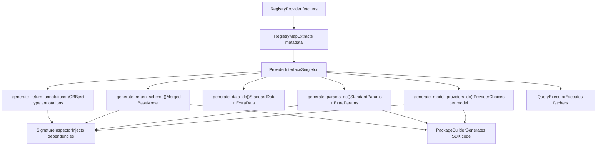
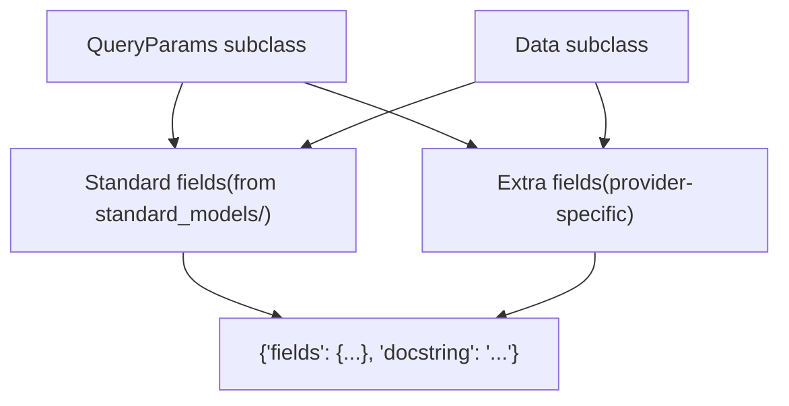
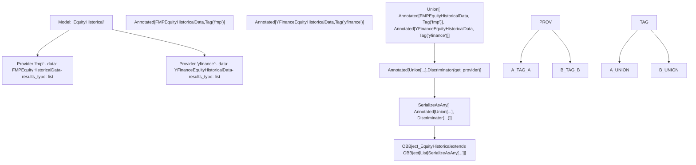

# 提供程序接口与集成

相关源文件

-   [cli/tests/test_argparse_translator_obbject_registry.py](https://github.com/OpenBB-finance/OpenBB/blob/dddc3b32/cli/tests/test_argparse_translator_obbject_registry.py)
-   [openbb_platform/core/openbb_core/api/app_loader.py](https://github.com/OpenBB-finance/OpenBB/blob/dddc3b32/openbb_platform/core/openbb_core/api/app_loader.py)
-   [openbb_platform/core/openbb_core/api/exception_handlers.py](https://github.com/OpenBB-finance/OpenBB/blob/dddc3b32/openbb_platform/core/openbb_core/api/exception_handlers.py)
-   [openbb_platform/core/openbb_core/api/rest_api.py](https://github.com/OpenBB-finance/OpenBB/blob/dddc3b32/openbb_platform/core/openbb_core/api/rest_api.py)
-   [openbb_platform/core/openbb_core/api/router/coverage.py](https://github.com/OpenBB-finance/OpenBB/blob/dddc3b32/openbb_platform/core/openbb_core/api/router/coverage.py)
-   [openbb_platform/core/openbb_core/app/provider_interface.py](https://github.com/OpenBB-finance/OpenBB/blob/dddc3b32/openbb_platform/core/openbb_core/app/provider_interface.py)
-   [openbb_platform/core/openbb_core/app/router.py](https://github.com/OpenBB-finance/OpenBB/blob/dddc3b32/openbb_platform/core/openbb_core/app/router.py)
-   [openbb_platform/core/openbb_core/app/static/package_builder.py](https://github.com/OpenBB-finance/OpenBB/blob/dddc3b32/openbb_platform/core/openbb_core/app/static/package_builder.py)
-   [openbb_platform/core/openbb_core/app/static/utils/filters.py](https://github.com/OpenBB-finance/OpenBB/blob/dddc3b32/openbb_platform/core/openbb_core/app/static/utils/filters.py)
-   [openbb_platform/core/openbb_core/app/utils.py](https://github.com/OpenBB-finance/OpenBB/blob/dddc3b32/openbb_platform/core/openbb_core/app/utils.py)
-   [openbb_platform/core/openbb_core/provider/registry_map.py](https://github.com/OpenBB-finance/OpenBB/blob/dddc3b32/openbb_platform/core/openbb_core/provider/registry_map.py)
-   [openbb_platform/core/openbb_core/provider/standard_models/fred_release_table.py](https://github.com/OpenBB-finance/OpenBB/blob/dddc3b32/openbb_platform/core/openbb_core/provider/standard_models/fred_release_table.py)
-   [openbb_platform/core/openbb_core/provider/standard_models/futures_curve.py](https://github.com/OpenBB-finance/OpenBB/blob/dddc3b32/openbb_platform/core/openbb_core/provider/standard_models/futures_curve.py)
-   [openbb_platform/core/openbb_core/provider/standard_models/yield_curve.py](https://github.com/OpenBB-finance/OpenBB/blob/dddc3b32/openbb_platform/core/openbb_core/provider/standard_models/yield_curve.py)
-   [openbb_platform/core/tests/app/static/test_filters.py](https://github.com/OpenBB-finance/OpenBB/blob/dddc3b32/openbb_platform/core/tests/app/static/test_filters.py)
-   [openbb_platform/core/tests/app/static/test_package_builder.py](https://github.com/OpenBB-finance/OpenBB/blob/dddc3b32/openbb_platform/core/tests/app/static/test_package_builder.py)
-   [openbb_platform/core/tests/app/test_platform_router.py](https://github.com/OpenBB-finance/OpenBB/blob/dddc3b32/openbb_platform/core/tests/app/test_platform_router.py)
-   [openbb_platform/core/tests/app/test_provider_interface.py](https://github.com/OpenBB-finance/OpenBB/blob/dddc3b32/openbb_platform/core/tests/app/test_provider_interface.py)
-   [openbb_platform/obbject_extensions/charting/tests/test_charting.py](https://github.com/OpenBB-finance/OpenBB/blob/dddc3b32/openbb_platform/obbject_extensions/charting/tests/test_charting.py)
-   [openbb_platform/providers/bls/openbb_bls/utils/helpers.py](https://github.com/OpenBB-finance/OpenBB/blob/dddc3b32/openbb_platform/providers/bls/openbb_bls/utils/helpers.py)
-   [openbb_platform/providers/cboe/openbb_cboe/models/futures_curve.py](https://github.com/OpenBB-finance/OpenBB/blob/dddc3b32/openbb_platform/providers/cboe/openbb_cboe/models/futures_curve.py)
-   [openbb_platform/providers/cboe/tests/test_cboe_fetchers.py](https://github.com/OpenBB-finance/OpenBB/blob/dddc3b32/openbb_platform/providers/cboe/tests/test_cboe_fetchers.py)
-   [openbb_platform/providers/fred/openbb_fred/models/release_table.py](https://github.com/OpenBB-finance/OpenBB/blob/dddc3b32/openbb_platform/providers/fred/openbb_fred/models/release_table.py)

## 目的与范围

本文档提供了对 `ProviderInterface` 类及其在 OpenBB 平台提供程序系统中的角色的详细技术解释。`ProviderInterface` 是一个单例，它将来自注册表的提供程序元数据转换为运行时生成的 dataclass 和 Pydantic 模型，从而驱动平台的动态类型系统。

有关提供程序架构和三阶段 fetcher 模式的高层概述，请参阅 [Provider Architecture](/OpenBB-finance/OpenBB/2.3-provider-architecture)。有关特定提供程序实现的详细信息，请参阅 [Economic Data Providers](/OpenBB-finance/OpenBB/4.2-economic-data-providers)、[Financial Data Providers](/OpenBB-finance/OpenBB/4.3-financial-data-providers) 和 [Additional Providers](/OpenBB-finance/OpenBB/4.4-additional-providers)。

**来源：** [openbb_platform/core/openbb_core/app/provider_interface.py1-742](https://github.com/OpenBB-finance/OpenBB/blob/dddc3b32/openbb_platform/core/openbb_core/app/provider_interface.py#L1-L742)

---

## 架构概述

`ProviderInterface` 位于提供程序注册表、路由系统和包构建器（package builder）的交汇处。它消费来自 `RegistryMap` 的元数据，并生成注入到命令函数中并用于生成 Python SDK 的运行时类型。

### 系统上下文图


**来源：** [openbb_platform/core/openbb_core/app/provider_interface.py70-173](https://github.com/OpenBB-finance/OpenBB/blob/dddc3b32/openbb_platform/core/openbb_core/app/provider_interface.py#L70-L173) [openbb_platform/core/openbb_core/app/router.py227-296](https://github.com/OpenBB-finance/OpenBB/blob/dddc3b32/openbb_platform/core/openbb_core/app/router.py#L227-L296) [openbb_platform/core/openbb_core/app/static/package_builder.py240-283](https://github.com/OpenBB-finance/OpenBB/blob/dddc3b32/openbb_platform/core/openbb_core/app/static/package_builder.py#L240-L283)

---

## 核心组件

### ProviderInterface 类

`ProviderInterface` 实现为一个单例元类，在整个应用程序生命周期中维护单个实例。它使用 `RegistryMap`（解析提供程序注册表）和 `QueryExecutor` 类引用进行初始化。

| 属性 | 类型 | 描述 |
| --- | --- | --- |
| `map` | `MapType` | 提供程序元数据的嵌套字典：`{model: {provider: {QueryParams: {...}, Data: {...}}}}` |
| `credentials` | `dict[str, list[str]]` | 提供程序名称到所需凭据密钥的映射 |
| `model_providers` | `dict[str, ProviderChoices]` | 包含每个模型 `Literal` 提供程序选项的 dataclass |
| `params` | `dict[str, dict[str, StandardParams | ExtraParams]]` | 每个模型的标准和额外参数 dataclass |
| `data` | `dict[str, dict[str, StandardData | ExtraData]]` | 每个模型的标准和额外数据模型 |
| `return_schema` | `dict[str, type[BaseModel]]` | 用于 FastAPI 响应模型的合并数据架构 |
| `return_annotations` | `dict[str, type[OBBject]]` | 带有判别联合（discriminated unions）的 OBBject 类型注解 |
| `available_providers` | `list[str]` | 所有已安装提供程序名称的列表（排除 "openbb"） |
| `provider_choices` | `type` | 包含所有提供程序名称作为 `Literal` 的全局 dataclass |
| `models` | `list[str]` | 所有可用模型名称的列表（例如 "EquityHistorical"） |

**来源：** [openbb_platform/core/openbb_core/app/provider_interface.py98-169](https://github.com/OpenBB-finance/OpenBB/blob/dddc3b32/openbb_platform/core/openbb_core/app/provider_interface.py#L98-L169)

### RegistryMap 输入

`RegistryMap` 解析提供程序注册表，以从每个提供程序的 fetcher 中提取标准和额外字段。它将标准模型（位于 `openbb_core/provider/standard_models/`）中定义的字段与提供程序特定的字段分开。


**来源：** [openbb_platform/core/openbb_core/provider/registry_map.py71-106](https://github.com/OpenBB-finance/OpenBB/blob/dddc3b32/openbb_platform/core/openbb_core/provider/registry_map.py#L71-L106) [openbb_platform/core/openbb_core/provider/registry_map.py142-181](https://github.com/OpenBB-finance/OpenBB/blob/dddc3b32/openbb_platform/core/openbb_core/provider/registry_map.py#L142-L181)

### 生成的运行时类型

`ProviderInterface` 生成五类运行时类型：

1.  **ProviderChoices dataclasses**：为每个模型包含单个字段 `provider: Literal["provider_a", "provider_b", ...]`
2.  **StandardParams dataclasses**：包含标准模型的 `QueryParams` 中定义的字段，并合并了描述
3.  **ExtraParams dataclasses**：包含标记为可选的提供程序特定查询参数
4.  **StandardData/ExtraData Pydantic models**：响应数据字段的类似划分
5.  **OBBject type annotations**：带有判别联合的参数化 `OBBject[Union[...]]` 类型

**来源：** [openbb_platform/core/openbb_core/app/provider_interface.py500-574](https://github.com/OpenBB-finance/OpenBB/blob/dddc3b32/openbb_platform/core/openbb_core/app/provider_interface.py#L500-L574)

---

## 参数合并过程

当多个提供程序实现同一个模型时，`ProviderInterface` 必须智能地合并它们的字段定义。此过程处理标准字段（由提供程序重新定义并带有额外详细信息）和额外字段（特定提供程序特有）。

### 字段合并逻辑

```mermaid
flowchart TD
    START["For each provider's QueryParams"]
    IS_STANDARD["Field exists instandard model?"]
    STANDARD_FLOW["Standard field path"]
    CHECK_DESC["Description differsfrom standard?"]
    MERGE_STD["_merge_fields()Combine descriptions"]
    SKIP["Keep standard only"]
    EXTRA_FLOW["Extra field path"]
    FORCE_OPT["Create withforce_optional=True"]
    EXISTS["Field already inExtraParams?"]
    MERGE_EXTRA["_merge_fields()Combine from providers"]
    ADD["Add to ExtraParams"]

    START --> IS_STANDARD
    IS --> STANDARD_STANDARD_FLOW
    IS --> STANDARD_EXTRA_FLOW
    STANDARD --> FLOW_CHECK_DESC
    CHECK --> DESC_MERGE_STD
    CHECK --> DESC_SKIP
    EXTRA --> FLOW_FORCE_OPT
    FORCE --> OPT_EXISTS
    EXISTS --> MERGE_EXTRA
    EXISTS --> ADD
```


**来源：** [openbb_platform/core/openbb_core/app/provider_interface.py372-446](https://github.com/OpenBB-finance/OpenBB/blob/dddc3b32/openbb_platform/core/openbb_core/app/provider_interface.py#L372-L446)

### 合并算法详细信息

`_merge_fields()` 方法通过以下方式组合两个 `DataclassField` 实例：

1.  **类型合并**：如果类型不同，则创建 `Union[type1, type2]`
2.  **描述合并**：
    -   如果描述相似度超过 80%（通过 `SequenceMatcher`），则使用带有提供程序列表的描述：`"Description (provider: fmp,intrinio)"`
    -   否则，进行拼接：`"Desc1;\n Desc2"`
3.  **json_schema_extra 合并**：合并来自两个字段的列表（如 `choices`）和字典（如 `x-widget_config`）
4.  **默认值处理**：使用第一个字段的默认值

**来源：** [openbb_platform/core/openbb_core/app/provider_interface.py175-242](https://github.com/OpenBB-finance/OpenBB/blob/dddc3b32/openbb_platform/core/openbb_core/app/provider_interface.py#L175-L242)

---

## 选项验证与自动推导

最近更新中添加的一个关键功能是从 `Literal` 类型注解中自动推导参数选项。这可以防止当用户传递一个恰好匹配合并默认值的无效值时发生的静默数据损坏。

### 选项自动推导流程

**代码示例：**

```python
# 在提供程序的 QueryParams 类中：
class OECDBalanceOfPaymentsQueryParams(BalanceOfPaymentsQueryParams):
    frequency: Literal["annual", "quarterly"] = Field(default="quarterly")
```
`_create_field()` 方法会检测此 `Literal` 注解并自动生成：

```python
json_schema_extra = {
    "oecd": {
        "choices": ["annual", "quarterly"]
    }
}
```
这允许 `filter_inputs()` 在实例化合并的 `ExtraParams` dataclass **之前**，验证用户的值是否在允许的集合中，从而捕获诸如向仅支持 "annual" 或 "quarterly" 的提供程序传递 "monthly" 之类的错误。

**来源：** [openbb_platform/core/openbb_core/app/provider_interface.py289-308](https://github.com/OpenBB-finance/OpenBB/blob/dddc3b32/openbb_platform/core/openbb_core/app/provider_interface.py#L289-L308) [openbb_platform/core/tests/app/static/test_filters.py73-227](https://github.com/OpenBB-finance/OpenBB/blob/dddc3b32/openbb_platform/core/tests/app/static/test_filters.py#L73-L227)

---

## 数据架构生成

与参数合并类似，`ProviderInterface` 通过组合实现模型的所有提供程序的标准和额外数据字段来生成数据架构。

### 数据架构结构

| 组件 | 类型 | 用途 |
| --- | --- | --- |
| `StandardData` | Pydantic `BaseModel` | 标准模型的 `Data` 类中定义的字段 |
| `ExtraData` | Pydantic `BaseModel` | 提供程序特定的数据字段，均为可选 |
| `return_schema[model]` | 合并的 `BaseModel` | 用于 FastAPI 响应验证的组合架构 |

合并的返回架构通过以下方式创建：

1.  复制 `StandardData` 中的所有字段
2.  添加 `ExtraData` 中的所有字段
3.  保留字段元数据（标题、描述、别名、json_schema_extra）
4.  设置 `model_config` 为 `extra="allow"` 且 `populate_by_name=True`

**来源：** [openbb_platform/core/openbb_core/app/provider_interface.py594-669](https://github.com/OpenBB-finance/OpenBB/blob/dddc3b32/openbb_platform/core/openbb_core/app/provider_interface.py#L594-L669)

---

## 带有判别联合的返回类型注解

对于使用提供程序模型的命令，`ProviderInterface` 生成带有判别联合的参数化 `OBBject` 类型。这使得 FastAPI 能够根据哪个提供程序返回了数据来正确序列化响应。

### 判别联合构建


判别器函数 `get_provider(v)` 提取在注解生成过程中设置在每个数据模型类上的 `_provider` 属性。

**来源：** [openbb_platform/core/openbb_core/app/provider_interface.py678-741](https://github.com/OpenBB-finance/OpenBB/blob/dddc3b32/openbb_platform/core/openbb_core/app/provider_interface.py#L678-L741)

---

## 与 SignatureInspector 的集成

路由系统中的 `SignatureInspector` 类使用 `ProviderInterface` 在运行时将提供程序特定的依赖项注入到命令函数中。

### 注入过程

> **[Mermaid 序列]**
> *(图表结构无法解析)*

**来源：** [openbb_platform/core/openbb_core/app/router.py230-296](https://github.com/OpenBB-finance/OpenBB/blob/dddc3b32/openbb_platform/core/openbb_core/app/router.py#L230-L296)

---

## 与 PackageBuilder 的集成

`PackageBuilder` 使用 `ProviderInterface` 在 Python SDK 中生成方法签名。它查询接口以确定每个命令接受哪些参数，并生成适当的类型提示。

### 代码生成用法

在生成命令方法时，`PackageBuilder`：

1.  **检索参数信息**：查询 `provider_interface.params[model_name]` 以获取 `StandardParams` 和 `ExtraParams`
2.  **提取字段元数据**：迭代 `__dataclass_fields__` 以构建方法签名
3.  **处理提供程序选项**：从 `model_providers[model_name]` 添加 `provider: Literal[...]` 参数
4.  **生成文档字符串**：使用 `return_schema[model_name]` 来记录返回类型
5.  **构建过滤信息**：提取带有选项的 `json_schema_extra` 用于运行时验证

查询参数元数据的示例：

```python
# 在 MethodDefinition.build_command_method() 中
model_name = "EquityHistorical"
pi = ProviderInterface()

# 获取标准参数
standard_params = pi.params[model_name]["standard"]
for field_name, field in standard_params.__dataclass_fields__.items():
    # 生成方法参数：symbol: str, start_date: date, ...
    pass

# 获取额外参数
extra_params = pi.params[model_name]["extra"]
for field_name, field in extra_params.__dataclass_fields__.items():
    # 生成 **kwargs 参数：adjusted: bool = None, ...
    pass
```
**来源：** [openbb_platform/core/openbb_core/app/static/package_builder.py1000-1100](https://github.com/OpenBB-finance/OpenBB/blob/dddc3b32/openbb_platform/core/openbb_core/app/static/package_builder.py#L1000-L1100) [openbb_platform/core/openbb_core/app/static/package_builder.py663-689](https://github.com/OpenBB-finance/OpenBB/blob/dddc3b32/openbb_platform/core/openbb_core/app/static/package_builder.py#L663-L689)

---

## 字段创建与元数据处理

静态方法 `_create_field()` 是参数/数据生成过程的核心。它将 Pydantic `FieldInfo` 转换为适用于 `dataclasses.make_dataclass()` 的 `DataclassField` 元组。

### 字段创建决策树

**关键行为：**

-   **查询参数**：包装在 `Query(...)` 中，以便 FastAPI 从 URL 查询字符串中提取
-   **Body 参数**：包装在 `Body(...)` 中，以便 FastAPI 从请求体中提取（用于字典和 POST 端点）
-   **字段参数**：包装在 `Field(...)` 中，用于 Pydantic 模型验证
-   **多个项目**：检测 `json_schema_extra` 中的 `multiple_items_allowed` 并将辅助文本附加到描述中
-   **选项验证**：从 `Literal` 注解中自动推导并存储在 `json_schema_extra` 中

**来源：** [openbb_platform/core/openbb_core/app/provider_interface.py244-370](https://github.com/OpenBB-finance/OpenBB/blob/dddc3b32/openbb_platform/core/openbb_core/app/provider_interface.py#L244-L370)

---

## 单例模式与生命周期

`ProviderInterface` 使用 `SingletonMeta` 确保在应用程序生命周期内仅存在一个实例。这至关重要，因为：

1.  **性能**：生成运行时 dataclass 开销很大；只生成一次可以减少启动时间
2.  **一致性**：系统的所有部分都引用相同的提供程序元数据
3.  **内存效率**：避免重复大型嵌套字典

单例在首次访问时延迟初始化。`RouterLoader.from_extensions()` 方法通常在 FastAPI 应用启动时触发首次实例化。

**来源：** [openbb_platform/core/openbb_core/app/provider_interface.py70](https://github.com/OpenBB-finance/OpenBB/blob/dddc3b32/openbb_platform/core/openbb_core/app/provider_interface.py#L70-L70) [openbb_platform/core/openbb_core/app/model/abstract/singleton.py](https://github.com/OpenBB-finance/OpenBB/blob/dddc3b32/openbb_platform/core/openbb_core/app/model/abstract/singleton.py)

---

## 测试与验证

`ProviderInterface` 包含全面的测试覆盖，以确保：

1.  **字段合并**：描述和元数据正确组合
2.  **选项推导**：`Literal` 注解在 `json_schema_extra` 中生成 `choices`
3.  **可选包装**：`force_optional=True` 正确地使所有额外参数变为可选
4.  **类型联合**：多个提供程序类型合并为判别联合

示例测试结构：

| 测试用例 | 验证内容 |
| --- | --- |
| `test_create_field_literal_annotation_produces_choices` | 从 `Literal` 自动推导选项 |
| `test_create_field_optional_literal_annotation_produces_choices` | 解包 `Optional[Literal[...]]` |
| `test_create_field_explicit_choices_not_overwritten` | 显式选项具有优先级 |
| `test_filter_inputs_choices_invalid_value_raises` | 运行时验证捕获无效值 |

**来源：** [openbb_platform/core/tests/app/test_provider_interface.py86-150](https://github.com/OpenBB-finance/OpenBB/blob/dddc3b32/openbb_platform/core/tests/app/test_provider_interface.py#L86-L150) [openbb_platform/core/tests/app/static/test_filters.py130-227](https://github.com/OpenBB-finance/OpenBB/blob/dddc3b32/openbb_platform/core/tests/app/static/test_filters.py#L130-L227)

---

## 关键类与方法摘要

| 实体 | 类型 | 职责 |
| --- | --- | --- |
| `ProviderInterface` | 类 (单例) | 编排所有提供程序元数据转换 |
| `RegistryMap` | 类 | 解析提供程序注册表以提取标准/额外字段 |
| `_generate_model_providers_dc()` | 方法 | 创建每个模型的 `ProviderChoices` dataclass |
| `_generate_params_dc()` | 方法 | 创建每个模型的 `StandardParams` 和 `ExtraParams` dataclass |
| `_generate_data_dc()` | 方法 | 创建每个模型的 `StandardData` 和 `ExtraData` Pydantic 模型 |
| `_generate_return_schema()` | 方法 | 将数据模型合并为用于 FastAPI 的单个 BaseModel |
| `_generate_return_annotations()` | 方法 | 创建带有判别联合的 `OBBject[Union[...]]` |
| `_extract_params()` | 方法 | 跨提供程序分离标准参数与额外参数 |
| `_extract_data()` | 方法 | 跨提供程序分离标准数据字段与额外数据字段 |
| `_merge_fields()` | 方法 | 通过智能合并组合两个字段定义 |
| `_create_field()` | 方法 | 将 Pydantic FieldInfo 转换为 DataclassField 元组 |
| `get_provider()` | 函数 | 用于多态反序列化的判别器 |

**来源：** [openbb_platform/core/openbb_core/app/provider_interface.py70-742](https://github.com/OpenBB-finance/OpenBB/blob/dddc3b32/openbb_platform/core/openbb_core/app/provider_interface.py#L70-L742)
