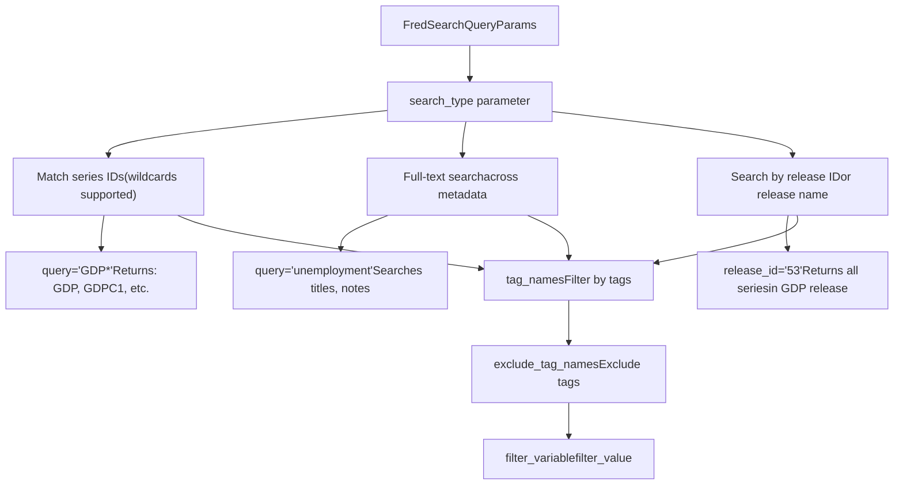
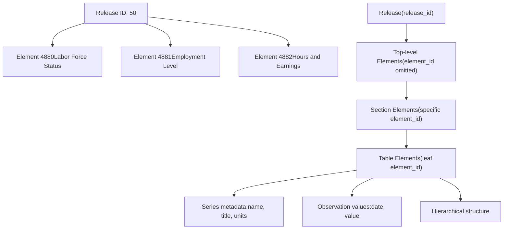
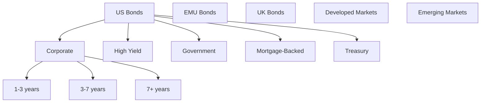
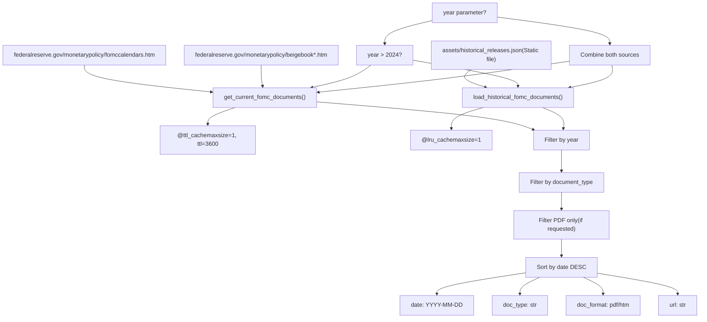
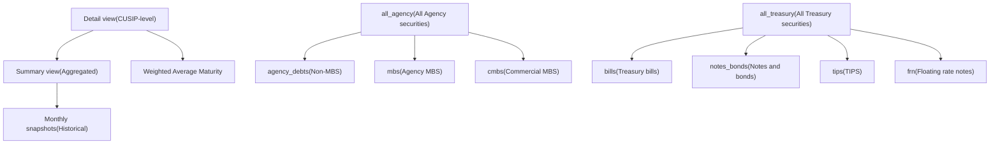

# 经济数据提供程序

相关源文件

-   [openbb_platform/core/openbb_core/app/model/charts/chart.py](https://github.com/OpenBB-finance/OpenBB/blob/dddc3b32/openbb_platform/core/openbb_core/app/model/charts/chart.py)
-   [openbb_platform/core/openbb_core/provider/standard_models/primary_dealer_fails.py](https://github.com/OpenBB-finance/OpenBB/blob/dddc3b32/openbb_platform/core/openbb_core/provider/standard_models/primary_dealer_fails.py)
-   [openbb_platform/core/tests/app/model/charts/test_chart.py](https://github.com/OpenBB-finance/OpenBB/blob/dddc3b32/openbb_platform/core/tests/app/model/charts/test_chart.py)
-   [openbb_platform/extensions/economy/integration/test_economy_api.py](https://github.com/OpenBB-finance/OpenBB/blob/dddc3b32/openbb_platform/extensions/economy/integration/test_economy_api.py)
-   [openbb_platform/extensions/economy/integration/test_economy_python.py](https://github.com/OpenBB-finance/OpenBB/blob/dddc3b32/openbb_platform/extensions/economy/integration/test_economy_python.py)
-   [openbb_platform/extensions/economy/openbb_economy/economy_router.py](https://github.com/OpenBB-finance/OpenBB/blob/dddc3b32/openbb_platform/extensions/economy/openbb_economy/economy_router.py)
-   [openbb_platform/extensions/economy/openbb_economy/survey/survey_router.py](https://github.com/OpenBB-finance/OpenBB/blob/dddc3b32/openbb_platform/extensions/economy/openbb_economy/survey/survey_router.py)
-   [openbb_platform/extensions/platform_api/openbb_platform_api/assets/default_apps.json](https://github.com/OpenBB-finance/OpenBB/blob/dddc3b32/openbb_platform/extensions/platform_api/openbb_platform_api/assets/default_apps.json)
-   [openbb_platform/extensions/tests/test_integration_tests_api.py](https://github.com/OpenBB-finance/OpenBB/blob/dddc3b32/openbb_platform/extensions/tests/test_integration_tests_api.py)
-   [openbb_platform/extensions/tests/test_integration_tests_python.py](https://github.com/OpenBB-finance/OpenBB/blob/dddc3b32/openbb_platform/extensions/tests/test_integration_tests_python.py)
-   [openbb_platform/extensions/tests/utils/integration_tests_api_generator.py](https://github.com/OpenBB-finance/OpenBB/blob/dddc3b32/openbb_platform/extensions/tests/utils/integration_tests_api_generator.py)
-   [openbb_platform/extensions/tests/utils/integration_tests_testers.py](https://github.com/OpenBB-finance/OpenBB/blob/dddc3b32/openbb_platform/extensions/tests/utils/integration_tests_testers.py)
-   [openbb_platform/providers/federal_reserve/openbb_federal_reserve/__init__.py](https://github.com/OpenBB-finance/OpenBB/blob/dddc3b32/openbb_platform/providers/federal_reserve/openbb_federal_reserve/__init__.py)
-   [openbb_platform/providers/federal_reserve/openbb_federal_reserve/assets/historical_releases.json](https://github.com/OpenBB-finance/OpenBB/blob/dddc3b32/openbb_platform/providers/federal_reserve/openbb_federal_reserve/assets/historical_releases.json)
-   [openbb_platform/providers/federal_reserve/openbb_federal_reserve/models/fomc_documents.py](https://github.com/OpenBB-finance/OpenBB/blob/dddc3b32/openbb_platform/providers/federal_reserve/openbb_federal_reserve/models/fomc_documents.py)
-   [openbb_platform/providers/federal_reserve/openbb_federal_reserve/models/primary_dealer_fails.py](https://github.com/OpenBB-finance/OpenBB/blob/dddc3b32/openbb_platform/providers/federal_reserve/openbb_federal_reserve/models/primary_dealer_fails.py)
-   [openbb_platform/providers/federal_reserve/openbb_federal_reserve/models/primary_dealer_positioning.py](https://github.com/OpenBB-finance/OpenBB/blob/dddc3b32/openbb_platform/providers/federal_reserve/openbb_federal_reserve/models/primary_dealer_positioning.py)
-   [openbb_platform/providers/federal_reserve/openbb_federal_reserve/utils/fomc_documents.py](https://github.com/OpenBB-finance/OpenBB/blob/dddc3b32/openbb_platform/providers/federal_reserve/openbb_federal_reserve/utils/fomc_documents.py)
-   [openbb_platform/providers/federal_reserve/openbb_federal_reserve/utils/primary_dealer_statistics.py](https://github.com/OpenBB-finance/OpenBB/blob/dddc3b32/openbb_platform/providers/federal_reserve/openbb_federal_reserve/utils/primary_dealer_statistics.py)
-   [openbb_platform/providers/federal_reserve/tests/record/http/test_federal_reserve_fetchers/test_federal_reserve_fomc_documents_fetcher_urllib3_v2.yaml](https://github.com/OpenBB-finance/OpenBB/blob/dddc3b32/openbb_platform/providers/federal_reserve/tests/record/http/test_federal_reserve_fetchers/test_federal_reserve_fomc_documents_fetcher_urllib3_v2.yaml)
-   [openbb_platform/providers/federal_reserve/tests/record/http/test_federal_reserve_fetchers/test_federal_reserve_primary_dealer_fails_fetcher_urllib3_v2.yaml](https://github.com/OpenBB-finance/OpenBB/blob/dddc3b32/openbb_platform/providers/federal_reserve/tests/record/http/test_federal_reserve_fetchers/test_federal_reserve_primary_dealer_fails_fetcher_urllib3_v2.yaml)
-   [openbb_platform/providers/federal_reserve/tests/test_federal_reserve_fetchers.py](https://github.com/OpenBB-finance/OpenBB/blob/dddc3b32/openbb_platform/providers/federal_reserve/tests/test_federal_reserve_fetchers.py)
-   [openbb_platform/providers/fred/openbb_fred/__init__.py](https://github.com/OpenBB-finance/OpenBB/blob/dddc3b32/openbb_platform/providers/fred/openbb_fred/__init__.py)
-   [openbb_platform/providers/fred/openbb_fred/models/manufacturing_outlook_ny.py](https://github.com/OpenBB-finance/OpenBB/blob/dddc3b32/openbb_platform/providers/fred/openbb_fred/models/manufacturing_outlook_ny.py)
-   [openbb_platform/providers/fred/tests/record/http/test_fred_fetchers/test_fred_manufacturing_outlook_ny_fetcher_urllib3_v2.yaml](https://github.com/OpenBB-finance/OpenBB/blob/dddc3b32/openbb_platform/providers/fred/tests/record/http/test_fred_fetchers/test_fred_manufacturing_outlook_ny_fetcher_urllib3_v2.yaml)
-   [openbb_platform/providers/fred/tests/test_fred_fetchers.py](https://github.com/OpenBB-finance/OpenBB/blob/dddc3b32/openbb_platform/providers/fred/tests/test_fred_fetchers.py)

本文档涵盖了 FRED (圣路易斯联储经济数据库) 和美联储（Federal Reserve）提供程序，它们为 OpenBB 平台提供经济时间序列数据、FOMC 会议文件、一级交易商统计数据和美联储资产负债表信息。

有关金融市场数据提供程序 (FMP, Intrinio) 的信息，请参阅 [4.2](/OpenBB-finance/OpenBB/4.2-economic-data-providers)。有关其他经济数据源 (BLS, OECD, EconDB, IMF) 的信息，请参阅 [4.3](/OpenBB-finance/OpenBB/4.3-financial-data-providers)。

---

## 概述

OpenBB 平台集成了两个专门用于访问美国美联储和经济数据的提供程序：

-   **FRED 提供程序**：提供访问来自圣路易斯联储银行的 816,000+ 条经济时间序列，包括 GDP、CPI、失业率、利率和金融市场指标。
-   **Federal Reserve（美联储）提供程序**：提供直接访问美联储理事会数据的权限，包括 FOMC 文件、一级交易商统计数据、中央银行持仓和美联储研究数据集。

这两个提供程序都实现了标准的 fetcher 模式，并通过提供程序接口注册其数据源，使其可以通过 economy 扩展端点进行访问。

**关键特征：**

| 提供程序 | 数据源 | 身份验证 | Fetcher 数量 | 数据类型 |
| --- | --- | --- | --- | --- |
| FRED | 圣路易斯联储 API | API 密钥 | 40+ | 时间序列、搜索结果、发布表 |
| Federal Reserve | 美联储理事会 | 无 | 13 | 文件、统计数据、资产负债表数据 |

来源：[openbb_platform/providers/fred/openbb_fred/__init__.py58-105](https://github.com/OpenBB-finance/OpenBB/blob/dddc3b32/openbb_platform/providers/fred/openbb_fred/__init__.py#L58-L105) [openbb_platform/providers/federal_reserve/openbb_federal_reserve/__init__.py40-60](https://github.com/OpenBB-finance/OpenBB/blob/dddc3b32/openbb_platform/providers/federal_reserve/openbb_federal_reserve/__init__.py#L40-L60)

---

## FRED 提供程序架构

### 提供程序注册与 Fetcher 字典

FRED 提供程序注册了 40 多个 fetcher，涵盖经济指标、利率、调查和债券指数。该提供程序在 `fred_provider` 中定义，包含凭据配置和 fetcher 映射。

```mermaid
flowchart TD
    FREDProvider["fred_provider(Provider instance)"]
    Credentials["credentials=['api_key']"]
    FetcherDict["fetcher_dict(40+ fetchers)"]
    SeriesFetcher["FredSeriesFetcherSymbol: FredSeries"]
    SearchFetcher["FredSearchFetcherSymbol: FredSearch"]
    RegionalFetcher["FredRegionalDataFetcherSymbol: FredRegional"]
    ReleaseTableFetcher["FredReleaseTableFetcherSymbol: FredReleaseTable"]
    CPIFetcher["FREDConsumerPriceIndexFetcherSymbol: ConsumerPriceIndex"]
    BalancePaymentsFetcher["FredBalanceOfPaymentsFetcherSymbol: BalanceOfPayments"]
    RetailPricesFetcher["FredRetailPricesFetcherSymbol: RetailPrices"]
    SOFRFetcher["FREDSOFRFetcherSymbol: SOFR"]
    FFRFetcher["FredFederalFundsRateFetcherSymbol: FederalFundsRate"]
    SONIAFetcher["FREDSONIAFetcherSymbol: SONIA"]
    ESTRFetcher["FredEuroShortTermRateFetcherSymbol: EuroShortTermRate"]
    UofMFetcher["FredUofMichiganFetcherSymbol: UniversityOfMichigan"]
    SLOOSFetcher["FredSeniorLoanOfficerSurveyFetcherSymbol: SeniorLoanOfficerSurvey"]
    ManufacturingTXFetcher["FredManufacturingOutlookTexasFetcherSymbol: ManufacturingOutlookTexas"]
    ManufacturingNYFetcher["FredManufacturingOutlookNYFetcherSymbol: ManufacturingOutlookNY"]
    NonFarmFetcher["FredNonFarmPayrollsFetcherSymbol: NonFarmPayrolls"]
    BondIndicesFetcher["FredBondIndicesFetcherSymbol: BondIndices"]
    YieldCurveFetcher["FREDYieldCurveFetcherSymbol: YieldCurve"]
    TIPSFetcher["FredTipsYieldsFetcherSymbol: TipsYields"]

    FREDProvider --> Credentials
    FREDProvider --> FetcherDict
    FetcherDict --> SeriesFetcher
    FetcherDict --> SearchFetcher
    FetcherDict --> RegionalFetcher
    FetcherDict --> ReleaseTableFetcher
    FetcherDict --> CPIFetcher
    FetcherDict --> BalancePaymentsFetcher
    FetcherDict --> RetailPricesFetcher
    FetcherDict --> SOFRFetcher
    FetcherDict --> FFRFetcher
    FetcherDict --> SONIAFetcher
    FetcherDict --> ESTRFetcher
    FetcherDict --> UofMFetcher
    FetcherDict --> SLOOSFetcher
    FetcherDict --> ManufacturingTXFetcher
    FetcherDict --> ManufacturingNYFetcher
    FetcherDict --> NonFarmFetcher
    FetcherDict --> BondIndicesFetcher
    FetcherDict --> YieldCurveFetcher
    FetcherDict --> TIPSFetcher
```


**Fetcher 符号映射**：`fetcher_dict` 将标准模型名称（例如 `"FredSeries"`、`"ConsumerPriceIndex"`）映射到它们各自的 fetcher 类。这使得提供程序接口能够解析诸如 `obb.economy.fred_series(symbol="FEDFUNDS", provider="fred")` 之类的查询。

来源：[openbb_platform/providers/fred/openbb_fred/__init__.py58-105](https://github.com/OpenBB-finance/OpenBB/blob/dddc3b32/openbb_platform/providers/fred/openbb_fred/__init__.py#L58-L105)

---

### FRED 系列获取模式

#### 时间序列数据查询流

`FredSeriesFetcher` 检索一个或多个 FRED 系列 ID 的时间序列观测值。这是访问经济数据最常用的 fetcher。

> **[Mermaid 序列]**
> *(图表结构无法解析)*

**关键参数：**

-   `symbol`：逗号分隔的 FRED 系列 ID（例如 `"FEDFUNDS,GDP,UNRATE"`）
-   `start_date` / `end_date`：观测值的日期范围
-   `frequency`：数据聚合频率（`d`, `w`, `m`, `q`, `a`）
-   `aggregation_method`：如何聚合（`avg`, `sum`, `eop`）
-   `transform`：数据转换（`chg`, `pc1`, `pch`, `log`）

**转换选项：**

-   `chg`：变动（周期差值）
-   `pc1`：较上年同期百分比变动
-   `pch`：较上周期百分比变动
-   `log`：自然对数转换

来源：[openbb_platform/extensions/economy/openbb_economy/economy_router.py151-173](https://github.com/OpenBB-finance/OpenBB/blob/dddc3b32/openbb_platform/extensions/economy/openbb_economy/economy_router.py#L151-L173) [openbb_platform/providers/fred/tests/test_fred_fetchers.py291-298](https://github.com/OpenBB-finance/OpenBB/blob/dddc3b32/openbb_platform/providers/fred/tests/test_fred_fetchers.py#L291-L298)

---

### FRED 搜索功能

#### 搜索类型与查询模式

`FredSearchFetcher` 支持三种不同的搜索类型来发现 FRED 系列：


**搜索参数：**

| 参数 | 描述 | 示例 |
| --- | --- | --- |
| `query` | 搜索词或系列 ID 模式 | `"GDP*"`、`"unemployment"` |
| `search_type` | 要执行的搜索类型 | `"series_id"`、`"full_text"`、`"release"` |
| `tag_names` | 按标签过滤（逗号分隔） | `"gdp,quarterly"` |
| `exclude_tag_names` | 排除标签 | `"discontinued"` |
| `filter_variable` | 过滤变量 | `"frequency"`、`"seasonal_adjustment"` |
| `filter_value` | 过滤变量的值 | `"Monthly"`、`"Seasonally Adjusted"` |
| `series_id` | 特定系列 ID（用于 full_text 搜索） | `"NYICLAIMS"` |
| `release_id` | 发布 ID 编号 | `"53"` (GDP) |

**用法示例：**

```python
# 搜索 GDP 相关系列
result = obb.economy.fred_search(
    query="GDP*",
    search_type="series_id",
    tag_names="quarterly,usa",
    limit=50,
    provider="fred"
)

# 带有系列 ID 上下文的全文本搜索
result = obb.economy.fred_search(
    search_type="full_text",
    series_id="NYICLAIMS",
    provider="fred"
)

# 搜索某个发布中的所有系列
result = obb.economy.fred_search(
    search_type="release",
    release_id="50",  # 就业状况
    provider="fred"
)
```
来源：[openbb_platform/extensions/economy/openbb_economy/economy_router.py136-149](https://github.com/OpenBB-finance/OpenBB/blob/dddc3b32/openbb_platform/extensions/economy/openbb_economy/economy_router.py#L136-L149) [openbb_platform/extensions/economy/integration/test_economy_python.py274-338](https://github.com/OpenBB-finance/OpenBB/blob/dddc3b32/openbb_platform/extensions/economy/integration/test_economy_python.py#L274-L338)

---

### FRED 区域数据

`FredRegionalDataFetcher` 访问 GeoFRED API 以获取州和区域经济数据。区域数据既可以作为元数据检索（未指定日期范围时），也可以作为时间序列检索（带有日期范围）。

**区域数据参数：**

| 参数 | 类型 | 描述 |
| --- | --- | --- |
| `symbol` | str | 系列组 ID 或单个系列 ID |
| `is_series_group` | bool | 符号是否为系列组 |
| `start_date` | date | 时间序列开始日期（启用时间序列模式） |
| `region_type` | str | `"state"`、`"msa"`、`"county"` 等 |
| `frequency` | str | `"a"`、`"q"`、`"m"`、`"w"`、`"d"` |
| `units` | str | 计量单位 |
| `season` | str | `"sa"`（季节性调整）或 `"nsa"` |

**示例 - 检索各州失业率：**

```python
# 获取州失业率系列的元数据
result = obb.economy.fred_regional(
    symbol="NYICLAIMS",
    is_series_group=False,
    provider="fred"
)

# 获取州失业率的时间序列
result = obb.economy.fred_regional(
    symbol="156241",
    is_series_group=True,
    start_date="2020-01-01",
    end_date="2023-12-31",
    frequency="m",
    region_type="state",
    season="nsa",
    provider="fred"
)
```
来源：[openbb_platform/extensions/economy/openbb_economy/economy_router.py273-301](https://github.com/OpenBB-finance/OpenBB/blob/dddc3b32/openbb_platform/extensions/economy/openbb_economy/economy_router.py#L273-L301) [openbb_platform/extensions/economy/integration/test_economy_python.py459-504](https://github.com/OpenBB-finance/OpenBB/blob/dddc3b32/openbb_platform/extensions/economy/integration/test_economy_python.py#L459-L504)

---

### FRED 发布表

`FredReleaseTableFetcher` 检索来自 FRED 经济发布的结构化数据。发布表提供了按发布 ID 和元素 ID 组织的层级经济数据。


**用法模式：**

```python
# 获取顶层元素
result = obb.economy.fred_release_table(
    release_id="50",
    provider="fred"
)

# 向下钻取到特定部分
result = obb.economy.fred_release_table(
    release_id="50",
    element_id="4880",
    provider="fred"
)

# 从特定表中获取数据
result = obb.economy.fred_release_table(
    release_id="50",
    element_id="4881",
    provider="fred"
)
```
来源：[openbb_platform/extensions/economy/openbb_economy/economy_router.py175-199](https://github.com/OpenBB-finance/OpenBB/blob/dddc3b32/openbb_platform/extensions/economy/openbb_economy/economy_router.py#L175-L199) [openbb_platform/extensions/economy/integration/test_economy_python.py954-983](https://github.com/OpenBB-finance/OpenBB/blob/dddc3b32/openbb_platform/extensions/economy/integration/test_economy_python.py#L954-L983)

---

### 调查数据 Fetcher

FRED 提供了几个专门用于经济调查的 fetcher：

#### 密歇根大学消费者信心指数

```python
result = obb.economy.survey.university_of_michigan(
    start_date="2020-01-01",
    frequency="m",
    transform="pc1",
    provider="fred"
)
```
#### 高级贷款官意见调查 (SLOOS)

```python
result = obb.economy.survey.sloos(
    category="auto",
    start_date="2022-01-01",
    provider="fred"
)
```
#### 制造业展望调查

FRED 提供程序包含两项区域性制造业调查，具有详细的基于主题的数据映射：

**纽约帝国州制造业调查：**

```python
result = obb.economy.survey.manufacturing_outlook_ny(
    topic="new_orders,hours_worked",
    start_date="2020-01-01",
    seasonally_adjusted=True,
    transform="pc1",
    provider="fred"
)
```
**德克萨斯州制造业展望调查：**

```python
result = obb.economy.survey.manufacturing_outlook_texas(
    topic="business_outlook,production",
    start_date="2020-01-01",
    transform="chg",
    provider="fred"
)
```
**制造业调查主题：**

这两项调查都支持多个主题，每个主题都映射到特定的 FRED 系列 ID：

| 主题类别 | 示例 | 系列计数 |
| --- | --- | --- |
| 业务展望 | 当前、未来（6 个月） | 8 个系列 |
| 新订单 | 当前、未来 | 8 个系列 |
| 生产 | 当前、未来 | 8 个系列 |
| 工作时长 | 当前、未来 | 8 个系列 |
| 就业 | 当前、未来 | 8 个系列 |
| 价格 | 已付、实收 | 8 个系列 |
| 库存 | 当前 | 4 个系列 |

每个主题都包含季节性调整和非季节性调整变体，具有四个数据点：

-   扩散指数
-   报告增加的百分比
-   报告减少的百分比
-   报告无变化的百分比

来源：[openbb_platform/providers/fred/openbb_fred/models/manufacturing_outlook_ny.py17-288](https://github.com/OpenBB-finance/OpenBB/blob/dddc3b32/openbb_platform/providers/fred/openbb_fred/models/manufacturing_outlook_ny.py#L17-L288) [openbb_platform/extensions/economy/openbb_economy/survey/survey_router.py113-177](https://github.com/OpenBB-finance/OpenBB/blob/dddc3b32/openbb_platform/extensions/economy/openbb_economy/survey/survey_router.py#L113-L177)

---

### 消费者物价指数 (CPI) 数据映射

FRED CPI fetcher 为国际 CPI 数据实现了复杂的国家到系列的映射。每个国家都有多个相关的 FRED 系列 ID，用于不同的 CPI 变体。

**CPI 映射结构：**

| 国家 | 转换 | 频率 | 是否调和 | 系列 ID |
| --- | --- | --- | --- | --- |
| 美国 | 同比 (YoY) | 每月 | 否 | `CPIAUCSL` (所有项目) |
| 美国 | 同比 (YoY) | 每月 | 否 | `CPILFESL` (剔除食物与能源) |
| 欧元区 | 同比 (YoY) | 每月 | 是 | `CP0000EZ19M086NEST` |
| 日本 | 同比 (YoY) | 每月 | 否 | `JPNCPIALLMINMEI` |
| 英国 | 同比 (YoY) | 每月 | 否 | `GBRCPIALLMINMEI` |

**调和 (Harmonized) vs. 非调和：**

-   **调和**：对欧盟国家使用 HICP (调和消费者物价指数)，实现跨国比较
-   **非调和**：使用各国国家 CPI 定义

**转换选项：**

-   `yoy`：较上年同期百分比变动
-   `period`：较上周期百分比变动

来源：[openbb_platform/providers/fred/tests/test_fred_fetchers.py78-84](https://github.com/OpenBB-finance/OpenBB/blob/dddc3b32/openbb_platform/providers/fred/tests/test_fred_fetchers.py#L78-L84) [openbb_platform/extensions/economy/integration/test_economy_python.py62-112](https://github.com/OpenBB-finance/OpenBB/blob/dddc3b32/openbb_platform/extensions/economy/integration/test_economy_python.py#L62-L112)

---

### 债券指数

`FredBondIndicesFetcher` 提供对 FRED 跟踪的 ICE BofA 债券指数的访问，按地理类别和指数类型组织。

**债券指数类别：**


**用法示例：**

```python
result = obb.fixedincome.bond_indices(
    category="us",
    index="corporate",
    start_date="2020-01-01",
    provider="fred"
)
```
来源：[openbb_platform/providers/fred/tests/test_fred_fetchers.py353-365](https://github.com/OpenBB-finance/OpenBB/blob/dddc3b32/openbb_platform/providers/fred/tests/test_fred_fetchers.py#L353-L365)

---

### 零售价格

`FredRetailPricesFetcher` 为特定零售商品和地区提供消费者物价指数数据，有助于跟踪产品层面的通货膨胀。

**支持的商品：**

-   `eggs` (鸡蛋), `milk` (牛奶), `bread` (面包), `rice` (大米)
-   `meats` (肉类：牛肉、猪肉、鸡肉)
-   `fruits` (水果), `vegetables` (蔬菜)
-   `gasoline` (汽油), `electricity` (电力), `natural_gas` (天然气)
-   `apparel` (服装), `transportation` (交通)

**地区：**

-   `all_city` (美国城市平均)
-   `northeast` (东北部), `midwest` (中西部), `south` (南部), `west` (西部)
-   特定大都市区

**示例 - 跟踪鸡蛋价格：**

```python
result = obb.economy.retail_prices(
    item="eggs",
    region="northeast",
    start_date="2020-01-01",
    transform="pc1",  # 较上年同期百分比变动
    provider="fred"
)
```
来源：[openbb_platform/extensions/economy/openbb_economy/economy_router.py518-547](https://github.com/OpenBB-finance/OpenBB/blob/dddc3b32/openbb_platform/extensions/economy/openbb_economy/economy_router.py#L518-L547) [openbb_platform/providers/fred/tests/test_fred_fetchers.py343-350](https://github.com/OpenBB-finance/OpenBB/blob/dddc3b32/openbb_platform/providers/fred/tests/test_fred_fetchers.py#L343-L350)

---

## Federal Reserve（美联储）提供程序

Federal Reserve 提供程序直接访问来自美联储理事会的公共数据集，包括 FOMC 文件、一级交易商统计数据、资产负债表持仓和研究出版物。

### 提供程序注册

```mermaid
flowchart TD
    FedProvider["federal_reserve_provider(Provider instance)"]
    NoAuth["credentials=None(No authentication required)"]
    FedFetcherDict["fetcher_dict(13 fetchers)"]
    FOMCDocs["FederalReserveFomcDocumentsFetcherSymbol: FomcDocuments"]
    InflationExp["FederalReserveInflationExpectationsFetcherSymbol: InflationExpectations"]
    TFP["FederalReserveTfpFetcherSymbol: TotalFactorProductivity"]
    PDPositioning["FederalReservePrimaryDealerPositioningFetcherSymbol: PrimaryDealerPositioning"]
    PDFails["FederalReservePrimaryDealerFailsFetcherSymbol: PrimaryDealerFails"]
    Holdings["FederalReserveCentralBankHoldingsFetcherSymbol: CentralBankHoldings"]
    MoneyMeasures["FederalReserveMoneyMeasuresFetcherSymbol: MoneyMeasures"]
    FFR["FederalReserveFederalFundsRateFetcherSymbol: FederalFundsRate"]
    SOFR["FederalReserveSOFRFetcherSymbol: SOFR"]
    OBFR["FederalReserveOvernightBankFundingRateFetcherSymbol: OvernightBankFundingRate"]
    YieldCurve["FederalReserveYieldCurveFetcherSymbol: YieldCurve"]
    Svensson["FederalReserveSvenssonFetcherSymbol: SvenssonYieldCurve"]
    TreasuryRates["FederalReserveTreasuryRatesFetcherSymbol: TreasuryRates"]

    FedProvider --> NoAuth
    FedProvider --> FedFetcherDict
    FedFetcherDict --> FOMCDocs
    FedFetcherDict --> InflationExp
    FedFetcherDict --> TFP
    FedFetcherDict --> PDPositioning
    FedFetcherDict --> PDFails
    FedFetcherDict --> Holdings
    FedFetcherDict --> MoneyMeasures
    FedFetcherDict --> FFR
    FedFetcherDict --> SOFR
    FedFetcherDict --> OBFR
    FedFetcherDict --> YieldCurve
    FedFetcherDict --> Svensson
    FedFetcherDict --> TreasuryRates
```


**关键区别**：Federal Reserve 提供程序不需要 API 密钥验证，因为它访问的是公开可用的美联储理事会数据。

来源：[openbb_platform/providers/federal_reserve/openbb_federal_reserve/__init__.py40-60](https://github.com/OpenBB-finance/OpenBB/blob/dddc3b32/openbb_platform/providers/federal_reserve/openbb_federal_reserve/__init__.py#L40-L60)

---

### FOMC 文件系统

#### 文件类型与历史数据

FOMC 文件 fetcher 提供对追溯到 1959 年的联邦公开市场委员会材料的访问。该系统将当前文件（从 federalreserve.gov 爬取）与静态历史档案相结合。

**FOMC 文件类型定义：**

```python
FomcDocumentType = Literal[
    "all",
    "monetary_policy",      # 政策执行说明
    "minutes",              # 会议纪要
    "projections",          # 经济预测 (SEP)
    "materials",            # 会议材料
    "press_release",        # 政策公告
    "press_conference",     # 主席新闻发布会记录
    "agenda",               # 会议议程
    "transcript",           # 完整会议记录（滞后 5 年）
    "speaker_key",          # 发言人标识
    "beige_book",           # 区域经济报告（褐皮书）
    "teal_book",            # 职员经济预测（蓝绿书）
    "green_book",           # 职员经济分析（绿皮书）
    "blue_book",            # 货币政策选项（蓝皮书）
    "red_book",             # 对外经济分析（红皮书）
]
```
来源：[openbb_platform/providers/federal_reserve/openbb_federal_reserve/utils/fomc_documents.py8-24](https://github.com/OpenBB-finance/OpenBB/blob/dddc3b32/openbb_platform/providers/federal_reserve/openbb_federal_reserve/utils/fomc_documents.py#L8-L24)

#### 文件获取架构


**get_current_fomc_documents() 函数：**

-   从 federalreserve.gov 爬取实时 HTML
-   使用 BeautifulSoup 解析文件链接
-   使用正则表达式从文件名中提取日期
-   从 URL 模式推断文件类型
-   结果缓存 1 小时 (TTL cache)

**load_historical_fomc_documents() 函数：**

-   加载包含 1959-2024 年文件的静态 JSON 文件
-   文件大小：约 1.3MB，包含 9000+ 条文件记录
-   使用 LRU cache 实现高效重复访问

来源：[openbb_platform/providers/federal_reserve/openbb_federal_reserve/utils/fomc_documents.py27-250](https://github.com/OpenBB-finance/OpenBB/blob/dddc3b32/openbb_platform/providers/federal_reserve/openbb_federal_reserve/utils/fomc_documents.py#L27-L250) [openbb_platform/providers/federal_reserve/openbb_federal_reserve/models/fomc_documents.py1-173](https://github.com/OpenBB-finance/OpenBB/blob/dddc3b32/openbb_platform/providers/federal_reserve/openbb_federal_reserve/models/fomc_documents.py#L1-L173)

#### FOMC 文件用法

```python
# 获取所有文件
result = obb.economy.fomc_documents(
    provider="federal_reserve"
)

# 按年份过滤
result = obb.economy.fomc_documents(
    year=2022,
    provider="federal_reserve"
)

# 按年份和文件类型过滤
result = obb.economy.fomc_documents(
    year=2022,
    document_type="minutes",
    provider="federal_reserve"
)

# 仅获取褐皮书
result = obb.economy.fomc_documents(
    document_type="beige_book",
    provider="federal_reserve"
)
```
**部件（Widget）集成：**

FOMC 文件模型包含用于多文件 PDF 查看器的 OpenBB Workspace 部件配置：

```python
"x-widget_config": {
    "$.type": "multi_file_viewer",
    "$.name": "FOMC PDF Document Viewer",
    "$.description": "Current and historical FOMC PDF materials.",
    "$.endpoint": f"{api_prefix}/federal_reserve/fomc_documents_download",
    # 文件选择器端点配置
}
```
来源：[openbb_platform/providers/federal_reserve/openbb_federal_reserve/models/fomc_documents.py86-118](https://github.com/OpenBB-finance/OpenBB/blob/dddc3b32/openbb_platform/providers/federal_reserve/openbb_federal_reserve/models/fomc_documents.py#L86-L118) [openbb_platform/extensions/economy/integration/test_economy_python.py1112-1132](https://github.com/OpenBB-finance/OpenBB/blob/dddc3b32/openbb_platform/extensions/economy/integration/test_economy_python.py#L1112-L1132)

---

### 一级交易商统计数据

纽约联储银行发布关于一级交易商持仓和结算失败（fails）的每周统计数据。Federal Reserve 提供程序为这些数据集实现了复杂的系列 ID 映射。

#### 一级交易商持仓

一级交易商持仓数据展示了一级交易商在各资产类别中持有的净头寸（多头减去空头）。

**持仓类别与系列映射：**

`POSITION_GROUPS_TO_SERIES` 字典将高层类别映射到 FRED 系列 ID 列表：

```python
POSITION_GROUPS_TO_SERIES = {
    "treasuries": [
        "PDPOSGS-B",           # 国库券 (Bills)
        "PDPOSGSC-L2",         # 息票 (Coupons) ≤2 年
        "PDPOSGSC-G2L3",       # 息票 2-3 年
        "PDPOSGSC-G3L6",       # 息票 3-6 年
        # ... 更多到期期限档位
    ],
    "bills": ["PDPOSGS-B"],
    "coupons": ["PDPOSGSC-L2", "PDPOSGSC-G2L3", ...],
    "notes": [...],
    "tips": ["PDPOSTIPS-L2", "PDPOSTIPS-G2", ...],
    "mbs": ["PDPOSMBSFGS-TBA", "PDPOSMBSFGS-OR", ...],
    "cmbs": ["PDPOSMBSFGS-C", "PDPOSMBSNA-O"],
    "municipal": ["PDPOSSMGO-L13", "PDPOSSMGO-G13", ...],
    "corporate": ["PDPOSCSBND-L13", "PDPOSCSBND-G13", ...],
    "commercial_paper": ["PDPOSCSCP"],
    "corporate_ig": [...],    # 投资级
    "corporate_junk": [...],  # 高收益
    "abs": [...],             # 资产支持证券
}
```
**系列标题映射：**

`POSITION_SERIES_TO_TITLE` 字典将系列 ID 映射到人类可读的描述：

```python
POSITION_SERIES_TO_TITLE = {
    "PDPOSGS-B": "BILLS (EX. TIPS): DEALER POSITION - LONG. - BILLS (EX. TIPS): DEALER POSITION - SHORT",
    "PDPOSGSC-L2": "TREASURIES (EX. TIPS) COUPONS DUE IN LESS THAN OR EQUAL TO 2 YEARS: DEALER POSITION - NET",
    # ... 约 70 多个映射
}
```
**数据流：**

> **[Mermaid 序列]**
> *(图表结构无法解析)*

**用法示例：**

```python
# 获取国债持仓
result = obb.economy.primary_dealer_positioning(
    category="treasuries",
    start_date="2024-01-01",
    provider="federal_reserve"
)

# 获取公司债券持仓
result = obb.economy.primary_dealer_positioning(
    category="corporate",
    provider="federal_reserve"
)

# 获取 MBS 持仓
result = obb.economy.primary_dealer_positioning(
    category="mbs",
    start_date="2023-01-01",
    end_date="2024-12-31",
    provider="federal_reserve"
)
```
来源：[openbb_platform/providers/federal_reserve/openbb_federal_reserve/models/primary_dealer_positioning.py1-159](https://github.com/OpenBB-finance/OpenBB/blob/dddc3b32/openbb_platform/providers/federal_reserve/openbb_federal_reserve/models/primary_dealer_positioning.py#L1-L159) [openbb_platform/providers/federal_reserve/openbb_federal_reserve/utils/primary_dealer_statistics.py1-258](https://github.com/OpenBB-finance/OpenBB/blob/dddc3b32/openbb_platform/providers/federal_reserve/openbb_federal_reserve/utils/primary_dealer_statistics.py#L1-L258)

#### 一级交易商结算失败 (Fails)

结算失败（Fails-to-deliver, FTD 和 Fails-to-receive, FTR）统计数据跟踪一级交易商市场的结算失败情况。高失败率可能预示着市场压力或流动性问题。

**失败系列映射：**

```python
FAILS_SERIES_TO_TITLE = {
    "PDFTD-CS": "FTD Corporate Securities",
    "PDFTR-CS": "FTR Corporate Securities",
    "PDFTD-FGEM": "FTD Agency and GSE Securities (Ex-MBS)",
    "PDFTR-FGEM": "FTR Agency and GSE Securities (Ex-MBS)",
    "PDFTD-FGM": "FTD Agency and GSE MBS",
    "PDFTR-FGM": "FTR Agency and GSE MBS",
    "PDFTD-UST": "FTD TIPS",
    "PDFTR-UST": "FTR TIPS",
    "PDFTD-USTET": "FTD Treasury Securities (Ex-TIPS)",
    "PDFTR-USTET": "FTR Treasury Securities (Ex-TIPS)",
    # ...
}
```
**失败类别：**

| 资产类别 | FTD 系列 | FTR 系列 |
| --- | --- | --- |
| 公司证券 | `PDFTD-CS` | `PDFTR-CS` |
| 机构证券 (不含 MBS) | `PDFTD-FGEM` | `PDFTR-FGEM` |
| 机构 MBS | `PDFTD-FGM` | `PDFTR-FGM` |
| 国债 (不含 TIPS) | `PDFTD-USTET` | `PDFTR-USTET` |
| TIPS | `PDFTD-UST` | `PDFTR-UST` |

**用法示例：**

```python
# 获取所有失败数据
result = obb.economy.primary_dealer_fails(
    provider="federal_reserve"
)

# 获取占总量的百分比
result = obb.economy.primary_dealer_fails(
    unit="percent",
    start_date="2020-01-01",
    provider="federal_reserve"
)
```
来源：[openbb_platform/providers/federal_reserve/openbb_federal_reserve/utils/primary_dealer_statistics.py6-27](https://github.com/OpenBB-finance/OpenBB/blob/dddc3b32/openbb_platform/providers/federal_reserve/openbb_federal_reserve/utils/primary_dealer_statistics.py#L6-L27) [openbb_platform/extensions/economy/openbb_economy/economy_router.py612-642](https://github.com/OpenBB-finance/OpenBB/blob/dddc3b32/openbb_platform/extensions/economy/openbb_economy/economy_router.py#L612-L642)

---

### 中央银行持仓

`FederalReserveCentralBankHoldingsFetcher` 提供美联储系统公开市场账户 (SOMA) 持有的国债和机构证券。

**持仓类型：**


**用法示例：**

```python
# 获取最新国债持仓
result = obb.economy.central_bank_holdings(
    holding_type="all_treasury",
    provider="federal_reserve"
)

# 获取历史摘要
result = obb.economy.central_bank_holdings(
    holding_type="all_treasury",
    summary=True,
    provider="federal_reserve"
)

# 获取特定日期的持仓
result = obb.economy.central_bank_holdings(
    date="2019-05-21",
    holding_type="agency_debts",
    provider="federal_reserve"
)

# 获取加权平均到期期限 (WAM)
result = obb.economy.central_bank_holdings(
    holding_type="all_agency",
    wam=True,
    provider="federal_reserve"
)
```
来源：[openbb_platform/extensions/economy/openbb_economy/economy_router.py400-429](https://github.com/OpenBB-finance/OpenBB/blob/dddc3b32/openbb_platform/extensions/economy/openbb_economy/economy_router.py#L400-L429) [openbb_platform/extensions/economy/integration/test_economy_python.py611-646](https://github.com/OpenBB-finance/OpenBB/blob/dddc3b32/openbb_platform/extensions/economy/integration/test_economy_python.py#L611-L646)

---

### 货币衡量指标

美联储在 H.6 统计发布中公布 M1 和 M2 货币供应量衡量指标。`FederalReserveMoneyMeasuresFetcher` 检索这些总量及其组成部分。

**货币供应组成部分：**

-   **M1**：现金、活期存款、其他可支取存款、旅行支票
-   **M2**：M1 加上储蓄存款、小额定期存款、零售货币市场基金

**调整选项：**

-   `adjusted=True`：季节性调整后的数据
-   `adjusted=False`：未经过季节性调整

**用法示例：**

```python
# 获取季节性调整后的货币指标
result = obb.economy.money_measures(
    start_date="2020-01-01",
    end_date="2024-12-31",
    adjusted=True,
    provider="federal_reserve"
)

# 获取未经过季节性调整的指标
result = obb.economy.money_measures(
    adjusted=False,
    provider="federal_reserve"
)
```
来源：[openbb_platform/extensions/economy/openbb_economy/economy_router.py202-219](https://github.com/OpenBB-finance/OpenBB/blob/dddc3b32/openbb_platform/extensions/economy/openbb_economy/economy_router.py#L202-L219) [openbb_platform/providers/federal_reserve/tests/test_federal_reserve_fetchers.py68-74](https://github.com/OpenBB-finance/OpenBB/blob/dddc3b32/openbb_platform/providers/federal_reserve/tests/test_federal_reserve_fetchers.py#L68-L74)

---

### 全要素生产率 (TFP)

旧金山联储银行发布季度全要素生产率 (TFP) 估算，并根据因素利用率（劳动努力和资本工作周）进行调整。

**数据频率选项：**

-   `frequency="quarterly"`：时间序列数据（默认）
-   `frequency="summary"`：统计摘要

**TFP 组成部分：**

-   商业部门 TFP（经利用率调整）
-   设备投资 TFP
-   消费部门 TFP
-   劳动构成调整
-   资本构成调整

**用法示例：**

```python
# 获取季度 TFP 时间序列
result = obb.economy.total_factor_productivity(
    provider="federal_reserve"
)

# 获取统计摘要
result = obb.economy.total_factor_productivity(
    frequency="summary",
    provider="federal_reserve"
)
```
来源：[openbb_platform/extensions/economy/openbb_economy/economy_router.py716-748](https://github.com/OpenBB-finance/OpenBB/blob/dddc3b32/openbb_platform/extensions/economy/openbb_economy/economy_router.py#L716-L748) [openbb_platform/providers/federal_reserve/tests/test_federal_reserve_fetchers.py179-188](https://github.com/OpenBB-finance/OpenBB/blob/dddc3b32/openbb_platform/providers/federal_reserve/tests/test_federal_reserve_fetchers.py#L179-L188)

---

### 通胀预期

专业预测者调查提供前瞻性的通胀预期。`FederalReserveInflationExpectationsFetcher` 检索这些预测。

**预测期限：**

-   本年度
-   次年（未来 1 年）
-   未来 10 年

**用法示例：**

```python
result = obb.economy.survey.inflation_expectations(
    start_date="2020-01-01",
    end_date="2024-12-31",
    provider="federal_reserve"
)
```
来源：[openbb_platform/extensions/economy/openbb_economy/survey/survey_router.py201-214](https://github.com/OpenBB-finance/OpenBB/blob/dddc3b32/openbb_platform/extensions/economy/openbb_economy/survey/survey_router.py#L201-L214) [openbb_platform/providers/federal_reserve/tests/test_federal_reserve_fetchers.py191-200](https://github.com/OpenBB-finance/OpenBB/blob/dddc3b32/openbb_platform/providers/federal_reserve/tests/test_federal_reserve_fetchers.py#L191-L200)

---

## 与 Economy 扩展的集成

### 路由到提供程序的映射

Economy 扩展根据 `provider` 参数将命令路由到适当的提供程序。映射通过提供程序接口建立。

```mermaid
flowchart TD
    FREDSearch["fred_search()"]
    FREDSeries["fred_series()"]
    FREDRegional["fred_regional()"]
    FREDReleaseTable["fred_release_table()"]
    CPI["cpi()"]
    RetailPrices["retail_prices()"]
    FOMCDocs["fomc_documents()"]
    PDPositioning["primary_dealer_positioning()"]
    PDFails["primary_dealer_fails()"]
    CBHoldings["central_bank_holdings()"]
    MoneyMeasures["money_measures()"]
    FredSearchModel["FredSearch"]
    FredSeriesModel["FredSeries"]
    FredRegionalModel["FredRegional"]
    FredReleaseTableModel["FredReleaseTable"]
    CPIModel["ConsumerPriceIndex"]
    RetailPricesModel["RetailPrices"]
    FomcDocsModel["FomcDocuments"]
    PDPositioningModel["PrimaryDealerPositioning"]
    PDFailsModel["PrimaryDealerFails"]
    CBHoldingsModel["CentralBankHoldings"]
    MoneyMeasuresModel["MoneyMeasures"]
    PI["ProviderInterface"]
    FREDProvider["fred provider"]
    FedProvider["federal_reserve provider"]

    FREDSearch --> FredSearchModel
    FREDSeries --> FredSeriesModel
    FREDRegional --> FredRegionalModel
    FREDReleaseTable --> FredReleaseTableModel
    CPI --> CPIModel
    RetailPrices --> RetailPricesModel
    FOMCDocs --> FomcDocsModel
    PDPositioning --> PDPositioningModel
    PDFails --> PDFailsModel
    CBHoldings --> CBHoldingsModel
    MoneyMeasures --> MoneyMeasuresModel
    FredSearchModel --> PI
    FredSeriesModel --> PI
    FredRegionalModel --> PI
    FredReleaseTableModel --> PI
    CPIModel --> PI
    RetailPricesModel --> PI
    FomcDocsModel --> PI
    PDPositioningModel --> PI
    PDFailsModel --> PI
    CBHoldingsModel --> PI
    MoneyMeasuresModel --> PI
    PI --> FREDProvider
    PI --> FedProvider
```


**命令装饰器模式：**

每个路由命令都使用带有 `model` 参数的 `@router.command()` 装饰器，该参数指定标准模型名称：

```python
@router.command(
    model="FredSeries",
    examples=[APIEx(parameters={"symbol": "NFCI", "provider": "fred"})],
)
async def fred_series(
    cc: CommandContext,
    provider_choices: ProviderChoices,
    standard_params: StandardParams,
    extra_params: ExtraParams,
) -> OBBject:
    """从 FRED 获取系列 ID 的数据。"""
    return await OBBject.from_query(Query(**locals()))
```
`Query(**locals())` 模式将所有参数（包括包含提供程序名称的 `provider_choices`）传递给提供程序接口进行解析。

来源：[openbb_platform/extensions/economy/openbb_economy/economy_router.py151-173](https://github.com/OpenBB-finance/OpenBB/blob/dddc3b32/openbb_platform/extensions/economy/openbb_economy/economy_router.py#L151-L173) [openbb_platform/extensions/economy/openbb_economy/economy_router.py21-24](https://github.com/OpenBB-finance/OpenBB/blob/dddc3b32/openbb_platform/extensions/economy/openbb_economy/economy_router.py#L21-L24)

---

## 数据转换与标准化

### FRED 数据转换

FRED 支持在返回结果之前在服务器端应用几种数据转换：

| 转换代码 | 描述 | 示例 |
| --- | --- | --- |
| `chg` | 变动（差值） | Value(t) - Value(t-1) |
| `ch1` | 较上年同期变动 | Value(t) - Value(t-12) |
| `pch` | 百分比变动 | ((Value(t) - Value(t-1)) / Value(t-1)) * 100 |
| `pc1` | 较上年同期百分比变动 | ((Value(t) - Value(t-12)) / Value(t-12)) * 100 |
| `pca` | 复合年增长率 | ((Value(t) / Value(t-1))^(frequency) - 1) * 100 |
| `cch` | 连续复合增长率 | (ln(Value(t)) - ln(Value(t-1))) * 100 |
| `cca` | 连续复合年增长率 | (ln(Value(t)) - ln(Value(t-1))) * frequency * 100 |
| `log` | 自然对数 | ln(Value(t)) |

**频率聚合：**

当请求数据的频率低于原生频率时，FRED 使用指定的方法进行聚合：

-   `avg`：周期内数值的平均值
-   `sum`：周期内数值的总和
-   `eop`：周期期末值

来源：[openbb_platform/extensions/economy/openbb_economy/economy_router.py151-173](https://github.com/OpenBB-finance/OpenBB/blob/dddc3b32/openbb_platform/extensions/economy/openbb_economy/economy_router.py#L151-L173)

---

### 标准模型强制执行

提供程序接口确保所有 fetcher 返回的数据都符合标准模型，无论提供程序是谁。这使得在不破坏代码的情况下切换提供程序成为可能。

**示例 - 一级交易商结算失败：**

```python
class PrimaryDealerFailsData(Data):
    """一级交易商结算失败数据。"""
    date: dateType = Field(description=DATA_DESCRIPTIONS.get("date", ""))
    symbol: str = Field(description=DATA_DESCRIPTIONS.get("symbol", ""))
```
所有实现 `PrimaryDealerFails` 的提供程序都必须返回至少包含 `date` 和 `symbol` 字段的数据。提供程序特定的字段可以添加到继承自标准模型的提供程序特定数据类中。

来源：[openbb_platform/core/openbb_core/provider/standard_models/primary_dealer_fails.py1-32](https://github.com/OpenBB-finance/OpenBB/blob/dddc3b32/openbb_platform/core/openbb_core/provider/standard_models/primary_dealer_fails.py#L1-L32)

---

## 测试模式

### 基于 VCR 的提供程序测试

FRED 和 Federal Reserve 提供程序都使用 pytest-vcr 来记录 HTTP 交互。这实现了快速、确定性的测试，而无需访问实时 API。

**测试模式：**

```python
@pytest.mark.record_http
def test_fred_series_fetcher(credentials=test_credentials):
    """测试 FredSeriesFetcher。"""
    params = {"symbol": "SP500", "filter_variable": "frequency", "filter_value": "w"}
    fetcher = FredSeriesFetcher()
    result = fetcher.test(params, credentials)
    assert result is None
```
**VCR 配置：**

```python
@pytest.fixture(scope="module")
def vcr_config():
    """VCR 配置。"""
    return {
        "filter_headers": [("User-Agent", None)],
        "filter_query_parameters": [
            ("api_key", "MOCK_API_KEY"),
        ],
    }
```
`filter_query_parameters` 设置在录制的 cassette 中将真实的 API 密钥替换为 `MOCK_API_KEY`，防止凭据泄露。

来源：[openbb_platform/providers/fred/tests/test_fred_fetchers.py66-74](https://github.com/OpenBB-finance/OpenBB/blob/dddc3b32/openbb_platform/providers/fred/tests/test_fred_fetchers.py#L66-L74) [openbb_platform/providers/federal_reserve/tests/test_federal_reserve_fetchers.py48-54](https://github.com/OpenBB-finance/OpenBB/blob/dddc3b32/openbb_platform/providers/federal_reserve/tests/test_federal_reserve_fetchers.py#L48-L54)

---

### 集成测试

集成测试验证从 economy 路由、提供程序到最终 OBBject 输出的端到端功能。

**集成测试模式：**

```python
@pytest.mark.parametrize(
    "params",
    [
        {
            "symbol": "SP500",
            "start_date": None,
            "end_date": None,
            "limit": 10000,
            "frequency": "q",
            "aggregation_method": "eop",
            "transform": "chg",
            "provider": "fred",
        },
    ],
)
@pytest.mark.integration
def test_economy_fred_series(params, obb):
    """测试 economy fred series。"""
    params = {p: v for p, v in params.items() if v}
    result = obb.economy.fred_series(**params)
    assert result
    assert isinstance(result, OBBject)
    assert len(result.results) > 0
```
集成测试使用参数化 fixture 为每个端点测试多种提供程序配置。

来源：[openbb_platform/extensions/economy/integration/test_economy_python.py341-377](https://github.com/OpenBB-finance/OpenBB/blob/dddc3b32/openbb_platform/extensions/economy/integration/test_economy_python.py#L341-L377) [openbb_platform/extensions/tests/utils/integration_tests_testers.py22-51](https://github.com/OpenBB-finance/OpenBB/blob/dddc3b32/openbb_platform/extensions/tests/utils/integration_tests_testers.py#L22-L51)

---

## 摘要

FRED 和 Federal Reserve 提供程序通过标准化接口提供对美国经济数据的全面访问：

**FRED 提供程序亮点：**

-   40+ 个 fetcher，涵盖经济指标、调查、利率和债券指数
-   强大的搜索和发现工具（系列 ID 搜索、全文本搜索、发布搜索）
-   通过 GeoFRED API 获取区域经济数据
-   灵活的数据转换和频率聚合
-   针对国际数据的复杂国家到系列映射

**Federal Reserve（美联储）提供程序亮点：**

-   无需身份验证
-   直接访问 FOMC 文件（1959 年至今）
-   一级交易商统计数据，包含详细的持仓和结算失败数据
-   美联储资产负债表持仓 (SOMA)
-   货币供应量指标 (M1, M2)
-   全要素生产率研究数据
-   来自专业预测者调查的通胀预期

**关键设计模式：**

-   标准模型继承确保了提供程序的可互换性
-   复杂的数据映射（FOMC 文件类型、一级交易商系列 ID）被隔离在工具模块中
-   TTL 和 LRU 缓存优化了频繁访问数据的性能
-   基于 VCR 的测试实现了快速、可靠的测试套件
-   提供程序接口抽象了身份验证和数据获取的复杂性

来源：[openbb_platform/providers/fred/openbb_fred/__init__.py58-105](https://github.com/OpenBB-finance/OpenBB/blob/dddc3b32/openbb_platform/providers/fred/openbb_fred/__init__.py#L58-L105) [openbb_platform/providers/federal_reserve/openbb_federal_reserve/__init__.py40-60](https://github.com/OpenBB-finance/OpenBB/blob/dddc3b32/openbb_platform/providers/federal_reserve/openbb_federal_reserve/__init__.py#L40-L60)
