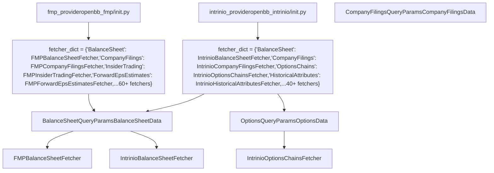
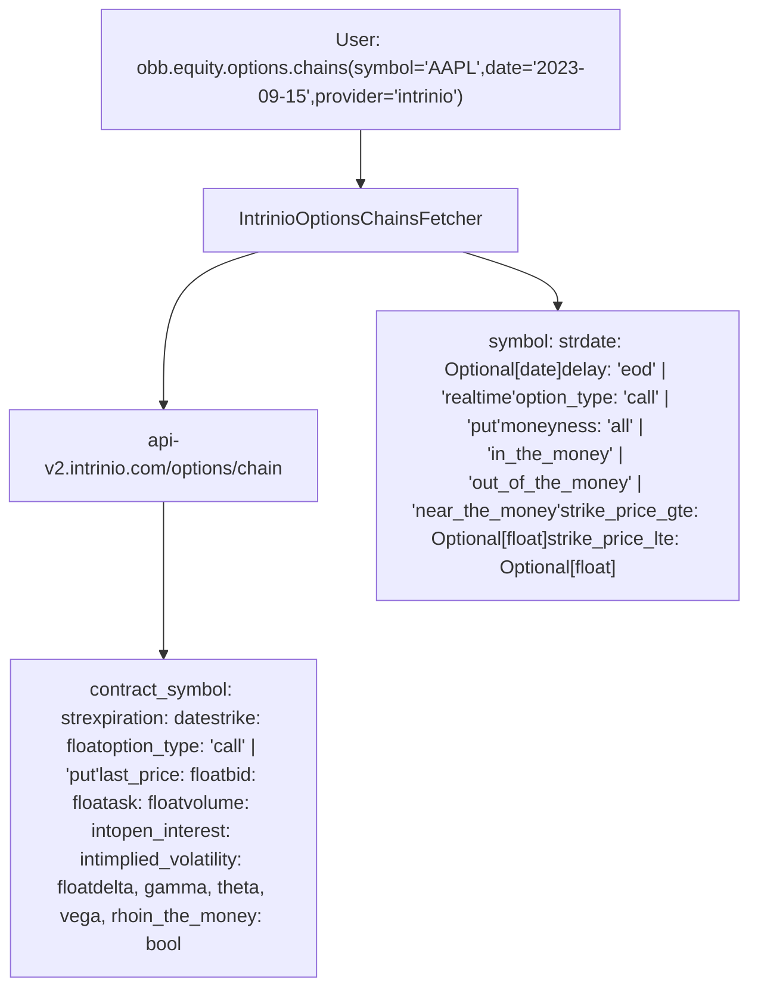
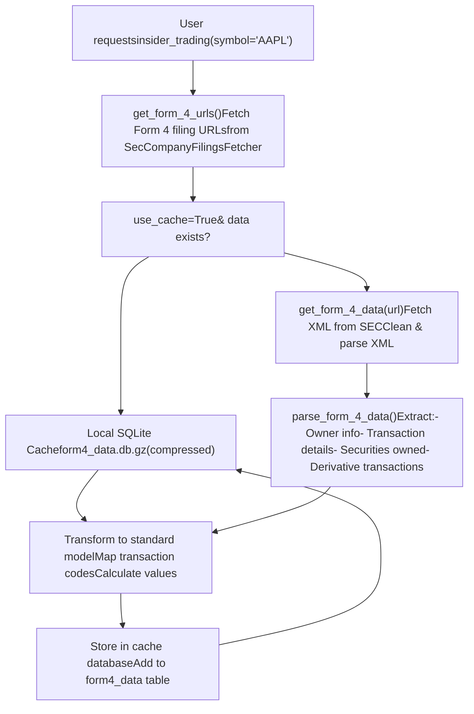
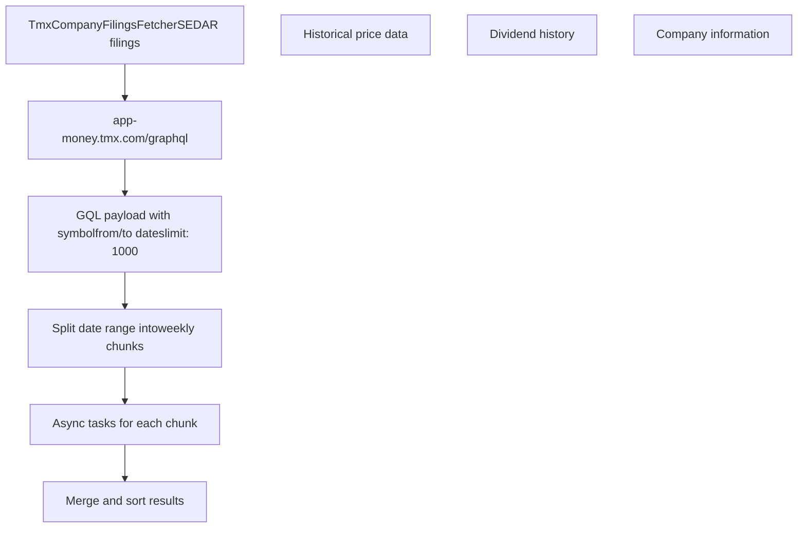
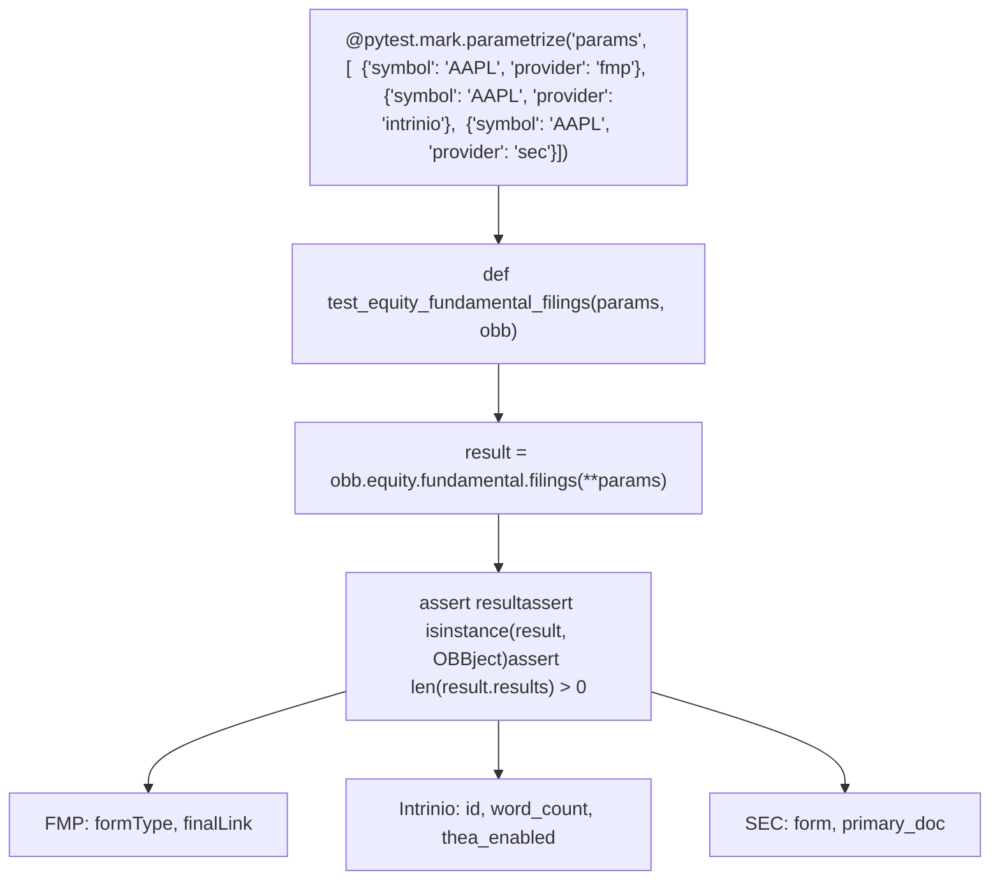
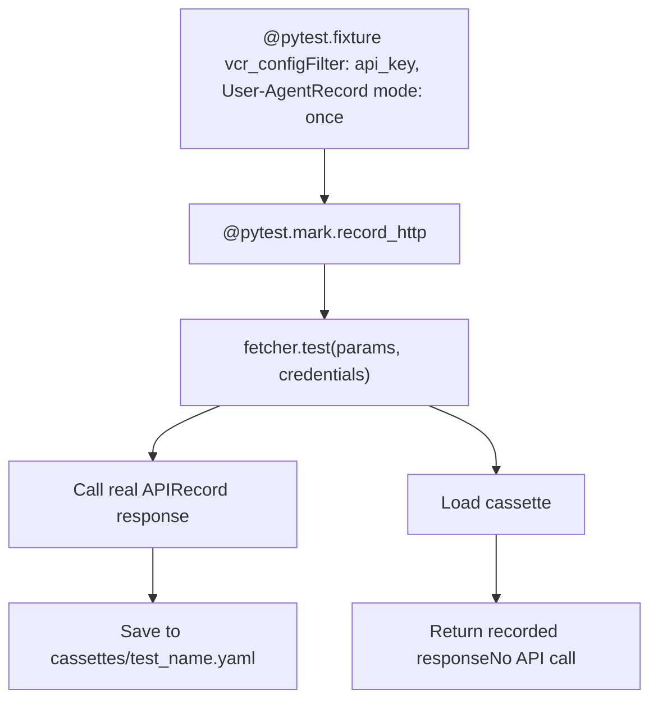

# 金融数据提供程序

相关源文件

-   [openbb_platform/core/openbb_core/app/model/charts/chart.py](https://github.com/OpenBB-finance/OpenBB/blob/dddc3b32/openbb_platform/core/openbb_core/app/model/charts/chart.py)
-   [openbb_platform/core/openbb_core/provider/standard_models/company_filings.py](https://github.com/OpenBB-finance/OpenBB/blob/dddc3b32/openbb_platform/core/openbb_core/provider/standard_models/company_filings.py)
-   [openbb_platform/core/openbb_core/provider/standard_models/primary_dealer_fails.py](https://github.com/OpenBB-finance/OpenBB/blob/dddc3b32/openbb_platform/core/openbb_core/provider/standard_models/primary_dealer_fails.py)
-   [openbb_platform/core/tests/app/model/charts/test_chart.py](https://github.com/OpenBB-finance/OpenBB/blob/dddc3b32/openbb_platform/core/tests/app/model/charts/test_chart.py)
-   [openbb_platform/extensions/economy/integration/test_economy_api.py](https://github.com/OpenBB-finance/OpenBB/blob/dddc3b32/openbb_platform/extensions/economy/integration/test_economy_api.py)
-   [openbb_platform/extensions/economy/integration/test_economy_python.py](https://github.com/OpenBB-finance/OpenBB/blob/dddc3b32/openbb_platform/extensions/economy/integration/test_economy_python.py)
-   [openbb_platform/extensions/economy/openbb_economy/economy_router.py](https://github.com/OpenBB-finance/OpenBB/blob/dddc3b32/openbb_platform/extensions/economy/openbb_economy/economy_router.py)
-   [openbb_platform/extensions/economy/openbb_economy/survey/survey_router.py](https://github.com/OpenBB-finance/OpenBB/blob/dddc3b32/openbb_platform/extensions/economy/openbb_economy/survey/survey_router.py)
-   [openbb_platform/extensions/equity/integration/test_equity_api.py](https://github.com/OpenBB-finance/OpenBB/blob/dddc3b32/openbb_platform/extensions/equity/integration/test_equity_api.py)
-   [openbb_platform/extensions/equity/integration/test_equity_python.py](https://github.com/OpenBB-finance/OpenBB/blob/dddc3b32/openbb_platform/extensions/equity/integration/test_equity_python.py)
-   [openbb_platform/extensions/equity/openbb_equity/fundamental/fundamental_router.py](https://github.com/OpenBB-finance/OpenBB/blob/dddc3b32/openbb_platform/extensions/equity/openbb_equity/fundamental/fundamental_router.py)
-   [openbb_platform/extensions/etf/integration/test_etf_api.py](https://github.com/OpenBB-finance/OpenBB/blob/dddc3b32/openbb_platform/extensions/etf/integration/test_etf_api.py)
-   [openbb_platform/extensions/etf/integration/test_etf_python.py](https://github.com/OpenBB-finance/OpenBB/blob/dddc3b32/openbb_platform/extensions/etf/integration/test_etf_python.py)
-   [openbb_platform/extensions/platform_api/openbb_platform_api/assets/default_apps.json](https://github.com/OpenBB-finance/OpenBB/blob/dddc3b32/openbb_platform/extensions/platform_api/openbb_platform_api/assets/default_apps.json)
-   [openbb_platform/extensions/tests/test_integration_tests_api.py](https://github.com/OpenBB-finance/OpenBB/blob/dddc3b32/openbb_platform/extensions/tests/test_integration_tests_api.py)
-   [openbb_platform/extensions/tests/test_integration_tests_python.py](https://github.com/OpenBB-finance/OpenBB/blob/dddc3b32/openbb_platform/extensions/tests/test_integration_tests_python.py)
-   [openbb_platform/extensions/tests/utils/integration_tests_api_generator.py](https://github.com/OpenBB-finance/OpenBB/blob/dddc3b32/openbb_platform/extensions/tests/utils/integration_tests_api_generator.py)
-   [openbb_platform/extensions/tests/utils/integration_tests_testers.py](https://github.com/OpenBB-finance/OpenBB/blob/dddc3b32/openbb_platform/extensions/tests/utils/integration_tests_testers.py)
-   [openbb_platform/providers/federal_reserve/openbb_federal_reserve/__init__.py](https://github.com/OpenBB-finance/OpenBB/blob/dddc3b32/openbb_platform/providers/federal_reserve/openbb_federal_reserve/__init__.py)
-   [openbb_platform/providers/federal_reserve/openbb_federal_reserve/assets/historical_releases.json](https://github.com/OpenBB-finance/OpenBB/blob/dddc3b32/openbb_platform/providers/federal_reserve/openbb_federal_reserve/assets/historical_releases.json)
-   [openbb_platform/providers/federal_reserve/openbb_federal_reserve/models/fomc_documents.py](https://github.com/OpenBB-finance/OpenBB/blob/dddc3b32/openbb_platform/providers/federal_reserve/openbb_federal_reserve/models/fomc_documents.py)
-   [openbb_platform/providers/federal_reserve/openbb_federal_reserve/models/primary_dealer_fails.py](https://github.com/OpenBB-finance/OpenBB/blob/dddc3b32/openbb_platform/providers/federal_reserve/openbb_federal_reserve/models/primary_dealer_fails.py)
-   [openbb_platform/providers/federal_reserve/openbb_federal_reserve/models/primary_dealer_positioning.py](https://github.com/OpenBB-finance/OpenBB/blob/dddc3b32/openbb_platform/providers/federal_reserve/openbb_federal_reserve/models/primary_dealer_positioning.py)
-   [openbb_platform/providers/federal_reserve/openbb_federal_reserve/utils/fomc_documents.py](https://github.com/OpenBB-finance/OpenBB/blob/dddc3b32/openbb_platform/providers/federal_reserve/openbb_federal_reserve/utils/fomc_documents.py)
-   [openbb_platform/providers/federal_reserve/openbb_federal_reserve/utils/primary_dealer_statistics.py](https://github.com/OpenBB-finance/OpenBB/blob/dddc3b32/openbb_platform/providers/federal_reserve/openbb_federal_reserve/utils/primary_dealer_statistics.py)
-   [openbb_platform/providers/federal_reserve/tests/record/http/test_federal_reserve_fetchers/test_federal_reserve_fomc_documents_fetcher_urllib3_v2.yaml](https://github.com/OpenBB-finance/OpenBB/blob/dddc3b32/openbb_platform/providers/federal_reserve/tests/record/http/test_federal_reserve_fetchers/test_federal_reserve_fomc_documents_fetcher_urllib3_v2.yaml)
-   [openbb_platform/providers/federal_reserve/tests/record/http/test_federal_reserve_fetchers/test_federal_reserve_primary_dealer_fails_fetcher_urllib3_v2.yaml](https://github.com/OpenBB-finance/OpenBB/blob/dddc3b32/openbb_platform/providers/federal_reserve/tests/record/http/test_federal_reserve_fetchers/test_federal_reserve_primary_dealer_fails_fetcher_urllib3_v2.yaml)
-   [openbb_platform/providers/federal_reserve/tests/test_federal_reserve_fetchers.py](https://github.com/OpenBB-finance/OpenBB/blob/dddc3b32/openbb_platform/providers/federal_reserve/tests/test_federal_reserve_fetchers.py)
-   [openbb_platform/providers/fmp/openbb_fmp/__init__.py](https://github.com/OpenBB-finance/OpenBB/blob/dddc3b32/openbb_platform/providers/fmp/openbb_fmp/__init__.py)
-   [openbb_platform/providers/fmp/openbb_fmp/models/company_filings.py](https://github.com/OpenBB-finance/OpenBB/blob/dddc3b32/openbb_platform/providers/fmp/openbb_fmp/models/company_filings.py)
-   [openbb_platform/providers/fmp/pyproject.toml](https://github.com/OpenBB-finance/OpenBB/blob/dddc3b32/openbb_platform/providers/fmp/pyproject.toml)
-   [openbb_platform/providers/fmp/tests/test_fmp_fetchers.py](https://github.com/OpenBB-finance/OpenBB/blob/dddc3b32/openbb_platform/providers/fmp/tests/test_fmp_fetchers.py)
-   [openbb_platform/providers/fred/openbb_fred/__init__.py](https://github.com/OpenBB-finance/OpenBB/blob/dddc3b32/openbb_platform/providers/fred/openbb_fred/__init__.py)
-   [openbb_platform/providers/fred/openbb_fred/models/manufacturing_outlook_ny.py](https://github.com/OpenBB-finance/OpenBB/blob/dddc3b32/openbb_platform/providers/fred/openbb_fred/models/manufacturing_outlook_ny.py)
-   [openbb_platform/providers/fred/tests/record/http/test_fred_fetchers/test_fred_manufacturing_outlook_ny_fetcher_urllib3_v2.yaml](https://github.com/OpenBB-finance/OpenBB/blob/dddc3b32/openbb_platform/providers/fred/tests/record/http/test_fred_fetchers/test_fred_manufacturing_outlook_ny_fetcher_urllib3_v2.yaml)
-   [openbb_platform/providers/fred/tests/test_fred_fetchers.py](https://github.com/OpenBB-finance/OpenBB/blob/dddc3b32/openbb_platform/providers/fred/tests/test_fred_fetchers.py)
-   [openbb_platform/providers/intrinio/openbb_intrinio/__init__.py](https://github.com/OpenBB-finance/OpenBB/blob/dddc3b32/openbb_platform/providers/intrinio/openbb_intrinio/__init__.py)
-   [openbb_platform/providers/intrinio/openbb_intrinio/models/company_filings.py](https://github.com/OpenBB-finance/OpenBB/blob/dddc3b32/openbb_platform/providers/intrinio/openbb_intrinio/models/company_filings.py)
-   [openbb_platform/providers/intrinio/tests/test_intrinio_fetchers.py](https://github.com/OpenBB-finance/OpenBB/blob/dddc3b32/openbb_platform/providers/intrinio/tests/test_intrinio_fetchers.py)
-   [openbb_platform/providers/sec/openbb_sec/__init__.py](https://github.com/OpenBB-finance/OpenBB/blob/dddc3b32/openbb_platform/providers/sec/openbb_sec/__init__.py)
-   [openbb_platform/providers/sec/openbb_sec/utils/form4.py](https://github.com/OpenBB-finance/OpenBB/blob/dddc3b32/openbb_platform/providers/sec/openbb_sec/utils/form4.py)
-   [openbb_platform/providers/sec/tests/test_sec_fetchers.py](https://github.com/OpenBB-finance/OpenBB/blob/dddc3b32/openbb_platform/providers/sec/tests/test_sec_fetchers.py)
-   [openbb_platform/providers/tmx/openbb_tmx/models/company_filings.py](https://github.com/OpenBB-finance/OpenBB/blob/dddc3b32/openbb_platform/providers/tmx/openbb_tmx/models/company_filings.py)

本页介绍了 FMP (Financial Modeling Prep) 和 Intrinio，它们是 OpenBB 平台中两个最全面的商业金融数据提供程序。FMP 提供了 60 多个 fetcher，Intrinio 提供了 40 多个 fetcher，涵盖股票基本面、公司备案文件、分析师预测、所有权数据和财务指标。

有关经济数据提供程序 (FRED, Federal Reserve)，请参阅第 4.1 页。有关其他提供程序 (YFinance, SEC, Nasdaq)，请参阅第 4.3 页。

## 概述

FMP 和 Intrinio 是商业 API 提供程序，提供股票基本面数据、SEC 备案文件、盈利预测和机构所有权方面的广泛覆盖。两者都需要 API 密钥，并实现了带有标准模型的提供程序抽象模式。

### 提供程序比较

| 特性 | FMP | Intrinio |
| --- | --- | --- |
| **Fetcher 数量** | 60+ | 40+ |
| **定价** | 商业 API | 商业 API |
| **覆盖范围** | 美国股票、国际股票、加密货币、外汇 | 美国股票、国际股票 |
| **独特特性** | 增长指标、收益电话会议记录、高管薪酬 | 数据标签（Data tags）系统、期权链、原始申报财务报表 |
| **身份验证** | 来自 financialmodelingprep.com 的 API 密钥 | 来自 intrinio.com 的 API 密钥 |
| **基本面** | 资产负债表、利润表、现金流量表、比率、指标 | 资产负债表、利润表、现金流量表、比率、指标、原始申报财务报表 |
| **期权** | 不可用 | 期权链、异常活动、快照 |
| **预测** | 分析师预测、价格目标、远期 EPS/EBITDA | 共识预测、远期 EPS/销售额/EBITDA/PE |
| **所有权** | 内幕交易、机构所有权、主要持有人 | 内幕交易、股份统计数据 |
| **日历** | 财报、股息、IPO、拆股 | IPO |

**来源：**

-   [openbb_platform/providers/fmp/openbb_fmp/__init__.py1-153](https://github.com/OpenBB-finance/OpenBB/blob/dddc3b32/openbb_platform/providers/fmp/openbb_fmp/__init__.py#L1-L153)
-   [openbb_platform/providers/intrinio/openbb_intrinio/__init__.py1-117](https://github.com/OpenBB-finance/OpenBB/blob/dddc3b32/openbb_platform/providers/intrinio/openbb_intrinio/__init__.py#L1-L117)
-   [openbb_platform/providers/fmp/pyproject.toml1-20](https://github.com/OpenBB-finance/OpenBB/blob/dddc3b32/openbb_platform/providers/fmp/pyproject.toml#L1-L20)

## 提供程序注册模式

FMP 和 Intrinio 都通过 `Provider` 类注册它们的 fetcher，该类将标准模型名称映射到提供程序特定的 fetcher 实现。


**图表：FMP 和 Intrinio 提供程序注册**

`fmp_provider` 和 `intrinio_provider` 实例分别在 [openbb_platform/providers/fmp/openbb_fmp/__init__.py72-152](https://github.com/OpenBB-finance/OpenBB/blob/dddc3b32/openbb_platform/providers/fmp/openbb_fmp/__init__.py#L72-L152) 和 [openbb_platform/providers/intrinio/openbb_intrinio/__init__.py66-116](https://github.com/OpenBB-finance/OpenBB/blob/dddc3b32/openbb_platform/providers/intrinio/openbb_intrinio/__init__.py#L66-L116) 中定义。每个提供程序的 `fetcher_dict` 将标准模型名称映射到 fetcher 类。

**来源：**

-   [openbb_platform/providers/fmp/openbb_fmp/__init__.py72-152](https://github.com/OpenBB-finance/OpenBB/blob/dddc3b32/openbb_platform/providers/fmp/openbb_fmp/__init__.py#L72-L152)
-   [openbb_platform/providers/intrinio/openbb_intrinio/__init__.py66-116](https://github.com/OpenBB-finance/OpenBB/blob/dddc3b32/openbb_platform/providers/intrinio/openbb_intrinio/__init__.py#L66-L116)

## FMP 提供程序 (Financial Modeling Prep)

FMP 提供了 60 多个 fetcher，涵盖股票基本面、备案文件、预测、所有权和市场数据。它在 [openbb_platform/providers/fmp/openbb_fmp/__init__.py72-152](https://github.com/OpenBB-finance/OpenBB/blob/dddc3b32/openbb_platform/providers/fmp/openbb_fmp/__init__.py#L72-L152) 中被注册为 `fmp_provider`。

### 身份验证

FMP 需要来自 financialmodelingprep.com 的 API 密钥。该凭据作为 `fmp_api_key` 存储在用户设置中。

```python
# fmp_provider 中的凭据配置
credentials=["api_key"]
deprecated_credentials={"API_KEY_FINANCIALMODELINGPREP": "fmp_api_key"}
```
设置说明嵌入在 [openbb_platform/providers/fmp/openbb_fmp/__init__.py151](https://github.com/OpenBB-finance/OpenBB/blob/dddc3b32/openbb_platform/providers/fmp/openbb_fmp/__init__.py#L151-L151) 的提供程序定义中。

**来源：**

-   [openbb_platform/providers/fmp/openbb_fmp/__init__.py72-152](https://github.com/OpenBB-finance/OpenBB/blob/dddc3b32/openbb_platform/providers/fmp/openbb_fmp/__init__.py#L72-L152)
-   [openbb_platform/providers/fmp/pyproject.toml1-20](https://github.com/OpenBB-finance/OpenBB/blob/dddc3b32/openbb_platform/providers/fmp/pyproject.toml#L1-L20)

### FMP Fetcher 类别


**图表：按类别组织的 FMP Fetcher**

FMP 提供了 60 多个 fetcher，分为基本面数据（9 个 fetcher）、备案文件（5 个 fetcher）、所有权（4 个 fetcher）、预测（6 个 fetcher）、日历事件（4 个 fetcher）和高管数据（2 个 fetcher）。完整列表见 [openbb_platform/providers/fmp/openbb_fmp/__init__.py78-148](https://github.com/OpenBB-finance/OpenBB/blob/dddc3b32/openbb_platform/providers/fmp/openbb_fmp/__init__.py#L78-L148)。

**来源：**

-   [openbb_platform/providers/fmp/openbb_fmp/__init__.py1-152](https://github.com/OpenBB-finance/OpenBB/blob/dddc3b32/openbb_platform/providers/fmp/openbb_fmp/__init__.py#L1-L152)
-   [openbb_platform/providers/fmp/tests/test_fmp_fetchers.py1-100](https://github.com/OpenBB-finance/OpenBB/blob/dddc3b32/openbb_platform/providers/fmp/tests/test_fmp_fetchers.py#L1-L100)

### FMP Fetcher 实现模式

FMP fetcher 遵循标准的三阶段模式：`transform_query()`、`aextract_data()` 和 `transform_data()`。此示例显示了资产负债表 fetcher。

> **[Mermaid 序列]**
> *(图表结构无法解析)*

**图表：FMP 资产负债表 Fetcher 执行**

该 fetcher 转换查询参数，向 financialmodelingprep.com 发送经过验证的 API 请求，并将响应转换为标准化的数据模型。实现见 [openbb_platform/providers/fmp/openbb_fmp/models/balance_sheet.py](https://github.com/OpenBB-finance/OpenBB/blob/dddc3b32/openbb_platform/providers/fmp/openbb_fmp/models/balance_sheet.py)。

**来源：**

-   [openbb_platform/providers/fmp/tests/test_fmp_fetchers.py189-195](https://github.com/OpenBB-finance/OpenBB/blob/dddc3b32/openbb_platform/providers/fmp/tests/test_fmp_fetchers.py#L189-L195)
-   [openbb_platform/extensions/equity/integration/test_equity_python.py21-58](https://github.com/OpenBB-finance/OpenBB/blob/dddc3b32/openbb_platform/extensions/equity/integration/test_equity_python.py#L21-L58)

### FMP 查询参数与数据模型

FMP fetcher 使用提供程序特定的参数扩展了标准模型。关键示例：

| Fetcher | 标准参数 | FMP 特定参数 | 关键输出字段 |
| --- | --- | --- | --- |
| `FMPBalanceSheetFetcher` | `symbol`, `period`, `limit` | 无 | `total_assets`, `total_liabilities`, `total_equity`, `fiscal_period`, `filing_date` |
| `FMPIncomeStatementFetcher` | `symbol`, `period`, `limit` | 无 | `revenue`, `cost_of_revenue`, `gross_profit`, `net_income`, `eps`, `eps_diluted` |
| `FMPCashFlowStatementFetcher` | `symbol`, `period`, `limit` | 无 | `net_cash_flow_from_operations`, `capital_expenditure`, `free_cash_flow` |
| `FMPCompanyFilingsFetcher` | `symbol`, `form_type` | `cik`, `start_date`, `end_date`, `page`, `limit` | `filing_date`, `report_type`, `report_url`, `filing_url`, `accepted_date` |
| `FMPInsiderTradingFetcher` | `symbol`, `limit` | `transaction_type`, `statistics` | `transaction_date`, `securities_transacted`, `transaction_price`, `securities_owned` |
| `FMPInstitutionalOwnershipFetcher` | `symbol` | `year`, `quarter`, `page` | `holder`, `shares`, `date_reported`, `pct_change`, `market_value` |
| `FMPFinancialRatiosFetcher` | `symbol`, `period`, `limit` | `ttm` (包含 TTM) | `current_ratio`, `debt_to_equity`, `return_on_equity`, `return_on_assets` |
| `FMPForwardEpsEstimatesFetcher` | `symbol` | `fiscal_period`, `limit`, `include_historical` | `date`, `estimated_revenue_high`, `estimated_revenue_low`, `number_analyst_estimated_revenue` |
| `FMPPriceTargetFetcher` | `symbol`, `limit` | 无 | `published_date`, `news_url`, `analyst_name`, `analyst_company`, `price_target` |

**来源：**

-   [openbb_platform/extensions/equity/integration/test_equity_python.py21-80](https://github.com/OpenBB-finance/OpenBB/blob/dddc3b32/openbb_platform/extensions/equity/integration/test_equity_python.py#L21-L80)
-   [openbb_platform/providers/fmp/tests/test_fmp_fetchers.py189-215](https://github.com/OpenBB-finance/OpenBB/blob/dddc3b32/openbb_platform/providers/fmp/tests/test_fmp_fetchers.py#L189-L215)
-   [openbb_platform/providers/fmp/tests/test_fmp_fetchers.py309-325](https://github.com/OpenBB-finance/OpenBB/blob/dddc3b32/openbb_platform/providers/fmp/tests/test_fmp_fetchers.py#L309-L325)

### FMP 独特特性

FMP 提供了几个在其他提供程序中不可用的独特 fetcher：

**增长指标**：`FMPBalanceSheetGrowthFetcher`、`FMPIncomeStatementGrowthFetcher`、`FMPCashFlowStatementGrowthFetcher` 为所有财务报表行项目提供逐年增长百分比。

**盈利会议记录**：`FMPEarningsCallTranscriptFetcher` 按年份和季度返回盈利电话会议记录的全文。

**高管薪酬**：`FMPExecutiveCompensationFetcher` 提供关键高管的详细薪酬数据，包括薪资、奖金、股票奖励和总薪酬。

**收入分段**：`FMPRevenueGeographicFetcher` 和 `FMPRevenueBusinessLineFetcher` 按地理区域和业务部门细分收入。

**政府交易**：`FMPGovernmentTradesFetcher` 跟踪美国政府官员的交易。

**测试**：集成测试位于 [openbb_platform/extensions/equity/integration/test_equity_python.py21-600](https://github.com/OpenBB-finance/OpenBB/blob/dddc3b32/openbb_platform/extensions/equity/integration/test_equity_python.py#L21-L600) 中，使用 VCR 录像带的单元测试位于 [openbb_platform/providers/fmp/tests/test_fmp_fetchers.py105-700](https://github.com/OpenBB-finance/OpenBB/blob/dddc3b32/openbb_platform/providers/fmp/tests/test_fmp_fetchers.py#L105-L700) 中。

**来源：**

-   [openbb_platform/providers/fmp/openbb_fmp/__init__.py78-148](https://github.com/OpenBB-finance/OpenBB/blob/dddc3b32/openbb_platform/providers/fmp/openbb_fmp/__init__.py#L78-L148)
-   [openbb_platform/providers/fmp/tests/test_fmp_fetchers.py249-305](https://github.com/OpenBB-finance/OpenBB/blob/dddc3b32/openbb_platform/providers/fmp/tests/test_fmp_fetchers.py#L249-L305)
-   [openbb_platform/extensions/equity/integration/test_equity_python.py67-80](https://github.com/OpenBB-finance/OpenBB/blob/dddc3b32/openbb_platform/extensions/equity/integration/test_equity_python.py#L67-L80)

## Intrinio 提供程序

Intrinio 提供了 40 多个具有先进特性的 fetcher，包括可搜索的数据标签（data tags）系统、期权链、原始申报财务报表和经过 NLP 增强的备案文件。该提供程序在 [openbb_platform/providers/intrinio/openbb_intrinio/__init__.py66-116](https://github.com/OpenBB-finance/OpenBB/blob/dddc3b32/openbb_platform/providers/intrinio/openbb_intrinio/__init__.py#L66-L116) 中被注册为 `intrinio_provider`。

### 身份验证

Intrinio 需要来自 intrinio.com 的 API 密钥。该凭据作为 `intrinio_api_key` 存储在用户设置中。

```python
# intrinio_provider 中的凭据配置
credentials=["api_key"]
deprecated_credentials={"API_INTRINIO_KEY": "intrinio_api_key"}
```
设置说明嵌入在 [openbb_platform/providers/intrinio/openbb_intrinio/__init__.py115](https://github.com/OpenBB-finance/OpenBB/blob/dddc3b32/openbb_platform/providers/intrinio/openbb_intrinio/__init__.py#L115-L115) 的提供程序定义中。

**来源：**

-   [openbb_platform/providers/intrinio/openbb_intrinio/__init__.py66-116](https://github.com/OpenBB-finance/OpenBB/blob/dddc3b32/openbb_platform/providers/intrinio/openbb_intrinio/__init__.py#L66-L116)

### Intrinio Fetcher 类别


**图表：Intrinio Fetcher 的组织架构**

Intrinio 提供了 40 多个 fetcher，分为基本面（6 个 fetcher）、数据标签（3 个 fetcher）、期权（3 个 fetcher）、备案文件/所有权（3 个 fetcher）、预测（5 个 fetcher）和附加数据（4+ 个 fetcher）。数据标签系统和期权 fetcher 是 Intrinio 所特有的。

**来源：**

-   [openbb_platform/providers/intrinio/openbb_intrinio/__init__.py66-116](https://github.com/OpenBB-finance/OpenBB/blob/dddc3b32/openbb_platform/providers/intrinio/openbb_intrinio/__init__.py#L66-L116)
-   [openbb_platform/providers/intrinio/tests/test_intrinio_fetchers.py1-100](https://github.com/OpenBB-finance/OpenBB/blob/dddc3b32/openbb_platform/providers/intrinio/tests/test_intrinio_fetchers.py#L1-L100)

### Intrinio 数据标签系统

Intrinio 的数据标签系统通过可搜索的分类法提供对 20,000 多个财务指标的访问。该系统由三个 fetcher 组成：`IntrinioSearchAttributesFetcher`、`IntrinioHistoricalAttributesFetcher` 和 `IntrinioLatestAttributesFetcher`。

> **[Mermaid 序列]**
> *(图表结构无法解析)*

**图表：Intrinio 数据标签 API 流程**

数据标签系统的流程：(1) 按查询字符串搜索标签，(2) 按标签和频率查询历史时间序列，(3) 获取标签的最新值。标签支持逗号分隔的字符串或列表。实现位于 [openbb_platform/providers/intrinio/openbb_intrinio/models/search_attributes.py](https://github.com/OpenBB-finance/OpenBB/blob/dddc3b32/openbb_platform/providers/intrinio/openbb_intrinio/models/search_attributes.py)、[openbb_platform/providers/intrinio/openbb_intrinio/models/historical_attributes.py](https://github.com/OpenBB-finance/OpenBB/blob/dddc3b32/openbb_platform/providers/intrinio/openbb_intrinio/models/historical_attributes.py)、[openbb_platform/providers/intrinio/openbb_intrinio/models/latest_attributes.py](https://github.com/OpenBB-finance/OpenBB/blob/dddc3b32/openbb_platform/providers/intrinio/openbb_intrinio/models/latest_attributes.py)。

**来源：**

-   [openbb_platform/providers/intrinio/tests/test_intrinio_fetchers.py248-290](https://github.com/OpenBB-finance/OpenBB/blob/dddc3b32/openbb_platform/providers/intrinio/tests/test_intrinio_fetchers.py#L248-L290)
-   [openbb_platform/extensions/equity/integration/test_equity_python.py1148-1284](https://github.com/OpenBB-finance/OpenBB/blob/dddc3b32/openbb_platform/extensions/equity/integration/test_equity_python.py#L1148-L1284)

### Intrinio 期权链

Intrinio 是本节中唯一一家通过三个 fetcher 提供全面期权数据的提供程序：`IntrinioOptionsChainsFetcher`、`IntrinioOptionsUnusualFetcher` 和 `IntrinioOptionsSnapshotsFetcher`。


**图表：Intrinio 期权链架构**

期权链 fetcher 支持按价内价外程度（moneyness）、期权类型、行权价范围和到期日期进行过滤。返回完整的希腊字母（delta, gamma, theta, vega, rho）和隐含波动率。实现见 [openbb_platform/providers/intrinio/openbb_intrinio/models/options_chains.py](https://github.com/OpenBB-finance/OpenBB/blob/dddc3b32/openbb_platform/providers/intrinio/openbb_intrinio/models/options_chains.py)。

**异常期权活动**：`IntrinioOptionsUnusualFetcher` 识别具有交易类型（大宗交易 block、扫单交易 sweep、大型交易 large）、情绪（看涨、看跌、中性）和最小交易价值过滤器的异常交易活动。测试见 [openbb_platform/providers/intrinio/tests/test_intrinio_fetchers.py180-192](https://github.com/OpenBB-finance/OpenBB/blob/dddc3b32/openbb_platform/providers/intrinio/tests/test_intrinio_fetchers.py#L180-L192)。

**期权快照**：`IntrinioOptionsSnapshotsFetcher` 检索给定日期的所有期权的完整市场快照。注意：此端点可能返回非常大的数据集，并在带有 `@pytest.mark.skip` 的测试中被禁用。

**来源：**

-   [openbb_platform/providers/intrinio/tests/test_intrinio_fetchers.py169-192](https://github.com/OpenBB-finance/OpenBB/blob/dddc3b32/openbb_platform/providers/intrinio/tests/test_intrinio_fetchers.py#L169-L192)
-   [openbb_platform/providers/intrinio/tests/test_intrinio_fetchers.py525-532](https://github.com/OpenBB-finance/OpenBB/blob/dddc3b32/openbb_platform/providers/intrinio/tests/test_intrinio_fetchers.py#L525-L532)
-   [openbb_platform/providers/intrinio/openbb_intrinio/__init__.py104-106](https://github.com/OpenBB-finance/OpenBB/blob/dddc3b32/openbb_platform/providers/intrinio/openbb_intrinio/__init__.py#L104-L106)

### Intrinio 查询参数

Intrinio fetcher 提供了广泛的过滤和自定义选项：

| Fetcher | 标准参数 | Intrinio 特定参数 | 关键特性 |
| --- | --- | --- | --- |
| `IntrinioBalanceSheetFetcher` | `symbol`, `period`, `limit` | `fiscal_year` | 过滤到特定的财政年度 |
| `IntrinioCompanyFilingsFetcher` | `symbol`, `form_type` | `start_date`, `end_date`, `limit`, `thea_enabled` | `thea_enabled=True` 返回经过 NLP 处理的备案文件 |
| `IntrinioHistoricalAttributesFetcher` | `symbol`, `tag` | `frequency`, `tag_type`, `sort`, `start_date`, `end_date` | 标签支持逗号分隔值或列表 |
| `IntrinioReportedFinancialsFetcher` | `symbol`, `statement_type` | `period`, `fiscal_year`, `limit` | 返回原始申报的（非标准化的）财务数据 |
| `IntrinioInsiderTradingFetcher` | `symbol`, `limit` | `start_date`, `end_date`, `ownership_type`, `sort_by` | `sort_by` 选项：`updated_on`, `filed_on` |
| `IntrinioOptionsChainsFetcher` | `symbol` | `date`, `delay`, `option_type`, `moneyness`, `strike_price_gte`, `strike_price_lte` | 完整的希腊字母和隐含波动率 |
| `IntrinioOptionsUnusualFetcher` | 无 | `source`, `trade_type`, `sentiment`, `start_date`, `min_value` | 过滤异常期权活动 |
| `IntrinioForwardEpsEstimatesFetcher` | `symbol` | `fiscal_period`, `fiscal_year`, `calendar_year`, `calendar_period` | 多种日期过滤选项 |

**来源：**

-   [openbb_platform/extensions/equity/integration/test_equity_python.py1148-1284](https://github.com/OpenBB-finance/OpenBB/blob/dddc3b32/openbb_platform/extensions/equity/integration/test_equity_python.py#L1148-L1284)
-   [openbb_platform/providers/intrinio/tests/test_intrinio_fetchers.py169-192](https://github.com/OpenBB-finance/OpenBB/blob/dddc3b32/openbb_platform/providers/intrinio/tests/test_intrinio_fetchers.py#L169-L192)

## SEC 提供程序 (免费)

SEC 提供程序直接访问来自证券交易委员会 EDGAR 系统的数据，包括先进的 Form 4 内幕交易处理。

### SEC Form 4 处理架构

SEC 提供程序包含一个复杂的 Form 4 处理系统，该系统解析 XML 备案文件并本地缓存数据。


**图表：SEC Form 4 处理管道**

Form 4 fetcher 创建一个本地 SQLite 数据库来缓存解析后的备案文件。数据库在不使用时使用 gzip 压缩。解析器处理复杂的 XML 结构，包括衍生证券、多位所有者和脚注。

**来源：**

-   [openbb_platform/providers/sec/openbb_sec/utils/form4.py1-100](https://github.com/OpenBB-finance/OpenBB/blob/dddc3b32/openbb_platform/providers/sec/openbb_sec/utils/form4.py#L1-L100)
-   [openbb_platform/providers/sec/openbb_sec/utils/form4.py200-251](https://github.com/OpenBB-finance/OpenBB/blob/dddc3b32/openbb_platform/providers/sec/openbb_sec/utils/form4.py#L200-L251)
-   [openbb_platform/providers/sec/openbb_sec/utils/form4.py302-400](https://github.com/OpenBB-finance/OpenBB/blob/dddc3b32/openbb_platform/providers/sec/openbb_sec/utils/form4.py#L302-L400)

### SEC Form 4 字段映射

Form 4 解析器将 XML 字段映射到标准化的数据库列，并进行适当的类型转换：

| XML 字段 | 数据库列 | 类型 | 描述 |
| --- | --- | --- | --- |
| `filingDate` | `filing_date` | DATE | 表单申报日期 |
| `transactionDate` | `transaction_date` | DATE | 交易日期 |
| `transactionCode` | `transaction_type` | TEXT | 类型代码 (P, S, A, M 等) |
| `transactionShares` | `securities_transacted` | REAL | 交易的证券数量 |
| `transactionPricePerShare` | `transaction_price` | MONEY | 每股价格 |
| `transactionTotalValue` | `transaction_value` | MONEY | 总交易价值 |
| `sharesOwnedFollowingTransaction` | `securities_owned` | REAL | 交易后持有的股份 |
| `isDirector` | `director` | BOOLEAN | 所有者是董事 |
| `isOfficer` | `officer` | BOOLEAN | 所有者是管理人员 |
| `officerTitle` | `owner_title` | TEXT | 管理人员头衔 |

交易代码被映射到描述（例如，"P" → "Open market or private purchase of non-derivative or derivative security"）。

**来源：**

-   [openbb_platform/providers/sec/openbb_sec/utils/form4.py14-48](https://github.com/OpenBB-finance/OpenBB/blob/dddc3b32/openbb_platform/providers/sec/openbb_sec/utils/form4.py#L14-L48)
-   [openbb_platform/providers/sec/openbb_sec/utils/form4.py56-81](https://github.com/OpenBB-finance/OpenBB/blob/dddc3b32/openbb_platform/providers/sec/openbb_sec/utils/form4.py#L56-L81)

### SEC 数据库缓存系统

> **[Mermaid 序列]**
> *(图表结构无法解析)*

**图表：SEC Form 4 缓存工作流**

缓存系统通过在本地存储解析后的 Form 4 数据来减轻 SEC 服务器的负载。数据库在不使用时被压缩以节省磁盘空间。关闭时，表按 `filing_date` 排序以实现高效查询。

**来源：**

-   [openbb_platform/providers/sec/openbb_sec/utils/form4.py100-142](https://github.com/OpenBB-finance/OpenBB/blob/dddc3b32/openbb_platform/providers/sec/openbb_sec/utils/form4.py#L100-L142)
-   [openbb_platform/providers/sec/openbb_sec/utils/form4.py164-198](https://github.com/OpenBB-finance/OpenBB/blob/dddc3b32/openbb_platform/providers/sec/openbb_sec/utils/form4.py#L164-L198)

## 其他金融数据提供程序

### Nasdaq 提供程序

为美国上市公司提供日历事件和备案文件。

| Fetcher | 用途 | 关键字段 |
| --- | --- | --- |
| `NasdaqCalendarDividendFetcher` | 即将到来的股息支付 | `ex_dividend_date`, `payment_date`, `declaration_date`, `amount` |
| `NasdaqCalendarEarningsFetcher` | 盈余发布日历 | `report_date`, `symbol`, `name`, `market_cap` |
| `NasdaqCompanyFilingsFetcher` | 通过 Nasdaq API 获取 SEC 备案文件 | `filing_date`, `form_group`, `year` |

**来源：**

-   [openbb_platform/extensions/equity/integration/test_equity_python.py100-110](https://github.com/OpenBB-finance/OpenBB/blob/dddc3b32/openbb_platform/extensions/equity/integration/test_equity_python.py#L100-L110)
-   [openbb_platform/extensions/equity/integration/test_equity_python.py128-151](https://github.com/OpenBB-finance/OpenBB/blob/dddc3b32/openbb_platform/extensions/equity/integration/test_equity_python.py#L128-L151)

### TMX 提供程序 (多伦多证券交易所)

为加拿大公司和基金提供数据。


**图表：TMX 提供程序 GraphQL 查询模式**

TMX 提供程序使用带有日期范围分块的 GraphQL 查询来高效获取大型数据集。每个查询为每个每周分块获取最多 1000 条记录，然后汇总结果。

**来源：**

-   [openbb_platform/providers/tmx/openbb_tmx/models/company_filings.py1-185](https://github.com/OpenBB-finance/OpenBB/blob/dddc3b32/openbb_platform/providers/tmx/openbb_tmx/models/company_filings.py#L1-L185)
-   [openbb_platform/providers/tmx/openbb_tmx/models/company_filings.py100-175](https://github.com/OpenBB-finance/OpenBB/blob/dddc3b32/openbb_platform/providers/tmx/openbb_tmx/models/company_filings.py#L100-L175)

### Polygon 提供程序

专注于基本面数据，具有高级过滤功能。

| Fetcher | 查询参数 | 显著特性 |
| --- | --- | --- |
| `PolygonBalanceSheetFetcher` | `symbol`, `period`, `filing_date` 过滤器 | `include_sources`, `order`, 按申报日期或期间进行 `sort` |
| `PolygonIncomeStatementFetcher` | `symbol`, `period`, 日期范围过滤器 | 针对 `filing_date` 和 `period_of_report_date` 的多达 12 个过滤器 |
| `PolygonCashFlowStatementFetcher` | 与利润表相同 | `filing_date_lt`, `filing_date_gte` 等 |

Polygon 的突出特性是带有运算符的细粒度日期过滤：`filing_date`、`filing_date_lt`、`filing_date_lte`、`filing_date_gt`、`filing_date_gte`，以及针对 `period_of_report_date` 的等效过滤器。

**来源：**

-   [openbb_platform/extensions/equity/integration/test_equity_python.py34-54](https://github.com/OpenBB-finance/OpenBB/blob/dddc3b32/openbb_platform/extensions/equity/integration/test_equity_python.py#L34-L54)
-   [openbb_platform/extensions/equity/integration/test_equity_python.py166-185](https://github.com/OpenBB-finance/OpenBB/blob/dddc3b32/openbb_platform/extensions/equity/integration/test_equity_python.py#L166-L185)

### Benzinga 和 Finviz 提供程序

**Benzinga** (商业 API)：

-   分析师评级和价格目标
-   按公司或名称搜索分析师
-   详细的分析师元数据（ID、公司、覆盖范围）

**Finviz** (免费)：

-   公司指标和基本面
-   同业群体比较
-   价格表现指标
-   无需 API 密钥

**来源：**

-   [openbb_platform/extensions/equity/integration/test_equity_python.py644-674](https://github.com/OpenBB-finance/OpenBB/blob/dddc3b32/openbb_platform/extensions/equity/integration/test_equity_python.py#L644-L674)
-   [openbb_platform/extensions/equity/integration/test_equity_python.py701-723](https://github.com/OpenBB-finance/OpenBB/blob/dddc3b32/openbb_platform/extensions/equity/integration/test_equity_python.py#L701-L723)

## 标准模型与 Fetcher 模式

### CompanyFilings 标准模型

所有公司备案文件 fetcher 都实现了 `CompanyFilings` 标准模型，从而允许提供程序的可互换性。


**图表：CompanyFilings 标准模型继承**

标准模型定义了所需字段（`filing_date`, `report_type`, `report_url`）。每个提供程序都使用附加字段扩展了它。标准模型中的字段验证器（如 `convert_date`）适用于所有提供程序。

**来源：**

-   [openbb_platform/core/openbb_core/provider/standard_models/company_filings.py1-44](https://github.com/OpenBB-finance/OpenBB/blob/dddc3b32/openbb_platform/core/openbb_core/provider/standard_models/company_filings.py#L1-L44)
-   [openbb_platform/providers/fmp/openbb_fmp/models/company_filings.py53-70](https://github.com/OpenBB-finance/OpenBB/blob/dddc3b32/openbb_platform/providers/fmp/openbb_fmp/models/company_filings.py#L53-L70)
-   [openbb_platform/providers/intrinio/openbb_intrinio/models/company_filings.py59-81](https://github.com/OpenBB-finance/OpenBB/blob/dddc3b32/openbb_platform/providers/intrinio/openbb_intrinio/models/company_filings.py#L59-L81)

### 提供程序特定的扩展模式

提供程序扩展标准模型以添加独特的数据点，同时保持兼容性：

| 标准字段 | FMP 扩展 | Intrinio 扩展 | SEC 扩展 |
| --- | --- | --- | --- |
| `filing_date` | ✓ 必须 | ✓ 必须 | ✓ 必须 |
| `report_type` | `formType` (别名) | ✓ | `form` |
| `report_url` | `finalLink` (别名) | ✓ | ✓ |
| 附加字段 | `filing_url`, `cik`, `symbol`, `accepted_date` | `id`, `sec_unique_id`, `instance_url`, `industry_group`, `word_count`, `thea_enabled` | `primary_doc`, `items`, `size`, `complete_submission_url`, `filing_url` |

数据模型中的 `__alias_dict__` 将提供程序 API 字段名称映射到标准名称。例如，FMP 使用 `"formType"`，但它被赋予了别名 `report_type`。

**来源：**

-   [openbb_platform/providers/fmp/openbb_fmp/models/company_filings.py53-70](https://github.com/OpenBB-finance/OpenBB/blob/dddc3b32/openbb_platform/providers/fmp/openbb_fmp/models/company_filings.py#L53-L70)
-   [openbb_platform/providers/intrinio/openbb_intrinio/models/company_filings.py59-81](https://github.com/OpenBB-finance/OpenBB/blob/dddc3b32/openbb_platform/providers/intrinio/openbb_intrinio/models/company_filings.py#L59-L81)

## 跨提供程序的集成测试

### 参数化测试模式

集成测试使用 `@pytest.mark.parametrize` 验证每个提供程序是否正确实现了标准模型：


**图表：多提供程序集成测试模式**

单个测试函数通过对 `provider` 参数进行参数化来验证多个提供程序。这确保了所有提供程序都正确实现了标准接口。

**来源：**

-   [openbb_platform/extensions/equity/integration/test_equity_python.py900-971](https://github.com/OpenBB-finance/OpenBB/blob/dddc3b32/openbb_platform/extensions/equity/integration/test_equity_python.py#L900-L971)
-   [openbb_platform/extensions/equity/integration/test_equity_api.py944-977](https://github.com/OpenBB-finance/OpenBB/blob/dddc3b32/openbb_platform/extensions/equity/integration/test_equity_api.py#L944-L977)

### 提供程序特定参数测试

测试还验证提供程序特定的参数：

```python
# FMP 特定参数
{"symbol": "AAPL", "form_type": "144", "limit": 100, "provider": "fmp"}

# Intrinio 特定参数
{"symbol": "AAPL", "form_type": "4", "thea_enabled": None, "provider": "intrinio"}

# SEC 特定参数
{"symbol": "AAPL", "form_type": "8-K", "use_cache": False, "provider": "sec"}
```
每个提供程序的测试套件都包含测试独特特性的参数组合（如 FMP 的分页、Intrinio 的 NLP 标志或 SEC 的缓存）。

**来源：**

-   [openbb_platform/extensions/equity/integration/test_equity_python.py900-971](https://github.com/OpenBB-finance/OpenBB/blob/dddc3b32/openbb_platform/extensions/equity/integration/test_equity_python.py#L900-L971)
-   [openbb_platform/extensions/equity/integration/test_equity_api.py944-1021](https://github.com/OpenBB-finance/OpenBB/blob/dddc3b32/openbb_platform/extensions/equity/integration/test_equity_api.py#L944-L1021)

### 用于提供程序测试的 VCR 录像带录制

提供程序特定的单元测试使用 VCR (Video Cassette Recorder) 来录制 HTTP 响应：


**图表：VCR 测试录制模式**

VCR 在第一次测试运行时录制 API 响应，然后在随后的运行中回放它们。这允许在没有 API 密钥的情况下运行测试，并确保测试数据的一致性。敏感数据（API 密钥）在录制前会被过滤掉。

**来源：**

-   [openbb_platform/providers/fmp/tests/test_fmp_fetchers.py83-103](https://github.com/OpenBB-finance/OpenBB/blob/dddc3b32/openbb_platform/providers/fmp/tests/test_fmp_fetchers.py#L83-L103)
-   [openbb_platform/providers/intrinio/tests/test_intrinio_fetchers.py75-90](https://github.com/OpenBB-finance/OpenBB/blob/dddc3b32/openbb_platform/providers/intrinio/tests/test_intrinio_fetchers.py#L75-L90)
