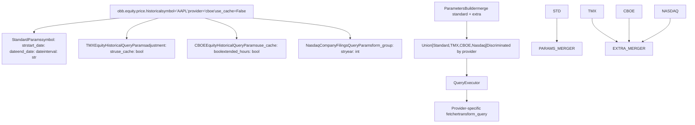

# 其他提供程序

相关源文件

-   [cli/poetry.lock](https://github.com/OpenBB-finance/OpenBB/blob/dddc3b32/cli/poetry.lock)
-   [openbb_platform/core/openbb/assets/reference.json](https://github.com/OpenBB-finance/OpenBB/blob/dddc3b32/openbb_platform/core/openbb/assets/reference.json)
-   [openbb_platform/core/openbb_core/provider/standard_models/company_filings.py](https://github.com/OpenBB-finance/OpenBB/blob/dddc3b32/openbb_platform/core/openbb_core/provider/standard_models/company_filings.py)
-   [openbb_platform/core/poetry.lock](https://github.com/OpenBB-finance/OpenBB/blob/dddc3b32/openbb_platform/core/poetry.lock)
-   [openbb_platform/core/pyproject.toml](https://github.com/OpenBB-finance/OpenBB/blob/dddc3b32/openbb_platform/core/pyproject.toml)
-   [openbb_platform/dev_install.py](https://github.com/OpenBB-finance/OpenBB/blob/dddc3b32/openbb_platform/dev_install.py)
-   [openbb_platform/extensions/devtools/poetry.lock](https://github.com/OpenBB-finance/OpenBB/blob/dddc3b32/openbb_platform/extensions/devtools/poetry.lock)
-   [openbb_platform/extensions/devtools/pyproject.toml](https://github.com/OpenBB-finance/OpenBB/blob/dddc3b32/openbb_platform/extensions/devtools/pyproject.toml)
-   [openbb_platform/extensions/equity/integration/test_equity_api.py](https://github.com/OpenBB-finance/OpenBB/blob/dddc3b32/openbb_platform/extensions/equity/integration/test_equity_api.py)
-   [openbb_platform/extensions/equity/integration/test_equity_python.py](https://github.com/OpenBB-finance/OpenBB/blob/dddc3b32/openbb_platform/extensions/equity/integration/test_equity_python.py)
-   [openbb_platform/extensions/equity/openbb_equity/fundamental/fundamental_router.py](https://github.com/OpenBB-finance/OpenBB/blob/dddc3b32/openbb_platform/extensions/equity/openbb_equity/fundamental/fundamental_router.py)
-   [openbb_platform/extensions/etf/integration/test_etf_api.py](https://github.com/OpenBB-finance/OpenBB/blob/dddc3b32/openbb_platform/extensions/etf/integration/test_etf_api.py)
-   [openbb_platform/extensions/etf/integration/test_etf_python.py](https://github.com/OpenBB-finance/OpenBB/blob/dddc3b32/openbb_platform/extensions/etf/integration/test_etf_python.py)
-   [openbb_platform/poetry.lock](https://github.com/OpenBB-finance/OpenBB/blob/dddc3b32/openbb_platform/poetry.lock)
-   [openbb_platform/providers/fmp/openbb_fmp/__init__.py](https://github.com/OpenBB-finance/OpenBB/blob/dddc3b32/openbb_platform/providers/fmp/openbb_fmp/__init__.py)
-   [openbb_platform/providers/fmp/openbb_fmp/models/company_filings.py](https://github.com/OpenBB-finance/OpenBB/blob/dddc3b32/openbb_platform/providers/fmp/openbb_fmp/models/company_filings.py)
-   [openbb_platform/providers/fmp/pyproject.toml](https://github.com/OpenBB-finance/OpenBB/blob/dddc3b32/openbb_platform/providers/fmp/pyproject.toml)
-   [openbb_platform/providers/fmp/tests/test_fmp_fetchers.py](https://github.com/OpenBB-finance/OpenBB/blob/dddc3b32/openbb_platform/providers/fmp/tests/test_fmp_fetchers.py)
-   [openbb_platform/providers/intrinio/openbb_intrinio/__init__.py](https://github.com/OpenBB-finance/OpenBB/blob/dddc3b32/openbb_platform/providers/intrinio/openbb_intrinio/__init__.py)
-   [openbb_platform/providers/intrinio/openbb_intrinio/models/company_filings.py](https://github.com/OpenBB-finance/OpenBB/blob/dddc3b32/openbb_platform/providers/intrinio/openbb_intrinio/models/company_filings.py)
-   [openbb_platform/providers/intrinio/tests/test_intrinio_fetchers.py](https://github.com/OpenBB-finance/OpenBB/blob/dddc3b32/openbb_platform/providers/intrinio/tests/test_intrinio_fetchers.py)
-   [openbb_platform/providers/sec/openbb_sec/__init__.py](https://github.com/OpenBB-finance/OpenBB/blob/dddc3b32/openbb_platform/providers/sec/openbb_sec/__init__.py)
-   [openbb_platform/providers/sec/openbb_sec/utils/form4.py](https://github.com/OpenBB-finance/OpenBB/blob/dddc3b32/openbb_platform/providers/sec/openbb_sec/utils/form4.py)
-   [openbb_platform/providers/sec/tests/test_sec_fetchers.py](https://github.com/OpenBB-finance/OpenBB/blob/dddc3b32/openbb_platform/providers/sec/tests/test_sec_fetchers.py)
-   [openbb_platform/providers/tmx/openbb_tmx/models/company_filings.py](https://github.com/OpenBB-finance/OpenBB/blob/dddc3b32/openbb_platform/providers/tmx/openbb_tmx/models/company_filings.py)
-   [openbb_platform/providers/yfinance/poetry.lock](https://github.com/OpenBB-finance/OpenBB/blob/dddc3b32/openbb_platform/providers/yfinance/poetry.lock)
-   [openbb_platform/pyproject.toml](https://github.com/OpenBB-finance/OpenBB/blob/dddc3b32/openbb_platform/pyproject.toml)

## 目的与范围

本页记录了除核心经济和金融提供程序之外，OpenBB 平台中由社区贡献的其他数据提供程序。这些包括特定市场的提供程序 (TMX, CBOE, Nasdaq)、新闻聚合器 (Biztoc, Finviz, Seeking Alpha)、专用数据源 (Alpha Vantage, ECB, FINRA) 以及学术数据集 (Fama-French)。

有关 FMP、Intrinio、SEC 和 YFinance 等核心金融提供程序，请参阅 [Financial Data Providers](/OpenBB-finance/OpenBB/4.3-financial-data-providers)。有关 FRED 和 OECD 等核心经济数据提供程序，请参阅 [Economic Data Providers](/OpenBB-finance/OpenBB/4.2-economic-data-providers)。有关提供程序架构和集成机制的详细信息，请参阅 [Provider Architecture](/OpenBB-finance/OpenBB/2.3-provider-architecture)。

## 概述

OpenBB 平台中的其他提供程序被归类为可选依赖项，它们通过专用数据源扩展了平台的功能。与始终安装的核心提供程序不同，这些提供程序通过 Poetry 的 extras 功能单独安装，或者由社区贡献。

### 提供程序分类

平台通过 Poetry 依赖项配置来区分核心提供程序和可选提供程序：

**核心提供程序**（始终随基础包安装）：

-   `openbb-benzinga`, `openbb-bls`, `openbb-cftc`, `openbb-congress-gov`, `openbb-econdb`
-   `openbb-federal-reserve`, `openbb-fmp`, `openbb-fred`, `openbb-government-us`, `openbb-imf`
-   `openbb-intrinio`, `openbb-oecd`, `openbb-sec`, `openbb-tiingo`, `openbb-tradingeconomics`
-   `openbb-us-eia`, `openbb-yfinance`

**可选提供程序**（通过 extras 安装）：

-   市场数据：`openbb-alpha-vantage`, `openbb-cboe`, `openbb-nasdaq`, `openbb-tmx`, `openbb-tradier`
-   新闻与分析：`openbb-biztoc`, `openbb-seeking-alpha`, `openbb-stockgrid`, `openbb-wsj`
-   专用数据：`openbb-deribit`, `openbb-ecb`, `openbb-finra`, `openbb-finviz`, `openbb-multpl`
-   学术数据：`openbb-famafrench`

来源：[openbb_platform/pyproject.toml16-32](https://github.com/OpenBB-finance/OpenBB/blob/dddc3b32/openbb_platform/pyproject.toml#L16-L32) [openbb_platform/pyproject.toml47-61](https://github.com/OpenBB-finance/OpenBB/blob/dddc3b32/openbb_platform/pyproject.toml#L47-L61)

### 安装方法

可选提供程序使用 Poetry extras 语法进行安装。可以根据需要安装单个或多个提供程序：

```bash
# 安装单个提供程序
pip install openbb[tmx]

# 安装多个提供程序
pip install openbb[tmx,cboe,nasdaq]

# 安装所有可选提供程序
pip install openbb[all]
```
extras 配置将提供程序名称映射到它们各自的包，从而可以根据用例需求进行选择性安装。

来源：[openbb_platform/pyproject.toml69-113](https://github.com/OpenBB-finance/OpenBB/blob/dddc3b32/openbb_platform/pyproject.toml#L69-L113)

### 开发配置

对于本地开发，`dev_install.py` 脚本将提供程序配置为可编辑的路径依赖项，允许在不发布的情况下同步开发多个提供程序：

```toml
openbb-tmx = { path = "./providers/tmx", optional = true, develop = true }
openbb-cboe = { path = "./providers/cboe", optional = true, develop = true }
openbb-nasdaq = { path = "./providers/nasdaq", optional = true, develop = true }
```
这使得在开发工作流中对提供程序代码的更改能够立即反映出来，而无需重新安装。

来源：[openbb_platform/dev_install.py59-61](https://github.com/OpenBB-finance/OpenBB/blob/dddc3b32/openbb_platform/dev_install.py#L59-L61)

## 提供程序架构集成

所有其他提供程序都通过核心提供程序所使用的相同标准化架构集成到 OpenBB 平台中。下图展示了可选提供程序如何为标准模型注册它们的实现：

```mermaid
flowchart TD
    TMX["TMXProvideropenbb-tmx package"]
    CBOE["CBOEProvideropenbb-cboe package"]
    NASDAQ["NasdaqProvideropenbb-nasdaq package"]
    TRADIER["TradierProvideropenbb-tradier package"]
    FINVIZ["FinvizProvideropenbb-finviz package"]
    SEEKING["SeekingAlphaProvideropenbb-seeking-alpha package"]
    TMX_FILINGS["TMXCompanyFilingsFetcher"]
    TMX_HIST["TMXEquityHistoricalFetcher"]
    CBOE_HIST["CBOEEquityHistoricalFetcher"]
    CBOE_SEARCH["CBOEEquitySearchFetcher"]
    NASDAQ_FILINGS["NasdaqCompanyFilingsFetcher"]
    NASDAQ_CAL["NasdaqCalendarEarningsFetcher"]
    TRADIER_HIST["TradierEquityHistoricalFetcher"]
    FINVIZ_SCREEN["FinvizEquityScreenerFetcher"]
    SEEKING_CAL["SeekingAlphaCalendarEarningsFetcher"]
    PI["ProviderInterface"]
    FETCHER_MAP["fetcher_mapDict[str,Dict[str,Type]]"]
    PC["ProviderChoicesRuntime enum"]
    MODEL_FILINGS["CompanyFilings"]
    MODEL_HIST["EquityHistorical"]
    MODEL_SEARCH["EquitySearch"]
    MODEL_CAL["CalendarEarnings"]

    TMX --> TMX_FILINGS
    TMX --> TMX_HIST
    CBOE --> CBOE_HIST
    CBOE --> CBOE_SEARCH
    NASDAQ --> NASDAQ_FILINGS
    NASDAQ --> NASDAQ_CAL
    TRADIER --> TRADIER_HIST
    FINVIZ --> FINVIZ_SCREEN
    SEEKING --> SEEKING_CAL
    TMX --> FILINGS_MODEL_FILINGS
    TMX --> HIST_MODEL_HIST
    CBOE --> HIST_MODEL_HIST
    CBOE --> SEARCH_MODEL_SEARCH
    NASDAQ --> FILINGS_MODEL_FILINGS
    NASDAQ --> CAL_MODEL_CAL
    TRADIER --> HIST_MODEL_HIST
    SEEKING --> CAL_MODEL_CAL
    TMX --> FILINGS_FETCHER_MAP
    TMX --> HIST_FETCHER_MAP
    CBOE --> HIST_FETCHER_MAP
    CBOE --> SEARCH_FETCHER_MAP
    NASDAQ --> FILINGS_FETCHER_MAP
    NASDAQ --> CAL_FETCHER_MAP
    TRADIER --> HIST_FETCHER_MAP
    FINVIZ --> SCREEN_FETCHER_MAP
    SEEKING --> CAL_FETCHER_MAP
    FETCHER --> MAP_PI
    PI --> PC
```


来源：[openbb_platform/extensions/equity/integration/test_equity_python.py112](https://github.com/OpenBB-finance/OpenBB/blob/dddc3b32/openbb_platform/extensions/equity/integration/test_equity_python.py#L112-L112) [openbb_platform/extensions/equity/integration/test_equity_python.py248](https://github.com/OpenBB-finance/OpenBB/blob/dddc3b32/openbb_platform/extensions/equity/integration/test_equity_python.py#L248-L248) [openbb_platform/extensions/equity/integration/test_equity_python.py986](https://github.com/OpenBB-finance/OpenBB/blob/dddc3b32/openbb_platform/extensions/equity/integration/test_equity_python.py#L986-L986) [openbb_platform/extensions/equity/integration/test_equity_python.py1289](https://github.com/OpenBB-finance/OpenBB/blob/dddc3b32/openbb_platform/extensions/equity/integration/test_equity_python.py#L1289-L1289)

## 市场数据提供程序

### TMX 提供程序

TMX 提供程序 (`openbb-tmx`) 提供来自多伦多证券交易所和 TSX Venture 交易所的加拿大市场数据。它实现了具有加拿大特定功能的多个标准模型。

**支持的标准模型：**

-   `EquitySearch` - 搜索加拿大证券
-   `EquityHistorical` - 历史价格数据
-   `EquityProfile` - 公司概况
-   `CompanyFilings` - SEDAR 备案文件集成
-   `EtfSearch` - 加拿大 ETF 搜索
-   `EtfHoldings` - ETF 持仓数据
-   `InsiderTrading` - 加拿大内幕交易
-   `OptionsChains` - TSX 期权数据
-   `CalendarEarnings` - 财报日历
-   `PriceTargetConsensus` - 分析师共识

**符号格式：**

TMX 使用后缀记号来区分加拿大和美国上市的跨市场证券：

-   `"RY"` - 在 TSX 上市的加拿大皇家银行
-   `"TD:US"` - 在美国交易所上市的多伦多道明银行
-   `"AAPL:US"` - 在美国交易所上市的苹果公司（用于历史数据）

**提供程序特定参数：**

TMX 提供程序通过其查询参数暴露了额外的参数：

```python
# 带有 TMX 特定过滤器的 ETF 搜索
result = obb.etf.search(
    query="vanguard",
    provider="tmx",
    div_freq="quarterly",  # TMX 特定：按分红频率过滤
    sort_by="return_1y",   # TMX 特定：按 1 年回报率排序
    use_cache=False
)

# 来自 SEDAR 的公司备案文件
filings = obb.equity.fundamental.filings(
    symbol="RY",
    provider="tmx",
    start_date="2023-09-30",
    end_date="2023-12-31"
)
```
来源：[openbb_platform/extensions/etf/integration/test_etf_python.py27-32](https://github.com/OpenBB-finance/OpenBB/blob/dddc3b32/openbb_platform/extensions/etf/integration/test_etf_python.py#L27-L32) [openbb_platform/extensions/equity/integration/test_equity_python.py248](https://github.com/OpenBB-finance/OpenBB/blob/dddc3b32/openbb_platform/extensions/equity/integration/test_equity_python.py#L248-L248) [openbb_platform/extensions/equity/integration/test_equity_python.py885-890](https://github.com/OpenBB-finance/OpenBB/blob/dddc3b32/openbb_platform/extensions/equity/integration/test_equity_python.py#L885-L890) [openbb_platform/providers/tmx/openbb_tmx/models/company_filings.py1-15](https://github.com/OpenBB-finance/OpenBB/blob/dddc3b32/openbb_platform/providers/tmx/openbb_tmx/models/company_filings.py#L1-L15)

### CBOE 提供程序

CBOE 提供程序 (`openbb-cboe`) 提供来自芝加哥期权交易所的实时和历史数据，并支持高分辨率的分时（intraday）数据。

**支持的标准模型：**

-   `EquityHistorical` - 历史股票价格（1 分钟到日线）
-   `EquitySearch` - 证券搜索
-   `IndexConstituents` - 指数成分数据
-   `OptionsChains` - 期权数据
-   `MarketSnapshots` - 实时快照

**缓存控制：**

CBOE 实现了一种由 `use_cache` 参数控制的缓存机制，在开发过程中或处理近期数据时对于减少 API 调用非常有用：

```python
# 禁用实时数据的缓存
result = obb.equity.price.historical(
    symbol="AAPL",
    provider="cboe",
    start_date="2024-01-01",
    end_date="2024-01-02",
    interval="1m",
    use_cache=False
)
```
**分时分辨率：**

CBOE 支持低至 1 分钟粒度的高分辨率分时时间间隔，使其适用于算法交易和回测应用。

来源：[openbb_platform/extensions/equity/integration/test_equity_python.py986-1003](https://github.com/OpenBB-finance/OpenBB/blob/dddc3b32/openbb_platform/extensions/equity/integration/test_equity_python.py#L986-L1003) [openbb_platform/extensions/equity/integration/test_equity_python.py1289](https://github.com/OpenBB-finance/OpenBB/blob/dddc3b32/openbb_platform/extensions/equity/integration/test_equity_python.py#L1289-L1289)

### Nasdaq 提供程序

Nasdaq 提供程序 (`openbb-nasdaq`) 提供 Nasdaq 交易所数据，包括上市信息、日历事件和公司备案文件。

**支持的标准模型：**

-   `CalendarDividend` - 股息日历
-   `CalendarEarnings` - 财报公告
-   `CalendarIpo` - IPO 日历
-   `CompanyFilings` - SEC 备案文件元数据
-   `EquitySearch` - 证券搜索
-   `TopRetail` - 最受零售投资者欢迎的股票

**备案文件查询能力：**

Nasdaq 提供按表单组和年份划分的结构化备案文件查询，简化了对定期报告的访问：

```python
# 查询特定年份的年报
filings = obb.equity.fundamental.filings(
    symbol="AAPL",
    provider="nasdaq",
    form_group="annual",  # 选项："annual", "quarterly", "proxies" 等
    year=2024
)
```
`form_group` 参数映射到常见的备案类别，消除了指定单个表单类型的需要。

来源：[openbb_platform/extensions/equity/integration/test_equity_python.py80-81](https://github.com/OpenBB-finance/OpenBB/blob/dddc3b32/openbb_platform/extensions/equity/integration/test_equity_python.py#L80-L81) [openbb_platform/extensions/equity/integration/test_equity_python.py123-124](https://github.com/OpenBB-finance/OpenBB/blob/dddc3b32/openbb_platform/extensions/equity/integration/test_equity_python.py#L123-L124) [openbb_platform/extensions/equity/integration/test_equity_python.py893-898](https://github.com/OpenBB-finance/OpenBB/blob/dddc3b32/openbb_platform/extensions/equity/integration/test_equity_python.py#L893-L898)

### Tradier 提供程序

Tradier 提供程序 (`openbb-tradier`) 通过 Tradier API 提供经纪级别的市场数据，包括支持延长交易时段的股票、期权和期货。

**支持的标准模型：**

-   `EquityHistorical` - 包含延长交易时段的历史价格
-   `EquityQuote` - 实时报价
-   `EquitySearch` - 证券搜索
-   `OptionsChains` - 期权数据
-   `OptionsUnusual` - 异常期权活动

**延长交易时段：**

Tradier 支持延长交易时段的数据，允许分析盘前和盘后价格走势：

```python
# 获取包含延长交易时段的分时数据
result = obb.equity.price.historical(
    symbol="AAPL,MSFT",
    provider="tradier",
    start_date="2023-01-01",
    end_date="2023-06-06",
    interval="15m",
    extended_hours=True  # 包含盘前和盘后数据
)
```
**灵活的时间间隔：**

Tradier 支持灵活的时间间隔格式，包括分钟 (`"15m"`)、月份 (`"1M"`) 以及满足不同分析需求的各种时间框架。

来源：[openbb_platform/extensions/equity/integration/test_equity_python.py1094-1111](https://github.com/OpenBB-finance/OpenBB/blob/dddc3b32/openbb_platform/extensions/equity/integration/test_equity_python.py#L1094-L1111) [openbb_platform/extensions/equity/integration/test_equity_python.py1292](https://github.com/OpenBB-finance/OpenBB/blob/dddc3b32/openbb_platform/extensions/equity/integration/test_equity_python.py#L1292-L1292)

### Alpha Vantage 提供程序

Alpha Vantage 提供程序 (`openbb-alpha-vantage`) 提供全球股票数据、技术指标和货币汇率。

**支持的标准模型：**

-   `EquityHistorical` - 历史价格
-   `CurrencyHistorical` - 外汇汇率
-   技术指标
-   公司基本面

**复权控制：**

Alpha Vantage 提供对公司行为复权的粒度控制：

```python
result = obb.equity.price.historical(
    symbol="AAPL",
    provider="alpha_vantage",
    start_date="2023-01-01",
    end_date="2023-06-06",
    interval="15m",
    adjustment="unadjusted",  # 选项："unadjusted", "splits_only", "splits_and_dividends"
    extended_hours=True
)
```
来源：[openbb_platform/extensions/equity/integration/test_equity_python.py975-982](https://github.com/OpenBB-finance/OpenBB/blob/dddc3b32/openbb_platform/extensions/equity/integration/test_equity_python.py#L975-L982)

## 新闻与分析提供程序

### Seeking Alpha 提供程序

Seeking Alpha 提供程序 (`openbb-seeking-alpha`) 提供财务新闻、分析、盈利日历数据和分析师预测。

**支持的标准模型：**

-   `CalendarEarnings` - 包含国家过滤器的盈利公告
-   `ForwardEps` - 远期 EPS 预测
-   `ForwardSales` - 远期收入预测
-   `PriceTargetConsensus` - 分析师价格目标
-   `CompanyNews` - 新闻与分析文章

**地理位置过滤：**

Seeking Alpha 支持针对盈利和预测数据的特定国家查询：

```python
# 美国财报日历
us_earnings = obb.equity.calendar.earnings(
    provider="seeking_alpha",
    country="us"
)

# 加拿大公司预测
canadian_eps = obb.equity.estimates.forward_eps(
    symbol="AAPL,BAM:CA",
    period="annual",
    provider="seeking_alpha"
)
```
国家代码过滤可以实现特定区域的分析，并在关注特定市场时减少结果噪音。

来源：[openbb_platform/extensions/equity/integration/test_equity_python.py115-120](https://github.com/OpenBB-finance/OpenBB/blob/dddc3b32/openbb_platform/extensions/equity/integration/test_equity_python.py#L115-L120) [openbb_platform/extensions/equity/integration/test_equity_python.py676-681](https://github.com/OpenBB-finance/OpenBB/blob/dddc3b32/openbb_platform/extensions/equity/integration/test_equity_python.py#L676-L681) [openbb_platform/extensions/equity/integration/test_equity_python.py716-721](https://github.com/OpenBB-finance/OpenBB/blob/dddc3b32/openbb_platform/extensions/equity/integration/test_equity_python.py#L716-L721)

### Finviz 提供程序

Finviz 提供程序 (`openbb-finviz`) 提供筛选工具和可视化市场数据分析，支持比较性的分组分析。

**支持的标准模型：**

-   `EquityCompareGroups` - 按国家、板块、行业进行的比较分析
-   `EquityFundamentalMetrics` - 关键指标仪表盘
-   `EquityScreener` - 股票筛选器
-   `PriceTarget` - 分析师价格目标

**分组比较：**

Finviz 支持在预定义的市场细分领域进行比较分析：

```python
# 按估值指标比较国家
countries = obb.equity.compare.groups(
    group="country",
    metric="overview",
    provider="finviz"
)

# 获取多个符号的基本面指标
metrics = obb.equity.fundamental.metrics(
    symbol="AAPL,GOOG",
    provider="finviz"
)
```
分组比较功能在市场细分领域汇总指标，促进了自上而下的分析方法。

来源：[openbb_platform/extensions/equity/integration/test_equity_python.py959](https://github.com/OpenBB-finance/OpenBB/blob/dddc3b32/openbb_platform/extensions/equity/integration/test_equity_python.py#L959-L959) [openbb_platform/extensions/equity/integration/test_equity_python.py523](https://github.com/OpenBB-finance/OpenBB/blob/dddc3b32/openbb_platform/extensions/equity/integration/test_equity_python.py#L523-L523) [openbb_platform/extensions/equity/integration/test_equity_python.py600](https://github.com/OpenBB-finance/OpenBB/blob/dddc3b32/openbb_platform/extensions/equity/integration/test_equity_python.py#L600-L600)

### Biztoc 提供程序

Biztoc 提供程序 (`openbb-biztoc`) 汇总了来自多个来源的商业和财经新闻，并实时更新。

**支持的标准模型：**

-   `CompanyNews` - 公司特定新闻
-   `WorldNews` - 通用财经新闻
-   热点话题

### WSJ 提供程序

《华尔街日报》提供程序 (`openbb-wsj`) 提供 WSJ 财经新闻和市场分析。

**支持的标准模型：**

-   `CompanyNews` - WSJ 公司报道
-   市场洞察
-   经济评论

### Stockgrid 提供程序

Stockgrid 提供程序 (`openbb-stockgrid`) 提供社交情绪和零售交易数据。

**支持的标准模型：**

-   卖空数据
-   暗池活动
-   期权流
-   零售情绪指标

来源：[openbb_platform/pyproject.toml56-61](https://github.com/OpenBB-finance/OpenBB/blob/dddc3b32/openbb_platform/pyproject.toml#L56-L61)

## 专用数据提供程序

### ECB 提供程序

欧洲中央银行提供程序 (`openbb-ecb`) 提供官方 ECB 经济统计和货币政策数据。

**支持的标准模型：**

-   利率（ECB 关键利率）
-   汇率（欧元交叉汇率）
-   货币总量 (M1, M2, M3)
-   国际收支

### FINRA 提供程序

FINRA 提供程序 (`openbb-finra`) 提供来自金融业监管局的监管数据。

**支持的标准模型：**

-   卖空报告
-   场外交易 (OTC) 统计数据
-   公司债券数据 (TRACE)
-   市场透明度报告

### Deribit 提供程序

Deribit 提供程序 (`openbb-deribit`) 专门提供来自 Deribit 交易所的加密货币衍生品数据。

**支持的标准模型：**

-   加密货币期权链
-   加密货币期货数据
-   历史波动率
-   希腊字母和隐含波动率表面

来源：[openbb_platform/pyproject.toml50-52](https://github.com/OpenBB-finance/OpenBB/blob/dddc3b32/openbb_platform/pyproject.toml#L50-L52) [openbb_platform/pyproject.toml53](https://github.com/OpenBB-finance/OpenBB/blob/dddc3b32/openbb_platform/pyproject.toml#L53-L53) [openbb_platform/pyproject.toml74](https://github.com/OpenBB-finance/OpenBB/blob/dddc3b32/openbb_platform/pyproject.toml#L74-L74)

## 学术与研究提供程序

### Fama-French 提供程序

Fama-French 提供程序 (`openbb-famafrench`) 提供对肯尼斯·弗伦奇数据库 (Kenneth French Data Library) 的访问，该数据库广泛用于金融学术研究。

**支持的标准模型：**

-   因子回报 (Mkt-RF, SMB, HML, RMW, CMA, UMD)
-   投资组合排序（规模、价值、盈利性）
-   行业投资组合（5, 10, 12, 17, 30, 38, 48, 49 个行业）
-   研究数据集

**用例：**

Fama-French 因子是资产定价研究的基础，常用于：

-   多因子模型构建
-   投资组合业绩归因
-   风险调整后收益分析
-   学术实证研究

### Multpl 提供程序

Multpl 提供程序 (`openbb-multpl`) 提供长期历史市场估值指标和经济指标。

**支持的标准模型：**

-   席勒市盈率 (CAPE ratio)
-   市值与 GDP 之比
-   历史股息收益率
-   长期市场趋势

**数据历史：**

Multpl 数据集通常追溯到几十年前，为当前的市场估值提供长期趋势分析和历史背景。

来源：[openbb_platform/pyproject.toml52](https://github.com/OpenBB-finance/OpenBB/blob/dddc3b32/openbb_platform/pyproject.toml#L52-L52) [openbb_platform/pyproject.toml55](https://github.com/OpenBB-finance/OpenBB/blob/dddc3b32/openbb_platform/pyproject.toml#L55-L55)

## 提供程序特定参数模式

下图展示了提供程序特定参数如何通过参数合并系统流动：


来源：[openbb_platform/extensions/equity/integration/test_equity_python.py975-1122](https://github.com/OpenBB-finance/OpenBB/blob/dddc3b32/openbb_platform/extensions/equity/integration/test_equity_python.py#L975-L1122)

**参数用法示例：**

```python
# TMX 特定：分红频率过滤器
obb.etf.search(
    query="vanguard",
    provider="tmx",
    div_freq="quarterly",
    sort_by="return_1y"
)

# CBOE 特定：缓存控制
obb.equity.price.historical(
    symbol="AAPL",
    provider="cboe",
    use_cache=False,
    interval="1m"
)

# Nasdaq 特定：表单组和年份
obb.equity.fundamental.filings(
    symbol="AAPL",
    provider="nasdaq",
    form_group="annual",
    year=2024
)

# Tradier 特定：延长交易时段
obb.equity.price.historical(
    symbol="AAPL",
    provider="tradier",
    extended_hours=True
)

# Alpha Vantage 特定：调整模式
obb.equity.price.historical(
    symbol="AAPL",
    provider="alpha_vantage",
    adjustment="splits_only"
)
```
来源：[openbb_platform/extensions/etf/integration/test_etf_python.py27-32](https://github.com/OpenBB-finance/OpenBB/blob/dddc3b32/openbb_platform/extensions/etf/integration/test_etf_python.py#L27-L32) [openbb_platform/extensions/equity/integration/test_equity_python.py986-1003](https://github.com/OpenBB-finance/OpenBB/blob/dddc3b32/openbb_platform/extensions/equity/integration/test_equity_python.py#L986-L1003) [openbb_platform/extensions/equity/integration/test_equity_python.py893-898](https://github.com/OpenBB-finance/OpenBB/blob/dddc3b32/openbb_platform/extensions/equity/integration/test_equity_python.py#L893-L898)

## 提供程序比较矩阵

| 提供程序 | 类型 | 地理重点 | 更新频率 | 身份验证 | 是否需要 API 密钥 |
| --- | --- | --- | --- | --- | --- |
| **TMX** | 市场数据 | 加拿大 | 实时 | 可选 | 否 |
| **CBOE** | 市场数据 | 美国期权 | 实时 | 可选 | 否 |
| **Nasdaq** | 市场数据 | 美国股票 | 每日 | 可选 | 否 |
| **Tradier** | 市场数据 | 美国多资产 | 实时 | 必须 | 是 |
| **Alpha Vantage** | 市场数据 | 全球 | 15 分钟延迟 | 必须 | 是 |
| **Seeking Alpha** | 新闻/分析 | 全球 | 每日 | 可选 | 否 |
| **Finviz** | 筛选 | 美国股票 | 每日 | 可选 | 否 |
| **Biztoc** | 新闻聚合 | 全球 | 实时 | 可选 | 否 |
| **WSJ** | 优质新闻 | 全球 | 实时 | 必须 | 是 |
| **Stockgrid** | 情绪 | 美国股票 | 实时 | 必须 | 是 |
| **ECB** | 经济数据 | 欧元区 | 每日/每月 | 无 | 否 |
| **FINRA** | 监管 | 美国市场 | 每日 | 无 | 否 |
| **Deribit** | 加密货币衍生品 | 全球加密货币 | 实时 | 必须 | 是 |
| **Fama-French** | 学术 | 美国因子 | 每月 | 无 | 否 |
| **Multpl** | 历史数据 | 美国市场 | 每日 | 无 | 否 |

来源：[openbb_platform/pyproject.toml47-61](https://github.com/OpenBB-finance/OpenBB/blob/dddc3b32/openbb_platform/pyproject.toml#L47-L61)

## 配置与凭据

需要 API 凭据的其他提供程序集成了 OpenBB 凭据管理系统。凭据存储在用户设置中，并在查询执行期间自动访问。

**凭据配置：**

```python
from openbb import obb

# 以编程方式设置提供程序凭据
obb.user.credentials.alpha_vantage_api_key = "your_api_key"
obb.user.credentials.tradier_api_key = "your_api_key"
obb.user.credentials.nasdaq_api_key = "your_api_key"

# 凭据会自动注入到提供程序请求中
result = obb.equity.price.historical(
    symbol="AAPL",
    provider="alpha_vantage"
)
```
**凭据存储：**

也可以通过遵循 `OPENBB_{PROVIDER}_{CREDENTIAL_TYPE}` 模式的环境变量来设置凭据：

```bash
export OPENBB_ALPHA_VANTAGE_API_KEY="your_key"
export OPENBB_TRADIER_API_KEY="your_key"
```
凭据系统在实现提供程序之间分离的同时，支持统一的配置管理。

来源：[openbb_platform/providers/intrinio/tests/test_intrinio_fetchers.py70-72](https://github.com/OpenBB-finance/OpenBB/blob/dddc3b32/openbb_platform/providers/intrinio/tests/test_intrinio_fetchers.py#L70-L72) [openbb_platform/providers/fmp/tests/test_fmp_fetchers.py7-8](https://github.com/OpenBB-finance/OpenBB/blob/dddc3b32/openbb_platform/providers/fmp/tests/test_fmp_fetchers.py#L7-L8)

## 测试与集成

其他提供程序使用参数化的集成测试进行测试，验证针对每个标准模型的多个提供程序的实现正确性。

**测试结构：**

```python
@pytest.mark.parametrize(
    "params",
    [
        ({"query": "AAPL", "is_symbol": True, "provider": "cboe", "use_cache": False}),
        ({"query": "", "provider": "nasdaq", "is_etf": True}),
        ({"query": "gold", "provider": "tmx", "use_cache": False}),
        ({"query": "gold", "provider": "tradier", "is_symbol": False}),
        ({"query": "gold", "provider": "intrinio", "active": True, "limit": 100}),
    ],
)
@pytest.mark.integration
def test_equity_search(params, obb):
    """测试股票搜索端点。"""
    result = obb.equity.search(**params)
    assert result
    assert isinstance(result, OBBject)
    assert len(result.results) > 0
```
参数化方法确保了跨提供程序的一致行为，同时适应了提供程序特定的参数。

**VCR Cassettes：**

集成测试使用 VCR (Video Cassette Recorder) 来录制 HTTP 交互，实现在没有实时 API 调用下的确定性测试执行：

```python
@pytest.fixture(scope="module")
def vcr_config():
    """VCR 配置。"""
    return {
        "filter_headers": [("User-Agent", None)],
        "filter_query_parameters": [None],
    }
```
来源：[openbb_platform/extensions/equity/integration/test_equity_python.py1287-1311](https://github.com/OpenBB-finance/OpenBB/blob/dddc3b32/openbb_platform/extensions/equity/integration/test_equity_python.py#L1287-L1311) [openbb_platform/providers/intrinio/tests/test_intrinio_fetchers.py75-82](https://github.com/OpenBB-finance/OpenBB/blob/dddc3b32/openbb_platform/providers/intrinio/tests/test_intrinio_fetchers.py#L75-L82)

## 贡献其他提供程序

贡献一个新的其他提供程序涉及实现提供程序接口，并通过 Python entry points 注册该提供程序。

**提供程序包结构：**

```text
openbb_platform/providers/{provider_name}/
├── openbb_{provider_name}/
│   ├── __init__.py                      # 提供程序注册
│   ├── utils/
│   │   └── helpers.py                   # 辅助函数
│   └── models/
│       ├── model_one.py                 # Fetcher 实现
│       └── model_two.py
├── tests/
│   ├── test_{provider_name}_fetchers.py # 单元测试
│   └── record/                          # VCR cassettes
├── pyproject.toml                       # 包元数据
└── README.md                            # 提供程序文档
```
**提供程序注册示例：**

```python
# openbb_platform/providers/{provider_name}/openbb_{provider_name}/__init__.py

from openbb_core.provider.abstract.provider import Provider
from openbb_{provider_name}.models.equity_historical import (
    {ProviderName}EquityHistoricalFetcher,
)
from openbb_{provider_name}.models.company_filings import (
    {ProviderName}CompanyFilingsFetcher,
)

{provider_name}_provider = Provider(
    name="{provider_name}",
    website="https://www.{provider}.com",
    description="Description of the provider",
    credentials=["api_key"],  # 可选凭据
    fetcher_dict={
        "EquityHistorical": {ProviderName}EquityHistoricalFetcher,
        "CompanyFilings": {ProviderName}CompanyFilingsFetcher,
    },
)
```
**Fetcher 实现模式：**

每个 fetcher 必须遵循三阶段模式实现三个方法：

```python
class {ProviderName}EquityHistoricalFetcher(
    Fetcher[
        {ProviderName}EquityHistoricalQueryParams,
        List[{ProviderName}EquityHistoricalData],
    ]):
    """股票历史数据 Fetcher。"""

    @staticmethod
    def transform_query(params: Dict[str, Any]) -> {ProviderName}EquityHistoricalQueryParams:
        """转换并验证查询参数。"""
        # 验证逻辑
        return {ProviderName}EquityHistoricalQueryParams(**params)

    @staticmethod
    async def aextract_data(
        query: {ProviderName}EquityHistoricalQueryParams,
        credentials: Optional[Dict[str, str]],
        **kwargs: Any,
    ) -> List[Dict]:
        """从提供程序 API 提取数据。"""
        # API 请求逻辑
        return raw_data

    @staticmethod
    def transform_data(
        query: {ProviderName}EquityHistoricalQueryParams,
        data: List[Dict],
        **kwargs: Any,
    ) -> List[{ProviderName}EquityHistoricalData]:
        """将原始数据转换为标准模型格式。"""
        # 数据转换逻辑
        return [{ProviderName}EquityHistoricalData(**item) for item in data]
```
**添加到 pyproject.toml：**

将提供程序注册为可选依赖项：

```toml
[tool.poetry.dependencies]
openbb-{provider-name} = { version = "^1.0.0", optional = true }

[tool.poetry.extras]
{provider_name} = ["openbb-{provider-name}"]
all = [
    # ... 其他提供程序
    "openbb-{provider-name}",
]
```
**开发安装：**

在 `dev_install.py` 中添加路径依赖：

```python
openbb-{provider-name} = { path = "./providers/{provider_name}", optional = true, develop = true }
```
来源：[openbb_platform/dev_install.py57-71](https://github.com/OpenBB-finance/OpenBB/blob/dddc3b32/openbb_platform/dev_install.py#L57-L71) [openbb_platform/providers/tmx/openbb_tmx/models/company_filings.py1-50](https://github.com/OpenBB-finance/OpenBB/blob/dddc3b32/openbb_platform/providers/tmx/openbb_tmx/models/company_filings.py#L1-L50) [openbb_platform/providers/fmp/openbb_fmp/__init__.py1-100](https://github.com/OpenBB-finance/OpenBB/blob/dddc3b32/openbb_platform/providers/fmp/openbb_fmp/__init__.py#L1-L100)

## 性能与速率限制

其他提供程序根据其数据源和访问层级表现出不同的性能特征和速率限制。

**速率限制类别：**

| 类别 | 每分钟请求数 | 突发容量 | 典型提供程序 |
| --- | --- | --- | --- |
| 免费层级 | 5-25 | 5-10 | Alpha Vantage, 公共 API |
| 基础付费 | 60-120 | 20-30 | Finviz, 基础方案 |
| 专业 | 300-600 | 100-200 | Tradier, Seeking Alpha |
| 企业 | 1000+ | 500+ | 高级订阅 |
| 无限制 | 无限制 | 无限制 | FINRA, ECB, Fama-French |

**缓存策略：**

提供程序实现了各种不同的缓存方法：

-   **显式缓存控制**：CBOE, TMX (`use_cache` 参数)
-   **基于 TTL 的缓存**：新闻提供程序（5-15 分钟缓存）
-   **会话缓存**：历史数据（跨请求持久存在）
-   **不缓存**：实时市场数据流

**数据延迟：**

| 提供程序 | 实时 | 延迟 | 收盘 (EOD) | 历史 |
| --- | --- | --- | --- | --- |
| CBOE | ✓ (< 1s) | - | ✓ | ✓ |
| Tradier | ✓ (< 1s) | - | ✓ | ✓ |
| TMX | ✓ (< 15s) | - | ✓ | ✓ |
| Nasdaq | - | ✓ (15 min) | ✓ | ✓ |
| Alpha Vantage | - | ✓ (15 min) | ✓ | ✓ |
| Seeking Alpha | - | - | ✓ | ✓ |
| Finviz | - | - | ✓ | ✓ |
| Fama-French | - | - | - | ✓ (每月) |

来源：[openbb_platform/extensions/equity/integration/test_equity_python.py986-1003](https://github.com/OpenBB-finance/OpenBB/blob/dddc3b32/openbb_platform/extensions/equity/integration/test_equity_python.py#L986-L1003) [openbb_platform/extensions/etf/integration/test_etf_python.py27-32](https://github.com/OpenBB-finance/OpenBB/blob/dddc3b32/openbb_platform/extensions/etf/integration/test_etf_python.py#L27-L32)
