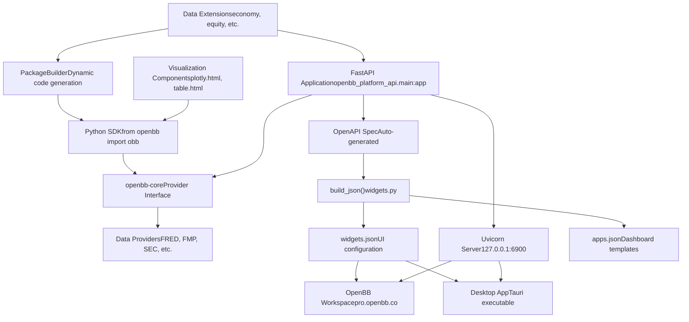
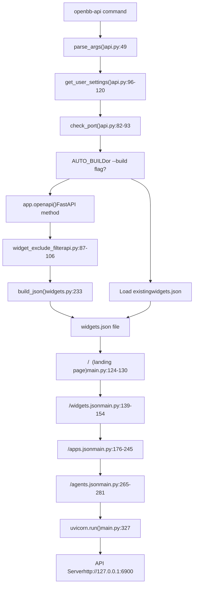
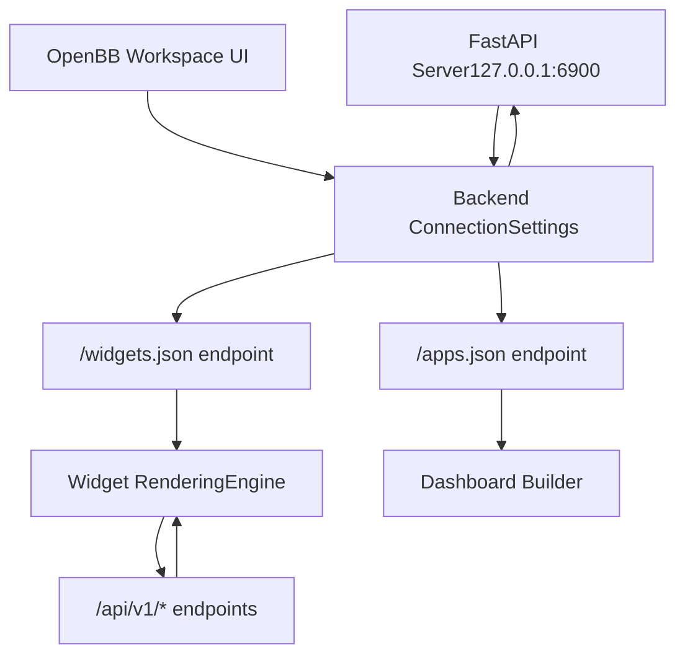
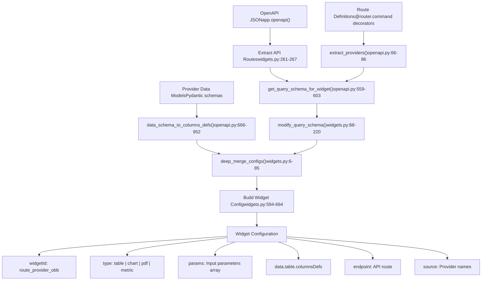
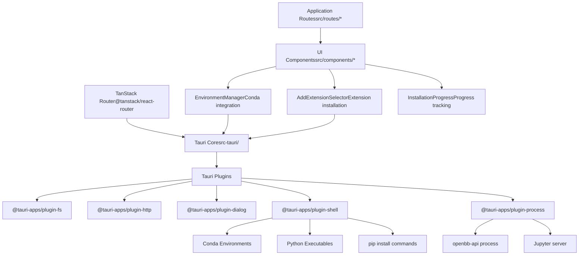
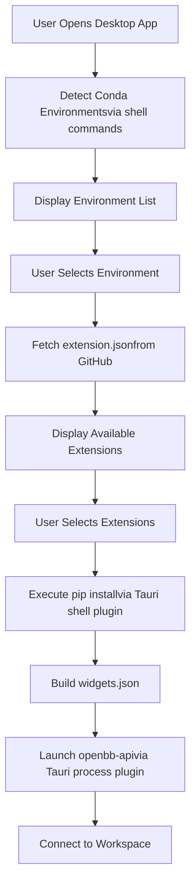
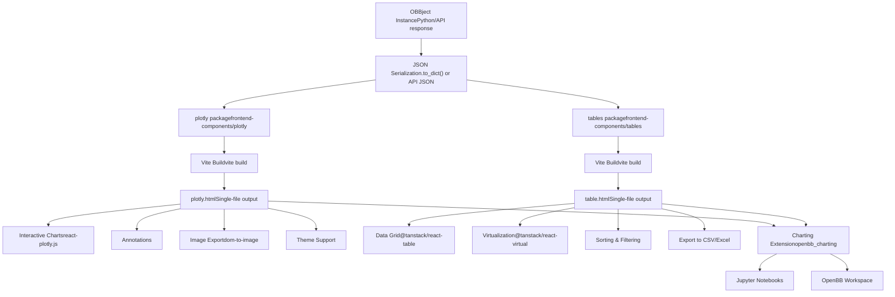
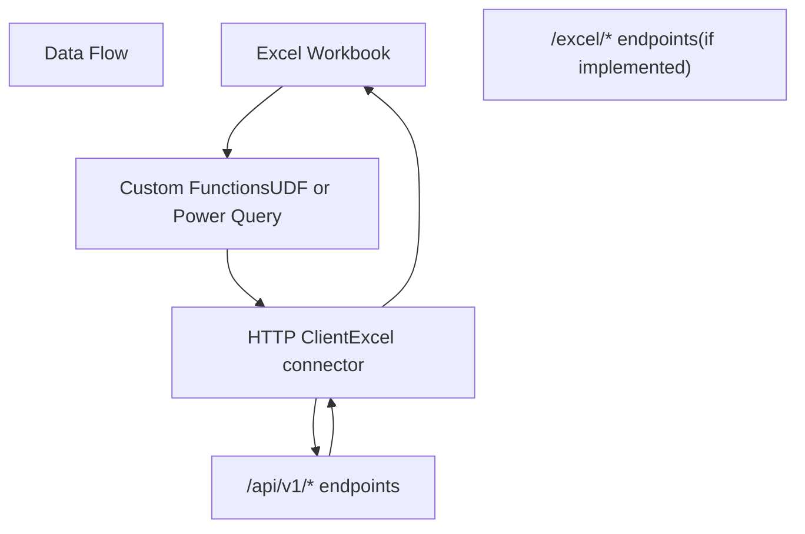

# 用户界面

相关源文件

-   [.codespell.skip](https://github.com/OpenBB-finance/OpenBB/blob/dddc3b32/.codespell.skip)
-   [.pre-commit-config.yaml](https://github.com/OpenBB-finance/OpenBB/blob/dddc3b32/.pre-commit-config.yaml)
-   [README.md](https://github.com/OpenBB-finance/OpenBB/blob/dddc3b32/README.md?plain=1)
-   [desktop/Cargo.lock](https://github.com/OpenBB-finance/OpenBB/blob/dddc3b32/desktop/Cargo.lock)
-   [desktop/package-lock.json](https://github.com/OpenBB-finance/OpenBB/blob/dddc3b32/desktop/package-lock.json)
-   [desktop/package.json](https://github.com/OpenBB-finance/OpenBB/blob/dddc3b32/desktop/package.json)
-   [desktop/src-tauri/Cargo.toml](https://github.com/OpenBB-finance/OpenBB/blob/dddc3b32/desktop/src-tauri/Cargo.toml)
-   [desktop/src-tauri/src/main.rs](https://github.com/OpenBB-finance/OpenBB/blob/dddc3b32/desktop/src-tauri/src/main.rs)
-   [desktop/src-tauri/src/tauri\_handlers/environments.rs](https://github.com/OpenBB-finance/OpenBB/blob/dddc3b32/desktop/src-tauri/src/tauri_handlers/environments.rs)
-   [desktop/src-tauri/src/tauri\_handlers/startup.rs](https://github.com/OpenBB-finance/OpenBB/blob/dddc3b32/desktop/src-tauri/src/tauri_handlers/startup.rs)
-   [desktop/src-tauri/tauri.conf.json](https://github.com/OpenBB-finance/OpenBB/blob/dddc3b32/desktop/src-tauri/tauri.conf.json)
-   [desktop/src/components/AddExtensionSelector.tsx](https://github.com/OpenBB-finance/OpenBB/blob/dddc3b32/desktop/src/components/AddExtensionSelector.tsx)
-   [desktop/src/components/InstallComponents.tsx](https://github.com/OpenBB-finance/OpenBB/blob/dddc3b32/desktop/src/components/InstallComponents.tsx)
-   [desktop/src/main.tsx](https://github.com/OpenBB-finance/OpenBB/blob/dddc3b32/desktop/src/main.tsx)
-   [desktop/src/routes/environments.tsx](https://github.com/OpenBB-finance/OpenBB/blob/dddc3b32/desktop/src/routes/environments.tsx)
-   [desktop/src/routes/installation-progress.tsx](https://github.com/OpenBB-finance/OpenBB/blob/dddc3b32/desktop/src/routes/installation-progress.tsx)
-   [desktop/src/tests/setup.ts](https://github.com/OpenBB-finance/OpenBB/blob/dddc3b32/desktop/src/tests/setup.ts)
-   [frontend-components/plotly/package-lock.json](https://github.com/OpenBB-finance/OpenBB/blob/dddc3b32/frontend-components/plotly/package-lock.json)
-   [frontend-components/plotly/package.json](https://github.com/OpenBB-finance/OpenBB/blob/dddc3b32/frontend-components/plotly/package.json)
-   [frontend-components/tables/package-lock.json](https://github.com/OpenBB-finance/OpenBB/blob/dddc3b32/frontend-components/tables/package-lock.json)
-   [frontend-components/tables/package.json](https://github.com/OpenBB-finance/OpenBB/blob/dddc3b32/frontend-components/tables/package.json)
-   [openbb\_platform/core/openbb\_core/provider/standard\_models/management\_discussion\_analysis.py](https://github.com/OpenBB-finance/OpenBB/blob/dddc3b32/openbb_platform/core/openbb_core/provider/standard_models/management_discussion_analysis.py)
-   [openbb\_platform/extensions/platform\_api/README.md](https://github.com/OpenBB-finance/OpenBB/blob/dddc3b32/openbb_platform/extensions/platform_api/README.md?plain=1)
-   [openbb\_platform/extensions/platform\_api/openbb\_platform\_api/main.py](https://github.com/OpenBB-finance/OpenBB/blob/dddc3b32/openbb_platform/extensions/platform_api/openbb_platform_api/main.py)
-   [openbb\_platform/extensions/platform\_api/openbb\_platform\_api/query\_models.py](https://github.com/OpenBB-finance/OpenBB/blob/dddc3b32/openbb_platform/extensions/platform_api/openbb_platform_api/query_models.py)
-   [openbb\_platform/extensions/platform\_api/openbb\_platform\_api/response\_models.py](https://github.com/OpenBB-finance/OpenBB/blob/dddc3b32/openbb_platform/extensions/platform_api/openbb_platform_api/response_models.py)
-   [openbb\_platform/extensions/platform\_api/openbb\_platform\_api/utils/api.py](https://github.com/OpenBB-finance/OpenBB/blob/dddc3b32/openbb_platform/extensions/platform_api/openbb_platform_api/utils/api.py)
-   [openbb\_platform/extensions/platform\_api/openbb\_platform\_api/utils/openapi.py](https://github.com/OpenBB-finance/OpenBB/blob/dddc3b32/openbb_platform/extensions/platform_api/openbb_platform_api/utils/openapi.py)
-   [openbb\_platform/extensions/platform\_api/openbb\_platform\_api/utils/widgets.py](https://github.com/OpenBB-finance/OpenBB/blob/dddc3b32/openbb_platform/extensions/platform_api/openbb_platform_api/utils/widgets.py)
-   [openbb\_platform/extensions/platform\_api/poetry.lock](https://github.com/OpenBB-finance/OpenBB/blob/dddc3b32/openbb_platform/extensions/platform_api/poetry.lock)
-   [openbb\_platform/extensions/platform\_api/pyproject.toml](https://github.com/OpenBB-finance/OpenBB/blob/dddc3b32/openbb_platform/extensions/platform_api/pyproject.toml)
-   [openbb\_platform/extensions/platform\_api/tests/mock\_openapi.json](https://github.com/OpenBB-finance/OpenBB/blob/dddc3b32/openbb_platform/extensions/platform_api/tests/mock_openapi.json)
-   [openbb\_platform/extensions/platform\_api/tests/mock\_widgets.json](https://github.com/OpenBB-finance/OpenBB/blob/dddc3b32/openbb_platform/extensions/platform_api/tests/mock_widgets.json)
-   [openbb\_platform/extensions/platform\_api/tests/test\_openapi\_utils.py](https://github.com/OpenBB-finance/OpenBB/blob/dddc3b32/openbb_platform/extensions/platform_api/tests/test_openapi_utils.py)
-   [openbb\_platform/extensions/platform\_api/tests/test\_widgets\_utils.py](https://github.com/OpenBB-finance/OpenBB/blob/dddc3b32/openbb_platform/extensions/platform_api/tests/test_widgets_utils.py)
-   [openbb\_platform/extensions/regulators/integration/test\_regulators\_api.py](https://github.com/OpenBB-finance/OpenBB/blob/dddc3b32/openbb_platform/extensions/regulators/integration/test_regulators_api.py)
-   [openbb\_platform/extensions/regulators/integration/test\_regulators\_python.py](https://github.com/OpenBB-finance/OpenBB/blob/dddc3b32/openbb_platform/extensions/regulators/integration/test_regulators_python.py)
-   [openbb\_platform/extensions/regulators/openbb\_regulators/cftc/cftc\_router.py](https://github.com/OpenBB-finance/OpenBB/blob/dddc3b32/openbb_platform/extensions/regulators/openbb_regulators/cftc/cftc_router.py)
-   [openbb\_platform/extensions/regulators/openbb\_regulators/sec/sec\_router.py](https://github.com/OpenBB-finance/OpenBB/blob/dddc3b32/openbb_platform/extensions/regulators/openbb_regulators/sec/sec_router.py)
-   [openbb\_platform/obbject\_extensions/charting/openbb\_charting/core/table.html](https://github.com/OpenBB-finance/OpenBB/blob/dddc3b32/openbb_platform/obbject_extensions/charting/openbb_charting/core/table.html)
-   [openbb\_platform/providers/nasdaq/tests/record/expected\_widgets.json](https://github.com/OpenBB-finance/OpenBB/blob/dddc3b32/openbb_platform/providers/nasdaq/tests/record/expected_widgets.json)
-   [openbb\_platform/providers/sec/openbb\_sec/models/management\_discussion\_analysis.py](https://github.com/OpenBB-finance/OpenBB/blob/dddc3b32/openbb_platform/providers/sec/openbb_sec/models/management_discussion_analysis.py)
-   [openbb\_platform/providers/sec/openbb\_sec/models/schema\_files.py](https://github.com/OpenBB-finance/OpenBB/blob/dddc3b32/openbb_platform/providers/sec/openbb_sec/models/schema_files.py)
-   [openbb\_platform/providers/sec/openbb\_sec/utils/html2markdown.py](https://github.com/OpenBB-finance/OpenBB/blob/dddc3b32/openbb_platform/providers/sec/openbb_sec/utils/html2markdown.py)
-   [openbb\_platform/providers/sec/openbb\_sec/utils/xbrl\_taxonomy\_helper.py](https://github.com/OpenBB-finance/OpenBB/blob/dddc3b32/openbb_platform/providers/sec/openbb_sec/utils/xbrl_taxonomy_helper.py)
-   [openbb\_platform/providers/sec/poetry.lock](https://github.com/OpenBB-finance/OpenBB/blob/dddc3b32/openbb_platform/providers/sec/poetry.lock)
-   [openbb\_platform/providers/sec/pyproject.toml](https://github.com/OpenBB-finance/OpenBB/blob/dddc3b32/openbb_platform/providers/sec/pyproject.toml)

## 目的和范围

本页介绍了 OpenBB 平台的消费层和用户界面。OpenBB 平台遵循“一次连接，随处消费”的架构，即数据在平台层集成，并同时通过多个界面公开。本页涵盖了每个界面的技术架构和实现细节。

有关核心数据集成和提供商系统的信息，请参阅 [核心架构](/OpenBB-finance/OpenBB/2-core-architecture)。有关特定数据扩展的详细信息，请参阅 [数据扩展](/OpenBB-finance/OpenBB/3-data-extensions)。

## 用户界面概述

OpenBB 平台通过五个主要的消费层公开数据：

| 界面 | 技术 | 入口点 | 主要用例 |
| --- | --- | --- | --- |
| Python SDK | Python 包 | `from openbb import obb` | 量化分析师和数据科学家的编程访问 |
| REST API | FastAPI + Uvicorn | `openbb-api` 命令 | 任何应用程序的 HTTP 访问 |
| OpenBB Workspace | 云端 Web UI | [https://pro.openbb.co](https://pro.openbb.co) | 使用浏览器仪表板的企业分析师 |
| 桌面应用程序 | Tauri (Rust + React) | 桌面可执行文件 | 本地环境管理和 Jupyter 集成 |
| 可视化组件 | React + Plotly/TanStack Table | 嵌入式 HTML | 笔记本和报告中的交互式图表和表格 |

其他集成点包括 Excel 连接和针对 AI 代理的 MCP (模型上下文协议) 服务器功能。

**来源:** [README.md1-214](https://github.com/OpenBB-finance/OpenBB/blob/dddc3b32/README.md?plain=1#L1-L214) [openbb\_platform/extensions/platform\_api/README.md1-108](https://github.com/OpenBB-finance/OpenBB/blob/dddc3b32/openbb_platform/extensions/platform_api/README.md?plain=1#L1-L108)

## 界面架构和数据流

### 高层连接模式


**来源:** [openbb\_platform/extensions/platform\_api/main.py1-340](https://github.com/OpenBB-finance/OpenBB/blob/dddc3b32/openbb_platform/extensions/platform_api/main.py#L1-L340) [openbb\_platform/extensions/platform\_api/utils/widgets.py233-741](https://github.com/OpenBB-finance/OpenBB/blob/dddc3b32/openbb_platform/extensions/platform_api/utils/widgets.py#L233-L741) [README.md40-96](https://github.com/OpenBB-finance/OpenBB/blob/dddc3b32/README.md?plain=1#L40-L96)

### API 服务器启动和组件生成流程


**来源:** [openbb\_platform/extensions/platform\_api/main.py38-340](https://github.com/OpenBB-finance/OpenBB/blob/dddc3b32/openbb_platform/extensions/platform_api/main.py#L38-L340) [openbb\_platform/extensions/platform\_api/utils/api.py82-304](https://github.com/OpenBB-finance/OpenBB/blob/dddc3b32/openbb_platform/extensions/platform_api/utils/api.py#L82-L304) [openbb\_platform/extensions/platform\_api/utils/widgets.py233-741](https://github.com/OpenBB-finance/OpenBB/blob/dddc3b32/openbb_platform/extensions/platform_api/utils/widgets.py#L233-L741)

## Python SDK 接口

Python SDK 提供了对 OpenBB 平台的直接编程访问。用户导入 `obb` 对象，并调用与扩展定义的路由器结构相对应的函数。

### 基本使用模式

```python
from openbb import obb

# 使用提供商选择调用命令
output = obb.equity.price.historical("AAPL", provider="fmp")

# 访问结果
df = output.to_dataframe()
chart = output.chart
metadata = output.extra
```
SDK 是由 `PackageBuilder` 类动态生成的，该类通过入口点扫描已安装的扩展，并在运行时或安装时生成 Python 模块文件。

### 包结构

| 组件 | 位置 | 目的 |
| --- | --- | --- |
| 入口点 | `openbb/__init__.py` | 导入并公开 `obb` 对象 |
| 生成的模块 | `openbb/package/*.py` | 动态生成的路由器类 |
| OBBject 类 | `openbb_core/app/model/obbject.py` | 标准化响应封装器 |
| 命令运行器 | `openbb_core/app/command_runner.py` | 执行带有验证的命令 |

**来源:** [README.md28-36](https://github.com/OpenBB-finance/OpenBB/blob/dddc3b32/README.md?plain=1#L28-L36) 包结构根据架构图推断

## REST API 服务器

REST API 服务器是一个通过 `openbb-api` 命令启动的 FastAPI 应用程序。它将所有平台功能公开为 HTTP 端点，并具有自动生成的 OpenAPI 文档。

### 服务器启动配置

`openbb-api` 命令接受配置启动器和 Uvicorn 的参数：

```bash
# 基本启动
openbb-api

# 自定义主机和端口
openbb-api --host 0.0.0.0 --port 8080

# 带有证书的 HTTPS
openbb-api --ssl-keyfile localhost.key --ssl-certfile localhost.crt

# 自定义 FastAPI 应用
openbb-api --app /path/to/custom_app.py --name my_app

# 组件配置
openbb-api --editable --widgets-json /path/to/widgets.json
```
### 关键 API 端点

| 端点 | 方法 | 目的 | 实现 |
| --- | --- | --- | --- |
| `/` | GET | 落地页 HTML | [openbb\_platform\_api/main.py124-130](https://github.com/OpenBB-finance/OpenBB/blob/dddc3b32/openbb_platform_api/main.py#L124-L130) |
| `/widgets.json` | GET | 用于 UI 的组件配置 | [openbb\_platform\_api/main.py139-154](https://github.com/OpenBB-finance/OpenBB/blob/dddc3b32/openbb_platform_api/main.py#L139-L154) |
| `/apps.json` | GET | 仪表板模板 | [openbb\_platform\_api/main.py176-245](https://github.com/OpenBB-finance/OpenBB/blob/dddc3b32/openbb_platform_api/main.py#L176-L245) |
| `/agents.json` | GET | AI 代理配置 | [openbb\_platform\_api/main.py265-281](https://github.com/OpenBB-finance/OpenBB/blob/dddc3b32/openbb_platform_api/main.py#L265-L281) |
| `/api/v1/*` | GET/POST | 数据端点 (自动生成) | 通过 FastAPI 路由器注册 |

### 环境变量

| 变量 | 默认值 | 目的 |
| --- | --- | --- |
| `OPENBB_API_HOST` | 127.0.0.1 | API 服务器主机地址 |
| `OPENBB_API_PORT` | 6900 | API 服务器端口号 |

**来源:** [openbb\_platform/extensions/platform\_api/main.py1-340](https://github.com/OpenBB-finance/OpenBB/blob/dddc3b32/openbb_platform/extensions/platform_api/main.py#L1-L340) [openbb\_platform/extensions/platform\_api/README.md56-108](https://github.com/OpenBB-finance/OpenBB/blob/dddc3b32/openbb_platform/extensions/platform_api/README.md?plain=1#L56-L108) [openbb\_platform/extensions/platform\_api/utils/api.py16-79](https://github.com/OpenBB-finance/OpenBB/blob/dddc3b32/openbb_platform/extensions/platform_api/utils/api.py#L16-L79)

## OpenBB Workspace 集成

OpenBB Workspace 是一个基于云的 UI ([https://pro.openbb.co](https://pro.openbb.co))，它连接到本地 API 后端以保持数据主权。Workspace 使用 API 服务器生成的 `widgets.json` 配置文件渲染组件和仪表板。

### Workspace 连接流程


### 连接设置步骤

如 [README.md82-96](https://github.com/OpenBB-finance/OpenBB/blob/dddc3b32/README.md?plain=1#L82-L96) 中所记，用户通过以下方式连接工作区：

1.  启动 API 服务器：`openbb-api`
2.  在 [https://pro.openbb.co](https://pro.openbb.co) 打开 OpenBB Workspace
3.  导航到 "Apps" 选项卡
4.  点击 "Connect backend" (连接后端)
5.  输入后端 URL ([http://127.0.0.1:6900](http://127.0.0.1:6900))
6.  测试连接
7.  点击 "Add" (添加)

工作区随后会获取 `widgets.json` 以填充可用的数据组件，并获取 `apps.json` 以加载保存的仪表板模板。

**来源:** [README.md40-96](https://github.com/OpenBB-finance/OpenBB/blob/dddc3b32/README.md?plain=1#L40-L96) [openbb\_platform/extensions/platform\_api/README.md1-24](https://github.com/OpenBB-finance/OpenBB/blob/dddc3b32/openbb_platform/extensions/platform_api/README.md?plain=1#L1-L24)

## 组件系统

组件系统将 OpenAPI 规范转换为 UI 配置，驱动 OpenBB Workspace 和桌面应用程序中的交互式组件。

### 组件生成流水线


### 组件配置结构

`widgets.json` 中的每个组件都遵循以下结构：

| 字段 | 类型 | 目的 | 示例 |
| --- | --- | --- | --- |
| `widgetId` | 字符串 | 唯一标识符 | `"economy_survey_sloos_fred_obb"` |
| `name` | 字符串 | 显示名称 | `"SLOOS"` |
| `type` | 字符串 | 组件类型 | `"table"`, `"chart"`, `"pdf"`, `"metric"`, `"form"`, `"omni"` |
| `endpoint` | 字符串 | API 路由 | `"/api/v1/economy/survey/sloos"` |
| `params` | 数组 | 带有类型和选项的输入参数 | 参见下方的参数结构 |
| `data.table.columnsDefs` | 数组 | 表格组件的列定义 | 参见下方的列结构 |
| `source` | 数组 | 提供商名称 | `["FRED"]` |
| `category` | 字符串 | 菜单分类 | `"Economy"` |
| `subCategory` | 字符串 | 菜单二级分类 | `"Survey"` |

### 参数配置

参数从 OpenAPI 模式中提取并按提供商处理：

```json
{
  "paramName": "start_date",
  "label": "Start Date",
  "description": "数据的起始日期，格式为 YYYY-MM-DD。",
  "type": "date",           // text | number | date | boolean | endpoint
  "value": null,            // 默认值
  "optional": true,
  "options": [              // 用于选择输入
    {"label": "Option 1", "value": "opt1"}
  ],
  "multiSelect": false,
  "show": true
}
```
### 列定义结构

列定义根据响应模式生成：

```json
{
  "field": "date",
  "headerName": "Date",
  "headerTooltip": "数据的日期。",
  "cellDataType": "date",   // date | number | text
  "formatterFn": "none",    // none | int | percent | normalizedPercent
  "renderFn": "greenRed",   // 视觉渲染函数
  "pinned": "left"          // left | right | undefined
}
```
### 组件类型映射

| 类型 | 用例 | 数据源 | 网格尺寸 |
| --- | --- | --- | --- |
| `table` | 表格数据展示 | 来自 API 的 JSON 数组 | 40x15 |
| `chart` | 时间序列可视化 | 带有图表参数的 JSON 数组 | 40x20 |
| `pdf` | 文档查看器 | PDF 文件的 URL | 20x25 |
| `metric` | 单个值展示 | 带有单个指标的 JSON 对象 | 4x5 |
| `form` | 用户输入收集 | 带有表单架构的 POST 端点 | 可变 |
| `multi_file_viewer` | 多个文档查看器 | 文档 URL 数组 | 40x15 |
| `omni` | 自定义复合组件 | 多个端点 | 可变 |

**来源:** [openbb\_platform/extensions/platform\_api/utils/widgets.py1-741](https://github.com/OpenBB-finance/OpenBB/blob/dddc3b32/openbb_platform/extensions/platform_api/utils/widgets.py#L1-L741) [openbb\_platform/extensions/platform\_api/utils/openapi.py1-1279](https://github.com/OpenBB-finance/OpenBB/blob/dddc3b32/openbb_platform/extensions/platform_api/utils/openapi.py#L1-L1279) [openbb\_platform/extensions/platform\_api/tests/mock\_widgets.json1-554](https://github.com/OpenBB-finance/OpenBB/blob/dddc3b32/openbb_platform/extensions/platform_api/tests/mock_widgets.json#L1-L554)

## 桌面应用程序

桌面应用程序使用 Tauri 构建，结合了 Rust 后端和 React 前端。它提供了环境管理、扩展安装和 Jupyter 服务器集成。

### 桌面架构


### 核心桌面组件

| 组件 | 文件 | 目的 |
| --- | --- | --- |
| 主入口 | [desktop/src/main.tsx](https://github.com/OpenBB-finance/OpenBB/blob/dddc3b32/desktop/src/main.tsx) | 应用程序引导 |
| 环境管理器 | [desktop/src/components/EnvironmentManager.tsx](https://github.com/OpenBB-finance/OpenBB/blob/dddc3b32/desktop/src/components/EnvironmentManager.tsx) | Conda 环境选择和创建 |
| 扩展选择器 | [desktop/src/components/AddExtensionSelector.tsx1-1000](https://github.com/OpenBB-finance/OpenBB/blob/dddc3b32/desktop/src/components/AddExtensionSelector.tsx#L1-L1000) | 浏览并安装 OpenBB 扩展 |
| 安装进度 | [desktop/src/routes/installation-progress.tsx1-1500](https://github.com/OpenBB-finance/OpenBB/blob/dddc3b32/desktop/src/routes/installation-progress.tsx#L1-L1500) | 跟踪软件包安装进度 |
| 后端配置 | [desktop/src/routes/backend.tsx](https://github.com/OpenBB-finance/OpenBB/blob/dddc3b32/desktop/src/routes/backend.tsx) | API 服务器配置 |

### 桌面技术栈

| 层 | 技术 | 配置 |
| --- | --- | --- |
| 前端框架 | React 18 | [desktop/package.json31-32](https://github.com/OpenBB-finance/OpenBB/blob/dddc3b32/desktop/package.json#L31-L32) |
| UI 库 | @openbb/ui-pro | [desktop/package.json19](https://github.com/OpenBB-finance/OpenBB/blob/dddc3b32/desktop/package.json#L19-L19) |
| 路由 | TanStack Router | [desktop/package.json20-22](https://github.com/OpenBB-finance/OpenBB/blob/dddc3b32/desktop/package.json#L20-L22) |
| 后端运行时 | Tauri 2.9 | [desktop/src-tauri/Cargo.toml1-100](https://github.com/OpenBB-finance/OpenBB/blob/dddc3b32/desktop/src-tauri/Cargo.toml#L1-L100) |
| 后端语言 | Rust | [desktop/src-tauri/Cargo.toml](https://github.com/OpenBB-finance/OpenBB/blob/dddc3b32/desktop/src-tauri/Cargo.toml) |
| 构建工具 | Vite 7 | [desktop/package.json64](https://github.com/OpenBB-finance/OpenBB/blob/dddc3b32/desktop/package.json#L64-L64) |
| TypeScript | 5.9.2 | [desktop/package.json62](https://github.com/OpenBB-finance/OpenBB/blob/dddc3b32/desktop/package.json#L62-L62) |

### 环境管理工作流


**来源:** [desktop/package.json1-78](https://github.com/OpenBB-finance/OpenBB/blob/dddc3b32/desktop/package.json#L1-L78) [desktop/src-tauri/Cargo.toml1-100](https://github.com/OpenBB-finance/OpenBB/blob/dddc3b32/desktop/src-tauri/Cargo.toml#L1-L100) [desktop/src/components/AddExtensionSelector.tsx1-1000](https://github.com/OpenBB-finance/OpenBB/blob/dddc3b32/desktop/src/components/AddExtensionSelector.tsx#L1-L1000) [desktop/src/routes/installation-progress.tsx1-1500](https://github.com/OpenBB-finance/OpenBB/blob/dddc3b32/desktop/src/routes/installation-progress.tsx#L1-L1500)

## 可视化组件

该平台包含用于渲染交互式图表和表格的独立 React 组件。这些组件被编译为单个 HTML 文件，并嵌入到笔记本中或作为独立页面提供。

### Plotly 组件

Plotly 组件使用 Plotly.js 渲染交互式图表：

| 方面 | 详情 |
| --- | --- |
| 软件包 | [frontend-components/plotly/package.json1-48](https://github.com/OpenBB-finance/OpenBB/blob/dddc3b32/frontend-components/plotly/package.json#L1-L48) |
| 框架 | React 18 + plotly.js-dist-min |
| 构建输出 | `plotly.html` |
| 部署目标 | [openbb\_platform/obbject\_extensions/charting/openbb\_charting/core/plotly.html](https://github.com/OpenBB-finance/OpenBB/blob/dddc3b32/openbb_platform/obbject_extensions/charting/openbb_charting/core/plotly.html) |
| 关键依赖 | react-plotly.js, plotly.js-dist-min, dom-to-image |

### Table (表格) 组件

表格组件提供高级数据网格功能：

| 方面 | 详情 |
| --- | --- |
| 软件包 | [frontend-components/tables/package.json1-59](https://github.com/OpenBB-finance/OpenBB/blob/dddc3b32/frontend-components/tables/package.json#L1-L59) |
| 框架 | React 18 + TanStack Table |
| 构建输出 | `table.html` |
| 部署目标 | [openbb\_platform/obbject\_extensions/charting/openbb\_charting/core/table.html1-1000](https://github.com/OpenBB-finance/OpenBB/blob/dddc3b32/openbb_platform/obbject_extensions/charting/openbb_charting/core/table.html#L1-L1000) |
| 关键依赖 | @tanstack/react-table, react-virtual, plotly.js |

### 组件架构


### 构建和部署过程

两个组件都使用类似的构建过程：

```bash
# 构建 Plotly 组件
cd frontend-components/plotly
npm run build

# 部署到 charting 扩展
npm run deploy
# 这会将 dist/index.html 移动到 openbb_charting/core/plotly.html

# 构建 Table 组件
cd frontend-components/tables
npm run build

# 部署到 charting 扩展
npm run deploy
# 这会将 dist/index.html 移动到 openbb_charting/core/table.html
```
`vite-plugin-singlefile` 插件将所有资源 (JS, CSS) 打包到单个 HTML 文件中，以便于分发和嵌入。

**来源:** [frontend-components/plotly/package.json1-48](https://github.com/OpenBB-finance/OpenBB/blob/dddc3b32/frontend-components/plotly/package.json#L1-L48) [frontend-components/tables/package.json1-59](https://github.com/OpenBB-finance/OpenBB/blob/dddc3b32/frontend-components/tables/package.json#L1-L59) [openbb\_platform/obbject\_extensions/charting/openbb\_charting/core/table.html1-100](https://github.com/OpenBB-finance/OpenBB/blob/dddc3b32/openbb_platform/obbject_extensions/charting/openbb_charting/core/table.html#L1-L100)

## Excel 集成

Excel 集成通过 REST API 提供，允许用户直接从 Excel 电子表格调用 OpenBB 函数。实现细节在代码库中有所涉及，但主要机制是从 Excel 到本地 API 服务器的 HTTP 请求。

### Excel 连接模式


用户在 Excel 中配置 API 连接，然后使用自定义函数或 Power Query 从 OpenBB 端点获取数据。数据作为 JSON 返回并解析到 Excel 单元格区域中。

**来源:** 架构图中对 Excel 集成的引用

## 界面功能摘要

| 界面 | 数据访问 | 可视化 | 环境管理 | 离线支持 | 主要受众 |
| --- | --- | --- | --- | --- | --- |
| Python SDK | 全面 | 通过 charting 扩展 | 不适用 | 是 (已缓存) | 开发人员, 量化分析师 |
| REST API | 全面 | 仅 JSON | 不适用 | 否 | 任何 HTTP 客户端 |
| OpenBB Workspace | 全面 | 高级仪表板 | 否 | 否 | 业务分析师 |
| 桌面应用程序 | 全面 | 通过 Workspace 连接 | 是 (Conda) | 部分 | 高级用户 |
| 可视化组件 | 有限 (传递数据) | 图表和表格 | 不适用 | 是 (嵌入式 HTML) | 报告阅读者 |
| Excel | 全面 | Excel 原生图表 | 否 | 否 | 财务分析师 |

每个界面的设计都针对特定的用例，同时保持对底层数据平台的一致访问。组件系统确保 OpenBB Workspace 和桌面应用程序在添加或删除扩展时自动反映可用数据源和参数的更改。

**来源:** 基于 [README.md1-214](https://github.com/OpenBB-finance/OpenBB/blob/dddc3b32/README.md?plain=1#L1-L214) [openbb\_platform/extensions/platform\_api/README.md1-108](https://github.com/OpenBB-finance/OpenBB/blob/dddc3b32/openbb_platform/extensions/platform_api/README.md?plain=1#L1-L108) 的整体系统架构和功能比较
