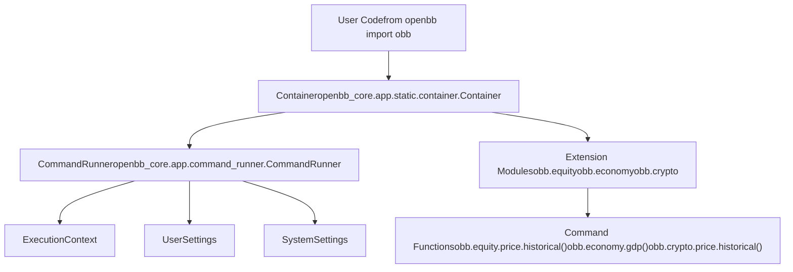
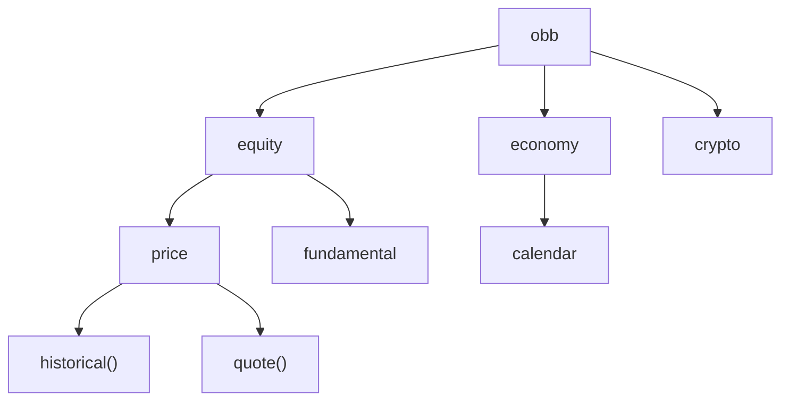
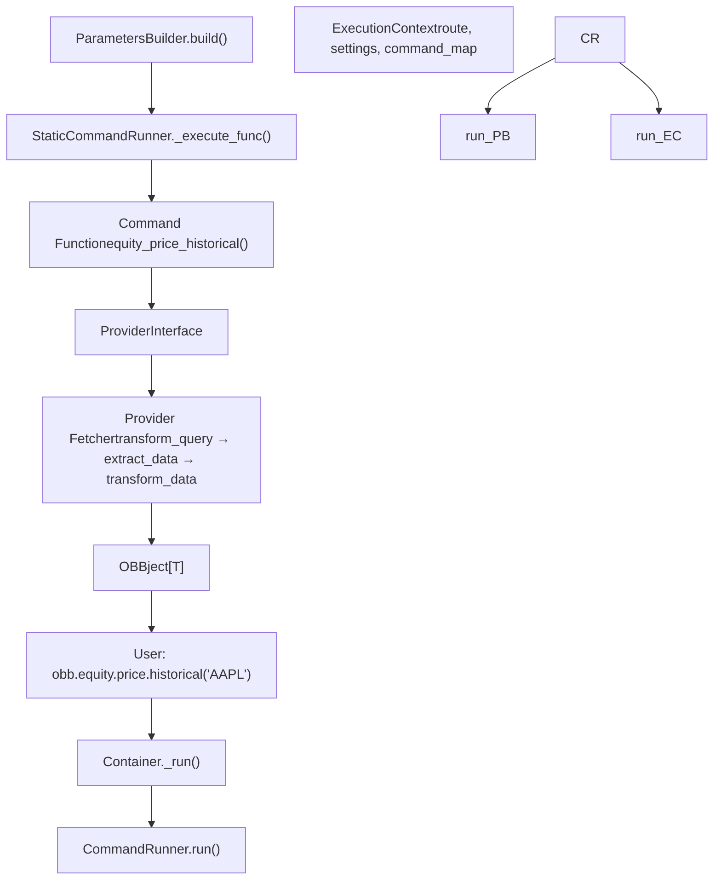
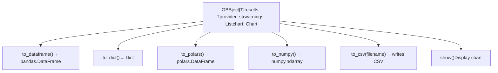
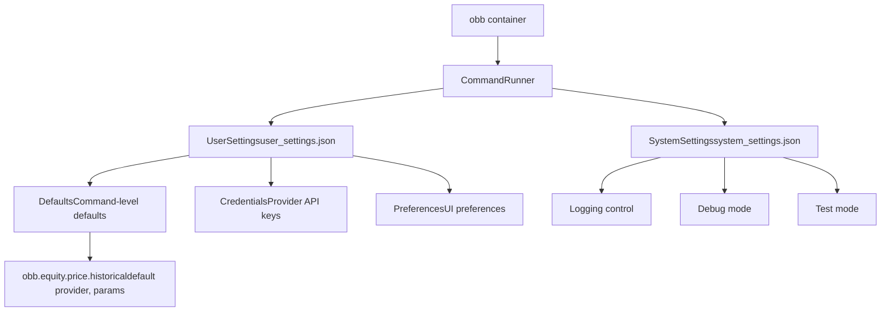
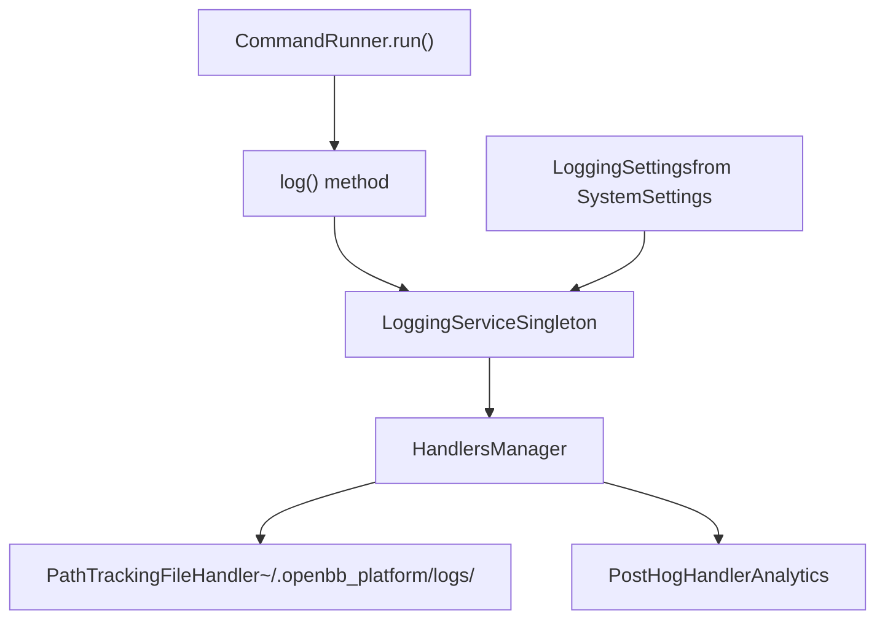
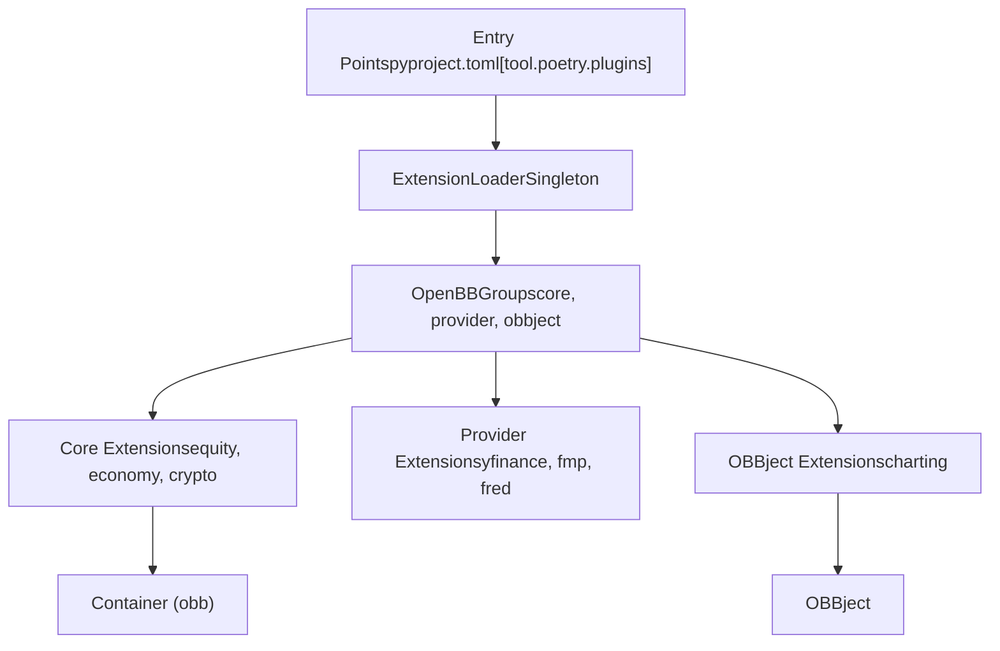
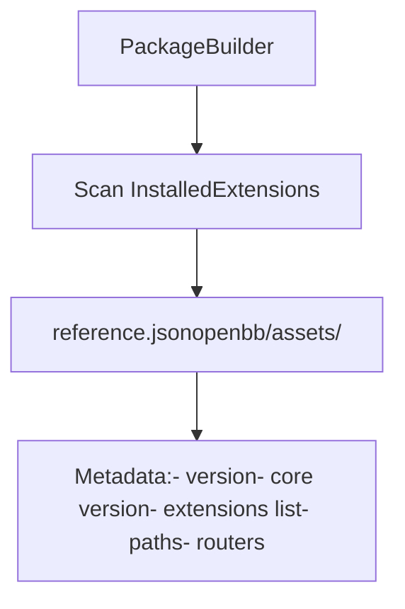

# Python SDK

相关源文件

-   [.pre-commit-config.yaml](https://github.com/OpenBB-finance/OpenBB/blob/dddc3b32/.pre-commit-config.yaml)
-   [README.md](https://github.com/OpenBB-finance/OpenBB/blob/dddc3b32/README.md?plain=1)
-   [cli/poetry.lock](https://github.com/OpenBB-finance/OpenBB/blob/dddc3b32/cli/poetry.lock)
-   [frontend-components/plotly/src/data/mockup.ts](https://github.com/OpenBB-finance/OpenBB/blob/dddc3b32/frontend-components/plotly/src/data/mockup.ts)
-   [openbb\_platform/core/openbb/assets/reference.json](https://github.com/OpenBB-finance/OpenBB/blob/dddc3b32/openbb_platform/core/openbb/assets/reference.json)
-   [openbb\_platform/core/openbb\_core/api/router/commands.py](https://github.com/OpenBB-finance/OpenBB/blob/dddc3b32/openbb_platform/core/openbb_core/api/router/commands.py)
-   [openbb\_platform/core/openbb\_core/app/command\_runner.py](https://github.com/OpenBB-finance/OpenBB/blob/dddc3b32/openbb_platform/core/openbb_core/app/command_runner.py)
-   [openbb\_platform/core/openbb\_core/app/extension\_loader.py](https://github.com/OpenBB-finance/OpenBB/blob/dddc3b32/openbb_platform/core/openbb_core/app/extension_loader.py)
-   [openbb\_platform/core/openbb\_core/app/logs/handlers\_manager.py](https://github.com/OpenBB-finance/OpenBB/blob/dddc3b32/openbb_platform/core/openbb_core/app/logs/handlers_manager.py)
-   [openbb\_platform/core/openbb\_core/app/logs/logging\_service.py](https://github.com/OpenBB-finance/OpenBB/blob/dddc3b32/openbb_platform/core/openbb_core/app/logs/logging_service.py)
-   [openbb\_platform/core/openbb\_core/app/logs/models/logging\_settings.py](https://github.com/OpenBB-finance/OpenBB/blob/dddc3b32/openbb_platform/core/openbb_core/app/logs/models/logging_settings.py)
-   [openbb\_platform/core/openbb\_core/app/model/abstract/tagged.py](https://github.com/OpenBB-finance/OpenBB/blob/dddc3b32/openbb_platform/core/openbb_core/app/model/abstract/tagged.py)
-   [openbb\_platform/core/openbb\_core/app/model/charts/charting\_settings.py](https://github.com/OpenBB-finance/OpenBB/blob/dddc3b32/openbb_platform/core/openbb_core/app/model/charts/charting_settings.py)
-   [openbb\_platform/core/openbb\_core/app/model/defaults.py](https://github.com/OpenBB-finance/OpenBB/blob/dddc3b32/openbb_platform/core/openbb_core/app/model/defaults.py)
-   [openbb\_platform/core/openbb\_core/app/model/extension.py](https://github.com/OpenBB-finance/OpenBB/blob/dddc3b32/openbb_platform/core/openbb_core/app/model/extension.py)
-   [openbb\_platform/core/openbb\_core/app/model/obbject.py](https://github.com/OpenBB-finance/OpenBB/blob/dddc3b32/openbb_platform/core/openbb_core/app/model/obbject.py)
-   [openbb\_platform/core/openbb\_core/app/model/system\_settings.py](https://github.com/OpenBB-finance/OpenBB/blob/dddc3b32/openbb_platform/core/openbb_core/app/model/system_settings.py)
-   [openbb\_platform/core/openbb\_core/app/service/system\_service.py](https://github.com/OpenBB-finance/OpenBB/blob/dddc3b32/openbb_platform/core/openbb_core/app/service/system_service.py)
-   [openbb\_platform/core/openbb\_core/app/static/container.py](https://github.com/OpenBB-finance/OpenBB/blob/dddc3b32/openbb_platform/core/openbb_core/app/static/container.py)
-   [openbb\_platform/core/openbb\_core/env.py](https://github.com/OpenBB-finance/OpenBB/blob/dddc3b32/openbb_platform/core/openbb_core/env.py)
-   [openbb\_platform/core/poetry.lock](https://github.com/OpenBB-finance/OpenBB/blob/dddc3b32/openbb_platform/core/poetry.lock)
-   [openbb\_platform/core/pyproject.toml](https://github.com/OpenBB-finance/OpenBB/blob/dddc3b32/openbb_platform/core/pyproject.toml)
-   [openbb\_platform/core/tests/app/logs/test\_handlers\_manager.py](https://github.com/OpenBB-finance/OpenBB/blob/dddc3b32/openbb_platform/core/tests/app/logs/test_handlers_manager.py)
-   [openbb\_platform/core/tests/app/logs/test\_logging\_service.py](https://github.com/OpenBB-finance/OpenBB/blob/dddc3b32/openbb_platform/core/tests/app/logs/test_logging_service.py)
-   [openbb\_platform/core/tests/app/model/test\_extension.py](https://github.com/OpenBB-finance/OpenBB/blob/dddc3b32/openbb_platform/core/tests/app/model/test_extension.py)
-   [openbb\_platform/core/tests/app/model/test\_obbject.py](https://github.com/OpenBB-finance/OpenBB/blob/dddc3b32/openbb_platform/core/tests/app/model/test_obbject.py)
-   [openbb\_platform/core/tests/app/model/test\_system\_settings.py](https://github.com/OpenBB-finance/OpenBB/blob/dddc3b32/openbb_platform/core/tests/app/model/test_system_settings.py)
-   [openbb\_platform/core/tests/app/test\_command\_runner.py](https://github.com/OpenBB-finance/OpenBB/blob/dddc3b32/openbb_platform/core/tests/app/test_command_runner.py)
-   [openbb\_platform/dev\_install.py](https://github.com/OpenBB-finance/OpenBB/blob/dddc3b32/openbb_platform/dev_install.py)
-   [openbb\_platform/extensions/devtools/poetry.lock](https://github.com/OpenBB-finance/OpenBB/blob/dddc3b32/openbb_platform/extensions/devtools/poetry.lock)
-   [openbb\_platform/extensions/devtools/pyproject.toml](https://github.com/OpenBB-finance/OpenBB/blob/dddc3b32/openbb_platform/extensions/devtools/pyproject.toml)
-   [openbb\_platform/obbject\_extensions/charting/openbb\_charting/charts/helpers.py](https://github.com/OpenBB-finance/OpenBB/blob/dddc3b32/openbb_platform/obbject_extensions/charting/openbb_charting/charts/helpers.py)
-   [openbb\_platform/poetry.lock](https://github.com/OpenBB-finance/OpenBB/blob/dddc3b32/openbb_platform/poetry.lock)
-   [openbb\_platform/providers/yfinance/poetry.lock](https://github.com/OpenBB-finance/OpenBB/blob/dddc3b32/openbb_platform/providers/yfinance/poetry.lock)
-   [openbb\_platform/pyproject.toml](https://github.com/OpenBB-finance/OpenBB/blob/dddc3b32/openbb_platform/pyproject.toml)

Python SDK 是 OpenBB Platform 的主要编程接口。它提供了一个 Pythonic API，用于通过 `obb` 对象访问金融数据、分析和可视化。本文档涵盖了 Python 环境下的安装、使用模式、命令执行和结果处理。

有关 REST API 服务器的信息，请参阅 [REST API Server](/OpenBB-finance/OpenBB/5.2-rest-api-server)。有关底层命令执行流水线的详细信息，请参阅 [Command Execution Pipeline](/OpenBB-finance/OpenBB/2.1-command-execution-pipeline)。有关提供程序配置，请参阅 [Provider Architecture](/OpenBB-finance/OpenBB/2.3-provider-architecture)。

---

## 安装与导入

OpenBB Python SDK 以 `openbb` 包的形式在 PyPI 上发布。安装包括核心平台和默认扩展。

**基础安装**

```
pip install openbb
```
**带有可选扩展的安装**

```
pip install openbb[all]  # 所有扩展pip install openbb[charting]  # 仅限图表扩展pip install openbb[technical,quantitative]  # 多个扩展
```
**导入与初始化**

```
from openbb import obb # obb 对象立即可用result = obb.equity.price.historical("AAPL")
```
`openbb` 包结构定义在 [openbb\_platform/pyproject.toml1-118](https://github.com/OpenBB-finance/OpenBB/blob/dddc3b32/openbb_platform/pyproject.toml#L1-L118) 中，核心依赖列在 [openbb\_platform/core/pyproject.toml1-36](https://github.com/OpenBB-finance/OpenBB/blob/dddc3b32/openbb_platform/core/pyproject.toml#L1-L36) 中。该包包括 `openbb-core`、`openbb-platform-api` 和领域扩展（股票、经济、加密货币等）以及数据提供程序（yfinance、fred、fmp 等）。

**来源：** [README.md28-34](https://github.com/OpenBB-finance/OpenBB/blob/dddc3b32/README.md?plain=1#L28-L34) [openbb\_platform/pyproject.toml1-118](https://github.com/OpenBB-finance/OpenBB/blob/dddc3b32/openbb_platform/pyproject.toml#L1-L118) [openbb\_platform/core/pyproject.toml1-36](https://github.com/OpenBB-finance/OpenBB/blob/dddc3b32/openbb_platform/core/pyproject.toml#L1-L36)

---

## `obb` 容器对象


**图表：obb 容器对象结构**

`obb` 对象是 `Container` 类的一个实例，作为 OpenBB Platform 的入口点。它包装了一个 `CommandRunner` 实例，并动态公开扩展模块。

**容器初始化**

`Container` 类定义在 [openbb\_platform/core/openbb\_core/app/static/container.py11-24](https://github.com/OpenBB-finance/OpenBB/blob/dddc3b32/openbb_platform/core/openbb_core/app/static/container.py#L11-L24) 中。在初始化时：

1.  它接收一个 `CommandRunner` 实例
2.  将 `OBBject._user_settings` 和 `OBBject._system_settings` 设置为类变量
3.  通过 PackageBuilder 动态加载扩展模块

**关键属性**

| 属性 | 类型 | 用途 |
| --- | --- | --- |
| `_command_runner` | `CommandRunner` | 管理命令执行生命周期 |
| 扩展属性 | Module | 动态加载（例如 `obb.equity`, `obb.economy`） |

容器公开了一个 `_run()` 方法 [openbb\_platform/core/openbb\_core/app/static/container.py23-24](https://github.com/OpenBB-finance/OpenBB/blob/dddc3b32/openbb_platform/core/openbb_core/app/static/container.py#L23-L24)，该方法委托给 `CommandRunner` 进行实际的命令执行。

**来源：** [openbb\_platform/core/openbb\_core/app/static/container.py1-24](https://github.com/OpenBB-finance/OpenBB/blob/dddc3b32/openbb_platform/core/openbb_core/app/static/container.py#L1-L24)

---

## 命令结构与组织

Python SDK 中的命令按领域和功能分层组织。该结构由 PackageBuilder 从安装的扩展中动态生成。


**图表：命令层次结构示例**

**命令路径模式**

命令遵循以下模式：`obb.<extension>.<router>.<command>(**params)`

-   **Extension (扩展)**：领域类别（股票、经济、加密货币等）
-   **Router (路由)**：扩展内的子类别（价格、基本面等）
-   **Command (命令)**：特定的数据检索函数

**示例命令路径**

| 命令路径 | 描述 |
| --- | --- |
| `obb.equity.price.historical()` | 历史股票价格数据 |
| `obb.equity.fundamental.balance()` | 资产负债表数据 |
| `obb.economy.gdp()` | GDP 经济数据 |
| `obb.crypto.price.historical()` | 历史加密货币价格数据 |

**动态生成**

命令结构是在运行时根据安装的扩展生成的。PackageBuilder 扫描入口点并在 `openbb/package/` 目录中创建 Python 模块。这在 [Package Builder and Code Generation](/OpenBB-finance/OpenBB/2.4-package-builder-and-code-generation) 中有详细介绍。

**来源：** [README.md30-34](https://github.com/OpenBB-finance/OpenBB/blob/dddc3b32/README.md?plain=1#L30-L34)

---

## 命令执行流程


**图表：Python SDK 中的命令执行流水线**

当用户调用类似 `obb.equity.price.historical("AAPL")` 的命令时，会发生以下执行流程：

### 1. 容器入口点

调用被 `Container._run()` [openbb\_platform/core/openbb\_core/app/static/container.py23-24](https://github.com/OpenBB-finance/OpenBB/blob/dddc3b32/openbb_platform/core/openbb_core/app/static/container.py#L23-L24) 拦截，该方法委托给 `CommandRunner.run()`。

### 2. 参数构建

`ParametersBuilder.build()` [openbb\_platform/core/openbb\_core/app/command\_runner.py209-236](https://github.com/OpenBB-finance/OpenBB/blob/dddc3b32/openbb_platform/core/openbb_core/app/command_runner.py#L209-L236) 处理参数：

-   合并位置参数和关键字参数 [openbb\_platform/core/openbb\_core/app/command\_runner.py88-124](https://github.com/OpenBB-finance/OpenBB/blob/dddc3b32/openbb_platform/core/openbb_core/app/command_runner.py#L88-L124)
-   如果需要，注入 `CommandContext` [openbb\_platform/core/openbb\_core/app/command\_runner.py126-144](https://github.com/OpenBB-finance/OpenBB/blob/dddc3b32/openbb_platform/core/openbb_core/app/command_runner.py#L126-L144)
-   验证并强制转换类型 [openbb\_platform/core/openbb\_core/app/command\_runner.py180-206](https://github.com/OpenBB-finance/OpenBB/blob/dddc3b32/openbb_platform/core/openbb_core/app/command_runner.py#L180-L206)

### 3. 执行上下文

`ExecutionContext` [openbb\_platform/core/openbb\_core/app/command\_runner.py34-57](https://github.com/OpenBB-finance/OpenBB/blob/dddc3b32/openbb_platform/core/openbb_core/app/command_runner.py#L34-L57) 提供：

-   命令路由映射
-   系统和用户设置
-   用于函数解析的命令映射

### 4. 命令执行

`StaticCommandRunner._execute_func()` [openbb\_platform/core/openbb\_core/app/command\_runner.py307-393](https://github.com/OpenBB-finance/OpenBB/blob/dddc3b32/openbb_platform/core/openbb_core/app/command_runner.py#L307-L393) 执行命令，包括：

-   使用 `catch_warnings()` 捕获警告 [openbb\_platform/core/openbb\_core/app/command\_runner.py323](https://github.com/OpenBB-finance/OpenBB/blob/dddc3b32/openbb_platform/core/openbb_core/app/command_runner.py#L323-L323)
-   如果 `chart=True`，则生成图表 [openbb\_platform/core/openbb\_core/app/command\_runner.py377-392](https://github.com/OpenBB-finance/OpenBB/blob/dddc3b32/openbb_platform/core/openbb_core/app/command_runner.py#L377-L392)
-   提取自定义标头 [openbb\_platform/core/openbb\_core/app/command\_runner.py354-358](https://github.com/OpenBB-finance/OpenBB/blob/dddc3b32/openbb_platform/core/openbb_core/app/command_runner.py#L354-L358)

### 5. 提供程序集成

获取数据的命令使用 `ProviderInterface` 通过三阶段模式（transform\_query → extract\_data → transform\_data）执行特定于提供程序的获取器。详见 [Provider Architecture](/OpenBB-finance/OpenBB/2.3-provider-architecture)。

### 6. 结果包装

结果被包装在 `OBBject` 实例中 [openbb\_platform/core/openbb\_core/app/model/obbject.py36-72](https://github.com/OpenBB-finance/OpenBB/blob/dddc3b32/openbb_platform/core/openbb_core/app/model/obbject.py#L36-L72)，元数据包括：

-   `results`：实际数据（List\[Data\]、DataFrame 等）
-   `provider`：使用的提供程序名称
-   `warnings`：引发的任何警告
-   `chart`：生成的图表对象（如果已生成）
-   `extra`：其他元数据

**来源：** [openbb\_platform/core/openbb\_core/app/command\_runner.py1-467](https://github.com/OpenBB-finance/OpenBB/blob/dddc3b32/openbb_platform/core/openbb_core/app/command_runner.py#L1-L467) [openbb\_platform/core/openbb\_core/app/static/container.py1-24](https://github.com/OpenBB-finance/OpenBB/blob/dddc3b32/openbb_platform/core/openbb_core/app/static/container.py#L1-L24)

---

## 使用 OBBject 结果

所有命令都返回一个 `OBBject[T]` 实例，该实例包装了结果并提供了多种转换方法。


**图表：OBBject 转换方法**

### 基础结果访问

```
result = obb.equity.price.historical("AAPL") # 访问原始结果data = result.results  # List[Data] 或其他类型 # 访问元数据provider = result.provider  # "yfinance"warnings = result.warnings  # List[Warning_]
```
### 转换方法

`OBBject` 类提供了 [openbb\_platform/core/openbb\_core/app/model/obbject.py81-333](https://github.com/OpenBB-finance/OpenBB/blob/dddc3b32/openbb_platform/core/openbb_core/app/model/obbject.py#L81-L333) 中定义的多种转换方法：

| 方法 | 返回类型 | 描述 |
| --- | --- | --- |
| `to_dataframe()` | `pd.DataFrame` | 转换为 pandas DataFrame |
| `to_df()` | `pd.DataFrame` | `to_dataframe()` 的别名 |
| `to_dict()` | `dict` | 转换为字典 |
| `to_polars()` | `pl.DataFrame` | 转换为 Polars DataFrame |
| `to_numpy()` | `np.ndarray` | 转换为 NumPy 数组 |
| `to_csv()` | `None` | 写入 CSV 文件 |

**DataFrame 转换示例**

```
df = result.to_dataframe(    index="date",      # 用作索引的列    sort_by="volume",  # 用于排序的列    ascending=False    # 排序顺序)
```
`to_dataframe()` 方法 [openbb\_platform/core/openbb\_core/app/model/obbject.py121-224](https://github.com/OpenBB-finance/OpenBB/blob/dddc3b32/openbb_platform/core/openbb_core/app/model/obbject.py#L121-L224) 支持多种输入格式：

-   `List[BaseModel]`
-   `List[Dict]`
-   `Dict[str, List]`
-   嵌套结构

### 图表显示

如果调用命令时带有 `chart=True` 且已安装图表扩展：

```
result = obb.equity.price.historical("AAPL", chart=True)result.show()  # 显示图表
```
图表是使用 `StaticCommandRunner._chart()` 方法 [openbb\_platform/core/openbb\_core/app/command\_runner.py260-296](https://github.com/OpenBB-finance/OpenBB/blob/dddc3b32/openbb_platform/core/openbb_core/app/command_runner.py#L260-L296) 生成的，该方法会调用图表扩展的 `show()` 方法。

### 警告处理

警告在执行期间被捕获并存储在 `warnings` 字段中：

```
if result.warnings:    for warning in result.warnings:        print(f"{warning.category}: {warning.message}")
```
警告在执行期间被转换为 `Warning_` 对象 [openbb\_platform/core/openbb\_core/app/model/abstract/warning.py](https://github.com/OpenBB-finance/OpenBB/blob/dddc3b32/openbb_platform/core/openbb_core/app/model/abstract/warning.py)。

**来源：** [openbb\_platform/core/openbb\_core/app/model/obbject.py1-333](https://github.com/OpenBB-finance/OpenBB/blob/dddc3b32/openbb_platform/core/openbb_core/app/model/obbject.py#L1-L333) [openbb\_platform/core/openbb\_core/app/command\_runner.py260-296](https://github.com/OpenBB-finance/OpenBB/blob/dddc3b32/openbb_platform/core/openbb_core/app/command_runner.py#L260-L296)

---

## 配置与设置

Python SDK 使用两种类型的设置来影响命令执行：`SystemSettings` 和 `UserSettings`。


**图表：设置架构**

### 系统设置

`SystemSettings` [openbb\_platform/core/openbb\_core/app/model/system\_settings.py22-102](https://github.com/OpenBB-finance/OpenBB/blob/dddc3b32/openbb_platform/core/openbb_core/app/model/system_settings.py#L22-L102) 包含系统级配置：

| 字段 | 类型 | 用途 |
| --- | --- | --- |
| `logging_suppress` | `bool` | 抑制日志输出 |
| `debug_mode` | `bool` | 启用调试模式 |
| `test_mode` | `bool` | 启用测试模式 |
| `python_settings` | `PythonSettings` | Python 特定设置 |
| `api_settings` | `APISettings` | API 服务器设置 |

系统设置存储在 `~/.openbb_platform/system_settings.json` 中，并由 `SystemService` [openbb\_platform/core/openbb\_core/app/service/system\_service.py12-95](https://github.com/OpenBB-finance/OpenBB/blob/dddc3b32/openbb_platform/core/openbb_core/app/service/system_service.py#L12-L95) 管理。

### 用户设置

`UserSettings` 包含用户特定的配置，包括：

-   **Defaults (默认值)**：命令级默认参数 [openbb\_platform/core/openbb\_core/app/model/defaults.py10-60](https://github.com/OpenBB-finance/OpenBB/blob/dddc3b32/openbb_platform/core/openbb_core/app/model/defaults.py#L10-L60)
-   **Credentials (凭据)**：提供程序 API 密钥和凭据
-   **Preferences (偏好)**：UI 偏好，如 `show_warnings`

用户设置存储在 `~/.openbb_platform/user_settings.json` 中。

### 设置默认值

可以为每个命令设置默认参数，以避免重复常用的参数：

```
# 为特定命令设置默认值obb.user.defaults.commands = {    "equity.price.historical": {        "provider": "yfinance",        "start_date": "2020-01-01"    }} # 现在调用将使用默认值result = obb.equity.price.historical("AAPL")  # 使用 yfinance, 从 2020-01-01 开始
```
默认值在命令执行期间的 `ParametersBuilder.build()` 中应用。系统从 `user_settings.defaults.commands` 检索默认值，并将其与提供的参数合并 [openbb\_platform/core/openbb\_core/api/router/commands.py247-269](https://github.com/OpenBB-finance/OpenBB/blob/dddc3b32/openbb_platform/core/openbb_core/api/router/commands.py#L247-L269)。

### 提供程序配置

API 密钥等特定于提供程序的设置在凭据中配置：

```
# 设置提供程序凭据obb.user.credentials.fmp_api_key = "your_api_key" # 选择提供程序后，凭据会自动使用result = obb.equity.price.historical("AAPL", provider="fmp")
```
**来源：** [openbb\_platform/core/openbb\_core/app/model/system\_settings.py1-102](https://github.com/OpenBB-finance/OpenBB/blob/dddc3b32/openbb_platform/core/openbb_core/app/model/system_settings.py#L1-L102) [openbb\_platform/core/openbb\_core/app/model/user\_settings.py](https://github.com/OpenBB-finance/OpenBB/blob/dddc3b32/openbb_platform/core/openbb_core/app/model/user_settings.py) [openbb\_platform/core/openbb\_core/app/model/defaults.py1-60](https://github.com/OpenBB-finance/OpenBB/blob/dddc3b32/openbb_platform/core/openbb_core/app/model/defaults.py#L1-L60) [openbb\_platform/core/openbb\_core/app/service/system\_service.py1-95](https://github.com/OpenBB-finance/OpenBB/blob/dddc3b32/openbb_platform/core/openbb_core/app/service/system_service.py#L1-L95)

---

## 日志与调试

Python SDK 通过 `LoggingService` 包含全面的日志记录功能。


**图表：日志架构**

### 日志配置

日志由 `LoggingSettings` [openbb\_platform/core/openbb\_core/app/logs/models/logging\_settings.py1-75](https://github.com/OpenBB-finance/OpenBB/blob/dddc3b32/openbb_platform/core/openbb_core/app/logs/models/logging_settings.py#L1-L75) 控制，它从 `SystemSettings` 读取：

| 设置 | 用途 |
| --- | --- |
| `logging_suppress` | 禁用所有日志 |
| `logging_sub_app` | 子应用程序标识符 |
| `logging_frequency` | 日志频率（H=每小时, D=每天等） |
| `logging_handlers` | 启用的处理程序（file, posthog） |

### 日志文件

命令执行日志带有时间戳记写入 `~/.openbb_platform/logs/`。`PathTrackingFileHandler` [openbb\_platform/core/openbb\_core/app/logs/handlers\_manager.py1-89](https://github.com/OpenBB-finance/OpenBB/blob/dddc3b32/openbb_platform/core/openbb_core/app/logs/handlers_manager.py#L1-L89) 管理日志文件轮转。

### 命令日志记录

每次命令执行都由 `LoggingService.log()` [openbb\_platform/core/openbb\_core/app/logs/logging\_service.py82-224](https://github.com/OpenBB-finance/OpenBB/blob/dddc3b32/openbb_platform/core/openbb_core/app/logs/logging_service.py#L82-L224) 记录，包括：

-   路由路径
-   使用的参数
-   选择的提供程序
-   执行时间
-   警告和错误

### 调试模式

启用调试模式以获取详细的错误消息：

```
from openbb import obb # 系统设置是一个单例obb._command_runner.system_settings.debug_mode = True # 现在错误将显示完整堆栈跟踪
```
调试模式在 `StaticCommandRunner._chart()` [openbb\_platform/core/openbb\_core/app/command\_runner.py294-296](https://github.com/OpenBB-finance/OpenBB/blob/dddc3b32/openbb_platform/core/openbb_core/app/command_runner.py#L294-L296) 和其他错误处理路径中被检查。

**来源：** [openbb\_platform/core/openbb\_core/app/logs/logging\_service.py1-224](https://github.com/OpenBB-finance/OpenBB/blob/dddc3b32/openbb_platform/core/openbb_core/app/logs/logging_service.py#L1-L224) [openbb\_platform/core/openbb\_core/app/logs/models/logging\_settings.py1-75](https://github.com/OpenBB-finance/OpenBB/blob/dddc3b32/openbb_platform/core/openbb_core/app/logs/models/logging_settings.py#L1-L75) [openbb\_platform/core/openbb\_core/app/logs/handlers\_manager.py1-89](https://github.com/OpenBB-finance/OpenBB/blob/dddc3b32/openbb_platform/core/openbb_core/app/logs/handlers_manager.py#L1-L89)

---

## 扩展系统集成

Python SDK 通过 `ExtensionLoader` 动态加载扩展。


**图表：Python SDK 中的扩展加载**

### 扩展发现

扩展通过 `pyproject.toml` 文件中定义的 Python 入口点被发现。`ExtensionLoader` [openbb\_platform/core/openbb\_core/app/extension\_loader.py1-205](https://github.com/OpenBB-finance/OpenBB/blob/dddc3b32/openbb_platform/core/openbb_core/app/extension_loader.py#L1-L205) 扫描三个组：

-   `openbb_core_extension`：领域扩展（股票、经济等）
-   `openbb_provider_extension`：数据提供程序扩展
-   `openbb_obbject_extension`：OBBject 访问器扩展（如图表）

### 核心扩展

像 `openbb-equity` 这样的核心扩展向 `obb` 对象添加命令路由：

```
# 动态加载obb.equity.price.historical()obb.equity.fundamental.balance()
```
扩展注册由 `ExtensionLoader.get_core_router_map()` [openbb\_platform/core/openbb\_core/app/extension\_loader.py91-117](https://github.com/OpenBB-finance/OpenBB/blob/dddc3b32/openbb_platform/core/openbb_core/app/extension_loader.py#L91-L117) 方法加载的路由。

### OBBject 扩展

OBBject 扩展使用 `CachedAccessor` 模式 [openbb\_platform/core/openbb\_core/app/model/extension.py1-115](https://github.com/OpenBB-finance/OpenBB/blob/dddc3b32/openbb_platform/core/openbb_core/app/model/extension.py#L1-L115) 向 `OBBject` 类添加新方法：

```
# 图表扩展添加了 .charting 访问器result = obb.equity.price.historical("AAPL")result.charting.show()  # 由 openbb-charting 扩展添加
```
扩展通过 `Extension.obbject_accessor` [openbb\_platform/core/openbb\_core/app/model/extension.py42-62](https://github.com/OpenBB-finance/OpenBB/blob/dddc3b32/openbb_platform/core/openbb_core/app/model/extension.py#L42-L62) 注册访问器。

### 安装额外扩展

```
# 安装可选扩展pip install openbb[charting]pip install openbb[quantitative,technical] # 扩展立即变为可用result.charting.show()obb.technical.sma(data, window=20)
```
**来源：** [openbb\_platform/core/openbb\_core/app/extension\_loader.py1-205](https://github.com/OpenBB-finance/OpenBB/blob/dddc3b32/openbb_platform/core/openbb_core/app/extension_loader.py#L1-L205) [openbb\_platform/core/openbb\_core/app/model/extension.py1-115](https://github.com/OpenBB-finance/OpenBB/blob/dddc3b32/openbb_platform/core/openbb_core/app/model/extension.py#L1-L115)

---

## 开发工作流

对于开发 OpenBB Platform 的开发人员，`dev_install.py` 脚本负责设置本地开发依赖项。

### 开发安装

```
cd openbb_platformpython dev_install.py
```
该脚本 [openbb\_platform/dev\_install.py1-244](https://github.com/OpenBB-finance/OpenBB/blob/dddc3b32/openbb_platform/dev_install.py#L1-L244) 执行：

1.  备份生产环境的 `pyproject.toml` 和 `poetry.lock`
2.  用本地路径引用替换依赖项
3.  运行 `poetry install` 以开发模式进行安装
4.  安装完成后恢复备份

**本地依赖结构**

开发模式对所有依赖项使用 `{ path = "./extensions/...", develop = true }` [openbb\_platform/dev\_install.py18-113](https://github.com/OpenBB-finance/OpenBB/blob/dddc3b32/openbb_platform/dev_install.py#L18-L113)，允许：

-   无需重新安装即可实时修改代码
-   更容易跨包进行调试
-   一致的开发环境

### AUTO\_BUILD 配置

`AUTO_BUILD` 环境变量控制自动包重建：

```
# 在 Env 类中AUTO_BUILD: bool = Field(default=True)
```
启用后，当检测到扩展更改时，PackageBuilder 会自动重建 SDK 结构。详见 [Package Builder and Code Generation](/OpenBB-finance/OpenBB/2.4-package-builder-and-code-generation)。

### 测试

开发设置包括 `openbb-devtools` [openbb\_platform/extensions/devtools/pyproject.toml1-36](https://github.com/OpenBB-finance/OpenBB/blob/dddc3b32/openbb_platform/extensions/devtools/pyproject.toml#L1-L36) 中的测试工具：

-   用于单元测试的 `pytest`
-   用于 VCR 磁带的 `pytest-recorder`
-   用于异步测试的 `pytest-asyncio`
-   用于覆盖率的 `pytest-cov`

命令运行器的测试位于 [openbb\_platform/core/tests/app/test\_command\_runner.py1-442](https://github.com/OpenBB-finance/OpenBB/blob/dddc3b32/openbb_platform/core/tests/app/test_command_runner.py#L1-L442) 中。

**来源：** [openbb\_platform/dev\_install.py1-244](https://github.com/OpenBB-finance/OpenBB/blob/dddc3b32/openbb_platform/dev_install.py#L1-L244) [openbb\_platform/extensions/devtools/pyproject.toml1-36](https://github.com/OpenBB-finance/OpenBB/blob/dddc3b32/openbb_platform/extensions/devtools/pyproject.toml#L1-L36) [openbb\_platform/core/openbb\_core/env.py1-95](https://github.com/OpenBB-finance/OpenBB/blob/dddc3b32/openbb_platform/core/openbb_core/env.py#L1-L95)

---

## Reference JSON 元数据

Python SDK 会生成一个 `reference.json` 文件，其中包含有关平台安装的元数据。


**图表：Reference JSON 生成**

参考文件 [openbb\_platform/core/openbb/assets/reference.json1-15](https://github.com/OpenBB-finance/OpenBB/blob/dddc3b32/openbb_platform/core/openbb/assets/reference.json#L1-L15) 包含：

```
{    "openbb": "1.6.0core",    "info": {        "title": "OpenBB Platform (Python)",        "description": "Investment research for everyone, anywhere.",        "core": "1.6.0",        "extensions": {            "openbb_core_extension": [],            "openbb_provider_extension": [],            "openbb_obbject_extension": []        }    },    "paths": {},    "routers": {}}
```
此文件在包构建过程中生成，并被以下对象使用：

-   API 服务器，用于生成 OpenAPI 规范
-   用于 UI 生成的小部件系统
-   文档生成
-   扩展兼容性检查

**来源：** [openbb\_platform/core/openbb/assets/reference.json1-15](https://github.com/OpenBB-finance/OpenBB/blob/dddc3b32/openbb_platform/core/openbb/assets/reference.json#L1-L15)
