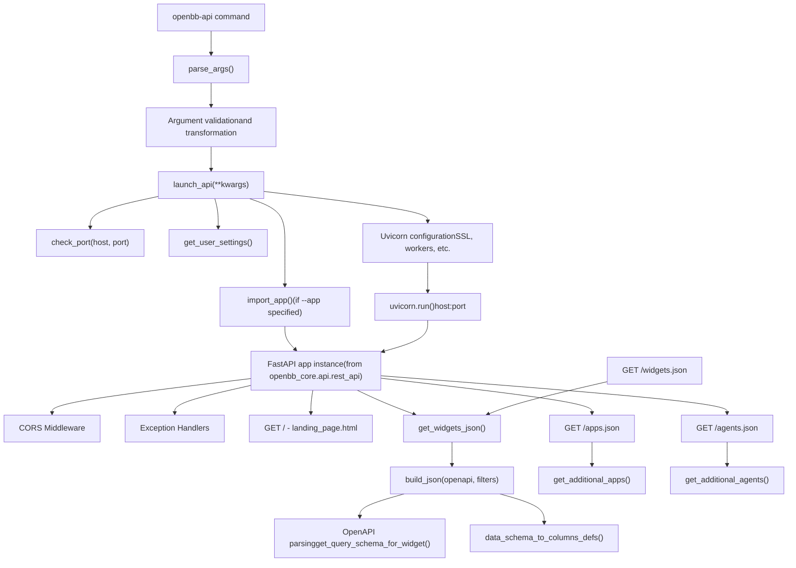
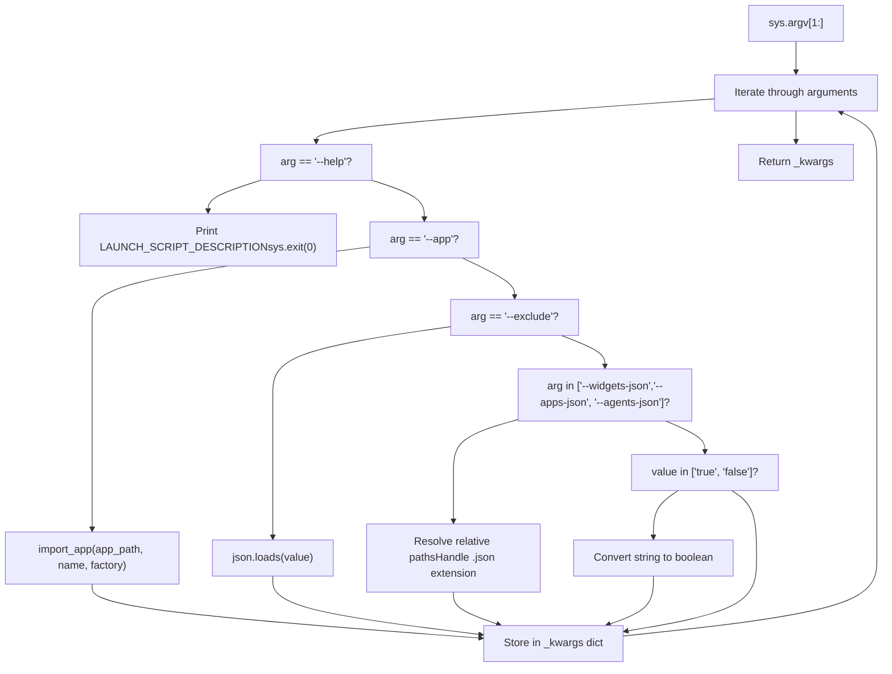
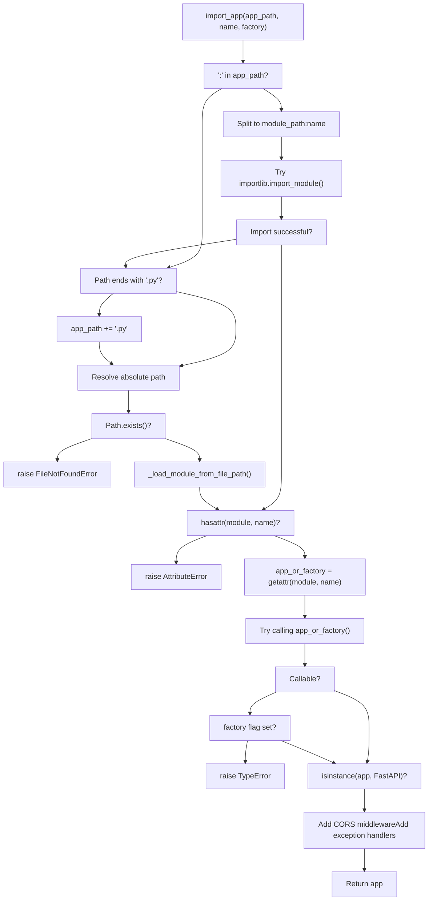
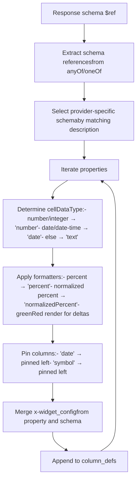
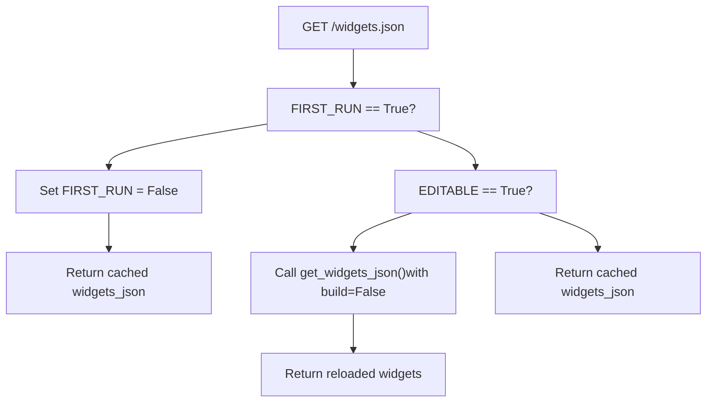
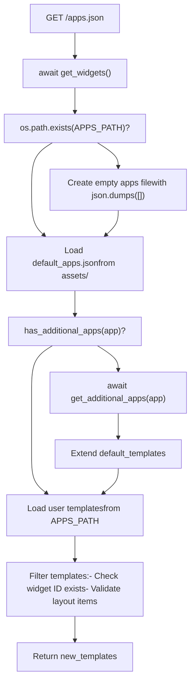
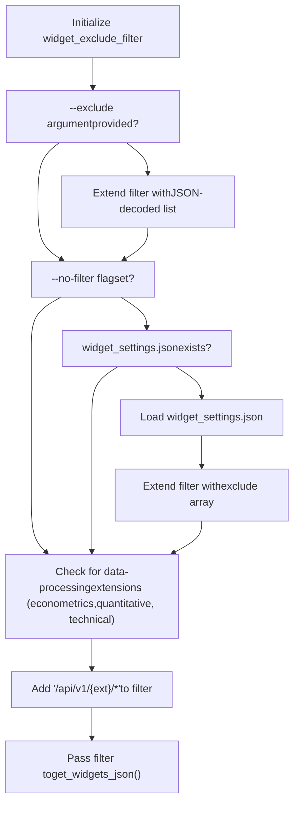

# FastAPI Server

相关源文件

-   [.codespell.skip](https://github.com/OpenBB-finance/OpenBB/blob/dddc3b32/.codespell.skip)
-   [.pre-commit-config.yaml](https://github.com/OpenBB-finance/OpenBB/blob/dddc3b32/.pre-commit-config.yaml)
-   [README.md](https://github.com/OpenBB-finance/OpenBB/blob/dddc3b32/README.md?plain=1)
-   [cli/tests/test\_argparse\_translator\_obbject\_registry.py](https://github.com/OpenBB-finance/OpenBB/blob/dddc3b32/cli/tests/test_argparse_translator_obbject_registry.py)
-   [openbb\_platform/core/openbb\_core/api/app\_loader.py](https://github.com/OpenBB-finance/OpenBB/blob/dddc3b32/openbb_platform/core/openbb_core/api/app_loader.py)
-   [openbb\_platform/core/openbb\_core/api/exception\_handlers.py](https://github.com/OpenBB-finance/OpenBB/blob/dddc3b32/openbb_platform/core/openbb_core/api/exception_handlers.py)
-   [openbb\_platform/core/openbb\_core/api/rest\_api.py](https://github.com/OpenBB-finance/OpenBB/blob/dddc3b32/openbb_platform/core/openbb_core/api/rest_api.py)
-   [openbb\_platform/core/openbb\_core/api/router/coverage.py](https://github.com/OpenBB-finance/OpenBB/blob/dddc3b32/openbb_platform/core/openbb_core/api/router/coverage.py)
-   [openbb\_platform/core/openbb\_core/app/provider\_interface.py](https://github.com/OpenBB-finance/OpenBB/blob/dddc3b32/openbb_platform/core/openbb_core/app/provider_interface.py)
-   [openbb\_platform/core/openbb\_core/app/router.py](https://github.com/OpenBB-finance/OpenBB/blob/dddc3b32/openbb_platform/core/openbb_core/app/router.py)
-   [openbb\_platform/core/openbb\_core/app/static/package\_builder.py](https://github.com/OpenBB-finance/OpenBB/blob/dddc3b32/openbb_platform/core/openbb_core/app/static/package_builder.py)
-   [openbb\_platform/core/openbb\_core/app/static/utils/filters.py](https://github.com/OpenBB-finance/OpenBB/blob/dddc3b32/openbb_platform/core/openbb_core/app/static/utils/filters.py)
-   [openbb\_platform/core/openbb\_core/app/utils.py](https://github.com/OpenBB-finance/OpenBB/blob/dddc3b32/openbb_platform/core/openbb_core/app/utils.py)
-   [openbb\_platform/core/openbb\_core/provider/registry\_map.py](https://github.com/OpenBB-finance/OpenBB/blob/dddc3b32/openbb_platform/core/openbb_core/provider/registry_map.py)
-   [openbb\_platform/core/openbb\_core/provider/standard\_models/fred\_release\_table.py](https://github.com/OpenBB-finance/OpenBB/blob/dddc3b32/openbb_platform/core/openbb_core/provider/standard_models/fred_release_table.py)
-   [openbb\_platform/core/openbb\_core/provider/standard\_models/futures\_curve.py](https://github.com/OpenBB-finance/OpenBB/blob/dddc3b32/openbb_platform/core/openbb_core/provider/standard_models/futures_curve.py)
-   [openbb\_platform/core/openbb\_core/provider/standard\_models/management\_discussion\_analysis.py](https://github.com/OpenBB-finance/OpenBB/blob/dddc3b32/openbb_platform/core/openbb_core/provider/standard_models/management_discussion_analysis.py)
-   [openbb\_platform/core/openbb\_core/provider/standard\_models/yield\_curve.py](https://github.com/OpenBB-finance/OpenBB/blob/dddc3b32/openbb_platform/core/openbb_core/provider/standard_models/yield_curve.py)
-   [openbb\_platform/core/tests/app/static/test\_filters.py](https://github.com/OpenBB-finance/OpenBB/blob/dddc3b32/openbb_platform/core/tests/app/static/test_filters.py)
-   [openbb\_platform/core/tests/app/static/test\_package\_builder.py](https://github.com/OpenBB-finance/OpenBB/blob/dddc3b32/openbb_platform/core/tests/app/static/test_package_builder.py)
-   [openbb\_platform/core/tests/app/test\_platform\_router.py](https://github.com/OpenBB-finance/OpenBB/blob/dddc3b32/openbb_platform/core/tests/app/test_platform_router.py)
-   [openbb\_platform/core/tests/app/test\_provider\_interface.py](https://github.com/OpenBB-finance/OpenBB/blob/dddc3b32/openbb_platform/core/tests/app/test_provider_interface.py)
-   [openbb\_platform/extensions/platform\_api/README.md](https://github.com/OpenBB-finance/OpenBB/blob/dddc3b32/openbb_platform/extensions/platform_api/README.md?plain=1)
-   [openbb\_platform/extensions/platform\_api/openbb\_platform\_api/main.py](https://github.com/OpenBB-finance/OpenBB/blob/dddc3b32/openbb_platform/extensions/platform_api/openbb_platform_api/main.py)
-   [openbb\_platform/extensions/platform\_api/openbb\_platform\_api/query\_models.py](https://github.com/OpenBB-finance/OpenBB/blob/dddc3b32/openbb_platform/extensions/platform_api/openbb_platform_api/query_models.py)
-   [openbb\_platform/extensions/platform\_api/openbb\_platform\_api/response\_models.py](https://github.com/OpenBB-finance/OpenBB/blob/dddc3b32/openbb_platform/extensions/platform_api/openbb_platform_api/response_models.py)
-   [openbb\_platform/extensions/platform\_api/openbb\_platform\_api/utils/api.py](https://github.com/OpenBB-finance/OpenBB/blob/dddc3b32/openbb_platform/extensions/platform_api/openbb_platform_api/utils/api.py)
-   [openbb\_platform/extensions/platform\_api/openbb\_platform\_api/utils/openapi.py](https://github.com/OpenBB-finance/OpenBB/blob/dddc3b32/openbb_platform/extensions/platform_api/openbb_platform_api/utils/openapi.py)
-   [openbb\_platform/extensions/platform\_api/openbb\_platform\_api/utils/widgets.py](https://github.com/OpenBB-finance/OpenBB/blob/dddc3b32/openbb_platform/extensions/platform_api/openbb_platform_api/utils/widgets.py)
-   [openbb\_platform/extensions/platform\_api/poetry.lock](https://github.com/OpenBB-finance/OpenBB/blob/dddc3b32/openbb_platform/extensions/platform_api/poetry.lock)
-   [openbb\_platform/extensions/platform\_api/pyproject.toml](https://github.com/OpenBB-finance/OpenBB/blob/dddc3b32/openbb_platform/extensions/platform_api/pyproject.toml)
-   [openbb\_platform/extensions/platform\_api/tests/mock\_openapi.json](https://github.com/OpenBB-finance/OpenBB/blob/dddc3b32/openbb_platform/extensions/platform_api/tests/mock_openapi.json)
-   [openbb\_platform/extensions/platform\_api/tests/mock\_widgets.json](https://github.com/OpenBB-finance/OpenBB/blob/dddc3b32/openbb_platform/extensions/platform_api/tests/mock_widgets.json)
-   [openbb\_platform/extensions/platform\_api/tests/test\_openapi\_utils.py](https://github.com/OpenBB-finance/OpenBB/blob/dddc3b32/openbb_platform/extensions/platform_api/tests/test_openapi_utils.py)
-   [openbb\_platform/extensions/platform\_api/tests/test\_widgets\_utils.py](https://github.com/OpenBB-finance/OpenBB/blob/dddc3b32/openbb_platform/extensions/platform_api/tests/test_widgets_utils.py)
-   [openbb\_platform/extensions/regulators/integration/test\_regulators\_api.py](https://github.com/OpenBB-finance/OpenBB/blob/dddc3b32/openbb_platform/extensions/regulators/integration/test_regulators_api.py)
-   [openbb\_platform/extensions/regulators/integration/test\_regulators\_python.py](https://github.com/OpenBB-finance/OpenBB/blob/dddc3b32/openbb_platform/extensions/regulators/integration/test_regulators_python.py)
-   [openbb\_platform/extensions/regulators/openbb\_regulators/cftc/cftc\_router.py](https://github.com/OpenBB-finance/OpenBB/blob/dddc3b32/openbb_platform/extensions/regulators/openbb_regulators/cftc/cftc_router.py)
-   [openbb\_platform/extensions/regulators/openbb\_regulators/sec/sec\_router.py](https://github.com/OpenBB-finance/OpenBB/blob/dddc3b32/openbb_platform/extensions/regulators/openbb_regulators/sec/sec_router.py)
-   [openbb\_platform/obbject\_extensions/charting/tests/test\_charting.py](https://github.com/OpenBB-finance/OpenBB/blob/dddc3b32/openbb_platform/obbject_extensions/charting/tests/test_charting.py)
-   [openbb\_platform/providers/bls/openbb\_bls/utils/helpers.py](https://github.com/OpenBB-finance/OpenBB/blob/dddc3b32/openbb_platform/providers/bls/openbb_bls/utils/helpers.py)
-   [openbb\_platform/providers/cboe/openbb\_cboe/models/futures\_curve.py](https://github.com/OpenBB-finance/OpenBB/blob/dddc3b32/openbb_platform/providers/cboe/openbb_cboe/models/futures_curve.py)
-   [openbb\_platform/providers/cboe/tests/test\_cboe\_fetchers.py](https://github.com/OpenBB-finance/OpenBB/blob/dddc3b32/openbb_platform/providers/cboe/tests/test_cboe_fetchers.py)
-   [openbb\_platform/providers/fred/openbb\_fred/models/release\_table.py](https://github.com/OpenBB-finance/OpenBB/blob/dddc3b32/openbb_platform/providers/fred/openbb_fred/models/release_table.py)
-   [openbb\_platform/providers/nasdaq/tests/record/expected\_widgets.json](https://github.com/OpenBB-finance/OpenBB/blob/dddc3b32/openbb_platform/providers/nasdaq/tests/record/expected_widgets.json)
-   [openbb\_platform/providers/sec/openbb\_sec/models/management\_discussion\_analysis.py](https://github.com/OpenBB-finance/OpenBB/blob/dddc3b32/openbb_platform/providers/sec/openbb_sec/models/management_discussion_analysis.py)
-   [openbb\_platform/providers/sec/openbb\_sec/models/schema\_files.py](https://github.com/OpenBB-finance/OpenBB/blob/dddc3b32/openbb_platform/providers/sec/openbb_sec/models/schema_files.py)
-   [openbb\_platform/providers/sec/openbb\_sec/utils/html2markdown.py](https://github.com/OpenBB-finance/OpenBB/blob/dddc3b32/openbb_platform/providers/sec/openbb_sec/utils/html2markdown.py)
-   [openbb\_platform/providers/sec/openbb\_sec/utils/xbrl\_taxonomy\_helper.py](https://github.com/OpenBB-finance/OpenBB/blob/dddc3b32/openbb_platform/providers/sec/openbb_sec/utils/xbrl_taxonomy_helper.py)
-   [openbb\_platform/providers/sec/poetry.lock](https://github.com/OpenBB-finance/OpenBB/blob/dddc3b32/openbb_platform/providers/sec/poetry.lock)
-   [openbb\_platform/providers/sec/pyproject.toml](https://github.com/OpenBB-finance/OpenBB/blob/dddc3b32/openbb_platform/providers/sec/pyproject.toml)

## 目的与范围

FastAPI Server 系统为 OpenBB Platform 提供 HTTP API 层，通过 REST 接口公开数据提供程序端点和扩展。本文档涵盖服务器启动脚本、配置选项、小部件生成以及与 OpenBB Workspace 的集成。有关 Python SDK 和 CLI 接口的信息，请参阅 [Python SDK and CLI](/OpenBB-finance/OpenBB/5.1-python-sdk)。有关小部件配置和 Workspace 集成的详细信息，请参阅 [Widget System and Workspace Integration](/OpenBB-finance/OpenBB/5.3-openbb-workspace-integration)。

核心实现位于 `openbb-platform-api` 包中，它既是标准 OpenBB Platform API 的启动器，也是构建自定义后端应用程序的框架。

**来源：** [openbb\_platform/extensions/platform\_api/openbb\_platform\_api/main.py1-340](https://github.com/OpenBB-finance/OpenBB/blob/dddc3b32/openbb_platform/extensions/platform_api/openbb_platform_api/main.py#L1-L340) [openbb\_platform/extensions/platform\_api/README.md1-15](https://github.com/OpenBB-finance/OpenBB/blob/dddc3b32/openbb_platform/extensions/platform_api/README.md?plain=1#L1-L15)

---

## 服务器架构


服务器架构遵循三阶段初始化流程：(1) 命令行参数解析和验证，(2) 应用程序和端点设置，(3) 带有运行时配置的 Uvicorn 服务器启动。

**来源：** [openbb\_platform/extensions/platform\_api/openbb\_platform\_api/main.py1-340](https://github.com/OpenBB-finance/OpenBB/blob/dddc3b32/openbb_platform/extensions/platform_api/openbb_platform_api/main.py#L1-L340) [openbb\_platform/extensions/platform\_api/openbb\_platform\_api/utils/api.py1-411](https://github.com/OpenBB-finance/OpenBB/blob/dddc3b32/openbb_platform/extensions/platform_api/openbb_platform_api/utils/api.py#L1-L411)

---

## 入口点与启动脚本

### 命令行入口

`openbb-api` 命令在 `pyproject.toml` 中注册为控制台脚本入口点：

```
[tool.poetry.scripts]openbb-api = "openbb_platform_api.main:main"
```
[openbb\_platform/extensions/platform\_api/openbb\_platform\_api/main.py330-339](https://github.com/OpenBB-finance/OpenBB/blob/dddc3b32/openbb_platform/extensions/platform_api/openbb_platform_api/main.py#L330-L339) 处的 `main()` 函数作为入口点，它会立即委托给带有解析关键字参数的 `launch_api()`。

**来源：** [openbb\_platform/extensions/platform\_api/pyproject.toml13-14](https://github.com/OpenBB-finance/OpenBB/blob/dddc3b32/openbb_platform/extensions/platform_api/pyproject.toml#L13-L14) [openbb\_platform/extensions/platform\_api/openbb\_platform\_api/main.py330-339](https://github.com/OpenBB-finance/OpenBB/blob/dddc3b32/openbb_platform/extensions/platform_api/openbb_platform_api/main.py#L330-L339)

### 参数解析

[openbb\_platform/extensions/platform\_api/openbb\_platform\_api/utils/api.py307-411](https://github.com/OpenBB-finance/OpenBB/blob/dddc3b32/openbb_platform/extensions/platform_api/openbb_platform_api/utils/api.py#L307-L411) 处的 `parse_args()` 函数处理命令行参数：


解析器处理几种特殊情况：

-   `--app`：使用 `import_app()` 导入自定义 FastAPI 应用程序
-   `--exclude`：解析 JSON 编码的要排除的小部件 ID 列表
-   `--widgets-json`, `--apps-json`, `--agents-json`：解析文件路径并启用可编辑模式
-   布尔标志：将字符串值 `"true"`/`"false"` 转换为 Python 布尔值

**来源：** [openbb\_platform/extensions/platform\_api/openbb\_platform\_api/utils/api.py307-411](https://github.com/OpenBB-finance/OpenBB/blob/dddc3b32/openbb_platform/extensions/platform_api/openbb_platform_api/utils/api.py#L307-L411)

---

## 服务器配置

### Launch API 函数

[openbb\_platform/extensions/platform\_api/openbb\_platform\_api/main.py284-328](https://github.com/OpenBB-finance/OpenBB/blob/dddc3b32/openbb_platform/extensions/platform_api/openbb_platform_api/main.py#L284-L328) 处的 `launch_api()` 函数配置并启动 Uvicorn 服务器：

| 配置步骤 | 实现方式 | 默认值 |
| --- | --- | --- |
| 主机解析 | `_kwargs.pop("host", os.getenv("OPENBB_API_HOST"))` | `"127.0.0.1"` |
| 端口验证 | 带有回退逻辑的 `int(port)` | `6900` |
| 端口可用性 | `check_port(host, port)` | 如果被占用则自动递增 |
| 彩色输出 | 针对 Windows 的平台检测 | `True` (Windows 除外) |
| Uvicorn 设置 | 从 `system_settings.python_settings.uvicorn` 合并 | 见下文 |

### 端口分配

[openbb\_platform/extensions/platform\_api/openbb\_platform\_api/utils/api.py82-94](https://github.com/OpenBB-finance/OpenBB/blob/dddc3b32/openbb_platform/extensions/platform_api/openbb_platform_api/utils/api.py#L82-L94) 处的 `check_port()` 函数确保端口可用性：

```
def check_port(host, port):    port = int(port)    not_free = True    while not_free:        with socket.socket(socket.AF_INET, socket.SOCK_STREAM) as sock:            res = sock.connect_ex((host, port))            if res != 0:                not_free = False            else:                port += 1    return port
```
如果请求的端口正在使用中，该函数会自动递增，直到找到可用端口。

**来源：** [openbb\_platform/extensions/platform\_api/openbb\_platform\_api/main.py284-328](https://github.com/OpenBB-finance/OpenBB/blob/dddc3b32/openbb_platform/extensions/platform_api/openbb_platform_api/main.py#L284-L328) [openbb\_platform/extensions/platform\_api/openbb\_platform\_api/utils/api.py82-94](https://github.com/OpenBB-finance/OpenBB/blob/dddc3b32/openbb_platform/extensions/platform_api/openbb_platform_api/utils/api.py#L82-L94)

### HTTPS 配置

HTTPS 支持需要 SSL 证书和密钥文件。服务器通过命令行参数接受这些文件：

```
openbb-api --ssl_keyfile localhost.key --ssl_certfile localhost.crt
```
参数直接传递给 [openbb\_platform/extensions/platform\_api/openbb\_platform\_api/main.py327](https://github.com/OpenBB-finance/OpenBB/blob/dddc3b32/openbb_platform/extensions/platform_api/openbb_platform_api/main.py#L327-L327) 处的 `uvicorn.run()`。证书生成说明在 [openbb\_platform/extensions/platform\_api/README.md100-122](https://github.com/OpenBB-finance/OpenBB/blob/dddc3b32/openbb_platform/extensions/platform_api/README.md?plain=1#L100-L122) 中提供。

**来源：** [openbb\_platform/extensions/platform\_api/README.md99-122](https://github.com/OpenBB-finance/OpenBB/blob/dddc3b32/openbb_platform/extensions/platform_api/README.md?plain=1#L99-L122) [openbb\_platform/extensions/platform\_api/openbb\_platform\_api/main.py327](https://github.com/OpenBB-finance/OpenBB/blob/dddc3b32/openbb_platform/extensions/platform_api/openbb_platform_api/main.py#L327-L327)

---

## 应用程序初始化

### 标准 OpenBB Platform 应用

默认情况下（未指定 `--app` 时），服务器使用来自 `openbb_core.api.rest_api` 的 FastAPI 实例：

```
from openbb_core.api.rest_api import app
```
该应用在 [openbb\_platform/extensions/platform\_api/openbb\_platform\_api/main.py14](https://github.com/OpenBB-finance/OpenBB/blob/dddc3b32/openbb_platform/extensions/platform_api/openbb_platform_api/main.py#L14-L14) 处预先配置，包括所有注册的 OpenBB Platform 扩展和提供程序。

### 自定义应用程序导入

[openbb\_platform/extensions/platform\_api/openbb\_platform\_api/utils/api.py213-305](https://github.com/OpenBB-finance/OpenBB/blob/dddc3b32/openbb_platform/extensions/platform_api/openbb_platform_api/utils/api.py#L213-L305) 处的 `import_app()` 函数支持三种导入模式：


**导入模式示例：**

| 模式 | 示例 | 描述 |
| --- | --- | --- |
| 带有冒号的模块路径 | `my_app.main:app` | 从 `my_app.main` 模块导入 `app` |
| 文件路径 | `./custom_backend.py` | 加载文件并导入 `app` 属性 |
| 带有名称的文件路径 | `./backend.py:my_api` | 加载文件并导入 `my_api` 属性 |
| 工厂函数 | `main.py:create_app --factory` | 调用 `create_app()` 获取应用实例 |

**来源：** [openbb\_platform/extensions/platform\_api/openbb\_platform\_api/utils/api.py213-305](https://github.com/OpenBB-finance/OpenBB/blob/dddc3b32/openbb_platform/extensions/platform_api/openbb_platform_api/utils/api.py#L213-L305) [openbb\_platform/extensions/platform\_api/README.md33-54](https://github.com/OpenBB-finance/OpenBB/blob/dddc3b32/openbb_platform/extensions/platform_api/README.md?plain=1#L33-L54)

---

## 小部件 JSON 生成

### 生成流水线

[openbb\_platform/extensions/platform\_api/openbb\_platform\_api/utils/api.py110-211](https://github.com/OpenBB-finance/OpenBB/blob/dddc3b32/openbb_platform/extensions/platform_api/openbb_platform_api/utils/api.py#L110-L211) 处的 `get_widgets_json()` 函数编排小部件生成：

> **[Mermaid sequence]**
> *(图表结构无法解析)*

**来源：** [openbb\_platform/extensions/platform\_api/openbb\_platform\_api/utils/api.py110-211](https://github.com/OpenBB-finance/OpenBB/blob/dddc3b32/openbb_platform/extensions/platform_api/openbb_platform_api/utils/api.py#L110-L211) [openbb\_platform/extensions/platform\_api/openbb\_platform\_api/utils/widgets.py233-743](https://github.com/OpenBB-finance/OpenBB/blob/dddc3b32/openbb_platform/extensions/platform_api/openbb_platform_api/utils/widgets.py#L233-L743)

### OpenAPI Schema 处理

[openbb\_platform/extensions/platform\_api/openbb\_platform\_api/utils/openapi.py370-557](https://github.com/OpenBB-finance/OpenBB/blob/dddc3b32/openbb_platform/extensions/platform_api/openbb_platform_api/utils/openapi.py#L370-L557) 处的 `process_parameter()` 函数将 OpenAPI 参数定义转换为兼容小部件的 schema：

**参数转换规则：**

| OpenAPI 类型 | 小部件类型 | 特殊处理 |
| --- | --- | --- |
| 带有 `format: "date"` 的 `string` | `"date"` | 日期选择器小部件 |
| 带有 `enum` 的 `string` | `"text"` 且带有 `options` | 下拉选择器 |
| `integer`, `float` | `"number"` | 数字输入 |
| `boolean` | `"boolean"` | 复选框/开关 |
| 名为 `*_date` 或 `date` 的参数 | `"date"` | 自动检测日期字段 |
| 名为 `limit` 的参数 | `"number"` | 数字输入 |

**特定于提供程序的处理：**

该函数从几个位置提取特定于提供程序的配置：

1.  Schema `title` 字段：`"fred"` → `available_providers: ["fred"]`
2.  描述后缀：`"(provider: fred)"` → 特定于提供程序的描述
3.  嵌套的 schema 属性：`schema["fred"]["choices"]` → 特定于提供程序的选项
4.  `anyOf` 枚举列表：具有基于位置匹配的多个提供程序选项

**来源：** [openbb\_platform/extensions/platform\_api/openbb\_platform\_api/utils/openapi.py370-557](https://github.com/OpenBB-finance/OpenBB/blob/dddc3b32/openbb_platform/extensions/platform_api/openbb_platform_api/utils/openapi.py#L370-L557) [openbb\_platform/extensions/platform\_api/openbb\_platform\_api/utils/openapi.py66-87](https://github.com/OpenBB-finance/OpenBB/blob/dddc3b32/openbb_platform/extensions/platform_api/openbb_platform_api/utils/openapi.py#L66-L87)

### 列定义生成

[openbb\_platform/extensions/platform\_api/openbb\_platform\_api/utils/openapi.py665-939](https://github.com/OpenBB-finance/OpenBB/blob/dddc3b32/openbb_platform/extensions/platform_api/openbb_platform_api/utils/openapi.py#L665-L939) 处的 `data_schema_to_columns_defs()` 函数创建表格列配置：


**特殊的列处理：**

-   带有 `x-unit_measurement: "percent"` 的字段获得基于 `x-frontend_multiply` 的 `formatterFn: "percent"` 或 `"normalizedPercent"`
-   名为 `"change"`, `"delta"`, `"theta"`, `"rho"` 的字段获得 `renderFn: "greenRed"` 以进行颜色编码显示
-   标识符字段 (`"cik"`, `"isin"`, `"cusip"`, `"symbol"`) 获得 `cellDataType: "text"` 和 `formatterFn: "none"`
-   期权的希腊字母 (`"delta"`, `"gamma"`, `"vega"` 等) 获得特殊的数字格式

**来源：** [openbb\_platform/extensions/platform\_api/openbb\_platform\_api/utils/openapi.py665-939](https://github.com/OpenBB-finance/OpenBB/blob/dddc3b32/openbb_platform/extensions/platform_api/openbb_platform_api/utils/openapi.py#L665-L939)

---

## 服务器端点

### 根端点

[openbb\_platform/extensions/platform\_api/openbb\_platform\_api/main.py124-131](https://github.com/OpenBB-finance/OpenBB/blob/dddc3b32/openbb_platform/extensions/platform_api/openbb_platform_api/main.py#L124-L131) 处的根端点提供登录页面：

```
@app.get("/")async def root():    """Serve the landing page HTML content."""    html_path = Path(__file__).parent / "assets" / "landing_page.html"    with open(html_path, encoding="utf-8") as f:        html_content = f.read()    return HTMLResponse(content=html_content)
```
**来源：** [openbb\_platform/extensions/platform\_api/openbb\_platform\_api/main.py124-131](https://github.com/OpenBB-finance/OpenBB/blob/dddc3b32/openbb_platform/extensions/platform_api/openbb_platform_api/main.py#L124-L131)

### 小部件端点

[openbb\_platform/extensions/platform\_api/openbb\_platform\_api/main.py136-169](https://github.com/OpenBB-finance/OpenBB/blob/dddc3b32/openbb_platform/extensions/platform_api/openbb_platform_api/main.py#L136-L169) 处 `/widgets.json` 端点提供小部件配置：


**可编辑模式行为：**

设置 `--editable` 标志时：

1.  在 [openbb\_platform/extensions/platform\_api/openbb\_platform\_api/main.py57](https://github.com/OpenBB-finance/OpenBB/blob/dddc3b32/openbb_platform/extensions/platform_api/openbb_platform_api/main.py#L57-L57) 处 `EDITABLE = True`
2.  后续请求从文件路径重新加载小部件
3.  允许在不重启服务器的情况下运行时修改 `widgets.json`

**来源：** [openbb\_platform/extensions/platform\_api/openbb\_platform\_api/main.py136-169](https://github.com/OpenBB-finance/OpenBB/blob/dddc3b32/openbb_platform/extensions/platform_api/openbb_platform_api/main.py#L136-L169)

### 应用端点

[openbb\_platform/extensions/platform\_api/openbb\_platform\_api/main.py176-246](https://github.com/OpenBB-finance/OpenBB/blob/dddc3b32/openbb_platform/extensions/platform_api/openbb_platform_api/main.py#L176-L246) 处的 `/apps.json` 端点聚合仪表板模板：


**模板验证：**

符合以下条件的模板将被包含：

-   单个小部件：`template["id"]` 在 `widgets_json` 中存在
-   仪表板：`template["layout"]` 中的所有 `item["i"]` 在 `widgets_json` 中存在
-   选项卡式仪表板：所有选项卡中的所有布局项目在 `widgets_json` 中存在

**来源：** [openbb\_platform/extensions/platform\_api/openbb\_platform\_api/main.py176-246](https://github.com/OpenBB-finance/OpenBB/blob/dddc3b32/openbb_platform/extensions/platform_api/openbb_platform_api/main.py#L176-L246)

### 代理端点

`/agents.json` 端点提供 AI 代理配置。根据配置有两种实现方式：

**带有 `--agents-json` 参数** [openbb\_platform/extensions/platform\_api/openbb\_platform\_api/main.py248-258](https://github.com/OpenBB-finance/OpenBB/blob/dddc3b32/openbb_platform/extensions/platform_api/openbb_platform_api/main.py#L248-L258)：

```
@app.get("/agents.json")async def get_agents():    """Get the agents.json file."""    if os.path.exists(AGENTS_PATH):        with open(AGENTS_PATH, encoding="utf-8") as f:            agents = json.load(f)        return JSONResponse(content=agents, headers=obb_headers)    return JSONResponse(content={}, headers=obb_headers)
```
**带有来自路由的其他代理** [openbb\_platform/extensions/platform\_api/openbb\_platform\_api/main.py263-275](https://github.com/OpenBB-finance/OpenBB/blob/dddc3b32/openbb_platform/extensions/platform_api/openbb_platform_api/main.py#L263-L275)：

```
@app.get("/agents.json")async def get_agents_json():    """Get the agents.json file."""    new_agents: dict = {}    additional_agents = await get_additional_agents(app)    if additional_agents:        for path_agents in additional_agents.values():            for k, v in path_agents.items():                new_agents[k] = v    return JSONResponse(content=new_agents, headers=obb_headers)
```
**来源：** [openbb\_platform/extensions/platform\_api/openbb\_platform\_api/main.py248-282](https://github.com/OpenBB-finance/OpenBB/blob/dddc3b32/openbb_platform/extensions/platform_api/openbb_platform_api/main.py#L248-L282)

---

## 命令行参数

### 启动器专用参数

| 参数 | 类型 | 描述 | 默认值 |
| --- | --- | --- | --- |
| `--app` | str | 包含 FastAPI 实例的 Python 文件的绝对路径 | OpenBB Platform API |
| `--name` | str | 应用文件中 FastAPI 实例的名称 | `"app"` |
| `--factory` | 标志 | 指示应用名称是否为工厂函数 | `false` |
| `--editable` | 标志 | 在运行时使 widgets.json 可编辑 | `false` |
| `--build` | 标志 | 如果文件存在则提示操作 (覆盖/追加/忽略) | 更改时提示 |
| `--no-build` | 标志 | 跳过构建 widgets.json，加载现有文件 | `false` |
| `--exclude` | JSON 列表 | 要从 widgets.json 排除的 API 路径 | `[]` |
| `--no-filter` | 标志 | 忽略 widget\_settings.json 过滤器 | `false` |
| `--widgets-json` | 路径 | 用作 widgets.json 文件的路径 | `~/envs/{env}/assets/widgets.json` |
| `--apps-json` | 路径 | 用作 apps.json 文件的路径 | `~/OpenBBUserData/workspace_apps.json` |
| `--agents-json` | 路径 | 用作 agents.json 文件的路径 | 无 |

**来源：** [openbb\_platform/extensions/platform\_api/README.md60-73](https://github.com/OpenBB-finance/OpenBB/blob/dddc3b32/openbb_platform/extensions/platform_api/README.md?plain=1#L60-L73) [openbb\_platform/extensions/platform\_api/openbb\_platform\_api/utils/api.py16-79](https://github.com/OpenBB-finance/OpenBB/blob/dddc3b32/openbb_platform/extensions/platform_api/openbb_platform_api/utils/api.py#L16-L79)

### Uvicorn 参数

传递给 `uvicorn.run()` 的常用 uvicorn 设置：

| 参数 | 类型 | 描述 | 默认值 |
| --- | --- | --- | --- |
| `--host` | str | 主机 IP 地址或主机名 | `"127.0.0.1"` 或 `$OPENBB_API_HOST` |
| `--port` | int | 端口号 | `6900` 或 `$OPENBB_API_PORT` |
| `--ssl-keyfile` | 路径 | 用于 HTTPS 的 SSL 密钥文件 | 无 |
| `--ssl-certfile` | 路径 | 用于 HTTPS 的 SSL 证书文件 | 无 |
| `--ssl-keyfile-password` | str | SSL 密钥文件的密码 | 无 |
| `--ssl-version` | int | stdlib ssl 模块的 SSL 版本 | `17` |
| `--ssl-cert-reqs` | int | 是否需要客户端证书 | `0` |
| `--ssl-ca-certs` | 路径 | CA 证书文件 | 无 |
| `--ssl-ciphers` | str | 要使用的密码 | `"TLSv1"` |
| `--reload` | 标志 | 启用代码更改时的自动重载 | `false` |
| `--workers` | int | 工作进程数 | `1` |

**注意：** 在 uvicorn 参数中将 `-` 替换为 `_` (例如使用 `--ssl_keyfile` 而不是 `--ssl-keyfile`)。

**来源：** [openbb\_platform/extensions/platform\_api/README.md75-98](https://github.com/OpenBB-finance/OpenBB/blob/dddc3b32/openbb_platform/extensions/platform_api/README.md?plain=1#L75-L98) [openbb\_platform/extensions/platform\_api/openbb\_platform\_api/main.py66-74](https://github.com/OpenBB-finance/OpenBB/blob/dddc3b32/openbb_platform/extensions/platform_api/openbb_platform_api/main.py#L66-L74)

---

## 小部件过滤

### 过滤器来源

服务器支持 [openbb\_platform/extensions/platform\_api/openbb\_platform\_api/main.py75-106](https://github.com/OpenBB-finance/OpenBB/blob/dddc3b32/openbb_platform/extensions/platform_api/openbb_platform_api/main.py#L75-L106) 处的多种过滤机制：


### 基于扩展的过滤

[openbb\_platform/extensions/platform\_api/openbb\_platform\_api/main.py87-104](https://github.com/OpenBB-finance/OpenBB/blob/dddc3b32/openbb_platform/extensions/platform_api/openbb_platform_api/main.py#L87-L104) 处的 `check_for_platform_extensions()` 函数自动排除数据处理扩展：

```
def check_for_platform_extensions(fastapi_app, widgets_to_exclude) -> list:    """Check for data-processing Platform extensions and add them to the widget exclude filter."""    to_check_for = ["econometrics", "quantitative", "technical"]    openapi_tags = fastapi_app.openapi_tags or []    tags: list = []    for tag in openapi_tags:        if any(mod in tag.get("name", "") for mod in to_check_for):            tags.append(tag.get("name", ""))        if tags and (any(f"openbb_{mod}" in sys.modules for mod in to_check_for)):        api_prefix = SystemService().system_settings.api_settings.prefix        for tag in tags:            if f"openbb_{tag}" in sys.modules:                widgets_to_exclude.append(f"{api_prefix}/{tag}/*")        return widgets_to_exclude
```
这可以防止数据转换端点在 Workspace 中显示为小部件。

**来源：** [openbb\_platform/extensions/platform\_api/openbb\_platform\_api/main.py75-106](https://github.com/OpenBB-finance/OpenBB/blob/dddc3b32/openbb_platform/extensions/platform_api/openbb_platform_api/main.py#L75-L106)

---

## 集成点

### 系统设置集成

服务器从 [openbb\_platform/extensions/platform\_api/openbb\_platform\_api/main.py66-74](https://github.com/OpenBB-finance/OpenBB/blob/dddc3b32/openbb_platform/extensions/platform_api/openbb_platform_api/main.py#L66-L74) 处的 `SystemService` 加载 uvicorn 配置：

```
uvicorn_settings = (    SystemService().system_settings.python_settings.model_dump().get("uvicorn", {}))obb_headers = {"X-Backend-Type": "OpenBB Platform"} for key, value in uvicorn_settings.items():    if key not in kwargs and key != "app" and value is not None:        kwargs[key] = value
```
除了命令行参数外，这还允许通过 `user_settings.json` 进行集中配置。

**来源：** [openbb\_platform/extensions/platform\_api/openbb\_platform\_api/main.py66-74](https://github.com/OpenBB-finance/OpenBB/blob/dddc3b32/openbb_platform/extensions/platform_api/openbb_platform_api/main.py#L66-L74)

### 用户设置

[openbb\_platform/extensions/platform\_api/openbb\_platform\_api/utils/api.py96-108](https://github.com/OpenBB-finance/OpenBB/blob/dddc3b32/openbb_platform/extensions/platform_api/openbb_platform_api/utils/api.py#L96-L108) 处的 `get_user_settings()` 函数加载用户凭据和偏好：

```
def get_user_settings(current_user_settings: str) -> dict:    """Login to the OpenBB Platform."""    if Path(current_user_settings).exists():        with open(current_user_settings, encoding="utf-8") as f:            user_settings = json.load(f)    else:        user_settings = {            "credentials": {},            "preferences": {},            "defaults": {"commands": {}},        }    return user_settings
```
设置用于确定 [openbb\_platform/extensions/platform\_api/openbb\_platform\_api/main.py112-121](https://github.com/OpenBB-finance/OpenBB/blob/dddc3b32/openbb_platform/extensions/platform_api/openbb_platform_api/main.py#L112-L121) 处的 `APPS_PATH` 默认位置。

**来源：** [openbb\_platform/extensions/platform\_api/openbb\_platform\_api/utils/api.py96-108](https://github.com/OpenBB-finance/OpenBB/blob/dddc3b32/openbb_platform/extensions/platform_api/openbb_platform_api/utils/api.py#L96-L108) [openbb\_platform/extensions/platform\_api/openbb\_platform\_api/main.py108-121](https://github.com/OpenBB-finance/OpenBB/blob/dddc3b32/openbb_platform/extensions/platform_api/openbb_platform_api/main.py#L108-L121)

### 环境变量

| 变量 | 用途 | 使用位置 |
| --- | --- | --- |
| `HOME` / `USERPROFILE` | 设置和数据的基目录 | [main.py40-45](https://github.com/OpenBB-finance/OpenBB/blob/dddc3b32/main.py#L40-L45) |
| `OPENBB_API_HOST` | 服务器的默认主机 | [main.py286](https://github.com/OpenBB-finance/OpenBB/blob/dddc3b32/main.py#L286-L286) |
| `OPENBB_API_PORT` | 服务器的默认端口 | [main.py295](https://github.com/OpenBB-finance/OpenBB/blob/dddc3b32/main.py#L295-L295) |

**来源：** [openbb\_platform/extensions/platform\_api/openbb\_platform\_api/main.py38-45](https://github.com/OpenBB-finance/OpenBB/blob/dddc3b32/openbb_platform/extensions/platform_api/openbb_platform_api/main.py#L38-L45) [openbb\_platform/extensions/platform\_api/openbb\_platform\_api/main.py286-306](https://github.com/OpenBB-finance/OpenBB/blob/dddc3b32/openbb_platform/extensions/platform_api/openbb_platform_api/main.py#L286-L306)
