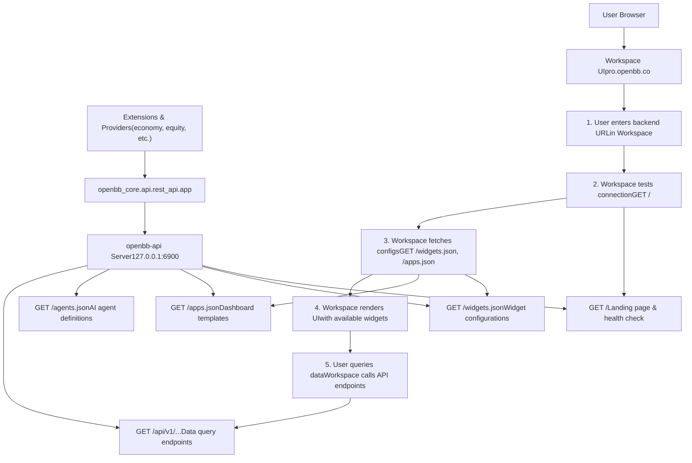
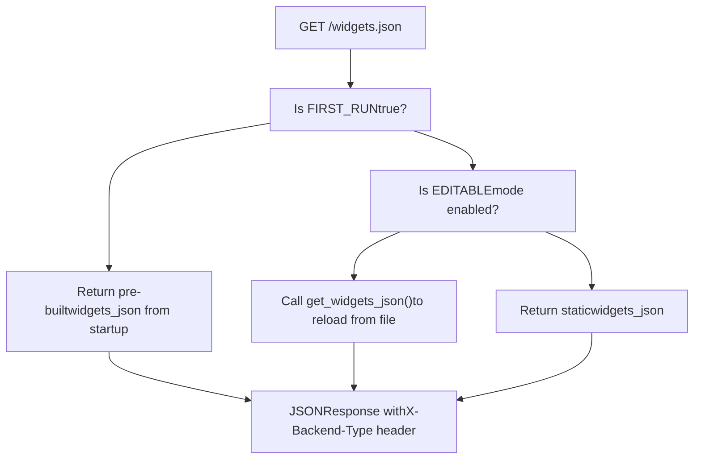
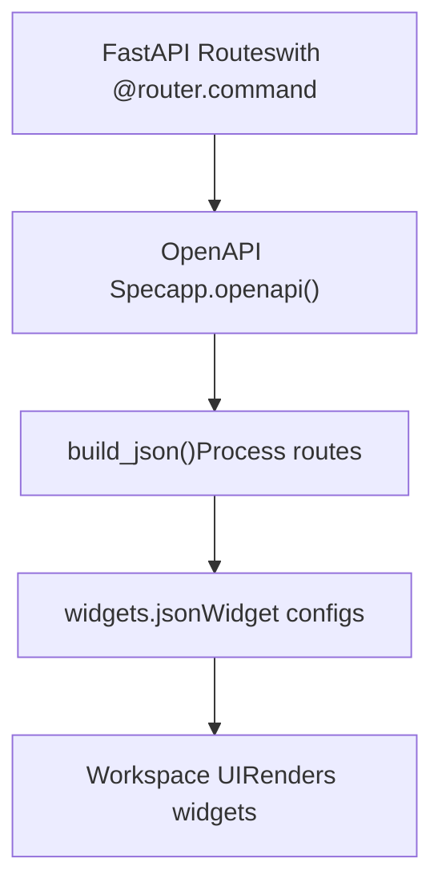

# OpenBB Workspace Integration

相关源文件

-   [.codespell.skip](https://github.com/OpenBB-finance/OpenBB/blob/dddc3b32/.codespell.skip)
-   [.pre-commit-config.yaml](https://github.com/OpenBB-finance/OpenBB/blob/dddc3b32/.pre-commit-config.yaml)
-   [README.md](https://github.com/OpenBB-finance/OpenBB/blob/dddc3b32/README.md?plain=1)
-   [openbb\_platform/core/openbb\_core/provider/standard\_models/management\_discussion\_analysis.py](https://github.com/OpenBB-finance/OpenBB/blob/dddc3b32/openbb_platform/core/openbb_core/provider/standard_models/management_discussion_analysis.py)
-   [openbb\_platform/extensions/platform\_api/README.md](https://github.com/OpenBB-finance/OpenBB/blob/dddc3b32/openbb_platform/extensions/platform_api/README.md?plain=1)
-   [openbb\_platform/extensions/platform\_api/openbb\_platform\_api/main.py](https://github.com/OpenBB-finance/OpenBB/blob/dddc3b32/openbb_platform/extensions/platform_api/openbb_platform_api/main.py)
-   [openbb\_platform/extensions/platform\_api/openbb\_platform\_api/query\_models.py](https://github.com/OpenBB-finance/OpenBB/blob/dddc3b32/openbb_platform/extensions/platform_api/openbb_platform_api/query_models.py)
-   [openbb\_platform/extensions/platform\_api/openbb\_platform\_api/response\_models.py](https://github.com/OpenBB-finance/OpenBB/blob/dddc3b32/openbb_platform/extensions/platform_api/openbb_platform_api/response_models.py)
-   [openbb\_platform/extensions/platform\_api/openbb\_platform\_api/utils/api.py](https://github.com/OpenBB-finance/OpenBB/blob/dddc3b32/openbb_platform/extensions/platform_api/openbb_platform_api/utils/api.py)
-   [openbb\_platform/extensions/platform\_api/openbb\_platform\_api/utils/openapi.py](https://github.com/OpenBB-finance/OpenBB/blob/dddc3b32/openbb_platform/extensions/platform_api/openbb_platform_api/utils/openapi.py)
-   [openbb\_platform/extensions/platform\_api/openbb\_platform\_api/utils/widgets.py](https://github.com/OpenBB-finance/OpenBB/blob/dddc3b32/openbb_platform/extensions/platform_api/openbb_platform_api/utils/widgets.py)
-   [openbb\_platform/extensions/platform\_api/poetry.lock](https://github.com/OpenBB-finance/OpenBB/blob/dddc3b32/openbb_platform/extensions/platform_api/poetry.lock)
-   [openbb\_platform/extensions/platform\_api/pyproject.toml](https://github.com/OpenBB-finance/OpenBB/blob/dddc3b32/openbb_platform/extensions/platform_api/pyproject.toml)
-   [openbb\_platform/extensions/platform\_api/tests/mock\_openapi.json](https://github.com/OpenBB-finance/OpenBB/blob/dddc3b32/openbb_platform/extensions/platform_api/tests/mock_openapi.json)
-   [openbb\_platform/extensions/platform\_api/tests/mock\_widgets.json](https://github.com/OpenBB-finance/OpenBB/blob/dddc3b32/openbb_platform/extensions/platform_api/tests/mock_widgets.json)
-   [openbb\_platform/extensions/platform\_api/tests/test\_openapi\_utils.py](https://github.com/OpenBB-finance/OpenBB/blob/dddc3b32/openbb_platform/extensions/platform_api/tests/test_openapi_utils.py)
-   [openbb\_platform/extensions/platform\_api/tests/test\_widgets\_utils.py](https://github.com/OpenBB-finance/OpenBB/blob/dddc3b32/openbb_platform/extensions/platform_api/tests/test_widgets_utils.py)
-   [openbb\_platform/extensions/regulators/integration/test\_regulators\_api.py](https://github.com/OpenBB-finance/OpenBB/blob/dddc3b32/openbb_platform/extensions/regulators/integration/test_regulators_api.py)
-   [openbb\_platform/extensions/regulators/integration/test\_regulators\_python.py](https://github.com/OpenBB-finance/OpenBB/blob/dddc3b32/openbb_platform/extensions/regulators/integration/test_regulators_python.py)
-   [openbb\_platform/extensions/regulators/openbb\_regulators/cftc/cftc\_router.py](https://github.com/OpenBB-finance/OpenBB/blob/dddc3b32/openbb_platform/extensions/regulators/openbb_regulators/cftc/cftc_router.py)
-   [openbb\_platform/extensions/regulators/openbb\_regulators/sec/sec\_router.py](https://github.com/OpenBB-finance/OpenBB/blob/dddc3b32/openbb_platform/extensions/regulators/openbb_regulators/sec/sec_router.py)
-   [openbb\_platform/providers/nasdaq/tests/record/expected\_widgets.json](https://github.com/OpenBB-finance/OpenBB/blob/dddc3b32/openbb_platform/providers/nasdaq/tests/record/expected_widgets.json)
-   [openbb\_platform/providers/sec/openbb\_sec/models/management\_discussion\_analysis.py](https://github.com/OpenBB-finance/OpenBB/blob/dddc3b32/openbb_platform/providers/sec/openbb_sec/models/management_discussion_analysis.py)
-   [openbb\_platform/providers/sec/openbb\_sec/models/schema\_files.py](https://github.com/OpenBB-finance/OpenBB/blob/dddc3b32/openbb_platform/providers/sec/openbb_sec/models/schema_files.py)
-   [openbb\_platform/providers/sec/openbb\_sec/utils/html2markdown.py](https://github.com/OpenBB-finance/OpenBB/blob/dddc3b32/openbb_platform/providers/sec/openbb_sec/utils/html2markdown.py)
-   [openbb\_platform/providers/sec/openbb\_sec/utils/xbrl\_taxonomy\_helper.py](https://github.com/OpenBB-finance/OpenBB/blob/dddc3b32/openbb_platform/providers/sec/openbb_sec/utils/xbrl_taxonomy_helper.py)
-   [openbb\_platform/providers/sec/poetry.lock](https://github.com/OpenBB-finance/OpenBB/blob/dddc3b32/openbb_platform/providers/sec/poetry.lock)
-   [openbb\_platform/providers/sec/pyproject.toml](https://github.com/OpenBB-finance/OpenBB/blob/dddc3b32/openbb_platform/providers/sec/pyproject.toml)

## 目的与范围

OpenBB Workspace 是一个云端托管的企业级 UI 应用程序（托管在 `https://pro.openbb.co`），它连接到本地或远程 OpenBB Platform API 后端，提供交互式数据可视化、仪表板创建和 AI 代理集成。本页面介绍了如何将 OpenBB Platform API 服务器连接到 Workspace 以及这两个系统如何通信。

该集成通过保持所有数据处理在本地，同时利用云托管的 UI 来维护数据主权。这种架构使用户能够在利用 Workspace 协作功能的同时，通过 OpenBB Platform 访问专有数据源。

有关 REST API 服务器本身的详细信息，请参阅第 5.2 页。有关深入的小部件生成机制，请参阅第 5.4 页。有关可视化组件，请参阅第 5.6 页。

## 什么是 OpenBB Workspace

OpenBB Workspace 是一个基于 Web 的金融研究和分析平台，提供：

-   **交互式仪表板**：支持自定义布局的拖放式小部件放置
-   **数据可视化**：表格、图表、指标和自定义可视化
-   **AI 代理**：与语言模型集成以进行自然语言查询
-   **协作**：可共享的仪表板和应用程序
-   **多后端支持**：同时连接多个数据源

Workspace UI 在云端（`https://pro.openbb.co`）运行，但连接到可以在本地或私有基础设施上运行的 API 后端。这种架构确保敏感数据永远不会离开用户的环境，同时仍提供现代化的协作接口。

**来源：** [README.md40-58](https://github.com/OpenBB-finance/OpenBB/blob/dddc3b32/README.md?plain=1#L40-L58)

## 集成架构


集成保持了清晰的分离：

-   **后端 (本地)**：处理所有数据获取、处理和身份验证
-   **前端 (云端)**：提供 UI 渲染、状态管理和协作功能
-   **通信**：带有 CORS 标头的标准 HTTP/HTTPS 请求

**来源：** [README.md59-96](https://github.com/OpenBB-finance/OpenBB/blob/dddc3b32/README.md?plain=1#L59-L96) [openbb\_platform\_api/main.py124-282](https://github.com/OpenBB-finance/OpenBB/blob/dddc3b32/openbb_platform_api/main.py#L124-L282)

## 连接设置

### 安装并启动后端

要将 OpenBB Platform 与 Workspace 集成，首先安装并启动 API 服务器：

```
# 安装带有所有扩展的 OpenBB Platformpip install "openbb[all]" # 启动 API 服务器openbb-api
```
这将通过 Uvicorn 在默认的 `http://127.0.0.1:6900` 启动 FastAPI 服务器。可以通过在浏览器中导航到 `http://127.0.0.1:6900` 来验证服务器，该页面将显示一个登录页。

**配置选项：**

```
# 自定义主机和端口openbb-api --host 0.0.0.0 --port 8000 # 使用 SSL 证书启用 HTTPSopenbb-api --ssl_keyfile localhost.key --ssl_certfile localhost.crt # 用于手动编辑的自定义小部件路径openbb-api --editable --widgets-json /path/to/widgets.json # 从小部件生成中排除特定路由openbb-api --exclude '["/api/v1/econometrics/*"]'
```
**来源：** [README.md59-79](https://github.com/OpenBB-finance/OpenBB/blob/dddc3b32/README.md?plain=1#L59-L79) [openbb\_platform\_api/README.md16-96](https://github.com/OpenBB-finance/OpenBB/blob/dddc3b32/openbb_platform_api/README.md?plain=1#L16-L96)

### 从 Workspace 连接

标题：**Workspace 后端连接过程**

> **[Mermaid sequence]**
> *(图表结构无法解析)*

从 Workspace UI 的连接过程：

1.  导航到 Workspace 中的 "Apps" 选项卡
2.  点击 "Connect backend" (连接后端)
3.  填写连接表单：
    -   **Name** (名称)：后端的显示名称（例如 "Open Data Platform"）
    -   **URL**：后端 URL（例如 `http://127.0.0.1:6900`）
4.  点击 "Test" (测试) - Workspace 验证连接并获取元数据
5.  点击 "Add" (添加) - 后端已注册并可供使用

**来源：** [README.md83-96](https://github.com/OpenBB-finance/OpenBB/blob/dddc3b32/README.md?plain=1#L83-L96)

## 后端集成端点

### 根端点 (/)

根端点提供登录页面并充当健康检查：

```
@app.get("/")async def root():    """Serve the landing page HTML content."""    html_path = Path(__file__).parent / "assets" / "landing_page.html"    with open(html_path, encoding="utf-8") as f:        html_content = f.read()    return HTMLResponse(content=html_content)
```
**用途：**

-   验证后端是否可访问
-   提供人类可读的状态页面
-   作为 CORS 预检检查

**来源：** [openbb\_platform\_api/main.py124-130](https://github.com/OpenBB-finance/OpenBB/blob/dddc3b32/openbb_platform_api/main.py#L124-L130)

### 小部件端点 (/widgets.json)

标题：**widgets.json 端点行为**


`/widgets.json` 端点提供定义以下内容的小部件配置：

-   可用的小部件及其 ID
-   每个小部件的输入参数
-   数据表列定义
-   图表配置
-   默认值和验证规则

**端点实现：**

```
@app.get("/widgets.json")async def get_widgets():    """Widgets configuration file for the OpenBB Workspace."""    global FIRST_RUN    if FIRST_RUN is True:        FIRST_RUN = False        return JSONResponse(content=widgets_json, headers=obb_headers)    if EDITABLE:        return JSONResponse(            content=get_widgets_json(                False, openapi, widget_exclude_filter, EDITABLE, WIDGETS_PATH, app            ),            headers=obb_headers,        )    return JSONResponse(content=widgets_json, headers=obb_headers)
```
**响应格式：**

```
{  "economy_gdp_fred_obb": {    "name": "GDP",    "description": "Get Gross Domestic Product data",    "category": "Economy",    "type": "table",    "widgetId": "economy_gdp_fred_obb",    "params": [...],    "endpoint": "/api/v1/economy/gdp",    "data": {      "dataKey": "results",      "table": {"columnsDefs": [...]}    },    "source": ["FRED"]  }}
```
有关详细的小部件配置结构和生成，请参阅第 5.4 页。

**来源：** [openbb\_platform\_api/main.py139-169](https://github.com/OpenBB-finance/OpenBB/blob/dddc3b32/openbb_platform_api/main.py#L139-L169) [openbb\_platform\_api/utils/api.py110-211](https://github.com/OpenBB-finance/OpenBB/blob/dddc3b32/openbb_platform_api/utils/api.py#L110-L211)

### 应用端点 (/apps.json)

`/apps.json` 端点提供用户可以在 Workspace 中实例化的仪表板模板：

```
@app.get("/apps.json")async def get_apps_json():    """Get the apps.json file."""    new_templates: list = []    default_templates: list = []    widgets = await get_widgets()        # Load default templates from package    if os.path.exists(DEFAULT_APPS_PATH):        with open(DEFAULT_APPS_PATH, encoding="utf-8") as f:            default_templates = json.load(f)        # Load user templates from OpenBBUserData    if os.path.exists(APPS_PATH):        with open(APPS_PATH, encoding="utf-8") as templates_file:            templates = json.load(templates_file)        templates.extend(default_templates)                # Filter to only include templates with valid widget IDs        for template in templates:            if template.get("layout"):                if all(item.get("i") in widgets_json for item in template["layout"]):                    new_templates.append(template)        return JSONResponse(content=new_templates, headers=obb_headers)
```
**模板结构：**

```
[  {    "name": "Economic Overview",    "description": "Key economic indicators",    "layout": [      {        "i": "economy_gdp_fred_obb",        "x": 0,        "y": 0,        "w": 20,        "h": 10      },      {        "i": "economy_cpi_fred_obb",        "x": 20,        "y": 0,        "w": 20,        "h": 10      }    ]  }]
```
用户可以从 Workspace 导出仪表板，默认保存到 `~/OpenBBUserData/workspace_apps.json`。这些模板在连接到后端时可用。

**来源：** [openbb\_platform\_api/main.py176-245](https://github.com/OpenBB-finance/OpenBB/blob/dddc3b32/openbb_platform_api/main.py#L176-L245)

### 代理端点 (/agents.json)

可选的 `/agents.json` 端点为 Workspace 提供 AI 代理定义：

```
@app.get("/agents.json")async def get_agents_json():    """Get the agents.json file."""    new_agents: dict = {}    additional_agents = await get_additional_agents(app)    if additional_agents:        for path_agents in additional_agents.values():            for k, v in path_agents.items():                new_agents[k] = v    return JSONResponse(content=new_agents, headers=obb_headers)
```
仅在以下情况下注册此端点：

-   提供 `--agents-json` CLI 参数，或者
-   其他路由通过其自身的端点公开代理

**来源：** [openbb\_platform\_api/main.py260-282](https://github.com/OpenBB-finance/OpenBB/blob/dddc3b32/openbb_platform_api/main.py#L260-L282)

## 数据查询流程

标题：**Workspace 数据获取过程**

> **[Mermaid sequence]**
> *(图表结构无法解析)*

### 响应格式

API 以 OBBject 格式返回数据：

```
{  "results": [    {      "date": "2024-01-01",      "open": 150.0,      "high": 155.0,      "low": 149.0,      "close": 153.0,      "volume": 1000000    }  ],  "provider": "fmp",  "warnings": [],  "chart": null,  "extra": {}}
```
Workspace 使用小部件配置的 `data.dataKey` 字段（通常为 `"results"`）来提取数据数组，并使用 `data.table.columnsDefs` 来适当格式化每一列。

**来源：** [openbb\_platform\_api/main.py124-282](https://github.com/OpenBB-finance/OpenBB/blob/dddc3b32/openbb_platform_api/main.py#L124-L282) [openbb\_core/app/model/obbject.py](https://github.com/OpenBB-finance/OpenBB/blob/dddc3b32/openbb_core/app/model/obbject.py)

## Workspace 功能

### 交互式仪表板

Workspace 提供了一个基于网格的布局系统，用户可以：

-   **添加小部件**：从小部件库拖动到仪表板
-   **调整大小和位置**：拖动手柄调整大小和位置
-   **配置参数**：为每个小部件实例设置输入
-   **链接小部件**：将一个小部件的输出用作另一个小部件的输入
-   **保存布局**：导出为 apps.json 模板

小部件配置通过 `gridData` 字段定义默认网格维度：

```
{  "gridData": {    "w": 40,  // 网格单位宽度 (通常最大为 40)    "h": 15   // 网格单位高度  }}
```
**来源：** [openbb\_platform\_api/utils/widgets.py132-136](https://github.com/OpenBB-finance/OpenBB/blob/dddc3b32/openbb_platform_api/utils/widgets.py#L132-L136)

### 数据主权

该集成通过本地处理维护数据主权：

| 组件 | 位置 | 角色 |
| --- | --- | --- |
| **API 服务器** | 用户的基础设施 (本地/云端) | 数据获取、身份验证、处理 |
| **Workspace UI** | OpenBB 云端 (`pro.openbb.co`) | 渲染、状态管理、协作 |
| **数据传输** | HTTPS 请求 | 加密通信 |
| **数据存储** | 云端无存储 | 所有数据保留在用户环境中 |

Workspace 绝不存储查询结果或 API 响应。每次小部件刷新都会从连接的后端获取最新数据。

### 多后端支持

用户可以同时连接多个后端：

```
Workspace UI
  ├── 后端: "Open Data Platform" (http://127.0.0.1:6900)
  ├── 后端: "Company Data" (https://internal.company.com:8443)
  └── 后端: "Market Data" (http://192.168.1.100:6900)
```
每个后端都将其小部件贡献到 Workspace 目录中，允许用户在单个仪表板中合并来自多个来源的数据。

**来源：** [README.md40-58](https://github.com/OpenBB-finance/OpenBB/blob/dddc3b32/README.md?plain=1#L40-L58)

## 小部件生成概述

虽然详细的小部件生成在第 5.4 页中介绍，但这里简要概述了小部件是如何创建的：

标题：**小部件生成流程**


关键过程：

1.  **路由发现**：扫描 OpenAPI 规范中的所有路由
2.  **参数提取**：将 OpenAPI 参数转换为小部件输入
3.  **Schema 处理**：将响应 schema 转换为表格列定义
4.  **提供程序迭代**：为每个提供程序创建单独的小部件
5.  **配置合并**：应用 `x-widget_config` 自定义设置

有关小部件生成、自定义和 `x-widget_config` 系统的详细文档，请参阅第 5.4 页。

**来源：** [openbb\_platform\_api/utils/widgets.py233-741](https://github.com/OpenBB-finance/OpenBB/blob/dddc3b32/openbb_platform_api/utils/widgets.py#L233-L741)

## 运行时集成

### Workspace 连接流程

> **[Mermaid sequence]**
> *(图表结构无法解析)*

**来源：** [openbb\_platform\_api/main.py139-220](https://github.com/OpenBB-finance/OpenBB/blob/dddc3b32/openbb_platform_api/main.py#L139-L220)

### 可编辑模式与热重载

使用 `--editable` 标志启动时，`/widgets.json` 端点支持动态更新：

```
@app.get("/widgets.json")async def get_widgets():    global FIRST_RUN    if FIRST_RUN is True:        FIRST_RUN = False        return JSONResponse(content=widgets_json, headers=obb_headers)    if EDITABLE:        return JSONResponse(            content=get_widgets_json(                False, openapi, widget_exclude_filter, EDITABLE, WIDGETS_PATH            ),            headers=obb_headers,        )    return JSONResponse(content=widgets_json, headers=obb_headers)
```
[openbb\_platform\_api/main.py148-163](https://github.com/OpenBB-finance/OpenBB/blob/dddc3b32/openbb_platform_api/main.py#L148-L163) 处的流程：

1.  第一次请求返回预构建的 `widgets_json`
2.  如果 `EDITABLE=True`，后续请求从文件重新加载
3.  允许手动编辑 `widgets.json` 并立即反映在 Workspace 中

**来源：** [openbb\_platform\_api/main.py148-163](https://github.com/OpenBB-finance/OpenBB/blob/dddc3b32/openbb_platform_api/main.py#L148-L163) [openbb\_platform\_api/utils/api.py115-174](https://github.com/OpenBB-finance/OpenBB/blob/dddc3b32/openbb_platform_api/utils/api.py#L115-L174)

### Apps.json 模板系统

`/apps.json` 端点提供仪表板模板：

```
@app.get("/apps.json")async def get_apps_json():    new_templates: list = []    default_templates: list = []    widgets = await get_widgets()        # Load default templates from package    if os.path.exists(DEFAULT_APPS_PATH):        with open(DEFAULT_APPS_PATH) as f:            default_templates = json.load(f)        # Load user templates    if os.path.exists(APPS_PATH):        with open(APPS_PATH) as templates_file:            templates = json.load(templates_file)        templates.extend(default_templates)                # Filter templates to only include widgets that exist        for template in templates:            if template.get("layout"):                if all(item.get("i") in widgets_json for item in template["layout"]):                    new_templates.append(template)        return JSONResponse(content=new_templates, headers=obb_headers)
```
[openbb\_platform\_api/main.py195-216](https://github.com/OpenBB-finance/OpenBB/blob/dddc3b32/openbb_platform_api/main.py#L195-L216) 处的模板验证确保仅包含具有匹配 ID 的小部件。

**来源：** [openbb\_platform\_api/main.py167-220](https://github.com/OpenBB-finance/OpenBB/blob/dddc3b32/openbb_platform_api/main.py#L167-L220)

### CORS 标头与安全

服务器在所有响应中添加 CORS 标头以进行跨源访问：

```
obb_headers = {"X-Backend-Type": "OpenBB Platform"}
```
标头添加在 [openbb\_platform\_api/main.py155](https://github.com/OpenBB-finance/OpenBB/blob/dddc3b32/openbb_platform_api/main.py#L155-L155)、[openbb\_platform\_api/main.py161](https://github.com/OpenBB-finance/OpenBB/blob/dddc3b32/openbb_platform_api/main.py#L161-L161) 和 [openbb\_platform\_api/main.py218](https://github.com/OpenBB-finance/OpenBB/blob/dddc3b32/openbb_platform_api/main.py#L218-L218) 处的响应中。

在 [openbb\_platform\_api/utils/api.py260-265](https://github.com/OpenBB-finance/OpenBB/blob/dddc3b32/openbb_platform_api/utils/api.py#L260-L265) 处导入自定义应用时配置了 CORS 中间件。

**来源：** [openbb\_platform\_api/main.py78-79](https://github.com/OpenBB-finance/OpenBB/blob/dddc3b32/openbb_platform_api/main.py#L78-L79) [openbb\_platform\_api/utils/api.py260-265](https://github.com/OpenBB-finance/OpenBB/blob/dddc3b32/openbb_platform_api/utils/api.py#L260-L265)

## 配置示例

### 完整的小部件配置结构

来自 [openbb\_platform\_api/tests/mock\_widgets.json2-182](https://github.com/OpenBB-finance/OpenBB/blob/dddc3b32/openbb_platform_api/tests/mock_widgets.json#L2-L182) 的示例：

```
{  "economy_survey_sloos_fred_obb": {    "name": "SLOOS",    "description": "Get Senior Loan Officers Opinion Survey.",    "category": "Economy",    "subCategory": "Survey",    "type": "table",    "searchCategory": "Economy",    "widgetId": "economy_survey_sloos_fred_obb",    "mcp_tool": {      "mcp_server": "Open Data Platform",      "tool_id": "economy_survey_sloos"    },    "params": [      {        "paramName": "start_date",        "label": "Start Date",        "type": "date",        "optional": true,        "value": null,        "show": true      },      {        "paramName": "category",        "label": "Category",        "type": "text",        "optional": true,        "value": "spreads",        "options": [          {"label": "spreads", "value": "spreads"},          {"label": "consumer", "value": "consumer"}        ]      }    ],    "endpoint": "/api/v1/economy/survey/sloos",    "gridData": {"w": 40, "h": 15},    "data": {      "dataKey": "results",      "table": {        "showAll": true,        "columnsDefs": [          {            "field": "date",            "headerName": "Date",            "cellDataType": "date",            "pinned": "left"          },          {            "field": "value",            "headerName": "Value",            "cellDataType": "number"          }        ],        "enableAdvanced": true      }    },    "source": ["FRED"]  }}
```
**来源：** [openbb\_platform\_api/tests/mock\_widgets.json2-182](https://github.com/OpenBB-finance/OpenBB/blob/dddc3b32/openbb_platform_api/tests/mock_widgets.json#L2-L182)

### 特定于提供程序的示例

显示特定于提供程序参数的多提供程序小部件：

```
{  "params": [    {      "paramName": "country",      "label": "Country",      "type": "text",      "options": ["united_states", "canada", "mexico"],      "available_providers": ["fred"],      "show": true    },    {      "paramName": "frequency",      "label": "Frequency",      "type": "text",      "options": ["annual", "quarterly", "monthly"],      "available_providers": ["fred", "oecd"],      "show": true    },    {      "paramName": "provider",      "value": "fred",      "show": false    }  ]}
```
由 [openbb\_platform\_api/utils/widgets.py215-218](https://github.com/OpenBB-finance/OpenBB/blob/dddc3b32/openbb_platform_api/utils/widgets.py#L215-L218) 生成。

**来源：** [openbb\_platform\_api/utils/widgets.py103-218](https://github.com/OpenBB-finance/OpenBB/blob/dddc3b32/openbb_platform_api/utils/widgets.py#L103-L218)
