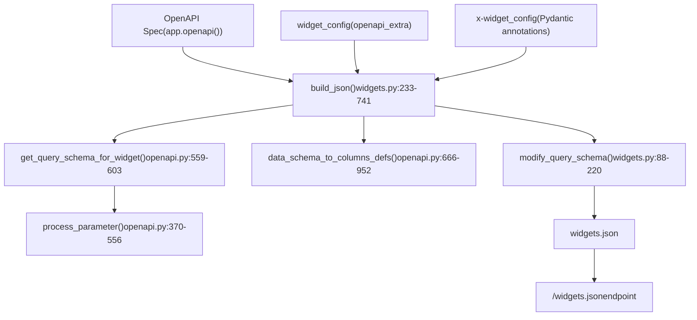
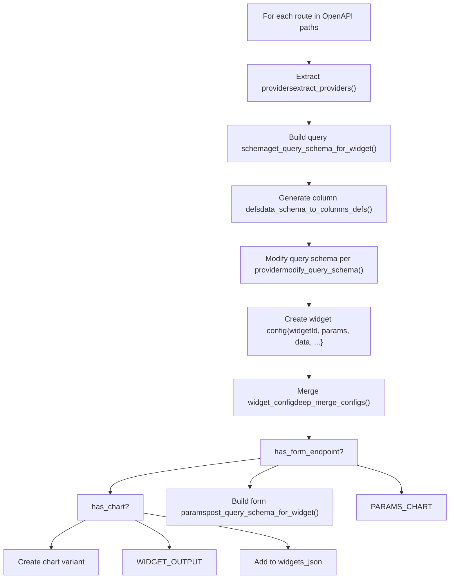
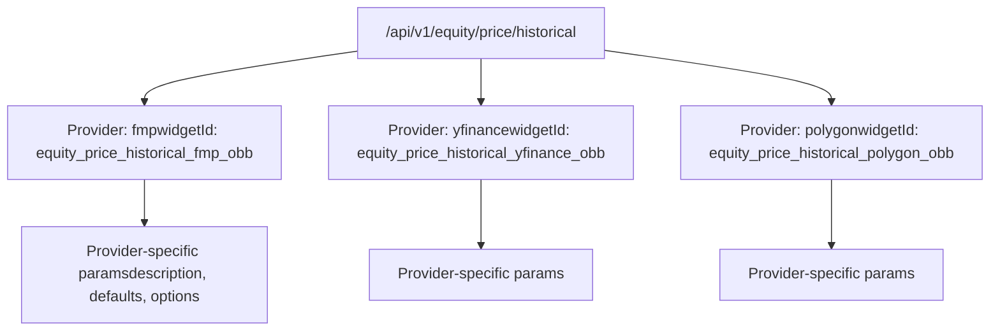
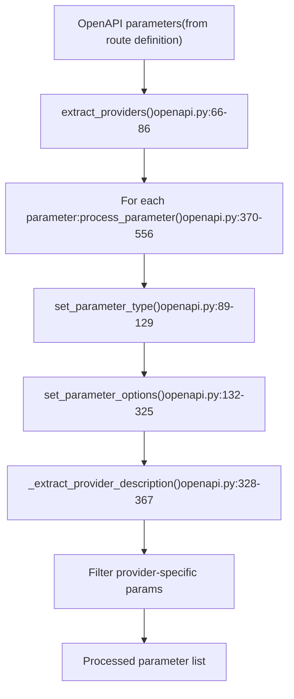
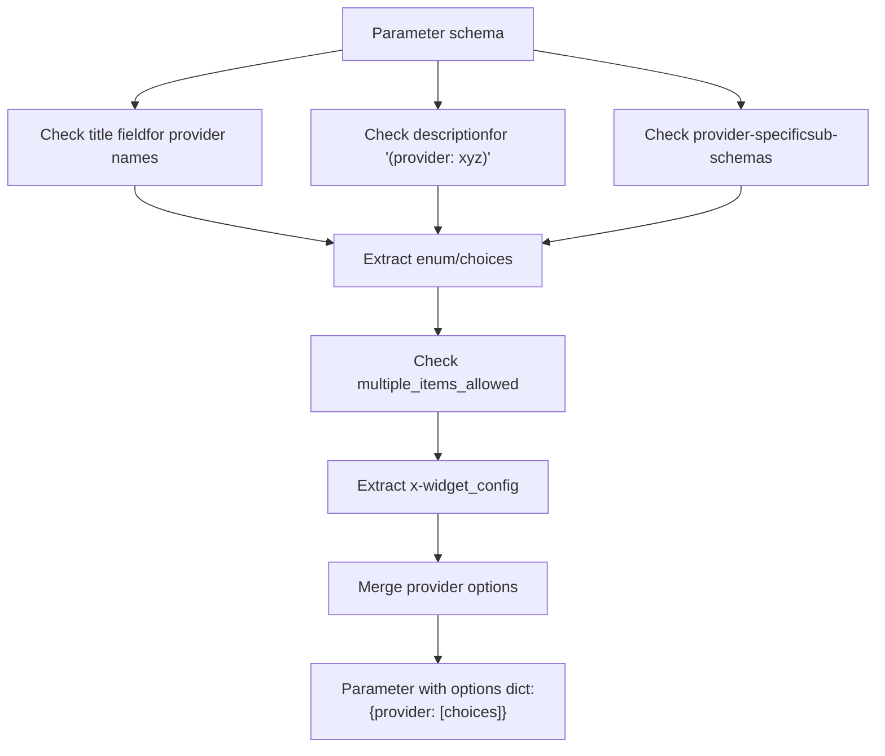
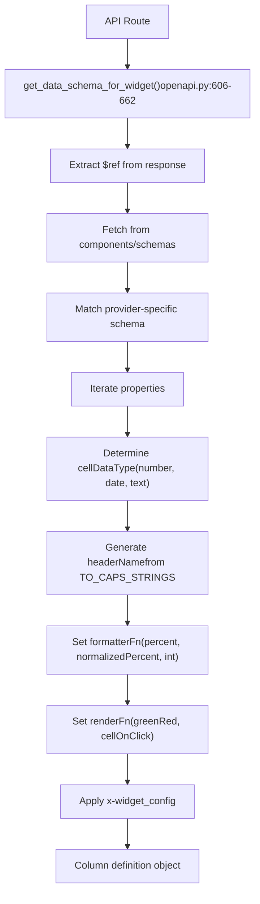
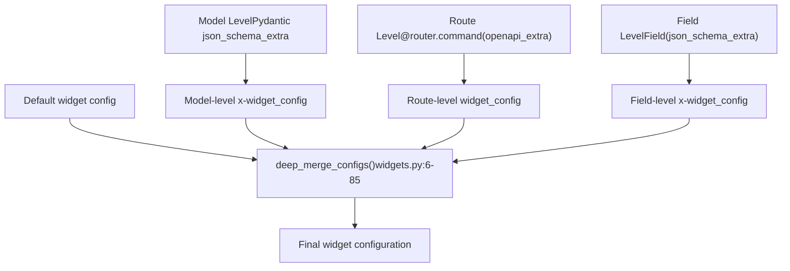
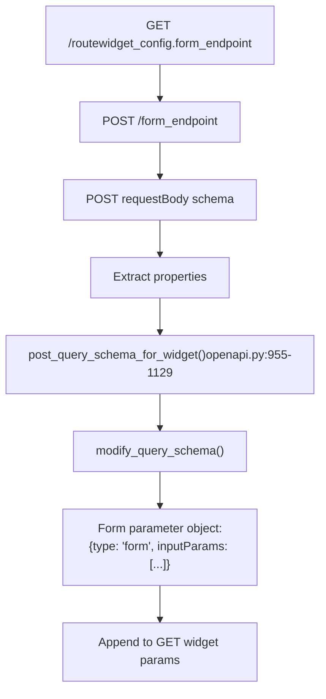
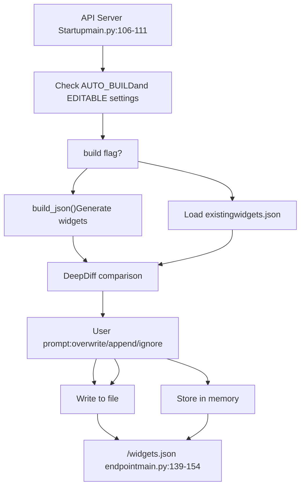

# Widget System

相关源文件

-   [.codespell.skip](https://github.com/OpenBB-finance/OpenBB/blob/dddc3b32/.codespell.skip)
-   [openbb\_platform/core/openbb\_core/provider/standard\_models/management\_discussion\_analysis.py](https://github.com/OpenBB-finance/OpenBB/blob/dddc3b32/openbb_platform/core/openbb_core/provider/standard_models/management_discussion_analysis.py)
-   [openbb\_platform/extensions/platform\_api/README.md](https://github.com/OpenBB-finance/OpenBB/blob/dddc3b32/openbb_platform/extensions/platform_api/README.md?plain=1)
-   [openbb\_platform/extensions/platform\_api/openbb\_platform\_api/main.py](https://github.com/OpenBB-finance/OpenBB/blob/dddc3b32/openbb_platform/extensions/platform_api/openbb_platform_api/main.py)
-   [openbb\_platform/extensions/platform\_api/openbb\_platform\_api/query\_models.py](https://github.com/OpenBB-finance/OpenBB/blob/dddc3b32/openbb_platform/extensions/platform_api/openbb_platform_api/query_models.py)
-   [openbb\_platform/extensions/platform\_api/openbb\_platform\_api/response\_models.py](https://github.com/OpenBB-finance/OpenBB/blob/dddc3b32/openbb_platform/extensions/platform_api/openbb_platform_api/response_models.py)
-   [openbb\_platform/extensions/platform\_api/openbb\_platform\_api/utils/api.py](https://github.com/OpenBB-finance/OpenBB/blob/dddc3b32/openbb_platform/extensions/platform_api/openbb_platform_api/utils/api.py)
-   [openbb\_platform/extensions/platform\_api/openbb\_platform\_api/utils/openapi.py](https://github.com/OpenBB-finance/OpenBB/blob/dddc3b32/openbb_platform/extensions/platform_api/openbb_platform_api/utils/openapi.py)
-   [openbb\_platform/extensions/platform\_api/openbb\_platform\_api/utils/widgets.py](https://github.com/OpenBB-finance/OpenBB/blob/dddc3b32/openbb_platform/extensions/platform_api/openbb_platform_api/utils/widgets.py)
-   [openbb\_platform/extensions/platform\_api/poetry.lock](https://github.com/OpenBB-finance/OpenBB/blob/dddc3b32/openbb_platform/extensions/platform_api/poetry.lock)
-   [openbb\_platform/extensions/platform\_api/pyproject.toml](https://github.com/OpenBB-finance/OpenBB/blob/dddc3b32/openbb_platform/extensions/platform_api/pyproject.toml)
-   [openbb\_platform/extensions/platform\_api/tests/mock\_openapi.json](https://github.com/OpenBB-finance/OpenBB/blob/dddc3b32/openbb_platform/extensions/platform_api/tests/mock_openapi.json)
-   [openbb\_platform/extensions/platform\_api/tests/mock\_widgets.json](https://github.com/OpenBB-finance/OpenBB/blob/dddc3b32/openbb_platform/extensions/platform_api/tests/mock_widgets.json)
-   [openbb\_platform/extensions/platform\_api/tests/test\_openapi\_utils.py](https://github.com/OpenBB-finance/OpenBB/blob/dddc3b32/openbb_platform/extensions/platform_api/tests/test_openapi_utils.py)
-   [openbb\_platform/extensions/platform\_api/tests/test\_widgets\_utils.py](https://github.com/OpenBB-finance/OpenBB/blob/dddc3b32/openbb_platform/extensions/platform_api/tests/test_widgets_utils.py)
-   [openbb\_platform/extensions/regulators/integration/test\_regulators\_api.py](https://github.com/OpenBB-finance/OpenBB/blob/dddc3b32/openbb_platform/extensions/regulators/integration/test_regulators_api.py)
-   [openbb\_platform/extensions/regulators/integration/test\_regulators\_python.py](https://github.com/OpenBB-finance/OpenBB/blob/dddc3b32/openbb_platform/extensions/regulators/integration/test_regulators_python.py)
-   [openbb\_platform/extensions/regulators/openbb\_regulators/cftc/cftc\_router.py](https://github.com/OpenBB-finance/OpenBB/blob/dddc3b32/openbb_platform/extensions/regulators/openbb_regulators/cftc/cftc_router.py)
-   [openbb\_platform/extensions/regulators/openbb\_regulators/sec/sec\_router.py](https://github.com/OpenBB-finance/OpenBB/blob/dddc3b32/openbb_platform/extensions/regulators/openbb_regulators/sec/sec_router.py)
-   [openbb\_platform/providers/nasdaq/tests/record/expected\_widgets.json](https://github.com/OpenBB-finance/OpenBB/blob/dddc3b32/openbb_platform/providers/nasdaq/tests/record/expected_widgets.json)
-   [openbb\_platform/providers/sec/openbb\_sec/models/management\_discussion\_analysis.py](https://github.com/OpenBB-finance/OpenBB/blob/dddc3b32/openbb_platform/providers/sec/openbb_sec/models/management_discussion_analysis.py)
-   [openbb\_platform/providers/sec/openbb\_sec/models/schema\_files.py](https://github.com/OpenBB-finance/OpenBB/blob/dddc3b32/openbb_platform/providers/sec/openbb_sec/models/schema_files.py)
-   [openbb\_platform/providers/sec/openbb\_sec/utils/html2markdown.py](https://github.com/OpenBB-finance/OpenBB/blob/dddc3b32/openbb_platform/providers/sec/openbb_sec/utils/html2markdown.py)
-   [openbb\_platform/providers/sec/openbb\_sec/utils/xbrl\_taxonomy\_helper.py](https://github.com/OpenBB-finance/OpenBB/blob/dddc3b32/openbb_platform/providers/sec/openbb_sec/utils/xbrl_taxonomy_helper.py)
-   [openbb\_platform/providers/sec/poetry.lock](https://github.com/OpenBB-finance/OpenBB/blob/dddc3b32/openbb_platform/providers/sec/poetry.lock)
-   [openbb\_platform/providers/sec/pyproject.toml](https://github.com/OpenBB-finance/OpenBB/blob/dddc3b32/openbb_platform/providers/sec/pyproject.toml)

## 目的与范围

Widget System (小部件系统) 负责为 OpenBB Workspace 前端自动生成和提供 UI 配置元数据。它将 OpenBB Platform 的 OpenAPI 规范转换为 `widgets.json` 文件，该文件定义了 Workspace 界面可使用的交互式组件（小部件）。该系统通过桥接 REST API 后端与云端 Workspace UI，实现了 "一次连接，到处使用" 的架构。

有关生成 OpenAPI 规范的 REST API 服务器的信息，请参阅 [REST API Server](/OpenBB-finance/OpenBB/5.2-rest-api-server)。有关 Workspace 如何与 API 集成的详细信息，请参阅 [OpenBB Workspace Integration](/OpenBB-finance/OpenBB/5.3-openbb-workspace-integration)。

---

## 系统概述

小部件系统通过 **build-time generation (构建时生成)** 或 **runtime serving (运行时服务)** 模型运行，其中 OpenAPI 规范被解析并转换为小部件配置。每个 API 端点可以表示为一个或多个小部件（例如，同一数据的表格小部件和图表小部件）。


**来源：**

-   [openbb\_platform\_api/utils/widgets.py233-741](https://github.com/OpenBB-finance/OpenBB/blob/dddc3b32/openbb_platform_api/utils/widgets.py#L233-L741)
-   [openbb\_platform\_api/utils/openapi.py559-603](https://github.com/OpenBB-finance/OpenBB/blob/dddc3b32/openbb_platform_api/utils/openapi.py#L559-L603)
-   [openbb\_platform\_api/main.py109-111](https://github.com/OpenBB-finance/OpenBB/blob/dddc3b32/openbb_platform_api/main.py#L109-L111)

---

## 小部件生成流水线

### 核心生成流程

[openbb\_platform\_api/utils/widgets.py233-741](https://github.com/OpenBB-finance/OpenBB/blob/dddc3b32/openbb_platform_api/utils/widgets.py#L233-L741) 中的 `build_json()` 函数编排了整个小部件生成过程：


**关键函数：**

| 函数 | 位置 | 用途 |
| --- | --- | --- |
| `build_json()` | [widgets.py233-741](https://github.com/OpenBB-finance/OpenBB/blob/dddc3b32/widgets.py#L233-L741) | 小部件生成的主要编排器 |
| `get_query_schema_for_widget()` | [openapi.py559-603](https://github.com/OpenBB-finance/OpenBB/blob/dddc3b32/openapi.py#L559-L603) | 提取并处理查询参数 |
| `data_schema_to_columns_defs()` | [openapi.py666-952](https://github.com/OpenBB-finance/OpenBB/blob/dddc3b32/openapi.py#L666-L952) | 将数据 schema 转换为表格列定义 |
| `modify_query_schema()` | [widgets.py88-220](https://github.com/OpenBB-finance/OpenBB/blob/dddc3b32/widgets.py#L88-L220) | 为特定提供程序适配参数 |
| `deep_merge_configs()` | [widgets.py6-85](https://github.com/OpenBB-finance/OpenBB/blob/dddc3b32/widgets.py#L6-L85) | 分层合并小部件配置 |

**来源：**

-   [openbb\_platform\_api/utils/widgets.py233-741](https://github.com/OpenBB-finance/OpenBB/blob/dddc3b32/openbb_platform_api/utils/widgets.py#L233-L741)
-   [openbb\_platform\_api/utils/openapi.py559-603](https://github.com/OpenBB-finance/OpenBB/blob/dddc3b32/openbb_platform_api/utils/openapi.py#L559-L603)
-   [openbb\_platform\_api/utils/openapi.py666-952](https://github.com/OpenBB-finance/OpenBB/blob/dddc3b32/openbb_platform_api/utils/openapi.py#L666-L952)

### 特定于提供程序的小部件生成

对于每个 API 路由，系统都会为每个可用提供程序生成单独的小部件配置。这在 [widgets.py336-740](https://github.com/OpenBB-finance/OpenBB/blob/dddc3b32/widgets.py#L336-L740) 的主循环中实现：


每个小部件通过将 `single_provider` 参数设置为 True 的 `process_parameter()` ([openapi.py370-556](https://github.com/OpenBB-finance/OpenBB/blob/dddc3b32/openapi.py#L370-L556)) 接收特定于提供程序的参数描述和默认值。

**来源：**

-   [openbb\_platform\_api/utils/widgets.py336-340](https://github.com/OpenBB-finance/OpenBB/blob/dddc3b32/openbb_platform_api/utils/widgets.py#L336-L340)
-   [openbb\_platform\_api/utils/openapi.py370-556](https://github.com/OpenBB-finance/OpenBB/blob/dddc3b32/openbb_platform_api/utils/openapi.py#L370-L556)

---

## 小部件类型与结构

### 小部件类型确定

系统支持多种小部件类型，由响应 schema 分析和显式配置决定：

| 小部件类型 | 触发条件 | 配置位置 |
| --- | --- | --- |
| `table` | 列表响应的默认值 | [widgets.py588-593](https://github.com/OpenBB-finance/OpenBB/blob/dddc3b32/widgets.py#L588-L593) |
| `chart` | 存在 `has_chart` 参数 | [widgets.py710-739](https://github.com/OpenBB-finance/OpenBB/blob/dddc3b32/widgets.py#L710-L739) |
| `metric` | `MetricResponseModel` 响应 | [response\_models.py9-60](https://github.com/OpenBB-finance/OpenBB/blob/dddc3b32/response_models.py#L9-L60) |
| `pdf` | `PdfResponseModel` 响应 | [response\_models.py62-103](https://github.com/OpenBB-finance/OpenBB/blob/dddc3b32/response_models.py#L62-L103) |
| `markdown` | 字符串响应 schema | [widgets.py588-593](https://github.com/OpenBB-finance/OpenBB/blob/dddc3b32/widgets.py#L588-L593) |
| `omni` | `OmniWidgetResponseModel` 响应 | [response\_models.py105-220](https://github.com/OpenBB-finance/OpenBB/blob/dddc3b32/response_models.py#L105-L220) |
| `form` | widget\_config 中包含 `form_endpoint` | [widgets.py388-523](https://github.com/OpenBB-finance/OpenBB/blob/dddc3b32/widgets.py#L388-L523) |

### 标准小部件结构

`widgets.json` 中的每个小部件都遵循 [widgets.py594-615](https://github.com/OpenBB-finance/OpenBB/blob/dddc3b32/widgets.py#L594-L615) 中定义的结构：

```
{  "widgetId": "economy_survey_sloos_fred_obb",  "name": "SLOOS",  "description": "Get Senior Loan Officers Opinion Survey.",  "category": "Economy",  "subCategory": "Survey",  "type": "table",  "endpoint": "/api/v1/economy/survey/sloos",  "params": [...],  "data": {    "dataKey": "results",    "table": {      "showAll": true,      "columnsDefs": [...]    }  },  "source": ["FRED"],  "gridData": {"w": 40, "h": 15},  "runButton": false}
```
**来源：**

-   [openbb\_platform\_api/utils/widgets.py594-615](https://github.com/OpenBB-finance/OpenBB/blob/dddc3b32/openbb_platform_api/utils/widgets.py#L594-L615)
-   [openbb\_platform\_api/tests/mock\_widgets.json1-180](https://github.com/OpenBB-finance/OpenBB/blob/dddc3b32/openbb_platform_api/tests/mock_widgets.json#L1-L180)

---

## 参数处理

### 查询参数提取与转换

`get_query_schema_for_widget()` 函数 ([openapi.py559-603](https://github.com/OpenBB-finance/OpenBB/blob/dddc3b32/openbb_platform_api/utils/openapi.py#L559-L603)) 从 OpenAPI 规范中提取参数并将其转换为兼容小部件的格式：


### 参数类型映射

`set_parameter_type()` 函数 ([openapi.py89-129](https://github.com/OpenBB-finance/OpenBB/blob/dddc3b32/openbb_platform_api/utils/openapi.py#L89-L129)) 将 OpenAPI 类型映射到小部件输入类型：

| OpenAPI 类型 | 条件 | 小部件类型 |
| --- | --- | --- |
| `string` | 默认 | `"text"` |
| `integer`, `float` | 默认 | `"number"` |
| `boolean` | 默认 | `"boolean"` |
| `string` | 参数名包含 "date" | `"date"` |
| `array`, `list` | 默认 | `"text"` |

### 特定于提供程序的选项

`set_parameter_options()` 函数 ([openapi.py132-325](https://github.com/OpenBB-finance/OpenBB/blob/dddc3b32/openbb_platform_api/utils/openapi.py#L132-L325)) 处理复杂的特定于提供程序的选择提取：


**具有特定于提供程序选项的示例参数：**

```
{  "paramName": "country",  "label": "Country",  "type": "text",  "options": {    "fred": [      {"label": "argentina", "value": "argentina"},      {"label": "australia", "value": "australia"}    ]  },  "available_providers": ["fred"]}
```
**来源：**

-   [openbb\_platform\_api/utils/openapi.py559-603](https://github.com/OpenBB-finance/OpenBB/blob/dddc3b32/openbb_platform_api/utils/openapi.py#L559-L603)
-   [openbb\_platform\_api/utils/openapi.py89-129](https://github.com/OpenBB-finance/OpenBB/blob/dddc3b32/openbb_platform_api/utils/openapi.py#L89-L129)
-   [openbb\_platform\_api/utils/openapi.py132-325](https://github.com/OpenBB-finance/OpenBB/blob/dddc3b32/openbb_platform_api/utils/openapi.py#L132-L325)

---

## 数据 Schema 到列定义

### 列定义生成

`data_schema_to_columns_defs()` 函数 ([openapi.py666-952](https://github.com/OpenBB-finance/OpenBB/blob/dddc3b32/openbb_platform_api/utils/openapi.py#L666-L952)) 将 Pydantic 响应模型转换为表格列配置：


### 列定义结构

每个列定义包括：

```
{  "field": "date",  "headerName": "Date",  "headerTooltip": "The date of the data.",  "cellDataType": "date",  "formatterFn": null,  "pinned": "left"}
```
根据字段属性应用 **特殊格式化规则** ([openapi.py824-950](https://github.com/OpenBB-finance/OpenBB/blob/dddc3b32/openbb_platform_api/utils/openapi.py#L824-L950))：

| 条件 | 格式化程序 | 渲染函数 |
| --- | --- | --- |
| `x-unit_measurement: "percent"` | `"percent"` 或 `"normalizedPercent"` | `"greenRed"` |
| 字段类型为 `integer` | `"int"` | \- |
| 字段名为 `["delta", "theta", "rho"]` | `"none"` | `"greenRed"` |
| 字段名为 `"change"` | \- | `"greenRed"` |

**来源：**

-   [openbb\_platform\_api/utils/openapi.py666-952](https://github.com/OpenBB-finance/OpenBB/blob/dddc3b32/openbb_platform_api/utils/openapi.py#L666-L952)
-   [openbb\_platform\_api/utils/openapi.py606-662](https://github.com/OpenBB-finance/OpenBB/blob/dddc3b32/openbb_platform_api/utils/openapi.py#L606-L662)

---

## 小部件配置注解

### x-widget\_config 系统

可以通过 OpenAPI 规范中多个层级的 `x-widget_config` 注解来自定义小部件行为：


### 常用的 x-widget\_config 选项

**对于参数：**

```
{  "x-widget_config": {    "multiSelect": true,    "exclude": false,    "show": true,    "style": {"popupWidth": 400}  }}
```
**对于响应字段：**

```
{  "x-widget_config": {    "formatterFn": "normalizedPercent",    "renderFn": "greenRed",    "hide": true,    "pinned": "left"  }}
```
**对于小部件级配置：**

```
{  "widget_config": {    "type": "chart",    "gridData": {"w": 40, "h": 20},    "exclude": false,    "form_endpoint": "/some_post_endpoint"  }}
```
### 变量键语法

配置可以使用 `$.` 前缀针对小部件结构的特定部分 ([widgets.py498-557](https://github.com/OpenBB-finance/OpenBB/blob/dddc3b32/openbb_platform_api/utils/widgets.py#L498-L557))：

```
{  "x-widget_config": {    "$.type": "metric",    "$.data": {"dataKey": "results.value"},    "$.params": [{"paramName": "custom", "value": "test"}]  }}
```
**来源：**

-   [openbb\_platform\_api/utils/widgets.py6-85](https://github.com/OpenBB-finance/OpenBB/blob/dddc3b32/openbb_platform_api/utils/widgets.py#L6-L85)
-   [openbb\_platform\_api/utils/widgets.py498-557](https://github.com/OpenBB-finance/OpenBB/blob/dddc3b32/openbb_platform_api/utils/widgets.py#L498-L557)
-   [openbb\_platform\_api/README.md243-339](https://github.com/OpenBB-finance/OpenBB/blob/dddc3b32/openbb_platform_api/README.md?plain=1#L243-L339)

---

## 表单小部件与 POST 端点

### 表单端点集成

当 GET 路由在其 `widget_config` 中指定了 `form_endpoint` 时，系统会从 POST 端点生成表单输入参数 ([widgets.py388-523](https://github.com/OpenBB-finance/OpenBB/blob/dddc3b32/openbb_platform_api/utils/widgets.py#L388-L523))：


### 表单参数结构

表单参数作为特殊参数类型嵌入：

```
{  "type": "form",  "paramName": "form_data",  "label": "Form",  "endpoint": "/api/v1/post_endpoint",  "inputParams": [    {      "paramName": "field1",      "label": "Field 1",      "type": "text",      "value": "default"    }  ]}
```
**来源：**

-   [openbb\_platform\_api/utils/widgets.py388-523](https://github.com/OpenBB-finance/OpenBB/blob/dddc3b32/openbb_platform_api/utils/widgets.py#L388-L523)
-   [openbb\_platform\_api/utils/openapi.py955-1129](https://github.com/OpenBB-finance/OpenBB/blob/dddc3b32/openbb_platform_api/utils/openapi.py#L955-L1129)

---

## 运行时小部件服务

### 可编辑模式 vs. 内置模式

小部件系统支持两种服务模式，在 API 启动时配置 ([main.py109-111](https://github.com/OpenBB-finance/OpenBB/blob/dddc3b32/openbb_platform_api/main.py#L109-L111))：

| 模式 | 触发条件 | 行为 |
| --- | --- | --- |
| **内置** | 默认 | 小部件在启动时生成一次，从内存提供服务 |
| **可编辑** | `--editable` 标志或 `--widgets-json` 路径 | 小部件写入文件，可以修改和重新加载 |

### 服务流程


### /widgets.json 端点

[main.py139-154](https://github.com/OpenBB-finance/OpenBB/blob/dddc3b32/openbb_platform_api/main.py#L139-L154) 处的端点提供小部件配置：

```
@app.get("/widgets.json")async def get_widgets():    """Widgets configuration file for the OpenBB Workspace."""    global FIRST_RUN    if FIRST_RUN is True:        FIRST_RUN = False        return JSONResponse(content=widgets_json, headers=obb_headers)    if EDITABLE:        return JSONResponse(            content=get_widgets_json(                False, openapi, widget_exclude_filter, EDITABLE, WIDGETS_PATH, app            ),            headers=obb_headers,        )    return JSONResponse(content=widgets_json, headers=obb_headers)
```
启用 `EDITABLE` 模式后，端点在每次请求时从磁盘重新加载小部件，从而允许进行运行时修改。

**来源：**

-   [openbb\_platform\_api/main.py109-111](https://github.com/OpenBB-finance/OpenBB/blob/dddc3b32/openbb_platform_api/main.py#L109-L111)
-   [openbb\_platform\_api/main.py139-154](https://github.com/OpenBB-finance/OpenBB/blob/dddc3b32/openbb_platform_api/main.py#L139-L154)
-   [openbb\_platform\_api/utils/api.py110-210](https://github.com/OpenBB-finance/OpenBB/blob/dddc3b32/openbb_platform_api/utils/api.py#L110-L210)

---

## 小部件过滤与排除

### 小部件排除机制

可以通过多种机制从小部件生成中过滤掉小部件：

1.  **命令行参数**：`--exclude` ([main.py65](https://github.com/OpenBB-finance/OpenBB/blob/dddc3b32/openbb_platform_api/main.py#L65-L65))
2.  **widget\_settings.json 文件**：`exclude` 数组 ([main.py75-84](https://github.com/OpenBB-finance/OpenBB/blob/dddc3b32/openbb_platform_api/main.py#L75-L84))
3.  **小部件级排除**：`widget_config.exclude: true` ([widgets.py311-312](https://github.com/OpenBB-finance/OpenBB/blob/dddc3b32/openbb_platform_api/utils/widgets.py#L311-L312))
4.  **平台扩展检测**：自动排除数据处理扩展 ([main.py87-106](https://github.com/OpenBB-finance/OpenBB/blob/dddc3b32/openbb_platform_api/main.py#L87-L106))

### 通配符过滤

排除系统支持针对整个路由的通配符模式 ([widgets.py284-296](https://github.com/OpenBB-finance/OpenBB/blob/dddc3b32/openbb_platform_api/utils/widgets.py#L284-L296))：

```
widget_exclude_filter = [    "/api/v1/econometrics/*",  # 排除整个 econometrics 路由    "specific_widget_id"        # 排除特定小部件]
```
**来源：**

-   [openbb\_platform\_api/main.py65-106](https://github.com/OpenBB-finance/OpenBB/blob/dddc3b32/openbb_platform_api/main.py#L65-L106)
-   [openbb\_platform\_api/utils/widgets.py284-296](https://github.com/OpenBB-finance/OpenBB/blob/dddc3b32/openbb_platform_api/utils/widgets.py#L284-L296)

---

## 示例：完整的小部件生成

### 从 OpenAPI 路由到小部件

考虑 [openbb\_regulators/sec/sec\_router.py50-75](https://github.com/OpenBB-finance/OpenBB/blob/dddc3b32/openbb_regulators/sec/sec_router.py#L50-L75) 处的此路由定义：

```
@router.command(    model="SecHtmFile",    openapi_extra={        "widget_config": {            "name": "Open HTML",            "description": "Open a HTM/HTML document from the SEC website.",            "gridData": {"w": 40, "h": 25},            "refetchInterval": False,            "type": "markdown",            "data": {"dataKey": "results.content"},        }    },)async def htm_file(...) -> OBBject:    """Download a raw HTML object from the SEC website."""
```
### 生成的小部件输出

小部件系统生成：

```
{  "sec_htm_file_sec_obb": {    "name": "Open HTML",    "description": "Open a HTM/HTML document from the SEC website.",    "category": "Sec",    "type": "markdown",    "widgetId": "sec_htm_file_sec_obb",    "params": [      {        "paramName": "url",        "label": "URL",        "description": "URL of the SEC document.",        "type": "text",        "value": null,        "show": true      },      {        "paramName": "provider",        "value": "sec",        "show": false      }    ],    "endpoint": "/api/v1/regulators/sec/htm_file",    "gridData": {"w": 40, "h": 25},    "data": {"dataKey": "results.content"},    "source": ["SEC"],    "refetchInterval": false  }}
```
**来源：**

-   [openbb\_regulators/sec/sec\_router.py50-75](https://github.com/OpenBB-finance/OpenBB/blob/dddc3b32/openbb_regulators/sec/sec_router.py#L50-L75)
-   [openbb\_platform\_api/utils/widgets.py594-664](https://github.com/OpenBB-finance/OpenBB/blob/dddc3b32/openbb_platform_api/utils/widgets.py#L594-L664)
