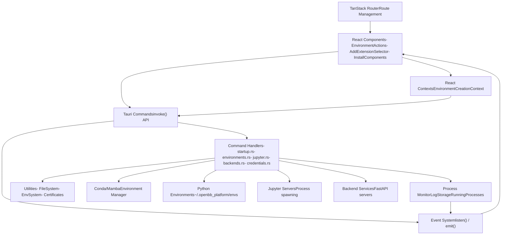
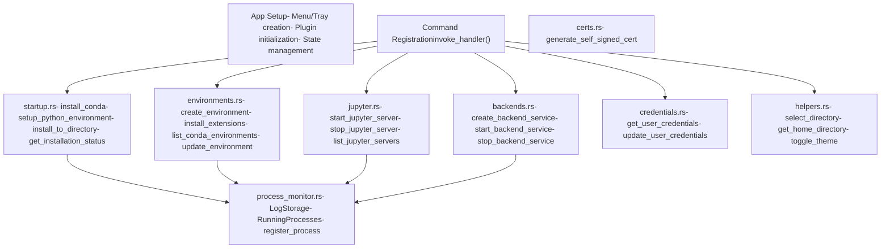
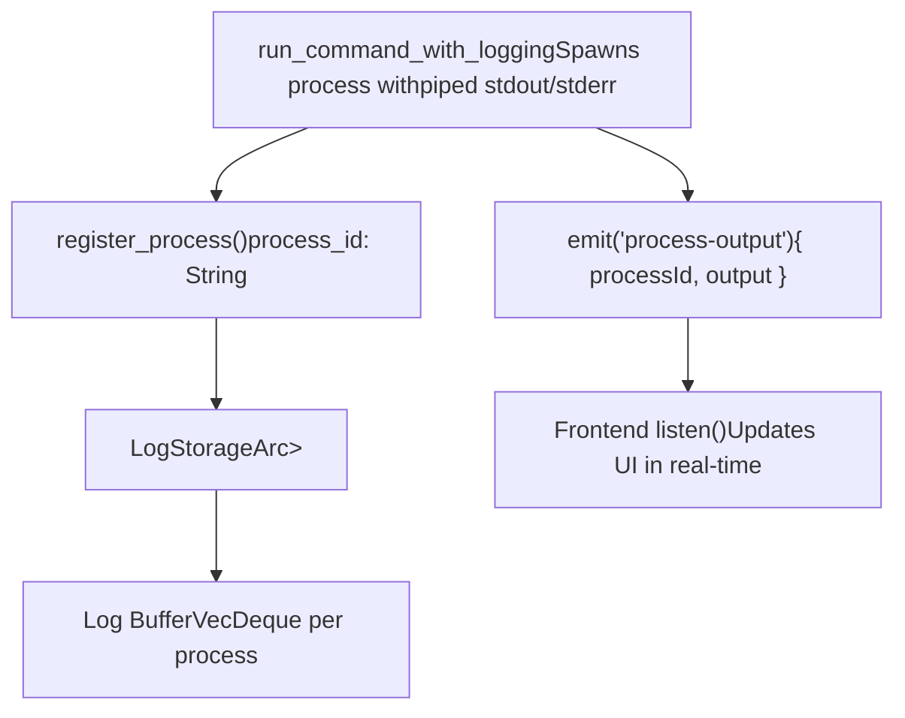
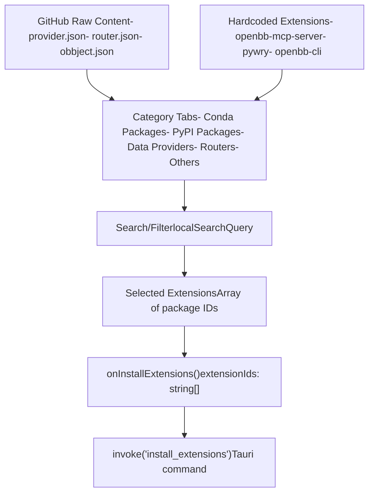
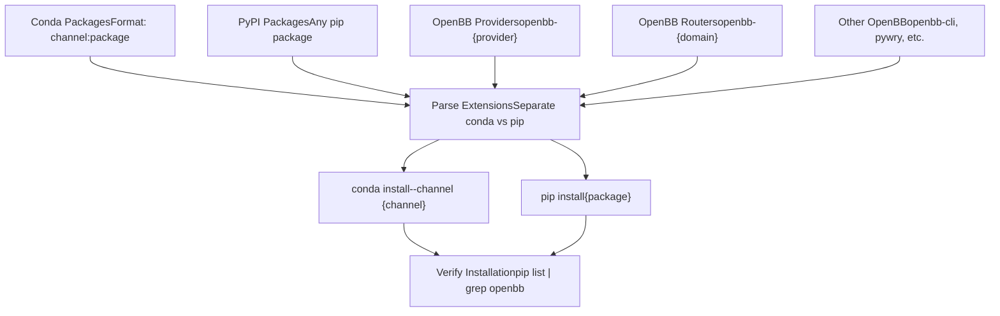
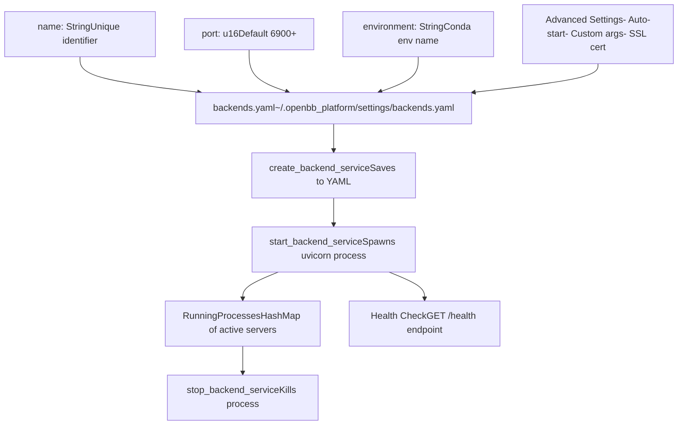

# Desktop Application

相关源文件

-   [desktop/Cargo.lock](https://github.com/OpenBB-finance/OpenBB/blob/dddc3b32/desktop/Cargo.lock)
-   [desktop/package-lock.json](https://github.com/OpenBB-finance/OpenBB/blob/dddc3b32/desktop/package-lock.json)
-   [desktop/package.json](https://github.com/OpenBB-finance/OpenBB/blob/dddc3b32/desktop/package.json)
-   [desktop/src-tauri/Cargo.toml](https://github.com/OpenBB-finance/OpenBB/blob/dddc3b32/desktop/src-tauri/Cargo.toml)
-   [desktop/src-tauri/src/main.rs](https://github.com/OpenBB-finance/OpenBB/blob/dddc3b32/desktop/src-tauri/src/main.rs)
-   [desktop/src-tauri/src/tauri\_handlers/environments.rs](https://github.com/OpenBB-finance/OpenBB/blob/dddc3b32/desktop/src-tauri/src/tauri_handlers/environments.rs)
-   [desktop/src-tauri/src/tauri\_handlers/startup.rs](https://github.com/OpenBB-finance/OpenBB/blob/dddc3b32/desktop/src-tauri/src/tauri_handlers/startup.rs)
-   [desktop/src-tauri/tauri.conf.json](https://github.com/OpenBB-finance/OpenBB/blob/dddc3b32/desktop/src-tauri/tauri.conf.json)
-   [desktop/src/components/AddExtensionSelector.tsx](https://github.com/OpenBB-finance/OpenBB/blob/dddc3b32/desktop/src/components/AddExtensionSelector.tsx)
-   [desktop/src/components/InstallComponents.tsx](https://github.com/OpenBB-finance/OpenBB/blob/dddc3b32/desktop/src/components/InstallComponents.tsx)
-   [desktop/src/main.tsx](https://github.com/OpenBB-finance/OpenBB/blob/dddc3b32/desktop/src/main.tsx)
-   [desktop/src/routes/environments.tsx](https://github.com/OpenBB-finance/OpenBB/blob/dddc3b32/desktop/src/routes/environments.tsx)
-   [desktop/src/routes/installation-progress.tsx](https://github.com/OpenBB-finance/OpenBB/blob/dddc3b32/desktop/src/routes/installation-progress.tsx)
-   [desktop/src/tests/setup.ts](https://github.com/OpenBB-finance/OpenBB/blob/dddc3b32/desktop/src/tests/setup.ts)
-   [frontend-components/plotly/package-lock.json](https://github.com/OpenBB-finance/OpenBB/blob/dddc3b32/frontend-components/plotly/package-lock.json)
-   [frontend-components/plotly/package.json](https://github.com/OpenBB-finance/OpenBB/blob/dddc3b32/frontend-components/plotly/package.json)
-   [frontend-components/tables/package-lock.json](https://github.com/OpenBB-finance/OpenBB/blob/dddc3b32/frontend-components/tables/package-lock.json)
-   [frontend-components/tables/package.json](https://github.com/OpenBB-finance/OpenBB/blob/dddc3b32/frontend-components/tables/package.json)
-   [openbb\_platform/obbject\_extensions/charting/openbb\_charting/core/table.html](https://github.com/OpenBB-finance/OpenBB/blob/dddc3b32/openbb_platform/obbject_extensions/charting/openbb_charting/core/table.html)

OpenBB Desktop Application 是一个使用 Tauri (Rust + React) 构建的跨平台桌面工具，它提供了一个图形界面，用于管理 Python 环境、安装 OpenBB 扩展、运行 API 后端服务器以及启动 Jupyter 笔记本。它是 OpenBB Platform 生态系统的主要环境管理和开发工具，负责处理 conda 环境创建、包安装和服务器编排，无需用户直接与命令行工具交互。

有关桌面应用程序管理的 REST API 服务器的信息，请参阅 [REST API Server](/OpenBB-finance/OpenBB/5.2-rest-api-server)。有关连接到这些本地后端的 OpenBB Workspace，请参阅 [OpenBB Workspace Integration](/OpenBB-finance/OpenBB/5.3-openbb-workspace-integration)。

## 架构概览

桌面应用程序遵循混合架构模式，其中 Rust 处理系统级操作（进程管理、文件系统访问、conda 操作），而 React 提供用户界面。前端和后端之间的通信通过 Tauri 的命令系统进行，该系统将 Rust 函数公开为异步 JavaScript API。


**来源**：[desktop/package.json1-78](https://github.com/OpenBB-finance/OpenBB/blob/dddc3b32/desktop/package.json#L1-L78) [desktop/src-tauri/Cargo.toml1-78](https://github.com/OpenBB-finance/OpenBB/blob/dddc3b32/desktop/src-tauri/Cargo.toml#L1-L78) [desktop/src-tauri/src/main.rs1-300](https://github.com/OpenBB-finance/OpenBB/blob/dddc3b32/desktop/src-tauri/src/main.rs#L1-L300) [desktop/src/main.tsx1-39](https://github.com/OpenBB-finance/OpenBB/blob/dddc3b32/desktop/src/main.tsx#L1-L39)

## 技术栈

| 组件 | 技术 | 用途 |
| --- | --- | --- |
| **应用框架** | Tauri 2.9.6 | 跨平台桌面应用框架 |
| **后端运行时** | Rust 1.90.0 | 系统操作、进程管理 |
| **前端框架** | React 18.3.1 | 用户界面 |
| **构建工具** | Vite 7.2.2 | 前端构建工具 |
| **路由** | TanStack Router 1.131.27 | 客户端路由 |
| **UI 组件** | @openbb/ui-pro 0.6.10 | 共享 UI 组件库 |
| **异步运行时** | Tokio 1.47.1 | Rust 异步操作 |
| **HTTP 客户端** | reqwest 0.12.23 | 来自 Rust 的 API 调用 |
| **状态管理** | React Hooks | 组件状态 |

**来源**：[desktop/package.json16-72](https://github.com/OpenBB-finance/OpenBB/blob/dddc3b32/desktop/package.json#L16-L72) [desktop/src-tauri/Cargo.toml16-50](https://github.com/OpenBB-finance/OpenBB/blob/dddc3b32/desktop/src-tauri/Cargo.toml#L16-L50)

## Rust 后端架构

### 命令处理程序结构

Rust 后端通过组织成模块的 Tauri 命令处理程序公开功能。每个模块处理特定领域的操作。


**来源**：[desktop/src-tauri/src/main.rs20-50](https://github.com/OpenBB-finance/OpenBB/blob/dddc3b32/desktop/src-tauri/src/main.rs#L20-L50) [desktop/src-tauri/src/tauri\_handlers/startup.rs1-30](https://github.com/OpenBB-finance/OpenBB/blob/dddc3b32/desktop/src-tauri/src/tauri_handlers/startup.rs#L1-L30) [desktop/src-tauri/src/tauri\_handlers/environments.rs1-157](https://github.com/OpenBB-finance/OpenBB/blob/dddc3b32/desktop/src-tauri/src/tauri_handlers/environments.rs#L1-L157)

### 进程监控系统

应用程序使用集中的日志系统跟踪生成的进程（conda 命令、pip 安装、Jupyter 服务器、后端 API）。这实现了向前端的实时日志流式传输和进程生命周期管理。


**来源**：[desktop/src-tauri/src/main.rs74-92](https://github.com/OpenBB-finance/OpenBB/blob/dddc3b32/desktop/src-tauri/src/main.rs#L74-L92) [desktop/src-tauri/src/tauri\_handlers/environments.rs14-105](https://github.com/OpenBB-finance/OpenBB/blob/dddc3b32/desktop/src-tauri/src/tauri_handlers/environments.rs#L14-L105)

## React 前端架构

### 路由结构

前端使用 TanStack Router 进行基于文件的路由。关键路由处理应用程序生命周期的不同阶段。

| 路由 | 组件 | 用途 |
| --- | --- | --- |
| `/` | index.tsx | 登录/主屏幕 |
| `/installation-progress` | installation-progress.tsx | 初始安装向导 |
| `/environments` | environments.tsx | 环境管理 UI |
| `/backends` | (可能在 routes 中) | 后端服务管理 |

**来源**：[desktop/src/main.tsx17-27](https://github.com/OpenBB-finance/OpenBB/blob/dddc3b32/desktop/src/main.tsx#L17-L27) [desktop/src/routes/installation-progress.tsx1-10](https://github.com/OpenBB-finance/OpenBB/blob/dddc3b32/desktop/src/routes/installation-progress.tsx#L1-L10) [desktop/src/routes/environments.tsx1-15](https://github.com/OpenBB-finance/OpenBB/blob/dddc3b32/desktop/src/routes/environments.tsx#L1-L15)

### 关键组件

**AddExtensionSelector 组件**

提供了一个分类界面，用于选择和安装 OpenBB 扩展、conda 包和 PyPI 包。从 GitHub 获取扩展元数据。


**来源**：[desktop/src/components/AddExtensionSelector.tsx1-50](https://github.com/OpenBB-finance/OpenBB/blob/dddc3b32/desktop/src/components/AddExtensionSelector.tsx#L1-L50) [desktop/src/components/AddExtensionSelector.tsx237-262](https://github.com/OpenBB-finance/OpenBB/blob/dddc3b32/desktop/src/components/AddExtensionSelector.tsx#L237-L262)

**InstallComponents**

为安装流程提供可重用的 UI 组件，包括 Python 版本选择和扩展选择。

-   `PythonVersionSelector`：用于选择 Python 3.10-3.14 的单选按钮组
-   `ExtensionSelector`：完整的扩展浏览和选择界面

**来源**：[desktop/src/components/InstallComponents.tsx1-104](https://github.com/OpenBB-finance/OpenBB/blob/dddc3b32/desktop/src/components/InstallComponents.tsx#L1-L104) [desktop/src/components/InstallComponents.tsx106-258](https://github.com/OpenBB-finance/OpenBB/blob/dddc3b32/desktop/src/components/InstallComponents.tsx#L106-L258)

## 环境管理

桌面应用程序在 `~/.openbb_platform/envs/` 中管理 conda/mamba 环境。每个环境都包含一个 Python 解释器和已安装的 OpenBB 包。

### 环境创建流程

> **[Mermaid sequence]**
> *(图表结构无法解析)*

**来源**：[desktop/src/routes/environments.tsx1-200](https://github.com/OpenBB-finance/OpenBB/blob/dddc3b32/desktop/src/routes/environments.tsx#L1-L200) [desktop/src-tauri/src/tauri\_handlers/environments.rs118-300](https://github.com/OpenBB-finance/OpenBB/blob/dddc3b32/desktop/src-tauri/src/tauri_handlers/environments.rs#L118-L300)

### 扩展安装

可以将扩展安装到现有环境中。系统支持：

-   **OpenBB Providers**：数据提供程序（例如 `openbb-fmp`, `openbb-fred`）
-   **OpenBB Routers**：API 扩展（例如 `openbb-economy`, `openbb-equity`）
-   **OBBject Extensions**：输出修饰符（例如 `openbb-charting`）
-   **Conda Packages**：具有频道支持的系统依赖项
-   **PyPI Packages**：任何可通过 pip 安装的包


**来源**：[desktop/src/components/AddExtensionSelector.tsx22-48](https://github.com/OpenBB-finance/OpenBB/blob/dddc3b32/desktop/src/components/AddExtensionSelector.tsx#L22-L48) [desktop/src-tauri/src/tauri\_handlers/environments.rs400-600](https://github.com/OpenBB-finance/OpenBB/blob/dddc3b32/desktop/src-tauri/src/tauri_handlers/environments.rs#L400-L600)

### 环境操作

`EnvironmentActions` 组件提供了对现有环境的操作：

| 操作 | Tauri 命令 | 描述 |
| --- | --- | --- |
| **Start Backend** | `create_backend_service` | 创建并启动 FastAPI 服务器 |
| **Start Jupyter** | `start_jupyter_server` | 启动 Jupyter Lab |
| **Update** | `update_environment` | 更新所有包 |
| **Add Extensions** | `install_extensions` | 安装新包 |
| **Remove Extension** | `remove_extension` | 卸载包 |
| **Delete** | `remove_environment` | 删除整个环境 |

**来源**：[desktop/src/components/EnvironmentActions.tsx1-100](https://github.com/OpenBB-finance/OpenBB/blob/dddc3b32/desktop/src/components/EnvironmentActions.tsx#L1-L100) (已引用但未完整提供)

## 后端服务管理

桌面应用程序可以创建多个 "backend services" (后端服务) —— 在不同端口上以不同配置运行的 OpenBB Platform API 服务器实例。每个后端服务都绑定到特定的 conda 环境。

### 后端服务结构


**来源**：[desktop/src-tauri/src/tauri\_handlers/backends.rs1-300](https://github.com/OpenBB-finance/OpenBB/blob/dddc3b32/desktop/src-tauri/src/tauri_handlers/backends.rs#L1-L300) (在 main.rs 中引用)，[desktop/src-tauri/src/main.rs41-45](https://github.com/OpenBB-finance/OpenBB/blob/dddc3b32/desktop/src-tauri/src/main.rs#L41-L45)

### 默认后端创建

在首次安装时，系统会自动创建一个名为 "default" 的默认后端服务，指向 6900 端口上的 base 环境。这确保了即时可用性。

**来源**：[desktop/src-tauri/src/tauri\_handlers/startup.rs500-600](https://github.com/OpenBB-finance/OpenBB/blob/dddc3b32/desktop/src-tauri/src/tauri_handlers/startup.rs#L500-L600) (在 main.rs 第 23 行引用)

## Jupyter 集成

桌面应用程序可以为每个 conda 环境启动 Jupyter Lab 服务器，从而实现基于笔记本的开发。

### Jupyter 服务器管理

> **[Mermaid sequence]**
> *(图表结构无法解析)*

**关键函数**：

-   `start_jupyter_server(env_name: String)`：在环境中生成 Jupyter Lab
-   `stop_jupyter_server(env_name: String)`：终止 Jupyter 进程
-   `list_jupyter_servers()`：返回所有正在运行的 Jupyter 实例
-   `check_jupyter_server(env_name: String)`：轮询服务器健康状况

**来源**：[desktop/src-tauri/src/main.rs33-37](https://github.com/OpenBB-finance/OpenBB/blob/dddc3b32/desktop/src-tauri/src/main.rs#L33-L37) [desktop/src-tauri/src/tauri\_handlers/jupyter.rs1-200](https://github.com/OpenBB-finance/OpenBB/blob/dddc3b32/desktop/src-tauri/src/tauri_handlers/jupyter.rs#L1-L200) (引用)

## 安装流程

桌面应用程序包含一个首次运行安装向导，可下载并安装 conda/mamba，创建基础 Python 环境并安装核心 OpenBB 包。

### 安装阶段

> **[Mermaid stateDiagram]**
> *(图表结构无法解析)*

### 安装状态管理

Rust 后端在 `INSTALLATION_STATE` 全局互斥锁中维护安装状态：

```
pub struct InstallationState {    pub is_downloading: bool,    pub is_installing: bool,    pub is_configuring: bool,    pub is_complete: bool,    pub message: String,}
```
前端轮询 `get_installation_status()` 命令并监听 `process-output` 事件以进行实时进度更新。

**来源**：[desktop/src/routes/installation-progress.tsx10-100](https://github.com/OpenBB-finance/OpenBB/blob/dddc3b32/desktop/src/routes/installation-progress.tsx#L10-L100) [desktop/src-tauri/src/tauri\_handlers/startup.rs15-130](https://github.com/OpenBB-finance/OpenBB/blob/dddc3b32/desktop/src-tauri/src/tauri_handlers/startup.rs#L15-L130)

### Conda 安装

如果在系统 PATH 中未找到 conda/mamba，应用程序将下载 Miniforge（一个以 conda-forge 为默认频道的最小 conda 发行版）：

1.  **检测**：在 PATH 中检查 `conda` 或 `mamba`
2.  **下载**：从 GitHub 获取平台特定的 Miniforge 安装程序
3.  **安装**：运行静默安装程序到 `~/.openbb_platform/conda`
4.  **验证**：测试 conda/mamba 可用性

**来源**：[desktop/src-tauri/src/tauri\_handlers/startup.rs200-400](https://github.com/OpenBB-finance/OpenBB/blob/dddc3b32/desktop/src-tauri/src/tauri_handlers/startup.rs#L200-L400)

## 更新系统

桌面应用程序使用 Tauri 的插件更新程序 (plugin-updater) 自动检查新版本并应用更新。

### 更新配置

-   **更新端点**：`https://github.com/OpenBB-finance/OpenBB/releases/download/ODP/latest.json`
-   **公钥**：嵌入在 `tauri.conf.json` 中用于签名验证
-   **检查频率**：在启动时以及通过手动的 "Check for Updates" 菜单项进行检查

**来源**：[desktop/src-tauri/tauri.conf.json58-64](https://github.com/OpenBB-finance/OpenBB/blob/dddc3b32/desktop/src-tauri/tauri.conf.json#L58-L64) [desktop/src-tauri/src/main.rs94-150](https://github.com/OpenBB-finance/OpenBB/blob/dddc3b32/desktop/src-tauri/src/main.rs#L94-L150)

## 配置与存储

应用程序将配置存储在平台特定的用户数据目录中：

| 平台 | 基路径 |
| --- | --- |
| **macOS** | `~/Library/Application Support/co.openbb.platform/` |
| **Windows** | `%APPDATA%\co.openbb.platform\` |
| **Linux** | `~/.local/share/co.openbb.platform/` |

### 关键文件

| 文件 | 位置 | 用途 |
| --- | --- | --- |
| `backends.yaml` | `{settings}/backends.yaml` | 后端服务定义 |
| `user_settings.json` | `~/.openbb_platform/user_settings.json` | OpenBB 用户凭据 |
| `system_settings.json` | `~/.openbb_platform/system_settings.json` | OpenBB 系统配置 |
| 环境 YAML | `~/.openbb_platform/envs/{name}/env.yaml` | 每个环境的元数据 |

**来源**：[desktop/src-tauri/src/main.rs51-54](https://github.com/OpenBB-finance/OpenBB/blob/dddc3b32/desktop/src-tauri/src/main.rs#L51-L54) [desktop/src-tauri/src/tauri\_handlers/environments.rs150-200](https://github.com/OpenBB-finance/OpenBB/blob/dddc3b32/desktop/src-tauri/src/tauri_handlers/environments.rs#L150-L200)

## 开发设置

### 前提条件

-   Node.js 18+
-   Rust 1.90+
-   平台特定工具（macOS 上的 Xcode，Windows 上的 Visual Studio，Linux 上的 build-essential）

### 构建命令

```
# 安装依赖npm install # 开发模式 (热重载)npm run dev # 生产构建npm run build # Tauri 特定命令npm run tauri dev    # 在 Tauri 开发模式下运行npm run tauri build  # 创建可分发包
```
**来源**：[desktop/package.json7-14](https://github.com/OpenBB-finance/OpenBB/blob/dddc3b32/desktop/package.json#L7-L14)

### 项目结构

```
desktop/
├── src/                     # React 前端
│   ├── routes/             # TanStack Router 路由
│   ├── components/         # React 组件
│   ├── contexts/           # React 上下文
│   ├── tests/             # Vitest 测试
│   └── main.tsx           # 入口点
├── src-tauri/              # Rust 后端
│   ├── src/
│   │   ├── main.rs        # Tauri 设置
│   │   ├── tauri_handlers/ # 命令处理程序
│   │   ├── utils/         # 工具
│   │   └── uninstall.rs   # 卸载逻辑
│   ├── Cargo.toml         # Rust 依赖项
│   └── tauri.conf.json    # Tauri 配置
└── package.json            # Node 依赖项
```
**来源**：[desktop/package.json1-78](https://github.com/OpenBB-finance/OpenBB/blob/dddc3b32/desktop/package.json#L1-L78) [desktop/src-tauri/Cargo.toml1-78](https://github.com/OpenBB-finance/OpenBB/blob/dddc3b32/desktop/src-tauri/Cargo.toml#L1-L78)

## 测试

应用程序使用 Vitest 进行 React 组件测试，使用 jsdom 进行 DOM 模拟。

-   **测试设置**：[desktop/src/tests/setup.ts1-57](https://github.com/OpenBB-finance/OpenBB/blob/dddc3b32/desktop/src/tests/setup.ts#L1-L57)
-   **模拟依赖项**：`@openbb/ui-pro`, `ResizeObserver`, `localStorage`
-   **测试命令**：`npm run test`

**来源**：[desktop/package.json12](https://github.com/OpenBB-finance/OpenBB/blob/dddc3b32/desktop/package.json#L12-L12) [desktop/src/tests/setup.ts1-57](https://github.com/OpenBB-finance/OpenBB/blob/dddc3b32/desktop/src/tests/setup.ts#L1-L57)
