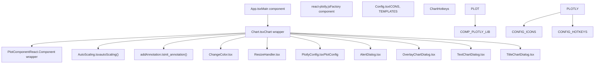
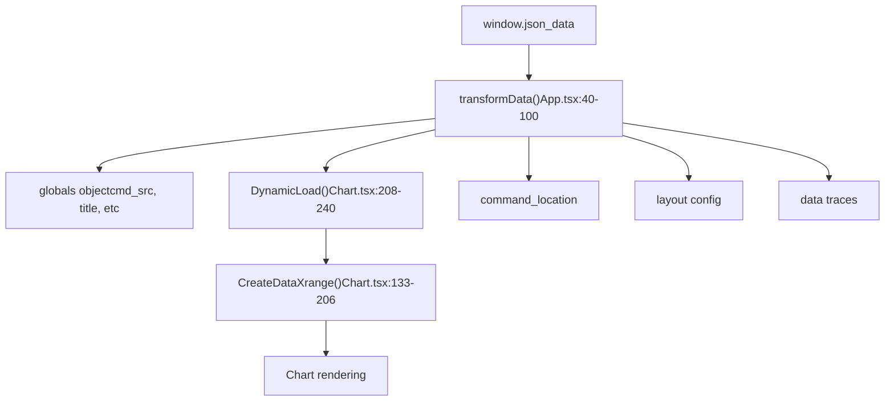
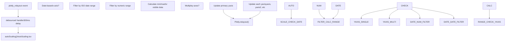
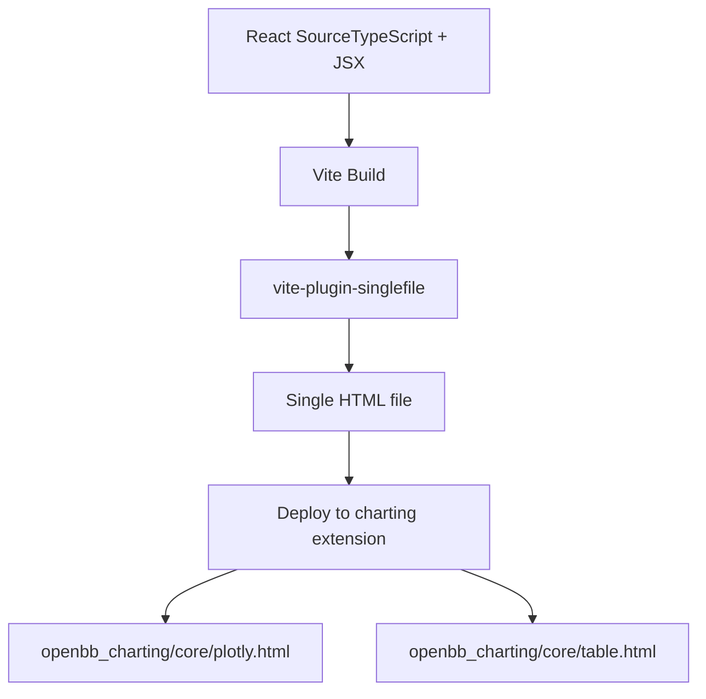

# Visualization Components

相关源文件

-   [desktop/Cargo.lock](https://github.com/OpenBB-finance/OpenBB/blob/dddc3b32/desktop/Cargo.lock)
-   [desktop/package-lock.json](https://github.com/OpenBB-finance/OpenBB/blob/dddc3b32/desktop/package-lock.json)
-   [desktop/package.json](https://github.com/OpenBB-finance/OpenBB/blob/dddc3b32/desktop/package.json)
-   [desktop/src-tauri/Cargo.toml](https://github.com/OpenBB-finance/OpenBB/blob/dddc3b32/desktop/src-tauri/Cargo.toml)
-   [desktop/src-tauri/src/main.rs](https://github.com/OpenBB-finance/OpenBB/blob/dddc3b32/desktop/src-tauri/src/main.rs)
-   [desktop/src-tauri/src/tauri\_handlers/environments.rs](https://github.com/OpenBB-finance/OpenBB/blob/dddc3b32/desktop/src-tauri/src/tauri_handlers/environments.rs)
-   [desktop/src-tauri/src/tauri\_handlers/startup.rs](https://github.com/OpenBB-finance/OpenBB/blob/dddc3b32/desktop/src-tauri/src/tauri_handlers/startup.rs)
-   [desktop/src-tauri/tauri.conf.json](https://github.com/OpenBB-finance/OpenBB/blob/dddc3b32/desktop/src-tauri/tauri.conf.json)
-   [desktop/src/components/AddExtensionSelector.tsx](https://github.com/OpenBB-finance/OpenBB/blob/dddc3b32/desktop/src/components/AddExtensionSelector.tsx)
-   [desktop/src/components/InstallComponents.tsx](https://github.com/OpenBB-finance/OpenBB/blob/dddc3b32/desktop/src/components/InstallComponents.tsx)
-   [desktop/src/main.tsx](https://github.com/OpenBB-finance/OpenBB/blob/dddc3b32/desktop/src/main.tsx)
-   [desktop/src/routes/environments.tsx](https://github.com/OpenBB-finance/OpenBB/blob/dddc3b32/desktop/src/routes/environments.tsx)
-   [desktop/src/routes/installation-progress.tsx](https://github.com/OpenBB-finance/OpenBB/blob/dddc3b32/desktop/src/routes/installation-progress.tsx)
-   [desktop/src/tests/setup.ts](https://github.com/OpenBB-finance/OpenBB/blob/dddc3b32/desktop/src/tests/setup.ts)
-   [frontend-components/plotly/package-lock.json](https://github.com/OpenBB-finance/OpenBB/blob/dddc3b32/frontend-components/plotly/package-lock.json)
-   [frontend-components/plotly/package.json](https://github.com/OpenBB-finance/OpenBB/blob/dddc3b32/frontend-components/plotly/package.json)
-   [frontend-components/plotly/src/App.tsx](https://github.com/OpenBB-finance/OpenBB/blob/dddc3b32/frontend-components/plotly/src/App.tsx)
-   [frontend-components/plotly/src/components/Chart.tsx](https://github.com/OpenBB-finance/OpenBB/blob/dddc3b32/frontend-components/plotly/src/components/Chart.tsx)
-   [frontend-components/plotly/src/components/Config.tsx](https://github.com/OpenBB-finance/OpenBB/blob/dddc3b32/frontend-components/plotly/src/components/Config.tsx)
-   [frontend-components/plotly/src/components/Dialogs/AlertDialog.tsx](https://github.com/OpenBB-finance/OpenBB/blob/dddc3b32/frontend-components/plotly/src/components/Dialogs/AlertDialog.tsx)
-   [frontend-components/plotly/src/components/PlotlyConfig.tsx](https://github.com/OpenBB-finance/OpenBB/blob/dddc3b32/frontend-components/plotly/src/components/PlotlyConfig.tsx)
-   [frontend-components/tables/package-lock.json](https://github.com/OpenBB-finance/OpenBB/blob/dddc3b32/frontend-components/tables/package-lock.json)
-   [frontend-components/tables/package.json](https://github.com/OpenBB-finance/OpenBB/blob/dddc3b32/frontend-components/tables/package.json)
-   [openbb\_platform/obbject\_extensions/charting/openbb\_charting/core/chart\_style.py](https://github.com/OpenBB-finance/OpenBB/blob/dddc3b32/openbb_platform/obbject_extensions/charting/openbb_charting/core/chart_style.py)
-   [openbb\_platform/obbject\_extensions/charting/openbb\_charting/core/plotly.html](https://github.com/OpenBB-finance/OpenBB/blob/dddc3b32/openbb_platform/obbject_extensions/charting/openbb_charting/core/plotly.html)
-   [openbb\_platform/obbject\_extensions/charting/openbb\_charting/core/table.html](https://github.com/OpenBB-finance/OpenBB/blob/dddc3b32/openbb_platform/obbject_extensions/charting/openbb_charting/core/table.html)

本页面记录了基于 React 的独立可视化组件，这些组件为 OpenBB 数据渲染交互式图表和表格。这些组件使用 OBBject JSON 数据，并提供主题设置、注释、自动缩放和导出等功能。有关这些组件如何集成到 OpenBB Workspace 小部件系统的信息，请参阅 [Widget System](/OpenBB-finance/OpenBB/5.4-widget-system)。有关提供这些组件的 Python 图表扩展的详细信息，请参阅图表扩展文档。

## 架构概览

可视化组件是使用 TypeScript 构建的独立 React 应用程序，并打包为单个 HTML 文件。它们嵌入在 Python 图表扩展中，可以在浏览器、Jupyter 笔记本、桌面应用或 OpenBB Workspace 中渲染。

### 组件结构与数据流

```mermaid
flowchart TD
    OBB["OBBject"]
    CHART_EXT["openbb_charting extension"]
    STYLE_PY["chart_style.pyChartStyle class"]
    PLOTLY_HTML["plotly.htmlCompiled single-file app"]
    TABLE_HTML["table.htmlCompiled single-file app"]
    PLOTLY_SRC["frontend-components/plotly/"]
    TABLE_SRC["frontend-components/tables/"]
    APP_TSX["App.tsx"]
    CHART_TSX["Chart.tsx"]
    VITE["Vite bundler"]
    VITE_PLUGIN["vite-plugin-singlefile"]
    BROWSER["Web Browser"]
    JUPYTER["Jupyter Notebook"]
    WORKSPACE["OpenBB Workspace"]
    DESKTOP["Desktop App"]

    OBB --> CHART_EXT
    CHART --> EXT_STYLE_PY
    CHART --> EXT_PLOTLY_HTML
    CHART --> EXT_TABLE_HTML
    PLOTLY --> SRC_APP_TSX
    APP --> TSX_CHART_TSX
    PLOTLY --> SRC_VITE
    TABLE --> SRC_VITE
    VITE --> VITE_PLUGIN
    VITE --> PLUGIN_PLOTLY_HTML
    VITE --> PLUGIN_TABLE_HTML
    PLOTLY --> HTML_BROWSER
    PLOTLY --> HTML_JUPYTER
    PLOTLY --> HTML_WORKSPACE
    PLOTLY --> HTML_DESKTOP
    TABLE --> HTML_BROWSER
    TABLE --> HTML_JUPYTER
    TABLE --> HTML_WORKSPACE
    TABLE --> HTML_DESKTOP
    OBB --> PLOTLY_HTML
    OBB --> TABLE_HTML
```


**来源：** [openbb\_platform/obbject\_extensions/charting/openbb\_charting/core/plotly.html1-50](https://github.com/OpenBB-finance/OpenBB/blob/dddc3b32/openbb_platform/obbject_extensions/charting/openbb_charting/core/plotly.html#L1-L50) [frontend-components/plotly/src/App.tsx1-143](https://github.com/OpenBB-finance/OpenBB/blob/dddc3b32/frontend-components/plotly/src/App.tsx#L1-L143) [frontend-components/plotly/package.json1-48](https://github.com/OpenBB-finance/OpenBB/blob/dddc3b32/frontend-components/plotly/package.json#L1-L48)

### 技术栈

| 组件 | 技术 | 用途 |
| --- | --- | --- |
| **UI 框架** | React 18, TypeScript | 组件开发 |
| **图表库** | Plotly.js, react-plotly.js | 交互式可视化 |
| **表格库** | TanStack Table v8, TanStack Virtual | 高性能数据网格 |
| **样式** | Tailwind CSS, Radix UI primitives | 主题和 UI 组件 |
| **构建工具** | Vite 7, vite-plugin-singlefile | 单 HTML 文件编译 |
| **状态管理** | React hooks (useState, useEffect, useCallback) | 组件状态 |

**来源：** [frontend-components/plotly/package.json10-23](https://github.com/OpenBB-finance/OpenBB/blob/dddc3b32/frontend-components/plotly/package.json#L10-L23) [frontend-components/tables/package.json13-38](https://github.com/OpenBB-finance/OpenBB/blob/dddc3b32/frontend-components/tables/package.json#L13-L38)

## Plotly 图表组件

Plotly 组件 (`frontend-components/plotly/`) 渲染交互式金融图表，支持 OHLC 数据、时间序列、散点图和自定义注释。

### 组件层级


**来源：** [frontend-components/plotly/src/App.tsx20-143](https://github.com/OpenBB-finance/OpenBB/blob/dddc3b32/frontend-components/plotly/src/App.tsx#L20-L143) [frontend-components/plotly/src/components/Chart.tsx253-307](https://github.com/OpenBB-finance/OpenBB/blob/dddc3b32/frontend-components/plotly/src/components/Chart.tsx#L253-L307)

### 数据加载与处理

组件在生产模式下通过 `window.json_data` 全局变量接收 JSON 数据。数据转换流水线准备与 Plotly 兼容的图表配置：


`DynamicLoad` 函数通过基于可见 x 轴范围过滤数据点来处理大型数据集。对于超过 2000 个点的数据集，它仅渲染可见子集以提高性能。

**来源：** [frontend-components/plotly/src/App.tsx40-100](https://github.com/OpenBB-finance/OpenBB/blob/dddc3b32/frontend-components/plotly/src/App.tsx#L40-L100) [frontend-components/plotly/src/components/Chart.tsx208-240](https://github.com/OpenBB-finance/OpenBB/blob/dddc3b32/frontend-components/plotly/src/components/Chart.tsx#L208-L240) [frontend-components/plotly/src/components/Chart.tsx133-206](https://github.com/OpenBB-finance/OpenBB/blob/dddc3b32/frontend-components/plotly/src/components/Chart.tsx#L133-L206)

### 自动缩放功能

自动缩放系统在缩放或平移时，根据可见数据动态调整 y 轴范围：


按钮状态通过 [frontend-components/plotly/src/components/Chart.tsx381-398](https://github.com/OpenBB-finance/OpenBB/blob/dddc3b32/frontend-components/plotly/src/components/Chart.tsx#L381-L398) 处的 `button_pressed` 函数进行管理，在自动缩放激活时提供视觉反馈。

**来源：** [frontend-components/plotly/src/components/Chart.tsx421-471](https://github.com/OpenBB-finance/OpenBB/blob/dddc3b32/frontend-components/plotly/src/components/Chart.tsx#L421-L471) [frontend-components/plotly/src/components/AutoScaling.tsx1-200](https://github.com/OpenBB-finance/OpenBB/blob/dddc3b32/frontend-components/plotly/src/components/AutoScaling.tsx#L1-L200)

### 注释系统

注释系统允许用户向图表中添加文本、线条和形状：

| 注释类型 | 触发方式 | 实现 |
| --- | --- | --- |
| **点注释** | 点击数据点 | addAnnotation.ts 中的 `init_annotation()` |
| **文本标签** | TextChartDialog | 带有自定义文本的定位注释 |
| **绘制形状** | 配置模式栏按钮 | Plotly 内置的形状绘制 |
| **OHLC 注释** | 蜡烛图的特殊处理 | `ohlcAnnotation` 状态 |

注释点击处理程序定义在 [frontend-components/plotly/src/components/Chart.tsx326-345](https://github.com/OpenBB-finance/OpenBB/blob/dddc3b32/frontend-components/plotly/src/components/Chart.tsx#L326-L345) 处，它委托给 `init_annotation` 进行处理。

**来源：** [frontend-components/plotly/src/utils/addAnnotation.ts1-200](https://github.com/OpenBB-finance/OpenBB/blob/dddc3b32/frontend-components/plotly/src/utils/addAnnotation.ts#L1-L200) [frontend-components/plotly/src/components/Chart.tsx311-324](https://github.com/OpenBB-finance/OpenBB/blob/dddc3b32/frontend-components/plotly/src/components/Chart.tsx#L311-L324) [frontend-components/plotly/src/components/Dialogs/TextChartDialog.tsx1-150](https://github.com/OpenBB-finance/OpenBB/blob/dddc3b32/frontend-components/plotly/src/components/Dialogs/TextChartDialog.tsx#L1-L150)

### 主题系统

主题管理通过状态和 localStorage 处理：

```
// 主题状态管理const [darkMode, setDarkMode] = useState(true);const [changeTheme, setChangeTheme] = useState(false); // Config.tsx 中定义的模板DARK_CHARTS_TEMPLATE: plotly template objectLIGHT_CHARTS_TEMPLATE: plotly template object
```
主题切换不仅会更新绘图布局，还会将偏好持久化到 localStorage 以供后续会话使用。

**来源：** [frontend-components/plotly/src/components/Chart.tsx290-292](https://github.com/OpenBB-finance/OpenBB/blob/dddc3b32/frontend-components/plotly/src/components/Chart.tsx#L290-L292) [frontend-components/plotly/src/components/Config.tsx1-300](https://github.com/OpenBB-finance/OpenBB/blob/dddc3b32/frontend-components/plotly/src/components/Config.tsx#L1-L300)

## 表格组件

表格组件 (`frontend-components/tables/`) 提供具有排序、过滤、列大小调整和虚拟化功能的高性能数据网格。

### 表格架构

```mermaid
flowchart TD
    TABLE_APP["App.tsxTable app entry"]
    TABLE_COMP["Table component"]
    TANSTACK["@tanstack/react-tableCore table logic"]
    VIRTUAL["@tanstack/react-virtualRow virtualization"]
    SORT["Column sorting"]
    FILTER["Column filtering"]
    RESIZE["Column resizing"]
    CONTEXT["Context menu"]
    SELECT["Row selection"]
    RADIX_SELECT["@radix-ui/react-select"]
    RADIX_MENU["@radix-ui/react-context-menu"]
    RADIX_DIALOG["@radix-ui/react-dialog"]
    RADIX_TOAST["@radix-ui/react-toast"]

    TABLE --> APP_TABLE_COMP
    TABLE --> COMP_TANSTACK
    TABLE --> COMP_VIRTUAL
    TANSTACK --> SORT
    TANSTACK --> FILTER
    TANSTACK --> RESIZE
    TABLE --> COMP_CONTEXT
    TABLE --> COMP_SELECT
    TABLE --> COMP_RADIX_SELECT
    TABLE --> COMP_RADIX_MENU
    TABLE --> COMP_RADIX_DIALOG
    TABLE --> COMP_RADIX_TOAST
```


**来源：** [frontend-components/tables/package.json13-38](https://github.com/OpenBB-finance/OpenBB/blob/dddc3b32/frontend-components/tables/package.json#L13-L38)

### 关键表格功能

| 功能 | 实现 | 描述 |
| --- | --- | --- |
| **虚拟化** | `@tanstack/react-virtual` | 仅渲染可见行以提高性能 |
| **排序** | TanStack Table 排序 API | 带有排序指示器的多列排序 |
| **过滤** | `@tanstack/match-sorter-utils` | 模糊文本匹配，实现快速过滤 |
| **列大小调整** | TanStack Table 列大小调整 | 拖动列边界以调整大小 |
| **上下文菜单** | `@radix-ui/react-context-menu` | 用于行操作的右键菜单 |
| **导出** | `dom-to-image` 库 | 导出为 PNG，复制到剪贴板 |
| **图表集成** | `plotly.js`, `react-plotly.js` | 在表格单元格中嵌入迷你图表 |

表格组件还包括使用 `react-dnd` 和 `react-dnd-html5-backend` 进行的拖放列重排。

**来源：** [frontend-components/tables/package.json20-35](https://github.com/OpenBB-finance/OpenBB/blob/dddc3b32/frontend-components/tables/package.json#L20-L35)

## 构建系统与集成

这两个可视化组件都使用 Vite 及专门的插件来编译为单个 HTML 文件：

### 构建过程


**构建命令：**

```
// frontend-components/plotly/package.json{  "scripts": {    "dev": "vite",    "build": "vite build",    "deploy": "npm run build && mv dist/index.html ../../openbb_platform/obbject_extensions/charting/openbb_charting/core/plotly.html"  }}
```
单文件输出包含了所有内联的 JavaScript、CSS 和资产，使组件完全自包含。

**来源：** [frontend-components/plotly/package.json5-10](https://github.com/OpenBB-finance/OpenBB/blob/dddc3b32/frontend-components/plotly/package.json#L5-L10) [frontend-components/tables/package.json6-11](https://github.com/OpenBB-finance/OpenBB/blob/dddc3b32/frontend-components/tables/package.json#L6-L11) [frontend-components/plotly/vite.config.ts1-50](https://github.com/OpenBB-finance/OpenBB/blob/dddc3b32/frontend-components/plotly/vite.config.ts#L1-L50)

### 与 Python 图表扩展的集成

编译后的 HTML 文件部署到 `openbb_charting` 扩展：

```
openbb_platform/
└── obbject_extensions/
    └── charting/
        └── openbb_charting/
            └── core/
                ├── plotly.html (从 frontend-components/plotly/ 编译)
                └── table.html (从 frontend-components/tables/ 编译)
```
[openbb\_platform/obbject\_extensions/charting/openbb\_charting/core/chart\_style.py22-300](https://github.com/OpenBB-finance/OpenBB/blob/dddc3b32/openbb_platform/obbject_extensions/charting/openbb_charting/core/chart_style.py#L22-L300) 处的 Python `ChartStyle` 类提供了样式配置，该配置会嵌入到传递给这些组件的 JSON 数据中。

**来源：** [openbb\_platform/obbject\_extensions/charting/openbb\_charting/core/plotly.html1-10](https://github.com/OpenBB-finance/OpenBB/blob/dddc3b32/openbb_platform/obbject_extensions/charting/openbb_charting/core/plotly.html#L1-L10) [openbb\_platform/obbject\_extensions/charting/openbb\_charting/core/table.html1-10](https://github.com/OpenBB-finance/OpenBB/blob/dddc3b32/openbb_platform/obbject_extensions/charting/openbb_charting/core/table.html#L1-L10) [openbb\_platform/obbject\_extensions/charting/openbb\_charting/core/chart\_style.py22-50](https://github.com/OpenBB-finance/OpenBB/blob/dddc3b32/openbb_platform/obbject_extensions/charting/openbb_charting/core/chart_style.py#L22-L50)

## 主题与样式

### 图表主题

Python 中的 `ChartStyle` 类提供了两个嵌入在图表数据中的 Plotly 模板：

| 模板 | 颜色 | 用法 |
| --- | --- | --- |
| **DARK\_CHARTS\_TEMPLATE** | 深色背景，浅色文本 | 深色模式的默认值 |
| **LIGHT\_CHARTS\_TEMPLATE** | 浅色背景，深色文本 | 浅色模式变体 |

Python 中定义的配色方案：

-   `PLT_COLORWAY`：迹线的主要调色板
-   `PLT_INCREASING_COLORWAY`：价格上涨时的颜色
-   `PLT_DECREASING_COLORWAY`：价格下跌时的颜色

这些引用自 [openbb\_charting/core/config/openbb\_styles.py](https://github.com/OpenBB-finance/OpenBB/blob/dddc3b32/openbb_charting/core/config/openbb_styles.py)。`ChartStyle.to_plotly_json()` 方法将这些模板序列化为传递给 React 组件的 JSON。

**来源：** [openbb\_platform/obbject\_extensions/charting/openbb\_charting/core/chart\_style.py15-27](https://github.com/OpenBB-finance/OpenBB/blob/dddc3b32/openbb_platform/obbject_extensions/charting/openbb_charting/core/chart_style.py#L15-L27)

### 组件级主题

React 组件使用 Tailwind CSS，并通过基于类的配色支持深色模式：

```
// 加载时的主题检测if (localStorage.theme === "dark" ||     (!("theme" in localStorage) &&      window.matchMedia("(prefers-color-scheme: dark)").matches)) {  document.documentElement.classList.add("dark");}
```
主题状态在以下各项之间同步：

1.  用于持久化的浏览器 `localStorage`
2.  用于 Tailwind 深色模式的 `document.documentElement.classList`
3.  Plotly 图表模板配置

**来源：** [openbb\_platform/obbject\_extensions/charting/openbb\_charting/core/plotly.html8-34](https://github.com/OpenBB-finance/OpenBB/blob/dddc3b32/openbb_platform/obbject_extensions/charting/openbb_charting/core/plotly.html#L8-L34) [openbb\_platform/obbject\_extensions/charting/openbb\_charting/core/table.html8-33](https://github.com/OpenBB-finance/OpenBB/blob/dddc3b32/openbb_platform/obbject_extensions/charting/openbb_charting/core/table.html#L8-L33)

## 交互功能

### 图表交互

Plotly 组件通过 `react-hotkeys-hook` 支持以下键盘快捷键：

| 快捷键 | 功能 | 实现 |
| --- | --- | --- |
| `Ctrl+Shift+A` | 切换自动缩放 | `autoscaleButton()` 回调 |
| `Ctrl+Shift+T` | 切换主题 | `changeTheme()` 回调 |
| `Ctrl+Shift+H` | 隐藏模式栏 | `hideModebar()` 函数 |
| `Ctrl+Shift+S` | 保存图表 | 导出功能 |

快捷键通过 [frontend-components/plotly/src/components/PlotlyConfig.tsx140-200](https://github.com/OpenBB-finance/OpenBB/blob/dddc3b32/frontend-components/plotly/src/components/PlotlyConfig.tsx#L140-L200) 处的 `ChartHotkeys` 组件进行注册。

**来源：** [frontend-components/plotly/src/components/PlotlyConfig.tsx1-200](https://github.com/OpenBB-finance/OpenBB/blob/dddc3b32/frontend-components/plotly/src/components/PlotlyConfig.tsx#L1-L200) [frontend-components/plotly/src/components/Chart.tsx421-471](https://github.com/OpenBB-finance/OpenBB/blob/dddc3b32/frontend-components/plotly/src/components/Chart.tsx#L421-L471)

### 模式栏配置

自定义模式栏按钮扩展了 Plotly 的默认功能：

```
// PlotConfig 中定义的自定义按钮{  name: "Download CSV",  icon: ICONS.download_csv,  click: () => downloadCSV()},{  name: "Auto Scale",  icon: ICONS.autoscale,  click: () => autoscaleButton()},{  name: "Add Text",  icon: ICONS.add_text,  click: () => setModal({ name: "addText" })}
```
模式栏使用 `config.displayModeBar = "hover"` 进行定位，以便仅在用户悬停在图表上时显示控件。

**来源：** [frontend-components/plotly/src/components/PlotlyConfig.tsx42-120](https://github.com/OpenBB-finance/OpenBB/blob/dddc3b32/frontend-components/plotly/src/components/PlotlyConfig.tsx#L42-L120)

### 导出与共享

这两个组件都支持多种导出格式：

**Plotly 图表导出：**

-   通过 `dom-to-image` 库导出 PNG 图像
-   从可见迹线导出 CSV 数据
-   将图表状态持久化到 localStorage

**表格导出：**

-   可见表格区域的 PNG 截图
-   将选定的行复制到剪贴板
-   将过滤/排序后的数据导出为 CSV

导出实现使用 `dom-to-image` 库将 DOM 元素渲染为图像，如 [frontend-components/plotly/package.json14](https://github.com/OpenBB-finance/OpenBB/blob/dddc3b32/frontend-components/plotly/package.json#L14-L14) 和 [frontend-components/tables/package.json25](https://github.com/OpenBB-finance/OpenBB/blob/dddc3b32/frontend-components/tables/package.json#L25-L25) 中的依赖项所指定。

**来源：** [frontend-components/plotly/package.json14](https://github.com/OpenBB-finance/OpenBB/blob/dddc3b32/frontend-components/plotly/package.json#L14-L14) [frontend-components/tables/package.json25](https://github.com/OpenBB-finance/OpenBB/blob/dddc3b32/frontend-components/tables/package.json#L25-L25)
