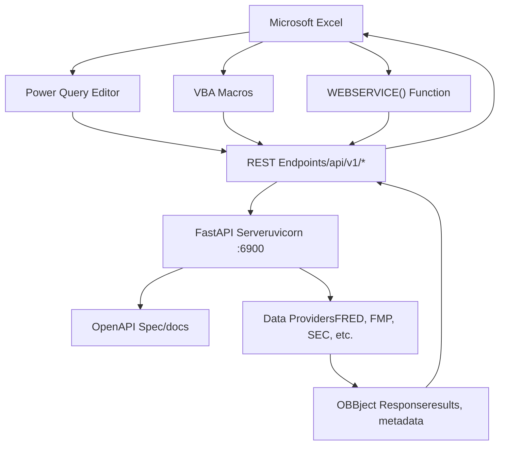
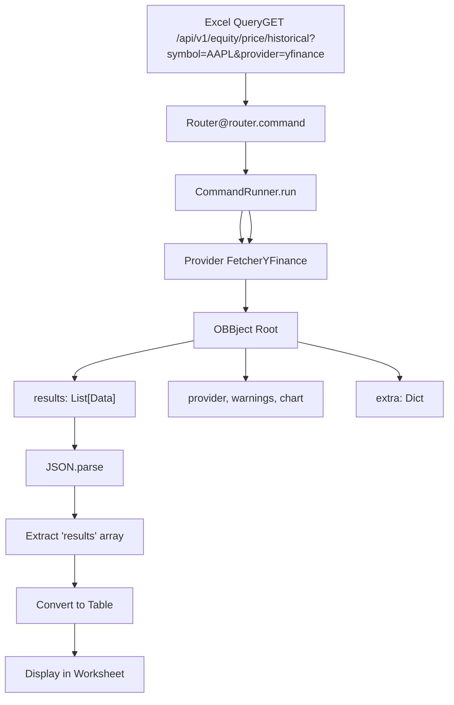

# Excel Integration

相关源文件

-   [.codespell.skip](https://github.com/OpenBB-finance/OpenBB/blob/dddc3b32/.codespell.skip)
-   [.gitignore](https://github.com/OpenBB-finance/OpenBB/blob/dddc3b32/.gitignore)
-   [openbb\_platform/core/openbb\_core/provider/standard\_models/management\_discussion\_analysis.py](https://github.com/OpenBB-finance/OpenBB/blob/dddc3b32/openbb_platform/core/openbb_core/provider/standard_models/management_discussion_analysis.py)
-   [openbb\_platform/extensions/platform\_api/README.md](https://github.com/OpenBB-finance/OpenBB/blob/dddc3b32/openbb_platform/extensions/platform_api/README.md?plain=1)
-   [openbb\_platform/extensions/platform\_api/openbb\_platform\_api/main.py](https://github.com/OpenBB-finance/OpenBB/blob/dddc3b32/openbb_platform/extensions/platform_api/openbb_platform_api/main.py)
-   [openbb\_platform/extensions/platform\_api/openbb\_platform\_api/query\_models.py](https://github.com/OpenBB-finance/OpenBB/blob/dddc3b32/openbb_platform/extensions/platform_api/openbb_platform_api/query_models.py)
-   [openbb\_platform/extensions/platform\_api/openbb\_platform\_api/response\_models.py](https://github.com/OpenBB-finance/OpenBB/blob/dddc3b32/openbb_platform/extensions/platform_api/openbb_platform_api/response_models.py)
-   [openbb\_platform/extensions/platform\_api/openbb\_platform\_api/utils/api.py](https://github.com/OpenBB-finance/OpenBB/blob/dddc3b32/openbb_platform/extensions/platform_api/openbb_platform_api/utils/api.py)
-   [openbb\_platform/extensions/platform\_api/openbb\_platform\_api/utils/openapi.py](https://github.com/OpenBB-finance/OpenBB/blob/dddc3b32/openbb_platform/extensions/platform_api/openbb_platform_api/utils/openapi.py)
-   [openbb\_platform/extensions/platform\_api/openbb\_platform\_api/utils/widgets.py](https://github.com/OpenBB-finance/OpenBB/blob/dddc3b32/openbb_platform/extensions/platform_api/openbb_platform_api/utils/widgets.py)
-   [openbb\_platform/extensions/platform\_api/poetry.lock](https://github.com/OpenBB-finance/OpenBB/blob/dddc3b32/openbb_platform/extensions/platform_api/poetry.lock)
-   [openbb\_platform/extensions/platform\_api/pyproject.toml](https://github.com/OpenBB-finance/OpenBB/blob/dddc3b32/openbb_platform/extensions/platform_api/pyproject.toml)
-   [openbb\_platform/extensions/platform\_api/tests/mock\_openapi.json](https://github.com/OpenBB-finance/OpenBB/blob/dddc3b32/openbb_platform/extensions/platform_api/tests/mock_openapi.json)
-   [openbb\_platform/extensions/platform\_api/tests/mock\_widgets.json](https://github.com/OpenBB-finance/OpenBB/blob/dddc3b32/openbb_platform/extensions/platform_api/tests/mock_widgets.json)
-   [openbb\_platform/extensions/platform\_api/tests/test\_openapi\_utils.py](https://github.com/OpenBB-finance/OpenBB/blob/dddc3b32/openbb_platform/extensions/platform_api/tests/test_openapi_utils.py)
-   [openbb\_platform/extensions/platform\_api/tests/test\_widgets\_utils.py](https://github.com/OpenBB-finance/OpenBB/blob/dddc3b32/openbb_platform/extensions/platform_api/tests/test_widgets_utils.py)
-   [openbb\_platform/extensions/regulators/integration/test\_regulators\_api.py](https://github.com/OpenBB-finance/OpenBB/blob/dddc3b32/openbb_platform/extensions/regulators/integration/test_regulators_api.py)
-   [openbb\_platform/extensions/regulators/integration/test\_regulators\_python.py](https://github.com/OpenBB-finance/OpenBB/blob/dddc3b32/openbb_platform/extensions/regulators/integration/test_regulators_python.py)
-   [openbb\_platform/extensions/regulators/openbb\_regulators/cftc/cftc\_router.py](https://github.com/OpenBB-finance/OpenBB/blob/dddc3b32/openbb_platform/extensions/regulators/openbb_regulators/cftc/cftc_router.py)
-   [openbb\_platform/extensions/regulators/openbb\_regulators/sec/sec\_router.py](https://github.com/OpenBB-finance/OpenBB/blob/dddc3b32/openbb_platform/extensions/regulators/openbb_regulators/sec/sec_router.py)
-   [openbb\_platform/providers/nasdaq/tests/record/expected\_widgets.json](https://github.com/OpenBB-finance/OpenBB/blob/dddc3b32/openbb_platform/providers/nasdaq/tests/record/expected_widgets.json)
-   [openbb\_platform/providers/sec/openbb\_sec/models/management\_discussion\_analysis.py](https://github.com/OpenBB-finance/OpenBB/blob/dddc3b32/openbb_platform/providers/sec/openbb_sec/models/management_discussion_analysis.py)
-   [openbb\_platform/providers/sec/openbb\_sec/models/schema\_files.py](https://github.com/OpenBB-finance/OpenBB/blob/dddc3b32/openbb_platform/providers/sec/openbb_sec/models/schema_files.py)
-   [openbb\_platform/providers/sec/openbb\_sec/utils/html2markdown.py](https://github.com/OpenBB-finance/OpenBB/blob/dddc3b32/openbb_platform/providers/sec/openbb_sec/utils/html2markdown.py)
-   [openbb\_platform/providers/sec/openbb\_sec/utils/xbrl\_taxonomy\_helper.py](https://github.com/OpenBB-finance/OpenBB/blob/dddc3b32/openbb_platform/providers/sec/openbb_sec/utils/xbrl_taxonomy_helper.py)
-   [openbb\_platform/providers/sec/poetry.lock](https://github.com/OpenBB-finance/OpenBB/blob/dddc3b32/openbb_platform/providers/sec/poetry.lock)
-   [openbb\_platform/providers/sec/pyproject.toml](https://github.com/OpenBB-finance/OpenBB/blob/dddc3b32/openbb_platform/providers/sec/pyproject.toml)

## 目的与范围

本页面介绍了如何将 OpenBB Platform 数据集成到 Microsoft Excel 电子表格中。Excel 可以查询 OpenBB Platform REST API 来检索金融和经济数据以进行分析和报告。这种集成使 Excel 用户能够在不离开其电子表格环境的情况下利用 OpenBB 的数据提供程序。

有关底层 REST API 服务器的信息，请参阅 [REST API Server](/OpenBB-finance/OpenBB/5.2-rest-api-server)。有关 OpenBB Workspace Web 界面，请参阅 [OpenBB Workspace Integration](/OpenBB-finance/OpenBB/5.3-openbb-workspace-integration)。

## 概览

通过将 Excel 连接到本地 FastAPI 服务器，可以实现 Excel 与 OpenBB Platform 的集成。与专门的 Excel 加载项不同，此方法使用 Excel 的原生 HTTP 功能（Power Query、VBA 或 Web 函数）发起 REST API 调用并检索数据。

**关键特征：**

-   无需专门的 Excel 加载项
-   使用标准 Excel 数据连接工具
-   连接到本地 API 服务器（默认：`http://127.0.0.1:6900`）
-   以 JSON 格式返回数据供 Excel 解析
-   支持所有平台端点和提供程序

来源：[openbb\_platform/extensions/platform\_api/README.md1-28](https://github.com/OpenBB-finance/OpenBB/blob/dddc3b32/openbb_platform/extensions/platform_api/README.md?plain=1#L1-L28) [openbb\_platform/extensions/platform\_api/openbb\_platform\_api/main.py1-28](https://github.com/OpenBB-finance/OpenBB/blob/dddc3b32/openbb_platform/extensions/platform_api/openbb_platform_api/main.py#L1-L28)

## 架构

### 连接流程


来源：[openbb\_platform/extensions/platform\_api/README.md20-40](https://github.com/OpenBB-finance/OpenBB/blob/dddc3b32/openbb_platform/extensions/platform_api/README.md?plain=1#L20-L40) [openbb\_platform/extensions/platform\_api/openbb\_platform\_api/main.py283-327](https://github.com/OpenBB-finance/OpenBB/blob/dddc3b32/openbb_platform/extensions/platform_api/openbb_platform_api/main.py#L283-L327)

### 数据流与响应结构


**OBBject 结构：**

API 以 `OBBject` 格式返回数据，Excel 必须对其进行解析：

```
{  "results": [    {"date": "2024-01-01", "close": 150.50, "volume": 1000000},    {"date": "2024-01-02", "close": 151.20, "volume": 950000}  ],  "provider": "yfinance",  "warnings": [],  "chart": null,  "extra": {    "metadata": {}  }}
```
Excel 通常需要提取 `results` 数组以进行表格显示。

来源：[openbb\_platform/core/openbb\_core/app/model/obbject.py](https://github.com/OpenBB-finance/OpenBB/blob/dddc3b32/openbb_platform/core/openbb_core/app/model/obbject.py)（从响应结构推断），[openbb\_platform/extensions/platform\_api/openbb\_platform\_api/main.py124-154](https://github.com/OpenBB-finance/OpenBB/blob/dddc3b32/openbb_platform/extensions/platform_api/openbb_platform_api/main.py#L124-L154)

## 安装与配置

### 1. 启动 API 服务器

在 Excel 连接之前，OpenBB Platform API 服务器必须处于运行状态：

```
openbb-api
```
这将在 `http://127.0.0.1:6900` 启动 FastAPI 服务器。您可以配置主机和端口：

```
openbb-api --host 127.0.0.1 --port 6900
```
对于 HTTPS 连接（某些公司 Excel 安装环境需要）：

```
openssl req -x509 -days 3650 -out localhost.crt -keyout localhost.key \  -newkey rsa:4096 -nodes -sha256 -subj '/CN=localhost' \  -extensions EXT -config <(printf "[dn]\nCN=localhost\n[req]\ndistinguished_name=dn\n[EXT]\nsubjectAltName=DNS:localhost\nkeyUsage=digitalSignature\nextendedKeyUsage=serverAuth") # 启动带有 SSL 的 API 服务器openbb-api --ssl_keyfile localhost.key --ssl_certfile localhost.crt
```
来源：[openbb\_platform/extensions/platform\_api/README.md99-123](https://github.com/OpenBB-finance/OpenBB/blob/dddc3b32/openbb_platform/extensions/platform_api/README.md?plain=1#L99-L123) [openbb\_platform/extensions/platform\_api/openbb\_platform\_api/main.py284-327](https://github.com/OpenBB-finance/OpenBB/blob/dddc3b32/openbb_platform/extensions/platform_api/openbb_platform_api/main.py#L284-L327)

### 2. 验证 API 可用性

打开浏览器并导航至：

-   API 根路径：`http://127.0.0.1:6900/`
-   OpenAPI 文档：`http://127.0.0.1:6900/docs`

OpenAPI 文档列出了所有可用的端点及其参数 schema。

来源：[openbb\_platform/extensions/platform\_api/openbb\_platform\_api/main.py124-130](https://github.com/OpenBB-finance/OpenBB/blob/dddc3b32/openbb_platform/extensions/platform_api/openbb_platform_api/main.py#L124-L130)

### 3. 身份验证配置

如果 API 需要身份验证，您需要配置 Basic Auth 凭据：

```
# 在环境变量或 user_settings.json 中设置OPENBB_API_USERNAME=your_usernameOPENBB_API_PASSWORD=your_password
```
在 Excel 中，在请求中包含 `Authorization` 标头：

```
Authorization: Basic <base64_encoded_username:password>
```
来源：[openbb\_platform/extensions/regulators/integration/test\_regulators\_api.py12-18](https://github.com/OpenBB-finance/OpenBB/blob/dddc3b32/openbb_platform/extensions/regulators/integration/test_regulators_api.py#L12-L18) [openbb\_core/env](https://github.com/OpenBB-finance/OpenBB/blob/dddc3b32/openbb_core/env)（从环境配置推断）

## 连接方法

### 方法 1：Power Query (推荐)

Power Query 是 Excel 内置的 ETL 工具，提供了最稳健的集成：

**步骤：**

1.  **打开 Power Query：**
    -   Excel → 数据选项卡 → 获取数据 → 来自其他源 → 来自 Web
2.  **输入 API URL：**
    ```
    http://127.0.0.1:6900/api/v1/equity/price/historical?symbol=AAPL&provider=yfinance&start_date=2024-01-01&end_date=2024-12-31
    ```
3.  **配置请求 (如果需要身份验证)：**
    -   高级 → HTTP 请求标头
    -   添加标头：`Authorization: Basic <凭据>`
4.  **解析 JSON 响应：**
    -   Power Query 将自动检测 JSON 格式
    -   展开 `results` 列以查看数据字段
    -   选择要保留的列（date, close, volume 等）
5.  **加载到工作表：**
    -   点击 "关闭并上载"
    -   数据将出现在新的工作表中，并具有自动刷新功能

**优点：**

-   基于图形界面，无需编码
-   内置 JSON 解析
-   支持计划刷新
-   查询参数可以引用 Excel 单元格
-   具有错误处理和重试逻辑

来源：Excel 文档（概念性），[openbb\_platform/extensions/platform\_api/README.md20-28](https://github.com/OpenBB-finance/OpenBB/blob/dddc3b32/openbb_platform/extensions/platform_api/README.md?plain=1#L20-L28)

### 方法 2：VBA 宏

对于编程控制，请使用带有 `MSXML2.XMLHTTP` 或 `WinHttp.WinHttpRequest` 对象的 VBA：

**VBA 代码示例：**

```
Function FetchOBBData(endpoint As String, params As String) As String    Dim http As Object    Dim url As String        ' 创建 HTTP 请求对象    Set http = CreateObject("MSXML2.XMLHTTP")        ' 构建完整 URL    url = "http://127.0.0.1:6900" & endpoint & "?" & params        ' 发起 GET 请求    http.Open "GET", url, False    http.setRequestHeader "Content-Type", "application/json"    ' 如果需要，添加身份验证标头    ' http.setRequestHeader "Authorization", "Basic " & EncodeBase64("user:pass")        http.Send        ' 返回响应文本    FetchOBBData = http.responseText        Set http = NothingEnd FunctionSub LoadEquityData()    Dim response As String    Dim jsonResult As Object        ' 获取数据    response = FetchOBBData("/api/v1/equity/price/historical", _                           "symbol=AAPL&provider=yfinance&start_date=2024-01-01")        ' 解析 JSON (需要 JSON 库或手动解析)    ' Set jsonResult = JsonConverter.ParseJson(response)        ' 提取结果数组并填充工作表    ' ... (实现取决于 JSON 库)End Sub
```
**注意：** VBA 不具有原生的 JSON 解析功能。您将需要：

-   VBA-JSON 库 ([https://github.com/VBA-tools/VBA-JSON](https://github.com/VBA-tools/VBA-JSON))
-   手动字符串解析
-   Power Query 转换（作为 Power Query 加载，然后在 VBA 中引用）

来源：VBA/Excel 文档（概念性），[openbb\_platform/extensions/platform\_api/openbb\_platform\_api/main.py124-154](https://github.com/OpenBB-finance/OpenBB/blob/dddc3b32/openbb_platform/extensions/platform_api/openbb_platform_api/main.py#L124-L154)

### 方法 3：WEBSERVICE 函数 (受限)

Excel 的 `WEBSERVICE()` 函数可以发起 GET 请求，但有很大局限性：

**公式：**

```
=WEBSERVICE("http://127.0.0.1:6900/api/v1/equity/price/historical?symbol=AAPL&provider=yfinance")
```
**局限性：**

-   返回原始 JSON 字符串（未解析）
-   不支持身份验证
-   不支持 POST 请求
-   响应有字符限制（约 32,767 个字符）
-   错误处理能力有限

您可以结合使用 `FILTERXML()` 进行简单解析，但不建议用于像 OBBject 这样复杂的 JSON 结构。

来源：Excel 文档（概念性）

## 可供 Excel 使用的端点

所有 REST API 端点均可供 Excel 使用。常见用例：

### 股票数据

**历史价格：**

```
GET /api/v1/equity/price/historical
参数: symbol, provider, start_date, end_date, interval
```
**公司基本面：**

```
GET /api/v1/equity/fundamental/balance
GET /api/v1/equity/fundamental/income
GET /api/v1/equity/fundamental/cash
参数: symbol, provider, period, limit
```
**日历数据：**

```
GET /api/v1/equity/calendar/earnings
GET /api/v1/equity/calendar/dividends
参数: symbol, provider, start_date, end_date
```
### 经济数据

**美联储数据：**

```
GET /api/v1/economy/fred_series
参数: symbol, provider, start_date, end_date, frequency
```
**经济指标：**

```
GET /api/v1/economy/cpi
GET /api/v1/economy/gdp
GET /api/v1/economy/unemployment
参数: country, provider, start_date, end_date
```
### SEC 申报

**公司申报：**

```
GET /api/v1/regulators/sec/company_filings
参数: symbol, form_type, provider
```
**完整端点列表可见于：** `http://127.0.0.1:6900/docs`

来源：[openbb\_platform/extensions/platform\_api/openbb\_platform\_api/main.py107-111](https://github.com/OpenBB-finance/OpenBB/blob/dddc3b32/openbb_platform/extensions/platform_api/openbb_platform_api/main.py#L107-L111) [openbb\_platform/extensions/economy/](https://github.com/OpenBB-finance/OpenBB/blob/dddc3b32/openbb_platform/extensions/economy/) (推断), [openbb\_platform/extensions/regulators/](https://github.com/OpenBB-finance/OpenBB/blob/dddc3b32/openbb_platform/extensions/regulators/) (推断)

## 数据格式处理

### OBBject 结构

所有 API 响应都遵循 `OBBject` 格式：

| 字段 | 类型 | 描述 |
| --- | --- | --- |
| `results` | `List[Dict]` | 数据记录数组（实际数据） |
| `provider` | `str` | 数据提供程序名称（例如 "yfinance"） |
| `warnings` | `List[Dict]` | 警告消息（如果有） |
| `chart` | `Dict` 或 `null` | 图表配置（如果使用了 chart=true 参数） |
| `extra` | `Dict` | 其他元数据 |

### 在 Power Query 中提取结果

当您将 JSON 加载到 Power Query 中时：

1.  Power Query 将 `OBBject` 显示为一条 "记录" (Record)
2.  点击 "记录" 列标题旁边的展开图标
3.  从下拉列表中选择 `results`
4.  Power Query 将结果数组转换为表格
5.  展开 "列表" (List) 以显示各个记录字段
6.  选择要保留的字段（date, close, volume 等）
7.  点击 "关闭并上载"

### 处理日期字段

API 以字符串形式返回日期（ISO 8601 格式：`"YYYY-MM-DD"`）。在 Power Query 中：

1.  选择日期列
2.  转换 → 数据类型 → 日期
3.  Power Query 将字符串转换为正确的 Excel 日期格式

### 处理空值 (Null)

API 可能会为缺失数据返回 `null`：

-   Power Query 显示为 `null`
-   Excel 显示为空白单元格
-   使用 Power Query 的 "替换值" 将 `null` 转换为 0 或其他默认值

来源：[openbb\_platform/extensions/platform\_api/openbb\_platform\_api/main.py](https://github.com/OpenBB-finance/OpenBB/blob/dddc3b32/openbb_platform/extensions/platform_api/openbb_platform_api/main.py) (从 OBBject 结构推断), Power Query 文档 (概念性)

## 参数化查询

### 使用 Excel 单元格作为参数

Power Query 可以引用 Excel 单元格值作为查询参数：

1.  **创建参数单元格：**
    -   单元格 A1: `AAPL` (symbol)
    -   单元格 B1: `2024-01-01` (start\_date)
    -   单元格 C1: `2024-12-31` (end\_date)
2.  **定义名称管理器：**
    -   将单元格 A1 命名为 `SymbolParam`
    -   将单元格 B1 命名为 `StartDateParam`
    -   将单元格 C1 命名为 `EndDateParam`
3.  **在 Power Query M 代码中：**
    ```
    let    Symbol = Excel.CurrentWorkbook(){[Name="SymbolParam"]}[Content]{0}[Column1],    StartDate = Excel.CurrentWorkbook(){[Name="StartDateParam"]}[Content]{0}[Column1],    EndDate = Excel.CurrentWorkbook(){[Name="EndDateParam"]}[Content]{0}[Column1],        BaseUrl = "http://127.0.0.1:6900/api/v1/equity/price/historical",    FullUrl = BaseUrl & "?symbol=" & Symbol &               "&start_date=" & StartDate &               "&end_date=" & EndDate &               "&provider=yfinance",        Source = Json.Document(Web.Contents(FullUrl)),    Results = Source[results],    ResultsTable = Table.FromList(Results, Splitter.SplitByNothing(), null, null, ExtraValues.Error),    ExpandedTable = Table.ExpandRecordColumn(ResultsTable, "Column1",                     {"date", "close", "volume", "open", "high", "low"})in    ExpandedTable
    ```
4.  **刷新数据：**
    -   更改单元格 A1、B1、C1 中的参数值
    -   右键点击查询 → 刷新
    -   数据将自动更新

来源：Power Query M 语言文档 (概念性), [openbb\_platform/extensions/platform\_api/openbb\_platform\_api/main.py107-111](https://github.com/OpenBB-finance/OpenBB/blob/dddc3b32/openbb_platform/extensions/platform_api/openbb_platform_api/main.py#L107-L111)

## 错误处理

### 常见的错误响应

API 返回标准的 HTTP 错误代码：

| 状态 | 描述 | Excel 中的处理 |
| --- | --- | --- |
| 200 | 成功 | 数据加载成功 |
| 400 | 错误请求 (参数无效) | 检查参数名称和值 |
| 404 | 未找到 (端点无效) | 从 `/docs` 验证端点路径 |
| 422 | 验证错误 | 检查参数类型和必填字段 |
| 500 | 内部服务器错误 | 检查 API 服务器日志 |

### 错误响应格式

```
{  "detail": "Validation error description",  "errors": [    {"loc": ["query", "symbol"], "msg": "field required", "type": "value_error.missing"}  ]}
```
### 在 Power Query 中处理错误

在 Power Query M 代码中添加错误处理：

```
let    Source = try Json.Document(Web.Contents(url)) otherwise null,    Result = if Source = null then                 #table({"Error"}, {{"Failed to fetch data"}})             else if Record.HasFields(Source, "detail") then                #table({"Error"}, {{Source[detail]}})             else                Source[results]in    Result
```
来源：[openbb\_platform/extensions/platform\_api/openbb\_platform\_api/main.py](https://github.com/OpenBB-finance/OpenBB/blob/dddc3b32/openbb_platform/extensions/platform_api/openbb_platform_api/main.py) (从错误处理推断), FastAPI 文档 (概念性)

## 提供程序选择

### 多提供程序端点

许多端点通过 `provider` 参数支持多个数据提供程序：

**示例：** 股票历史价格

-   `provider=yfinance` - 免费、基础数据
-   `provider=fmp` - Financial Modeling Prep (需要 API 密钥)
-   `provider=intrinio` - Intrinio (需要订阅)

**在 Excel URL 中：**

```
http://127.0.0.1:6900/api/v1/equity/price/historical?symbol=AAPL&provider=yfinance
```
**通过修改参数更改提供程序：**

```
http://127.0.0.1:6900/api/v1/equity/price/historical?symbol=AAPL&provider=fmp
```
### 提供程序特定的字段

不同的提供程序可能会返回额外的字段：

-   标准字段：`date`, `close`, `volume`, `open`, `high`, `low`
-   特定于提供程序的字段：`adj_close`, `vwap`, `transactions` 等

Power Query 的列展开功能会自动检测所有可用字段。

来源：[openbb\_platform/core/openbb\_core/app/provider\_interface.py](https://github.com/OpenBB-finance/OpenBB/blob/dddc3b32/openbb_platform/core/openbb_core/app/provider_interface.py) (推断), [openbb\_platform/providers/](https://github.com/OpenBB-finance/OpenBB/blob/dddc3b32/openbb_platform/providers/) (各种提供程序)

## 性能注意事项

### API 速率限制

某些数据提供程序实施速率限制：

-   免费提供程序：通常限制每分钟的请求数
-   付费提供程序：根据订阅层级提供更高的限制

**在 Excel 中的缓解措施：**

-   避免高频刷新
-   在工作表中本地缓存数据
-   尽可能使用 Power Query 内置的查询折叠 (Query Folding)

### 响应大小

较大的日期范围或多个代码可能会返回巨大的响应：

-   使用 `limit` 参数限制记录数
-   使用 `start_date` 和 `end_date` 过滤日期范围
-   对于极大的数据集，考虑分段获取

**带有限制的示例：**

```
GET /api/v1/equity/price/historical?symbol=AAPL&provider=yfinance&limit=100
```
### 刷新策略

Power Query 查询可以设置为：

-   **手动刷新：** 右键点击 → 刷新
-   **计划刷新：** 数据 → 查询和连接 → 查询属性 → 刷新控制
-   **打开工作簿时：** 启用 "打开文件时刷新数据"

来源：[openbb\_platform/extensions/platform\_api/README.md66-95](https://github.com/OpenBB-finance/OpenBB/blob/dddc3b32/openbb_platform/extensions/platform_api/README.md?plain=1#L66-L95) (uvicorn 配置)

## 故障排除

### 连接被拒绝

**问题：** Excel 无法连接到 `http://127.0.0.1:6900`

**解决方案：**

1.  验证 API 服务器是否正在运行：检查终端中的 `uvicorn` 输出
2.  检查端口可用性：`netstat -an | grep 6900` (Unix) 或 `netstat -an | findstr 6900` (Windows)
3.  尝试备用端口：`openbb-api --port 6901`
4.  检查防火墙设置：允许与 localhost 的连接

来源：[openbb\_platform/extensions/platform\_api/openbb\_platform\_api/utils/api.py82-93](https://github.com/OpenBB-finance/OpenBB/blob/dddc3b32/openbb_platform/extensions/platform_api/openbb_platform_api/utils/api.py#L82-L93)

### CORS 错误

**问题：** 基于浏览器的 Excel (Excel Online) 可能会遇到 CORS 限制

**解决方案：** CORS 由 API 的 `CORSMiddleware` 处理。确保 API 配置为允许您的 Excel Online 域名。

来源：[openbb\_platform/extensions/platform\_api/openbb\_platform\_api/utils/api.py305-315](https://github.com/OpenBB-finance/OpenBB/blob/dddc3b32/openbb_platform/extensions/platform_api/openbb_platform_api/utils/api.py#L305-L315)

### SSL 证书错误

**问题：** HTTPS 连接因证书错误而失败

**解决方案：**

1.  使用 HTTP 代替 (如果安全性允许)：`http://127.0.0.1:6900`
2.  信任自签名证书：将 `localhost.crt` 添加到系统受信任的根证书颁发机构
3.  对于生产部署，请使用公司签发的证书

来源：[openbb\_platform/extensions/platform\_api/README.md99-123](https://github.com/OpenBB-finance/OpenBB/blob/dddc3b32/openbb_platform/extensions/platform_api/README.md?plain=1#L99-L123)

### JSON 解析失败

**问题：** Power Query 无法解析响应

**原因：**

-   空响应 (无可用数据)
-   错误响应 (非 200 状态)
-   格式错误的 JSON (罕见，通常表示 API 错误)

**解决方案：** 在 Power Query M 代码中添加错误处理（参见上文的错误处理部分）

### 身份验证错误 (401 Unauthorized)

**问题：** API 需要身份验证但未提供凭据

**解决方案：**

1.  在环境变量中验证凭据
2.  在 Power Query 请求中添加 `Authorization` 标头
3.  使用 VBA 以编程方式处理身份验证

来源：[openbb\_platform/extensions/regulators/integration/test\_regulators\_api.py12-18](https://github.com/OpenBB-finance/OpenBB/blob/dddc3b32/openbb_platform/extensions/regulators/integration/test_regulators_api.py#L12-L18)

## 高级用例

### 多代码查询

通过发起多次 API 调用来获取多个代码的数据：

**选项 1：单独查询**

-   为每个代码创建一个 Power Query
-   使用 "追加查询" 进行合并

**选项 2：VBA 循环**

```
Sub FetchMultipleSymbols()    Dim symbols As Variant    Dim symbol As Variant    Dim ws As Worksheet    Dim rowNum As Long        symbols = Array("AAPL", "GOOGL", "MSFT", "AMZN")    Set ws = ThisWorkbook.Sheets("Data")    rowNum = 2        For Each symbol In symbols        ' 获取每个代码的数据        Dim response As String        response = FetchOBBData("/api/v1/equity/price/historical", _                               "symbol=" & symbol & "&provider=yfinance&limit=1")                ' 解析并写入工作表        ' ... (实现取决于 JSON 库)                rowNum = rowNum + 1    Next symbolEnd Sub
```
### 仪表板创建

利用 Excel 功能构建动态仪表板：

1.  **Power Query：** 从多个 API 端点获取数据
2.  **数据透视表：** 汇总和分析数据
3.  **图表：** 可视化趋势和对比
4.  **切片器：** 交互式过滤数据
5.  **条件格式：** 突出显示见解

来源：Excel 文档 (概念性)

### 实时数据更新

对于近乎实时的数据：

1.  设置 Power Query 刷新间隔 (最小 1 分钟)
2.  使用 VBA 定时器以编程方式触发刷新
3.  考虑真正的实时 WebSocket 替代方案 (OpenBB Platform API 原生不支持)

**VBA 定时器示例：**

```
Private Sub Workbook_Open()    ' 每 5 分钟刷新一次数据    Application.OnTime Now + TimeValue("00:05:00"), "RefreshAllQueries"End SubSub RefreshAllQueries()    ThisWorkbook.Queries.Refresh    ' 安排下次刷新    Application.OnTime Now + TimeValue("00:05:00"), "RefreshAllQueries"End Sub
```
## 与替代方案的对比

| 方法 | 优点 | 缺点 | 最适合 |
| --- | --- | --- | --- |
| **Excel + OpenBB API** | 完整的平台功能, 免费, 本地控制 | 需要 API 服务器运行 | 高级用户, 自定义工作流 |
| **Excel 加载项** (如果有) | 一键式函数, 无需设置 | 仅限于加载项功能 | 普通用户, 简单查询 |
| **Python + Excel** | 无限的自定义能力 | 需要 Python 知识 | 数据科学家, 自动化 |
| **手动导出** | 简单, 无需技术技能 | 无自动化, 手动更新 | 一次性分析 |

OpenBB Platform API 集成提供了最大的灵活性，同时保持了完整的数据主权，使其成为高级用户和自动化工作流的理想选择。

来源：对比分析 (概念性)

## 未来增强功能

Excel 集成的潜在改进：

1.  **专门的 Excel 加载项：**
    -   带有 OpenBB 函数的自定义功能区
    -   代码和参数的自动补全
    -   内置身份验证界面
2.  **Excel 函数库：**
    -   用户定义函数 (UDF)：`=OPENBB.PRICE("AAPL")`
    -   原生的 Excel 公式语法
    -   IntelliSense 支持
3.  **模板工作簿：**
    -   针对常见用例预配置的查询
    -   开箱即用的仪表板
    -   示例公式和可视化
4.  **增强的小部件支持：**
    -   `widgets.json` 中 Excel 特有的部件类型
    -   与 OpenBB Workspace 直接集成
    -   共享查询定义

这些增强功能将建立在现有的 REST API 基础之上，同时提供更加原生的 Excel 体验。

来源：架构规划 (概念性), [openbb\_platform/extensions/platform\_api/README.md1-24](https://github.com/OpenBB-finance/OpenBB/blob/dddc3b32/openbb_platform/extensions/platform_api/README.md?plain=1#L1-L24)

---

**摘要：** Excel 与 OpenBB Platform 的集成是通过对本地 FastAPI 服务器的标准 HTTP 请求实现的。Power Query 提供了最稳健的集成方法，对于特殊用例，也可以使用 VBA 和 Web 函数。Excel 用户可以访问所有平台端点和提供程序，从而在熟悉的电子表格环境中进行全面的金融数据分析。
