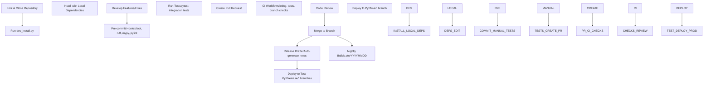
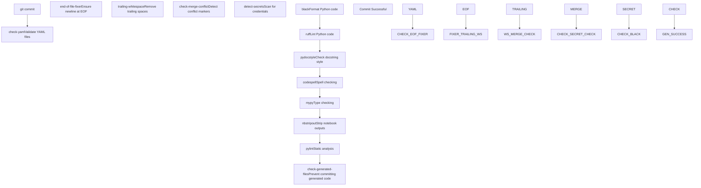
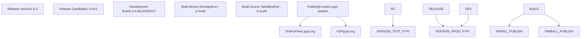
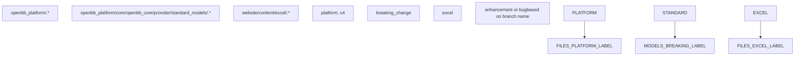

# 开发和部署

相关源文件

-   [.github/labeler.yml](https://github.com/OpenBB-finance/OpenBB/blob/dddc3b32/.github/labeler.yml)
-   [.github/platform-drafter.yml](https://github.com/OpenBB-finance/OpenBB/blob/dddc3b32/.github/platform-drafter.yml)
-   [.github/release-drafter.yml](https://github.com/OpenBB-finance/OpenBB/blob/dddc3b32/.github/release-drafter.yml)
-   [.github/workflows/README.md](https://github.com/OpenBB-finance/OpenBB/blob/dddc3b32/.github/workflows/README.md?plain=1)
-   [.pre-commit-config.yaml](https://github.com/OpenBB-finance/OpenBB/blob/dddc3b32/.pre-commit-config.yaml)
-   [README.md](https://github.com/OpenBB-finance/OpenBB/blob/dddc3b32/README.md?plain=1)
-   [cli/poetry.lock](https://github.com/OpenBB-finance/OpenBB/blob/dddc3b32/cli/poetry.lock)
-   [openbb\_platform/core/openbb/assets/reference.json](https://github.com/OpenBB-finance/OpenBB/blob/dddc3b32/openbb_platform/core/openbb/assets/reference.json)
-   [openbb\_platform/core/poetry.lock](https://github.com/OpenBB-finance/OpenBB/blob/dddc3b32/openbb_platform/core/poetry.lock)
-   [openbb\_platform/core/pyproject.toml](https://github.com/OpenBB-finance/OpenBB/blob/dddc3b32/openbb_platform/core/pyproject.toml)
-   [openbb\_platform/dev\_install.py](https://github.com/OpenBB-finance/OpenBB/blob/dddc3b32/openbb_platform/dev_install.py)
-   [openbb\_platform/extensions/devtools/poetry.lock](https://github.com/OpenBB-finance/OpenBB/blob/dddc3b32/openbb_platform/extensions/devtools/poetry.lock)
-   [openbb\_platform/extensions/devtools/pyproject.toml](https://github.com/OpenBB-finance/OpenBB/blob/dddc3b32/openbb_platform/extensions/devtools/pyproject.toml)
-   [openbb\_platform/poetry.lock](https://github.com/OpenBB-finance/OpenBB/blob/dddc3b32/openbb_platform/poetry.lock)
-   [openbb\_platform/providers/yfinance/poetry.lock](https://github.com/OpenBB-finance/OpenBB/blob/dddc3b32/openbb_platform/providers/yfinance/poetry.lock)
-   [openbb\_platform/pyproject.toml](https://github.com/OpenBB-finance/OpenBB/blob/dddc3b32/openbb_platform/pyproject.toml)

本页概述了 OpenBB 平台的开发工作流、构建系统、测试基础设施和部署流水线。它涵盖了贡献者在开发、测试和发布新功能及修复程序时使用的工具和流程。

**范围**: 本页介绍了从初始设置到生产部署的开发生命周期。有关特定主题的详细指导，请参阅：

-   设置本地开发环境：[开发设置](/OpenBB-finance/OpenBB/6.1-development-setup)
-   代码质量标准和测试：[代码质量与测试](/OpenBB-finance/OpenBB/6.2-code-quality-and-testing)
-   构建自定义扩展：[创建扩展](/OpenBB-finance/OpenBB/6.3-creating-extensions)
-   CI/CD 工作流和发布：[CI/CD 与发布过程](/OpenBB-finance/OpenBB/6.4-cicd-and-release-process)

---

## 开发工作流概述

OpenBB 平台使用 **基于 Poetry 的 Monorepo** 结构，其中扩展和提供商作为独立的包开发，但在本地开发时以可编辑模式安装。该工作流旨在支持快速迭代，同时通过自动化检查维护代码质量。


**来源**: [README.md131-149](https://github.com/OpenBB-finance/OpenBB/blob/dddc3b32/README.md?plain=1#L131-L149) [openbb\_platform/dev\_install.py1-177](https://github.com/OpenBB-finance/OpenBB/blob/dddc3b32/openbb_platform/dev_install.py#L1-L177) [.github/workflows/README.md1-101](https://github.com/OpenBB-finance/OpenBB/blob/dddc3b32/.github/workflows/README.md?plain=1#L1-L101)

---

## 开发环境设置

平台提供了 `dev_install.py` 脚本，通过对所有扩展和提供商进行可编辑安装来配置本地开发环境。该脚本修改 `pyproject.toml`，将 PyPI 依赖项替换为本地路径引用。

### 本地依赖项配置

该脚本将发布的包依赖项转换为本地路径依赖项：

| 依赖项类型 | PyPI 格式 | 本地格式 |
| --- | --- | --- |
| 核心 (Core) | `openbb-core = "^1.6.0"` | `openbb-core = { path = "./core", develop = true }` |
| 提供商 (Providers) | `openbb-fred = "^1.5.1"` | `openbb-fred = { path = "./providers/fred", develop = true }` |
| 扩展 (Extensions) | `openbb-equity = "^1.6.0"` | `openbb-equity = { path = "./extensions/equity", develop = true }` |

```mermaid
flowchart TD
    READ_PYPROJECT["Read pyproject.toml"]
    REPLACE_DEPS["Replace Dependencieswith Local Paths"]
    WRITE_LOCAL["Write Local Config"]
    POETRY_INSTALL["Run poetry install"]
    CORE["core/openbb-core"]
    PROVIDERS["providers/fred, fmp, sec, etc."]
    EXTENSIONS["extensions/equity, economy, etc."]
    DEV_ENV["Development Environmentwith editable packages"]
    AUTO_RELOAD["Changes immediatelyreflected in runtime"]

    READ --> PYPROJECT_REPLACE_DEPS
    REPLACE --> DEPS_WRITE_LOCAL
    WRITE --> LOCAL_POETRY_INSTALL
    POETRY --> INSTALL_CORE
    POETRY --> INSTALL_PROVIDERS
    POETRY --> INSTALL_EXTENSIONS
    CORE --> DEV_ENV
    PROVIDERS --> DEV_ENV
    EXTENSIONS --> DEV_ENV
    DEV --> ENV_AUTO_RELOAD
```


**来源**: [openbb\_platform/dev\_install.py11-77](https://github.com/OpenBB-finance/OpenBB/blob/dddc3b32/openbb_platform/dev_install.py#L11-L77) [openbb\_platform/dev\_install.py102-177](https://github.com/OpenBB-finance/OpenBB/blob/dddc3b32/openbb_platform/dev_install.py#L102-L177)

---

## 构建系统架构

OpenBB 平台使用 **Poetry** 进行依赖管理和包构建。构建系统同时支持本地开发工作流和生产发布。

### 关键构建组件

| 组件 | 用途 | 位置 |
| --- | --- | --- |
| `poetry.lock` | 锁定文件，用于可重复构建 | `openbb_platform/poetry.lock` |
| `pyproject.toml` | 包配置 | `openbb_platform/pyproject.toml` |
| `openbb-build` 脚本 | 用于构建包的 CLI 命令 | `openbb_platform/core/pyproject.toml:31` |
| PackageBuilder | 动态代码生成器 | `openbb_platform/core/openbb_core/app/static/package_builder.py` |

构建过程会根据安装的扩展动态生成 Python SDK 代码，详见 [包构建器与代码生成](/OpenBB-finance/OpenBB/2.4-package-builder-and-code-generation)。

**来源**: [openbb\_platform/pyproject.toml1-118](https://github.com/OpenBB-finance/OpenBB/blob/dddc3b32/openbb_platform/pyproject.toml#L1-L118) [openbb\_platform/core/pyproject.toml30-31](https://github.com/OpenBB-finance/OpenBB/blob/dddc3b32/openbb_platform/core/pyproject.toml#L30-L31)

---

## 代码质量基础设施

### Pre-commit 钩子

平台通过在每次提交前运行的自动化 pre-commit 钩子来强制执行代码质量：


**配置**: pre-commit 配置排除了某些文件类型和路径，以避免误报：

-   在 YAML 检查中排除 `construct.yaml`
-   在 EOF 修正中排除 CSS, Markdown, SVG
-   在文档字符串检查中排除测试文件
-   对自定义字典使用 `.codespell.ignore`

**来源**: [.pre-commit-config.yaml1-95](https://github.com/OpenBB-finance/OpenBB/blob/dddc3b32/.pre-commit-config.yaml#L1-L95)

### 生成代码保护

pre-commit 钩子包含一项检查，以防止提交生成的 SDK 代码：

```bash
# 来自 .pre-commit-config.yaml:70-82
if git ls-files | grep "^openbb_platform/core/openbb/package/" |
    grep -v "^openbb_platform/core/openbb/package/__init__\.py$"; then
  echo "Error: Attempting to commit generated files in package directory."
  exit 1
fi
```
包目录中只允许存在 `__init__.py`，因为所有其他文件都是动态生成的。

**来源**: [.pre-commit-config.yaml70-82](https://github.com/OpenBB-finance/OpenBB/blob/dddc3b32/.pre-commit-config.yaml#L70-L82)

---

## 测试策略

平台采用多层测试方法：

| 测试类型 | 工具 | 范围 | 触发器 |
| --- | --- | --- | --- |
| 单元测试 | pytest | 单个函数/类 | Pre-commit, CI |
| 集成测试 | pytest + VCR | 提供商端点 | PR 时的 CI |
| 类型检查 | mypy | 静态类型验证 | Pre-commit, CI |
| 覆盖率 | pytest-cov | 代码覆盖率指标 | CI |

### 测试基础设施组件

```mermaid
flowchart TD
    PYTEST["pytestTest runner"]
    PYTEST_ASYNCIO["pytest-asyncioAsync test support"]
    PYTEST_COV["pytest-covCoverage measurement"]
    PYTEST_RECORDER["pytest-recorderVCR cassettes"]
    PYTEST_SUBTESTS["pytest-subtestsSubtests within tests"]
    PYTEST_ORDER["pytest-orderTest execution order"]
    UNIT_LOCAL["Local Unit Tests"]
    INTEGRATION_LOCAL["Local Integration Tests"]
    CI_UNIT["CI Unit Tests"]
    CI_INTEGRATION["CI Integration Tests"]
    COVERAGE["Coverage Reports"]
    CODECOV["Upload to Codecov"]

    PYTEST --> UNIT_LOCAL
    PYTEST --> INTEGRATION_LOCAL
    PYTEST --> ASYNCIO_CI_UNIT
    PYTEST --> RECORDER_CI_INTEGRATION
    PYTEST --> COV_COVERAGE
    COVERAGE --> CODECOV
```


**来源**: [openbb\_platform/extensions/devtools/pyproject.toml20-26](https://github.com/OpenBB-finance/OpenBB/blob/dddc3b32/openbb_platform/extensions/devtools/pyproject.toml#L20-L26)

---

## CI/CD 流水线

### GitHub Actions 工作流

平台在开发生命周期的不同阶段使用多个 GitHub Actions 工作流：

```mermaid
flowchart TD
    PR_EVENT["Pull Requestopened, synchronize, edited"]
    PUSH_FEATURE["Push to feature/*"]
    PUSH_RELEASE["Push to release/*"]
    PUSH_MAIN["Push to main"]
    SCHEDULE["Daily ScheduleUTC+0"]
    BRANCH_CHECK["Branch Name CheckValidate GitFlow naming"]
    GENERAL_LINT["General Lintingbandit, black, ruff, pylint, mypy"]
    LABELER["PR Auto Labelerplatform, bug, enhancement"]
    UNIT_PLATFORM["Unit Test Platformproviders, extensions"]
    UNIT_CLI["Unit Test CLI"]
    INTEGRATION_API["Integration Test API"]
    DRAFT_RELEASE["Draft Releaserelease-drafter.yml"]
    DEPLOY_TEST["Deploy to Test PyPIrelease/* branches"]
    DEPLOY_PROD["Deploy to PyPImain branch"]
    NIGHTLY["Nightly Build.devYYYYMMDD versioning"]
    DOCS["Deploy to GitHub Pages"]

    PR --> EVENT_BRANCH_CHECK
    PR --> EVENT_GENERAL_LINT
    PR --> EVENT_LABELER
    PR --> EVENT_UNIT_PLATFORM
    PR --> EVENT_UNIT_CLI
    PR --> EVENT_INTEGRATION_API
    PR --> EVENT_DRAFT_RELEASE
    PUSH --> RELEASE_DEPLOY_TEST
    PUSH --> MAIN_DEPLOY_PROD
    SCHEDULE --> NIGHTLY
    PUSH --> MAIN_DOCS
```


**来源**: [.github/workflows/README.md1-101](https://github.com/OpenBB-finance/OpenBB/blob/dddc3b32/.github/workflows/README.md?plain=1#L1-L101)

### 分支命名约定

CI 强制执行 GitFlow 命名约定：

| 分支类型 | 模式 | 目标分支 |
| --- | --- | --- |
| 功能 (Feature) | `feature/*` | develop |
| 热修复 (Hotfix) | `hotfix/*` | main |
| 发布 (Release) | `release/<major.minor.patch>(rc<number>)` | main |
| 缺陷修复 (Bugfix) | `bugfix/*` | develop |

**来源**: [.github/workflows/README.md22-31](https://github.com/OpenBB-finance/OpenBB/blob/dddc3b32/.github/workflows/README.md?plain=1#L22-L31)

---

## 部署流水线

### 版本管理

平台支持多种部署策略：


**每日构建 (Nightly Build) 版本控制**:

-   格式: `<currentVersion>.dev<YYYYMMDD>`
-   示例: `1.6.0.dev20250117`
-   每天在 UTC+0 触发
-   始终发布到带有 dev 后缀的生产 PyPI

**来源**: [.github/workflows/README.md33-43](https://github.com/OpenBB-finance/OpenBB/blob/dddc3b32/.github/workflows/README.md?plain=1#L33-L43)

### 发布自动化

使用 Release Drafter 自动生成发布说明：

| 类别 | 标签 | 描述 |
| --- | --- | --- |
| 🚨 Breaking Changes (重大变更) | `breaking_change` | 标准模型的更改 |
| 🦋 Enhancements (增强功能) | `platform`, `v4` | 新功能 |
| 🐛 Bug Fixes (缺陷修复) | `bug` | 缺陷修复 |
| 📚 Documentation (文档) | `docs` | 文档更新 |

**排除的贡献者**: 核心团队成员被排除在贡献者名单之外，以突出社区贡献。

**来源**: [.github/release-drafter.yml1-49](https://github.com/OpenBB-finance/OpenBB/blob/dddc3b32/.github/release-drafter.yml#L1-L49) [.github/platform-drafter.yml1-49](https://github.com/OpenBB-finance/OpenBB/blob/dddc3b32/.github/platform-drafter.yml#L1-L49)

---

## 软件包发布

### PyPI 部署流程

```mermaid
flowchart TD
    CHECKOUT["Checkout Code"]
    SETUP_PYTHON["Setup Python 3.10"]
    INSTALL_BUILD["Install pypa/build"]
    RUN_BUILD["python -m build"]
    WHEEL["*.whlBinary Wheel"]
    TARBALL["*.tar.gzSource Distribution"]
    TEST_CREDS["TEST_PYPI_API_TOKEN"]
    PROD_CREDS["PYPI_API_TOKEN"]
    PUBLISH_ACTION["gh-action-pypi-publish"]
    TEST_INDEX["test.pypi.orgrelease/* branches"]
    PROD_INDEX["pypi.orgmain branch"]

    CHECKOUT --> SETUP_PYTHON
    SETUP --> PYTHON_INSTALL_BUILD
    INSTALL --> BUILD_RUN_BUILD
    RUN --> BUILD_WHEEL
    RUN --> BUILD_TARBALL
    WHEEL --> PUBLISH_ACTION
    TARBALL --> PUBLISH_ACTION
    TEST --> CREDS_PUBLISH_ACTION
    PROD --> CREDS_PUBLISH_ACTION
    PUBLISH --> ACTION_TEST_INDEX
    PUBLISH --> ACTION_PROD_INDEX
```


**API 令牌存储**:

-   Test PyPI: `TEST_PYPI_API_TOKEN` (GitHub secret)
-   Production PyPI: `PYPI_API_TOKEN` (GitHub secret)

**来源**: [.github/workflows/README.md44-60](https://github.com/OpenBB-finance/OpenBB/blob/dddc3b32/.github/workflows/README.md?plain=1#L44-L60)

---

## 开发工具

`openbb-devtools` 扩展为平台开发人员提供了实用程序：

| 工具 | 版本 | 用途 |
| --- | --- | --- |
| ruff | ^0.13 | 快速的 Python linter |
| pylint | ^3.3 | 静态代码分析器 |
| mypy | ^1.12.1 | 静态类型检查器 |
| pydocstyle | ^6.3.0 | 文档字符串样式检查器 |
| black | ^25.1.0 | 代码格式化程序 |
| codespell | ^2.2.5 | 拼写检查器 |
| pre-commit | ^3.5.0 | Git 钩子管理器 |
| tox | ^4.11.3 | 测试环境管理器 |
| poetry | \>=2.1.3 | 依赖管理器 |

**来源**: [openbb\_platform/extensions/devtools/pyproject.toml10-29](https://github.com/OpenBB-finance/OpenBB/blob/dddc3b32/openbb_platform/extensions/devtools/pyproject.toml#L10-L29)

---

## 依赖管理

### Poetry 锁定文件

平台维护多个层级的锁定文件：

```mermaid
flowchart TD
    POETRY_UPDATE["poetry update"]
    LOCK_REGEN["Regenerate lock files"]
    CI_VERIFY["CI verifies consistency"]
    ROOT_LOCK["openbb_platform/poetry.lockRoot dependencies"]
    CORE_LOCK["openbb_platform/core/poetry.lockCore package"]
    CLI_LOCK["cli/poetry.lockCLI package"]
    DEVTOOLS_LOCK["extensions/devtools/poetry.lockDev tools"]
    PROVIDER_LOCKS["providers/*/poetry.lockIndividual providers"]

    POETRY --> UPDATE_LOCK_REGEN
    LOCK --> REGEN_CI_VERIFY
    ROOT --> LOCK_CORE_LOCK
    ROOT --> LOCK_CLI_LOCK
    ROOT --> LOCK_DEVTOOLS_LOCK
    ROOT --> LOCK_PROVIDER_LOCKS
```


**锁定文件的目的**:

-   确保跨环境的可重复构建
-   固定所有传递依赖项的确切版本
-   防止依赖冲突

**来源**: [openbb\_platform/poetry.lock1-10](https://github.com/OpenBB-finance/OpenBB/blob/dddc3b32/openbb_platform/poetry.lock#L1-L10) [openbb\_platform/core/poetry.lock1-10](https://github.com/OpenBB-finance/OpenBB/blob/dddc3b32/openbb_platform/core/poetry.lock#L1-L10) [cli/poetry.lock1-10](https://github.com/OpenBB-finance/OpenBB/blob/dddc3b32/cli/poetry.lock#L1-L10)

---

## 质量指标

### 自动标记

根据修改后的文件自动标记拉取请求：


**基于分支的标签**:

-   `feature/*` → `enhancement`
-   `hotfix/*` 或 `bugfix/*` → `bug`

**来源**: [.github/labeler.yml1-28](https://github.com/OpenBB-finance/OpenBB/blob/dddc3b32/.github/labeler.yml#L1-L28)

---

## 总结

OpenBB 平台的开发和部署基础设施提供：

1.  **本地开发**: 通过 `dev_install.py` 进行可编辑的包安装
2.  **质量保证**: 多阶段 pre-commit 钩子和 CI 检查
3.  **测试**: 使用 pytest 进行单元测试、集成测试和覆盖率测试
4.  **CI/CD**: 用于 linting、测试和部署的自动化工作流
5.  **发布管理**: 自动化的发布说明和 PyPI 发布
6.  **版本控制**: 每日构建、候选发布版和正式发布版

该基础设施确保了代码质量，促进了快速开发，并使发布过程自动化，同时保持了跨扩展和提供商的兼容性。
