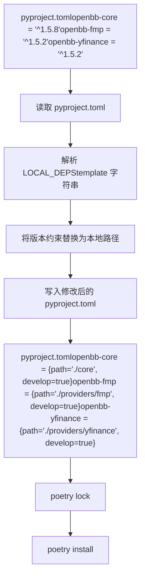
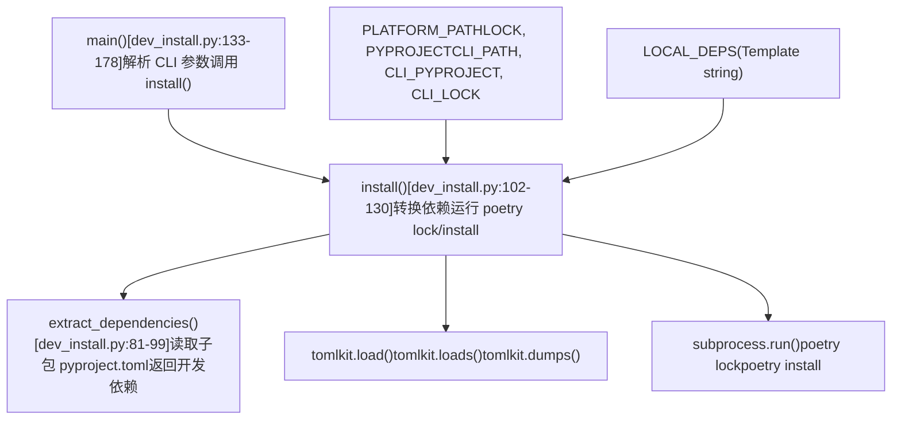
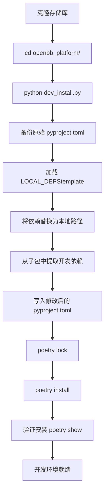
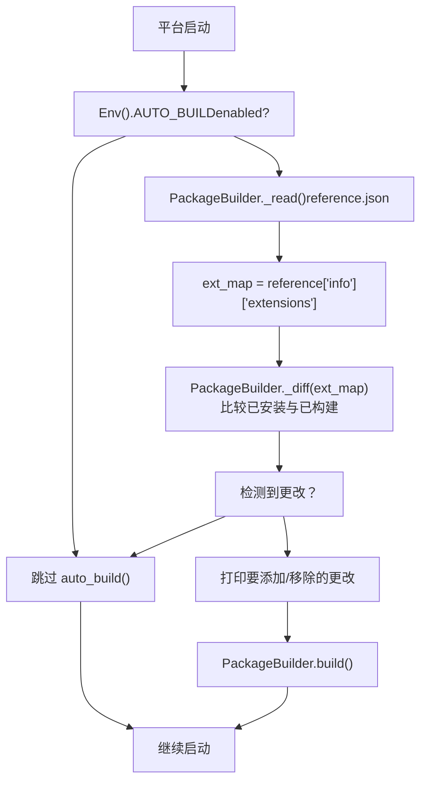

# 开发设置

相关源文件

-   [.pre-commit-config.yaml](https://github.com/OpenBB-finance/OpenBB/blob/dddc3b32/.pre-commit-config.yaml)
-   [README.md](https://github.com/OpenBB-finance/OpenBB/blob/dddc3b32/README.md?plain=1)
-   [cli/poetry.lock](https://github.com/OpenBB-finance/OpenBB/blob/dddc3b32/cli/poetry.lock)
-   [cli/tests/test\_argparse\_translator\_obbject\_registry.py](https://github.com/OpenBB-finance/OpenBB/blob/dddc3b32/cli/tests/test_argparse_translator_obbject_registry.py)
-   [openbb\_platform/core/openbb/assets/reference.json](https://github.com/OpenBB-finance/OpenBB/blob/dddc3b32/openbb_platform/core/openbb/assets/reference.json)
-   [openbb\_platform/core/openbb\_core/api/app\_loader.py](https://github.com/OpenBB-finance/OpenBB/blob/dddc3b32/openbb_platform/core/openbb_core/api/app_loader.py)
-   [openbb\_platform/core/openbb\_core/api/exception\_handlers.py](https://github.com/OpenBB-finance/OpenBB/blob/dddc3b32/openbb_platform/core/openbb_core/api/exception_handlers.py)
-   [openbb\_platform/core/openbb\_core/api/rest\_api.py](https://github.com/OpenBB-finance/OpenBB/blob/dddc3b32/openbb_platform/core/openbb_core/api/rest_api.py)
-   [openbb\_platform/core/openbb\_core/api/router/coverage.py](https://github.com/OpenBB-finance/OpenBB/blob/dddc3b32/openbb_platform/core/openbb_core/api/router/coverage.py)
-   [openbb\_platform/core/openbb\_core/app/provider\_interface.py](https://github.com/OpenBB-finance/OpenBB/blob/dddc3b32/openbb_platform/core/openbb_core/app/provider_interface.py)
-   [openbb\_platform/core/openbb\_core/app/router.py](https://github.com/OpenBB-finance/OpenBB/blob/dddc3b32/openbb_platform/core/openbb_core/app/router.py)
-   [openbb\_platform/core/openbb\_core/app/static/package\_builder.py](https://github.com/OpenBB-finance/OpenBB/blob/dddc3b32/openbb_platform/core/openbb_core/app/static/package_builder.py)
-   [openbb\_platform/core/openbb\_core/app/static/utils/filters.py](https://github.com/OpenBB-finance/OpenBB/blob/dddc3b32/openbb_platform/core/openbb_core/app/static/utils/filters.py)
-   [openbb\_platform/core/openbb\_core/app/utils.py](https://github.com/OpenBB-finance/OpenBB/blob/dddc3b32/openbb_platform/core/openbb_core/app/utils.py)
-   [openbb\_platform/core/openbb\_core/provider/registry\_map.py](https://github.com/OpenBB-finance/OpenBB/blob/dddc3b32/openbb_platform/core/openbb_core/provider/registry_map.py)
-   [openbb\_platform/core/openbb\_core/provider/standard\_models/fred\_release\_table.py](https://github.com/OpenBB-finance/OpenBB/blob/dddc3b32/openbb_platform/core/openbb_core/provider/standard_models/fred_release_table.py)
-   [openbb\_platform/core/openbb\_core/provider/standard\_models/futures\_curve.py](https://github.com/OpenBB-finance/OpenBB/blob/dddc3b32/openbb_platform/core/openbb_core/provider/standard_models/futures_curve.py)
-   [openbb\_platform/core/openbb\_core/provider/standard\_models/yield\_curve.py](https://github.com/OpenBB-finance/OpenBB/blob/dddc3b32/openbb_platform/core/openbb_core/provider/standard_models/yield_curve.py)
-   [openbb\_platform/core/poetry.lock](https://github.com/OpenBB-finance/OpenBB/blob/dddc3b32/openbb_platform/core/poetry.lock)
-   [openbb\_platform/core/pyproject.toml](https://github.com/OpenBB-finance/OpenBB/blob/dddc3b32/openbb_platform/core/pyproject.toml)
-   [openbb\_platform/core/tests/app/static/test\_filters.py](https://github.com/OpenBB-finance/OpenBB/blob/dddc3b32/openbb_platform/core/tests/app/static/test_filters.py)
-   [openbb\_platform/core/tests/app/static/test\_package\_builder.py](https://github.com/OpenBB-finance/OpenBB/blob/dddc3b32/openbb_platform/core/tests/app/static/test_package_builder.py)
-   [openbb\_platform/core/tests/app/test\_platform\_router.py](https://github.com/OpenBB-finance/OpenBB/blob/dddc3b32/openbb_platform/core/tests/app/test_platform_router.py)
-   [openbb\_platform/core/tests/app/test\_provider\_interface.py](https://github.com/OpenBB-finance/OpenBB/blob/dddc3b32/openbb_platform/core/tests/app/test_provider_interface.py)
-   [openbb\_platform/dev\_install.py](https://github.com/OpenBB-finance/OpenBB/blob/dddc3b32/openbb_platform/dev_install.py)
-   [openbb\_platform/extensions/devtools/poetry.lock](https://github.com/OpenBB-finance/OpenBB/blob/dddc3b32/openbb_platform/extensions/devtools/poetry.lock)
-   [openbb\_platform/extensions/devtools/pyproject.toml](https://github.com/OpenBB-finance/OpenBB/blob/dddc3b32/openbb_platform/extensions/devtools/pyproject.toml)
-   [openbb\_platform/obbject\_extensions/charting/tests/test\_charting.py](https://github.com/OpenBB-finance/OpenBB/blob/dddc3b32/openbb_platform/obbject_extensions/charting/tests/test_charting.py)
-   [openbb\_platform/poetry.lock](https://github.com/OpenBB-finance/OpenBB/blob/dddc3b32/openbb_platform/poetry.lock)
-   [openbb\_platform/providers/bls/openbb\_bls/utils/helpers.py](https://github.com/OpenBB-finance/OpenBB/blob/dddc3b32/openbb_platform/providers/bls/openbb_bls/utils/helpers.py)
-   [openbb\_platform/providers/cboe/openbb\_cboe/models/futures\_curve.py](https://github.com/OpenBB-finance/OpenBB/blob/dddc3b32/openbb_platform/providers/cboe/openbb_cboe/models/futures_curve.py)
-   [openbb\_platform/providers/cboe/tests/test\_cboe\_fetchers.py](https://github.com/OpenBB-finance/OpenBB/blob/dddc3b32/openbb_platform/providers/cboe/tests/test_cboe_fetchers.py)
-   [openbb\_platform/providers/fred/openbb\_fred/models/release\_table.py](https://github.com/OpenBB-finance/OpenBB/blob/dddc3b32/openbb_platform/providers/fred/openbb_fred/models/release_table.py)
-   [openbb\_platform/providers/yfinance/poetry.lock](https://github.com/OpenBB-finance/OpenBB/blob/dddc3b32/openbb_platform/providers/yfinance/poetry.lock)
-   [openbb\_platform/pyproject.toml](https://github.com/OpenBB-finance/OpenBB/blob/dddc3b32/openbb_platform/pyproject.toml)

本页面介绍了如何配置本地开发环境以贡献 OpenBB Platform。它涵盖了 Poetry 工作区配置、将包依赖转换为本地路径的 `dev_install.py` 脚本、虚拟环境管理以及开发工作流模式。

有关代码质量工具和 pre-commit 钩子的信息，请参阅 [代码质量与测试](/OpenBB-finance/OpenBB/6.2-code-quality-and-testing)。有关构建自定义扩展的信息，请参阅 [创建扩展](/OpenBB-finance/OpenBB/6.3-creating-extensions)。

---

## 概述

OpenBB Platform 使用 **Poetry** 进行依赖管理和包构建。该存储库结构为 monorepo，包含多个独立版本的包（核心包、提供程序包、扩展包），这些包相互引用。对于本地开发，[dev\_install.py1-178](https://github.com/OpenBB-finance/OpenBB/blob/dddc3b32/dev_install.py#L1-L178) 脚本自动将 PyPI 版本约束转换为带有 `develop=true` 的本地路径依赖，从而实现代码实时重载。

该平台还包含一个由 `PackageBuilder` 类 [openbb\_platform/core/openbb\_core/app/static/package\_builder.py134-361](https://github.com/OpenBB-finance/OpenBB/blob/dddc3b32/openbb_platform/core/openbb_core/app/static/package_builder.py#L134-L361) 管理的 **AUTO\_BUILD** 机制，当添加或移除扩展时，它会自动重新生成 Python SDK 代码。这可以通过环境变量进行配置，以在平台启动时启用自动重建。

**来源：** [dev\_install.py1-178](https://github.com/OpenBB-finance/OpenBB/blob/dddc3b32/dev_install.py#L1-L178) [openbb\_platform/core/openbb\_core/app/static/package\_builder.py134-361](https://github.com/OpenBB-finance/OpenBB/blob/dddc3b32/openbb_platform/core/openbb_core/app/static/package_builder.py#L134-L361)

---

## 存储库结构

开发工作区组织在 `openbb_platform/` 下：

```
openbb_platform/
├── pyproject.toml              # 主聚合包
├── poetry.lock                 # 主包的锁文件
├── dev_install.py              # 开发安装脚本
├── core/                       # openbb-core 包
│   ├── pyproject.toml
│   └── poetry.lock
├── providers/                  # 数据提供程序包
│   ├── yfinance/
│   │   ├── pyproject.toml
│   │   └── poetry.lock
│   ├── fmp/
│   └── ...
├── extensions/                 # 领域扩展
│   ├── economy/
│   ├── equity/
│   ├── devtools/               # 开发工具
│   │   └── pyproject.toml
│   └── ...
└── obbject_extensions/         # 可选扩展
    └── charting/
```
每个包都维护自己的 `pyproject.toml` 和 `poetry.lock` 以进行隔离的依赖管理。

**来源：** [openbb\_platform/pyproject.toml1-119](https://github.com/OpenBB-finance/OpenBB/blob/dddc3b32/openbb_platform/pyproject.toml#L1-L119) [openbb\_platform/core/pyproject.toml1-36](https://github.com/OpenBB-finance/OpenBB/blob/dddc3b32/openbb_platform/core/pyproject.toml#L1-L36) [openbb\_platform/extensions/devtools/pyproject.toml1-37](https://github.com/OpenBB-finance/OpenBB/blob/dddc3b32/openbb_platform/extensions/devtools/pyproject.toml#L1-L37) [openbb\_platform/providers/yfinance/pyproject.toml1-21](https://github.com/OpenBB-finance/OpenBB/blob/dddc3b32/openbb_platform/providers/yfinance/pyproject.toml#L1-L21)

---

## pyproject.toml 文件中的开发依赖

### 核心包依赖

核心包定义了整个平台的基础依赖：

[openbb\_platform/core/pyproject.toml13-28](https://github.com/OpenBB-finance/OpenBB/blob/dddc3b32/openbb_platform/core/pyproject.toml#L13-L28)

关键依赖包括：

-   `python = ">=3.10,<3.14"` - Python 版本约束
-   `fastapi = "^0.128.0"` - API 框架
-   `pydantic = "^2.12.3"` - 数据验证
-   `uvicorn = "^0.40.0"` - ASGI 服务器
-   `pandas = ">=1.5.3"` - 数据操作
-   `aiohttp = ">=3.13.3"` - 异步 HTTP 客户端
-   `ruff = "^0.13"` - Linter（生成的代码所需）

### 开发工具包

devtools 扩展包含所有开发和测试工具：

[openbb\_platform/extensions/devtools/pyproject.toml10-31](https://github.com/OpenBB-finance/OpenBB/blob/dddc3b32/openbb_platform/extensions/devtools/pyproject.toml#L10-L31)

该包包括：

-   **Linter/格式化工具：** `ruff`, `pylint`, `mypy`, `black`, `pydocstyle`, `bandit`, `codespell`
-   **测试：** `pytest`, `pytest-cov`, `pytest-asyncio`, `pytest-recorder`, `pytest-order`
-   **Pre-commit：** 用于 git 钩子的 `pre-commit`
-   **构建工具：** `poetry`, `tox`
-   **类型存根：** `types-python-dateutil`, `types-toml`

### 提供程序包结构

提供程序包遵循标准结构：

[openbb\_platform/providers/yfinance/pyproject.toml1-21](https://github.com/OpenBB-finance/OpenBB/blob/dddc3b32/openbb_platform/providers/yfinance/pyproject.toml#L1-L21)

关键元素：

-   对 `openbb-core` 的版本固定依赖
-   特定于提供程序的依赖（例如 `yfinance = "^0.2.66"`）
-   通过 `[tool.poetry.plugins."openbb_provider_extension"]` 进行入口点注册

**来源：** [openbb\_platform/core/pyproject.toml13-28](https://github.com/OpenBB-finance/OpenBB/blob/dddc3b32/openbb_platform/core/pyproject.toml#L13-L28) [openbb\_platform/extensions/devtools/pyproject.toml10-31](https://github.com/OpenBB-finance/OpenBB/blob/dddc3b32/openbb_platform/extensions/devtools/pyproject.toml#L10-L31) [openbb\_platform/providers/yfinance/pyproject.toml1-21](https://github.com/OpenBB-finance/OpenBB/blob/dddc3b32/openbb_platform/providers/yfinance/pyproject.toml#L1-L21)

---

## dev\_install.py 脚本

### 目的与工作流

`dev_install.py` 脚本是设置本地开发环境的主要工具。它执行以下转换：


### 脚本结构

**图表：dev\_install.py 模块组织**


[dev\_install.py1-178](https://github.com/OpenBB-finance/OpenBB/blob/dddc3b32/dev_install.py#L1-L178) 包含三个主要部分：

1.  **常量定义** [dev\_install.py11-78](https://github.com/OpenBB-finance/OpenBB/blob/dddc3b32/dev_install.py#L11-L78)

    -   路径常量：`PLATFORM_PATH`, `LOCK`, `PYPROJECT`, `CLI_PATH` 等。
    -   `LOCAL_DEPS` 字符串模板，定义了所有带有 `develop = true` 的本地依赖。
2.  **辅助函数**：

    -   `extract_dependencies()` [dev\_install.py81-99](https://github.com/OpenBB-finance/OpenBB/blob/dddc3b32/dev_install.py#L81-L99) - 读取子包中的 `pyproject.toml` 并提取开发依赖。
    -   `install()` [dev\_install.py102-130](https://github.com/OpenBB-finance/OpenBB/blob/dddc3b32/dev_install.py#L102-L130) - 主要转换逻辑：备份原始文件、替换依赖、运行 poetry 命令。
    -   `main()` [dev\_install.py133-178](https://github.com/OpenBB-finance/OpenBB/blob/dddc3b32/dev_install.py#L133-L178) - 带有 argparse 的入口点，用于处理 CLI 标志。
3.  **外部依赖**：

    -   `tomlkit` - TOML 文件解析和操作。
    -   `subprocess` - 执行 `poetry lock` 和 `poetry install` 命令。

**来源：** [dev\_install.py1-178](https://github.com/OpenBB-finance/OpenBB/blob/dddc3b32/dev_install.py#L1-L178)

### LOCAL\_DEPS 模板

`LOCAL_DEPS` 常量定义了本地路径结构：

[dev\_install.py18-78](https://github.com/OpenBB-finance/OpenBB/blob/dddc3b32/dev_install.py#L18-L78)

关键模式：

-   **核心和 API：** `{ path = "./core", develop = true }`
-   **提供程序：** `{ path = "./providers/<name>", develop = true }`
-   **扩展：** `{ path = "./extensions/<name>", develop = true }`
-   **可选依赖：** 用于额外内容的 `optional = true` 标志。
-   **Python 标记：** 用于条件安装的 `markers = "python_version >= '3.10'"`。

### 转换过程

**图表：dev\_install.py 执行流程**

> **[Mermaid sequence]**
> *(图表结构无法解析)*

**来源：** [dev\_install.py81-178](https://github.com/OpenBB-finance/OpenBB/blob/dddc3b32/dev_install.py#L81-L178)

### CLI 选项

脚本的 `main()` 函数支持多个命令行标志：

[dev\_install.py133-178](https://github.com/OpenBB-finance/OpenBB/blob/dddc3b32/dev_install.py#L133-L178)

| 标志 | 用途 | 实现方式 |
| --- | --- | --- |
| `--no-install` | 跳过 `poetry install` 步骤，仅重写依赖 | 设置 `args.lock = True` 且 `args.install = False` |
| `--cli` | 除平台外还安装 CLI 包 | 调用 `install()` 两次：先平台后 CLI |
| `--extras` | 使用 `--all-extras` 标志进行安装以包含可选依赖 | 在 poetry install 命令中添加 `"--all-extras"` |
| `--lock` | 执行 `poetry lock --no-update` 而非安装 | 通过 subprocess 运行 `poetry lock --no-update` |

使用示例：

```
# 标准安装
python dev_install.py
# 包含 CLI 和 extras
python dev_install.py --cli --extras
# 仅锁定，不安装
python dev_install.py --lock
```
**来源：** [openbb\_platform/dev\_install.py133-178](https://github.com/OpenBB-finance/OpenBB/blob/dddc3b32/openbb_platform/dev_install.py#L133-L178)

---

## 虚拟环境设置

### Poetry 环境管理

Poetry 自动创建并管理虚拟环境。环境存储在以下位置之一：

1.  **默认位置：** `{cache-dir}/virtualenvs/`
2.  **项目内：** `.venv/`（如果 `virtualenvs.in-project = true`）

配置 Poetry 设置：

```
# 使用项目内虚拟环境
poetry config virtualenvs.in-project true
# 查看当前配置
poetry config --list
# 显示虚拟环境路径
poetry env info --path
```
### Python 版本管理

该平台要求 Python 3.10-3.13：

[openbb\_platform/core/pyproject.toml14](https://github.com/OpenBB-finance/OpenBB/blob/dddc3b32/openbb_platform/core/pyproject.toml#L14-L14)

设置 Python 版本：

```
# 使用特定 Python 版本
poetry env use python3.10
poetry env use python3.11
# 或使用绝对路径
poetry env use /usr/local/bin/python3.10
```
### 环境激活

Poetry 提供多种激活环境的方式：

```
# 选项 1：生成一个新 shell
poetry shell
# 选项 2：在环境中运行命令
poetry run python script.py
poetry run pytest
# 选项 3：获取环境路径并手动激活
source $(poetry env info --path)/bin/activate  # Unix
$(poetry env info --path)\Scripts\activate.ps1  # Windows
```
**来源：** [openbb\_platform/core/pyproject.toml14](https://github.com/OpenBB-finance/OpenBB/blob/dddc3b32/openbb_platform/core/pyproject.toml#L14-L14)

---

## 安装工作流

### 标准开发设置


### 包含 CLI 的完整安装

对于平台和 CLI 的同时开发：

```
# 安装平台并支持 CLI
cd openbb_platform/
python dev_install.py --cli
# 这将执行：
# 1. 以可编辑模式安装平台包
# 2. 修改 cli/pyproject.toml 为本地路径
# 3. 以可编辑模式安装 CLI 包
```
CLI 安装过程：

[dev\_install.py152-178](https://github.com/OpenBB-finance/OpenBB/blob/dddc3b32/dev_install.py#L152-L178)

### 可编辑模式详情

当指定 `develop = true` 时，Poetry 以**可编辑模式**安装包：

-   代码更改会立即反映，无需重新安装。
-   包通过 site-packages 中的 `.pth` 文件进行链接。
-   导入系统解析到源目录。
-   相当于 `pip install -e .`。

已安装环境的示例：

```
import openbb_core
print(openbb_core.__file__)
# 输出：/path/to/openbb_platform/core/openbb_core/__init__.py
```
**来源：** [openbb\_platform/dev\_install.py102-178](https://github.com/OpenBB-finance/OpenBB/blob/dddc3b32/openbb_platform/dev_install.py#L102-L178)

---

## 依赖解析

### 锁文件管理

每个包都维护自己的 `poetry.lock` 文件：

-   **平台锁：** [openbb\_platform/poetry.lock1-50](https://github.com/OpenBB-finance/OpenBB/blob/dddc3b32/openbb_platform/poetry.lock#L1-L50)（约 26,000 行）
-   **核心锁：** [openbb\_platform/core/poetry.lock1-50](https://github.com/OpenBB-finance/OpenBB/blob/dddc3b32/openbb_platform/core/poetry.lock#L1-L50)（约 33,000 行）
-   **提供程序锁：** [openbb\_platform/providers/yfinance/poetry.lock1-50](https://github.com/OpenBB-finance/OpenBB/blob/dddc3b32/openbb_platform/providers/yfinance/poetry.lock#L1-L50)（每个提供程序一个）
-   **CLI 锁：** [cli/poetry.lock1-50](https://github.com/OpenBB-finance/OpenBB/blob/dddc3b32/cli/poetry.lock#L1-L50)（约 18,000 行）

锁文件固定了所有传递依赖的确切版本：

[openbb\_platform/core/poetry.lock15-26](https://github.com/OpenBB-finance/OpenBB/blob/dddc3b32/openbb_platform/core/poetry.lock#L15-L26)

### 更新依赖

```
# 更新所有依赖
poetry update
# 更新特定包
poetry update pandas
# 在不修改 pyproject.toml 约束的情况下更新
poetry lock --no-update
# 显示过期的包
poetry show --outdated
```
### 处理依赖冲突

当发生冲突时：

1.  **检查冲突约束：**

    ```
    poetry show <package>
    ```

2.  **在 `pyproject.toml` 中放宽版本约束：**

    ```
    # 之前（严格）
    pandas = "^1.5.3"
    # 之后（放宽）
    pandas = ">=1.5.3,<3.0"
    ```

3.  **强制解析：**

    ```
    poetry lock --no-update
    poetry install
    ```


**来源：** [openbb\_platform/poetry.lock1-50](https://github.com/OpenBB-finance/OpenBB/blob/dddc3b32/openbb_platform/poetry.lock#L1-L50) [openbb\_platform/core/poetry.lock1-50](https://github.com/OpenBB-finance/OpenBB/blob/dddc3b32/openbb_platform/core/poetry.lock#L1-L50)

---

## .gitignore 配置

### 排除的开发工件

`.gitignore` 确保开发工件不会被提交：

[.gitignore1-64](https://github.com/OpenBB-finance/OpenBB/blob/dddc3b32/.gitignore#L1-L64)

关键排除模式：

| 模式 | 用途 |
| --- | --- |
| `__pycache__/`, `*.pyc` | Python 字节码 |
| `.venv`, `venv*/` | 虚拟环境 |
| `.mypy_cache`, `.ruff_cache`, `.pytest_cache` | 工具缓存 |
| `*.ipynb` | Jupyter 笔记本（白名单除外） |
| `.coverage*`, `htmlcov` | 测试覆盖率报告 |
| `openbb_platform/core/openbb/package/*` | 生成的包代码 |
| `build/`, `dist/` | 构建产物 |
| `*.env` | 环境配置文件 |

### 平台特定排除项

[.gitignore43-64](https://github.com/OpenBB-finance/OpenBB/blob/dddc3b32/.gitignore#L43-L64)

**生成的代码：**

-   `openbb_platform/core/openbb/package/*` - 由 PackageBuilder 自动生成

**构建产物：**

-   `build/cli`, `build/conda/tmp` - 构建中间产物
-   `*.dmg`, `*.exe`, `*.pkg` - 安装程序

**来源：** [.gitignore1-64](https://github.com/OpenBB-finance/OpenBB/blob/dddc3b32/.gitignore#L1-L64)

---

## 开发工作流

### 典型开发周期

> **[Mermaid stateDiagram]**
> *(图表结构无法解析)*

### 运行测试

从平台目录运行：

```
# 激活环境
poetry shell
# 运行所有测试
pytest
# 运行特定提供程序的测试
pytest openbb_platform/providers/yfinance/tests/
# 运行并包含覆盖率
pytest --cov=openbb_core --cov-report=html
# 仅运行集成测试
pytest -m integration
```
### 代码质量检查

devtools 包提供了所有必要的工具：

```
# 运行 linter
poetry run ruff check .
poetry run pylint openbb_core/
# 格式化代码
poetry run black .
# 类型检查
poetry run mypy openbb_core/
# 运行所有 pre-commit 钩子
poetry run pre-commit run --all-files
```
有关代码质量标准的详细信息，请参阅 [代码质量与测试](/OpenBB-finance/OpenBB/6.2-code-quality-and-testing)。

**来源：** [openbb\_platform/extensions/devtools/pyproject.toml10-31](https://github.com/OpenBB-finance/OpenBB/blob/dddc3b32/openbb_platform/extensions/devtools/pyproject.toml#L10-L31)

---

## 包构建与脚本

### 构建命令

Poetry 提供了包管理命令：

```
# 构建分发包
poetry build
# 仅构建 wheel
poetry build -f wheel
# 仅构建 sdist
poetry build -f sdist
# 输出到自定义目录
poetry build -o dist/
```
### 入口点与脚本

核心包定义了 `openbb-build` 脚本：

[openbb\_platform/core/pyproject.toml30-31](https://github.com/OpenBB-finance/OpenBB/blob/dddc3b32/openbb_platform/core/pyproject.toml#L30-L31)

该脚本可以如下执行：

```
poetry run openbb-build
# 或在激活环境后
openbb-build
```
### 提供程序插件注册

提供程序通过入口点进行自我注册：

[openbb\_platform/providers/yfinance/pyproject.toml19-20](https://github.com/OpenBB-finance/OpenBB/blob/dddc3b32/openbb_platform/providers/yfinance/pyproject.toml#L19-L20)

这允许核心系统自动发现，无需手动注册。

**来源：** [openbb\_platform/core/pyproject.toml30-31](https://github.com/OpenBB-finance/OpenBB/blob/dddc3b32/openbb_platform/core/pyproject.toml#L30-L31) [openbb\_platform/providers/yfinance/pyproject.toml19-20](https://github.com/OpenBB-finance/OpenBB/blob/dddc3b32/openbb_platform/providers/yfinance/pyproject.toml#L19-L20)

---

## AUTO\_BUILD 配置

### 概述

`PackageBuilder` 类 [openbb\_platform/core/openbb\_core/app/static/package\_builder.py134-361](https://github.com/OpenBB-finance/OpenBB/blob/dddc3b32/openbb_platform/core/openbb_core/app/static/package_builder.py#L134-L361) 在扩展安装或移除时提供自动代码生成。这由 `AUTO_BUILD` 环境变量（来自 `Env` 类）控制。

### auto\_build() 方法

**图表：AUTO\_BUILD 决策流**


`auto_build()` 方法 [openbb\_platform/core/openbb\_core/app/static/package\_builder.py149-168](https://github.com/OpenBB-finance/OpenBB/blob/dddc3b32/openbb_platform/core/openbb_core/app/static/package_builder.py#L149-L168) 执行以下步骤：

1.  **检查 AUTO\_BUILD 标志：** 读取 `Env().AUTO_BUILD` 环境变量。
2.  **加载 reference.json：** 从 [openbb\_platform/core/openbb/assets/reference.json1-15](https://github.com/OpenBB-finance/OpenBB/blob/dddc3b32/openbb_platform/core/openbb/assets/reference.json#L1-L15) 读取上次构建状态。
3.  **比较扩展：** 调用 `PackageBuilder._diff()` [openbb\_platform/core/openbb\_core/app/static/package\_builder.py318-361](https://github.com/OpenBB-finance/OpenBB/blob/dddc3b32/openbb_platform/core/openbb_core/app/static/package_builder.py#L318-L361) 以查找添加/移除的扩展。
4.  **触发重建：** 如果发现差异，则调用 `build()` 方法。

### FileLock 机制

`build()` 方法使用基于文件的锁定机制来防止并发构建：

**图表：FileLock 实现**

> **[Mermaid sequence]**
> *(图表结构无法解析)*

关键实现细节：

-   **锁文件位置：** [openbb\_platform/core/openbb\_core/app/static/package\_builder.py147](https://github.com/OpenBB-finance/OpenBB/blob/dddc3b32/openbb_platform/core/openbb_core/app/static/package_builder.py#L147-L147) - `self._lock_path = self.directory / ".build.lock"`
-   **跨平台锁定：** [openbb\_platform/core/openbb\_core/app/static/package\_builder.py67-73](https://github.com/OpenBB-finance/OpenBB/blob/dddc3b32/openbb_platform/core/openbb_core/app/static/package_builder.py#L67-L73) - 在 Unix 上使用 `fcntl`，在 Windows 上使用 `msvcrt`。
-   **非阻塞获取：** [openbb\_platform/core/openbb\_core/app/static/package\_builder.py181](https://github.com/OpenBB-finance/OpenBB/blob/dddc3b32/openbb_platform/core/openbb_core/app/static/package_builder.py#L181-L181) - 如果另一个构建正在运行，则防止挂起。
-   **PID 跟踪：** [openbb\_platform/core/openbb\_core/app/static/package\_builder.py184-187](https://github.com/OpenBB-finance/OpenBB/blob/dddc3b32/openbb_platform/core/openbb_core/app/static/package_builder.py#L184-L187) - 写入进程 ID 以供调试。

### 启用 AUTO\_BUILD

通过环境变量配置：

```
# 启用 AUTO_BUILD
export OPENBB_AUTO_BUILD=true
# 或在 .env 文件中
OPENBB_AUTO_BUILD=true
```
启用后，平台将：

1.  在启动时比较已安装扩展与上次构建。
2.  打印要添加/移除的扩展。
3.  如果检测到更改，自动重建。
4.  使用文件锁定防止并发构建。

### 扩展检测

`_diff()` 方法 [openbb\_platform/core/openbb\_core/app/static/package\_builder.py318-361](https://github.com/OpenBB-finance/OpenBB/blob/dddc3b32/openbb_platform/core/openbb_core/app/static/package_builder.py#L318-L361) 比较三个扩展组：

| 组 | 用途 |
| --- | --- |
| `openbb_core_extension` | 领域扩展（economy, equity 等） |
| `openbb_provider_extension` | 数据提供程序（fmp, yfinance 等） |
| `openbb_obbject_extension` | OBBject 扩展（charting） |

扩展更改时的示例输出：

```
Extensions to add: openbb-cboe@1.5.1, openbb-nasdaq@1.5.1
Extensions to remove: openbb-biztoc@1.5.1

Building...
```
**来源：** [openbb\_platform/core/openbb\_core/app/static/package\_builder.py134-361](https://github.com/OpenBB-finance/OpenBB/blob/dddc3b32/openbb_platform/core/openbb_core/app/static/package_builder.py#L134-L361) [openbb\_platform/core/openbb/assets/reference.json1-15](https://github.com/OpenBB-finance/OpenBB/blob/dddc3b32/openbb_platform/core/openbb/assets/reference.json#L1-L15)

---

## 常见问题与解决方案

### 问题：安装后出现导入错误

**症状：** 本地包出现 `ModuleNotFoundError`

**解决方案：**

```
# 验证包是否以可编辑模式安装
poetry show -v openbb-core
# 应显示：path = "../core" develop = true
# 如有必要请重新安装
poetry install --no-cache
```
### 问题：锁文件冲突

**症状：** `poetry lock` 因依赖冲突而失败

**解决方案：**

```
# 清理缓存
poetry cache clear . --all
# 删除锁文件并重新生成
rm poetry.lock
poetry lock
# 如果仍然失败，检查循环依赖
poetry show --tree
```
### 问题：错误的 Python 版本

**症状：** `The current project's Python requirement (>=3.10,<3.14) is not compatible`

**解决方案：**

```
# 移除现有环境
poetry env remove python
# 使用正确版本创建
poetry env use python3.10
# 重新安装
python dev_install.py
```
### 问题：生成的代码陈旧

**症状：** 扩展中的更改未反映在 `openbb.package` 中

**解决方案：**

```
# 该包是自动生成的且被 git 忽略
# 通过 AUTO_BUILD 强制重建：
export OPENBB_AUTO_BUILD=true
python -c "import openbb; print(openbb.__version__)"
# 或手动删除并重新生成：
rm -rf openbb_platform/core/openbb/package/
python -c "import openbb"
```
### 问题：构建锁定超时

**症状：** `RuntimeError: Another build process is running and has locked .build.lock`

**解决方案：**

```
# 检查是否有另一个构建进程正在运行
ps aux | grep python | grep dev_install
# 如果没有构建进程运行，则删除过时的锁
rm openbb_platform/core/.build.lock
# 重试构建
python dev_install.py
```
**来源：** [.gitignore54](https://github.com/OpenBB-finance/OpenBB/blob/dddc3b32/.gitignore#L54-L54) [openbb\_platform/core/openbb\_core/app/static/package\_builder.py149-206](https://github.com/OpenBB-finance/OpenBB/blob/dddc3b32/openbb_platform/core/openbb_core/app/static/package_builder.py#L149-L206)

---

## 总结

OpenBB Platform 的开发设置围绕以下关键概念：

1.  **Poetry 工作区：** 每个包维护独立的 `pyproject.toml` 和 `poetry.lock` 文件。
2.  **dev\_install.py：** 将 PyPI 依赖转换为本地可编辑路径以进行开发。
3.  **可编辑模式：** `develop = true` 实现了代码实时重载，无需重新安装。
4.  **devtools 包：** 整合了所有的 linting、测试和质量工具。
5.  **锁文件：** 在整个依赖树中固定确切版本。

快速开始：

```
cd openbb_platform/
python dev_install.py
poetry shell
```
**来源：** [openbb\_platform/dev\_install.py1-178](https://github.com/OpenBB-finance/OpenBB/blob/dddc3b32/openbb_platform/dev_install.py#L1-L178) [openbb\_platform/pyproject.toml1-119](https://github.com/OpenBB-finance/OpenBB/blob/dddc3b32/openbb_platform/pyproject.toml#L1-L119) [openbb\_platform/core/pyproject.toml1-36](https://github.com/OpenBB-finance/OpenBB/blob/dddc3b32/openbb_platform/core/pyproject.toml#L1-L36) [openbb\_platform/extensions/devtools/pyproject.toml1-37](https://github.com/OpenBB-finance/OpenBB/blob/dddc3b32/openbb_platform/extensions/devtools/pyproject.toml#L1-L37) [.gitignore1-64](https://github.com/OpenBB-finance/OpenBB/blob/dddc3b32/.gitignore#L1-L64)
