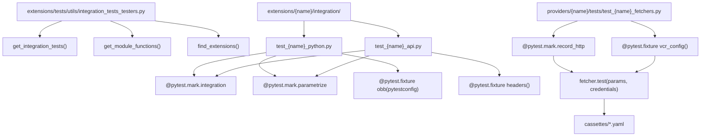
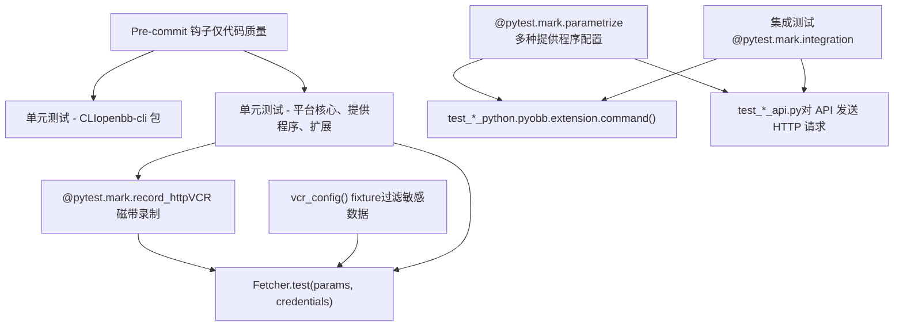
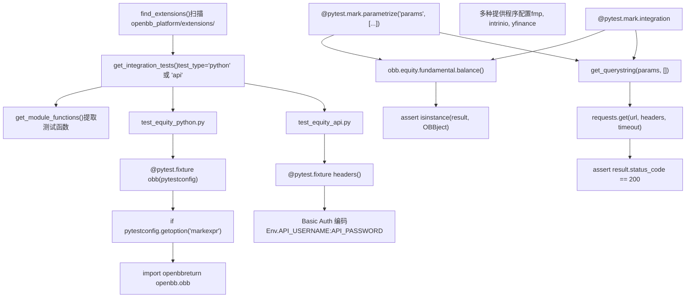
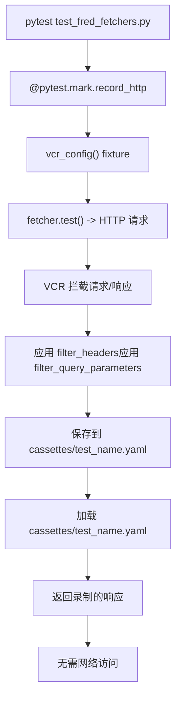
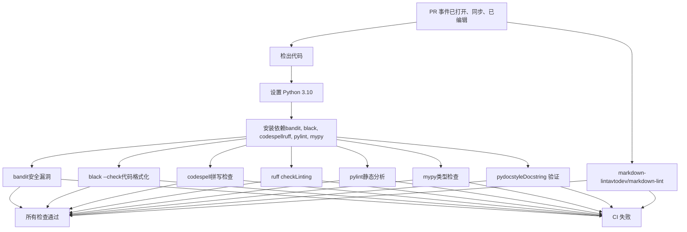
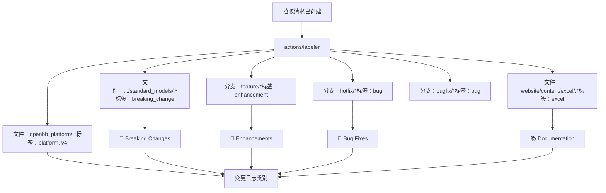
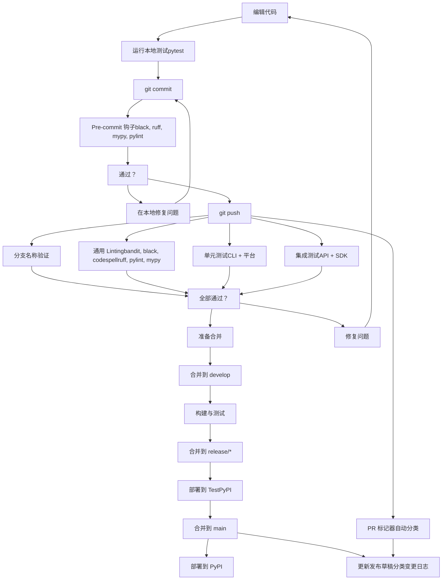

# 代码质量与测试

相关源文件

-   [.github/labeler.yml](https://github.com/OpenBB-finance/OpenBB/blob/dddc3b32/.github/labeler.yml)
-   [.github/platform-drafter.yml](https://github.com/OpenBB-finance/OpenBB/blob/dddc3b32/.github/platform-drafter.yml)
-   [.github/release-drafter.yml](https://github.com/OpenBB-finance/OpenBB/blob/dddc3b32/.github/release-drafter.yml)
-   [.github/workflows/README.md](https://github.com/OpenBB-finance/OpenBB/blob/dddc3b32/.github/workflows/README.md?plain=1)
-   [.pre-commit-config.yaml](https://github.com/OpenBB-finance/OpenBB/blob/dddc3b32/.pre-commit-config.yaml)
-   [README.md](https://github.com/OpenBB-finance/OpenBB/blob/dddc3b32/README.md?plain=1)
-   [openbb\_platform/core/openbb\_core/app/model/charts/chart.py](https://github.com/OpenBB-finance/OpenBB/blob/dddc3b32/openbb_platform/core/openbb_core/app/model/charts/chart.py)
-   [openbb\_platform/core/openbb\_core/provider/standard\_models/company\_filings.py](https://github.com/OpenBB-finance/OpenBB/blob/dddc3b32/openbb_platform/core/openbb_core/provider/standard_models/company_filings.py)
-   [openbb\_platform/core/openbb\_core/provider/standard\_models/primary\_dealer\_fails.py](https://github.com/OpenBB-finance/OpenBB/blob/dddc3b32/openbb_platform/core/openbb_core/provider/standard_models/primary_dealer_fails.py)
-   [openbb\_platform/core/tests/app/model/charts/test\_chart.py](https://github.com/OpenBB-finance/OpenBB/blob/dddc3b32/openbb_platform/core/tests/app/model/charts/test_chart.py)
-   [openbb\_platform/extensions/economy/integration/test\_economy\_api.py](https://github.com/OpenBB-finance/OpenBB/blob/dddc3b32/openbb_platform/extensions/economy/integration/test_economy_api.py)
-   [openbb\_platform/extensions/economy/integration/test\_economy\_python.py](https://github.com/OpenBB-finance/OpenBB/blob/dddc3b32/openbb_platform/extensions/economy/integration/test_economy_python.py)
-   [openbb\_platform/extensions/economy/openbb\_economy/economy\_router.py](https://github.com/OpenBB-finance/OpenBB/blob/dddc3b32/openbb_platform/extensions/economy/openbb_economy/economy_router.py)
-   [openbb\_platform/extensions/economy/openbb\_economy/survey/survey\_router.py](https://github.com/OpenBB-finance/OpenBB/blob/dddc3b32/openbb_platform/extensions/economy/openbb_economy/survey/survey_router.py)
-   [openbb\_platform/extensions/equity/integration/test\_equity\_api.py](https://github.com/OpenBB-finance/OpenBB/blob/dddc3b32/openbb_platform/extensions/equity/integration/test_equity_api.py)
-   [openbb\_platform/extensions/equity/integration/test\_equity\_python.py](https://github.com/OpenBB-finance/OpenBB/blob/dddc3b32/openbb_platform/extensions/equity/integration/test_equity_python.py)
-   [openbb\_platform/extensions/equity/openbb\_equity/fundamental/fundamental\_router.py](https://github.com/OpenBB-finance/OpenBB/blob/dddc3b32/openbb_platform/extensions/equity/openbb_equity/fundamental/fundamental_router.py)
-   [openbb\_platform/extensions/etf/integration/test\_etf\_api.py](https://github.com/OpenBB-finance/OpenBB/blob/dddc3b32/openbb_platform/extensions/etf/integration/test_etf_api.py)
-   [openbb\_platform/extensions/etf/integration/test\_etf\_python.py](https://github.com/OpenBB-finance/OpenBB/blob/dddc3b32/openbb_platform/extensions/etf/integration/test_etf_python.py)
-   [openbb\_platform/extensions/platform\_api/openbb\_platform\_api/assets/default\_apps.json](https://github.com/OpenBB-finance/OpenBB/blob/dddc3b32/openbb_platform/extensions/platform_api/openbb_platform_api/assets/default_apps.json)
-   [openbb\_platform/extensions/tests/test\_integration\_tests\_api.py](https://github.com/OpenBB-finance/OpenBB/blob/dddc3b32/openbb_platform/extensions/tests/test_integration_tests_api.py)
-   [openbb\_platform/extensions/tests/test\_integration\_tests\_python.py](https://github.com/OpenBB-finance/OpenBB/blob/dddc3b32/openbb_platform/extensions/tests/test_integration_tests_python.py)
-   [openbb\_platform/extensions/tests/utils/integration\_tests\_api\_generator.py](https://github.com/OpenBB-finance/OpenBB/blob/dddc3b32/openbb_platform/extensions/tests/utils/integration_tests_api_generator.py)
-   [openbb\_platform/extensions/tests/utils/integration\_tests\_testers.py](https://github.com/OpenBB-finance/OpenBB/blob/dddc3b32/openbb_platform/extensions/tests/utils/integration_tests_testers.py)
-   [openbb\_platform/providers/federal\_reserve/openbb\_federal\_reserve/\_\_init\_\_.py](https://github.com/OpenBB-finance/OpenBB/blob/dddc3b32/openbb_platform/providers/federal_reserve/openbb_federal_reserve/__init__.py)
-   [openbb\_platform/providers/federal\_reserve/openbb\_federal\_reserve/assets/historical\_releases.json](https://github.com/OpenBB-finance/OpenBB/blob/dddc3b32/openbb_platform/providers/federal_reserve/openbb_federal_reserve/assets/historical_releases.json)
-   [openbb\_platform/providers/federal\_reserve/openbb\_federal\_reserve/models/fomc\_documents.py](https://github.com/OpenBB-finance/OpenBB/blob/dddc3b32/openbb_platform/providers/federal_reserve/openbb_federal_reserve/models/fomc_documents.py)
-   [openbb\_platform/providers/federal\_reserve/openbb\_federal\_reserve/models/primary\_dealer\_fails.py](https://github.com/OpenBB-finance/OpenBB/blob/dddc3b32/openbb_platform/providers/federal_reserve/openbb_federal_reserve/models/primary_dealer_fails.py)
-   [openbb\_platform/providers/federal\_reserve/openbb\_federal\_reserve/models/primary\_dealer\_positioning.py](https://github.com/OpenBB-finance/OpenBB/blob/dddc3b32/openbb_platform/providers/federal_reserve/openbb_federal_reserve/models/primary_dealer_positioning.py)
-   [openbb\_platform/providers/federal\_reserve/openbb\_federal\_reserve/utils/fomc\_documents.py](https://github.com/OpenBB-finance/OpenBB/blob/dddc3b32/openbb_platform/providers/federal_reserve/openbb_federal_reserve/utils/fomc_documents.py)
-   [openbb\_platform/providers/federal\_reserve/openbb\_federal\_reserve/utils/primary\_dealer\_statistics.py](https://github.com/OpenBB-finance/OpenBB/blob/dddc3b32/openbb_platform/providers/federal_reserve/openbb_federal_reserve/utils/primary_dealer_statistics.py)
-   [openbb\_platform/providers/federal\_reserve/tests/record/http/test\_federal\_reserve\_fetchers/test\_federal\_reserve\_fomc\_documents\_fetcher\_urllib3\_v2.yaml](https://github.com/OpenBB-finance/OpenBB/blob/dddc3b32/openbb_platform/providers/federal_reserve/tests/record/http/test_federal_reserve_fetchers/test_federal_reserve_fomc_documents_fetcher_urllib3_v2.yaml)
-   [openbb\_platform/providers/federal\_reserve/tests/record/http/test\_federal\_reserve\_fetchers/test\_federal\_reserve\_primary\_dealer\_fails\_fetcher\_urllib3\_v2.yaml](https://github.com/OpenBB-finance/OpenBB/blob/dddc3b32/openbb_platform/providers/federal_reserve/tests/record/http/test_federal_reserve_fetchers/test_federal_reserve_primary_dealer_fails_fetcher_urllib3_v2.yaml)
-   [openbb\_platform/providers/federal\_reserve/tests/test\_federal\_reserve\_fetchers.py](https://github.com/OpenBB-finance/OpenBB/blob/dddc3b32/openbb_platform/providers/federal_reserve/tests/test_federal_reserve_fetchers.py)
-   [openbb\_platform/providers/fmp/openbb\_fmp/\_\_init\_\_.py](https://github.com/OpenBB-finance/OpenBB/blob/dddc3b32/openbb_platform/providers/fmp/openbb_fmp/__init__.py)
-   [openbb\_platform/providers/fmp/openbb\_fmp/models/company\_filings.py](https://github.com/OpenBB-finance/OpenBB/blob/dddc3b32/openbb_platform/providers/fmp/openbb_fmp/models/company_filings.py)
-   [openbb\_platform/providers/fmp/pyproject.toml](https://github.com/OpenBB-finance/OpenBB/blob/dddc3b32/openbb_platform/providers/fmp/pyproject.toml)
-   [openbb\_platform/providers/fmp/tests/test\_fmp\_fetchers.py](https://github.com/OpenBB-finance/OpenBB/blob/dddc3b32/openbb_platform/providers/fmp/tests/test_fmp_fetchers.py)
-   [openbb\_platform/providers/fred/openbb\_fred/\_\_init\_\_.py](https://github.com/OpenBB-finance/OpenBB/blob/dddc3b32/openbb_platform/providers/fred/openbb_fred/__init__.py)
-   [openbb\_platform/providers/fred/openbb\_fred/models/manufacturing\_outlook\_ny.py](https://github.com/OpenBB-finance/OpenBB/blob/dddc3b32/openbb_platform/providers/fred/openbb_fred/models/manufacturing_outlook_ny.py)
-   [openbb\_platform/providers/fred/tests/record/http/test\_fred\_fetchers/test\_fred\_manufacturing\_outlook\_ny\_fetcher\_urllib3\_v2.yaml](https://github.com/OpenBB-finance/OpenBB/blob/dddc3b32/openbb_platform/providers/fred/tests/record/http/test_fred_fetchers/test_fred_manufacturing_outlook_ny_fetcher_urllib3_v2.yaml)
-   [openbb\_platform/providers/fred/tests/test\_fred\_fetchers.py](https://github.com/OpenBB-finance/OpenBB/blob/dddc3b32/openbb_platform/providers/fred/tests/test_fred_fetchers.py)
-   [openbb\_platform/providers/intrinio/openbb\_intrinio/\_\_init\_\_.py](https://github.com/OpenBB-finance/OpenBB/blob/dddc3b32/openbb_platform/providers/intrinio/openbb_intrinio/__init__.py)
-   [openbb\_platform/providers/intrinio/openbb\_intrinio/models/company\_filings.py](https://github.com/OpenBB-finance/OpenBB/blob/dddc3b32/openbb_platform/providers/intrinio/openbb_intrinio/models/company_filings.py)
-   [openbb\_platform/providers/intrinio/tests/test\_intrinio\_fetchers.py](https://github.com/OpenBB-finance/OpenBB/blob/dddc3b32/openbb_platform/providers/intrinio/tests/test_intrinio_fetchers.py)
-   [openbb\_platform/providers/sec/openbb\_sec/\_\_init\_\_.py](https://github.com/OpenBB-finance/OpenBB/blob/dddc3b32/openbb_platform/providers/sec/openbb_sec/__init__.py)
-   [openbb\_platform/providers/sec/openbb\_sec/utils/form4.py](https://github.com/OpenBB-finance/OpenBB/blob/dddc3b32/openbb_platform/providers/sec/openbb_sec/utils/form4.py)
-   [openbb\_platform/providers/sec/tests/test\_sec\_fetchers.py](https://github.com/OpenBB-finance/OpenBB/blob/dddc3b32/openbb_platform/providers/sec/tests/test_sec_fetchers.py)
-   [openbb\_platform/providers/tmx/openbb\_tmx/models/company\_filings.py](https://github.com/OpenBB-finance/OpenBB/blob/dddc3b32/openbb_platform/providers/tmx/openbb_tmx/models/company_filings.py)

本文件介绍了 OpenBB Platform 中使用的代码质量执行机制、测试策略和开发标准。它详细说明了确保整个代码库一致性和可靠性的 pre-commit 钩子、linting 工具、类型检查系统和测试执行工作流。

有关 CI/CD 部署流水线的信息，请参阅 [CI/CD 流水线](/OpenBB-finance/OpenBB/5.1-python-sdk)。有关遵循这些质量标准创建新扩展的指南，请参阅 [创建扩展](/OpenBB-finance/OpenBB/5.3-openbb-workspace-integration)。

---

## Pre-commit 钩子系统

OpenBB Platform 通过 [.pre-commit-config.yaml1-95](https://github.com/OpenBB-finance/OpenBB/blob/dddc3b32/.pre-commit-config.yaml#L1-L95) 中配置的自动 pre-commit 钩子系统来强制执行代码质量标准。该系统在允许提交之前运行多项验证检查，确保所有代码在进入存储库之前都符合质量标准。

### 钩子执行流程

```mermaid
flowchart TD
    GitCommit["git commit"]
    PreCommitFramework["pre-commit run"]
    CheckYAML["check-yaml"]
    EndOfFile["end-of-file-fixer"]
    TrailingWS["trailing-whitespace"]
    MergeConflict["check-merge-conflict"]
    DetectPrivKey["detect-private-key"]
    BlackFormat["black --check"]
    RuffLint["ruff check"]
    Pydocstyle["pydocstyle--config=ruff.tomlfiles: openbb_platform/|cli/"]
    Codespell["codespell--ignore-words=.codespell.ignore"]
    MypyCheck["mypy--ignore-missing-imports--check-untyped-defs"]
    PylintLocal["pylintsystem installation"]
    CheckGenFiles["check-generated-filesbash script"]
    DetectSecrets["detect-secrets--baseline .secrets.baseline"]
    Nbstripout["nbstripout"]
    Success["提交成功"]
    Fail["提交被阻止"]

    GitCommit --> PreCommitFramework
    PreCommitFramework --> CheckYAML
    PreCommitFramework --> EndOfFile
    PreCommitFramework --> TrailingWS
    PreCommitFramework --> MergeConflict
    PreCommitFramework --> DetectPrivKey
    PreCommitFramework --> BlackFormat
    PreCommitFramework --> RuffLint
    PreCommitFramework --> Pydocstyle
    PreCommitFramework --> Codespell
    PreCommitFramework --> MypyCheck
    PreCommitFramework --> PylintLocal
    PreCommitFramework --> DetectSecrets
    PreCommitFramework --> Nbstripout
    PreCommitFramework --> CheckGenFiles
    CheckYAML --> Success
    EndOfFile --> Success
    TrailingWS --> Success
    MergeConflict --> Fail
    DetectPrivKey --> Fail
    BlackFormat --> Success
    RuffLint --> Success
    Pydocstyle --> Success
    Codespell --> Success
    MypyCheck --> Success
    PylintLocal --> Success
    DetectSecrets --> Fail
    Nbstripout --> Success
    CheckGenFiles --> Fail
```


来源：[.pre-commit-config.yaml1-95](https://github.com/OpenBB-finance/OpenBB/blob/dddc3b32/.pre-commit-config.yaml#L1-L95)

<old\_str>

**Pytest 标记：**

| 标记 | 用途 | 使用位置 | 示例 |
| --- | --- | --- | --- |
| `@pytest.mark.integration` | 端到端 SDK/API 测试 | `extensions/*/integration/` | [openbb\_platform/extensions/equity/integration/test\_equity_python.py52](https://github.com/OpenBB-finance/OpenBB/blob/dddc3b32/openbb_platform/extensions/equity/integration/test_equity_python.py#L52-L52) |
| `@pytest.mark.record_http` | VCR 磁带录制 | `providers/*/tests/` | [openbb\_platform/providers/fred/tests/test\_fred_fetchers.py78](https://github.com/OpenBB-finance/OpenBB/blob/dddc3b32/openbb_platform/providers/fred/tests/test_fred_fetchers.py#L78-L78) |
| `@pytest.mark.parametrize` | 多种测试配置 | 所有测试文件 | [openbb\_platform/extensions/equity/integration/test\_equity_python.py21](https://github.com/OpenBB-finance/OpenBB/blob/dddc3b32/openbb_platform/extensions/equity/integration/test_equity_python.py#L21-L21) |

来源：[openbb\_platform/extensions/equity/integration/test\_equity_python.py1-80](https://github.com/OpenBB-finance/OpenBB/blob/dddc3b32/openbb_platform/extensions/equity/integration/test_equity_python.py#L1-L80) [openbb\_platform/providers/fred/tests/test\_fred_fetchers.py1-85](https://github.com/OpenBB-finance/OpenBB/blob/dddc3b32/openbb_platform/providers/fred/tests/test_fred_fetchers.py#L1-L85) [openbb\_platform/extensions/tests/utils/integration\_tests\_testers.py1-200](https://github.com/OpenBB-finance/OpenBB/blob/dddc3b32/openbb_platform/extensions/tests/utils/integration_tests_testers.py#L1-L200) </old\_str> <new\_str>

### 测试类别与标记

**测试目录结构：**

```
openbb_platform/
├── providers/
│   ├── fmp/tests/test_fmp_fetchers.py
│   ├── fred/tests/test_fred_fetchers.py
│   ├── intrinio/tests/test_intrinio_fetchers.py
│   └── sec/tests/test_sec_fetchers.py
├── extensions/
│   ├── equity/integration/
│   │   ├── test_equity_python.py
│   │   └── test_equity_api.py
│   ├── economy/integration/
│   │   ├── test_economy_python.py
│   │   └── test_economy_api.py
│   └── tests/utils/integration_tests_testers.py
└── core/tests/
```

### 代码格式化工具

#### Black

`black` 代码格式化工具自动执行一致的 Python 代码风格。它运行在所有 Python 文件上，并根据 Black 风格指南对它们进行重新格式化。

**配置：**

-   版本：`25.1.0`
-   存储库：`https://github.com/psf/black`
-   自动修复：是
-   应用于：所有 `.py` 文件

来源：[.pre-commit-config.yaml13-16](https://github.com/OpenBB-finance/OpenBB/blob/dddc3b32/.pre-commit-config.yaml#L13-L16)

#### Ruff

`ruff` linter 提供具有自动修复功能的快速 Python linting。它结合了多个 linter 的功能，包括 Flake8、isort 和 pydocstyle。

**配置：**

-   版本：`v0.12.12`
-   存储库：`https://github.com/charliermarsh/ruff-pre-commit`
-   自动修复：是
-   应用于：所有 Python 文件

来源：[.pre-commit-config.yaml17-20](https://github.com/OpenBB-finance/OpenBB/blob/dddc3b32/.pre-commit-config.yaml#L17-L20)

### 文档验证工具

#### Pydocstyle

`pydocstyle` 工具验证所有 docstring 是否遵循配置的风格约定。

**配置：**

-   版本：`6.3.0`
-   配置文件：`ruff.toml`
-   文件模式：`'^(openbb_platform/|cli/).*\.py$'`
-   排除：测试文件 (`tests/.*\.py`, `test_.*\.py`)
-   附加依赖：`tomli`

**关键参数：**

```
--config=ruff.toml
```
来源：[.pre-commit-config.yaml21-32](https://github.com/OpenBB-finance/OpenBB/blob/dddc3b32/.pre-commit-config.yaml#L21-L32)

#### Codespell

`codespell` 工具检查代码注释、字符串和文档中的常见拼写错误。

**配置：**

-   版本：`v2.4.1`
-   忽略列表：`.codespell.ignore`
-   静默级别：2
-   排除模式：测试、构建产物、配置文件、笔记本、Web 资产

**关键参数：**

```
--ignore-words=.codespell.ignore--quiet-level=2--skip=./**/tests/**,./**/test_*.py,.git,*.css,*.csv,*.html,*.ini,*.ipynb,*.js,*.json,*.lock,*.scss,*.txt,*.yaml
```
来源：[.pre-commit-config.yaml33-44](https://github.com/OpenBB-finance/OpenBB/blob/dddc3b32/.pre-commit-config.yaml#L33-L44)

### 类型检查

#### Mypy

`mypy` 类型检查器验证类型注解并执行静态类型分析。

**配置：**

-   版本：`v1.15.0`
-   存储库：`https://github.com/pre-commit/mirrors-mypy`
-   附加类型存根：`types-requests`, `types-setuptools`, `types-python-dateutil`, `types-pytz`
-   排除：测试文件 (`test_.*\.py`)
-   要求串行：是

**关键参数：**

```
--ignore-missing-imports--scripts-are-modules--check-untyped-defs
```
来源：[.pre-commit-config.yaml45-57](https://github.com/OpenBB-finance/OpenBB/blob/dddc3b32/.pre-commit-config.yaml#L45-L57)

### 静态分析

#### Pylint

`pylint` 工具执行全面的静态代码分析，以检测错误、代码异味和风格问题。

**配置：**

-   本地系统安装
-   语言：Python
-   应用于：所有 Python 文件

这配置为本地钩子，意味着它使用开发人员环境中安装的 `pylint` 版本。

来源：[.pre-commit-config.yaml65-69](https://github.com/OpenBB-finance/OpenBB/blob/dddc3b32/.pre-commit-config.yaml#L65-L69)

### 安全与清理工具

#### Detect Secrets

`detect-secrets` 工具防止意外提交 API 密钥、密码和其他敏感信息。

**配置：**

-   版本：`v1.5.0`
-   基准文件：`.secrets.baseline`
-   排除：测试磁带、录制、生成的 API 文档、图表资产

**关键参数：**

```
--baseline .secrets.baseline--exclude-files cassettes/.*|record/.*|website/content/api/.*|openbb_platform/extensions/charting/openbb_charting/infrastructure/assets/.*\.js
```
来源：[.pre-commit-config.yaml83-94](https://github.com/OpenBB-finance/OpenBB/blob/dddc3b32/.pre-commit-config.yaml#L83-L94)

#### Nbstripout

`nbstripout` 工具在提交前从 Jupyter 笔记本中剥离输出，保持存储库清洁并减少 diff 噪声。

**配置：**

-   版本：`0.8.1`
-   应用于：所有 `.ipynb` 文件

来源：[.pre-commit-config.yaml58-62](https://github.com/OpenBB-finance/OpenBB/blob/dddc3b32/.pre-commit-config.yaml#L58-L62)

### 自定义验证钩子

#### 检查生成的文件

自定义 bash 脚本防止提交生成的包文件。OpenBB Platform 在 `openbb_platform/core/openbb/package/` 中动态生成 Python 模块，这些模块绝不应提交到 git。

**实现：**

```
if git ls-files | grep "^openbb_platform/core/openbb/package/" | grep -v "^openbb_platform/core/openbb/package/__init__\.py$"; then  echo "Error: Attempting to commit generated files in package directory. Only __init__.py should exist."  exit 1fi
```
**原理：** 包目录内容由 PackageBuilder 在安装期间根据已安装的扩展生成。提交这些文件会导致冲突和不一致。

来源：[.pre-commit-config.yaml70-82](https://github.com/OpenBB-finance/OpenBB/blob/dddc3b32/.pre-commit-config.yaml#L70-L82)

---

## 测试策略

OpenBB Platform 实施了全面的测试策略，在开发工作流的不同阶段执行多个测试层。

### 测试类别与标记


**Pytest 标记：**

| 标记 | 用途 | 示例 |
| --- | --- | --- |
| `@pytest.mark.integration` | 需要 API 服务器的端到端测试 | [openbb\_platform/extensions/equity/integration/test\_equity_python.py73](https://github.com/OpenBB-finance/OpenBB/blob/dddc3b32/openbb_platform/extensions/equity/integration/test_equity_python.py#L73-L73) |
| `@pytest.mark.record_http` | 使用 VCR 进行 HTTP 录制 | [openbb\_platform/providers/fred/tests/test\_fred_fetchers.py77](https://github.com/OpenBB-finance/OpenBB/blob/dddc3b32/openbb_platform/providers/fred/tests/test_fred_fetchers.py#L77-L77) |
| `@pytest.mark.parametrize` | 多种测试配置 | [openbb\_platform/extensions/equity/integration/test\_equity_python.py21-72](https://github.com/OpenBB-finance/OpenBB/blob/dddc3b32/openbb_platform/extensions/equity/integration/test_equity_python.py#L21-L72) |

来源：[openbb\_platform/extensions/equity/integration/test\_equity_python.py1-80](https://github.com/OpenBB-finance/OpenBB/blob/dddc3b32/openbb_platform/extensions/equity/integration/test_equity_python.py#L1-L80) [openbb\_platform/providers/fred/tests/test\_fred_fetchers.py1-85](https://github.com/OpenBB-finance/OpenBB/blob/dddc3b32/openbb_platform/providers/fred/tests/test_fred_fetchers.py#L1-L85)

### 单元测试

单元测试独立验证单个组件。该平台使用 `pytest` 作为测试框架，并配合专门的 fixture 和模式。

#### 提供程序单元测试

提供程序测试使用 **VCR (Video Cassette Recorder)** 模式来录制和回放 HTTP 请求，从而验证 fetcher 的实现。每个提供程序的 fetcher 都实现了基础 `Fetcher` 类中定义的 `test()` 方法。

**结合 Fetcher.test() 的 VCR 测试模式：**

```
# 文件：openbb_platform/providers/fred/tests/test_fred_fetchers.py
from openbb_core.app.service.user_service import UserService
from openbb_fred.models.consumer_price_index import FREDConsumerPriceIndexFetcher

test_credentials = UserService().default_user_settings.credentials.model_dump(mode="json")

@pytest.fixture(scope="module")
def vcr_config():
    """VCR 配置。"""
    return {
        "filter_headers": [("User-Agent", None)],
        "filter_query_parameters": [
            ("api_key", "MOCK_API_KEY"),
        ],
    }

@pytest.mark.record_http
def test_fredcpi_fetcher(credentials=test_credentials):
    """测试 FREDConsumerPriceIndexFetcher。"""
    params = {"country": "portugal,spain"}
    fetcher = FREDConsumerPriceIndexFetcher()
    result = fetcher.test(params, credentials)  # 调用 Fetcher.test() 基础方法
    assert result is None  # test() 成功时返回 None，失败时抛出异常
```
**Fetcher 测试方法流程：**

`Fetcher.test()` 方法执行完整的获取周期：

1.  `transform_query()` - 验证并转换输入参数
2.  `extract_data()` 或 `aextract_data()` - 发起 HTTP 请求（由 VCR 录制）
3.  `transform_data()` - 根据数据模型解析并验证响应

**VCR 配置模式：**

| 提供程序 | 过滤请求头 | 过滤查询参数 | 响应过滤器 |
| --- | --- | --- | --- |
| FRED | `User-Agent` | `api_key` | 无 |
| FMP | `User-Agent` | `apikey` | `Location` 响应头（重定向 URL） |
| Intrinio | `User-Agent` | `api_key`, `X-Amz-*` | 无 |
| SEC | `User-Agent` | 无 | 无 |

**提供程序测试文件结构：**

| 提供程序 | 测试文件路径 | Fetcher 数量 | 示例测试 |
| --- | --- | --- | --- |
| FRED | `providers/fred/tests/test_fred_fetchers.py` | 42+ | `test_fredcpi_fetcher()` |
| FMP | `providers/fmp/tests/test_fmp_fetchers.py` | 60+ | `test_fmp_equity_historical_fetcher()` |
| Intrinio | `providers/intrinio/tests/test_intrinio_fetchers.py` | 30+ | `test_intrinio_equity_historical_fetcher()` |
| SEC | `providers/sec/tests/test_sec_fetchers.py` | 15+ | `test_sec_company_filings_fetcher()` |

**磁带存储：** 录制的 HTTP 交互保存为 YAML 文件：

```
providers/{provider_name}/tests/cassettes/
└── test_{fetcher_name}.yaml
```
来源：[openbb\_platform/providers/fred/tests/test\_fred\_fetchers.py62-85](https://github.com/OpenBB-finance/OpenBB/blob/dddc3b32/openbb_platform/providers/fred/tests/test_fred_fetchers.py#L62-L85) [openbb\_platform/providers/fmp/tests/test\_fmp\_fetchers.py83-119](https://github.com/OpenBB-finance/OpenBB/blob/dddc3b32/openbb_platform/providers/fmp/tests/test_fmp_fetchers.py#L83-L119) [openbb\_platform/providers/intrinio/tests/test\_intrinio\_fetchers.py75-114](https://github.com/OpenBB-finance/OpenBB/blob/dddc3b32/openbb_platform/providers/intrinio/tests/test_intrinio_fetchers.py#L75-L114) [openbb\_platform/providers/sec/tests/test\_sec\_fetchers.py40-48](https://github.com/OpenBB-finance/OpenBB/blob/dddc3b32/openbb_platform/providers/sec/tests/test_sec_fetchers.py#L40-L48)

#### CLI 单元测试

CLI 接口的测试验证命令解析、参数处理和执行流程。

**工作流：** 单元测试 CLI **目录：** `cli/` **执行：** 在拉取请求和功能分支上触发

来源：[.github/workflows/README.md94-96](https://github.com/OpenBB-finance/OpenBB/blob/dddc3b32/.github/workflows/README.md?plain=1#L94-L96)

#### 核心与扩展单元测试

核心测试验证基础平台组件，而扩展测试侧重于路由器命令的实现。

**测试排除：** Pre-commit 钩子从某些检查中排除测试文件：

-   Pydocstyle: `tests/.*\.py|openbb_platform/test_.*\.py`
-   Mypy: `test_.*\.py`

来源：[.github/workflows/README.md98-100](https://github.com/OpenBB-finance/OpenBB/blob/dddc3b32/.github/workflows/README.md?plain=1#L98-L100) [.pre-commit-config.yaml31](https://github.com/OpenBB-finance/OpenBB/blob/dddc3b32/.pre-commit-config.yaml#L31-L31) [.pre-commit-config.yaml57](https://github.com/OpenBB-finance/OpenBB/blob/dddc3b32/.pre-commit-config.yaml#L57-L57)

### 集成测试

集成测试使用参数化的测试配置，跨 Python SDK 和 REST API 接口验证端到端功能。测试使用 `integration_tests_testers.py` 中的实用工具自动发现并验证。

**集成测试结构：**


**Python SDK 集成测试：**

集成测试使用 `obb` fixture 来测试动态生成的 Python SDK：

```
# 文件：openbb_platform/extensions/equity/integration/test_equity_python.py
from openbb_core.app.model.obbject import OBBject

@pytest.fixture(scope="session")
def obb(pytestconfig):
    """设置 obb 的 fixture。"""
    if pytestconfig.getoption("markexpr") != "not integration":
        import openbb  # 导入动态生成的 SDK
        return openbb.obb

@pytest.mark.parametrize(
    "params",
    [
        ({"symbol": "AAPL", "period": "annual", "limit": 12}),
        ({"provider": "intrinio", "symbol": "AAPL", "period": "quarter", "fiscal_year": 2014, "limit": 2}),
        ({"symbol": "AAPL", "period": "annual", "limit": 12, "provider": "fmp"}),
    ],
)
@pytest.mark.integration
def test_equity_fundamental_balance(params, obb):
    """测试股票基本面资产负债表端点。"""
    result = obb.equity.fundamental.balance(**params)  # 调用生成的 SDK 方法
    assert result
    assert isinstance(result, OBBject)
    assert len(result.results) > 0
```
**REST API 集成测试：**

API 测试验证具有基本身份验证 (Basic Auth) 的 FastAPI 服务器端点：

```
# 文件：openbb_platform/extensions/equity/integration/test_equity_api.py
import base64
import requests
from openbb_core.env import Env
from openbb_core.provider.utils.helpers import get_querystring

@pytest.fixture(scope="session")
def headers():
    """获取 API 请求头。"""
    userpass = f"{Env().API_USERNAME}:{Env().API_PASSWORD}"
    userpass_bytes = userpass.encode("ascii")
    base64_bytes = base64.b64encode(userpass_bytes)
    return {"Authorization": f"Basic {base64_bytes.decode('ascii')}"}

@pytest.mark.parametrize(
    "params",
    [
        ({"symbol": "AAPL", "period": "annual", "limit": 12, "provider": "fmp"}),
        ({"provider": "intrinio", "symbol": "AAPL", "period": "annual", "fiscal_year": None, "limit": 2}),
    ],
)
@pytest.mark.integration
def test_equity_fundamental_balance(params, headers):
    """测试股票基本面资产负债表端点。"""
    params = {p: v for p, v in params.items() if v}
    query_str = get_querystring(params, [])
    url = f"http://0.0.0.0:8000/api/v1/equity/fundamental/balance?{query_str}"
    result = requests.get(url, headers=headers, timeout=10)
    assert isinstance(result, requests.Response)
    assert result.status_code == 200
```
**集成测试覆盖范围：**

| 扩展 | Python 测试文件 | API 测试文件 | 测试函数 |
| --- | --- | --- | --- |
| Equity | `extensions/equity/integration/test_equity_python.py` | `extensions/equity/integration/test_equity_api.py` | 80+ |
| Economy | `extensions/economy/integration/test_economy_python.py` | `extensions/economy/integration/test_economy_api.py` | 40+ |
| ETF | `extensions/etf/integration/test_etf_python.py` | `extensions/etf/integration/test_etf_api.py` | 25+ |

**测试发现实用工具：**

`integration_tests_testers.py` 模块提供了发现并验证集成测试的实用工具：

```
# 文件：openbb_platform/extensions/tests/utils/integration_tests_testers.py
def get_integration_tests(test_type: Literal["api", "python"],
                           filter_charting_ext: bool | None = True) -> list[Any]:
    """获取 OpenBB Platform 的集成测试。"""
    # 发现匹配 test_*_{test_type}.py 模式的测试文件
    # 返回导入的测试模块列表

def get_module_functions(module_list: list[Any]) -> dict[str, Any]:
    """从模块中提取测试函数。"""
    # 返回从函数名到可调用对象的映射

def find_extensions(filter_charting_ext: bool | None = True) -> list[str]:
    """查找所有扩展目录。"""
    # 在 openbb_platform/extensions/ 中扫描 integration 文件夹
```
来源：[openbb\_platform/extensions/equity/integration/test\_equity_python.py12-58](https://github.com/OpenBB-finance/OpenBB/blob/dddc3b32/openbb_platform/extensions/equity/integration/test_equity_python.py#L12-L58) [openbb\_platform/extensions/equity/integration/test\_equity\_api.py13-64](https://github.com/OpenBB-finance/OpenBB/blob/dddc3b32/openbb_platform/extensions/equity/integration/test_equity_api.py#L13-L64) [openbb\_platform/extensions/tests/utils/integration\_tests\_testers.py18-60](https://github.com/OpenBB-finance/OpenBB/blob/dddc3b32/openbb_platform/extensions/tests/utils/integration_tests_testers.py#L18-L60)

### VCR 磁带录制

该平台配合 pytest-recording 使用 VCR (Video Cassette Recorder)，在提供程序测试期间录制 HTTP 交互。`@pytest.mark.record_http` 标记会触发磁带录制。

**VCR 录制流程：**


**VCR 配置示例：**

```
# FRED 提供程序 - 基础 API 密钥过滤
@pytest.fixture(scope="module")
def vcr_config():
    return {
        "filter_headers": [("User-Agent", None)],
        "filter_query_parameters": [("api_key", "MOCK_API_KEY")],
    }

# Intrinio 提供程序 - AWS 签名过滤
@pytest.fixture(scope="module")
def vcr_config():
    return {
        "filter_headers": [("User-Agent", None)],
        "filter_query_parameters": [
            ("api_key", "MOCK_API_KEY"),
            ("X-Amz-Algorithm", "MOCK_X-Amz-Algorithm"),
            ("X-Amz-Credential", "MOCK_X-Amz-Credential"),
            ("X-Amz-Date", "MOCK_X-Amz-Date"),
            ("X-Amz-Expires", "MOCK_X-Amz-Expires"),
            ("X-Amz-SignedHeaders", "MOCK_X-Amz-SignedHeaders"),
            ("X-Amz-Signature", "MOCK_X-Amz-Signature"),
        ],
    }

# FMP 提供程序 - 用于重定向的响应过滤
def response_filter(response):
    if "Location" in response["headers"]:
        response["headers"]["Location"] = [
            re.sub(r"apikey=[^&]+", "apikey=MOCK_API_KEY", x)
            for x in response["headers"]["Location"]
        ]
    return response

@pytest.fixture(scope="module")
def vcr_config():
    return {
        "filter_headers": [("User-Agent", None)],
        "filter_query_parameters": [("apikey", "MOCK_API_KEY")],
        "before_record_response": response_filter,
    }
```
**磁带文件结构：**

```
# cassettes/test_fred_series_fetcher.yaml
interactions:
- request:
    method: GET
    uri: https://api.stlouisfed.org/fred/series/observations?series_id=SP500&api_key=MOCK_API_KEY
  response:
    status:
      code: 200
    body:
      string: '{"observations": [...]}'
version: 1
```
**磁带存储位置：**

| 提供程序 | 磁带目录 | 已从 Secrets 排除 |
| --- | --- | --- |
| 所有提供程序 | `providers/{name}/tests/cassettes/*.yaml` | 是 - [.pre-commit-config.yaml92](https://github.com/OpenBB-finance/OpenBB/blob/dddc3b32/.pre-commit-config.yaml#L92-L92) |
| 集成测试 | `extensions/{name}/integration/cassettes/*.yaml` | 是 - [.pre-commit-config.yaml92](https://github.com/OpenBB-finance/OpenBB/blob/dddc3b32/.pre-commit-config.yaml#L92-L92) |

来源：[openbb\_platform/providers/fred/tests/test\_fred\_fetchers.py67-75](https://github.com/OpenBB-finance/OpenBB/blob/dddc3b32/openbb_platform/providers/fred/tests/test_fred_fetchers.py#L67-L75) [openbb\_platform/providers/intrinio/tests/test\_intrinio\_fetchers.py75-89](https://github.com/OpenBB-finance/OpenBB/blob/dddc3b32/openbb_platform/providers/intrinio/tests/test_intrinio_fetchers.py#L75-L89) [openbb\_platform/providers/fmp/tests/test\_fmp\_fetchers.py83-102](https://github.com/OpenBB-finance/OpenBB/blob/dddc3b32/openbb_platform/providers/fmp/tests/test_fmp_fetchers.py#L83-L102) [.pre-commit-config.yaml92](https://github.com/OpenBB-finance/OpenBB/blob/dddc3b32/.pre-commit-config.yaml#L92-L92)

---

## CI/CD 质量关卡

OpenBB Platform 通过在 GitHub Actions 上运行的多个自动化工作流来确保质量。

### Linting 工作流

通用 linting 工作流在拉取请求和功能分支上运行全面的代码质量检查。


**触发条件：**

-   拉取请求事件：`opened`, `synchronize`, `edited`
-   推送到分支：`feature/*`, `hotfix/*`, `release/*`

**执行工具：**

1.  `bandit` - 安全漏洞扫描
2.  `black --check` - 代码格式验证
3.  `codespell` - 拼写验证
4.  `ruff` - 快速 linting
5.  `pylint` - 静态代码分析
6.  `mypy` - 类型检查
7.  `pydocstyle` - Docstring 验证

来源：[.github/workflows/README.md65-84](https://github.com/OpenBB-finance/OpenBB/blob/dddc3b32/.github/workflows/README.md?plain=1#L65-L84)

### 分支名称验证

该平台对分支实施 GitFlow 命名约定。

**有效分支模式：**

| 分支类型 | 模式 | 用途 |
| --- | --- | --- |
| 功能 | `feature/<feature-name>` | 新功能 |
| 热修复 | `hotfix/<hotfix-name>` | 紧急错误修复 |
| 发布 | `release/<major.minor.patch>(rc<number>)` | 发布准备 |

**验证规则：**

-   向 `develop` 发起的 PR：源分支必须符合 feature、hotfix 或 release 模式
-   向 `main` 发起的 PR：源分支必须仅为 hotfix 或 release

来源：[.github/workflows/README.md9-31](https://github.com/OpenBB-finance/OpenBB/blob/dddc3b32/.github/workflows/README.md?plain=1#L9-L31) [README.md126-144](https://github.com/OpenBB-finance/OpenBB/blob/dddc3b32/README.md?plain=1#L126-L144)

### 自动 PR 标记

该平台根据文件路径和分支模式自动为拉取请求应用标签。


**标签配置：**

| 文件模式 | 应用的标签 |
| --- | --- |
| `openbb_platform/.*` | `platform`, `v4` |
| `website/content/excel/.*` | `excel` |
| `.../standard_models/.*` | `breaking_change` |

| 分支模式 | 应用的标签 |
| --- | --- |
| `feature/*` | `enhancement` |
| `hotfix/*` | `bug` |
| `bugfix/*` | `bug` |

来源：[.github/labeler.yml1-28](https://github.com/OpenBB-finance/OpenBB/blob/dddc3b32/.github/labeler.yml#L1-L28) [.github/workflows/README.md86-88](https://github.com/OpenBB-finance/OpenBB/blob/dddc3b32/.github/workflows/README.md?plain=1#L86-L88)

### 发布草稿生成

发布草稿器会根据 PR 标签自动生成并分类变更日志。

**变更日志类别：**

| 类别 | 标签 | 描述 |
| --- | --- | --- |
| 🚨 OpenBB Platform Breaking Changes | `breaking_change` | 破坏 API 的更改 |
| 🦋 OpenBB Platform Enhancements | `platform`, `v4` | 新功能 |
| 🐛 OpenBB Platform Bug Fixes | `bug` | 错误修复 |
| 📚 OpenBB Documentation Changes | `docs` | 文档更新 |

**变更格式：**

```
- $TITLE @$AUTHOR (#$NUMBER)
```
**排除的贡献者：** 核心团队成员被排除在“新贡献者”部分之外，以突出社区贡献。

来源：[.github/release-drafter.yml1-49](https://github.com/OpenBB-finance/OpenBB/blob/dddc3b32/.github/release-drafter.yml#L1-L49) [.github/platform-drafter.yml1-49](https://github.com/OpenBB-finance/OpenBB/blob/dddc3b32/.github/platform-drafter.yml#L1-L49)

---

## 代码标准与约定

OpenBB Platform 执行特定的编码标准，以维持整个代码库的一致性和质量。

### 文件结构标准

#### 包目录保护

`openbb_platform/core/openbb/package/` 目录包含动态生成的代码，绝不应提交（`__init__.py` 除外）。

**执行机制：**

```
# Pre-commit 钩子：check-generated-files
if git ls-files | grep "^openbb_platform/core/openbb/package/" | grep -v "^openbb_platform/core/openbb/package/__init__\.py$"; then  echo "Error: Attempting to commit generated files in package directory. Only __init__.py should exist."  exit 1fi
```
来源：[.pre-commit-config.yaml70-82](https://github.com/OpenBB-finance/OpenBB/blob/dddc3b32/.pre-commit-config.yaml#L70-L82)

### Python 代码标准

#### 导入组织

导入由 `ruff` 自动组织，其中包含 isort 功能。

#### 类型注解

所有函数都应包含类型注解。`mypy` 检查器验证：

-   函数参数类型
-   返回类型注解
-   类型一致性
-   Optional/Union 类型的使用

**Mypy 配置：**

```
--ignore-missing-imports  # 允许没有存根的导入
--scripts-are-modules     # 将脚本视为模块
--check-untyped-defs      # 检查没有注解的函数
```
来源：[.pre-commit-config.yaml54](https://github.com/OpenBB-finance/OpenBB/blob/dddc3b32/.pre-commit-config.yaml#L54-L54)

#### Docstring 格式

Docstring 必须遵循 `ruff.toml` 中定义的配置 pydocstyle 约定。

**范围：**

-   `openbb_platform/` 中的所有函数
-   `cli/` 中的所有函数
-   排除测试文件

来源：[.pre-commit-config.yaml30-32](https://github.com/OpenBB-finance/OpenBB/blob/dddc3b32/.pre-commit-config.yaml#L30-L32)

### 安全标准

#### Secret 检测

`detect-secrets` 工具防止提交敏感信息。

**基准文件：** `.secrets.baseline`

**排除模式：**

-   测试磁带和录像
-   生成的 API 文档
-   图表基础设施资产

**检测模式：**

-   API 密钥
-   密码
-   私钥
-   令牌 (Tokens)
-   连接字符串

来源：[.pre-commit-config.yaml83-94](https://github.com/OpenBB-finance/OpenBB/blob/dddc3b32/.pre-commit-config.yaml#L83-L94)

#### 安全扫描

`bandit` 工具在 CI 期间扫描 Python 代码中的常见安全问题。

**检测到的常见问题：**

-   硬编码密码
-   SQL 注入漏洞
-   Shell 注入风险
-   弱加密使用
-   不安全的 YAML 加载

来源：[.github/workflows/README.md76](https://github.com/OpenBB-finance/OpenBB/blob/dddc3b32/.github/workflows/README.md?plain=1#L76-L76)

---

## 质量指标

OpenBB Platform 通过 CI/CD 流水线中可见的各种指标来跟踪代码质量。

### 覆盖率与指标表

| 指标 | 工具 | 执行级别 |
| --- | --- | --- |
| 代码格式化 | black | 阻塞 (pre-commit + CI) |
| Linting | ruff | 阻塞 (pre-commit + CI) |
| 类型安全 | mypy | 阻塞 (pre-commit + CI) |
| 静态分析 | pylint | 阻塞 (pre-commit + CI) |
| 安全扫描 | bandit | 阻塞 (CI) |
| Docstring 风格 | pydocstyle | 阻塞 (pre-commit + CI) |
| 拼写 | codespell | 阻塞 (pre-commit + CI) |
| Secret 检测 | detect-secrets | 阻塞 (pre-commit + CI) |
| 分支命名 | branch-check | 阻塞 (CI) |
| 单元测试 | pytest | 阻塞 (CI) |
| 集成测试 | pytest | 阻塞 (CI) |

### 测试执行时间

Pre-commit 钩子在本地运行，必须快速完成以避免干扰开发流程。CI 工作流具有不同的时间特性：

**Pre-commit 钩子：** < 1 分钟（总计）

-   文件检查：< 5 秒
-   格式化工具：< 30 秒
-   类型检查：< 30 秒
-   静态分析：< 30 秒

**CI 工作流：** 5-15 分钟

-   Linting: 2-5 分钟
-   单元测试: 3-8 分钟
-   集成测试: 5-10 分钟

来源：[.pre-commit-config.yaml1-95](https://github.com/OpenBB-finance/OpenBB/blob/dddc3b32/.pre-commit-config.yaml#L1-L95) [.github/workflows/README.md65-100](https://github.com/OpenBB-finance/OpenBB/blob/dddc3b32/.github/workflows/README.md?plain=1#L65-L100)

---

## 开发人员工作流

完整的质量执行流程将本地 pre-commit 钩子与 CI/CD 验证相结合。


来源：[.pre-commit-config.yaml1-95](https://github.com/OpenBB-finance/OpenBB/blob/dddc3b32/.pre-commit-config.yaml#L1-L95) [.github/workflows/README.md1-100](https://github.com/OpenBB-finance/OpenBB/blob/dddc3b32/.github/workflows/README.md?plain=1#L1-L100) [README.md126-144](https://github.com/OpenBB-finance/OpenBB/blob/dddc3b32/README.md?plain=1#L126-L144)

---

## 最佳实践

### 对于贡献者

1.  **安装 pre-commit 钩子：**

    ```
    pip install pre-commit
    pre-commit install
    ```

2.  **提交前手动运行钩子：**

    ```
    pre-commit run --all-files
    ```

3.  **在本地运行测试：**

    ```
    pytest openbb_platform/
    pytest cli/
    ```

4.  **遵循分支命名约定：**

    -   功能工作：`feature/my-feature-name`
    -   错误修复：`hotfix/fix-description` 或 `bugfix/fix-description`
    -   发布：`release/1.2.3` 或 `release/1.2.3rc1`
5.  **编写类型注解：**

    ```
    def fetch_data(symbol: str, provider: str = "fmp") -> pd.DataFrame:
        """使用正确的类型提示获取数据。"""
        ...
    ```

6.  **使用正确的 docstring 文档化：**

    ```
    def my_function(param: str) -> int:
        """简短描述。

        Parameters
        ----------
        param : str
            参数描述。

        Returns
        -------
        int
            返回值描述。
        """
        ...
    ```

7.  **绝不提交生成的包文件：**

    -   钩子将阻止对 `openbb_platform/core/openbb/package/` 的提交。
    -   这些文件是在安装期间由 PackageBuilder 生成的。

来源：[.pre-commit-config.yaml1-95](https://github.com/OpenBB-finance/OpenBB/blob/dddc3b32/.pre-commit-config.yaml#L1-L95) [README.md126-144](https://github.com/OpenBB-finance/OpenBB/blob/dddc3b32/README.md?plain=1#L126-L144)

### 对于扩展开发人员

在创建新扩展时（参见 [创建扩展](/OpenBB-finance/OpenBB/5.3-openbb-workspace-integration)）：

1.  为所有 fetcher 实现**包含单元测试**。
2.  为路由器命令**添加集成测试**。
3.  使用正确的 docstring **文档化所有函数**。
4.  为所有函数签名**使用类型提示**。
5.  **遵循 provider-fetcher 模式**以保持一致性。
6.  在适用时**测试多个提供程序**。

当你提交拉取请求时，质量关卡将自动验证这些标准。

来源：[.pre-commit-config.yaml1-95](https://github.com/OpenBB-finance/OpenBB/blob/dddc3b32/.pre-commit-config.yaml#L1-L95) [.github/workflows/README.md65-100](https://github.com/OpenBB-finance/OpenBB/blob/dddc3b32/.github/workflows/README.md?plain=1#L65-L100)
