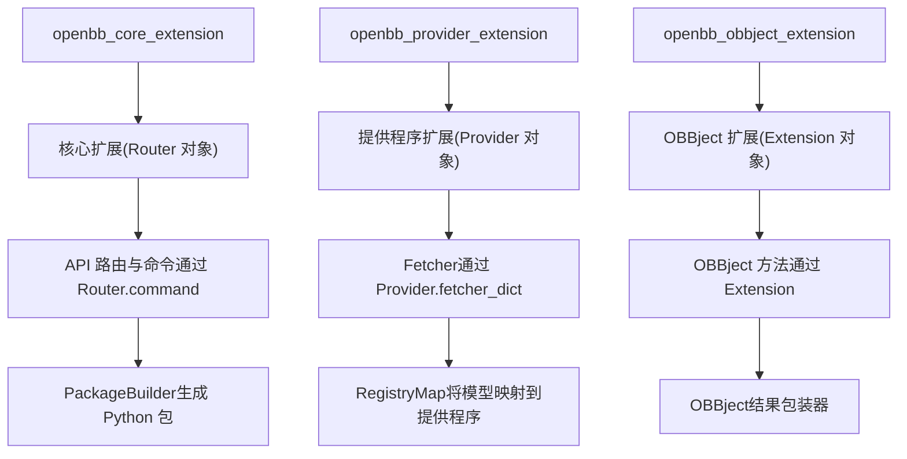
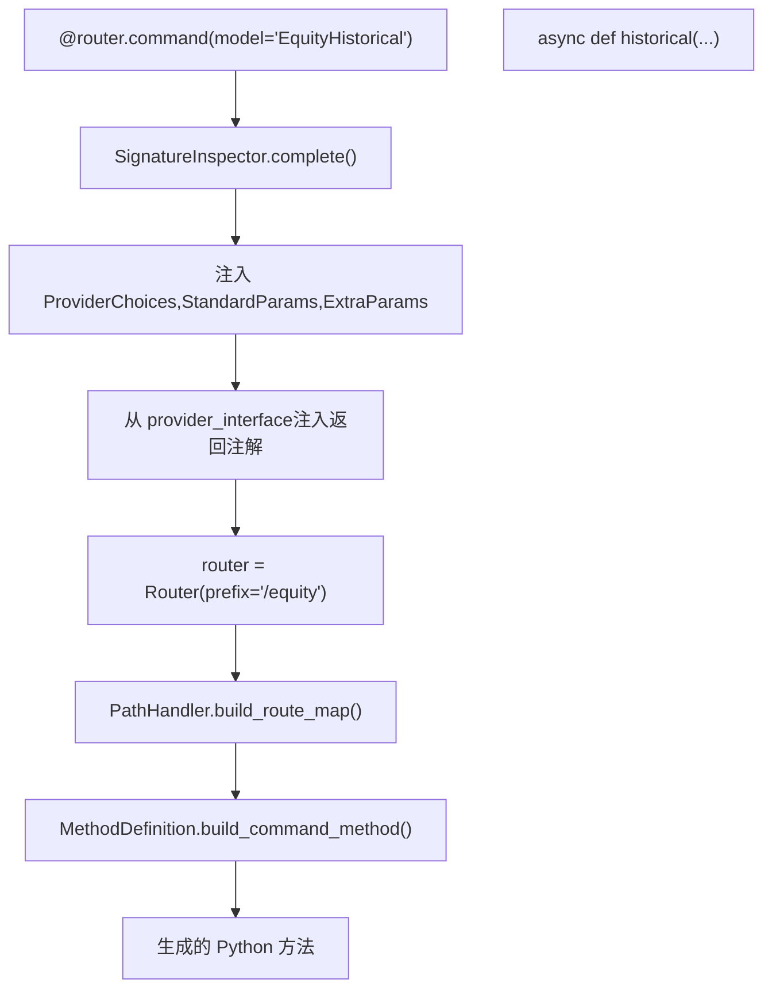
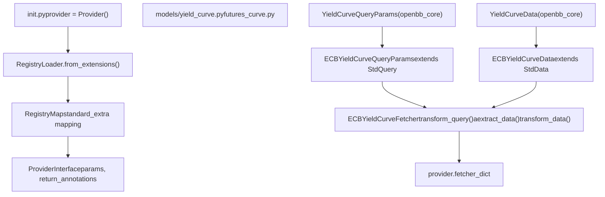
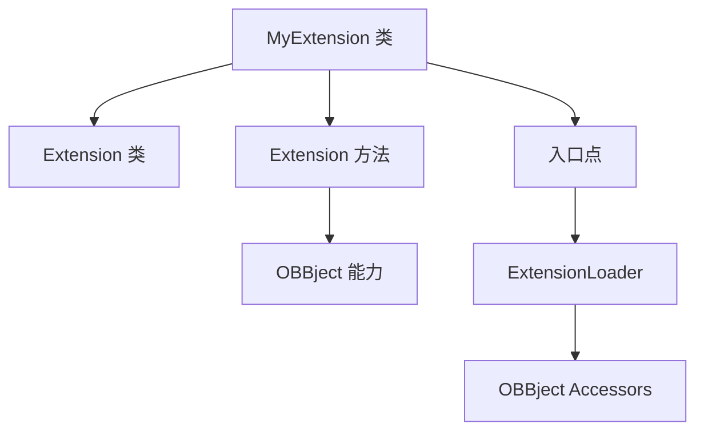
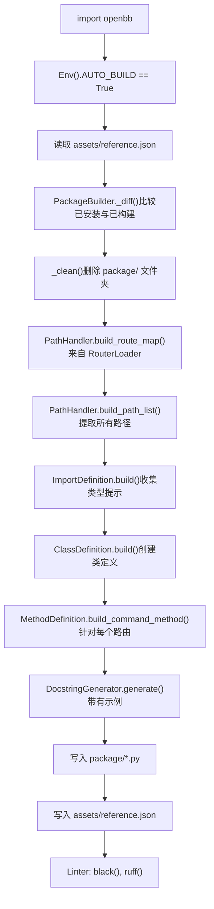
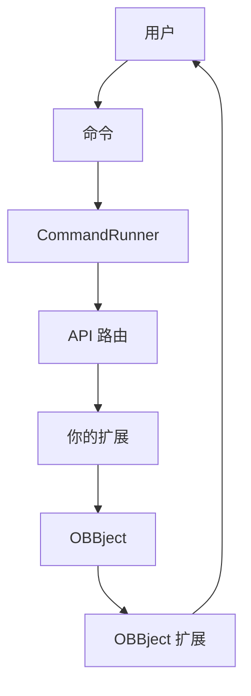

# 扩展 OpenBB

相关源文件

-   [cli/tests/test\_argparse\_translator\_obbject\_registry.py](https://github.com/OpenBB-finance/OpenBB/blob/dddc3b32/cli/tests/test_argparse_translator_obbject_registry.py)
-   [openbb\_platform/core/openbb\_core/api/app\_loader.py](https://github.com/OpenBB-finance/OpenBB/blob/dddc3b32/openbb_platform/core/openbb_core/api/app_loader.py)
-   [openbb\_platform/core/openbb\_core/api/exception\_handlers.py](https://github.com/OpenBB-finance/OpenBB/blob/dddc3b32/openbb_platform/core/openbb_core/api/exception_handlers.py)
-   [openbb\_platform/core/openbb\_core/api/rest\_api.py](https://github.com/OpenBB-finance/OpenBB/blob/dddc3b32/openbb_platform/core/openbb_core/api/rest_api.py)
-   [openbb\_platform/core/openbb\_core/api/router/coverage.py](https://github.com/OpenBB-finance/OpenBB/blob/dddc3b32/openbb_platform/core/openbb_core/api/router/coverage.py)
-   [openbb\_platform/core/openbb\_core/app/model/charts/chart.py](https://github.com/OpenBB-finance/OpenBB/blob/dddc3b32/openbb_platform/core/openbb_core/app/model/charts/chart.py)
-   [openbb\_platform/core/openbb\_core/app/provider\_interface.py](https://github.com/OpenBB-finance/OpenBB/blob/dddc3b32/openbb_platform/core/openbb_core/app/provider_interface.py)
-   [openbb\_platform/core/openbb\_core/app/router.py](https://github.com/OpenBB-finance/OpenBB/blob/dddc3b32/openbb_platform/core/openbb_core/app/router.py)
-   [openbb\_platform/core/openbb\_core/app/static/package\_builder.py](https://github.com/OpenBB-finance/OpenBB/blob/dddc3b32/openbb_platform/core/openbb_core/app/static/package_builder.py)
-   [openbb\_platform/core/openbb\_core/app/static/utils/filters.py](https://github.com/OpenBB-finance/OpenBB/blob/dddc3b32/openbb_platform/core/openbb_core/app/static/utils/filters.py)
-   [openbb\_platform/core/openbb\_core/app/utils.py](https://github.com/OpenBB-finance/OpenBB/blob/dddc3b32/openbb_platform/core/openbb_core/app/utils.py)
-   [openbb\_platform/core/openbb\_core/provider/registry\_map.py](https://github.com/OpenBB-finance/OpenBB/blob/dddc3b32/openbb_platform/core/openbb_core/provider/registry_map.py)
-   [openbb\_platform/core/openbb\_core/provider/standard\_models/company\_filings.py](https://github.com/OpenBB-finance/OpenBB/blob/dddc3b32/openbb_platform/core/openbb_core/provider/standard_models/company_filings.py)
-   [openbb\_platform/core/openbb\_core/provider/standard\_models/fred\_release\_table.py](https://github.com/OpenBB-finance/OpenBB/blob/dddc3b32/openbb_platform/core/openbb_core/provider/standard_models/fred_release_table.py)
-   [openbb\_platform/core/openbb\_core/provider/standard\_models/futures\_curve.py](https://github.com/OpenBB-finance/OpenBB/blob/dddc3b32/openbb_platform/core/openbb_core/provider/standard_models/futures_curve.py)
-   [openbb\_platform/core/openbb\_core/provider/standard\_models/primary\_dealer\_fails.py](https://github.com/OpenBB-finance/OpenBB/blob/dddc3b32/openbb_platform/core/openbb_core/provider/standard_models/primary_dealer_fails.py)
-   [openbb\_platform/core/openbb\_core/provider/standard\_models/yield\_curve.py](https://github.com/OpenBB-finance/OpenBB/blob/dddc3b32/openbb_platform/core/openbb_core/provider/standard_models/yield_curve.py)
-   [openbb\_platform/core/tests/app/model/charts/test\_chart.py](https://github.com/OpenBB-finance/OpenBB/blob/dddc3b32/openbb_platform/core/tests/app/model/charts/test_chart.py)
-   [openbb\_platform/core/tests/app/static/test\_filters.py](https://github.com/OpenBB-finance/OpenBB/blob/dddc3b32/openbb_platform/core/tests/app/static/test_filters.py)
-   [openbb\_platform/core/tests/app/static/test\_package\_builder.py](https://github.com/OpenBB-finance/OpenBB/blob/dddc3b32/openbb_platform/core/tests/app/static/test_package_builder.py)
-   [openbb\_platform/core/tests/app/test\_platform\_router.py](https://github.com/OpenBB-finance/OpenBB/blob/dddc3b32/openbb_platform/core/tests/app/test_platform_router.py)
-   [openbb\_platform/core/tests/app/test\_provider\_interface.py](https://github.com/OpenBB-finance/OpenBB/blob/dddc3b32/openbb_platform/core/tests/app/test_provider_interface.py)
-   [openbb\_platform/extensions/economy/integration/test\_economy\_api.py](https://github.com/OpenBB-finance/OpenBB/blob/dddc3b32/openbb_platform/extensions/economy/integration/test_economy_api.py)
-   [openbb\_platform/extensions/economy/integration/test\_economy\_python.py](https://github.com/OpenBB-finance/OpenBB/blob/dddc3b32/openbb_platform/extensions/economy/integration/test_economy_python.py)
-   [openbb\_platform/extensions/economy/openbb\_economy/economy\_router.py](https://github.com/OpenBB-finance/OpenBB/blob/dddc3b32/openbb_platform/extensions/economy/openbb_economy/economy_router.py)
-   [openbb\_platform/extensions/economy/openbb\_economy/survey/survey\_router.py](https://github.com/OpenBB-finance/OpenBB/blob/dddc3b32/openbb_platform/extensions/economy/openbb_economy/survey/survey_router.py)
-   [openbb\_platform/extensions/equity/integration/test\_equity\_api.py](https://github.com/OpenBB-finance/OpenBB/blob/dddc3b32/openbb_platform/extensions/equity/integration/test_equity_api.py)
-   [openbb\_platform/extensions/equity/integration/test\_equity\_python.py](https://github.com/OpenBB-finance/OpenBB/blob/dddc3b32/openbb_platform/extensions/equity/integration/test_equity_python.py)
-   [openbb\_platform/extensions/equity/openbb\_equity/fundamental/fundamental\_router.py](https://github.com/OpenBB-finance/OpenBB/blob/dddc3b32/openbb_platform/extensions/equity/openbb_equity/fundamental/fundamental_router.py)
-   [openbb\_platform/extensions/etf/integration/test\_etf\_api.py](https://github.com/OpenBB-finance/OpenBB/blob/dddc3b32/openbb_platform/extensions/etf/integration/test_etf_api.py)
-   [openbb\_platform/extensions/etf/integration/test\_etf\_python.py](https://github.com/OpenBB-finance/OpenBB/blob/dddc3b32/openbb_platform/extensions/etf/integration/test_etf_python.py)
-   [openbb\_platform/extensions/platform\_api/openbb\_platform\_api/assets/default\_apps.json](https://github.com/OpenBB-finance/OpenBB/blob/dddc3b32/openbb_platform/extensions/platform_api/openbb_platform_api/assets/default_apps.json)
-   [openbb\_platform/extensions/tests/test\_integration\_tests\_api.py](https://github.com/OpenBB-finance/OpenBB/blob/dddc3b32/openbb_platform/extensions/tests/test_integration_tests_api.py)
-   [openbb\_platform/extensions/tests/test\_integration\_tests\_python.py](https://github.com/OpenBB-finance/OpenBB/blob/dddc3b32/openbb_platform/extensions/tests/test_integration_tests_python.py)
-   [openbb\_platform/extensions/tests/utils/integration\_tests\_api\_generator.py](https://github.com/OpenBB-finance/OpenBB/blob/dddc3b32/openbb_platform/extensions/tests/utils/integration_tests_api_generator.py)
-   [openbb\_platform/extensions/tests/utils/integration\_tests\_testers.py](https://github.com/OpenBB-finance/OpenBB/blob/dddc3b32/openbb_platform/extensions/tests/utils/integration_tests_testers.py)
-   [openbb\_platform/obbject\_extensions/charting/tests/test\_charting.py](https://github.com/OpenBB-finance/OpenBB/blob/dddc3b32/openbb_platform/obbject_extensions/charting/tests/test_charting.py)
-   [openbb\_platform/providers/bls/openbb\_bls/utils/helpers.py](https://github.com/OpenBB-finance/OpenBB/blob/dddc3b32/openbb_platform/providers/bls/openbb_bls/utils/helpers.py)
-   [openbb\_platform/providers/cboe/openbb\_cboe/models/futures\_curve.py](https://github.com/OpenBB-finance/OpenBB/blob/dddc3b32/openbb_platform/providers/cboe/openbb_cboe/models/futures_curve.py)
-   [openbb\_platform/providers/cboe/tests/test\_cboe\_fetchers.py](https://github.com/OpenBB-finance/OpenBB/blob/dddc3b32/openbb_platform/providers/cboe/tests/test_cboe_fetchers.py)
-   [openbb\_platform/providers/federal\_reserve/openbb\_federal\_reserve/\_\_init\_\_.py](https://github.com/OpenBB-finance/OpenBB/blob/dddc3b32/openbb_platform/providers/federal_reserve/openbb_federal_reserve/__init__.py)
-   [openbb\_platform/providers/federal\_reserve/openbb\_federal\_reserve/assets/historical\_releases.json](https://github.com/OpenBB-finance/OpenBB/blob/dddc3b32/openbb_platform/providers/federal_reserve/openbb_federal_reserve/assets/historical_releases.json)
-   [openbb\_platform/providers/federal\_reserve/openbb\_federal\_reserve/models/fomc\_documents.py](https://github.com/OpenBB-finance/OpenBB/blob/dddc3b32/openbb_platform/providers/federal_reserve/openbb_federal_reserve/models/fomc_documents.py)
-   [openbb\_platform/providers/federal\_reserve/openbb\_federal\_reserve/models/primary\_dealer\_fails.py](https://github.com/OpenBB-finance/OpenBB/blob/dddc3b32/openbb_platform/providers/federal_reserve/openbb_federal_reserve/models/primary_dealer_fails.py)
-   [openbb\_platform/providers/federal\_reserve/openbb\_federal\_reserve/models/primary\_dealer\_positioning.py](https://github.com/OpenBB-finance/OpenBB/blob/dddc3b32/openbb_platform/providers/federal_reserve/openbb_federal_reserve/models/primary_dealer_positioning.py)
-   [openbb\_platform/providers/federal\_reserve/openbb\_federal\_reserve/utils/fomc\_documents.py](https://github.com/OpenBB-finance/OpenBB/blob/dddc3b32/openbb_platform/providers/federal_reserve/openbb_federal_reserve/utils/fomc_documents.py)
-   [openbb\_platform/providers/federal\_reserve/openbb\_federal\_reserve/utils/primary\_dealer\_statistics.py](https://github.com/OpenBB-finance/OpenBB/blob/dddc3b32/openbb_platform/providers/federal_reserve/openbb_federal_reserve/utils/primary_dealer_statistics.py)
-   [openbb\_platform/providers/federal\_reserve/tests/record/http/test\_federal\_reserve\_fetchers/test\_federal\_reserve\_fomc\_documents\_fetcher\_urllib3\_v2.yaml](https://github.com/OpenBB-finance/OpenBB/blob/dddc3b32/openbb_platform/providers/federal_reserve/tests/record/http/test_federal_reserve_fetchers/test_federal_reserve_fomc_documents_fetcher_urllib3_v2.yaml)
-   [openbb\_platform/providers/federal\_reserve/tests/record/http/test\_federal\_reserve\_fetchers/test\_federal\_reserve\_primary\_dealer\_fails\_fetcher\_urllib3\_v2.yaml](https://github.com/OpenBB-finance/OpenBB/blob/dddc3b32/openbb_platform/providers/federal_reserve/tests/record/http/test_federal_reserve_fetchers/test_federal_reserve_primary_dealer_fails_fetcher_urllib3_v2.yaml)
-   [openbb\_platform/providers/federal\_reserve/tests/test\_federal\_reserve\_fetchers.py](https://github.com/OpenBB-finance/OpenBB/blob/dddc3b32/openbb_platform/providers/federal_reserve/tests/test_federal_reserve_fetchers.py)
-   [openbb\_platform/providers/fmp/openbb\_fmp/\_\_init\_\_.py](https://github.com/OpenBB-finance/OpenBB/blob/dddc3b32/openbb_platform/providers/fmp/openbb_fmp/__init__.py)
-   [openbb\_platform/providers/fmp/openbb\_fmp/models/company\_filings.py](https://github.com/OpenBB-finance/OpenBB/blob/dddc3b32/openbb_platform/providers/fmp/openbb_fmp/models/company_filings.py)
-   [openbb\_platform/providers/fmp/pyproject.toml](https://github.com/OpenBB-finance/OpenBB/blob/dddc3b32/openbb_platform/providers/fmp/pyproject.toml)
-   [openbb\_platform/providers/fmp/tests/test\_fmp\_fetchers.py](https://github.com/OpenBB-finance/OpenBB/blob/dddc3b32/openbb_platform/providers/fmp/tests/test_fmp_fetchers.py)
-   [openbb\_platform/providers/fred/openbb\_fred/\_\_init\_\_.py](https://github.com/OpenBB-finance/OpenBB/blob/dddc3b32/openbb_platform/providers/fred/openbb_fred/__init__.py)
-   [openbb\_platform/providers/fred/openbb\_fred/models/manufacturing\_outlook\_ny.py](https://github.com/OpenBB-finance/OpenBB/blob/dddc3b32/openbb_platform/providers/fred/openbb_fred/models/manufacturing_outlook_ny.py)
-   [openbb\_platform/providers/fred/openbb\_fred/models/release\_table.py](https://github.com/OpenBB-finance/OpenBB/blob/dddc3b32/openbb_platform/providers/fred/openbb_fred/models/release_table.py)
-   [openbb\_platform/providers/fred/tests/record/http/test\_fred\_fetchers/test\_fred\_manufacturing\_outlook\_ny\_fetcher\_urllib3\_v2.yaml](https://github.com/OpenBB-finance/OpenBB/blob/dddc3b32/openbb_platform/providers/fred/tests/record/http/test_fred_fetchers/test_fred_manufacturing_outlook_ny_fetcher_urllib3_v2.yaml)
-   [openbb\_platform/providers/fred/tests/test\_fred\_fetchers.py](https://github.com/OpenBB-finance/OpenBB/blob/dddc3b32/openbb_platform/providers/fred/tests/test_fred_fetchers.py)
-   [openbb\_platform/providers/intrinio/openbb\_intrinio/\_\_init\_\_.py](https://github.com/OpenBB-finance/OpenBB/blob/dddc3b32/openbb_platform/providers/intrinio/openbb_intrinio/__init__.py)
-   [openbb\_platform/providers/intrinio/openbb\_intrinio/models/company\_filings.py](https://github.com/OpenBB-finance/OpenBB/blob/dddc3b32/openbb_platform/providers/intrinio/openbb_intrinio/models/company_filings.py)
-   [openbb\_platform/providers/intrinio/tests/test\_intrinio\_fetchers.py](https://github.com/OpenBB-finance/OpenBB/blob/dddc3b32/openbb_platform/providers/intrinio/tests/test_intrinio_fetchers.py)
-   [openbb\_platform/providers/sec/openbb\_sec/\_\_init\_\_.py](https://github.com/OpenBB-finance/OpenBB/blob/dddc3b32/openbb_platform/providers/sec/openbb_sec/__init__.py)
-   [openbb\_platform/providers/sec/openbb\_sec/utils/form4.py](https://github.com/OpenBB-finance/OpenBB/blob/dddc3b32/openbb_platform/providers/sec/openbb_sec/utils/form4.py)
-   [openbb\_platform/providers/sec/tests/test\_sec\_fetchers.py](https://github.com/OpenBB-finance/OpenBB/blob/dddc3b32/openbb_platform/providers/sec/tests/test_sec_fetchers.py)
-   [openbb\_platform/providers/tmx/openbb\_tmx/models/company\_filings.py](https://github.com/OpenBB-finance/OpenBB/blob/dddc3b32/openbb_platform/providers/tmx/openbb_tmx/models/company_filings.py)

本指南介绍了如何通过创建自定义扩展来扩展 OpenBB Platform。OpenBB Platform 在设计时考虑了模块化，允许开发人员添加新功能、集成额外的数据提供程序并增强现有能力，而无需修改核心代码库。

有关以平台消费者身份使用扩展系统的信息，请参阅 [扩展系统](/OpenBB-finance/OpenBB/2.2-extension-system)。

## 扩展系统概述

OpenBB Platform 扩展系统支持三种类型的扩展，通过 Python 入口点注册：

**图表：扩展类型与入口点**


来源：

-   [openbb\_platform/core/openbb\_core/app/extension\_loader.py14-32](https://github.com/OpenBB-finance/OpenBB/blob/dddc3b32/openbb_platform/core/openbb_core/app/extension_loader.py#L14-L32)
-   [openbb\_platform/core/openbb\_core/app/static/package\_builder.py135-230](https://github.com/OpenBB-finance/OpenBB/blob/dddc3b32/openbb_platform/core/openbb_core/app/static/package_builder.py#L135-L230)
-   [openbb\_platform/core/openbb\_core/provider/registry\_map.py20-60](https://github.com/OpenBB-finance/OpenBB/blob/dddc3b32/openbb_platform/core/openbb_core/provider/registry_map.py#L20-L60)

1.  **核心扩展 (Core Extensions)**：通过具有 `@router.command` 装饰器的 `Router` 类添加新的 API 路由和命令。示例：`openbb-equity`, `openbb-economy`
2.  **提供程序扩展 (Provider Extensions)**：通过实现 `Fetcher` 模式集成新的数据提供程序。示例：`openbb-fred`, `openbb-fmp`, `openbb-yfinance`
3.  **OBBject 扩展 (OBBject Extensions)**：使用额外的方法增强输出对象。示例：`openbb-charting`, `openbb-technical`

## 扩展加载与构建架构

扩展系统使用 Python 的入口点机制发现扩展，然后 `PackageBuilder` 为完整的 API 生成 Python 代码：

**图表：扩展发现与代码生成流程**

> **[Mermaid sequence]**
> *(图表结构无法解析)*

来源：

-   [openbb\_platform/core/openbb\_core/app/extension\_loader.py33-168](https://github.com/OpenBB-finance/OpenBB/blob/dddc3b32/openbb_platform/core/openbb_core/app/extension_loader.py#L33-L168)
-   [openbb\_platform/core/openbb\_core/app/static/package\_builder.py135-362](https://github.com/OpenBB-finance/OpenBB/blob/dddc3b32/openbb_platform/core/openbb_core/app/static/package_builder.py#L135-L362)
-   [openbb\_platform/core/openbb\_core/app/router.py515-537](https://github.com/OpenBB-finance/OpenBB/blob/dddc3b32/openbb_platform/core/openbb_core/app/router.py#L515-L537)

`ExtensionLoader` 类 ([openbb\_core/app/extension\_loader.py33-93](https://github.com/OpenBB-finance/OpenBB/blob/dddc3b32/openbb_core/app/extension_loader.py#L33-L93)) 执行扩展发现：

1.  查询 `openbb_core_extension`, `openbb_provider_extension` 和 `openbb_obbject_extension` 组的入口点。
2.  从每个入口点加载扩展对象。
3.  通过 `.core_objects`, `.provider_objects` 和 `.obbject_objects` 属性使它们可用。

`PackageBuilder` 类 ([openbb\_core/app/static/package\_builder.py135-306](https://github.com/OpenBB-finance/OpenBB/blob/dddc3b32/openbb_core/app/static/package_builder.py#L135-L306)) 生成 Python 代码：

1.  根据所有加载的 `Router` 对象构建路由映射。
2.  为所有类型提示生成 import 语句。
3.  为每个命令生成带有方法的类定义。
4.  将生成的代码写入 `package/` 目录。
5.  在生成的代码上运行 linter (black, ruff)。

## 创建扩展

### 扩展项目结构

一个典型的扩展项目应具有以下结构：

```
extension_project/
├── pyproject.toml         # 包元数据和入口点
├── openbb_extension/      # 扩展包
│   ├── __init__.py        # 包初始化
│   ├── models/            # 数据模型（用于提供程序扩展）
│   │   ├── __init__.py
│   │   └── my_model.py    # 自定义模型实现
│   ├── router.py          # API 路由（用于核心扩展）
│   └── extension.py       # 扩展类（用于 OBBject 扩展）
└── tests/                 # 扩展的测试
```
### 注册扩展

使用 `pyproject.toml` 文件中的 Python 入口点注册扩展。入口点的值应为指向扩展对象的模块路径：

```
[project.entry-points."openbb_core_extension"]
my_extension = "openbb_my_extension:router"

[project.entry-points."openbb_provider_extension"]
my_provider = "openbb_my_provider.provider:provider"

[project.entry-points."openbb_obbject_extension"]
my_obbject_extension = "openbb_my_extension.extension:ext"
```
入口点组映射到特定的对象类型：

| 入口点组 | 期望的对象类型 | 示例 |
| --- | --- | --- |
| `openbb_core_extension` | `Router` 实例 | `router = Router(prefix="/equity")` |
| `openbb_provider_extension` | `Provider` 实例 | `provider = Provider(name="fred", ...)` |
| `openbb_obbject_extension` | `Extension` 实例 | `ext = Extension(...)` |

来源：

-   [openbb\_platform/core/openbb\_core/app/extension\_loader.py14-32](https://github.com/OpenBB-finance/OpenBB/blob/dddc3b32/openbb_platform/core/openbb_core/app/extension_loader.py#L14-L32)
-   [openbb\_platform/extensions/equity/pyproject.toml1-60](https://github.com/OpenBB-finance/OpenBB/blob/dddc3b32/openbb_platform/extensions/equity/pyproject.toml#L1-L60)
-   [openbb\_platform/providers/fred/pyproject.toml1-47](https://github.com/OpenBB-finance/OpenBB/blob/dddc3b32/openbb_platform/providers/fred/pyproject.toml#L1-L47)

## 创建核心扩展

核心扩展为 OpenBB Platform 添加新的 API 路由和命令。它们使用 `Router` 类定义路由，并使用 `@router.command` 装饰器创建端点。

**图表：核心扩展命令流程**


来源：

-   [openbb\_platform/core/openbb\_core/app/router.py43-225](https://github.com/OpenBB-finance/OpenBB/blob/dddc3b32/openbb_platform/core/openbb_core/app/router.py#L43-L225)
-   [openbb\_platform/core/openbb\_core/app/router.py227-375](https://github.com/OpenBB-finance/OpenBB/blob/dddc3b32/openbb_platform/core/openbb_core/app/router.py#L227-L375)
-   [openbb\_platform/core/openbb\_core/app/static/package\_builder.py763-1163](https://github.com/OpenBB-finance/OpenBB/blob/dddc3b32/openbb_platform/core/openbb_core/app/static/package_builder.py#L763-L1163)

### 带有模型的 Router 命令装饰器

`@router.command` 装饰器可以在带或不带 `model` 参数的情况下使用。指定模型时，它会将命令连接到提供程序实现：

```
from openbb_core.app.router import Router
from openbb_core.app.model.obbject import OBBject
from openbb_core.app.provider_interface import (
    ProviderChoices,
    StandardParams,
    ExtraParams,
)

router = Router(prefix="/equity")

@router.command(model="EquityHistorical")
async def historical(
    cc: CommandContext,
    provider_choices: ProviderChoices,
    standard_params: StandardParams,
    extra_params: ExtraParams,
) -> OBBject:
    """
    获取股票的历史价格数据。

    模型参数 'EquityHistorical' 必须与提供程序接口的 fetcher_dict
    中的模型名称匹配。
    """
    return await OBBject.from_query(Query(**locals()))
```
`SignatureInspector.complete()` 方法 ([openbb\_core/app/router.py230-296](https://github.com/OpenBB-finance/OpenBB/blob/dddc3b32/openbb_core/app/router.py#L230-L296)) 处理该命令：

1.  验证该模型是否存在于 `ProviderInterface().models` 中。
2.  为 provider\_choices, standard\_params 和 extra\_params 注入 `Depends()` 注解。
3.  从 `provider_interface.return_annotations[model]` 添加返回类型注解。

### 不带模型的核心扩展示例

对于不使用提供程序系统的命令：

```
from openbb_core.app.router import Router
from openbb_core.app.model.obbject import OBBject
from pydantic import BaseModel

router = Router(prefix="/custom", description="自定义扩展命令")

class CustomData(BaseModel):
    """自定义数据模型。"""
    value: float
    label: str

@router.command
async def custom_calculation(
    input_value: float,
    multiplier: float = 2.0
) -> OBBject[list[CustomData]]:
    """
    执行自定义计算。

    Parameters
    ----------
    input_value : float
        要处理的输入值
    multiplier : float
        要应用的倍数

    Returns
    -------
    OBBject[list[CustomData]]
        包含计算值的结果
    """
    result = [
        CustomData(
            value=input_value * multiplier,
            label=f"Result of {input_value} * {multiplier}"
        )
    ]
    return OBBject(results=result)
```
来源：

-   [openbb\_platform/core/openbb\_core/app/router.py87-171](https://github.com/OpenBB-finance/OpenBB/blob/dddc3b32/openbb_platform/core/openbb_core/app/router.py#L87-L171)
-   [openbb\_platform/extensions/equity/openbb\_equity/equity\_router.py1-50](https://github.com/OpenBB-finance/OpenBB/blob/dddc3b32/openbb_platform/extensions/equity/openbb_equity/equity_router.py#L1-L50)

## 创建提供程序扩展

提供程序扩展为平台添加新的数据源。每个提供程序都实现三阶段 `Fetcher` 模式：`transform_query`, `aextract_data`, `transform_data`。

**图表：提供程序扩展架构**


来源：

-   [openbb\_platform/core/openbb\_core/provider/registry.py14-59](https://github.com/OpenBB-finance/OpenBB/blob/dddc3b32/openbb_platform/core/openbb_core/provider/registry.py#L14-L59)
-   [openbb\_platform/core/openbb\_core/provider/registry\_map.py20-208](https://github.com/OpenBB-finance/OpenBB/blob/dddc3b32/openbb_platform/core/openbb_core/provider/registry_map.py#L20-L208)
-   [openbb\_platform/providers/ecb/openbb\_ecb/models/yield\_curve.py1-169](https://github.com/OpenBB-finance/OpenBB/blob/dddc3b32/openbb_platform/providers/ecb/openbb_ecb/models/yield_curve.py#L1-L169)

### Fetcher 模式：三个必需方法

每个 fetcher 必须实现三个静态方法：

| 方法 | 目的 | 输入 | 输出 |
| --- | --- | --- | --- |
| `transform_query()` | 验证并转换查询参数 | `dict[str, Any]` | `QueryParams` 子类 |
| `aextract_data()` | 从外部源获取数据（异步） | `QueryParams`, `credentials` | `list[dict]` |
| `transform_data()` | 将原始数据转换为标准模型 | `QueryParams`, `list[dict]` | `list[Data]` |

### 标准模型

OpenBB Platform 在 [openbb\_core/provider/standard\_models/](https://github.com/OpenBB-finance/OpenBB/blob/dddc3b32/openbb_core/provider/standard_models/) 中提供标准模型：

-   `yield_curve.py` - 国债收益率曲线数据
-   `futures_curve.py` - 期货合约曲线数据
-   `fred_series.py` - FRED 经济时间序列
-   `fred_release_table.py` - FRED 发布表数据
-   `spot.py` - 即期汇率数据

你的提供程序应通过继承 `QueryParams` 和 `Data` 基类来扩展这些模型：

```
from openbb_core.provider.abstract.query_params import QueryParams
from openbb_core.provider.abstract.data import Data
from pydantic import Field

class YieldCurveQueryParams(QueryParams):
    """收益率曲线的基础查询参数。"""
    date: dateType | str | None = Field(
        default=None,
        description="收益率曲线的日期。"
    )

class YieldCurveData(Data):
    """收益率曲线的基础数据模型。"""
    date: dateType | None = Field(
        default=None,
        description="观察日期。"
    )
    maturity: str = Field(description="证券的期限长度。")
```
来源：

-   [openbb\_platform/core/openbb\_core/provider/standard\_models/yield\_curve.py1-72](https://github.com/OpenBB-finance/OpenBB/blob/dddc3b32/openbb_platform/core/openbb_core/provider/standard_models/yield_curve.py#L1-L72)
-   [openbb\_platform/core/openbb\_core/provider/standard\_models/futures\_curve.py1-63](https://github.com/OpenBB-finance/OpenBB/blob/dddc3b32/openbb_platform/core/openbb_core/provider/standard_models/futures_curve.py#L1-L63)
-   [openbb\_platform/core/openbb\_core/provider/standard\_models/fred\_release\_table.py1-93](https://github.com/OpenBB-finance/OpenBB/blob/dddc3b32/openbb_platform/core/openbb_core/provider/standard_models/fred_release_table.py#L1-L93)

### 示例：完整的提供程序实现

以下是基于 ECB 收益率曲线提供程序的完整示例：

**1\. 提供程序注册 (`__init__.py`)**

```
from openbb_core.provider.abstract.provider import Provider
from openbb_ecb.models.yield_curve import ECBYieldCurveFetcher

ecb_provider = Provider(
    name="ecb",
    website="https://data.ecb.europa.eu",
    description="欧洲中央银行数据门户",
    credentials=None,  # ECB 数据是公开的
    fetcher_dict={
        "YieldCurve": ECBYieldCurveFetcher,
    },
)
```
**2\. 查询参数扩展**

```
from typing import Literal
from openbb_core.provider.standard_models.yield_curve import (
    YieldCurveQueryParams)
from pydantic import Field

class ECBYieldCurveQueryParams(YieldCurveQueryParams):
    """ECB 特定的查询参数。"""

    __json_schema_extra__ = {"date": {"multiple_items_allowed": True}}

    rating: Literal["aaa", "all_ratings"] = Field(
        default="aaa",
        description="评级类型。"
    )
    yield_curve_type: Literal["spot_rate", "instantaneous_forward", "par_yield"] = Field(
        default="spot_rate",
        description="收益率曲线类型。"
    )
```
`__json_schema_extra__` 属性 ([openbb\_fred/models/release\_table.py24](https://github.com/OpenBB-finance/OpenBB/blob/dddc3b32/openbb_fred/models/release_table.py#L24-L24)) 控制参数的处理方式：

-   `multiple_items_allowed: True` - 允许以逗号分隔的值（由 `filter_inputs()` 检查）。
-   `choices` - 该参数的有效值列表。

**3\. 数据模型扩展**

```
from openbb_core.provider.standard_models.yield_curve import YieldCurveData

class ECBYieldCurveData(YieldCurveData):
    """ECB 特定的数据字段。"""
    # 继承自基类的 date, maturity, maturity_years
    # 如果需要，添加特定于提供程序的字段
```
**4\. Fetcher 实现**

```
from typing import Any
from openbb_core.provider.abstract.fetcher import Fetcher
from openbb_core.provider.utils.helpers import amake_request

class ECBYieldCurveFetcher(
    Fetcher[ECBYieldCurveQueryParams, list[ECBYieldCurveData]]):
    """ECB 收益率曲线数据的 Fetcher。"""

    @staticmethod
    def transform_query(params: dict[str, Any]) -> ECBYieldCurveQueryParams:
        """转换并验证查询参数。"""
        return ECBYieldCurveQueryParams(**params)

    @staticmethod
    async def aextract_data(
        query: ECBYieldCurveQueryParams,
        credentials: dict[str, str] | None,
        **kwargs: Any,
    ) -> list[dict]:
        """从 ECB API 获取数据。"""
        import asyncio
        from openbb_ecb.utils.yield_curve_series import get_yield_curve_ids

        # 获取所请求曲线类型的序列 ID
        ids = get_yield_curve_ids(
            rating=query.rating,
            yield_curve_type=query.yield_curve_type
        )

        results = []
        base_url = "https://data.ecb.europa.eu/data-detail-api"

        async def get_one(maturity):
            url = f"{base_url}/{ids['SERIES_IDS'][maturity]}"
            response = await amake_request(url)

            for item in response:
                results.append({
                    "date": item.get("PERIOD"),
                    "maturity": maturity,
                    "rate": item.get("OBS_VALUE_AS_IS")
                })

        tasks = [get_one(m) for m in ids['SERIES_IDS'].keys()]
        await asyncio.gather(*tasks)

        return results

    @staticmethod
    def transform_data(
        query: ECBYieldCurveQueryParams,
        data: list[dict],
        **kwargs: Any,
    ) -> list[ECBYieldCurveData]:
        """转换并验证数据。"""
        from pandas import DataFrame, DatetimeIndex

        if not data:
            raise EmptyDataError("请求返回为空。")

        df = DataFrame(data)
        df['rate'] = df['rate'].astype(float) / 100

        return [
            ECBYieldCurveData.model_validate(d)
            for d in df.to_dict('records')
        ]
```
来源：

-   [openbb\_platform/providers/ecb/openbb\_ecb/models/yield\_curve.py1-169](https://github.com/OpenBB-finance/OpenBB/blob/dddc3b32/openbb_platform/providers/ecb/openbb_ecb/models/yield_curve.py#L1-L169)
-   [openbb\_platform/providers/fred/openbb\_fred/models/release\_table.py1-276](https://github.com/OpenBB-finance/OpenBB/blob/dddc3b32/openbb_platform/providers/fred/openbb_fred/models/release_table.py#L1-L276)
-   [openbb\_platform/providers/cboe/openbb\_cboe/models/futures\_curve.py1-102](https://github.com/OpenBB-finance/OpenBB/blob/dddc3b32/openbb_platform/providers/cboe/openbb_cboe/models/futures_curve.py#L1-L102)

### 字段验证与多项输入

`filter_inputs()` 函数 ([openbb\_core/app/static/utils/filters.py8-66](https://github.com/OpenBB-finance/OpenBB/blob/dddc3b32/openbb_core/app/static/utils/filters.py#L8-L66)) 在执行前处理参数：

```
# 在你的 QueryParams 类中
class MyQueryParams(QueryParams):
    __json_schema_extra__ = {
        "symbol": {"multiple_items_allowed": True},
        "date": {"multiple_items_allowed": True}
    }

    symbol: str = Field(description="股票代码")
    date: str | None = Field(default=None, description="日期")
```
当 `multiple_items_allowed` 为 `False` 或未指定时，如果提供了以逗号分隔的列表，`check_single_item()` 将引发错误。

来源：

-   [openbb\_platform/core/openbb\_core/app/static/utils/filters.py8-66](https://github.com/OpenBB-finance/OpenBB/blob/dddc3b32/openbb_core/app/static/utils/filters.py#L8-L66)
-   [openbb\_platform/core/openbb\_core/app/utils.py189-194](https://github.com/OpenBB-finance/OpenBB/blob/dddc3b32/openbb_platform/core/openbb_core/app/utils.py#L189-L194)

## 创建 OBBject 扩展

OBBject 扩展通过添加新方法或属性来增强输出对象的能力。它们使用来自 OpenBB Platform 的 `Extension` 类。


来源：

-   [openbb\_platform/core/openbb\_core/app/model/extension.py1-13](https://github.com/OpenBB-finance/OpenBB/blob/dddc3b32/openbb_platform/core/openbb_core/app/model/extension.py#L1-L13)
-   [openbb\_platform/core/openbb\_core/app/extension\_loader.py97-103](https://github.com/OpenBB-finance/OpenBB/blob/dddc3b32/openbb_platform/core/openbb_core/app/extension_loader.py#L97-L103)

### OBBject 扩展示例

```
from openbb_core.app.model.extension import Extension

class MyExtension(Extension):
    """为 OBBject 添加自定义能力的扩展。"""

    def __init__(self):
        """初始化扩展。"""
        super().__init__(
            accessor_name="my_extension",
            accessor_methods={
                "do_something": self.do_something,
                "format_data": self.format_data,
            },
        )

    def do_something(self, obbject) -> str:
        """对 OBBject 数据执行某些操作。"""
        # 实现
        return result

    def format_data(self, obbject, format_type: str = "default") -> str:
        """格式化 OBBject 数据。"""
        # 实现
        return formatted_data
```
## PackageBuilder 与 Auto-Build

`PackageBuilder` ([openbb\_core/app/static/package\_builder.py135-362](https://github.com/OpenBB-finance/OpenBB/blob/dddc3b32/openbb_core/app/static/package_builder.py#L135-L362)) 为所有已安装的扩展生成 Python 代码。这在启用 `Env().AUTO_BUILD` 时自动发生。

**图表：PackageBuilder 过程**


来源：

-   [openbb\_platform/core/openbb\_core/app/static/package\_builder.py135-306](https://github.com/OpenBB-finance/OpenBB/blob/dddc3b32/openbb_platform/core/openbb_core/app/static/package_builder.py#L135-L306)
-   [openbb\_platform/core/openbb\_core/app/static/package\_builder.py364-376](https://github.com/OpenBB-finance/OpenBB/blob/dddc3b32/openbb_platform/core/openbb_core/app/static/package_builder.py#L364-L376)

### 自动构建机制 (Auto-Build)

`PackageBuilder.auto_build()` 方法 ([openbb\_core/app/static/package\_builder.py150-168](https://github.com/OpenBB-finance/OpenBB/blob/dddc3b32/openbb_core/app/static/package_builder.py#L150-L168)) 检查差异：

1.  读取包含先前构建扩展的 `assets/reference.json`。
2.  通过 `entry_points()` 与当前安装的扩展进行比较。
3.  如果发现差异（添加或移除），则触发 `build()`。

```
def auto_build(self) -> None:
    """如果存在差异则触发构建。"""
    if Env().AUTO_BUILD:
        reference = PackageBuilder._read(
            self.directory / "assets" / "reference.json"
        )
        ext_map = reference.get("info", {}).get("extensions", {})
        add, remove = PackageBuilder._diff(ext_map)

        if add or remove:
            print(f"Extensions to add: {', '.join(sorted(add))}")
            print(f"Extensions to remove: {', '.join(sorted(remove))}")
            print("\nBuilding...")
            self.build()
```
### 文件锁定

构建过程使用文件锁定 ([openbb\_core/app/static/package\_builder.py96-133](https://github.com/OpenBB-finance/OpenBB/blob/dddc3b32/openbb_core/app/static/package_builder.py#L96-L133)) 来防止并发构建：

```
class FileLock:
    """跨平台文件锁。"""

    def acquire(self, blocking: bool = True) -> None:
        """获取文件锁。"""
        if _HAS_FCNTL:  # Unix
            fcntl.flock(self._file.fileno(), fcntl.LOCK_EX)
        else:  # Windows
            msvcrt.locking(self._file.fileno(), msvcrt.LK_LOCK, 1)
```
### 生成的代码结构

对于像 `/equity/price/historical` 这样的每个路由路径，PackageBuilder 都会生成：

1.  **模块 (Module)**：`package/equity_price.py`（父路径成为模块名称）。
2.  **类 (Class)**：带有 `historical` 方法的 `ROUTER_equity_price`。
3.  **方法 (Method)**：调用 `self._run("/equity/price/historical", **kwargs)`。

示例生成的方法：

```
def historical(
    self,
    symbol: Annotated[
        str,
        OpenBBField(description="股票代码")
    ],
    provider: Annotated[
        Literal["fmp", "polygon", "yfinance"],
        OpenBBField(description="提供程序名称")
    ] = "yfinance",
    **kwargs) -> OBBject:
    """获取历史价格数据。"""
    return self._run(
        "/equity/price/historical",
        symbol=symbol,
        provider=provider,
        **kwargs
    )
```
来源：

-   [openbb\_platform/core/openbb\_core/app/static/package\_builder.py924-1163](https://github.com/OpenBB-finance/OpenBB/blob/dddc3b32/openbb_platform/core/openbb_core/app/static/package_builder.py#L924-L1163)
-   [openbb\_platform/core/openbb\_core/app/static/package\_builder.py668-760](https://github.com/OpenBB-finance/OpenBB/blob/dddc3b32/openbb_platform/core/openbb_core/app/static/package_builder.py#L668-L760)

## 测试扩展

建议为你的扩展编写测试以确保其正常工作：

1.  **核心扩展**：测试你的 API 路由是否返回预期的响应。
2.  **提供程序扩展**：测试你的 fetcher 是否正确检索并转换数据。
3.  **OBBject 扩展**：测试你的扩展方法是否产生预期的结果。

OpenBB 开发工具包含测试实用工具：

```
# 安装开发工具
pip install openbb-devtools
# 运行测试
pytest tests/
```
来源：

-   [openbb\_platform/extensions/devtools/pyproject.toml10-29](https://github.com/OpenBB-finance/OpenBB/blob/dddc3b32/openbb_platform/extensions/devtools/pyproject.toml#L10-L29)
-   [openbb\_platform/core/tests/app/test\_extension\_loader.py1-13](https://github.com/OpenBB-finance/OpenBB/blob/dddc3b32/openbb_platform/core/tests/app/test_extension_loader.py#L1-L13)
-   [openbb\_platform/core/tests/provider/test\_query\_executor.py1-86](https://github.com/OpenBB-finance/OpenBB/blob/dddc3b32/openbb_platform/core/tests/provider/test_query_executor.py#L1-L86)
-   [openbb\_platform/core/tests/provider/utils/test\_errors.py1-9](https://github.com/OpenBB-finance/OpenBB/blob/dddc3b32/openbb_platform/core/tests/provider/utils/test_errors.py#L1-L9)

## 扩展集成流程

当你调用一个使用你的扩展的命令时，OpenBB Platform 遵循以下流程：


来源：

-   [openbb\_platform/core/openbb\_core/app/command\_runner.py31-513](https://github.com/OpenBB-finance/OpenBB/blob/dddc3b32/openbb_platform/core/openbb_core/app/command_runner.py#L31-L513)
-   [openbb\_platform/core/openbb\_core/app/query.py17-83](https://github.com/OpenBB-finance/OpenBB/blob/dddc3b32/openbb_platform/core/openbb_core/app/query.py#L17-L83)
-   [openbb\_platform/core/openbb\_core/api/rest\_api.py45-105](https://github.com/OpenBB-finance/OpenBB/blob/dddc3b32/openbb_platform/core/openbb_core/api/rest_api.py#L45-L105)
-   [openbb\_platform/core/openbb\_core/api/app\_loader.py14-45](https://github.com/OpenBB-finance/OpenBB/blob/dddc3b32/openbb_platform/core/openbb_core/api/app_loader.py#L14-L45)

## 扩展中的错误处理

扩展应使用 OpenBB 的错误处理机制以保持一致。`ExceptionHandlers` 类 ([openbb\_core/api/exception\_handlers.py20-135](https://github.com/OpenBB-finance/OpenBB/blob/dddc3b32/openbb_core/api/exception_handlers.py#L20-L135)) 提供了统一的错误响应。

### 提供程序错误类

```
from openbb_core.app.model.abstract.error import OpenBBError
from openbb_core.provider.utils.errors import EmptyDataError, UnauthorizedError

# EmptyDataError - 返回 HTTP 204 (No Content)
if not data:
    raise EmptyDataError("未找到给定参数的数据")

# UnauthorizedError - 返回 HTTP 502 (Bad Gateway)
if not api_key or response.status_code == 401:
    raise UnauthorizedError(provider_name="my_provider")

# OpenBBError - 返回 HTTP 400 (Bad Request)
if invalid_parameter:
    raise OpenBBError(f"无效参数：{parameter}")
```
### 异常处理器映射

| 异常类型 | HTTP 状态码 | 处理器方法 |
| --- | --- | --- |
| `EmptyDataError` | 204 No Content | `ExceptionHandlers.empty_data()` |
| `UnauthorizedError` | 502 Bad Gateway | `ExceptionHandlers.unauthorized()` |
| `OpenBBError` | 400 Bad Request | `ExceptionHandlers.openbb()` |
| `ValidationError` | 422 Unprocessable Entity | `ExceptionHandlers.validation()` |
| `Exception` | 500 Internal Error | `ExceptionHandlers.exception()` |

来源：

-   [openbb\_platform/core/openbb\_core/api/exception\_handlers.py20-135](https://github.com/OpenBB-finance/OpenBB/blob/dddc3b32/openbb_platform/core/openbb_core/api/exception_handlers.py#L20-L135)
-   [openbb\_platform/core/openbb\_core/provider/utils/errors.py1-40](https://github.com/OpenBB-finance/OpenBB/blob/dddc3b32/openbb_platform/core/openbb_core/provider/utils/errors.py#L1-L40)
-   [openbb\_platform/core/openbb\_core/api/app\_loader.py35-43](https://github.com/OpenBB-finance/OpenBB/blob/dddc3b32/openbb_platform/core/openbb_core/api/app_loader.py#L35-L43)

### 示例：Fetcher 中的错误处理

```
@staticmethod
async def aextract_data(
    query: MyQueryParams,
    credentials: dict[str, str] | None,
    **kwargs: Any,
) -> list[dict]:
    """带有适当错误处理的数据提取。"""
    from openbb_core.provider.utils.helpers import amake_request
    from openbb_core.provider.utils.errors import EmptyDataError, UnauthorizedError

    api_key = credentials.get("my_provider_api_key") if credentials else ""

    if not api_key:
        raise UnauthorizedError("my_provider 需要 API 密钥")

    url = f"https://api.myprovider.com/data?symbol={query.symbol}"
    headers = {"Authorization": f"Bearer {api_key}"}

    try:
        response = await amake_request(url, headers=headers)
    except Exception as e:
        if "401" in str(e):
            raise UnauthorizedError("my_provider API 密钥无效")
        raise OpenBBError(f"请求失败：{e}")

    if not response or not response.get("data"):
        raise EmptyDataError(f"未找到股票代码 {query.symbol} 的数据")

    return response["data"]
```
### 警告 vs 错误

对于非关键性问题使用警告：

```
from warnings import warn
from openbb_core.app.model.abstract.warning import OpenBBWarning

# 发出不会停止执行的警告
if deprecated_parameter:
    warn(
        "参数 'old_param' 已弃用，请使用 'new_param'",
        category=OpenBBWarning
    )
```
来源：

-   [openbb\_platform/providers/bls/openbb\_bls/utils/helpers.py11-217](https://github.com/OpenBB-finance/OpenBB/blob/dddc3b32/openbb_platform/providers/bls/openbb_bls/utils/helpers.py#L11-L217)
-   [openbb\_platform/providers/econdb/openbb\_econdb/models/yield\_curve.py145-154](https://github.com/OpenBB-finance/OpenBB/blob/dddc3b32/openbb_platform/providers/econdb/openbb_econdb/models/yield_curve.py#L145-L154)

## 发布你的扩展

1.  使用 Poetry 或 setuptools 包装你的扩展。
2.  将其发布到 PyPI 或私有包存储库。
3.  用户可以使用 pip 安装它：

```
pip install openbb-myextension
```
安装后，OpenBB Platform 将自动发现并集成你的扩展。

来源：

-   [openbb\_platform/core/pyproject.toml1-34](https://github.com/OpenBB-finance/OpenBB/blob/dddc3b32/openbb_platform/core/pyproject.toml#L1-L34)
-   [openbb\_platform/extensions/devtools/pyproject.toml1-35](https://github.com/OpenBB-finance/OpenBB/blob/dddc3b32/openbb_platform/extensions/devtools/pyproject.toml#L1-L35)

## 最佳实践

1.  **遵循标准模型**：在实现提供程序扩展时，使用 OpenBB 提供的标准模型。
2.  **全面的文档**：彻底地记录你的扩展，包括 docstring 和 README。
3.  **错误处理**：使用 OpenBB 的错误处理机制以保持一致。
4.  **测试**：为你的扩展编写测试以确保其正常工作。
5.  **版本兼容性**：在包元数据中指定与 OpenBB Platform 版本的兼容性。

通过遵循这些指南，你可以创建与 OpenBB Platform 无缝集成的扩展，并为用户提供额外的价值。
