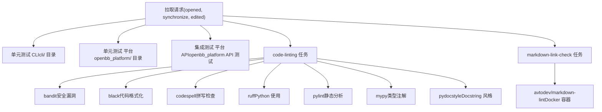
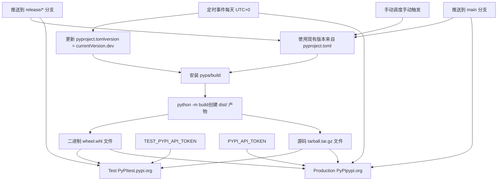

# CI/CD 与分发

相关源文件

-   [.github/labeler.yml](https://github.com/OpenBB-finance/OpenBB/blob/dddc3b32/.github/labeler.yml)
-   [.github/platform-drafter.yml](https://github.com/OpenBB-finance/OpenBB/blob/dddc3b32/.github/platform-drafter.yml)
-   [.github/release-drafter.yml](https://github.com/OpenBB-finance/OpenBB/blob/dddc3b32/.github/release-drafter.yml)
-   [.github/workflows/README.md](https://github.com/OpenBB-finance/OpenBB/blob/dddc3b32/.github/workflows/README.md?plain=1)
-   [cli/poetry.lock](https://github.com/OpenBB-finance/OpenBB/blob/dddc3b32/cli/poetry.lock)
-   [openbb\_platform/core/openbb/assets/reference.json](https://github.com/OpenBB-finance/OpenBB/blob/dddc3b32/openbb_platform/core/openbb/assets/reference.json)
-   [openbb\_platform/core/poetry.lock](https://github.com/OpenBB-finance/OpenBB/blob/dddc3b32/openbb_platform/core/poetry.lock)
-   [openbb\_platform/core/pyproject.toml](https://github.com/OpenBB-finance/OpenBB/blob/dddc3b32/openbb_platform/core/pyproject.toml)
-   [openbb\_platform/dev\_install.py](https://github.com/OpenBB-finance/OpenBB/blob/dddc3b32/openbb_platform/dev_install.py)
-   [openbb\_platform/extensions/devtools/poetry.lock](https://github.com/OpenBB-finance/OpenBB/blob/dddc3b32/openbb_platform/extensions/devtools/poetry.lock)
-   [openbb\_platform/extensions/devtools/pyproject.toml](https://github.com/OpenBB-finance/OpenBB/blob/dddc3b32/openbb_platform/extensions/devtools/pyproject.toml)
-   [openbb\_platform/poetry.lock](https://github.com/OpenBB-finance/OpenBB/blob/dddc3b32/openbb_platform/poetry.lock)
-   [openbb\_platform/providers/yfinance/poetry.lock](https://github.com/OpenBB-finance/OpenBB/blob/dddc3b32/openbb_platform/providers/yfinance/poetry.lock)
-   [openbb\_platform/pyproject.toml](https://github.com/OpenBB-finance/OpenBB/blob/dddc3b32/openbb_platform/pyproject.toml)

本文件涵盖了 OpenBB Platform 的持续集成、持续部署和分发系统。它介绍了执行代码质量、验证贡献、运行自动化测试、起草发布说明以及将包发布到 PyPI 的 GitHub Actions 工作流。有关本地开发设置和质量工具的信息，请参阅 [开发设置](/OpenBB-finance/OpenBB/6.1-development-setup)。有关代码质量工具和测试框架的详情，请参阅 [代码质量与测试](/OpenBB-finance/OpenBB/6.2-code-quality-and-testing)。

## 概述

OpenBB Platform 使用 GitHub Actions 自动执行从拉取请求验证到包分发的整个流程。CI/CD 系统确保代码质量、运行全面的测试套件、管理发布说明，并将包发布到 Test PyPI 和生产 PyPI，同时提供每日构建以持续获取最新功能。

**来源：** [.github/workflows/README.md1-101](https://github.com/OpenBB-finance/OpenBB/blob/dddc3b32/.github/workflows/README.md?plain=1#L1-L101)

## 分支验证

平台通过分支名称检查 (Branch Name Check) 工作流为所有拉取请求强制执行 GitFlow 命名约定。该工作流在合并前验证分支名称，以确保整个代码库的一致性。

### GitFlow 分支模式

| 分支类型 | 模式 | 目标分支 | 示例 |
| --- | --- | --- | --- |
| 功能 (Feature) | `feature/<name>` | `develop` | `feature/add-historical-data` |
| 错误修复 (Bugfix) | `bugfix/<name>` | `develop` | `bugfix/fix-date-parsing` |
| 热修复 (Hotfix) | `hotfix/<name>` | `main` | `hotfix/critical-api-fix` |
| 发布 (Release) | `release/<version>` | `main` | `release/3.2.0` 或 `release/3.2.0rc1` |

工作流使用 `jq` 提取分支名称，并针对正则表达式进行验证：

-   对于以 `develop` 为目标的 PR：接受 `feature/*`, `bugfix/*` 和 `hotfix/*`
-   对于以 `main` 为目标的 PR：仅接受 `hotfix/*` 和 `release/*`

如果验证失败，工作流将以状态码 1 退出，从而阻止合并。

**来源：** [.github/workflows/README.md9-32](https://github.com/OpenBB-finance/OpenBB/blob/dddc3b32/.github/workflows/README.md?plain=1#L9-L32)

## 自动化标记 (Labeling)

平台使用 labeler 工作流，根据文件路径和分支名称自动为拉取请求应用标签。这种分类有助于生成发布说明和跟踪问题。

### 标签配置

```
version: 2
appendOnly: true
```
| 标签 | 触发条件 |
| --- | --- |
| `platform` | 文件匹配 `openbb_platform/.*` |
| `v4` | 文件匹配 `openbb_platform/.*` |
| `enhancement` | 分支匹配 `^feature/.*` |
| `bug` | 分支匹配 `^hotfix/.*` 或 `^bugfix/.*` |
| `excel` | 文件匹配 `website/content/excel/.*` |
| `breaking_change` | 文件匹配 `openbb_platform/core/openbb_core/provider/standard_models/.*` |

`appendOnly: true` 设置防止移除手动添加的标签。

**来源：** [.github/labeler.yml1-28](https://github.com/OpenBB-finance/OpenBB/blob/dddc3b32/.github/labeler.yml#L1-L28)

## 自动化测试流水线

CI/CD 系统为拉取请求运行三层测试：


### 测试工作流触发器

测试工作流在以下情况下激活：

-   拉取请求事件：`opened`, `synchronize`, `edited`
-   分支推送事件：`feature/*`, `hotfix/*`, `release/*`

每个工作流都使用 Python 3.10 和 GitHub Actions 缓存来提高性能。

**来源：** [.github/workflows/README.md65-100](https://github.com/OpenBB-finance/OpenBB/blob/dddc3b32/.github/workflows/README.md?plain=1#L65-L100)

## 发布草拟系统

平台使用 Release Drafter 根据拉取请求自动生成并分类发布说明。存在两种配置：通用发布草拟器和特定于平台的草拟器。

### 发布草拟器配置

发布草拟器使用模板 `OpenBB Platform v$NEXT_MINOR_VERSION` 生成版本，并根据 PR 标签对更改进行分类：

| 类别 | 标签 | 描述 |
| --- | --- | --- |
| 🚨 Breaking Changes | `breaking_change` | 标准模型的更改 |
| 🦋 Platform Enhancements | `platform`, `v4` | 新功能与改进 |
| 🐛 Bug Fixes | `bug` | 错误修复 |
| 📚 Documentation | `docs` | 文档更新 |

配置模板包括：

-   贡献者表彰部分 (`$CONTRIBUTORS`)
-   摘要部分（手动填写）
-   分类变更列表 (`$CHANGES`)
-   社交媒体链接和社区参与提示

### 变更模板格式

```
- $TITLE @$AUTHOR (#$NUMBER)
```
核心团队成员被排除在贡献者列表之外，以突出社区贡献：

**来源：** [.github/release-drafter.yml1-49](https://github.com/OpenBB-finance/OpenBB/blob/dddc3b32/.github/release-drafter.yml#L1-L49) [.github/platform-drafter.yml1-49](https://github.com/OpenBB-finance/OpenBB/blob/dddc3b32/.github/platform-drafter.yml#L1-L49)

### 平台特定草拟器

`platform-drafter.yml` 包含一个额外的过滤器：

```
include-labels:
  - 'platform'
  - 'v4'
```
此配置通过过滤影响 `openbb_platform/` 目录的更改，生成仅针对平台的发布说明。

**来源：** [.github/platform-drafter.yml14-16](https://github.com/OpenBB-finance/OpenBB/blob/dddc3b32/.github/platform-drafter.yml#L14-L16)

## PyPI 部署流水线

平台通过三个部署工作流发布到 PyPI：每日构建 (Nightly Builds)、Test PyPI 验证和生产 PyPI 发布。


### 每日构建工作流 (Nightly Build)

每日构建工作流每天 UTC+0 运行，并将开发版本发布到 PyPI：

1.  **版本更新：** 将 `pyproject.toml` 中的版本修改为 `<currentVersion>.dev<YYYYMMDD>` 格式。
2.  **构建：** 安装 `pypa/build` 并运行 `python -m build`。
3.  **发布：** 使用 `pypa/gh-action-pypi-publish@release/v1` 上传到 PyPI。

这为用户提供了持续获取最新功能的机会，而无需等待正式发布。

**来源：** [.github/workflows/README.md33-42](https://github.com/OpenBB-finance/OpenBB/blob/dddc3b32/.github/workflows/README.md?plain=1#L33-L42)

### Test PyPI 部署

`deploy-test-pypi` 任务在向 `release/*` 分支推送时激活：

**触发条件：**

```
if: startsWith(github.ref, 'refs/heads/release/')
```
**工作流步骤：**

1.  设置 Python 环境
2.  通过 pip 安装 `build` 包
3.  构建二进制 wheel 和源码 tarball
4.  使用 `TEST_PYPI_API_TOKEN` 机密发布到 Test PyPI

这在生产发布前验证了包的分发。

**来源：** [.github/workflows/README.md44-58](https://github.com/OpenBB-finance/OpenBB/blob/dddc3b32/.github/workflows/README.md?plain=1#L44-L58)

### 生产 PyPI 部署

`deploy-pypi` 任务在向 `main` 分支推送时激活：

**触发条件：**

```
if: startsWith(github.ref, 'refs/heads/main')
```
**工作流步骤：**

1.  设置 Python 环境
2.  通过 pip 安装 `build` 包
3.  构建二进制 wheel 和源码 tarball
4.  使用 `PYPI_API_TOKEN` 机密发布到 PyPI

**来源：** [.github/workflows/README.md44-58](https://github.com/OpenBB-finance/OpenBB/blob/dddc3b32/.github/workflows/README.md?plain=1#L44-L58)

### 并发控制

两个部署工作流都使用了并发设置：

```
concurrency:
  group: ${{ github.workflow }}
  cancel-in-progress: true
```
这确保了当触发新任务时，同一工作流组中正在运行的任务将被取消，从而防止重复部署。

**来源：** [.github/workflows/README.md51-52](https://github.com/OpenBB-finance/OpenBB/blob/dddc3b32/.github/workflows/README.md?plain=1#L51-L52)

## 完整的发布流水线

下图显示了从开发到分发的端到端发布流水线：

> **[Mermaid sequence]**
> *(图表结构无法解析)*

### 发布核对表

| 阶段 | 操作 | 验证 |
| --- | --- | --- |
| 开发 | 创建功能分支，实施更改 | Pre-commit 钩子通过 |
| 拉取请求 | 打开 PR，自动标记 | 分支名称有效，测试通过 |
| 代码审查 | 团队审查，处理反馈 | 所有检查均为绿色 |
| 合并 | 合并到 develop | 发布草稿已更新 |
| 发布准备 | 创建 `release/*` 分支 | 版本号已提升 |
| 测试部署 | 推送到 `release/*` | Test PyPI 包可正常工作 |
| 生产发布 | 合并到 `main` | 生产 PyPI 已发布 |
| 分发 | 用户通过 pip 安装 | 全球可用包 |

**来源：** [.github/workflows/README.md1-101](https://github.com/OpenBB-finance/OpenBB/blob/dddc3b32/.github/workflows/README.md?plain=1#L1-L101) [.github/release-drafter.yml1-49](https://github.com/OpenBB-finance/OpenBB/blob/dddc3b32/.github/release-drafter.yml#L1-L49)

## 工作流文件位置

实际的工作流定义存储在 `.github/workflows/` 目录中：

| 工作流 | 文件 | 触发器 |
| --- | --- | --- |
| 分支名称检查 | `.github/workflows/branch-name-check.yml` | 发向 develop/main 的拉取请求 |
| 自动标记器 | `.github/workflows/labeler.yml` | 拉取请求事件 |
| 通用 Linting | `.github/workflows/linting.yml` | 拉取请求，推送到 feature/hotfix/release |
| 单元测试 CLI | `.github/workflows/unit-test-cli.yml` | 拉取请求事件 |
| 单元测试 平台 | `.github/workflows/unit-test-platform.yml` | 拉取请求事件 |
| 集成测试 API | `.github/workflows/integration-test-api.yml` | 拉取请求事件 |
| 草拟发布 | `.github/workflows/release-drafter.yml` | 手动调度 |
| 部署每日构建 | `.github/workflows/deploy-nightly.yml` | 每日定时 (UTC+0) |
| 部署到 PyPI | `.github/workflows/deploy-pypi.yml` | 推送到 release/\*, main, 手动 |

**来源：** [.github/workflows/README.md1-101](https://github.com/OpenBB-finance/OpenBB/blob/dddc3b32/.github/workflows/README.md?plain=1#L1-L101)

## 包分发产物

构建过程在 `dist/` 目录中创建两个分发产物：

### 二进制 Wheel (.whl)

Wheel 格式提供已编译的 Python 包，以实现更快的安装：

-   在适用处包含预编译的依赖项
-   平台特定优化
-   与源码分发相比，安装速度更快

### 源码 Tarball (.tar.gz)

源码分发包括：

-   原始 Python 源代码
-   包含依赖项和元数据的 `pyproject.toml`
-   README 和文档文件
-   针对没有预构建 wheel 的平台的构建配置

这两个产物都会在部署期间上传到 PyPI，允许 pip 根据用户的平台和 Python 版本选择最佳格式。

**来源：** [.github/workflows/README.md39-41](https://github.com/OpenBB-finance/OpenBB/blob/dddc3b32/.github/workflows/README.md?plain=1#L39-L41) [.github/workflows/README.md55-58](https://github.com/OpenBB-finance/OpenBB/blob/dddc3b32/.github/workflows/README.md?plain=1#L55-L58)
