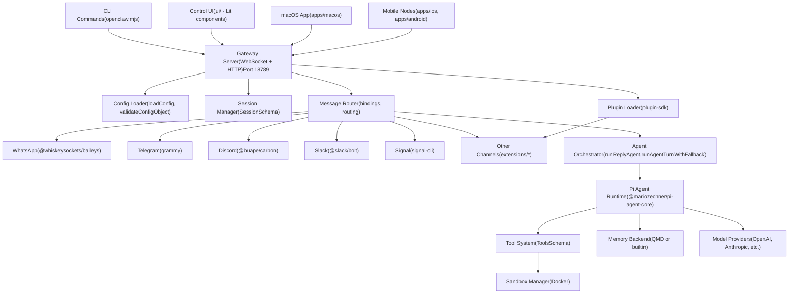
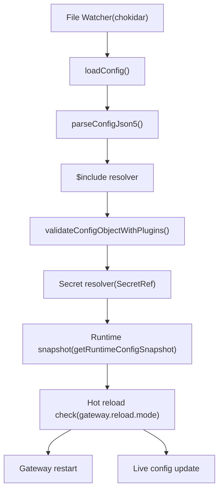
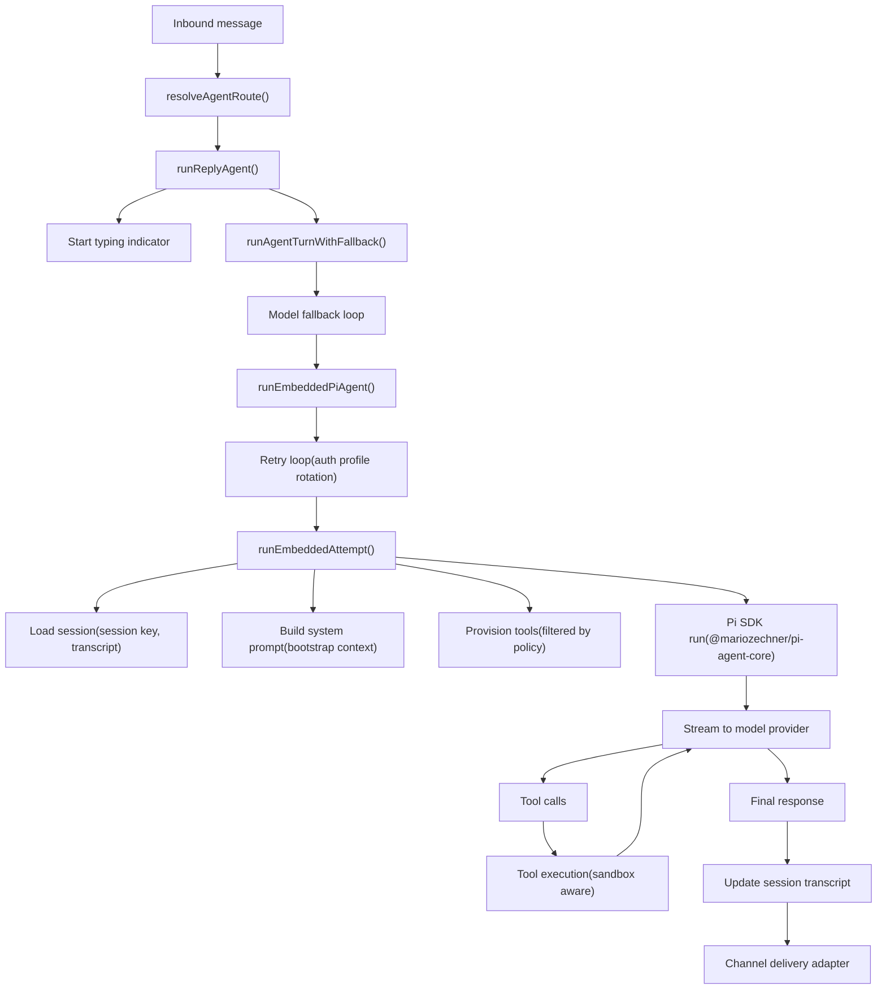
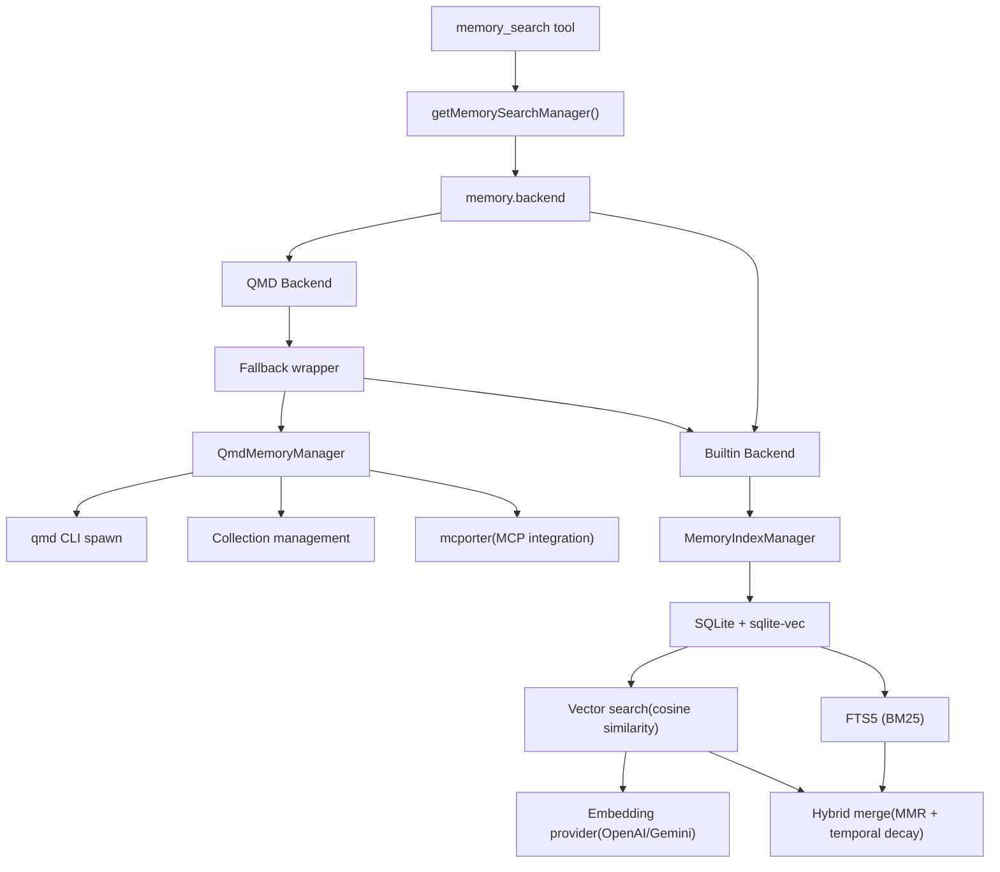
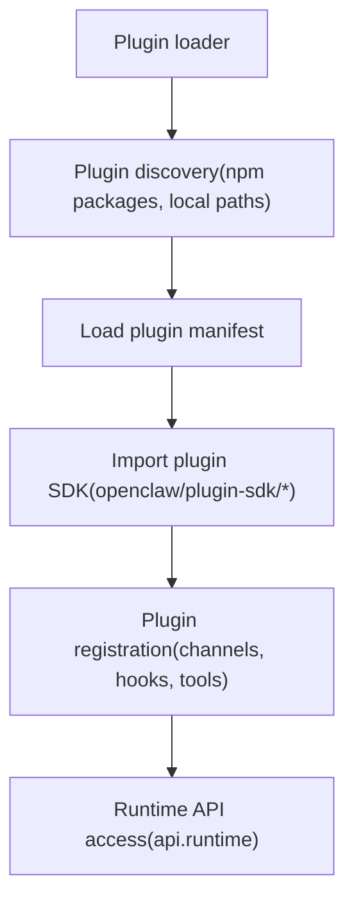

# 概览 (Overview)

相关源文件

-   [CHANGELOG.md](https://github.com/openclaw/openclaw/blob/8873e13f/CHANGELOG.md)
-   [README.md](https://github.com/openclaw/openclaw/blob/8873e13f/README.md)
-   [apps/android/app/build.gradle.kts](https://github.com/openclaw/openclaw/blob/8873e13f/apps/android/app/build.gradle.kts)
-   [apps/ios/Sources/Info.plist](https://github.com/openclaw/openclaw/blob/8873e13f/apps/ios/Sources/Info.plist)
-   [apps/ios/Tests/Info.plist](https://github.com/openclaw/openclaw/blob/8873e13f/apps/ios/Tests/Info.plist)
-   [apps/ios/project.yml](https://github.com/openclaw/openclaw/blob/8873e13f/apps/ios/project.yml)
-   [apps/macos/Sources/OpenClaw/Resources/Info.plist](https://github.com/openclaw/openclaw/blob/8873e13f/apps/macos/Sources/OpenClaw/Resources/Info.plist)
-   [assets/avatar-placeholder.svg](https://github.com/openclaw/openclaw/blob/8873e13f/assets/avatar-placeholder.svg)
-   [docs/cli/index.md](https://github.com/openclaw/openclaw/blob/8873e13f/docs/cli/index.md)
-   [docs/gateway/configuration.md](https://github.com/openclaw/openclaw/blob/8873e13f/docs/gateway/configuration.md)
-   [docs/gateway/index.md](https://github.com/openclaw/openclaw/blob/8873e13f/docs/gateway/index.md)
-   [docs/gateway/troubleshooting.md](https://github.com/openclaw/openclaw/blob/8873e13f/docs/gateway/troubleshooting.md)
-   [docs/index.md](https://github.com/openclaw/openclaw/blob/8873e13f/docs/index.md)
-   [docs/platforms/mac/release.md](https://github.com/openclaw/openclaw/blob/8873e13f/docs/platforms/mac/release.md)
-   [docs/start/getting-started.md](https://github.com/openclaw/openclaw/blob/8873e13f/docs/start/getting-started.md)
-   [docs/start/wizard.md](https://github.com/openclaw/openclaw/blob/8873e13f/docs/start/wizard.md)
-   [extensions/bluebubbles/src/send-helpers.ts](https://github.com/openclaw/openclaw/blob/8873e13f/extensions/bluebubbles/src/send-helpers.ts)
-   [package.json](https://github.com/openclaw/openclaw/blob/8873e13f/package.json)
-   [pnpm-lock.yaml](https://github.com/openclaw/openclaw/blob/8873e13f/pnpm-lock.yaml)
-   [scripts/clawtributors-map.json](https://github.com/openclaw/openclaw/blob/8873e13f/scripts/clawtributors-map.json)
-   [scripts/update-clawtributors.ts](https://github.com/openclaw/openclaw/blob/8873e13f/scripts/update-clawtributors.ts)
-   [scripts/update-clawtributors.types.ts](https://github.com/openclaw/openclaw/blob/8873e13f/scripts/update-clawtributors.types.ts)
-   [src/agents/subagent-registry-cleanup.test.ts](https://github.com/openclaw/openclaw/blob/8873e13f/src/agents/subagent-registry-cleanup.test.ts)
-   [src/cli/program.ts](https://github.com/openclaw/openclaw/blob/8873e13f/src/cli/program.ts)
-   [src/config/config.ts](https://github.com/openclaw/openclaw/blob/8873e13f/src/config/config.ts)
-   [src/config/types.ts](https://github.com/openclaw/openclaw/blob/8873e13f/src/config/types.ts)
-   [src/config/zod-schema.ts](https://github.com/openclaw/openclaw/blob/8873e13f/src/config/zod-schema.ts)
-   [ui/package.json](https://github.com/openclaw/openclaw/blob/8873e13f/ui/package.json)

本文档提供了 OpenClaw 代码库、其架构及核心组件的高层技术介绍。它作为开发人员在深入研究特定子系统之前了解系统结构的入口点。

**目的**：介绍整体系统架构、关键代码实体、配置模型和开发工作流。

**范围**：本页涵盖了架构层和主要子系统。有关具体的实现细节，请参见：

-   网关内部机制与服务生命周期 (Gateway internals and service lifecycle)：[2](/openclaw/openclaw/2-gateway)
-   智能体执行管道与运行时 (Agent execution pipeline and runtime)：[3](/openclaw/openclaw/3-agents)
-   通道集成与消息传递 (Channel integrations and messaging)：[4](/openclaw/openclaw/4-channels)
-   Web UI 与控制面 (Web UI and control surfaces)：[5](/openclaw/openclaw/5-control-ui)
-   原生客户端应用 (节点) (Native client applications (nodes))：[6](/openclaw/openclaw/6-native-clients-(nodes))
-   安全模型与策略 (Security model and policies)：[7](/openclaw/openclaw/7-security)
-   开发工作流与 CI/CD (Development workflows and CI/CD)：[8](/openclaw/openclaw/8-development)

## 什么是 OpenClaw？

OpenClaw 是一个**自托管、多通道的 AI 智能体网关**，它将消息平台（WhatsApp、Telegram、Discord、Slack、Signal、iMessage 等）桥接到 AI 编码智能体。它作为一个单一的持久进程运行，负责管理会话、路由消息、执行工具并协调智能体交互。

**关键特性**：

-   单一 `gateway` 进程服务于所有通道和客户端
-   智能体运行时使用 Pi SDK (`@mariozechner/pi-agent-core`, `@mariozechner/pi-ai`, `@mariozechner/pi-coding-agent`)
-   配置驱动，具有严格的 Zod 验证 (`OpenClawSchema`)
-   插件架构，用于通道扩展和自定义集成
-   具有每个智能体工作区和会话的多智能体路由
-   沙箱支持 (基于 Docker 的隔离，用于不受信任的会话)

来源：[package.json1-443](https://github.com/openclaw/openclaw/blob/8873e13f/package.json#L1-L443) [README.md1-581](https://github.com/openclaw/openclaw/blob/8873e13f/README.md#L1-L581) [src/config/zod-schema.ts1-694](https://github.com/openclaw/openclaw/blob/8873e13f/src/config/zod-schema.ts#L1-L694)

## 核心架构


来源：[package.json1-443](https://github.com/openclaw/openclaw/blob/8873e13f/package.json#L1-L443) [README.md186-202](https://github.com/openclaw/openclaw/blob/8873e13f/README.md#L186-L202) [src/config/types.ts1-36](https://github.com/openclaw/openclaw/blob/8873e13f/src/config/types.ts#L1-L36)

## 配置系统

OpenClaw 使用位于 `~/.openclaw/openclaw.json` 的严格、经过模式验证的配置文件（带有注释和尾随逗号的 JSON5 格式）。

### 核心配置模式 (Core Config Schema)

配置由 `OpenClawSchema` 定义，包括以下顶级部分：

| 部分 (Section) | 模式 (Schema) | 目的 |
| --- | --- | --- |
| `gateway` | 网关设置 | 端口、绑定地址、身份验证模式、重新加载行为 |
| `agents` | `AgentsSchema` | 智能体列表、默认值、工作区路径 |
| `channels` | `ChannelsSchema` | 通道特定配置（WhatsApp、Telegram、Discord 等） |
| `models` | `ModelsConfigSchema` | 模型提供商、身份验证配置文件、回退 |
| `tools` | `ToolsSchema` | 工具策略、沙箱设置、浏览器配置 |
| `session` | `SessionSchema` | 会话范围、重置策略、线程绑定 |
| `messages` | `MessagesSchema` | 消息传递、分块、媒体处理 |
| `bindings` | `BindingsSchema` | 多智能体路由规则 |
| `memory` | `MemorySchema` | 内存后端选择 (QMD 或内置) |
| `plugins` | 插件条目 | 扩展配置和钩子 |
| `hooks` | `HooksSchema` | Webhook 端点和映射 |
| `cron` | Cron 设置 | 作业调度和执行 |
| `browser` | 浏览器配置 | Playwright/CDP 设置、配置文件 |
| `secrets` | `SecretsConfigSchema` | SecretRef 定义 (env/file/exec) |

### 配置生命周期


**关键代码实体**：

-   `loadConfig()` - 主配置加载器 [src/config/config.ts1-24](https://github.com/openclaw/openclaw/blob/8873e13f/src/config/config.ts#L1-L24)
-   `validateConfigObjectWithPlugins()` - 带有插件模式的 Zod 验证
-   `OpenClawSchema` - 根 Zod 模式 [src/config/zod-schema.ts162-694](https://github.com/openclaw/openclaw/blob/8873e13f/src/config/zod-schema.ts#L162-L694)
-   `gateway.reload.mode` - 控制热重载行为 (`hybrid`, `hot`, `restart`, `off`)

来源：[src/config/zod-schema.ts1-694](https://github.com/openclaw/openclaw/blob/8873e13f/src/config/zod-schema.ts#L1-L694) [src/config/config.ts1-24](https://github.com/openclaw/openclaw/blob/8873e13f/src/config/config.ts#L1-L24) [docs/gateway/configuration.md1-489](https://github.com/openclaw/openclaw/blob/8873e13f/docs/gateway/configuration.md#L1-L489)

## 多通道架构

OpenClaw 通过提供者模式同时支持多个消息平台。每个通道具有：

1.  **Monitor** - 监听入站事件
2.  **访问控制 (Access control)** - DM/群组策略 (`dmPolicy`, `groupPolicy`)
3.  **发送适配器 (Send adapter)** - 出站消息传递
4.  **原生命令注册 (Native command registration)** - 平台特定命令（Discord 斜杠命令、Telegram 机器人菜单）

### 通道提供者映射

| 通道 | 提供者包 | 配置键 | DM 策略 |
| --- | --- | --- | --- |
| WhatsApp | `@whiskeysockets/baileys` | `channels.whatsapp` | `pairing` (默认) |
| Telegram | `grammy` | `channels.telegram` | `pairing` (默认) |
| Discord | `@buape/carbon` | `channels.discord` | `pairing` (默认) |
| Slack | `@slack/bolt` | `channels.slack` | `pairing` (默认) |
| Signal | signal-cli | `channels.signal` | `allowlist` |
| iMessage | imsg (旧版) | `channels.imessage` | N/A (仅限 macOS) |
| BlueBubbles | HTTP API | `channels.bluebubbles` | `allowlist` |
| Google Chat | 插件 | `plugins.entries.googlechat` | 通过插件配置 |
| Mattermost | 插件 | `plugins.entries.mattermost` | 通过插件配置 |

**通道加载模式**：

-   内置通道：WhatsApp, Telegram, Discord, Slack, Signal, iMessage
-   插件通道：通过 `plugins.load.paths` 加载并通过插件 SDK 注册
-   所有通道共享通用的 `ChannelMonitor` 接口

来源：[package.json332-384](https://github.com/openclaw/openclaw/blob/8873e13f/package.json#L332-L384) [src/config/zod-schema.ts417-694](https://github.com/openclaw/openclaw/blob/8873e13f/src/config/zod-schema.ts#L417-L694) [README.md152-154](https://github.com/openclaw/openclaw/blob/8873e13f/README.md#L152-L154)

## 智能体执行管道 (Agent Execution Pipeline)

智能体执行系统使用分层编排模型：


**关键执行函数**（按调用顺序）：

1.  `runReplyAgent()` - 顶级入口点，管理正在输入指示器和内存刷新
2.  `runAgentTurnWithFallback()` - 实现模型回退逻辑
3.  `runEmbeddedPiAgent()` - 处理跨身份验证配置文件的重试/回退
4.  `runEmbeddedAttempt()` - 使用 Pi SDK 的单次轮次执行

**工具配置 (Tool provisioning)**：

-   `ToolsSchema` 定义全局工具策略
-   分层过滤：全局 → 智能体 → 群组 → 沙箱
-   沙箱模式 (`agents.defaults.sandbox.mode`)：`off`, `non-main`, `all`

来源：[package.json55-66](https://github.com/openclaw/openclaw/blob/8873e13f/package.json#L55-L66) [src/config/zod-schema.ts3-23](https://github.com/openclaw/openclaw/blob/8873e13f/src/config/zod-schema.ts#L3-L23)

## 内存系统架构 (Memory System Architecture)

OpenClaw 通过插件插槽选择支持两个内存后端：


**内存后端选择**：

-   `memory.backend: "qmd"` - 外部 QMD 进程（通过 mcporter 支持 MCP）
-   `memory.backend: "builtin"` - 嵌入式 SQLite，具有 FTS5 和 sqlite-vec
-   回退：QMD → 发生错误时回退到 Builtin

**配置实体**：

-   `MemorySchema` [src/config/zod-schema.ts114-121](https://github.com/openclaw/openclaw/blob/8873e13f/src/config/zod-schema.ts#L114-L121)
-   `MemoryQmdSchema` [src/config/zod-schema.ts100-112](https://github.com/openclaw/openclaw/blob/8873e13f/src/config/zod-schema.ts#L100-L112)
-   `memory.citations` - 控制引用修饰 (`auto`, `on`, `off`)

来源：[src/config/zod-schema.ts44-121](https://github.com/openclaw/openclaw/blob/8873e13f/src/config/zod-schema.ts#L44-L121) [package.json163-165](https://github.com/openclaw/openclaw/blob/8873e13f/package.json#L163-L165)

## 网关服务生命周期 (Gateway Service Lifecycle)

OpenClaw 作为一个持久的后台服务运行（Linux 上为 systemd，macOS 上为 launchd）。

### 服务管理命令

| 命令 | 目的 |
| --- | --- |
| `openclaw gateway install` | 安装 systemd/launchd 服务单元 |
| `openclaw gateway start` | 启动服务 |
| `openclaw gateway stop` | 停止服务 |
| `openclaw gateway restart` | 重启服务 |
| `openclaw gateway status` | 检查服务状态和 RPC 探测 |
| `openclaw gateway run` | 在前台运行网关 (开发模式) |

### 运行时路径

| 路径 | 目的 | 配置/环境变量覆盖 |
| --- | --- | --- |
| `~/.openclaw/openclaw.json` | 主配置文件 | `OPENCLAW_CONFIG_PATH` |
| `~/.openclaw/sessions.json` | 会话状态 | N/A |
| `~/.openclaw/credentials/` | OAuth/API 密钥存储 | N/A |
| `~/.openclaw/workspace/` | 默认智能体工作区 | `agents.defaults.workspace` |
| `~/.openclaw/logs/` | 日志文件 | `logging.file` |
| `~/.openclaw/.env` | 环境变量 | N/A |

**配置文件隔离 (Profile isolation)**：

-   `--dev` 标志 → `~/.openclaw-dev/`
-   `--profile <name>` → `~/.openclaw-<name>/`
-   `OPENCLAW_STATE_DIR` 环境变量用于自定义状态根目录

来源：[src/config/paths.ts](https://github.com/openclaw/openclaw/blob/8873e13f/src/config/paths.ts) (引用但未提供)，[docs/cli/index.md63-68](https://github.com/openclaw/openclaw/blob/8873e13f/docs/cli/index.md#L63-L68) [README.md52-90](https://github.com/openclaw/openclaw/blob/8873e13f/README.md#L52-L90)

## 插件架构 (Plugin Architecture)

OpenClaw 使用插件系统进行扩展：


**插件 SDK 导出**（按子系统分组）：

-   `openclaw/plugin-sdk/core` - 核心插件实用工具
-   `openclaw/plugin-sdk/telegram` - Telegram 通道 API
-   `openclaw/plugin-sdk/discord` - Discord 通道 API
-   `openclaw/plugin-sdk/slack` - Slack 通道 API
-   捆绑扩展的特定插件子路径

**插件配置**：

-   `plugins.load.paths` - 要从中加载插件的路径数组
-   `plugins.entries.<id>.enabled` - 启用/禁用特定插件
-   `plugins.entries.<id>.config` - 插件特定配置
-   `plugins.entries.<id>.hooks.allowPromptInjection` - 控制提示词修改钩子

来源：[package.json37-215](https://github.com/openclaw/openclaw/blob/8873e13f/package.json#L37-L215) [src/config/zod-schema.ts149-161](https://github.com/openclaw/openclaw/blob/8873e13f/src/config/zod-schema.ts#L149-L161)

## 开发工作流 (Development Workflow)

### 本地开发

```
# 克隆并安装
git clone https://github.com/openclaw/openclaw.git
cd openclaw
pnpm install

# 构建 UI 和主代码库
pnpm ui:build
pnpm build

# 运行入门向导
pnpm openclaw onboard --install-daemon

# 开发模式 (自动重载)
pnpm gateway:watch
```
### 移动端开发

| 平台 | 构建命令 | 输出 |
| --- | --- | --- |
| iOS | `pnpm ios:build` | Xcode 项目 (通过 xcodegen) |
| Android | `pnpm android:assemble` | `apps/android/app/build/outputs/` 中的 APK |
| macOS | `pnpm mac:package` | 已签名的 `.app` 包 |

**iOS/macOS 特定细节**：

-   使用 XcodeGen 生成项目 [apps/ios/project.yml1-200](https://github.com/openclaw/openclaw/blob/8873e13f/apps/ios/project.yml#L1-L200)
-   Swift 6.0 且具有严格并发检查
-   Info.plist 中的 CFBundleVersion/CFBundleShortVersionString

**Android 特定细节**：

-   基于 Gradle 的构建系统 [apps/android/app/build.gradle.kts1-169](https://github.com/openclaw/openclaw/blob/8873e13f/apps/android/app/build.gradle.kts#L1-L169)
-   使用 Material 3 的 Compose UI
-   多 ABI 支持 (arm64-v8a, armeabi-v7a, x86, x86\_64)

来源：[package.json217-330](https://github.com/openclaw/openclaw/blob/8873e13f/package.json#L217-L330) [apps/ios/project.yml1-200](https://github.com/openclaw/openclaw/blob/8873e13f/apps/ios/project.yml#L1-L200) [apps/android/app/build.gradle.kts1-169](https://github.com/openclaw/openclaw/blob/8873e13f/apps/android/app/build.gradle.kts#L1-L169)

## CLI 入口点

主要 CLI 入口点是 `openclaw.mjs`，它委派给由 `buildProgram()` 构建的命令树。

**命令结构**：

-   根：`openclaw [--dev] [--profile <name>] <command>`
-   按领域（网关、通道、智能体、模型等）组织的子命令
-   全局标志：`--dev`, `--profile`, `--no-color`, `--json`, `--version`

**命令领域 (Command domains)**：

-   设置/配置：`onboard`, `configure`, `config`, `doctor`
-   服务：`gateway`, `daemon` (旧版别名)
-   消息传递：`message`, `channels`, `pairing`
-   智能体：`agent`, `agents`, `acp`, `sessions`
-   工具：`models`, `memory`, `browser`, `cron`, `hooks`, `skills`, `plugins`
-   节点：`nodes`, `devices`, `node`
-   安全：`security`, `secrets`, `approvals`, `sandbox`

来源：[src/cli/program.ts1-3](https://github.com/openclaw/openclaw/blob/8873e13f/src/cli/program.ts#L1-L3) [docs/cli/index.md1-547](https://github.com/openclaw/openclaw/blob/8873e13f/docs/cli/index.md#L1-L547)

## 版本与发布信息 (Version and Release Information)

当前版本：**2026.3.2** (构建号 20260301)

**版本位置**：

-   package.json：`version: "2026.3.3"` [package.json3](https://github.com/openclaw/openclaw/blob/8873e13f/package.json#L3-L3)
-   iOS Info.plist：`CFBundleShortVersionString: "2026.3.2"` [apps/ios/Sources/Info.plist22](https://github.com/openclaw/openclaw/blob/8873e13f/apps/ios/Sources/Info.plist#L22-L22)
-   Android build.gradle.kts：`versionName: "2026.3.2"` [apps/android/app/build.gradle.kts25](https://github.com/openclaw/openclaw/blob/8873e13f/apps/android/app/build.gradle.kts#L25-L25)
-   macOS Info.plist：`CFBundleShortVersionString: "2026.3.2"` [apps/macos/Sources/OpenClaw/Resources/Info.plist18](https://github.com/openclaw/openclaw/blob/8873e13f/apps/macos/Sources/OpenClaw/Resources/Info.plist#L18-L18)
-   CHANGELOG.md：最新条目 `## 2026.3.3` [CHANGELOG.md5](https://github.com/openclaw/openclaw/blob/8873e13f/CHANGELOG.md#L5-L5)

**发布通道**：

-   `stable` - 已标记的发布版，npm dist-tag 为 `latest`
-   `beta` - 预发布标记，npm dist-tag 为 `beta`
-   `dev` - `main` 分支的活动头部，npm dist-tag 为 `dev`

来源：[package.json3](https://github.com/openclaw/openclaw/blob/8873e13f/package.json#L3-L3) [CHANGELOG.md1-605](https://github.com/openclaw/openclaw/blob/8873e13f/CHANGELOG.md#L1-L605) [apps/ios/Sources/Info.plist22](https://github.com/openclaw/openclaw/blob/8873e13f/apps/ios/Sources/Info.plist#L22-L22) [apps/android/app/build.gradle.kts24-25](https://github.com/openclaw/openclaw/blob/8873e13f/apps/android/app/build.gradle.kts#L24-L25)
