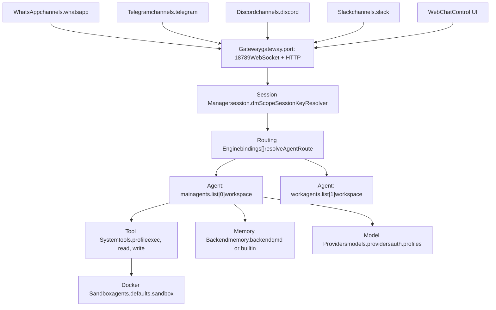
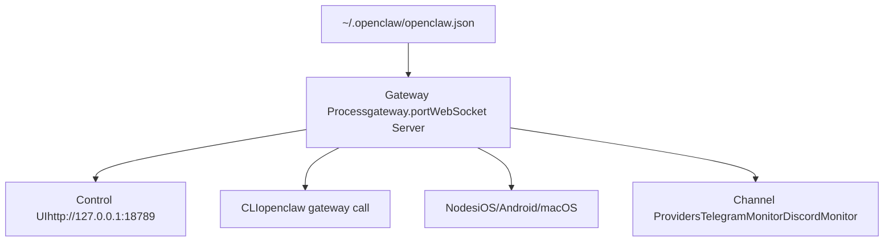

# 核心概念 (Core Concepts)

相关源文件

-   [CHANGELOG.md](https://github.com/openclaw/openclaw/blob/8873e13f/CHANGELOG.md)
-   [README.md](https://github.com/openclaw/openclaw/blob/8873e13f/README.md)
-   [apps/android/app/build.gradle.kts](https://github.com/openclaw/openclaw/blob/8873e13f/apps/android/app/build.gradle.kts)
-   [apps/ios/Sources/Info.plist](https://github.com/openclaw/openclaw/blob/8873e13f/apps/ios/Sources/Info.plist)
-   [apps/ios/Tests/Info.plist](https://github.com/openclaw/openclaw/blob/8873e13f/apps/ios/Tests/Info.plist)
-   [apps/ios/project.yml](https://github.com/openclaw/openclaw/blob/8873e13f/apps/ios/project.yml)
-   [apps/macos/Sources/OpenClaw/Resources/Info.plist](https://github.com/openclaw/openclaw/blob/8873e13f/apps/macos/Sources/OpenClaw/Resources/Info.plist)
-   [assets/avatar-placeholder.svg](https://github.com/openclaw/openclaw/blob/8873e13f/assets/avatar-placeholder.svg)
-   [docs/cli/index.md](https://github.com/openclaw/openclaw/blob/8873e13f/docs/cli/index.md)
-   [docs/gateway/configuration.md](https://github.com/openclaw/openclaw/blob/8873e13f/docs/gateway/configuration.md)
-   [docs/gateway/index.md](https://github.com/openclaw/openclaw/blob/8873e13f/docs/gateway/index.md)
-   [docs/gateway/troubleshooting.md](https://github.com/openclaw/openclaw/blob/8873e13f/docs/gateway/troubleshooting.md)
-   [docs/index.md](https://github.com/openclaw/openclaw/blob/8873e13f/docs/index.md)
-   [docs/platforms/mac/release.md](https://github.com/openclaw/openclaw/blob/8873e13f/docs/platforms/mac/release.md)
-   [docs/start/getting-started.md](https://github.com/openclaw/openclaw/blob/8873e13f/docs/start/getting-started.md)
-   [docs/start/wizard.md](https://github.com/openclaw/openclaw/blob/8873e13f/docs/start/wizard.md)
-   [extensions/bluebubbles/src/send-helpers.ts](https://github.com/openclaw/openclaw/blob/8873e13f/extensions/bluebubbles/src/send-helpers.ts)
-   [package.json](https://github.com/openclaw/openclaw/blob/8873e13f/package.json)
-   [pnpm-lock.yaml](https://github.com/openclaw/openclaw/blob/8873e13f/pnpm-lock.yaml)
-   [scripts/clawtributors-map.json](https://github.com/openclaw/openclaw/blob/8873e13f/scripts/clawtributors-map.json)
-   [scripts/update-clawtributors.ts](https://github.com/openclaw/openclaw/blob/8873e13f/scripts/update-clawtributors.ts)
-   [scripts/update-clawtributors.types.ts](https://github.com/openclaw/openclaw/blob/8873e13f/scripts/update-clawtributors.types.ts)
-   [src/agents/subagent-registry-cleanup.test.ts](https://github.com/openclaw/openclaw/blob/8873e13f/src/agents/subagent-registry-cleanup.test.ts)
-   [src/cli/program.ts](https://github.com/openclaw/openclaw/blob/8873e13f/src/cli/program.ts)
-   [src/config/config.ts](https://github.com/openclaw/openclaw/blob/8873e13f/src/config/config.ts)
-   [src/config/types.ts](https://github.com/openclaw/openclaw/blob/8873e13f/src/config/types.ts)
-   [src/config/zod-schema.ts](https://github.com/openclaw/openclaw/blob/8873e13f/src/config/zod-schema.ts)
-   [ui/package.json](https://github.com/openclaw/openclaw/blob/8873e13f/ui/package.json)

本页定义了 OpenClaw 架构的基本构建块。它涵盖了您在操作该系统时会遇到的核心实体：网关 (Gateway)、智能体 (Agents)、通道 (Channels)、会话 (Sessions)、节点 (Nodes)、技能 (Skills) 和绑定 (Bindings)。

有关运行网关的操作细节，请参见 [网关运行手册 (Gateway Runbook)](/openclaw/openclaw/2-gateway)。有关配置参考，请参见 [配置系统 (Configuration System)](/openclaw/openclaw/2.3-configuration-system) 和 [配置参考 (Configuration Reference)](/openclaw/openclaw/2.3.1-configuration-reference)。

---

## 系统模型概览 (System Model Overview)

OpenClaw 作为一个**多层智能体编排平台**运行，其中中央网关进程将来自各种通道的消息路由到 AI 智能体，并在此过程中管理会话、工具和身份验证。

**来源：** [README.md185-202](https://github.com/openclaw/openclaw/blob/8873e13f/README.md#L185-L202) [docs/index.md59-70](https://github.com/openclaw/openclaw/blob/8873e13f/docs/index.md#L59-L70) [src/config/zod-schema.ts162-800](https://github.com/openclaw/openclaw/blob/8873e13f/src/config/zod-schema.ts#L162-L800)

---

## 网关 (Gateway)

**网关 (Gateway)** 是作为单个长寿命进程运行的中央控制面。所有通信都通过统一端口（默认为 `18789`）通过 WebSocket 和 HTTP 流经它。

### 职责

1.  **WebSocket 协议服务器** — 适用于客户端、TUI、控制 UI (Control UI) 和节点 (Nodes) 的协议 v3
2.  **消息路由** — 通过 `resolveAgentRoute` 将入站消息路由到正确的智能体会话
3.  **会话管理** — 使用 `SessionManager` 和转录文件维护对话状态
4.  **通道协调** — 管理所有已配置通道提供者的生命周期
5.  **配置热重载** — 监视配置文件并应用更改（参见 `gateway.reload.mode`）
6.  **身份验证** — 强制执行 `gateway.auth.mode`（令牌/密码）和设备配对

### 关键配置字段

| 字段 | 目的 | 默认值 |
| --- | --- | --- |
| `gateway.port` | WebSocket + HTTP 监听端口 | `18789` |
| `gateway.bind` | 绑定地址 (`loopback`, `lan`, `tailnet`, `custom`) | `loopback` |
| `gateway.auth.mode` | 身份验证模式 (`token` 或 `password`) | 非回环地址时必填 |
| `gateway.auth.token` | 用于 RPC 访问的共享令牌 | (如果 mode=token 则必填) |
| `gateway.reload.mode` | 配置重载行为 (`hybrid`, `hot`, `restart`, `off`) | `hybrid` |

**生命周期：** 通常作为 systemd 用户单元 (Linux) 或 LaunchAgent (macOS) 运行。使用 `openclaw gateway status` 检查运行状况，使用 `openclaw gateway --port 18789` 在前台运行。

**来源：** [docs/gateway/index.md1-350](https://github.com/openclaw/openclaw/blob/8873e13f/docs/gateway/index.md#L1-L350) [src/config/zod-schema.ts490-560](https://github.com/openclaw/openclaw/blob/8873e13f/src/config/zod-schema.ts#L490-L560) [README.md186-202](https://github.com/openclaw/openclaw/blob/8873e13f/README.md#L186-L202) [package.json1-18](https://github.com/openclaw/openclaw/blob/8873e13f/package.json#L1-L18)

---

## 智能体 (Agents)

**智能体 (Agent)** 是一个孤立的 AI 执行单元，拥有自己的工作区、模型配置和会话范围。智能体以嵌入式 RPC 模式运行 Pi 智能体运行时。

### 智能体结构

每个智能体在 `agents.list[]` 中定义，并具有：

-   **`id`** — 唯一标识符（例如 `"main"`, `"work"`）
-   **`workspace`** — 智能体文件的根目录 (`AGENTS.md`, `SOUL.md`, `TOOLS.md` 等)
-   **`model`** — 主要模型 ID 和身份验证配置文件引用
-   **`tools`** — 根据策略分配的一组功能
-   **`memory`** — 用于上下文检索的向量和全文搜索索引

### 运行时隔离

智能体在不同的环境中执行，具体取决于 **沙箱 (Sandbox)** 设置：

| 沙箱模式 | 说明 |
| --- | --- |
| `off` | 在网关进程中运行（最高性能，最低安全性） |
| `non-main` | 对非主智能体使用沙箱（推荐用于测试） |
| `all` | 所有智能体都在沙箱容器中运行（最高安全性） |

**来源：** [docs/agents/index.md1-250](https://github.com/openclaw/openclaw/blob/8873e13f/docs/agents/index.md#L1-L250) [src/config/zod-schema.ts200-300](https://github.com/openclaw/openclaw/blob/8873e13f/src/config/zod-schema.ts#L200-L300)

---

## 通道 (Channels)

**通道 (Channel)** 是消息传递平台（如 Telegram、WhatsApp、Discord）的集成。每个通道都有一个 **监听器 (Monitor)** 和一个 **发送适配器 (Send Adapter)**。

### 访问控制 (Access Control)

通道通过以下方式强制执行安全策略：

-   **`dmPolicy`** — 控制谁可以通过私信 (DM) 与智能体交互 (`pairing`, `allowlist`, `open`)
-   **`groupPolicy`** — 控制在群组/频道中的交互 (`pairing`, `open`, `off`)

### 配对 (Pairing)

配对是将外部帐户关联到 OpenClaw 网关的过程。

-   **设备配对 (Device Pairing)** — 将本地客户端（TUI、WebChat）关联到网关
-   **通道配对 (Channel Pairing)** — 允许特定的 Telegram/WhatsApp 帐户向智能体发送命令

**来源：** [docs/channels/index.md1-400](https://github.com/openclaw/openclaw/blob/8873e13f/docs/channels/index.md#L1-L400) [src/config/zod-schema.ts417-694](https://github.com/openclaw/openclaw/blob/8873e13f/src/config/zod-schema.ts#L417-L694)

---

## 会话 (Sessions)

**会话 (Session)** 包含对话的历史记录（转录）和上下文。会话通过 **会话密钥 (Session Key)** 进行标识。

### 会话密钥 (Session Key)

会话密钥通过 `SessionKeyResolver` 确定，其格式通常为：
`agent:<agentId>:<scope>:<peerId>`

### 会话作用域 (Session Scoping)

`session.dmScope` 配置决定了消息如何被分组成会话：

-   `main` — 所有私信都共享同一个全局会话
-   `per-peer` — 每个发送者都有自己的独立会话（默认且推荐）

**来源：** [docs/gateway/session-management.md1-150](https://github.com/openclaw/openclaw/blob/8873e13f/docs/gateway/session-management.md#L1-L150) [src/config/zod-schema.ts330-360](https://github.com/openclaw/openclaw/blob/8873e13f/src/config/zod-schema.ts#L330-L360)

---

## 节点 (Nodes)

**节点 (Node)** 是运行在远程设备（iOS、Android、macOS）上的轻量级代理，通过网关的 WebSocket 协议进行通信。

### 职责

1.  **功能暴露** — 节点将其主机的硬件功能（位置、摄像头、联系人）暴露为智能体工具
2.  **命令执行** — 节点代表网关执行平台特定的任务
3.  **状态同步** — 节点将本地状态推送到网关进行处理

**配对流程：** 节点必须通过生成的配对码在 `node.pair.request` 下与网关配对。

**来源：** [docs/native-clients-(nodes)/index.md1-180](https://github.com/openclaw/openclaw/blob/8873e13f/docs/native-clients-(nodes)/index.md#L1-L180) [src/gateway/server-methods/nodes.ts1-100](https://github.com/openclaw/openclaw/blob/8873e13f/src/gateway/server-methods/nodes.ts#L1-L100)

---

## 技能 (Skills)

**技能 (Skill)** 是可重用的逻辑或工具包，可以在多个智能体之间共享。

-   **内置技能** — 随 OpenClaw 核心提供的技能
-   **动态技能** — 通过 `skills.install` 命令在运行时安装

**来源：** [docs/agents/skills.md](https://github.com/openclaw/openclaw/blob/8873e13f/docs/agents/skills.md) [src/gateway/server-methods/skills.ts](https://github.com/openclaw/openclaw/blob/8873e13f/src/gateway/server-methods/skills.ts)

---

## 绑定 (Bindings)

**绑定 (Bindings)** 是决定消息如何路由到特定智能体的规则。

-   **默认路由** — 将所有不匹配的消息发送到配置的默认智能体
-   **关键词/正则表达式匹配** — 根据消息内容进行路由
-   **元数据匹配** — 根据来源通道或发送者进行路由

**来源：** [src/config/zod-schema.ts600-650](https://github.com/openclaw/openclaw/blob/8873e13f/src/config/zod-schema.ts#L600-L650)
