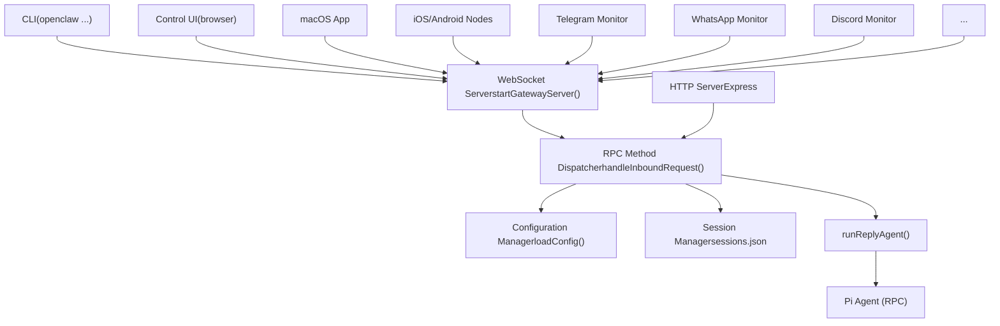
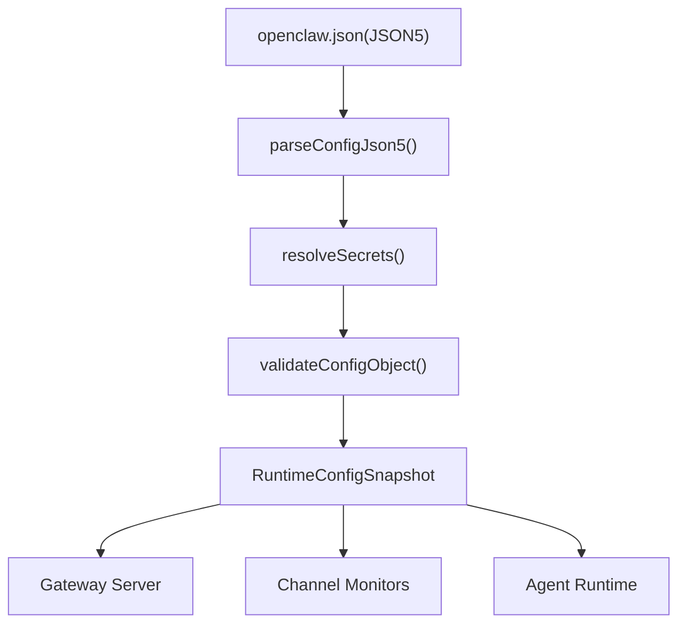

# 网关 (Gateway)

## 目的与范围 (Purpose and Scope)

网关是 OpenClaw 的**中央控制面** —— 一个管理 WebSocket 和 HTTP 通信、在通道和智能体之间路由消息、处理会话和配置以及协调所有系统组件的单一进程。它作为一个守护进程服务运行（macOS 上为 launchd，Linux/WSL2 上为 systemd），并作为客户端（CLI、控制 UI、移动节点）、通道（Telegram、WhatsApp、Discord 等）和智能体执行引擎的统一访问点。

本页涵盖了网关服务器实现、协议、配置系统、身份验证和服务生命周期。相关主题请参见：

-   **WebSocket 协议规范**：参见 [WebSocket 协议与 RPC (WebSocket Protocol & RPC)](/openclaw/openclaw/2.1-websocket-protocol-and-rpc)
-   **身份验证与设备配对流程**：参见 [身份验证与设备配对 (Authentication & Device Pairing)](/openclaw/openclaw/2.2-authentication-and-device-pairing)
-   **配置参考与热重载**：参见 [配置系统 (Configuration System)](/openclaw/openclaw/2.3-configuration-system)
-   **会话路由与隔离**：参见 [会话管理 (Session Management)](/openclaw/openclaw/2.4-session-management)
-   **服务安装与诊断**：参见 [服务生命周期与诊断 (Service Lifecycle & Diagnostics)](/openclaw/openclaw/2.5-service-lifecycle-and-diagnostics)

---

## 架构概览 (Architecture Overview)

网关作为一个统一的服务器运行，公开了：

1.  **WebSocket 端点** (协议 v3)，用于与客户端进行实时双向通信
2.  **HTTP 端点**，用于控制 UI、webhooks、健康检查和 REST 风格的操作
3.  **RPC 方法层**，处理涵盖配置、会话、智能体、通道、cron 和工具的 50 多个方法
4.  **配置系统**，验证并热重载 `~/.openclaw/openclaw.json`
5.  **会话管理**，跟踪对话状态并将消息路由到智能体

**作为中央控制面的网关**


来源：[Diagram 1 (system architecture)](https://github.com/openclaw/openclaw/blob/8873e13f/Diagram 1 (system architecture)) [src/gateway/server.impl.ts1-500](https://github.com/openclaw/openclaw/blob/8873e13f/src/gateway/server.impl.ts#L1-L500) [README.md186-202](https://github.com/openclaw/openclaw/blob/8873e13f/README.md#L186-L202)

---

## 服务器实现 (Server Implementation)

网关服务器在 [src/gateway/server.impl.ts](https://github.com/openclaw/openclaw/blob/8873e13f/src/gateway/server.impl.ts) 中实现，并导出 `startGatewayServer()` 函数，该函数负责：

1.  通过 Zod 模式验证配置
2.  启动 WebSocket 服务器（使用 `ws` 库）
3.  启动 HTTP 服务器（使用 Express）
4.  初始化通道监听器（Telegram, WhatsApp, Discord 等）
5.  为 `openclaw.json` 设置热重载监视器
6.  通过 `handleInboundRequest()` 注册 RPC 方法处理程序

**关键入口点**

| 函数 | 文件 | 目的 |
| --- | --- | --- |
| `startGatewayServer()` | [src/gateway/server.impl.ts](https://github.com/openclaw/openclaw/blob/8873e13f/src/gateway/server.impl.ts) | 主服务器启动；返回销毁回调 |
| `handleInboundRequest()` | [src/gateway/server-methods.ts](https://github.com/openclaw/openclaw/blob/8873e13f/src/gateway/server-methods.ts) | 将 RPC 帧分发到方法处理程序 |
| `loadConfig()` | [src/config/io.ts](https://github.com/openclaw/openclaw/blob/8873e13f/src/config/io.ts) | 加载并使用 Zod 验证 `openclaw.json` |
| `buildProgram()` | [src/cli/program.ts](https://github.com/openclaw/openclaw/blob/8873e13f/src/cli/program.ts) | 为 `openclaw gateway` 调用 `startGatewayServer()` 的 CLI 入口点 |

**服务器启动序列**

> **[Mermaid sequence]**
> *(图表结构无法解析)*

来源：[src/gateway/server.impl.ts100-300](https://github.com/openclaw/openclaw/blob/8873e13f/src/gateway/server.impl.ts#L100-L300) [src/cli/program.ts](https://github.com/openclaw/openclaw/blob/8873e13f/src/cli/program.ts) [src/config/io.ts1-200](https://github.com/openclaw/openclaw/blob/8873e13f/src/config/io.ts#L1-L200)

**端口与绑定配置 (Port and Bind Configuration)**

网关绑定到配置中指定的端口和地址：

```
{
  gateway: {
    port: 18789,           // 默认 WebSocket/HTTP 端口
    bind: "loopback",      // loopback | lan | tailnet | auto | custom
    // custom 模式需要显式的 host：
    host: "192.168.1.100", // 仅适用于 bind="custom"
  }
}
```
-   **Loopback** (`127.0.0.1`)：默认值；仅本地客户端可以连接。
-   **LAN** (`0.0.0.0`)：在所有接口上监听；需要防火墙配置。
-   **Tailnet**：使用 Tailscale Serve/Funnel 进行安全的远程访问。
-   **Auto**：检测 Tailscale 的存在，并回退到 loopback。

来源：[docs/gateway/configuration.md1-100](https://github.com/openclaw/openclaw/blob/8873e13f/docs/gateway/configuration.md#L1-L100) [src/config/types.gateway.ts](https://github.com/openclaw/openclaw/blob/8873e13f/src/config/types.gateway.ts)

---

## 协议 (Protocol v3)

网关对所有 WebSocket 通信使用**协议版本 3**。客户端和服务器交换三种帧类型：`request` (请求)、`response` (响应) 和 `event` (事件)。

**帧类型**

| 帧类型 | 方向 | 模式 (Schema) | 目的 |
| --- | --- | --- | --- |
| `request` | 客户端 → 网关 | `RequestFrame` | 调用 RPC 方法 |
| `response` | 网关 → 客户端 | `ResponseFrame` | 返回方法结果或错误 |
| `event` | 网关 → 客户端 | `EventFrame` | 推送状态更改（会话、聊天增量等） |

**RequestFrame 结构**

```
{
  type: "request",
  id: "unique-request-id",        // 客户端生成的 UUID
  method: "chat.send",             // RPC 方法名称
  params: { sessionKey: "...", ... } // 方法特定参数
}
```
**ResponseFrame 结构**

```
{
  type: "response",
  id: "matching-request-id",
  ok: true,                        // true = 成功, false = 错误
  payload: { ... },                // ok=true 时的结果
  error: {                         // ok=false 时的错误形态
    code: "INVALID_REQUEST",
    message: "...",
    retryAfterMs: 5000             // 可选的速率限制退避
  }
}
```
**EventFrame 结构**

```
{
  type: "event",
  event: "chat:delta",             // 事件名称
  seq: 123,                        // 单调递增序列号
  payload: { sessionKey: "...", content: "..." },
  stateVersion: { sessions: 45 }   // 可选的状态版本
}
```
**错误代码 (Error Codes)**

标准错误代码在 [src/gateway/protocol/schema/error-codes.ts](https://github.com/openclaw/openclaw/blob/8873e13f/src/gateway/protocol/schema/error-codes.ts) 中定义：

-   `NOT_LINKED`：客户端未经过身份验证
-   `NOT_PAIRED`：需要设备配对
-   `AGENT_TIMEOUT`：智能体执行超过超时时间
-   `INVALID_REQUEST`：请求格式错误或缺少必填字段
-   `UNAVAILABLE`：受速率限制或暂时不可用（包含 `retryAfterMs`）

来源：[src/gateway/protocol/schema/frames.ts](https://github.com/openclaw/openclaw/blob/8873e13f/src/gateway/protocol/schema/frames.ts) [src/gateway/protocol/schema/error-codes.ts](https://github.com/openclaw/openclaw/blob/8873e13f/src/gateway/protocol/schema/error-codes.ts) [apps/shared/OpenClawKit/Sources/OpenClawProtocol/GatewayModels.swift1-220](https://github.com/openclaw/openclaw/blob/8873e13f/apps/shared/OpenClawKit/Sources/OpenClawProtocol/GatewayModels.swift#L1-L220)

**协议握手**

> **[Mermaid sequence]**
> *(图表结构无法解析)*

来源：[src/gateway/protocol/schema/types.ts1-100](https://github.com/openclaw/openclaw/blob/8873e13f/src/gateway/protocol/schema/types.ts#L1-L100) [src/gateway/server-methods/connect.ts](https://github.com/openclaw/openclaw/blob/8873e13f/src/gateway/server-methods/connect.ts)

---

## 配置系统 (Configuration System)

配置位于 `~/.openclaw/openclaw.json`（带有注释和尾随逗号的 JSON5 格式）。网关在启动时以及文件更改时都会使用 [src/config/zod-schema.ts](https://github.com/openclaw/openclaw/blob/8873e13f/src/config/zod-schema.ts) 中定义的 **Zod 模式**来验证配置。

**配置加载管道**


来源：[src/config/io.ts1-300](https://github.com/openclaw/openclaw/blob/8873e13f/src/config/io.ts#L1-L300) [src/config/validation.ts](https://github.com/openclaw/openclaw/blob/8873e13f/src/config/validation.ts)

**热重载 (Hot Reload)**

网关监视 `openclaw.json` 并根据 `gateway.reload.mode` 自动应用更改：

| 模式 | 行为 |
| --- | --- |
| `hybrid` (默认) | 热应用安全更改；对关键字段执行自动重启 |
| `hot` | 仅热应用；对需要重启的更改记录警告 |
| `restart` | 任何配置更改都始终重启 |
| `off` | 不监视文件；需要手动重启 |

**可热重载字段**

大多数配置字段无需停机即可热应用：

-   ✅ `channels.*` (所有通道配置)
-   ✅ `agents`, `models`, `tools`, `session`, `messages`
-   ✅ `hooks`, `cron`, `browser`, `skills`
-   ❌ `gateway.port`, `gateway.bind`, `gateway.auth` (需要重启)
-   ❌ `discovery`, `canvasHost`, `plugins` (需要重启)

来源：[docs/gateway/configuration.md348-388](https://github.com/openclaw/openclaw/blob/8873e13f/docs/gateway/configuration.md#L348-L388) [src/config/io.ts200-400](https://github.com/openclaw/openclaw/blob/8873e13f/src/config/io.ts#L200-L400)

**SecretRef 模式**

敏感值（API 密钥、令牌、密码）可以作为 **SecretRef** 存储，而不是纯文本：

```
{
  channels: {
    telegram: {
      botToken: { $ref: { env: "TELEGRAM_BOT_TOKEN" } }
    }
  },
  gateway: {
    auth: {
      token: { $ref: { file: "~/.openclaw/gateway-token.txt" } }
    }
  }
}
```
SecretRef 类型：

-   `env`：从环境变量读取
-   `file`：从文件路径读取
-   `exec`：执行命令并捕获标准输出

来源：[src/config/zod-schema.core.ts10-50](https://github.com/openclaw/openclaw/blob/8873e13f/src/config/zod-schema.core.ts#L10-L50) [src/config/types.secrets.ts](https://github.com/openclaw/openclaw/blob/8873e13f/src/config/types.secrets.ts)

---

## 会话管理 (Session Management)

会话跟踪对话状态并将消息路由到正确的智能体。每个会话都有一个**会话密钥 (session key)**，用于编码作用域、智能体和传递上下文。

**会话密钥格式**

```
agent:<agentId>:<scope>:<identifiers>
```
示例：

-   `agent:main:main` — 默认主会话
-   `agent:main:whatsapp:dm:+15555550123` — 与特定对等方的 WhatsApp DM
-   `agent:work:discord:guild:123:channel:456` — 多智能体设置中的 Discord 频道

**会话隔离 (dmScope)**

`session.dmScope` 设置控制按发送方进行的隔离：

| dmScope | 行为 |
| --- | --- |
| `main` | 所有 DM 共享一个会话 |
| `per-peer` | 每个发送方都获得隔离会话 |
| `per-channel-peer` | 按通道 + 发送方隔离 |
| `per-account-channel-peer` | 按帐户 + 通道 + 发送方隔离 |

来源：[src/config/zod-schema.session.ts](https://github.com/openclaw/openclaw/blob/8873e13f/src/config/zod-schema.session.ts) [docs/gateway/configuration.md178-204](https://github.com/openclaw/openclaw/blob/8873e13f/docs/gateway/configuration.md#L178-L204)

**会话状态持久化**

会话存储在 `~/.openclaw/sessions.json` 中，包含以下字段：

```
{
  sessionKey: string;
  agentId: string;
  workspace: string;
  model?: string;              // 针对每个会话的模型覆盖
  thinkingLevel?: string;      // 针对每个会话的思考级别
  totalTokens?: number;        // 累计使用量
  deliveryContext?: { ... };   // 路由元数据 (通道, 对等方等)
}
```
转录以追加式 JSONL 形式写入 `~/.openclaw/transcripts/<sessionKey>.jsonl`。

来源：[src/gateway/session-utils.types.ts](https://github.com/openclaw/openclaw/blob/8873e13f/src/gateway/session-utils.types.ts) [docs/concepts/session.md](https://github.com/openclaw/openclaw/blob/8873e13f/docs/concepts/session.md)

---

## 身份验证与授权 (Authentication & Authorization)

网关支持两种身份验证模式：

1.  **令牌模式 (Token mode)** (`gateway.auth.mode: "token"`) — 客户端提供共享密钥令牌
2.  **密码模式 (Password mode)** (`gateway.auth.mode: "password"`) — 客户端使用用户名/密码进行身份验证

**令牌身份验证流程**

> **[Mermaid sequence]**
> *(图表结构无法解析)*

来源：[src/gateway/server-methods/connect.ts](https://github.com/openclaw/openclaw/blob/8873e13f/src/gateway/server-methods/connect.ts) [docs/gateway/configuration.md420-450](https://github.com/openclaw/openclaw/blob/8873e13f/docs/gateway/configuration.md#L420-L450)

**基于角色的访问控制 (Role-Based Access Control)**

网关根据身份验证为客户端分配**角色**：

| 角色 | 作用域 (Scopes) | 访问级别 |
| --- | --- | --- |
| `operator` | `admin`, `agent`, `config`, `sessions`, ... | 完整的管理员访问权限 |
| `node` | `nodes`, `agent` (受限) | 设备节点访问权限 |
| `user` | `chat`, `sessions` (只读) | 仅限聊天访问权限 |

方法受 [src/gateway/method-scopes.ts](https://github.com/openclaw/openclaw/blob/8873e13f/src/gateway/method-scopes.ts) 中定义的**作用域要求**保护：

```
const ADMIN_SCOPE = "admin";

const METHOD_SCOPES: Record<string, string[]> = {
  "config.apply": [ADMIN_SCOPE],
  "config.patch": [ADMIN_SCOPE],
  "gateway.restart": [ADMIN_SCOPE],
  "sessions.delete": [ADMIN_SCOPE],
  "chat.send": ["chat"],
  // ...
};
```
来源：[src/gateway/method-scopes.ts](https://github.com/openclaw/openclaw/blob/8873e13f/src/gateway/method-scopes.ts) [src/gateway/role-policy.ts](https://github.com/openclaw/openclaw/blob/8873e13f/src/gateway/role-policy.ts)

**控制面速率限制**

写操作 (`config.apply`, `config.patch`, `update.run`) 被限制为每个 `(deviceId, clientIp)` 对 **每 60 秒 3 个请求**。超过限制的请求返回 `UNAVAILABLE` 并带有 `retryAfterMs`。

来源：[src/gateway/control-plane-rate-limit.ts](https://github.com/openclaw/openclaw/blob/8873e13f/src/gateway/control-plane-rate-limit.ts) [docs/gateway/configuration.md389-412](https://github.com/openclaw/openclaw/blob/8873e13f/docs/gateway/configuration.md#L389-L412)

---

## 服务生命周期 (Service Lifecycle)

网关作为一个通过 `openclaw onboard --install-daemon` 或 `openclaw gateway install` 安装的**用户守护进程**运行：

-   **macOS**：LaunchAgent，位于 `~/Library/LaunchAgents/ai.openclaw.gateway.plist`
-   **Linux/WSL2**：systemd 用户单元，位于 `~/.config/systemd/user/openclaw-gateway.service`

**守护进程管理命令**

| 命令 | 操作 |
| --- | --- |
| `openclaw gateway install` | 安装守护进程服务 |
| `openclaw gateway start` | 启动网关 |
| `openclaw gateway stop` | 停止网关 |
| `openclaw gateway restart` | 重启网关 |
| `openclaw gateway status` | 检查运行时状态 + RPC 探测 |
| `openclaw gateway uninstall` | 移除守护进程服务 |

来源：[src/cli/program/build-program.ts](https://github.com/openclaw/openclaw/blob/8873e13f/src/cli/program/build-program.ts) [docs/cli/gateway.md](https://github.com/openclaw/openclaw/blob/8873e13f/docs/cli/gateway.md)

**健康检查 (Health Checks)**

```
# 检查网关是否正在运行并有响应
openclaw gateway status

# 探测健康端点 (HTTP)
curl http://127.0.0.1:18789/health

# 查看日志
openclaw logs --follow
```
健康检查逻辑验证：

1.  进程正在运行（通过 PID 文件或系统查询）
2.  WebSocket 端口已绑定并正在接受连接
3.  RPC 探测成功（发送 `ping` 请求，期望 `pong` 响应）

来源：[src/gateway/health.ts](https://github.com/openclaw/openclaw/blob/8873e13f/src/gateway/health.ts) [src/cli/program/gateway/status.ts](https://github.com/openclaw/openclaw/blob/8873e13f/src/cli/program/gateway/status.ts)

**重启管理**

当配置更改需要重启时（例如 `gateway.port` 更新），网关会：

1.  将**重启哨兵 (restart sentinel)** 文件写入 `~/.openclaw/restart.sentinel.json`，其中包含元数据（原因、时间戳、用于唤醒 ping 的会话密钥）
2.  优雅地关闭服务器
3.  守护进程管理器 (launchd/systemd) 自动重启进程
4.  启动时，网关读取哨兵文件，向指定会话发送唤醒 ping，并清理哨兵文件

来源：[src/infra/restart-sentinel.ts](https://github.com/openclaw/openclaw/blob/8873e13f/src/infra/restart-sentinel.ts) [src/gateway/server-methods/config.ts200-400](https://github.com/openclaw/openclaw/blob/8873e13f/src/gateway/server-methods/config.ts#L200-L400)

**诊断：`openclaw doctor`**

`doctor` 命令执行自动化的健康检查和修复：

-   ✅ 根据模式验证 `openclaw.json`
-   ✅ 检查旧版配置键并自动迁移
-   ✅ 验证守护进程安装和运行时状态
-   ✅ 探测网关 RPC 可用性
-   ✅ 扫描安全配置错误（开放的 DM 策略、缺少的身份验证等）
-   ✅ 修复文件权限和缺失的目录

运行带 `--fix` 或 `--yes` 的命令以应用自动修复。

来源：[src/cli/program/doctor.ts](https://github.com/openclaw/openclaw/blob/8873e13f/src/cli/program/doctor.ts) [docs/cli/doctor.md](https://github.com/openclaw/openclaw/blob/8873e13f/docs/cli/doctor.md)

---

## RPC 方法 (RPC Methods)

网关公开了按类别组织的 **50 多个 RPC 方法**。方法通过 [src/gateway/server-methods.ts](https://github.com/openclaw/openclaw/blob/8873e13f/src/gateway/server-methods.ts) 中的 `handleInboundRequest()` 进行分发。

**方法类别**

| 类别 | 方法 | 目的 |
| --- | --- | --- |
| `connect.*` | `connect` | 初始握手和身份验证 |
| `chat.*` | `send`, `inject`, `abort`, `history` | 发送消息、中止运行、获取历史记录 |
| `sessions.*` | `list`, `get`, `reset`, `delete`, `patch`, `spawn` | 会话 CRUD 和管理 |
| `agent.*` | `identity`, `wait` | 智能体元数据和同步 |
| `agents.*` | `list`, `create`, `update`, `delete`, `files.*` | 多智能体管理 |
| `config.*` | `get`, `schema`, `apply`, `patch`, `set` | 配置读取/写入 |
| `models.*` | `list`, `status`, `auth.*`, `scan` | 模型目录和身份验证配置文件 |
| `channels.*` | `status`, `logout`, `talk.config` | 通道运行时状态 |
| `cron.*` | `list`, `add`, `update`, `remove`, `run`, `runs`, `status` | Cron 作业管理 |
| `devices.*` | `list`, `pair.*`, `token.*` | 设备配对和令牌管理 |
| `nodes.*` | `list`, `describe`, `invoke` | 节点功能发现和调用 |
| `browser.*` | `status`, `start`, `stop`, `tabs`, `navigate`, ... | 浏览器控制 (20 多个方法) |
| `gateway.*` | `restart`, `status`, `health`, `reload`, `update` | 网关生命周期 |
| `exec.approvals.*` | `get`, `set`, `request`, `resolve` | 命令审批工作流 |
| `secrets.*` | `reload`, `status` | 机密解析和状态 |
| `push.*` | `subscribe` | 推送通知注册 |

**通过 CLI 调用方法**

```
# 通用 RPC 调用
openclaw gateway call <method> --params '{ ... }'

# 示例
openclaw gateway call config.get --params '{}'
openclaw gateway call chat.send --params '{"sessionKey":"agent:main:main","content":"Hello"}'
openclaw gateway call sessions.list --params '{}'
```
来源：[src/gateway/server-methods-list.ts](https://github.com/openclaw/openclaw/blob/8873e13f/src/gateway/server-methods-list.ts) [src/gateway/server-methods.ts1-100](https://github.com/openclaw/openclaw/blob/8873e13f/src/gateway/server-methods.ts#L1-L100) [docs/cli/gateway.md](https://github.com/openclaw/openclaw/blob/8873e13f/docs/cli/gateway.md)

**方法处理程序注册**

处理程序组织在 `src/gateway/server-methods/<category>.ts` 文件中，并注册在 [src/gateway/server-methods.ts](https://github.com/openclaw/openclaw/blob/8873e13f/src/gateway/server-methods.ts) 中：

```
export const METHOD_HANDLERS: Record<string, MethodHandler> = {
  ...connectHandlers,
  ...chatHandlers,
  ...sessionsHandlers,
  ...agentHandlers,
  ...agentsHandlers,
  ...configHandlers,
  ...cronHandlers,
  ...devicesHandlers,
  ...browserHandlers,
  // ...
};
```
每个处理程序接收：

-   `params`：经过验证的方法参数
-   `ctx`：请求上下文 (clientId, role, scopes, deviceId, IP 地址)
-   `server`：网关服务器实例（配置、会话等）

来源：[src/gateway/server-methods.ts50-150](https://github.com/openclaw/openclaw/blob/8873e13f/src/gateway/server-methods.ts#L50-L150) [src/gateway/server-methods/chat.ts](https://github.com/openclaw/openclaw/blob/8873e13f/src/gateway/server-methods/chat.ts) [src/gateway/server-methods/config.ts](https://github.com/openclaw/openclaw/blob/8873e13f/src/gateway/server-methods/config.ts)

---

## 代码实体参考 (Code Entity Reference)

**关键文件与函数**

| 实体 | 文件 | 目的 |
| --- | --- | --- |
| `startGatewayServer()` | [src/gateway/server.impl.ts100-500](https://github.com/openclaw/openclaw/blob/8873e13f/src/gateway/server.impl.ts#L100-L500) | 主服务器入口点 |
| `handleInboundRequest()` | [src/gateway/server-methods.ts200-300](https://github.com/openclaw/openclaw/blob/8873e13f/src/gateway/server-methods.ts#L200-L300) | RPC 方法分发器 |
| `loadConfig()` | [src/config/io.ts50-150](https://github.com/openclaw/openclaw/blob/8873e13f/src/config/io.ts#L50-L150) | 加载并验证 `openclaw.json` |
| `validateConfigObjectWithPlugins()` | [src/config/validation.ts100-200](https://github.com/openclaw/openclaw/blob/8873e13f/src/config/validation.ts#L100-L200) | 带有插件模式合并的 Zod 验证 |
| `OpenClawSchema` | [src/config/zod-schema.ts162-700](https://github.com/openclaw/openclaw/blob/8873e13f/src/config/zod-schema.ts#L162-L700) | 配置的根 Zod 模式 |
| `METHOD_HANDLERS` | [src/gateway/server-methods.ts50-100](https://github.com/openclaw/openclaw/blob/8873e13f/src/gateway/server-methods.ts#L50-L100) | RPC 方法注册表 |
| `ErrorCodes` | [src/gateway/protocol/schema/error-codes.ts](https://github.com/openclaw/openclaw/blob/8873e13f/src/gateway/protocol/schema/error-codes.ts) | 标准错误代码枚举 |
| `RequestFrame` | [src/gateway/protocol/schema/frames.ts](https://github.com/openclaw/openclaw/blob/8873e13f/src/gateway/protocol/schema/frames.ts) | WebSocket 请求帧模式 |
| `ResponseFrame` | [src/gateway/protocol/schema/frames.ts](https://github.com/openclaw/openclaw/blob/8873e13f/src/gateway/protocol/schema/frames.ts) | WebSocket 响应帧模式 |
| `EventFrame` | [src/gateway/protocol/schema/frames.ts](https://github.com/openclaw/openclaw/blob/8873e13f/src/gateway/protocol/schema/frames.ts) | WebSocket 事件帧模式 |
| `ConnectParams` | [src/gateway/protocol/schema/types.ts](https://github.com/openclaw/openclaw/blob/8873e13f/src/gateway/protocol/schema/types.ts) | 握手参数 |
| `HelloOk` | [src/gateway/protocol/schema/types.ts](https://github.com/openclaw/openclaw/blob/8873e13f/src/gateway/protocol/schema/types.ts) | 握手成功响应 |
| `SessionsPatchResult` | [src/gateway/session-utils.types.ts](https://github.com/openclaw/openclaw/blob/8873e13f/src/gateway/session-utils.types.ts) | 会话更新结果类型 |
| `buildProgram()` | [src/cli/program.ts](https://github.com/openclaw/openclaw/blob/8873e13f/src/cli/program.ts) | CLI 程序构建器 (Commander.js) |

**配置类型**

| 类型 | 文件 | 目的 |
| --- | --- | --- |
| `OpenClawConfig` | [src/config/types.openclaw.ts](https://github.com/openclaw/openclaw/blob/8873e13f/src/config/types.openclaw.ts) | 根配置类型 (从 Zod 推断) |
| `GatewayConfig` | [src/config/types.gateway.ts](https://github.com/openclaw/openclaw/blob/8873e13f/src/config/types.gateway.ts) | `config.gateway` 部分 |
| `ChannelsConfig` | [src/config/types.channels.ts](https://github.com/openclaw/openclaw/blob/8873e13f/src/config/types.channels.ts) | `config.channels` 部分 |
| `AgentsConfig` | [src/config/types.agents.ts](https://github.com/openclaw/openclaw/blob/8873e13f/src/config/types.agents.ts) | `config.agents` 部分 |
| `SessionConfig` | [src/config/types.base.ts](https://github.com/openclaw/openclaw/blob/8873e13f/src/config/types.base.ts) | `config.session` 部分 |
| `SecretInput` | [src/config/types.secrets.ts](https://github.com/openclaw/openclaw/blob/8873e13f/src/config/types.secrets.ts) | SecretRef 输入类型 (纯文本或 `$ref`) |

**协议模式导出**

所有协议模式都从 [src/gateway/protocol/index.ts](https://github.com/openclaw/openclaw/blob/8873e13f/src/gateway/protocol/index.ts) 导出，并重新导出到以下位置的 Swift 代码中：[apps/shared/OpenClawKit/Sources/OpenClawProtocol/GatewayModels.swift](https://github.com/openclaw/openclaw/blob/8873e13f/apps/shared/OpenClawKit/Sources/OpenClawProtocol/GatewayModels.swift) 和 [apps/macos/Sources/OpenClawProtocol/GatewayModels.swift](https://github.com/openclaw/openclaw/blob/8873e13f/apps/macos/Sources/OpenClawProtocol/GatewayModels.swift)

来源：[src/gateway/server.ts](https://github.com/openclaw/openclaw/blob/8873e13f/src/gateway/server.ts) [src/gateway/protocol/index.ts1-300](https://github.com/openclaw/openclaw/blob/8873e13f/src/gateway/protocol/index.ts#L1-L300) [src/config/types.ts1-40](https://github.com/openclaw/openclaw/blob/8873e13f/src/config/types.ts#L1-L40)
