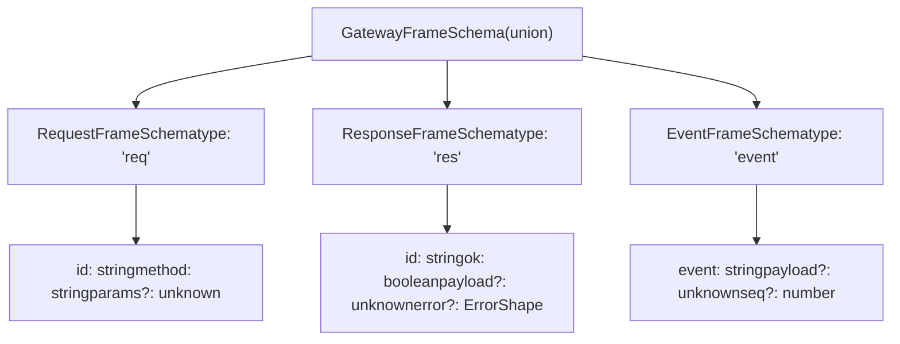
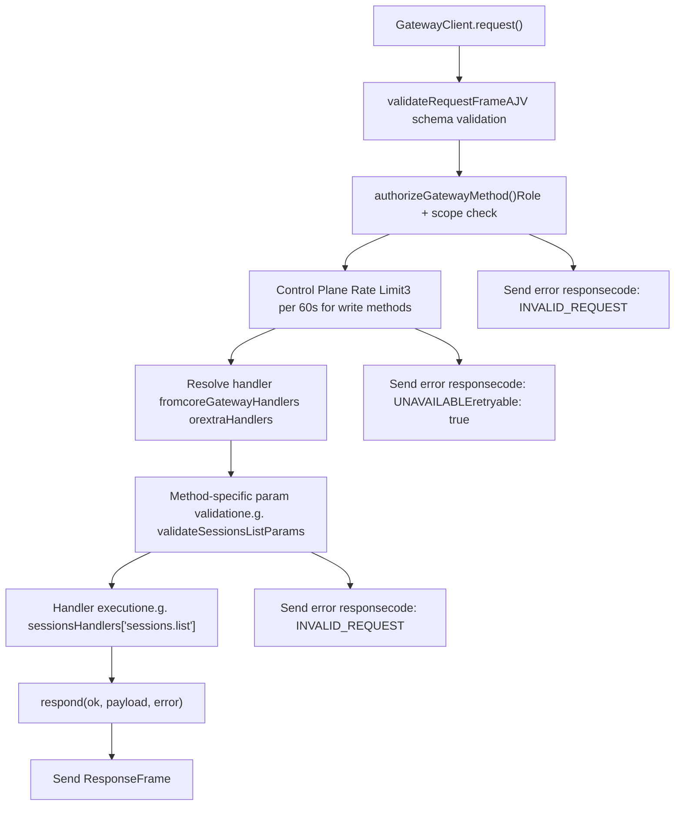
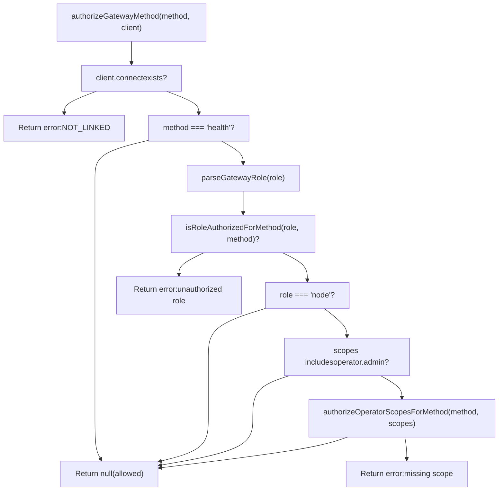
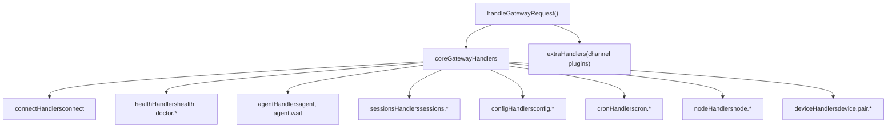
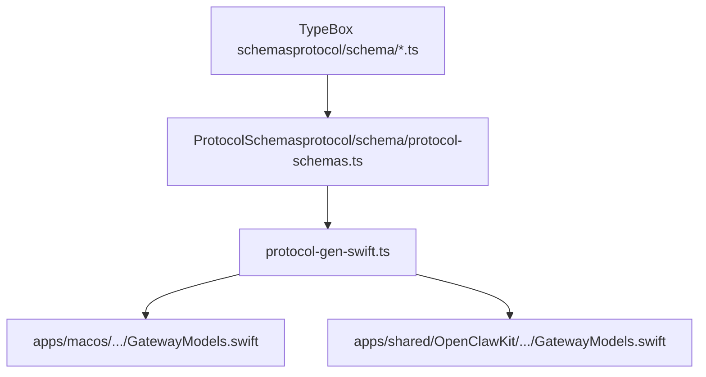

# WebSocket 协议与 RPC (WebSocket Protocol & RPC)

相关源文件

-   [src/discord/monitor/thread-bindings.shared-state.test.ts](https://github.com/openclaw/openclaw/blob/8873e13f/src/discord/monitor/thread-bindings.shared-state.test.ts)
-   [src/gateway/method-scopes.test.ts](https://github.com/openclaw/openclaw/blob/8873e13f/src/gateway/method-scopes.test.ts)
-   [src/gateway/method-scopes.ts](https://github.com/openclaw/openclaw/blob/8873e13f/src/gateway/method-scopes.ts)
-   [src/gateway/protocol/index.ts](https://github.com/openclaw/openclaw/blob/8873e13f/src/gateway/protocol/index.ts)
-   [src/gateway/protocol/schema.ts](https://github.com/openclaw/openclaw/blob/8873e13f/src/gateway/protocol/schema.ts)
-   [src/gateway/protocol/schema/config.ts](https://github.com/openclaw/openclaw/blob/8873e13f/src/gateway/protocol/schema/config.ts)
-   [src/gateway/protocol/schema/protocol-schemas.ts](https://github.com/openclaw/openclaw/blob/8873e13f/src/gateway/protocol/schema/protocol-schemas.ts)
-   [src/gateway/protocol/schema/types.ts](https://github.com/openclaw/openclaw/blob/8873e13f/src/gateway/protocol/schema/types.ts)
-   [src/gateway/server-methods-list.ts](https://github.com/openclaw/openclaw/blob/8873e13f/src/gateway/server-methods-list.ts)
-   [src/gateway/server-methods.ts](https://github.com/openclaw/openclaw/blob/8873e13f/src/gateway/server-methods.ts)
-   [src/gateway/server-methods/config.ts](https://github.com/openclaw/openclaw/blob/8873e13f/src/gateway/server-methods/config.ts)
-   [src/gateway/server-methods/restart-request.ts](https://github.com/openclaw/openclaw/blob/8873e13f/src/gateway/server-methods/restart-request.ts)
-   [src/gateway/server-methods/update.ts](https://github.com/openclaw/openclaw/blob/8873e13f/src/gateway/server-methods/update.ts)
-   [src/gateway/server.config-patch.test.ts](https://github.com/openclaw/openclaw/blob/8873e13f/src/gateway/server.config-patch.test.ts)
-   [src/gateway/server.ts](https://github.com/openclaw/openclaw/blob/8873e13f/src/gateway/server.ts)

本页记录了网关 (Gateway) 的 WebSocket 协议和 RPC 层：帧类型 (frame types)、连接握手、请求/响应语义、方法授权、服务器推送事件语义、协议版本控制以及完整的方法和事件参考。

身份验证机制（令牌、密码、Tailscale、设备密钥对）在 [身份验证与设备配对 (Authentication & Device Pairing)](/openclaw/openclaw/2.2-authentication-and-device-pairing) 中涵盖。网关配置 (`openclaw.json`) 在 [配置系统 (Configuration System)](/openclaw/openclaw/2.3-configuration-system) 中介绍。HTTP 界面 (`POST /tools/invoke`) 是一个单独的通道，不属于本协议的一部分。

---

## 传输 (Transport)

网关默认监听 `ws://127.0.0.1:18789`。支持通过 TLS (`wss://`) 进行远程访问。所有消息均为**携带 UTF-8 JSON 的文本帧**。不使用二进制帧。

服务器端强制执行的大小限制在 `src/gateway/server-constants.ts` 中定义为 `MAX_PAYLOAD_BYTES`（最大入站消息大小）和 `MAX_BUFFERED_BYTES`（在慢速客户端关闭前的最大写入队列背压）。客户端设置 `maxPayload: 25 * 1024 * 1024` (25 MiB) 以适应大型节点画布 (node canvas) 快照。

来源：[src/gateway/client.ts139-141](https://github.com/openclaw/openclaw/blob/8873e13f/src/gateway/client.ts#L139-L141) [src/gateway/server/ws-connection/message-handler.ts65](https://github.com/openclaw/openclaw/blob/8873e13f/src/gateway/server/ws-connection/message-handler.ts#L65-L65)

---

## 协议版本 (Protocol Version)

`PROTOCOL_VERSION` 从 `src/gateway/protocol/index.ts` 导出（目前为 `3`）。每个 `connect` 请求都携带 `minProtocol` 和 `maxProtocol`。在以下情况下，服务器会拒绝连接：

```
maxProtocol < PROTOCOL_VERSION  或  minProtocol > PROTOCOL_VERSION
```
版本不匹配会导致 WebSocket 关闭代码 `1002`，原因为 `"protocol mismatch"`，响应错误包含 `details: { expectedProtocol: PROTOCOL_VERSION }`。

来源：[src/gateway/protocol/index.ts159](https://github.com/openclaw/openclaw/blob/8873e13f/src/gateway/protocol/index.ts#L159-L159) [src/gateway/server/ws-connection/message-handler.ts435-450](https://github.com/openclaw/openclaw/blob/8873e13f/src/gateway/server/ws-connection/message-handler.ts#L435-L450)

---

## 帧类型 (Frame Types)

所有帧模式 (frame schemas) 均在 `src/gateway/protocol/schema/frames.ts` 中定义，并通过 `src/gateway/protocol/schema.ts` 和 `src/gateway/protocol/index.ts` 重新导出。运行时 AJV 验证器在 `src/gateway/protocol/index.ts` 中编译。

**帧类型层次结构：**


来源：[src/gateway/protocol/schema/frames.ts1-120](https://github.com/openclaw/openclaw/blob/8873e13f/src/gateway/protocol/schema/frames.ts#L1-L120) [src/gateway/protocol/index.ts241-244](https://github.com/openclaw/openclaw/blob/8873e13f/src/gateway/protocol/index.ts#L241-L244)

| 帧 (Frame) | 方向 | 验证器 | 关键字段 |
| --- | --- | --- | --- |
| `RequestFrame` | 客户端 → 服务器 | `validateRequestFrame` | `type: "req"`, `id`, `method`, `params?` |
| `ResponseFrame` | 服务器 → 客户端 | `validateResponseFrame` | `type: "res"`, `id`, `ok`, `payload?`, `error?` |
| `EventFrame` | 服务器 → 客户端 | `validateEventFrame` | `type: "event"`, `event`, `payload?`, `seq?` |

来源：[src/gateway/protocol/index.ts241-244](https://github.com/openclaw/openclaw/blob/8873e13f/src/gateway/protocol/index.ts#L241-L244)

---

## 连接握手 (Connection Handshake)

客户端发送的第一条消息**必须**是 `connect` 请求。在客户端能够发送该请求之前，服务器会发出 `connect.challenge` 事件。来自该事件的 `nonce` 必须包含在 `connect` 请求中（如果使用设备身份验证，则必须包含在设备签名中）。

**握手序列：**

来源：[src/gateway/client.ts356-368](https://github.com/openclaw/openclaw/blob/8873e13f/src/gateway/client.ts#L356-L368) [src/gateway/server/ws-connection/message-handler.ts364-406](https://github.com/openclaw/openclaw/blob/8873e13f/src/gateway/server/ws-connection/message-handler.ts#L364-L406)

如果第一条消息不是有效的 `connect` 请求，服务器将响应错误并以代码 `1008` 关闭连接。

### connect.challenge

由服务器在套接字打开后立即发送，在任何客户端消息到达之前：

```
{  "type": "event",  "event": "connect.challenge",  "payload": { "nonce": "<uuid>", "ts": 1737264000000 }}
```
`nonce` 必须作为 `device.nonce` 逐字包含在 `ConnectParams` 中，并且必须合并到设备签名负载中。服务器强制执行 2 分钟的时钟偏差容差 (`DEVICE_SIGNATURE_SKEW_MS`)。缺失或不匹配的 nonce 将返回包含 `ConnectErrorDetailCodes` 详细代码的结构化错误。

来源：[src/gateway/server/ws-connection/message-handler.ts91](https://github.com/openclaw/openclaw/blob/8873e13f/src/gateway/server/ws-connection/message-handler.ts#L91-L91) [src/gateway/server/ws-connection/message-handler.ts654-676](https://github.com/openclaw/openclaw/blob/8873e13f/src/gateway/server/ws-connection/message-handler.ts#L654-L676)

### ConnectParams

`connect` 方法的参数模式是 `src/gateway/protocol/schema/frames.ts` 中的 `ConnectParamsSchema`。客户端构建并通过 `GatewayClient.sendConnect()` 发送此参数。

| 字段 | 类型 | 备注 |
| --- | --- | --- |
| `minProtocol` | `number` | 客户端支持的最低协议版本 |
| `maxProtocol` | `number` | 客户端支持的最高协议版本 |
| `client.id` | `string` | 众所周知的客户端标识符（例如 `"cli"`, `"control-ui"`, `"node-host"`） |
| `client.version` | `string` | 客户端软件版本 |
| `client.platform` | `string` | 操作系统平台字符串（例如 `"macos"`, `"ios"`, `"linux"`） |
| `client.mode` | `string` | 运行模式（例如 `"cli"`, `"webchat"`, `"node"`） |
| `client.displayName?` | `string` | 在状态列表中显示的人性化名称 |
| `client.instanceId?` | `string` | 用于状态跟踪的唯一实例 UUID |
| `role` | `"operator"` | `"node"` | 请求的连接角色 |
| `scopes` | `string[]` | 请求的操作员作用域（例如 `["operator.admin"]`） |
| `caps` | `string[]` | 声明的客户端能力 (capabilities) |
| `commands?` | `string[]` | 仅限节点角色：声明的可执行命令名称 |
| `auth?` | `object` | `{ token?, deviceToken?, password? }` |
| `device?` | `object` | `{ id, publicKey, signature, signedAt, nonce }` — 设备密钥对身份 |
| `permissions?` | `object` | 能力 键/布尔值 映射 |
| `pathEnv?` | `string` | PATH 覆盖（节点角色） |

来源：[src/gateway/client.ts266-318](https://github.com/openclaw/openclaw/blob/8873e13f/src/gateway/client.ts#L266-L318) [src/gateway/server/ws-connection/message-handler.ts408-466](https://github.com/openclaw/openclaw/blob/8873e13f/src/gateway/server/ws-connection/message-handler.ts#L408-L466)

### HelloOk 响应

成功 `connect` 后，服务器响应 `ok: true` 和 `HelloOk` 负载 (`HelloOkSchema`)：

```
{
  "type": "res",
  "id": "<connect-request-id>",
  "ok": true,
  "payload": {
    "type": "hello-ok",
    "server": { "version": "1.2.3" },
    "snapshot": { "configPath": "/...", "stateDir": "/...", "presence": [...] },
    "auth": { "deviceToken": "...", "role": "operator", "scopes": ["operator.admin"] },
    "policy": { "tickIntervalMs": 30000 },
    "methods": ["health", "status", ...],
    "events": ["connect.challenge", "agent", ...],
    "caps": []
  }
}
```
| 字段 | 描述 |
| --- | --- |
| `server.version` | 网关软件版本字符串 |
| `snapshot` | 初始状态快照 — `SnapshotSchema`（配置路径、状态目录、状态） |
| `auth.deviceToken` | 颁发的每个设备令牌；由 `GatewayClient` 通过 `storeDeviceAuthToken` 存储，用于将来的重新连接 |
| `auth.role` / `auth.scopes` | 此连接确认的角色和作用域 |
| `policy.tickIntervalMs` | `tick` 事件之间的时间间隔；用于配置 tick 看门狗 |
| `methods` | 此连接可用的 RPC 方法 |
| `events` | 可能收到的服务器推送事件 |

来源：[src/gateway/client.ts321-338](https://github.com/openclaw/openclaw/blob/8873e13f/src/gateway/client.ts#L321-L338) [docs/gateway/protocol.md69-100](https://github.com/openclaw/openclaw/blob/8873e13f/docs/gateway/protocol.md#L69-L100)

---

## RPC 架构 (RPC Architecture)

### 请求 / 响应流 (Request / Response Flow)

每个 RPC 调用都使用带有所调用方生成的 UUID `id` 的 `RequestFrame`。服务器发回匹配的 `ResponseFrame`。完整的请求生命周期包括验证、授权、速率限制、处理程序分发和响应序列化。

**RPC 请求处理管道：**


来源：[src/gateway/server-methods.ts98-155](https://github.com/openclaw/openclaw/blob/8873e13f/src/gateway/server-methods.ts#L98-L155) [src/gateway/server/ws-connection/message-handler.ts236-262](https://github.com/openclaw/openclaw/blob/8873e13f/src/gateway/server-methods.ts#L236-L262)

**客户端请求跟踪：**

```
// 请求
{ "type": "req", "id": "550e8400-e29b-41d4-a716-446655440000", "method": "sessions.list", "params": {} }

// 成功
{ "type": "res", "id": "550e8400-e29b-41d4-a716-446655440000", "ok": true, "payload": { "sessions": [...] } }

// 失败
{ "type": "res", "id": "550e8400-e29b-41d4-a716-446655440000", "ok": false, "error": { "code": "INVALID_REQUEST", "message": "missing scope: operator.read" } }
```
`GatewayClient` 维护一个以请求 `id` 为键的 `pending` 映射。当 `ResponseFrame` 到达时，相应的 `Promise` 将被解决 (resolve) 或拒绝 (reject)。

来源：[src/gateway/client.ts496-520](https://github.com/openclaw/openclaw/blob/8873e13f/src/gateway/client.ts#L496-L520)

### 方法授权 (Method Authorization)

所有 RPC 方法（`health` 和 `connect` 除外）都需要基于连接的 `role` 和 `scopes` 进行授权。`authorizeGatewayMethod()` 函数在处理程序分发之前强制执行这些规则。

**授权流程：**


来源：[src/gateway/server-methods.ts38-65](https://github.com/openclaw/openclaw/blob/8873e13f/src/gateway/server-methods.ts#L38-L65) [src/gateway/method-scopes.ts187-205](https://github.com/openclaw/openclaw/blob/8873e13f/src/gateway/method-scopes.ts#L187-205)

**角色与作用域层次结构：**

| 角色 | 作用域 (Scope) | 允许的方法 |
| --- | --- | --- |
| `operator` | `operator.admin` | 所有方法 |
| `operator` | `operator.read` | 只读方法（例如 `health`, `sessions.list`, `config.get`） |
| `operator` | `operator.write` | 写入方法（例如 `send`, `agent`, `chat.send`） |
| `operator` | `operator.approvals` | 执行审批方法（例如 `exec.approval.resolve`） |
| `operator` | `operator.pairing` | 设备/节点配对方法（例如 `node.pair.approve`） |
| `node` | N/A | 节点特定方法（例如 `node.invoke.result`, `node.event`） |

作用域分类在 `src/gateway/method-scopes.ts` 中的 `METHOD_SCOPE_GROUPS` 和 `ADMIN_METHOD_PREFIXES` 中定义。以 `config.`, `wizard.`, `update.`, 或 `exec.approvals.` 为前缀的方法自动需要 `operator.admin` 权限。

来源：[src/gateway/method-scopes.ts29-148](https://github.com/openclaw/openclaw/blob/8873e13f/src/gateway/method-scopes.ts#L29-L148)

### 速率限制 (Rate Limiting)

控制面写入方法 (`config.apply`, `config.patch`, `update.run`) 会受到速率限制以防止滥用。`src/gateway/server-methods.ts` 中的 `CONTROL_PLANE_WRITE_METHODS` 集合定义了哪些方法受此限制。速率限制为每个客户端每 60 秒 3 个请求，由 `consumeControlPlaneWriteBudget()` 强制执行。

受速率限制时，服务器返回错误，包含：

-   `code: "UNAVAILABLE"`
-   `retryable: true`
-   `retryAfterMs: <限制重置前的毫秒数>`

来源：[src/gateway/server-methods.ts37-132](https://github.com/openclaw/openclaw/blob/8873e13f/src/gateway/server-methods.ts#L37-L132)

### 处理程序分发 (Handler Dispatch)

RPC 方法处理程序在 `src/gateway/server-methods/*.ts` 中按子系统组织，并在 `coreGatewayHandlers` 中聚合。通道插件可以通过 `extraHandlers` 注入额外的处理程序。`handleGatewayRequest()` 函数从这些来源解析处理程序，并在插件运行时请求范围内调用它。

**处理程序组织：**


来源：[src/gateway/server-methods.ts67-96](https://github.com/openclaw/openclaw/blob/8873e13f/src/gateway/server-methods.ts#L67-L96) [src/gateway/server-methods.ts98-155](https://github.com/openclaw/openclaw/blob/8873e13f/src/gateway/server-methods.ts#L98-L155)

### 参数验证 (Param Validation)

每个 RPC 方法都有一个专用的、使用 AJV 编译的基于 Zod 的验证器（例如 `validateSessionsListParams`, `validateConfigApplyParams`）。这些验证器在 `src/gateway/protocol/index.ts` 中定义并由处理程序引用。无效参数会导致带有 `code: "INVALID_REQUEST"` 和格式化后的验证错误消息的响应。

来源：[src/gateway/protocol/index.ts249-402](https://github.com/openclaw/openclaw/blob/8873e13f/src/gateway/protocol/index.ts#L249-L402) [src/gateway/protocol/index.ts404-438](https://github.com/openclaw/openclaw/blob/8873e13f/src/gateway/protocol/index.ts#L404-L438)

### 已接受 / 最终模式 (Accepted / Final Pattern)

某些长时间运行的操作（例如智能体运行）在返回最终结果之前会返回中间确认。调用方通过在 `GatewayClient.request()` 中设置 `expectFinal: true` 来发出此信号。

```
// 中间确认 — 调用方继续等待
{ "type": "res", "id": "...", "ok": true, "payload": { "status": "accepted" } }

// 最终响应 — 调用方解决 (resolve)
{ "type": "res", "id": "...", "ok": true, "payload": { <最终结果> } }
```
来源：[src/gateway/client.ts388-393](https://github.com/openclaw/openclaw/blob/8873e13f/src/gateway/client.ts#L388-L393) [src/gateway/client.ts510-511](https://github.com/openclaw/openclaw/blob/8873e13f/src/gateway/client.ts#L510-L511)

---

## 事件语义 (Event Semantics)

`EventFrame` 消息是由服务器推送的，不与任何请求绑定。事件携带单调递增的 `seq` 整数。`GatewayClient` 跟踪 `lastSeq`，当检测到连续序列号之间存在间隙时触发 `onGap` 回调。

```
{ "type": "event", "event": "agent", "seq": 42, "payload": { ... } }
```
`tick` 事件是强制性的心跳。如果 `tickIntervalMs × 2` 时间内未收到 tick，`GatewayClient.startTickWatch()` 会以代码 `4000` (`"tick timeout"`) 关闭套接字。`tickIntervalMs` 值取自 `HelloOk.policy.tickIntervalMs`。

来源：[src/gateway/client.ts369-380](https://github.com/openclaw/openclaw/blob/8873e13f/src/gateway/client.ts#L369-L380) [src/gateway/client.ts445-467](https://github.com/openclaw/openclaw/blob/8873e13f/timezone/src/gateway/client.ts#L445-L467)

---

## 错误形态 (Error Shape)

所有错误响应均携带 `ErrorShape` (`ErrorShapeSchema`)：

```
{
  "code": "INVALID_REQUEST",
  "message": "device nonce mismatch",
  "details": { "code": "DEVICE_AUTH_NONCE_MISMATCH", "reason": "device-nonce-mismatch" }
}
```
`errorShape()` 是 `src/gateway/protocol/index.ts` 导出的一个工厂函数，用于在服务器端构建这些对象。

| `ErrorCodes` 值 | 使用场景 |
| --- | --- |
| `INVALID_REQUEST` | 请求格式错误、身份验证失败、未知方法、作用域检查失败 |
| `NOT_PAIRED` | 需要设备身份但设备未配对 |
| `UNAVAILABLE` | 超过速率限制或服务暂时不可用 |

来源：[src/gateway/protocol/index.ts515-516](https://github.com/openclaw/openclaw/blob/8873e13f/src/gateway/protocol/index.ts#L515-L516) [src/gateway/server/ws-connection/message-handler.ts374-404](https://github.com/openclaw/openclaw/blob/8873e13f/src/gateway/server/ws-connection/message-handler.ts#L374-L404)

---

## WebSocket 关闭代码 (WebSocket Close Codes)

| 代码 | 含义 |
| --- | --- |
| `1000` | 正常关闭 |
| `1002` | 协议版本不匹配 |
| `1006` | 异常关闭（无关闭帧 — 网络中断） |
| `1008` | 违反策略（身份验证失败、握手无效） |
| `1012` | 服务重启 |
| `4000` | Tick 心跳超时（客户端监视器） |

来源：[src/gateway/client.ts74-79](https://github.com/openclaw/openclaw/blob/8873e13f/src/gateway/client.ts#L74-L79) [src/gateway/server/ws-connection/message-handler.ts447-448](https://github.com/openclaw/openclaw/blob/8873e13f/src/gateway/server/ws-connection/message-handler.ts#L447-L448)

---

## 方法参考 (Method Reference)

方法在 `src/gateway/server-methods.ts` 的 `coreGatewayHandlers` 中组装，并由 `handleGatewayRequest()` 分发。通道插件可以通过 `extraHandlers` 注入额外的方法。完整的基础方法列表是 `src/gateway/server-methods-list.ts` 中的 `BASE_METHODS`。

**处理程序模块与导出的方法组：**

| 处理程序模块 | 导出的常量 | 方法 |
| --- | --- | --- |
| `server-methods/connect.ts` | `connectHandlers` | `connect` |
| `server-methods/health.ts` | `healthHandlers` | `health` |
| `server-methods/agent.ts` | `agentHandlers` | `agent`, `agent.identity.get`, `agent.wait` |
| `server-methods/agents.ts` | `agentsHandlers` | `agents.list`, `agents.create`, `agents.update`, `agents.delete`, `agents.files.*` |
| `server-methods/chat.ts` | `chatHandlers` | `chat.history`, `chat.send`, `chat.abort`, `chat.inject` |
| `server-methods/sessions.ts` | `sessionsHandlers` | `sessions.list`, `sessions.patch`, `sessions.reset`, `sessions.delete`, `sessions.compact`, `sessions.preview`, `sessions.resolve`, `sessions.usage` |
| `server-methods/config.ts` | `configHandlers` | `config.get`, `config.set`, `config.apply`, `config.patch`, `config.schema`, `config.schema.lookup` |
| `server-methods/cron.ts` | `cronHandlers` | `cron.list`, `cron.status`, `cron.add`, `cron.update`, `cron.remove`, `cron.run`, `cron.runs` |
| `server-methods/nodes.ts` | `nodeHandlers` | `node.pair.*`, `node.rename`, `node.list`, `node.describe`, `node.invoke`, `node.invoke.result`, `node.event` |
| `server-methods/devices.ts` | `deviceHandlers` | `device.pair.*`, `device.token.*` |
| `server-methods/exec-approvals.ts` | `execApprovalsHandlers` | `exec.approvals.*`, `exec.approval.request`, `exec.approval.resolve` |
| `server-methods/skills.ts` | `skillsHandlers` | `skills.status`, `skills.bins`, `skills.install`, `skills.update` |
| `server-methods/models.ts` | `modelsHandlers` | `models.list` |
| `server-methods/send.ts` | `sendHandlers` | `send`, `poll` |
| `server-methods/update.ts` | `updateHandlers` | `update.run` |
| `server-methods/wizard.ts` | `wizardHandlers` | `wizard.start`, `wizard.next`, `wizard.cancel`, `wizard.status` |

来源：[src/gateway/server-methods.ts7-95](https://github.com/openclaw/openclaw/blob/8873e13f/src/gateway/server-methods.ts#L7-L95) [src/gateway/server-methods-list.ts4-101](https://github.com/openclaw/openclaw/blob/8873e13f/src/gateway/server-methods-list.ts#L4-L101)

### 系统与健康 (System & Health)

| 方法 | 描述 |
| --- | --- |
| `health` | 存活检查 — 无需作用域 |
| `status` | 网关和智能体状态 |
| `usage.status` | 令牌使用情况摘要 |
| `usage.cost` | 费用明细 |
| `doctor.memory.status` | 内存子系统诊断 |
| `logs.tail` | 流式传输最近的日志条目 |
| `secrets.reload` | 热重载机密引用 (secret references) |
| `update.run` | 触发软件更新检查 |

### 智能体 (Agent)

| 方法 | 描述 |
| --- | --- |
| `agent` | 运行一次智能体轮次 (agent turn) |
| `agent.identity.get` | 获取智能体的身份信息 |
| `agent.wait` | 等待正在进行的智能体运行完成 |
| `send` | 向智能体发送消息（非流式） |
| `wake` | 触发智能体唤醒（心跳 / cron） |
| `last-heartbeat` | 获取最后一次心跳时间戳 |
| `set-heartbeats` | 配置心跳时间表 |

### 聊天 (WebChat / Control UI)

| 方法 | 描述 |
| --- | --- |
| `chat.history` | 检索聊天转录 |
| `chat.send` | 发送聊天消息 |
| `chat.abort` | 中止正在进行的流式响应 |

### 会话 (Sessions)

| 方法 | 描述 |
| --- | --- |
| `sessions.list` | 列出会话 |
| `sessions.preview` | 预览会话转录 |
| `sessions.patch` | 更新会话元数据 |
| `sessions.reset` | 重置（清除）会话 |
| `sessions.delete` | 删除会话及其转录 |
| `sessions.compact` | 手动压缩会话上下文 |

### 配置 (Configuration)

| 方法 | 描述 | 所需作用域 |
| --- | --- | --- |
| `config.get` | 读取当前配置快照（脱敏） | `operator.read` |
| `config.set` | 覆盖配置（需要 baseHash） | `operator.admin` |
| `config.apply` | 从原始 JSON5 应用配置，然后安排重启 | `operator.admin` |
| `config.patch` | 合并修补特定配置字段，然后安排重启 | `operator.admin` |
| `config.schema` | 检索带有 UI 提示和标签的配置模式 | `operator.admin` |
| `config.schema.lookup` | 使用子项摘要查找特定配置路径 | `operator.read` |

`config.apply` 和 `config.patch` 方法写入配置文件，然后调用 `scheduleGatewaySigusr1Restart()` 触发网关重启。它们接受可选的 `sessionKey`, `note` 和 `restartDelayMs` 参数来控制重启行为和重启后的消息传递。这两个方法都需要 `baseHash` 参数（从 `config.get` 获取）以防止并发写入冲突。`config.patch` 方法使用 `applyMergePatch()` 将更改合并到现有配置中，而 `config.apply` 则替换整个配置。

来源：[src/gateway/server-methods/config.ts262-513](https://github.com/openclaw/openclaw/blob/8873e13f/src/gateway/server-methods/config.ts#L262-L513)

### Cron

| 方法 | 描述 |
| --- | --- |
| `cron.list` | 列出计划任务 |
| `cron.status` | 获取 cron 服务状态 |
| `cron.add` | 创建新的 cron 任务 |
| `cron.update` | 更新现有的 cron 任务 |
| `cron.remove` | 删除 cron 任务 |
| `cron.run` | 立即触发 cron 任务 |
| `cron.runs` | 检索任务的运行历史记录 |

### 节点 (Nodes)

| 方法 | 描述 |
| --- | --- |
| `node.pair.request` | 发起节点配对 |
| `node.pair.list` | 列出节点配对 |
| `node.pair.approve` / `reject` / `verify` | 管理节点配对 |
| `node.rename` | 重命名已配对的节点 |
| `node.list` | 列出已连接的节点 |
| `node.describe` | 描述节点能力 (capabilities) |
| `node.invoke` | 在节点上调用命令 |
| `node.invoke.result` | 报告节点调用的结果（节点角色） |
| `node.event` | 传递来自节点的事件（节点角色） |
| `node.canvas.capability.refresh` | 刷新 Canvas 能力令牌 |

### 设备 (Devices)

| 方法 | 描述 |
| --- | --- |
| `device.pair.list` | 列出设备配对 |
| `device.pair.approve` / `reject` / `remove` | 管理设备配对 |
| `device.token.rotate` | 轮换设备身份验证令牌 |
| `device.token.revoke` | 撤销设备身份验证令牌 |

### 执行审批 (Exec Approvals)

| 方法 | 描述 |
| --- | --- |
| `exec.approvals.get` / `.set` | 获取/设置网关执行审批策略 |
| `exec.approvals.node.get` / `.set` | 获取/设置节点执行审批策略 |
| `exec.approval.request` | 请求执行审批 |
| `exec.approval.waitDecision` | 长轮询审批决策 |
| `exec.approval.resolve` | 解决审批请求 |

### 智能体管理 (Agents Management)

| 方法 | 描述 |
| --- | --- |
| `agents.list` | 列出已配置的智能体 |
| `agents.create` / `update` / `delete` | 管理智能体定义 |
| `agents.files.list` / `get` / `set` | 读取和写入智能体工作区文件 |

### 其他 (Other)

| 方法 | 描述 |
| --- | --- |
| `channels.status` / `channels.logout` | 通道集成状态和注销 |
| `models.list` | 列出可用的 AI 模型 |
| `skills.status` / `bins` / `install` / `update` | 技能管理 |
| `tools.catalog` | 列出可用的智能体工具 |
| `wizard.start` / `next` / `cancel` / `status` | 交互式入门向导 |
| `talk.config` / `talk.mode` | 语音通话模式配置 |
| `tts.*` | 文本转语音提供商控制 |
| `voicewake.get` / `.set` | 语音唤醒词配置 |
| `push.test` | 测试推送通知传递 |
| `browser.request` | 浏览器自动化控制 |
| `system-presence` / `system-event` | 内部系统状态和事件传递 |

来源：[src/gateway/server-methods-list.ts4-103](https://github.com/openclaw/openclaw/blob/8873e13f/src/gateway/server-methods-list.ts#L4-L103)

---

## 事件参考 (Event Reference)

服务器推送事件在 `src/gateway/server-methods-list.ts` 中的 `GATEWAY_EVENTS` 中声明。负载模式 (payload schemas) 位于 `src/gateway/protocol/schema/` 中。

| 事件 | 模式 (Schema) | 描述 |
| --- | --- | --- |
| `connect.challenge` | — | 套接字打开时发送的 Nonce 挑战（在 `connect` 之前） |
| `tick` | `TickEventSchema` | 携带时间戳的定期心跳 |
| `shutdown` | `ShutdownEventSchema` | 网关正在关闭 |
| `agent` | `AgentEventSchema` | 流式智能体回复片段或运行状态更新 |
| `chat` | `ChatEventSchema` | 推送到 Web 聊天客户端的聊天转录更新 |
| `presence` | `PresenceEntrySchema` | 已连接客户端状态列表更新 |
| `health` | — | 健康快照推送 |
| `heartbeat` | — | 智能体心跳 tick |
| `cron` | — | Cron 任务运行状态更新 |
| `talk.mode` | — | 语音通话模式状态更改 |
| `node.pair.requested` | — | 节点配对请求已发起 |
| `node.pair.resolved` | — | 节点配对请求已被批准或拒绝 |
| `node.invoke.request` | — | 命令调用已分发到节点 |
| `device.pair.requested` | — | 设备配对请求已发起 |
| `device.pair.resolved` | — | 设备配对请求已被批准或拒绝 |

来源：[src/gateway/server-methods-list.ts106-140](https://github.com/openclaw/openclaw/blob/8873e13f/src/gateway/server-methods-list.ts#L106-L140)

---

## 协议模式生成 (Protocol Schema Generation)

`ProtocolSchemas`（所有 TypeBox 模式的命名称映射）从 `src/gateway/protocol/index.ts` 导出。脚本 `scripts/protocol-gen-swift.ts` 从编译后的网关模块读取 `ProtocolSchemas`, `PROTOCOL_VERSION` 和 `ErrorCodes`，并为 macOS 和 iOS 原生客户端发出 `GatewayModels.swift`，使 Swift 类型与 TypeScript 模式定义保持同步。

**模式生成管道：**


来源：[scripts/protocol-gen-swift.ts1-5](https://github.com/openclaw/openclaw/blob/8873e13f/scripts/protocol-gen-swift.ts#L1-L5) [src/gateway/protocol/schema/protocol-schemas.ts1-50](https://github.com/openclaw/openclaw/blob/8873e13f/src/gateway/protocol/schema/protocol-schemas.ts#L1-L50)
