# 配置系统 (Configuration System)

相关源文件

-   [CHANGELOG.md](https://github.com/openclaw/openclaw/blob/8873e13f/CHANGELOG.md)
-   [README.md](https://github.com/openclaw/openclaw/blob/8873e13f/README.md)
-   [apps/android/app/build.gradle.kts](https://github.com/openclaw/openclaw/blob/8873e13f/apps/android/app/build.gradle.kts)
-   [apps/ios/Sources/Info.plist](https://github.com/openclaw/openclaw/blob/8873e13f/apps/ios/Sources/Info.plist)
-   [apps/ios/Tests/Info.plist](https://github.com/openclaw/openclaw/blob/8873e13f/apps/ios/Tests/Info.plist)
-   [apps/ios/project.yml](https://github.com/openclaw/openclaw/blob/8873e13f/apps/ios/project.yml)
-   [apps/macos/Sources/OpenClaw/Resources/Info.plist](https://github.com/openclaw/openclaw/blob/8873e13f/apps/macos/Sources/OpenClaw/Resources/Info.plist)
-   [assets/avatar-placeholder.svg](https://github.com/openclaw/openclaw/blob/8873e13f/assets/avatar-placeholder.svg)
-   [docs/channels/discord.md](https://github.com/openclaw/openclaw/blob/8873e13f/docs/channels/discord.md)
-   [docs/channels/telegram.md](https://github.com/openclaw/openclaw/blob/8873e13f/docs/channels/telegram.md)
-   [docs/cli/index.md](https://github.com/openclaw/openclaw/blob/8873e13f/docs/cli/index.md)
-   [docs/gateway/configuration-reference.md](https://github.com/openclaw/openclaw/blob/8873e13f/docs/gateway/configuration-reference.md)
-   [docs/gateway/configuration.md](https://github.com/openclaw/openclaw/blob/8873e13f/docs/gateway/configuration.md)
-   [docs/gateway/index.md](https://github.com/openclaw/openclaw/blob/8873e13f/docs/gateway/index.md)
-   [docs/gateway/troubleshooting.md](https://github.com/openclaw/openclaw/blob/8873e13f/docs/gateway/troubleshooting.md)
-   [docs/index.md](https://github.com/openclaw/openclaw/blob/8873e13f/docs/index.md)
-   [docs/platforms/mac/release.md](https://github.com/openclaw/openclaw/blob/8873e13f/docs/platforms/mac/release.md)
-   [docs/start/getting-started.md](https://github.com/openclaw/openclaw/blob/8873e13f/docs/start/getting-started.md)
-   [docs/start/wizard.md](https://github.com/openclaw/openclaw/blob/8873e13f/docs/start/wizard.md)
-   [extensions/bluebubbles/src/send-helpers.ts](https://github.com/openclaw/openclaw/blob/8873e13f/extensions/bluebubbles/src/send-helpers.ts)
-   [package.json](https://github.com/openclaw/openclaw/blob/8873e13f/package.json)
-   [pnpm-lock.yaml](https://github.com/openclaw/openclaw/blob/8873e13f/pnpm-lock.yaml)
-   [scripts/clawtributors-map.json](https://github.com/openclaw/openclaw/blob/8873e13f/scripts/clawtributors-map.json)
-   [scripts/update-clawtributors.ts](https://github.com/openclaw/openclaw/blob/8873e13f/scripts/update-clawtributors.ts)
-   [scripts/update-clawtributors.types.ts](https://github.com/openclaw/openclaw/blob/8873e13f/scripts/update-clawtributors.types.ts)
-   [src/acp/control-plane/manager.core.ts](https://github.com/openclaw/openclaw/blob/8873e13f/src/acp/control-plane/manager.core.ts)
-   [src/agents/pi-embedded-runner/tool-result-char-estimator.ts](https://github.com/openclaw/openclaw/blob/8873e13f/src/agents/pi-embedded-runner/tool-result-char-estimator.ts)
-   [src/agents/pi-embedded-runner/tool-result-context-guard.ts](https://github.com/openclaw/openclaw/blob/8873e13f/src/agents/pi-embedded-runner/tool-result-context-guard.ts)
-   [src/agents/subagent-registry-cleanup.test.ts](https://github.com/openclaw/openclaw/blob/8873e13f/src/agents/subagent-registry-cleanup.test.ts)
-   [src/agents/tools/telegram-actions.test.ts](https://github.com/openclaw/openclaw/blob/8873e13f/src/agents/tools/telegram-actions.test.ts)
-   [src/agents/tools/telegram-actions.ts](https://github.com/openclaw/openclaw/blob/8873e13f/src/agents/tools/telegram-actions.ts)
-   [src/auto-reply/skill-commands.test.ts](https://github.com/openclaw/openclaw/blob/8873e13f/src/auto-reply/skill-commands.test.ts)
-   [src/auto-reply/skill-commands.ts](https://github.com/openclaw/openclaw/blob/8873e13f/src/auto-reply/skill-commands.ts)
-   [src/channels/allowlists/resolve-utils.test.ts](https://github.com/openclaw/openclaw/blob/8873e13f/src/channels/allowlists/resolve-utils.test.ts)
-   [src/channels/allowlists/resolve-utils.ts](https://github.com/openclaw/openclaw/blob/8873e13f/src/channels/allowlists/resolve-utils.ts)
-   [src/channels/plugins/actions/actions.test.ts](https://github.com/openclaw/openclaw/blob/8873e13f/src/channels/plugins/actions/actions.test.ts)
-   [src/channels/plugins/actions/telegram.ts](https://github.com/openclaw/openclaw/blob/8873e13f/src/channels/plugins/actions/telegram.ts)
-   [src/cli/program.ts](https://github.com/openclaw/openclaw/blob/8873e13f/src/cli/program.ts)
-   [src/config/config.ts](https://github.com/openclaw/openclaw/blob/8873e13f/src/config/config.ts)
-   [src/config/schema.help.quality.test.ts](https://github.com/openclaw/openclaw/blob/8873e13f/src/config/schema.help.quality.test.ts)
-   [src/config/schema.help.ts](https://github.com/openclaw/openclaw/blob/8873e13f/src/config/schema.help.ts)
-   [src/config/schema.labels.ts](https://github.com/openclaw/openclaw/blob/8873e13f/src/config/schema.labels.ts)
-   [src/config/types.agent-defaults.ts](https://github.com/openclaw/openclaw/blob/8873e13f/src/config/types.agent-defaults.ts)
-   [src/config/types.discord.ts](https://github.com/openclaw/openclaw/blob/8873e13f/src/config/types.discord.ts)
-   [src/config/types.telegram.ts](https://github.com/openclaw/openclaw/blob/8873e13f/src/config/types.telegram.ts)
-   [src/config/types.ts](https://github.com/openclaw/openclaw/blob/8873e13f/src/config/types.ts)
-   [src/config/zod-schema.agent-defaults.ts](https://github.com/openclaw/openclaw/blob/8873e13f/src/config/zod-schema.agent-defaults.ts)
-   [src/config/zod-schema.providers-core.ts](https://github.com/openclaw/openclaw/blob/8873e13f/src/config/zod-schema.providers-core.ts)
-   [src/config/zod-schema.ts](https://github.com/openclaw/openclaw/blob/8873e13f/src/config/zod-schema.ts)
-   [src/discord/monitor.test.ts](https://github.com/openclaw/openclaw/blob/8873e13f/src/discord/monitor.test.ts)
-   [src/discord/monitor/listeners.test.ts](https://github.com/openclaw/openclaw/blob/8873e13f/src/discord/monitor/listeners.test.ts)
-   [src/discord/monitor/listeners.ts](https://github.com/openclaw/openclaw/blob/8873e13f/src/discord/monitor/listeners.ts)
-   [src/discord/monitor/provider.allowlist.test.ts](https://github.com/openclaw/openclaw/blob/8873e13f/src/discord/monitor/provider.allowlist.test.ts)
-   [src/discord/monitor/provider.allowlist.ts](https://github.com/openclaw/openclaw/blob/8873e13f/src/discord/monitor/provider.allowlist.ts)
-   [src/discord/monitor/provider.skill-dedupe.test.ts](https://github.com/openclaw/openclaw/blob/8873e13f/src/discord/monitor/provider.skill-dedupe.test.ts)
-   [src/discord/monitor/provider.test.ts](https://github.com/openclaw/openclaw/blob/8873e13f/src/discord/monitor/provider.test.ts)
-   [src/discord/monitor/provider.ts](https://github.com/openclaw/openclaw/blob/8873e13f/src/discord/monitor/provider.ts)
-   [src/slack/monitor/provider.ts](https://github.com/openclaw/openclaw/blob/8873e13f/src/slack/monitor/provider.ts)
-   [src/telegram/send.test.ts](https://github.com/openclaw/openclaw/blob/8873e13f/src/telegram/send.test.ts)
-   [src/telegram/send.ts](https://github.com/openclaw/openclaw/blob/8873e13f/src/telegram/send.ts)
-   [ui/package.json](https://github.com/openclaw/openclaw/blob/8873e13f/ui/package.json)

配置系统为 OpenClaw 网关及其所有子系统（通道、智能体、工具、模型等）提供运行时配置加载、验证、热重载和管理功能。它从 JSON5 格式的 `~/.openclaw/openclaw.json` 读取配置，对照严格的 Zod 模式 (schema) 进行验证，解析机密引用 (secrets) 和包含项 (includes)，并向所有网关组件公开运行时快照。该系统支持多种重载模式、通过 RPC 进行的程序化更新，以及从旧版本的自动迁移。

有关特定通道的配置模式，请参见 [通道 (Channels)](/openclaw/openclaw/4-channels)。有关智能体和模型配置，请参见 [智能体 (Agents)](/openclaw/openclaw/3-agents)。有关完整的字段参考，请参见第 [2.3.1](/openclaw/openclaw/2.3.1-configuration-reference) 页。

---

## 架构概览 (Architecture Overview)

配置系统作为一个多阶段管道运行，将原始 JSON5 文件转换为经过验证、解析后的运行时快照，供所有网关子系统使用。

### 配置加载管道 (Configuration Loading Pipeline)

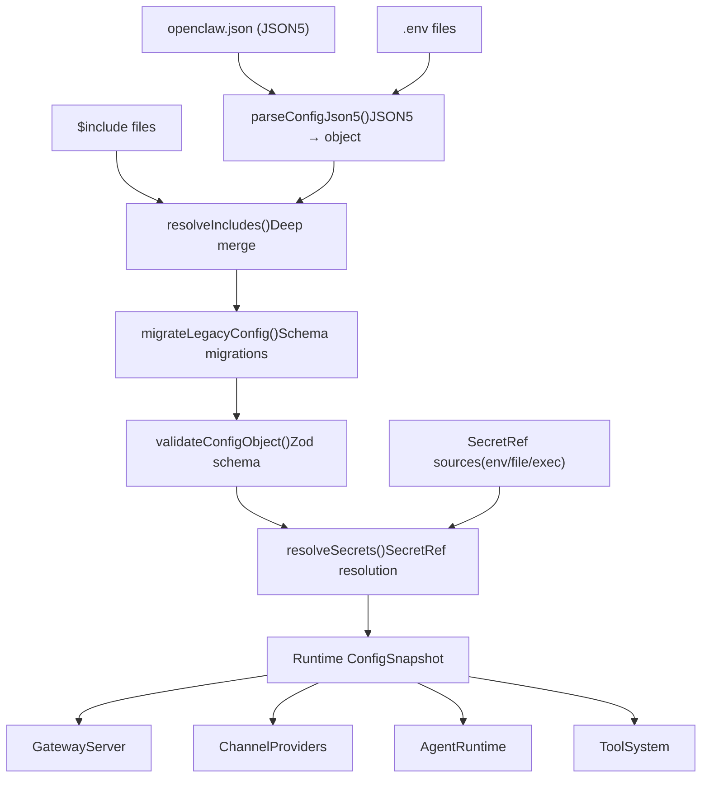
**来源：** [src/config/io.ts1-500](https://github.com/openclaw/openclaw/blob/8873e13f/src/config/io.ts#L1-L500) [src/config/validation.ts1-300](https://github.com/openclaw/openclaw/blob/8873e13f/src/config/validation.ts#L1-L300) [src/config/legacy-migrate.ts1-400](https://github.com/openclaw/openclaw/blob/8873e13f/src/config/legacy-migrate.ts#L1-L400)

---

## 核心配置模块 (Core Configuration Modules)

### 配置 I/O 与加载

`createConfigIO()` 工厂函数为给定的配置文件 (profile) 返回隔离的配置 I/O 操作。主要的入口点是 `loadConfig()`，它协调完整的管道流程：

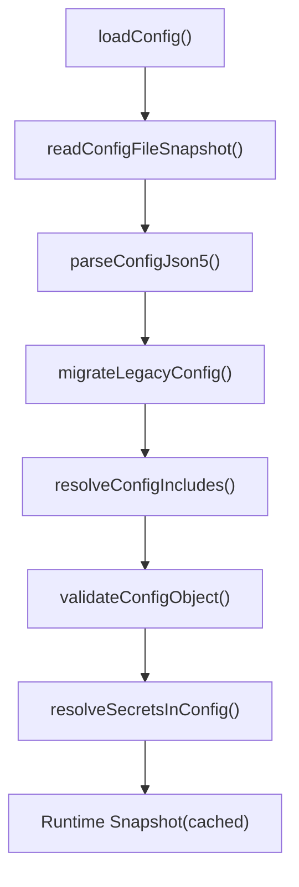
| 函数 | 目的 | 位置 |
| --- | --- | --- |
| `loadConfig()` | 完整的配置加载 + 缓存 | [src/config/io.ts200-250](https://github.com/openclaw/openclaw/blob/8873e13f/src/config/io.ts#L200-L250) |
| `readConfigFileSnapshot()` | 读取原始文件 + 哈希值 | [src/config/io.ts100-150](https://github.com/openclaw/openclaw/blob/8873e13f/src/config/io.ts#L100-L150) |
| `parseConfigJson5()` | JSON5 解析 + 环境变量替换 | [src/config/io.ts50-100](https://github.com/openclaw/openclaw/blob/8873e13f/src/config/io.ts#L50-L100) |
| `validateConfigObject()` | Zod 验证 + 插件处理 | [src/config/validation.ts50-100](https://github.com/openclaw/openclaw/blob/8873e13f/src/config/validation.ts#L50-L100) |
| `migrateLegacyConfig()` | 模式迁移 | [src/config/legacy-migrate.ts1-400](https://github.com/openclaw/openclaw/blob/8873e13f/src/config/legacy-migrate.ts#L1-L400) |
| `resolveConfigIncludes()` | 处理 `$include` 合并 | [src/config/includes.ts1-200](https://github.com/openclaw/openclaw/blob/8873e13f/src/config/includes.ts#L1-L200) |
| `resolveSecretsInConfig()` | SecretRef 解析 | [src/config/secrets/resolver.ts1-300](https://github.com/openclaw/openclaw/blob/8873e13f/src/config/secrets/resolver.ts#L1-L300) |

**来源：** [src/config/io.ts1-500](https://github.com/openclaw/openclaw/blob/8873e13f/src/config/io.ts#L1-L500) [src/config/validation.ts1-300](https://github.com/openclaw/openclaw/blob/8873e13f/src/config/validation.ts#L1-L300)

### 使用 Zod 进行验证

所有配置都对照 `OpenClawSchema` 进行验证，这是一个在 [src/config/zod-schema.ts162-700](https://github.com/openclaw/openclaw/blob/8873e13f/src/config/zod-schema.ts#L162-L700) 中定义的全面 Zod 模式。该模式默认是严格的 —— 未知键会导致验证失败，并且所有字段类型在解析时都会被强制执行。

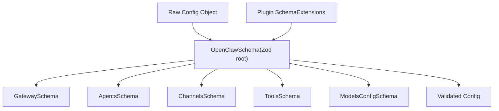
**关键模式特性：**

-   **严格模式**：在所有对象模式上使用 `.strict()` 以拒绝未知键。
-   **默认可选**：大多数字段都有 `.optional()` 以支持部分配置。
-   **自定义转换**：像 `meta.lastTouchedAt` 这样的字段会自动将时间戳强制转换为 ISO 字符串 [src/config/zod-schema.ts169-182](https://github.com/openclaw/openclaw/blob/8873e13f/src/config/zod-schema.ts#L169-L182)。
-   **跨字段细化**：复杂的验证，例如 `dmPolicy: "allowlist"` 要求 `allowFrom` 不能为空 [src/config/zod-schema.core.ts100-150](https://github.com/openclaw/openclaw/blob/8873e13f/src/config/zod-schema.core.ts#L100-L150)。
-   **插件模式合并**：`validateConfigObjectWithPlugins()` 动态合并插件的 Zod 模式 [src/config/validation.ts80-120](https://github.com/openclaw/openclaw/blob/8873e13f/src/config/validation.ts#L80-L120)。

**来源：** [src/config/zod-schema.ts162-700](https://github.com/openclaw/openclaw/blob/8873e13f/src/config/zod-schema.ts#L162-L700) [src/config/validation.ts1-300](https://github.com/openclaw/openclaw/blob/8873e13f/src/config/validation.ts#L1-L300) [src/config/zod-schema.core.ts1-400](https://github.com/openclaw/openclaw/blob/8873e13f/src/config/zod-schema.core.ts#L1-L400)

### SecretRef 模式

SecretRef 系统允许配置值引用存储在配置文件之外的机密（环境变量、文件或可执行文件输出）。引用使用如下语法：

```
{  gateway: {    auth: {      token: { $ref: "env:OPENCLAW_GATEWAY_TOKEN" }    }  }}
```
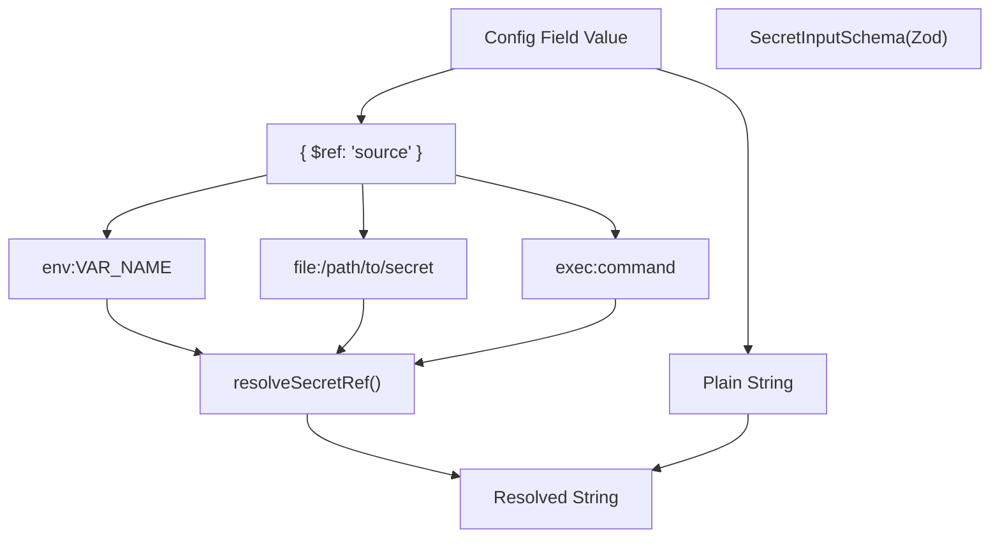
| 引用类型 | 格式 | 解析方式 |
| --- | --- | --- |
| 环境变量 | `env:VAR_NAME` | `process.env.VAR_NAME` |
| 文件 | `file:/absolute/path` | 读取文件内容，修剪空白字符 |
| 可执行文件 | `exec:command args` | 运行命令，捕获标准输出，修剪空白 |

**解析流程：**

1.  `SecretInputSchema` 验证其形状 [src/config/zod-schema.core.ts50-100](https://github.com/openclaw/openclaw/blob/8873e13f/src/config/zod-schema.core.ts#L50-L100)。
2.  `resolveSecretRef()` 执行运行时解析 [src/config/secrets/resolver.ts50-150](https://github.com/openclaw/openclaw/blob/8873e13f/src/config/secrets/resolver.ts#L50-L150)。
3.  标记为 `.register(sensitive)` 的敏感字段在日志中会被脱敏处理 [src/config/zod-schema.sensitive.ts1-50](https://github.com/openclaw/openclaw/blob/8873e13f/src/config/zod-schema.sensitive.ts#L1-L50)。

**来源：** [src/config/zod-schema.core.ts50-100](https://github.com/openclaw/openclaw/blob/8873e13f/src/config/zod-schema.core.ts#L50-L100) [src/config/secrets/resolver.ts1-300](https://github.com/openclaw/openclaw/blob/8873e13f/src/config/secrets/resolver.ts#L1-L300) [src/config/zod-schema.sensitive.ts1-50](https://github.com/openclaw/openclaw/blob/8873e13f/src/config/zod-schema.sensitive.ts#L1-L50)

---

## 热重载系统 (Hot Reload System)

网关监视 `~/.openclaw/openclaw.json`，并根据配置的重载模式自动应用更改，无需手动重启。

### 重载模式 (Reload Modes)

> **[Mermaid stateDiagram]**
> *(图表结构无法解析)*

| 模式 | 行为 | 适用场景 |
| --- | --- | --- |
| **`hybrid`** (默认) | 瞬间热应用安全更改；对关键更改执行自动重启 | 生产环境 (最安全) |
| **`hot`** | 仅热应用安全更改；对关键更改记录警告日志 | 手动控制重启 |
| **`restart`** | 任何配置更改都会始终重启 | 测试/开发 |
| **`off`** | 完全禁用文件监视 | 外部编排环境 |

**配置示例：**

```
{  gateway: {    reload: {      mode: "hybrid",        // hot | restart | hybrid | off      debounceMs: 300        // 合并快速编辑    }  }}
```
### 热应用字段 vs 需要重启的字段

系统将配置字段分为“可热应用”和“需要重启”两类：

| 类别 | 字段 | 需要重启？ |
| --- | --- | --- |
| 通道 (Channels) | `channels.*`, `web.*` | 否 |
| 智能体与模型 | `agents.*`, `models.*`, `bindings.*` | 否 |
| 自动化 | `hooks.*`, `cron.*` | 否 |
| 会话与消息 | `session.*`, `messages.*` | 否 |
| 工具与媒体 | `tools.*`, `browser.*`, `skills.*` | 否 |
| **网关服务器** | `gateway.port`, `gateway.bind`, `gateway.auth.*` | **是** |
| **基础设施** | `discovery.*`, `plugins.*` | **是** |

**例外：** `gateway.reload` 和 `gateway.remote` 更改时**不**触发重启 [docs/gateway/configuration.md380-390](https://github.com/openclaw/openclaw/blob/8873e13f/docs/gateway/configuration.md#L380-L390)。

**实现细节：**

-   字段分类逻辑：[src/gateway/config-reload.ts100-200](https://github.com/openclaw/openclaw/blob/8873e13f/src/gateway/config-reload.ts#L100-L200)
-   热重载编排：[src/gateway/config-reload.ts200-400](https://github.com/openclaw/openclaw/blob/8873e13f/src/gateway/config-reload.ts#L200-L400)
-   重启协调：[src/gateway/restart.ts1-300](https://github.com/openclaw/openclaw/blob/8873e13f/src/gateway/restart.ts#L1-L300)

**来源：** [src/gateway/config-reload.ts1-500](https://github.com/openclaw/openclaw/blob/8873e13f/src/gateway/config-reload.ts#L1-L500) [src/gateway/restart.ts1-300](https://github.com/openclaw/openclaw/blob/8873e13f/src/gateway/restart.ts#L1-L300) [docs/gateway/configuration.md348-388](https://github.com/openclaw/openclaw/blob/8873e13f/docs/gateway/configuration.md#L348-L388)

---

## $include 指令

配置文件可以使用 `$include` 指令进行拆分和组合，支持单文件替换和多文件深度合并。

### 包含项解析 (Include Resolution)

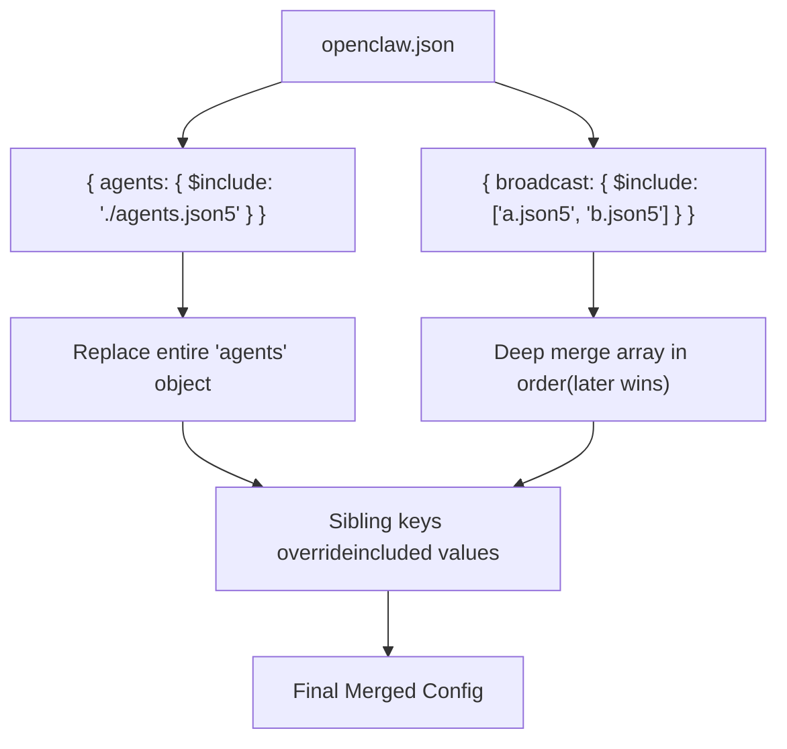
**语义：**

-   **单文件**：`{ $include: "./file.json5" }` 替换包含它的对象。
-   **文件数组**：`{ $include: ["a.json5", "b.json5"] }` 按顺序深度合并（后者胜出）。
-   **兄弟键**：在包含项之后合并，覆盖包含项中的值。
-   **嵌套包含**：支持高达 10 层的嵌套。
-   **相对路径**：相对于发起包含的文件进行解析。

**示例：**

```
// ~/.openclaw/openclaw.json{  gateway: { port: 18789 },  agents: { $include: "./agents.json5" },  broadcast: {    $include: ["./clients/a.json5", "./clients/b.json5"]  }}
```
**错误处理：**

-   文件缺失、解析错误和循环包含都会产生清晰的诊断信息。
-   验证发生在完整的包含项解析**之后**。

**来源：** [src/config/includes.ts1-200](https://github.com/openclaw/openclaw/blob/8873e13f/src/config/includes.ts#L1-L200) [docs/gateway/configuration.md325-347](https://github.com/openclaw/openclaw/blob/8873e13f/docs/gateway/configuration.md#L325-L347)

---

## 配置 RPC (程序化更新)

网关公开了用于程序化配置更新的 WebSocket RPC 方法，支持完整替换 (`config.apply`) 和部分更新 (`config.patch`)。

### RPC 方法

> **[Mermaid sequence]**
> *(图表结构无法解析)*

**速率限制：**

-   控制面写入操作 (`config.apply`, `config.patch`, `update.run`) 被限制为每个 `deviceId+clientIp` 每 60 秒 3 次请求。
-   受限时，RPC 返回 `UNAVAILABLE` 并带有 `retryAfterMs`。

| 方法 | 目的 | 关键参数 |
| --- | --- | --- |
| `config.get` | 获取当前配置 + 哈希值 | — |
| `config.apply` | 完整配置替换 | `raw`, `baseHash`, `sessionKey?` |
| `config.patch` | 部分更新 (JSON 合并补丁) | `raw`, `baseHash`, `sessionKey?` |
| `config.schema.lookup` | 检查单个配置路径 | `path` |

**重启协调：**

-   当有一个重启正在进行时，挂起的重启请求会被合并。
-   重启周期之间有 30 秒的冷静期。
-   可选的 `sessionKey` 参数允许在重启后发送唤醒 ping。

**来源：** [src/gateway/rpc/config.ts1-400](https://github.com/openclaw/openclaw/blob/8873e13f/src/gateway/rpc/config.ts#L1-L400) [src/gateway/restart.ts1-300](https://github.com/openclaw/openclaw/blob/8873e13f/src/gateway/restart.ts#L1-L300) [docs/gateway/configuration.md389-448](https://github.com/openclaw/openclaw/blob/8873e13f/docs/gateway/configuration.md#L389-L448)

---

## 环境变量 (Environment Variables)

配置系统通过多个层级集成环境变量：

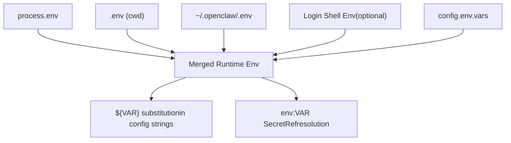
**加载顺序 (不覆盖)：**

1.  `process.env` (最高优先级)
2.  当前工作目录下的 `.env`
3.  `~/.openclaw/.env` (全局回退)
4.  Shell 环境导入 (如果 `env.shellEnv.enabled: true`)
5.  `config.env.vars` (内联配置变量)

**Shell 环境导入配置：**

```
{  env: {    shellEnv: {      enabled: true,      // 运行登录 shell 以导入缺失的变量      timeoutMs: 15000    // Shell 解析超时    },    vars: {      GROQ_API_KEY: "gsk-..."  // 内联变量注入    }  }}
```
**替换语法示例：**

```
{  gateway: {    auth: { token: "${OPENCLAW_GATEWAY_TOKEN}" }  }}
```
**来源：** [src/config/env.ts1-300](https://github.com/openclaw/openclaw/blob/8873e13f/src/config/env.ts#L1-L300) [src/config/io.ts50-100](https://github.com/openclaw/openclaw/blob/8873e13f/src/config/io.ts#L50-L100) [docs/gateway/configuration.md449-488](https://github.com/openclaw/openclaw/blob/8873e13f/docs/gateway/configuration.md#L449-L488)

---

## 旧版本迁移系统 (Legacy Migration System)

配置系统包含从旧版本配置格式的自动迁移，在验证期间触发：

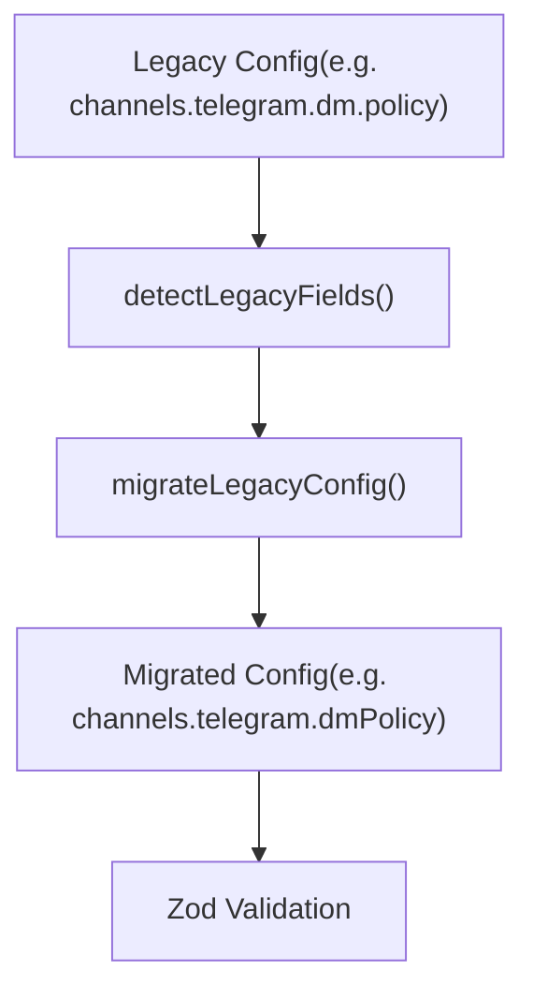
**迁移示例：**

| 旧字段 | 新字段 | 说明 |
| --- | --- | --- |
| `channels.telegram.dm.policy` | `channels.telegram.dmPolicy` | DM 策略扁平化 |
| `channels.discord.dm.allowFrom` | `channels.discord.allowFrom` | DM 白名单扁平化 |
| `heartbeat` (根路径) | `agents.defaults.heartbeat` | 智能体范围的心跳配置 |
| `channels.telegram.groups."*".requireMention: false` | `requireMention: true` (新默认值) | 提及门控反转 |

**行为特性：**

-   迁移在 Zod 验证**之前**运行。
-   成功迁移后会删除旧字段。
-   迁移失败会阻止启动；运行 `openclaw doctor --fix` 进行修复。
-   无法自动迁移的旧条目会产生详细的错误信息 [src/config/legacy-migrate.ts300-400](https://github.com/openclaw/openclaw/blob/8873e13f/src/config/legacy-migrate.ts#L300-L400)。

**来源：** [src/config/legacy-migrate.ts1-400](https://github.com/openclaw/openclaw/blob/8873e13f/src/config/legacy-migrate.ts#L1-L400) [CHANGELOG.md118](https://github.com/openclaw/openclaw/blob/8873e13f/CHANGELOG.md#L118-L118)

---

## 运行时配置快照 (Runtime Config Snapshot)

经过验证和解析的配置被缓存为运行时快照，可通过 `getRuntimeConfigSnapshot()` 访问。所有网关子系统都使用此快照，而不是重新解析配置文件。

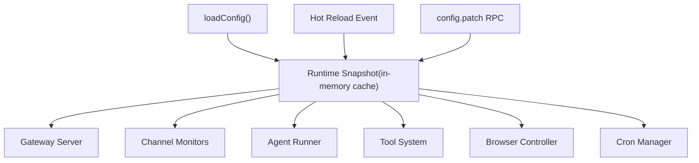
**关键函数：**

| 函数 | 目的 | 位置 |
| --- | --- | --- |
| `getRuntimeConfigSnapshot()` | 检索缓存的配置 | [src/config/io.ts400-420](https://github.com/openclaw/openclaw/blob/8873e13f/src/config/io.ts#L400-L420) |
| `setRuntimeConfigSnapshot()` | 更新缓存 (热重载) | [src/config/io.ts420-440](https://github.com/openclaw/openclaw/blob/8873e13f/src/config/io.ts#L420-L440) |
| `clearRuntimeConfigSnapshot()` | 使缓存失效 | [src/config/io.ts440-460](https://github.com/openclaw/openclaw/blob/8873e13f/src/config/io.ts#L440-L460) |
| `resolveConfigSnapshotHash()` | 计算配置哈希 | [src/config/io.ts460-480](https://github.com/openclaw/openclaw/blob/8873e13f/src/config/io.ts#L460-L480) |

**缓存失效机制：**

-   热重载：`setRuntimeConfigSnapshot()` 原子性地交换快照。
-   网关重启：进程启动时清除缓存。
-   手动操作：测试框架使用 `clearRuntimeConfigSnapshot()`。

**来源：** [src/config/io.ts400-500](https://github.com/openclaw/openclaw/blob/8873e13f/src/config/io.ts#L400-L500) [src/gateway/config-reload.ts200-400](https://github.com/openclaw/openclaw/blob/8873e13f/src/gateway/config-reload.ts#L200-L400)

---

## 配置模式元数据 (Config Schema Metadata)

配置系统包含丰富的元数据，用于控制 UI 渲染、CLI 帮助文本和验证诊断。

### 字段元数据系统 (Field Metadata System)

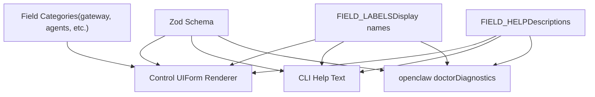
**元数据来源：**

-   **字段标签 (Field labels)**：[src/config/schema.labels.ts1-500](https://github.com/openclaw/openclaw/blob/8873e13f/src/config/schema.labels.ts#L1-L500) —— 人性化的字段名称。
-   **字段帮助 (Field help)**：[src/config/schema.help.ts1-500](https://github.com/openclaw/openclaw/blob/8873e13f/src/config/schema.help.ts#L1-L500) —— 详细的描述和指导。
-   **模式文档**：内联 Zod `.describe()` 调用，用于机器可读的元数据。

**使用场景：**

-   **控制 UI (Control UI)**：渲染带有标签和帮助工具提示的表单 [ui/src/components/config-form.ts1-300](https://github.com/openclaw/openclaw/blob/8873e13f/ui/src/components/config-form.ts#L1-L300)。
-   **CLI**：`openclaw config get/set` 使用标签进行输出格式化 [src/cli/commands/config.ts1-400](https://github.com/openclaw/openclaw/blob/8873e13f/src/cli/commands/config.ts#L1-L400)。
-   **Doctor**：特定字段的诊断和修复建议 [src/cli/commands/doctor.ts1-800](https://github.com/openclaw/openclaw/blob/8873e13f/src/cli/commands/doctor.ts#L1-L800)。

**来源：** [src/config/schema.labels.ts1-500](https://github.com/openclaw/openclaw/blob/8873e13f/src/config/schema.labels.ts#L1-L500) [src/config/schema.help.ts1-500](https://github.com/openclaw/openclaw/blob/8873e13f/src/config/schema.help.ts#L1-L500) [ui/src/components/config-form.ts1-300](https://github.com/openclaw/openclaw/blob/8873e13f/ui/src/components/config-form.ts#L1-L300)

---

## 配置验证错误处理

验证失败会产生结构化的错误消息，包含确切的字段路径和可操作的指导：

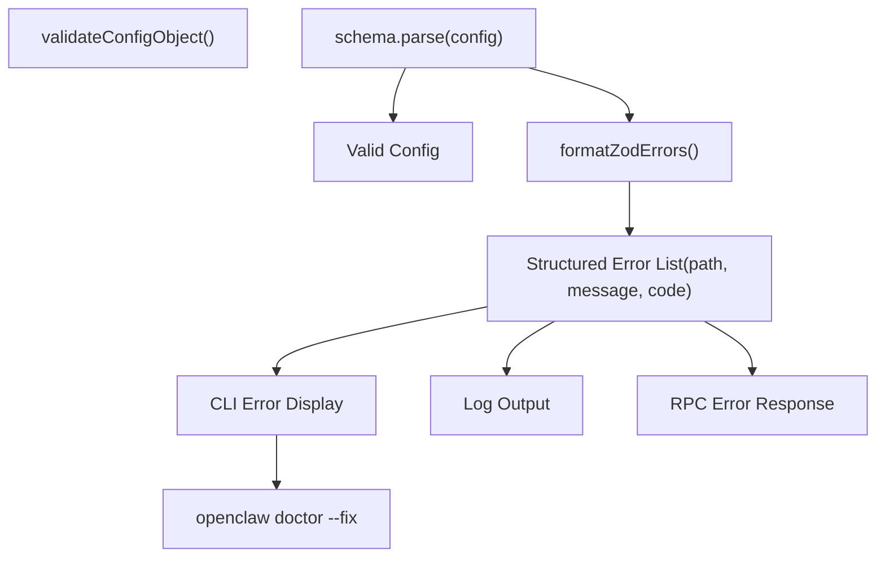
**错误结构示例：**

```
{  path: ["channels", "telegram", "dmPolicy"],  message: "Invalid enum value. Expected 'pairing' | 'allowlist' | 'open' | 'disabled', received 'public'",  code: "invalid_enum_value"}
```
**错误处理路径：**

-   **启动期间**：网关拒绝引导；仅诊断命令可用 (`doctor`, `logs`, `health`, `status`)。
-   **热重载期间**：更改被拒绝；网关继续使用旧配置。
-   **RPC 调用**：`config.apply`/`config.patch` 返回详细的验证错误。
-   **CLI 工具**：`openclaw doctor` 列出问题；`openclaw doctor --fix` 在可能的情况下应用修复。

**来源：** [src/config/validation.ts150-250](https://github.com/openclaw/openclaw/blob/8873e13f/src/config/validation.ts#L150-L250) [src/cli/commands/doctor.ts1-800](https://github.com/openclaw/openclaw/blob/8873e13f/src/cli/commands/doctor.ts#L1-L800) [docs/gateway/configuration.md61-74](https://github.com/openclaw/openclaw/blob/8873e13f/docs/gateway/configuration.md#L61-L74)

---

## 配置文件位置 (Configuration File Locations)

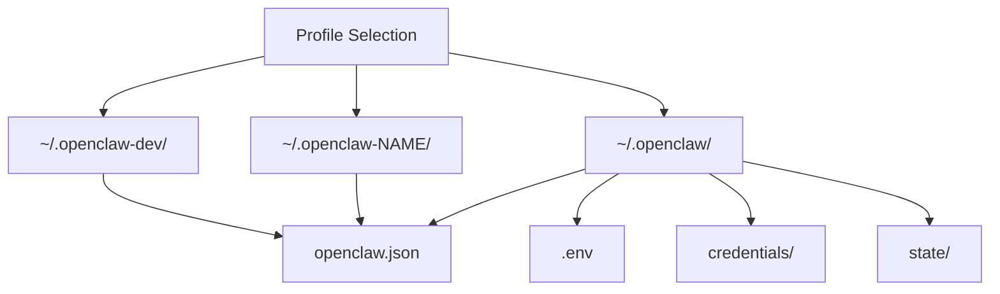
**标准路径：**

-   **配置文件**：`~/.openclaw/openclaw.json` (JSON5 格式)。
-   **全局环境**：`~/.openclaw/.env`。
-   **凭据目录**：`~/.openclaw/credentials/` (通道验证、OAuth 令牌)。
-   **状态目录**：`~/.openclaw/state/` (会话、cron、配对存储)。

**配置文件隔离 (Profile isolation)：**

-   `--dev`：将所有路径切换到 `~/.openclaw-dev/`，默认端口增加 100 偏移量。
-   `--profile NAME`：将所有路径切换到 `~/.openclaw-NAME/`。
-   配置文件之间完全隔离，不共享状态。

**来源：** [src/config/paths.ts1-200](https://github.com/openclaw/openclaw/blob/8873e13f/src/config/paths.ts#L1-L200) [src/cli/profile.ts1-150](https://github.com/openclaw/openclaw/blob/8873e13f/src/cli/profile.ts#L1-L150)

---

## 核心要点总结

1.  **严格验证**：配置必须完全匹配 Zod 模式；未知键会导致启动失败。
2.  **默认热重载**：`hybrid` 模式仅在必要时自动重启。
3.  **SecretRef 无处不在**：使用 `{ $ref: "env:VAR" }` 将机密信息保持在配置文件之外。
4.  **$include 组合**：将大型配置拆分为聚焦的文件，并使用深度合并。
5.  **RPC 驱动的更新**：控制 UI 和 CLI 通过 WebSocket RPC 更新配置。
6.  **迁移安全性**：旧配置会自动迁移；`openclaw doctor --fix` 可修复相关问题。
7.  **运行时快照**：所有子系统使用缓存的、经验证的配置 —— 热路径中无文件 I/O。

**来源：** [src/config/io.ts1-500](https://github.com/openclaw/openclaw/blob/8873e13f/src/config/io.ts#L1-L500) [src/config/validation.ts1-300](https://github.com/openclaw/openclaw/blob/8873e13f/src/config/validation.ts#L1-L300) [src/config/zod-schema.ts162-700](https://github.com/openclaw/openclaw/blob/8873e13f/src/config/zod-schema.ts#L162-L700) [src/gateway/config-reload.ts1-500](https://github.com/openclaw/openclaw/blob/8873e13f/src/gateway/config-reload.ts#L1-L500) [docs/gateway/configuration.md1-500](https://github.com/openclaw/openclaw/blob/8873e13f/docs/gateway/configuration.md#L1-L500)
