# 配置参考 (Configuration Reference)

相关源文件

-   [docs/channels/discord.md](https://github.com/openclaw/openclaw/blob/8873e13f/docs/channels/discord.md)
-   [docs/channels/telegram.md](https://github.com/openclaw/openclaw/blob/8873e13f/docs/channels/telegram.md)
-   [docs/gateway/configuration-reference.md](https://github.com/openclaw/openclaw/blob/8873e13f/docs/gateway/configuration-reference.md)
-   [src/acp/control-plane/manager.core.ts](https://github.com/openclaw/openclaw/blob/8873e13f/src/acp/control-plane/manager.core.ts)
-   [src/agents/pi-embedded-runner/tool-result-char-estimator.ts](https://github.com/openclaw/openclaw/blob/8873e13f/src/agents/pi-embedded-runner/tool-result-char-estimator.ts)
-   [src/agents/pi-embedded-runner/tool-result-context-guard.ts](https://github.com/openclaw/openclaw/blob/8873e13f/src/agents/pi-embedded-runner/tool-result-context-guard.ts)
-   [src/agents/tools/telegram-actions.test.ts](https://github.com/openclaw/openclaw/blob/8873e13f/src/agents/tools/telegram-actions.test.ts)
-   [src/agents/tools/telegram-actions.ts](https://github.com/openclaw/openclaw/blob/8873e13f/src/agents/tools/telegram-actions.ts)
-   [src/auto-reply/skill-commands.test.ts](https://github.com/openclaw/openclaw/blob/8873e13f/src/auto-reply/skill-commands.test.ts)
-   [src/auto-reply/skill-commands.ts](https://github.com/openclaw/openclaw/blob/8873e13f/src/auto-reply/skill-commands.ts)
-   [src/channels/allowlists/resolve-utils.test.ts](https://github.com/openclaw/openclaw/blob/8873e13f/src/channels/allowlists/resolve-utils.test.ts)
-   [src/channels/allowlists/resolve-utils.ts](https://github.com/openclaw/openclaw/blob/8873e13f/src/channels/allowlists/resolve-utils.ts)
-   [src/channels/plugins/actions/actions.test.ts](https://github.com/openclaw/openclaw/blob/8873e13f/src/channels/plugins/actions/actions.test.ts)
-   [src/channels/plugins/actions/telegram.ts](https://github.com/openclaw/openclaw/blob/8873e13f/src/channels/plugins/actions/telegram.ts)
-   [src/config/schema.help.quality.test.ts](https://github.com/openclaw/openclaw/blob/8873e13f/src/config/schema.help.quality.test.ts)
-   [src/config/schema.help.ts](https://github.com/openclaw/openclaw/blob/8873e13f/src/config/schema.help.ts)
-   [src/config/schema.labels.ts](https://github.com/openclaw/openclaw/blob/8873e13f/src/config/schema.labels.ts)
-   [src/config/types.agent-defaults.ts](https://github.com/openclaw/openclaw/blob/8873e13f/src/config/types.agent-defaults.ts)
-   [src/config/types.discord.ts](https://github.com/openclaw/openclaw/blob/8873e13f/src/config/types.discord.ts)
-   [src/config/types.telegram.ts](https://github.com/openclaw/openclaw/blob/8873e13f/src/config/types.telegram.ts)
-   [src/config/zod-schema.agent-defaults.ts](https://github.com/openclaw/openclaw/blob/8873e13f/src/config/zod-schema.agent-defaults.ts)
-   [src/config/zod-schema.providers-core.ts](https://github.com/openclaw/openclaw/blob/8873e13f/src/config/zod-schema.providers-core.ts)
-   [src/discord/monitor.test.ts](https://github.com/openclaw/openclaw/blob/8873e13f/src/discord/monitor.test.ts)
-   [src/discord/monitor/listeners.test.ts](https://github.com/openclaw/openclaw/blob/8873e13f/src/discord/monitor/listeners.test.ts)
-   [src/discord/monitor/listeners.ts](https://github.com/openclaw/openclaw/blob/8873e13f/src/discord/monitor/listeners.ts)
-   [src/discord/monitor/provider.allowlist.test.ts](https://github.com/openclaw/openclaw/blob/8873e13f/src/discord/monitor/provider.allowlist.test.ts)
-   [src/discord/monitor/provider.allowlist.ts](https://github.com/openclaw/openclaw/blob/8873e13f/src/discord/monitor/provider.allowlist.ts)
-   [src/discord/monitor/provider.skill-dedupe.test.ts](https://github.com/openclaw/openclaw/blob/8873e13f/src/discord/monitor/provider.skill-dedupe.test.ts)
-   [src/discord/monitor/provider.test.ts](https://github.com/openclaw/openclaw/blob/8873e13f/src/discord/monitor/provider.test.ts)
-   [src/discord/monitor/provider.ts](https://github.com/openclaw/openclaw/blob/8873e13f/src/discord/monitor/provider.ts)
-   [src/slack/monitor/provider.ts](https://github.com/openclaw/openclaw/blob/8873e13f/src/slack/monitor/provider.ts)
-   [src/telegram/send.test.ts](https://github.com/openclaw/openclaw/blob/8873e13f/src/telegram/send.test.ts)
-   [src/telegram/send.ts](https://github.com/openclaw/openclaw/blob/8873e13f/src/telegram/send.ts)

本页提供了 `~/.openclaw/openclaw.json` 配置文件结构的全面字段级文档。有关配置加载管道、验证及热重载行为的概览，请参见 [配置系统 (Configuration System)](/openclaw/openclaw/2.3-configuration-system)。

除非另有说明，所有配置字段均为可选。当字段缺失时，OpenClaw 会使用安全的默认值。配置格式为 **JSON5**，支持注释和尾随逗号。

**来源：** [docs/gateway/configuration-reference.md1-15](https://github.com/openclaw/openclaw/blob/8873e13f/docs/gateway/configuration-reference.md#L1-L15)

---

## 配置模式概览 (Configuration Schema Overview)

根配置对象由代码库中的 `ConfigSchema` 进行验证，包含以下顶级部分：


**配置验证路径：**

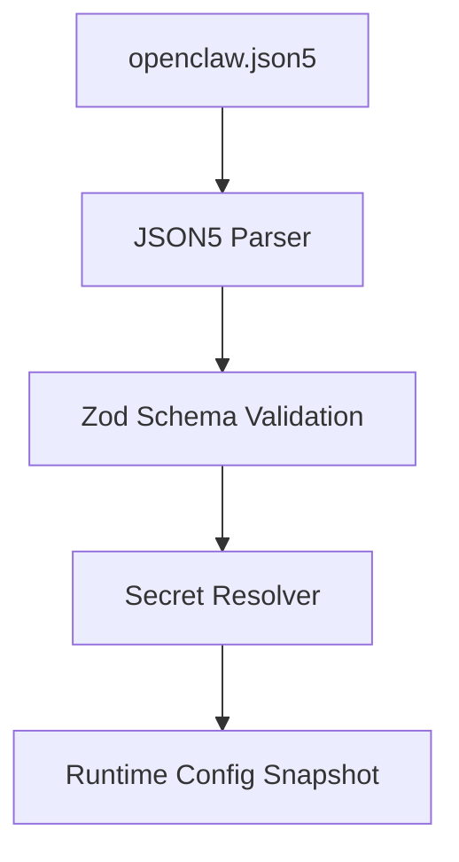
**来源：** [src/config/zod-schema.providers-core.ts1-50](https://github.com/openclaw/openclaw/blob/8873e13f/src/config/zod-schema.providers-core.ts#L1-L50) [src/config/schema.help.ts1-350](https://github.com/openclaw/openclaw/blob/8873e13f/src/config/schema.help.ts#L1-L350)

---

## 元数据部分 (Meta Section)

系统管理的元数据字段，记录配置的写入记录和版本历史：

| 字段 | 类型 | 描述 |
| --- | --- | --- |
| `meta.lastTouchedVersion` | `string` | 最后一次写入此配置的 OpenClaw 版本 |
| `meta.lastTouchedAt` | `string` | 最后一次配置写入的 ISO 时间戳 |

**示例：**

```
{  meta: {    lastTouchedVersion: "2026.2.25",    lastTouchedAt: "2026-02-25T10:30:00.000Z"  }}
```
**来源：** [src/config/schema.help.ts9-11](https://github.com/openclaw/openclaw/blob/8873e13f/src/config/schema.help.ts#L9-L11)

---

## 环境部分 (Environment Section)

控制环境变量的导入和运行时变量注入：

| 字段 | 类型 | 默认值 | 描述 |
| --- | --- | --- | --- |
| `env.shellEnv.enabled` | `boolean` | `true` | 启动时从用户 shell 配置文件加载变量 |
| `env.shellEnv.timeoutMs` | `number` | `5000` | shell 环境解析的最长时间 |
| `env.vars` | `Record<string, string>` | `{}` | 显式的键/值对环境变量覆盖 |

**示例：**

```
{  env: {    shellEnv: {      enabled: true,      timeoutMs: 5000    },    vars: {      NODE_ENV: "production",      LOG_LEVEL: "info"    }  }}
```
**来源：** [src/config/schema.help.ts12-20](https://github.com/openclaw/openclaw/blob/8873e13f/src/config/schema.help.ts#L12-L20)

---

## 网关部分 (Gateway Section)

网关运行时的绑定模式、身份验证、控制 UI 和操作控制配置。

### 核心网关字段

```mermaid
flowchart TD
    Gateway["gateway"]
    Port["port: number (18789)"]
    Mode["mode: 'local' | 'remote'"]
    Bind["bind: 'auto' | 'lan' | 'loopback' | 'custom' | 'tailnet'"]
    CustomBindHost["customBindHost: string"]
    ControlUi["controlUi: ControlUiSchema"]
    Auth["auth: GatewayAuthSchema"]
    Tools["tools: GatewayToolsSchema"]
    Remote["remote: RemoteGatewaySchema"]
    Reload["reload: ReloadSchema"]
    TLS["tls: TlsSchema"]
    HTTP["http: HttpSchema"]
    Tailscale["tailscale: TailscaleSchema"]

    Gateway --> Port
    Gateway --> Mode
    Gateway --> Bind
    Gateway --> CustomBindHost
    Gateway --> ControlUi
    Gateway --> Auth
    Gateway --> Tools
    Gateway --> Remote
    Gateway --> Reload
    Gateway --> TLS
    Gateway --> HTTP
    Gateway --> Tailscale
```
| 字段 | 类型 | 默认值 | 描述 |
| --- | --- | --- | --- |
| `gateway.port` | `number` | `18789` | 网关监听器的 TCP 端口（API、控制 UI、通道入口） |
| `gateway.mode` | `"local"` | `"remote"` | `"local"` | 运行模式：local 在当前主机运行通道和智能体；remote 通过远程传输连接 |
| `gateway.bind` | `"auto"` | `"lan"` | `"loopback"` | `"custom"` | `"tailnet"` | `"auto"` | 网络绑定配置文件，控制接口暴露 |
| `gateway.customBindHost` | `string` | \- | 当 `bind` 为 `"custom"` 时显式指定的绑定主机/IP |
| `gateway.channelHealthCheckMinutes` | `number` | `5` | 自动通道健康探测的时间间隔（分钟） |

**来源：** [src/config/schema.help.ts68-110](https://github.com/openclaw/openclaw/blob/8873e13f/src/config/schema.help.ts#L68-L110) [docs/gateway/configuration-reference.md68-126](https://github.com/openclaw/openclaw/blob/8873e13f/docs/gateway/configuration-reference.md#L68-L126)

### 网关身份验证 (Gateway Authentication)

`gateway.auth` 对象控制 HTTP/WebSocket 访问的身份验证：

| 字段 | 类型 | 默认值 | 描述 |
| --- | --- | --- | --- |
| `gateway.auth.mode` | `"none"` | `"token"` | `"password"` | `"trusted-proxy"` | `"none"` | 身份验证模式 |
| `gateway.auth.token` | `SecretInput` | \- | 令牌验证模式下的 Bearer 令牌 |
| `gateway.auth.password` | `SecretInput` | \- | 密码验证模式下的密码 |
| `gateway.auth.allowTailscale` | `boolean` | `false` | 允许 Tailscale 身份路径满足身份验证检查 |
| `gateway.auth.rateLimit` | `RateLimitSchema` | \- | 登录/身份验证尝试的节流控制 |
| `gateway.auth.trustedProxy` | `TrustedProxyAuthSchema` | \- | 受信任代理身份验证标头映射 |

**示例：**

```
{  gateway: {    port: 18789,    bind: "loopback",    auth: {      mode: "token",      token: "${GATEWAY_TOKEN}"    }  }}
```
**来源：** [src/config/schema.help.ts82-96](https://github.com/openclaw/openclaw/blob/8873e13f/src/config/schema.help.ts#L82-L96) [docs/gateway/configuration-reference.md68-126](https://github.com/openclaw/openclaw/blob/8873e13f/docs/gateway/configuration-reference.md#L68-L126)

### 网关 TLS

| 字段 | 类型 | 默认值 | 描述 |
| --- | --- | --- | --- |
| `gateway.tls.enabled` | `boolean` | `false` | 在网关监听器启用 TLS 终结 |
| `gateway.tls.autoGenerate` | `boolean` | `false` | 自动生成本地 TLS 证书/密钥对 |
| `gateway.tls.certPath` | `string` | \- | TLS 证书文件的文件系统路径 |
| `gateway.tls.keyPath` | `string` | \- | TLS 私钥文件的文件系统路径 |
| `gateway.tls.caPath` | `string` | \- | 用于客户端验证的可选 CA 捆绑包路径 |

**来源：** [src/config/schema.help.ts116-127](https://github.com/openclaw/openclaw/blob/8873e13f/src/config/schema.help.ts#L116-L127)

### 远程网关 (Remote Gateway)

用于跨主机操作，此实例作为另一个运行时的代理：

| 字段 | 类型 | 默认值 | 描述 |
| --- | --- | --- | --- |
| `gateway.remote.transport` | `"direct"` | `"ssh"` | `"direct"` | 连接传输方式 |
| `gateway.remote.url` | `string` | \- | 远程网关 WebSocket URL (`ws://` 或 `wss://`) |
| `gateway.remote.token` | `SecretInput` | \- | 远程网关身份验证的 Bearer 令牌 |
| `gateway.remote.password` | `SecretInput` | \- | 远程网关的密码凭据 |
| `gateway.remote.tlsFingerprint` | `string` | \- | 期望的 sha256 TLS 指纹（固定以避免中间人攻击） |
| `gateway.remote.sshTarget` | `string` | \- | SSH 隧道目标（格式：`user@host` 或 `user@host:port`） |
| `gateway.remote.sshIdentity` | `string` | \- | 可选的 SSH 身份文件路径 |

**来源：** [src/config/schema.help.ts112-145](https://github.com/openclaw/openclaw/blob/8873e13f/src/config/schema.help.ts#L112-L145)

---

## 通道部分 (Channels Section)

多通道消息传递集成配置。每个通道在配置节存在时自动启动，除非 `enabled: false`。

### 通道默认值与共享设置

```mermaid
flowchart TD
    Channels["channels"]
    Defaults["defaults: ChannelDefaultsSchema"]
    ModelByChannel["modelByChannel: Record>"]
    Telegram["telegram: TelegramConfigSchema"]
    Discord["discord: DiscordConfigSchema"]
    Slack["slack: SlackConfigSchema"]
    WhatsApp["whatsapp: WhatsAppConfigSchema"]
    Signal["signal: SignalConfigSchema"]
    GoogleChat["googlechat: GoogleChatConfigSchema"]
    Mattermost["mattermost: MattermostConfigSchema"]
    IMessage["imessage: IMessageConfigSchema"]
    BlueBubbles["bluebubbles: BlueBubblesConfigSchema"]
    IRC["irc: IrcConfigSchema"]
    MSTeams["msteams: MSTeamsConfigSchema"]

    Channels --> Defaults
    Channels --> ModelByChannel
    Channels --> Telegram
    Channels --> Discord
    Channels --> Slack
    Channels --> WhatsApp
    Channels --> Signal
    Channels --> GoogleChat
    Channels --> Mattermost
    Channels --> IMessage
    Channels --> BlueBubbles
    Channels --> IRC
    Channels --> MSTeams
```
| 字段 | 类型 | 默认值 | 描述 |
| --- | --- | --- | --- |
| `channels.defaults.groupPolicy` | `"open"` | `"allowlist"` | `"disabled"` | `"allowlist"` | 提供者级别 `groupPolicy` 未设置时的回退群组策略 |
| `channels.defaults.heartbeat.showOk` | `boolean` | `false` | 在心跳输出中包含健康的通道状态 |
| `channels.defaults.heartbeat.showAlerts` | `boolean` | `true` | 在心跳输出中包含降级/错误状态 |
| `channels.defaults.heartbeat.useIndicator` | `boolean` | `true` | 渲染紧凑的指标样式心跳输出 |

**通道模型覆盖映射 (Channel Model Override Mapping)：**

使用 `channels.modelByChannel` 将特定通道 ID 固定到某个模型。其值接受 `provider/model` 或已配置的模型别名。

```
{  channels: {    modelByChannel: {      discord: {        "123456789012345678": "anthropic/claude-opus-4-6"      },      slack: {        "C1234567890": "openai/gpt-4.1"      },      telegram: {        "-1001234567890": "openai/gpt-4.1-mini",        "-1001234567890:topic:99": "anthropic/claude-sonnet-4-6"      }    }  }}
```
**来源：** [docs/gateway/configuration-reference.md68-90](https://github.com/openclaw/openclaw/blob/8873e13f/docs/gateway/configuration-reference.md#L68-90) [src/config/zod-schema.providers-core.ts1-100](https://github.com/openclaw/openclaw/blob/8873e13f/src/config/zod-schema.providers-core.ts#L1-L100)

### 私信 (DM) 与群组访问策略

所有通道均支持私信策略和群组策略：

**私信策略 (DM Policy) 取值：**

| 策略 | 行为 |
| --- | --- |
| `"pairing"` (默认) | 未知发送者会收到一次性配对码；所有者必须批准 |
| `"allowlist"` | 仅允许 `allowFrom` 中的发送者（或配对的允许存储） |
| `"open"` | 允许所有入站私信（需要 `allowFrom: ["*"]`） |
| `"disabled"` | 忽略所有入站私信 |

**群组策略 (Group Policy) 取值：**

| 策略 | 行为 |
| --- | --- |
| `"allowlist"` (默认) | 仅允许匹配已配置白名单的群组 |
| `"open"` | 绕过群组白名单（提及门控仍适用） |
| `"disabled"` | 阻止所有群组/房间消息 |

**来源：** [docs/gateway/configuration-reference.md22-43](https://github.com/openclaw/openclaw/blob/8873e13f/docs/gateway/configuration-reference.md#L22-L43)

### Telegram 配置

**模式路径 (Schema Path)：** [src/config/zod-schema.providers-core.ts152-344](https://github.com/openclaw/openclaw/blob/8873e13f/src/config/zod-schema.providers-core.ts#L152-L344) 中的 `TelegramConfigSchema`

**核心字段：**

| 字段 | 类型 | 默认值 | 描述 |
| --- | --- | --- | --- |
| `channels.telegram.enabled` | `boolean` | `true` | 启用 Telegram 通道 |
| `channels.telegram.botToken` | `SecretInput` | \- | Telegram 机器人令牌（默认账户的环境变量：`TELEGRAM_BOT_TOKEN`） |
| `channels.telegram.tokenFile` | `string` | \- | 替代方案：包含机器人令牌的文件路径 |
| `channels.telegram.dmPolicy` | `DmPolicy` | `"pairing"` | 私信访问策略 |
| `channels.telegram.groupPolicy` | `GroupPolicy` | `"allowlist"` | 群组消息访问策略 |
| `channels.telegram.allowFrom` | `Array<string | number>` | \- | 私信发送者白名单（数字形式的 Telegram 用户 ID） |
| `channels.telegram.groupAllowFrom` | `Array<string | number>` | \- | 群组发送者白名单（回退到 `allowFrom`） |
| `channels.telegram.historyLimit` | `number` | `50` | 群聊历史记录限制 |
| `channels.telegram.dmHistoryLimit` | `number` | \- | 私信历史记录限制（回退到不限制） |
| `channels.telegram.textChunkLimit` | `number` | `4000` | 分段前的最大文本字符数 |
| `channels.telegram.chunkMode` | `"length"` | `"newline"` | `"length"` | 文本切分策略 |
| `channels.telegram.streaming` | `"off"` | `"partial"` | `"block"` | `"progress"` | `"partial"` | 实时流预览模式 |
| `channels.telegram.mediaMaxMb` | `number` | `100` | 媒体文件最大限制 (MB) |
| `channels.telegram.linkPreview` | `boolean` | `true` | 在消息中启用链接预览 |

**群组配置示例：**

```
{  channels: {    telegram: {      groups: {        "-1001234567890": {          requireMention: true,          allowFrom: ["123456789"],          systemPrompt: "Keep answers brief.",          topics: {            "99": {              requireMention: false,              skills: ["search"],              agentId: "research"            }          }        }      }    }  }}
```
**多账户配置示例：**

```
{  channels: {    telegram: {      accounts: {        default: {          name: "Primary bot",          botToken: "123456:ABC..."        },        alerts: {          name: "Alerts bot",          botToken: "987654:XYZ..."        }      },      defaultAccount: "default"    }  }}
```
**来源：** [docs/gateway/configuration-reference.md152-212](https://github.com/openclaw/openclaw/blob/8873e13f/docs/gateway/configuration-reference.md#L152-L212) [src/config/zod-schema.providers-core.ts152-344](https://github.com/openclaw/openclaw/blob/8873e13f/src/config/zod-schema.providers-core.ts#L152-L344) [docs/channels/telegram.md1-100](https://github.com/openclaw/openclaw/blob/8873e13f/docs/channels/telegram.md#L1-L100)

### Discord 配置

**模式路径 (Schema Path)：** [src/config/zod-schema.providers-core.ts417-580](https://github.com/openclaw/openclaw/blob/8873e13f/src/config/zod-schema.providers-core.ts#L417-L580) 中的 `DiscordConfigSchema`

**核心字段：**

| 字段 | 类型 | 默认值 | 描述 |
| --- | --- | --- | --- |
| `channels.discord.enabled` | `boolean` | `true` | 启用 Discord 通道 |
| `channels.discord.token` | `SecretInput` | \- | Discord 机器人令牌（默认账户的环境变量：`DISCORD_BOT_TOKEN`） |
| `channels.discord.dmPolicy` | `DmPolicy` | `"pairing"` | 私信访问策略 |
| `channels.discord.groupPolicy` | `GroupPolicy` | `"allowlist"` | 服务器 (Guild) 访问策略 |
| `channels.discord.allowFrom` | `Array<string>` | \- | 私信发送者白名单（字符串形式的 Discord ID） |
| `channels.discord.historyLimit` | `number` | `20` | 服务器频道历史记录限制 |
| `channels.discord.dmHistoryLimit` | `number` | \- | 私信历史记录限制 |
| `channels.discord.textChunkLimit` | `number` | `2000` | 分段前的最大文本字符数 |
| `channels.discord.chunkMode` | `"length"` | `"newline"` | `"length"` | 文本切分策略 |
| `channels.discord.streaming` | `"off"` | `"partial"` | `"block"` | `"progress"` | `"off"` | 流预览模式 |
| `channels.discord.maxLinesPerMessage` | `number` | `17` | 分离超长消息前的最大行数 |
| `channels.discord.mediaMaxMb` | `number` | `8` | 媒体文件最大限制 (MB) |
| `channels.discord.allowBots` | `boolean` | `"mentions"` | `false` | 是否允许机器人发出的消息 |
| `channels.discord.replyToMode` | `"off"` | `"first"` | `"all"` | `"off"` | 回复线程模式 |

**服务器 (Guild) 配置示例：**

```
{  channels: {    discord: {      guilds: {        "123456789012345678": {          slug: "friends-of-openclaw",          requireMention: false,          ignoreOtherMentions: true,          users: ["987654321098765432"],          channels: {            "general": { allow: true },            "help": {              allow: true,              requireMention: true,              skills: ["docs"],              systemPrompt: "Short answers only."            }          }        }      }    }  }}
```
**线程绑定配置 (Thread Bindings Configuration)：**

| 字段 | 类型 | 默认值 | 描述 |
| --- | --- | --- | --- |
| `channels.discord.threadBindings.enabled` | `boolean` | \- | 对线程绑定会话特性的 Discord 覆盖 |
| `channels.discord.threadBindings.idleHours` | `number` | `24` | 闲置自动取消关注的时间（小时，0 为禁用） |
| `channels.discord.threadBindings.maxAgeHours` | `number` | `0` | 硬性最大时长（小时，0 为禁用） |
| `channels.discord.threadBindings.spawnSubagentSessions` | `boolean` | `false` | 是否开启 `sessions_spawn({ thread: true })` 自动创建线程 |

**语音配置示例：**

```
{  channels: {    discord: {      voice: {        enabled: true,        autoJoin: [          {            guildId: "123456789012345678",            channelId: "234567890123456789"          }        ],        daveEncryption: true,        decryptionFailureTolerance: 24,        tts: {          provider: "openai",          openai: { voice: "alloy" }        }      }    }  }}
```
**来源：** [docs/gateway/configuration-reference.md215-326](https://github.com/openclaw/openclaw/blob/8873e13f/docs/gateway/configuration-reference.md#L215-L326) [src/config/zod-schema.providers-core.ts417-580](https://github.com/openclaw/openclaw/blob/8873e13f/src/config/zod-schema.providers-core.ts#L417-L580) [docs/channels/discord.md1-300](https://github.com/openclaw/openclaw/blob/8873e13f/docs/channels/discord.md#L1-L300)

### Slack 配置

**模式路径 (Schema Path)：** [src/config/zod-schema.providers-core.ts655-850](https://github.com/openclaw/openclaw/blob/8873e13f/src/config/zod-schema.providers-core.ts#L655-L850) 中的 `SlackConfigSchema`

**核心字段：**

| 字段 | 类型 | 默认值 | 描述 |
| --- | --- | --- | --- |
| `channels.slack.enabled` | `boolean` | `true` | 启用 Slack 通道 |
| `channels.slack.botToken` | `SecretInput` | \- | Slack 机器人令牌（默认账户的环境变量：`SLACK_BOT_TOKEN`） |
| `channels.slack.appToken` | `SecretInput` | \- | Socket 模式下的 Slack 应用令牌（默认环境变量：`SLACK_APP_TOKEN`） |
| `channels.slack.signingSecret` | `SecretInput` | \- | HTTP 模式下的 Slack 签名机密 |
| `channels.slack.mode` | `"socket"` | `"http"` | `"socket"` | 连接模式 |
| `channels.slack.dmPolicy` | `DmPolicy` | `"pairing"` | 私信访问策略 |
| `channels.slack.groupPolicy` | `GroupPolicy` | `"allowlist"` | 频道访问策略 |
| `channels.slack.allowFrom` | `Array<string>` | \- | 私信发送者白名单（Slack 用户 ID） |
| `channels.slack.historyLimit` | `number` | `50` | 频道历史记录限制 |
| `channels.slack.textChunkLimit` | `number` | `4000` | 分段前的最大文本字符数 |
| `channels.slack.streaming` | `"off"` | `"partial"` | `"block"` | `"progress"` | `"partial"` | 流模式 |
| `channels.slack.nativeStreaming` | `boolean` | `true` | 启用流模式时使用 Slack 原生流 API |
| `channels.slack.reactionNotifications` | `"off"` | `"own"` | `"all"` | `"allowlist"` | `"own"` | 表情回复通知模式 |
| `channels.slack.replyToMode` | `"off"` | `"first"` | `"all"` | `"off"` | 回复线程模式 |

**频道配置示例：**

```
{  channels: {    slack: {      channels: {        "C123": {          allow: true,          requireMention: true,          users: ["U123"],          skills: ["docs"],          systemPrompt: "Short answers only."        }      }    }  }}
```
**线程配置：**

| 字段 | 类型 | 默认值 | 描述 |
| --- | --- | --- | --- |
| `channels.slack.thread.historyScope` | `"thread"` | `"channel"` | `"thread"` | 按线程独立历史或在频道内共享 |
| `channels.slack.thread.inheritParent` | `boolean` | `false` | 向新线程复制父频道的转录内容 |

**来源：** [docs/gateway/configuration-reference.md365-440](https://github.com/openclaw/openclaw/blob/8873e13f/docs/gateway/configuration-reference.md#L365-L440) [src/slack/monitor/provider.ts1-300](https://github.com/openclaw/openclaw/blob/8873e13f/src/slack/monitor/provider.ts#L1-L300)

### WhatsApp 配置

**模式路径 (Schema Path)：** `WhatsAppConfigSchema`（隐式包含在网关通道中）

WhatsApp 通过网关的 Web 通道 (Baileys Web) 运行。当关联会话存在时会自动启动。

| 字段 | 类型 | 默认值 | 描述 |
| --- | --- | --- | --- |
| `channels.whatsapp.dmPolicy` | `DmPolicy` | `"pairing"` | 私信访问策略 |
| `channels.whatsapp.groupPolicy` | `GroupPolicy` | `"allowlist"` | 群组访问策略 |
| `channels.whatsapp.allowFrom` | `Array<string>` | \- | 私信发送者白名单（电话号码） |
| `channels.whatsapp.groupAllowFrom` | `Array<string>` | \- | 群组发送者白名单 |
| `channels.whatsapp.textChunkLimit` | `number` | `4000` | 分段前的最大文本字符数 |
| `channels.whatsapp.chunkMode` | `"length"` | `"newline"` | `"length"` | 文本切分策略 |
| `channels.whatsapp.mediaMaxMb` | `number` | `50` | 媒体文件最大限制 (MB) |
| `channels.whatsapp.sendReadReceipts` | `boolean` | `true` | 发送已读回执（在自聊模式下为 false） |

**多账户配置示例：**

```
{  channels: {    whatsapp: {      accounts: {        default: {},        personal: {},        biz: {          // authDir: "~/.openclaw/credentials/whatsapp/biz"        }      },      defaultAccount: "default"    }  }}
```
**来源：** [docs/gateway/configuration-reference.md92-150](https://github.com/openclaw/openclaw/blob/8873e13f/docs/gateway/configuration-reference.md#L92-L150)

### Signal 配置

**模式路径 (Schema Path)：** 通过 signal-cli 进行 Signal 集成

| 字段 | 类型 | 默认值 | 描述 |
| --- | --- | --- | --- |
| `channels.signal.enabled` | `boolean` | `true` | 启用 Signal 通道 |
| `channels.signal.account` | `string` | \- | 可选的账户绑定（电话号码） |
| `channels.signal.dmPolicy` | `DmPolicy` | `"pairing"` | 私信访问策略 |
| `channels.signal.allowFrom` | `Array<string>` | \- | 白名单（电话号码或 UUID） |
| `channels.signal.reactionNotifications` | `"off"` | `"own"` | `"all"` | `"allowlist"` | `"own"` | 表情回复通知模式 |
| `channels.signal.reactionAllowlist` | `Array<string>` | \- | 表情回复通知的白名单 |
| `channels.signal.historyLimit` | `number` | `50` | 历史记录限制 |

**来源：** [docs/gateway/configuration-reference.md484-506](https://github.com/openclaw/openclaw/blob/8873e13f/docs/gateway/configuration-reference.md#L484-L506)

### 其他通道

其他通道也在其各自的键下以类似方式配置：

-   **Google Chat**: `channels.googlechat` (服务账号 + Webhook)
-   **Mattermost**: `channels.mattermost` (机器人令牌 + 基础 URL)
-   **iMessage**: `channels.imessage` (imsg CLI + 数据库路径)
-   **BlueBubbles**: `channels.bluebubbles` (服务器 URL + 密码)
-   **IRC**: `channels.irc` (服务器 + 频道 + NickServ)
-   **Microsoft Teams**: `channels.msteams` (应用凭据 + Webhook)

详见 [通道 (Channels)](/openclaw/openclaw/4-channels) 中特定通道的文档。

**来源：** [docs/gateway/configuration-reference.md329-653](https://github.com/openclaw/openclaw/blob/8873e13f/docs/gateway/configuration-reference.md#L329-L653)

---

## 智能体部分 (Agents Section)

智能体运行时配置，涵盖用于路由和执行上下文的默认设置及显式智能体条目。

### 智能体配置结构

```mermaid
flowchart TD
    Agents["agents"]
    Defaults["defaults: AgentDefaultsSchema"]
    List["list: AgentSchema[]"]
    Model["model: AgentModelSchema"]
    ImageModel["imageModel: AgentModelSchema"]
    PdfModel["pdfModel: AgentModelSchema"]
    Models["models: Record"]
    Workspace["workspace: string"]
    Heartbeat["heartbeat: HeartbeatSchema"]
    Compaction["compaction: CompactionSchema"]
    ContextPruning["contextPruning: ContextPruningSchema"]
    MemorySearch["memorySearch: MemorySearchSchema"]
    AgentId["id: string"]
    AgentRuntime["runtime: AgentRuntimeSchema"]
    AgentModel["model: AgentModelSchema"]
    AgentTools["tools: ToolPolicySchema"]
    AgentIdentity["identity: IdentitySchema"]
    AgentWorkspace["workspace: string"]

    Agents --> Defaults
    Agents --> List
    Defaults --> Model
    Defaults --> ImageModel
    Defaults --> PdfModel
    Defaults --> Models
    Defaults --> Workspace
    Defaults --> Heartbeat
    Defaults --> Compaction
    Defaults --> ContextPruning
    Defaults --> MemorySearch
    List --> AgentId
    List --> AgentRuntime
    List --> AgentModel
    List --> AgentTools
    List --> AgentIdentity
    List --> AgentWorkspace
```
**来源：** [src/config/zod-schema.agent-defaults.ts1-150](https://github.com/openclaw/openclaw/blob/8873e13f/src/config/zod-schema.agent-defaults.ts#L1-L150)

### 智能体默认设置 (Agent Defaults)

**工作区与引导 (Workspace and Bootstrap)：**

| 字段 | 类型 | 默认值 | 描述 |
| --- | --- | --- | --- |
| `agents.defaults.workspace` | `string` | `~/.openclaw/workspace` | 默认工作区目录 |
| `agents.defaults.repoRoot` | `string` | (自动检测) | 系统提示词 Runtime 行显示的仓库根目录 |
| `agents.defaults.skipBootstrap` | `boolean` | `false` | 禁用工作区引导文件的自动创建 |
| `agents.defaults.bootstrapMaxChars` | `number` | `20000` | 每个工作区引导文件截断前的最大字符数 |
| `agents.defaults.bootstrapTotalMaxChars` | `number` | `150000` | 所有引导文件的最大总字符数 |
| `agents.defaults.bootstrapPromptTruncationWarning` | `"off"` | `"once"` | `"always"` | `"once"` | 引导上下文截断时对智能体可见的警告文本控制 |

**模型配置：**

| 字段 | 类型 | 默认值 | 描述 |
| --- | --- | --- | --- |
| `agents.defaults.model` | `string` | `AgentModelListConfig` | \- | 主模型（字符串）或带有回退的模型（对象） |
| `agents.defaults.imageModel` | `string` | `AgentModelListConfig` | \- | 视觉模型配置 |
| `agents.defaults.pdfModel` | `string` | `AgentModelListConfig` | \- | PDF 工具模型配置 |
| `agents.defaults.models` | `Record<string, AgentModelEntryConfig>` | \- | `/model` 命令的模型目录和白名单 |
| `agents.defaults.contextTokens` | `number` | `200000` | 上下文 Token 限制 |
| `agents.defaults.timeoutSeconds` | `number` | `600` | 智能体轮次超时时间 |
| `agents.defaults.maxConcurrent` | `number` | `1` | 跨会话的最大并行智能体运行数 |

**模型条目配置示例：**

```
{  agents: {    defaults: {      models: {        "anthropic/claude-opus-4-6": {          alias: "opus",          params: {            temperature: 0.7,            cacheRetention: "auto"          }        },        "openai/gpt-5.2": {          alias: "gpt"        }      },      model: {        primary: "anthropic/claude-opus-4-6",        fallbacks: ["openai/gpt-5.2"]      }    }  }}
```
**内置模型别名：**

| 别名 | 模型 |
| --- | --- |
| `opus` | `anthropic/claude-opus-4-6` |
| `sonnet` | `anthropic/claude-sonnet-4-5` |
| `gpt` | `openai/gpt-5.2` |
| `gpt-mini` | `openai/gpt-5-mini` |
| `gemini` | `google/gemini-3-pro-preview` |
| `gemini-flash` | `google/gemini-3-flash-preview` |

**来源：** [docs/gateway/configuration-reference.md756-926](https://github.com/openclaw/openclaw/blob/8873e13f/docs/gateway/configuration-reference.md#L756-L926)

### 智能体列表 (Agent List)

`agents.list[]` 中的每个条目定义了一个具有显式路由和执行配置的智能体：

| 字段 | 类型 | 默认值 | 描述 |
| --- | --- | --- | --- |
| `agents.list[].id` | `string` | (必填) | 用于路由和绑定的唯一智能体 ID |
| `agents.list[].runtime.type` | `"embedded"` | `"acp"` | `"embedded"` | 运行时类型 |
| `agents.list[].runtime.acp` | `AcpRuntimeConfig` | \- | 当 `type=acp` 时的 ACP 运行时默认设置 |
| `agents.list[].model` | `string` | `AgentModelListConfig` | (继承) | 智能体特定的模型覆盖 |
| `agents.list[].workspace` | `string` | (继承) | 智能体特定的工作区 |
| `agents.list[].tools` | `ToolPolicySchema` | (继承) | 智能体特定的工具策略 |
| `agents.list[].identity.name` | `string` | \- | 智能体显示名称 |
| `agents.list[].identity.avatar` | `string` | \- | 头像图片路径或 URL |
| `agents.list[].skills` | `Array<string>` | (所有技能) | 此智能体允许的技能白名单 |

**示例：**

```
{  agents: {    list: [      {        id: "main",        identity: {          name: "OpenClaw",          avatar: "avatar.png"        }      },      {        id: "research",        model: "anthropic/claude-sonnet-4-5",        skills: ["web_search", "memory"],        workspace: "~/research-workspace"      },      {        id: "codex",        runtime: {          type: "acp",          acp: {            agent: "codex",            backend: "acpx",            mode: "persistent"          }        }      }    ]  }}
```
**来源：** [docs/gateway/configuration-reference.md201-230](https://github.com/openclaw/openclaw/blob/8873e13f/docs/gateway/configuration-reference.md#L201-L230) [src/config/types.agent-defaults.ts1-200](https://github.com/openclaw/openclaw/blob/8873e13f/src/config/types.agent-defaults.ts#L1-L200)

### 心跳配置 (Heartbeat Configuration)

用于主动触发智能体活动的定期心跳运行：

| 字段 | 类型 | 默认值 | 描述 |
| --- | --- | --- | --- |
| `agents.defaults.heartbeat.every` | `string` | `"30m"` | 持续时间字符串 (ms/s/m/h)，0m 为禁用 |
| `agents.defaults.heartbeat.model` | `string` | (继承) | 心跳运行使用的模型 |
| `agents.defaults.heartbeat.includeReasoning` | `boolean` | `false` | 在心跳输出中包含推理过程 |
| `agents.defaults.heartbeat.lightContext` | `boolean` | `false` | 仅从引导文件中保留 `HEARTBEAT.md` |
| `agents.defaults.heartbeat.session` | `string` | `"main"` | 心跳使用的会话密钥 |
| `agents.defaults.heartbeat.to` | `string` | \- | 心跳交付的目标通道 |
| `agents.defaults.heartbeat.target` | `"none"` | `"last"` | 通道 ID | `"none"` | 心跳交付目标 |
| `agents.defaults.heartbeat.prompt` | `string` | \- | 心跳运行的自定义提示词 |
| `agents.defaults.heartbeat.suppressToolErrorWarnings` | `boolean` | `false` | 在心跳中抑制工具错误警告 |

**来源：** [docs/gateway/configuration-reference.md963-994](https://github.com/openclaw/openclaw/blob/8873e13f/docs/gateway/configuration-reference.md#L963-L994)

### 压缩配置 (Compaction Configuration)

用于长对话会话的上下文压缩控制：

| 字段 | 类型 | 默认值 | 描述 |
| --- | --- | --- | --- |
| `agents.defaults.compaction.mode` | `"default"` | `"safeguard"` | `"safeguard"` | 压缩策略 |
| `agents.defaults.compaction.reserveTokensFloor` | `number` | `24000` | 压缩前的预留 Token 下限 |
| `agents.defaults.compaction.identifierPolicy` | `"strict"` | `"off"` | `"custom"` | `"strict"` | 标识符保留策略 |
| `agents.defaults.compaction.identifierInstructions` | `string` | \- | 当 `policy=custom` 时的自定义标识符保留说明 |
| `agents.defaults.compaction.postCompactionSections` | `Array<string>` | `["Session Startup", "Red Lines"]` | 压缩后重新注入的 AGENTS.md 章节 |
| `agents.defaults.compaction.memoryFlush.enabled` | `boolean` | `true` | 压缩前执行静默轮次以存储持久记忆 |
| `agents.defaults.compaction.memoryFlush.softThresholdTokens` | `number` | `6000` | 触发记忆刷新的 Token 阈值 |

**来源：** [docs/gateway/configuration-reference.md996-1024](https://github.com/openclaw/openclaw/blob/8873e13f/docs/gateway/configuration-reference.md#L996-L1024)

### 上下文修剪配置 (Context Pruning Configuration)

| 字段 | 类型 | 默认值 | 描述 |
| --- | --- | --- | --- |
| `agents.defaults.contextPruning.mode` | `"off"` | `"cache-ttl"` | `"off"` | 上下文修剪模式 |
| `agents.defaults.contextPruning.ttl` | `string` | `"60m"` | 缓存 TTL 持续时间字符串 |
| `agents.defaults.contextPruning.keepLastAssistants` | `number` | `3` | 保留最近的 N 条助手消息 |
| `agents.defaults.contextPruning.softTrimRatio` | `number` | `0.7` | 触发软修剪的上下文大小比例 |
| `agents.defaults.contextPruning.hardClearRatio` | `number` | `0.9` | 触发硬清除的上下文大小比例 |

**来源：** [docs/gateway/configuration-reference.md1025-1110](https://github.com/openclaw/openclaw/blob/8873e13f/docs/gateway/configuration-reference.md#L1025-L1110)

---

## 工具部分 (Tools Section)

全局工具访问策略和能力配置。

### 工具策略结构

```mermaid
flowchart TD
    Tools["tools"]
    Allow["allow: string[]"]
    Deny["deny: string[]"]
    Profile["profile: string"]
    AlsoAllow["alsoAllow: string[]"]
    Web["web: WebToolsSchema"]
    Exec["exec: ExecToolSchema"]
    Media["media: MediaToolsSchema"]
    Links["links: LinksToolSchema"]
    AgentToAgent["agentToAgent: AgentToAgentSchema"]
    Elevated["elevated: ElevatedToolsSchema"]
    Subagents["subagents: SubagentToolPolicySchema"]
    Sandbox["sandbox: SandboxToolPolicySchema"]
    FS["fs: FsToolsSchema"]
    Sessions["sessions: SessionsToolSchema"]
    Message["message: MessageToolSchema"]
    LoopDetection["loopDetection: LoopDetectionSchema"]

    Tools --> Allow
    Tools --> Deny
    Tools --> Profile
    Tools --> AlsoAllow
    Tools --> Web
    Tools --> Exec
    Tools --> Media
    Tools --> Links
    Tools --> AgentToAgent
    Tools --> Elevated
    Tools --> Subagents
    Tools --> Sandbox
    Tools --> FS
    Tools --> Sessions
    Tools --> Message
    Tools --> LoopDetection
```
**来源：** [src/config/schema.help.ts293-330](https://github.com/openclaw/openclaw/blob/8873e13f/src/config/schema.help.ts#L293-L330)

### 全局工具策略

| 字段 | 类型 | 默认值 | 描述 |
| --- | --- | --- | --- |
| `tools.allow` | `Array<string>` | \- | 绝对工具白名单（替换配置文件默认设置） |
| `tools.deny` | `Array<string>` | \- | 全局工具黑名单（即使配置文件允许也会被阻止） |
| `tools.profile` | `string` | \- | 命名的工具配置文件（如 `"default"`, `"minimal"`, `"full"`） |
| `tools.alsoAllow` | `Array<string>` | \- | 在配置文件之外额外允许的工具 |

**来源：** [src/config/schema.help.ts295-299](https://github.com/openclaw/openclaw/blob/8873e13f/src/config/schema.help.ts#L295-L299)

### 网络工具 (Web Tools)

| 字段 | 类型 | 默认值 | 描述 |
| --- | --- | --- | --- |
| `tools.web.search.enabled` | `boolean` | `true` | 启用网络搜索工具 |
| `tools.web.search.provider` | `"brave"` | `"perplexity"` | `"gemini"` | `"grok"` | `"kimi"` | `"brave"` | 搜索提供商 |
| `tools.web.search.apiKey` | `SecretInput` | \- | 搜索提供商的 API 密钥 |
| `tools.web.search.maxResults` | `number` | `10` | 返回的最大搜索结果数 |
| `tools.web.search.timeoutSeconds` | `number` | `30` | 搜索超时时间 |
| `tools.web.search.cacheTtlMinutes` | `number` | `60` | 搜索结果缓存 TTL |
| `tools.web.fetch.enabled` | `boolean` | `true` | 启用网页抓取工具 |
| `tools.web.fetch.maxChars` | `number` | `50000` | 从抓取网页中提取的最大字符数 |
| `tools.web.fetch.timeoutSeconds` | `number` | `30` | 抓取超时时间 |

**来源：** [docs/gateway/configuration-reference.md1315-1420](https://github.com/openclaw/openclaw/blob/8873e13f/docs/gateway/configuration-reference.md#L1315-L1420)

### Exec 工具

| 字段 | 类型 | 默认值 | 描述 |
| --- | --- | --- | --- |
| `tools.exec.host` | `"local"` | `"node"` | `"local"` | 执行主机策略 |
| `tools.exec.security` | `"strict"` | `"permissive"` | `"strict"` | 安全态势 |
| `tools.exec.ask` | `"always"` | `"auto"` | `"never"` | `"auto"` | 审批策略 |
| `tools.exec.node` | `NodeBindingSchema` | \- | 委派执行的节点绑定 |
| `tools.exec.notifyOnExit` | `boolean` | `true` | 进程退出时通知智能体 |
| `tools.exec.approvalRunningNoticeMs` | `number` | `5000` | 审批期间显示“正在运行”提示前的延迟 |

**来源：** [src/config/schema.help.ts302-310](https://github.com/openclaw/openclaw/blob/8873e13f/src/config/schema.help.ts#L302-L310)

### 媒体工具 (Media Tools)

| 字段 | 类型 | 默认值 | 描述 |
| --- | --- | --- | --- |
| `tools.media.image.enabled` | `boolean` | `true` | 启用图像理解 |
| `tools.media.image.maxBytes` | `number` | `string` | `"10MB"` | 最大图像大小 |
| `tools.media.image.maxChars` | `number` | `10000` | 最大输出字符数 |
| `tools.media.image.models` | `Array<string>` | \- | 图像理解模型 |
| `tools.media.audio.enabled` | `boolean` | `true` | 启用语音转写 |
| `tools.media.video.enabled` | `boolean` | `true` | 启用视频理解 |
| `tools.media.concurrency` | `number` | `3` | 最大并行媒体处理数 |

**来源：** [src/config/schema.help.ts132-150](https://github.com/openclaw/openclaw/blob/8873e13f/src/config/schema.help.ts#L132-L150)

### 智能体间调用工具 (Agent-to-Agent Tool)

| 字段 | 类型 | 默认值 | 描述 |
| --- | --- | --- | --- |
| `tools.agentToAgent.enabled` | `boolean` | `false` | 启用智能体间调用界面 |
| `tools.agentToAgent.allow` | `Array<string>` | \- | 允许跨智能体调用的目标智能体 ID 白名单 |

**来源：** [src/config/schema.help.ts311-316](https://github.com/openclaw/openclaw/blob/8873e13f/src/config/schema.help.ts#L311-L316)

### 提权工具 (Elevated Tools)

| 字段 | 类型 | 默认值 | 描述 |
| --- | --- | --- | --- |
| `tools.elevated.enabled" | `boolean` | `false` | 启用提权工具执行路径 |
| `tools.elevated.allowFrom` | `Record<string, Array<string>>` | \- | 按通道/提供商身份设置的发送者允许规则 |

**示例：**

```
{  tools: {    elevated: {      enabled: true,      allowFrom: {        telegram: ["123456789"],        discord: ["user:987654321098765432"]      }    }  }}
```
**来源：** [src/config/schema.help.ts317-322](https://github.com/openclaw/openclaw/blob/8873e13f/src/config/schema.help.ts#L317-L322)

---

## 浏览器部分 (Browser Section)

浏览器运行时控制，包括本地或远程 CDP 连接、配置文件路由和自动化行为。

| 字段 | 类型 | 默认值 | 描述 |
| --- | --- | --- | --- |
| `browser.enabled` | `boolean` | `true` | 启用浏览器能力连接 |
| `browser.cdpUrl` | `string` | \- | 远程 CDP WebSocket URL |
| `browser.executablePath` | `string` | (自动) | 显式的浏览器可执行文件路径 |
| `browser.headless` | `boolean` | `true` | 强制以无头模式启动浏览器 |
| `browser.noSandbox` | `boolean` | `false` | 禁用 Chromium 沙箱隔离标志 |
| `browser.attachOnly` | `boolean` | `false` | 限制为仅附加模式（不启动本地浏览器） |
| `browser.cdpPortRangeStart` | `number` | `9222` | 自动分配配置文件的本地 CDP 起始端口 |
| `browser.defaultProfile` | `string` | \- | 未显式选择时的默认配置文件名称 |
| `browser.profiles` | `Record<string, BrowserProfileConfig>` | \- | 命名的浏览器配置文件连接映射 |

**配置文件配置 (Profile Configuration)：**

| 字段 | 类型 | 描述 |
| --- | --- | --- |
| `browser.profiles.*.cdpPort` | `number` | 每个配置文件的本地 CDP 端口 |
| `browser.profiles.*.cdpUrl` | `string` | 每个配置文件的 CDP WebSocket URL |
| `browser.profiles.*.driver` | `"clawd"` | `"extension"` | 浏览器驱动模式 |
| `browser.profiles.*.attachOnly` | `boolean` | 每个配置文件的仅附加覆盖 |
| `browser.profiles.*.color` | `string` | 用于视觉区分的辅助颜色 |

**来源：** [src/config/schema.help.ts231-282](https://github.com/openclaw/openclaw/blob/8873e13f/src/config/schema.help.ts#L231-L282)

---

## 发现部分 (Discovery Section)

服务发现设置，用于本地 mDNS 通告和可选的广域信令。

| 字段 | 类型 | 默认值 | 描述 |
| --- | --- | --- | --- |
| `discovery.mdns.mode` | `"minimal"` | `"full"` | `"off"` | `"minimal"` | mDNS 广播模式 |
| `discovery.wideArea.enabled` | `boolean` | `false` | 启用广域发现信令 |

**来源：** [src/config/schema.help.ts283-292](https://github.com/openclaw/openclaw/blob/8873e13f/src/config/schema.help.ts#L283-L292)

---

## 会话部分 (Session Section)

用于作用域、密钥和线程绑定的会话管理配置。

| 字段 | 类型 | 默认值 | 描述 |
| --- | --- | --- | --- |
| `session.scope` | `"per-sender"` | `"per-channel"` | `"main"` | `"per-sender"` | 会话隔离作用域 |
| `session.mainKey` | `string` | `"main"` | 主会话的会话密钥 |
| `session.dmScope` | `"per-sender"` | `"main"` | `"main"` | 私信会话作用域 |
| `session.threadBindings.enabled` | `boolean` | \- | 全局线程绑定功能门控 |
| `session.threadBindings.idleHours` | `number` | `24` | 闲置超时时间（小时） |
| `session.threadBindings.maxAgeHours` | `number` | `0` | 硬性最大时长（小时，0 为禁用） |

**来源：** [src/config/types.base.ts1-100](https://github.com/openclaw/openclaw/blob/8873e13f/src/config/types.base.ts#L1-L100)

---

## 命令部分 (Commands Section)

用于原生和文本命令的聊天命令处理配置。

| 字段 | 类型 | 默认值 | 描述 |
| --- | --- | --- | --- |
| `commands.native` | `boolean` | `"auto"` | `"auto"` | 在受支持时注册原生命令 |
| `commands.text` | `boolean` | `true` | 在聊天消息中解析 `/commands` |
| `commands.bash` | `boolean` | `false` | 允许 `!`（别名：`/bash`） |
| `commands.bashForegroundMs` | `number` | `2000` | Bash 命令前台运行超时时间 |
| `commands.config` | `boolean` | `false` | 允许使用 `/config` 命令 |
| `commands.debug` | `boolean` | `false` | 允许使用 `/debug` 命令 |
| `commands.restart` | `boolean` | `false` | 允许使用 `/restart` + 网关重启工具 |
| `commands.allowFrom` | `Record<string, Array<string>>` | \- | 按提供商设置的命令授权 |
| `commands.useAccessGroups` | `boolean` | `true` | 使用访问组策略进行命令授权 |

**来源：** [docs/gateway/configuration-reference.md720-753](https://github.com/openclaw/openclaw/blob/8873e13f/docs/gateway/configuration-reference.md#L720-L753)

---

## ACP 部分 (ACP Section)

ACP 运行时控制，用于启用调度、选择后端以及限制允许的智能体目标。

| 字段 | 类型 | 默认值 | 描述 |
| --- | --- | --- | --- |
| `acp.enabled` | `boolean` | `false` | 全局 ACP 功能门控 |
| `acp.dispatch.enabled` | `boolean` | `true` | ACP 会话轮次的独立调度门控 |
| `acp.backend` | `string` | \- | 默认 ACP 运行时后端 ID（如 `"acpx"`） |
| `acp.defaultAgent` | `string` | \- | 派生未指定明确目标时的回退 ACP 目标智能体 ID |
| `acp.allowedAgents` | `Array<string>` | \- | 允许用于运行时会话的 ACP 目标智能体 ID 白名单 |
| `acp.maxConcurrentSessions` | `number` | \- | 最大并行活跃 ACP 会话数 |

**流式配置 (Stream Configuration)：**

| 字段 | 类型 | 默认值 | 描述 |
| --- | --- | --- | --- |
| `acp.stream.coalesceIdleMs` | `number` | \- | 流式文本的合并闲置刷新窗口（毫秒） |
| `acp.stream.maxChunkChars` | `number` | \- | 流式块投影的最大分块大小 |
| `acp.stream.repeatSuppression` | `boolean" | `true` | 抑制重复的状态/工具投影行 |
| `acp.stream.deliveryMode` | `"live"` | `"final_only"` | `"live"` | 增量流式输出还是缓冲至终端输出 |
| `acp.stream.maxOutputChars` | `number` | \- | ACP 轮次中助手输出截断前的最大字符数 |

**来源：** [src/config/schema.help.ts166-201](https://github.com/openclaw/openclaw/blob/8873e13f/src/config/schema.help.ts#L166-L201)

---

## 配置解析流 (Configuration Resolution Flow)

配置加载和验证遵循以下管道：

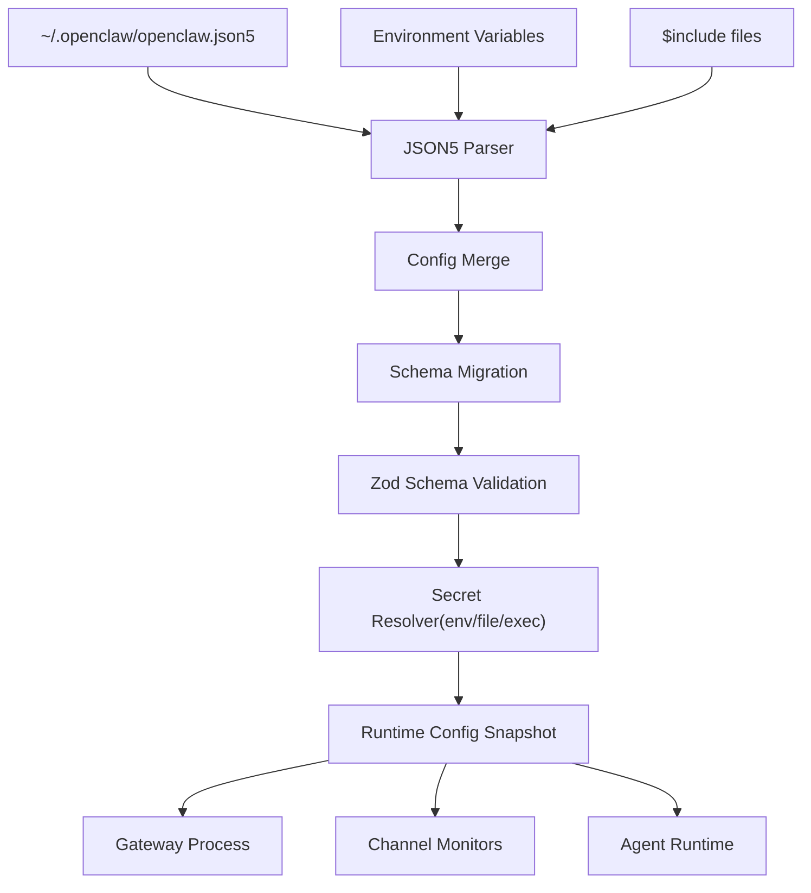
**关键代码路径：**

-   配置加载：[src/config/config.ts](https://github.com/openclaw/openclaw/blob/8873e13f/src/config/config.ts)
-   模式验证：[src/config/zod-schema.providers-core.ts](https://github.com/openclaw/openclaw/blob/8873e13f/src/config/zod-schema.providers-core.ts)
-   机密解析：[src/config/types.secrets.ts](https://github.com/openclaw/openclaw/blob/8873e13f/src/config/types.secrets.ts)
-   热重载：[src/gateway/reload.ts](https://github.com/openclaw/openclaw/blob/8873e13f/src/gateway/reload.ts)

**来源：** [src/config/config.ts1-100](https://github.com/openclaw/openclaw/blob/8873e13f/src/config/config.ts#L1-L100) [src/config/zod-schema.providers-core.ts1-100](https://github.com/openclaw/openclaw/blob/8873e13f/src/config/zod-schema.providers-core.ts#L1-L100)

---

## 通道特定配置深入探讨

### Telegram 配置代码映射

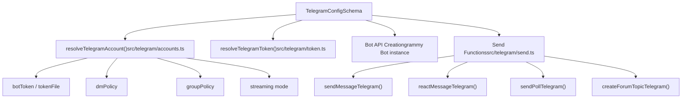
**来源：** [src/telegram/send.ts1-100](https://github.com/openclaw/openclaw/blob/8873e13f/src/telegram/send.ts#L1-L100) [src/telegram/accounts.ts1-50](https://github.com/openclaw/openclaw/blob/8873e13f/src/telegram/accounts.ts#L1-L50)

### Discord 配置代码映射

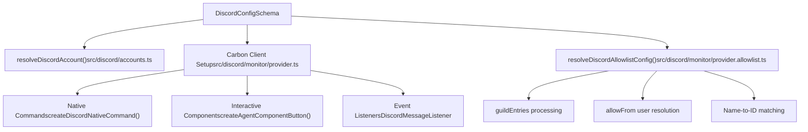
**来源：** [src/discord/monitor/provider.ts1-300](https://github.com/openclaw/openclaw/blob/8873e13f/src/discord/monitor/provider.ts#L1-L300) [src/discord/accounts.ts1-50](https://github.com/openclaw/openclaw/blob/8873e13f/src/discord/accounts.ts#L1-L50)

### Slack 配置代码映射

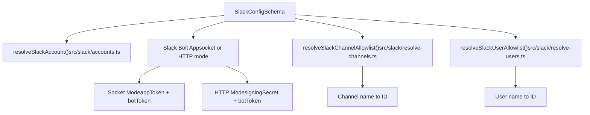
**来源：** [src/slack/monitor/provider.ts1-200](https://github.com/openclaw/openclaw/blob/8873e13f/src/slack/monitor/provider.ts#L1-L200) [src/slack/accounts.ts1-50](https://github.com/openclaw/openclaw/blob/8873e13f/src/slack/accounts.ts#L1-L50)

---

## 工具配置代码映射 (Tool Configuration Code Mapping)

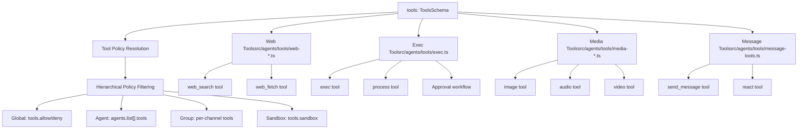
**来源：** [src/agents/tools/web-search.ts1-50](https://github.com/openclaw/openclaw/blob/8873e13f/src/agents/tools/web-search.ts#L1-L50) [src/agents/tools/exec.ts1-100](https://github.com/openclaw/openclaw/blob/8873e13f/src/agents/tools/exec.ts#L1-L100)

---

## 多账户配置模式 (Multi-Account Configuration Pattern)

所有通道都遵循以下模式支持多账户配置：

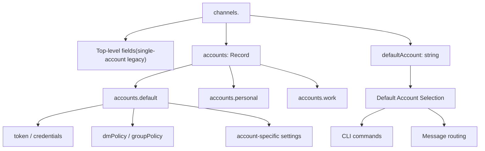
**账户解析顺序：**

1.  CLI/API 中的显式 `accountId` 参数。
2.  已配置的 `channels.<provider>.defaultAccount`。
3.  `channels.<provider>.accounts` 中名为 `"default"` 的账户。
4.  `channels.<provider>.accounts` 中的第一个账户（按字母顺序排序）。
5.  顶级单账户配置（旧版本路径）。

**来源：** [src/telegram/accounts.ts1-100](https://github.com/openclaw/openclaw/blob/8873e13f/src/telegram/accounts.ts#L1-L100) [src/discord/accounts.ts1-100](https://github.com/openclaw/openclaw/blob/8873e13f/src/discord/accounts.ts#L1-L100) [src/slack/accounts.ts1-100](https://github.com/openclaw/openclaw/blob/8873e13f/src/slack/accounts.ts#L1-L100)

---

## 字段级帮助与标签

代码库维护了所有配置字段的详尽元数据：

-   **帮助文本 (Help Text)**：[src/config/schema.help.ts1-1000](https://github.com/openclaw/openclaw/blob/8873e13f/src/config/schema.help.ts#L1-L1000) —— 每个字段的详细描述。
-   **字段标签 (Field Labels)**：[src/config/schema.labels.ts1-1000](https://github.com/openclaw/openclaw/blob/8873e13f/src/config/schema.labels.ts#L1-L1000) —— 用于 UI/CLI 显示的人性化标签。
-   **Zod 模式 (Zod Schemas)**：`src/config/zod-schema.*.ts` —— 类型安全的验证模式。

**字段文档模式示例：**

```
// 来自 schema.help.tsexport const FIELD_HELP: Record<string, string> = {  "channels.telegram.streaming":     "实时流预览模式：'off' 禁用流式传输，'partial' 通过草稿 API 或消息编辑实时流式传输 " +    "文本，'block' 使用合并分块的块流，'progress' 在 Telegram 上映射为 'partial'。",    "channels.discord.threadBindings.idleHours":    "闲置自动取消关注的 Discord 覆盖（小时，0 为禁用）。" +    "当绑定线程的会话闲置超过此时长时，绑定将被自动移除。"};
```
**来源：** [src/config/schema.help.ts1-1000](https://github.com/openclaw/openclaw/blob/8873e13f/src/config/schema.help.ts#L1-L1000) [src/config/schema.labels.ts1-1000](https://github.com/openclaw/openclaw/blob/8873e13f/src/config/schema.labels.ts#L1-L1000)

---

此配置参考涵盖了 OpenClaw 配置文件中的所有主要部分和字段。有关运行时行为和验证管道的详细信息，请参见 [配置系统 (Configuration System)](/openclaw/openclaw/2.3-configuration-system)。有关特定通道的设置和行为，请参见 [通道 (Channels)](/openclaw/openclaw/4-channels)。
