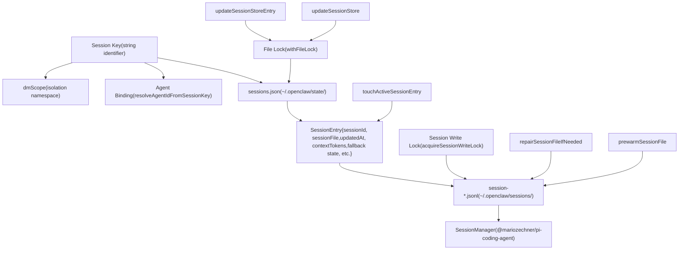
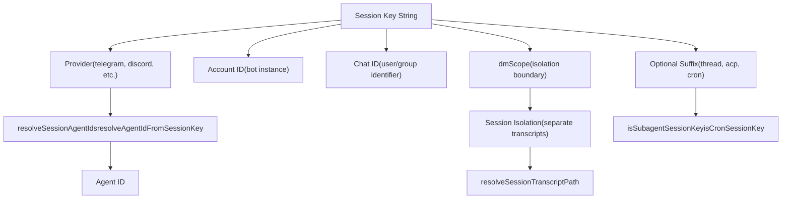
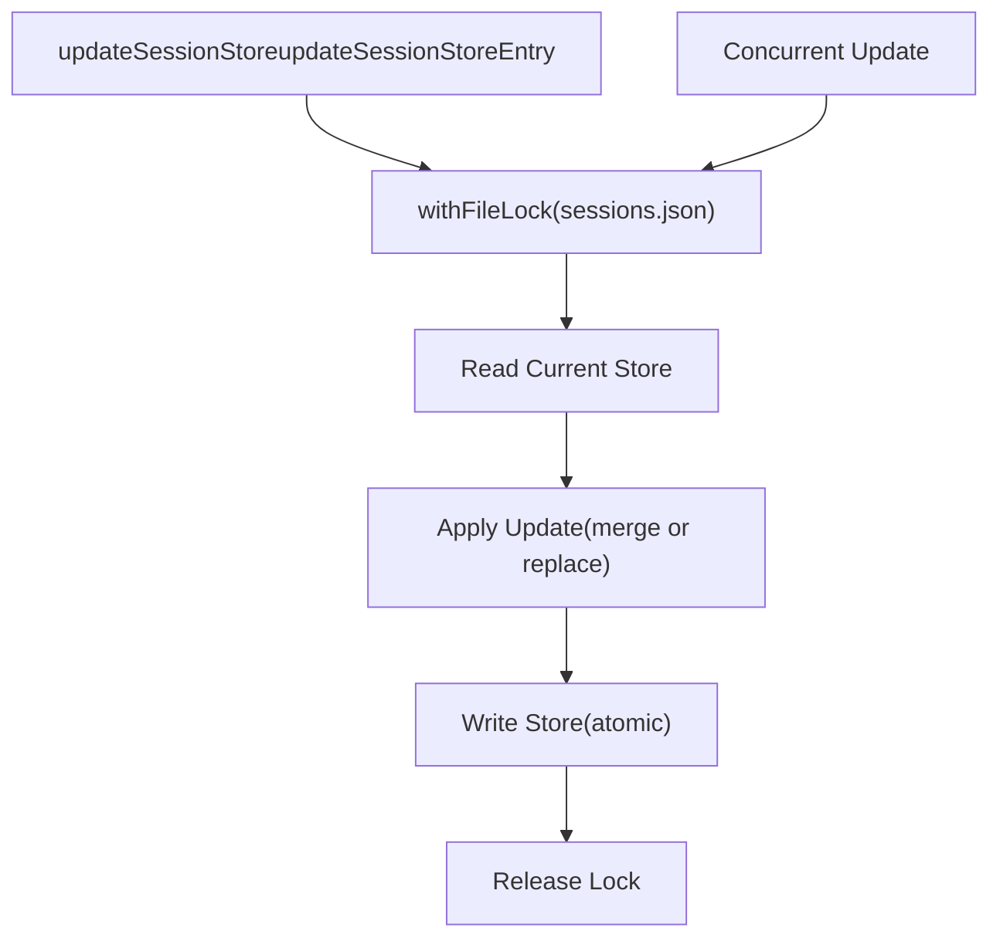
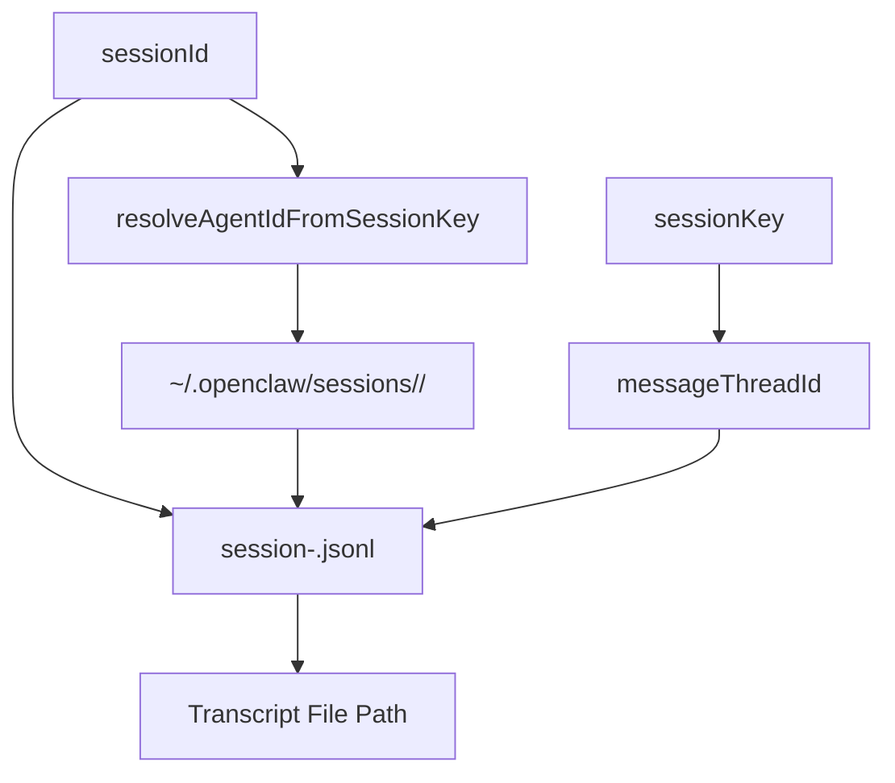
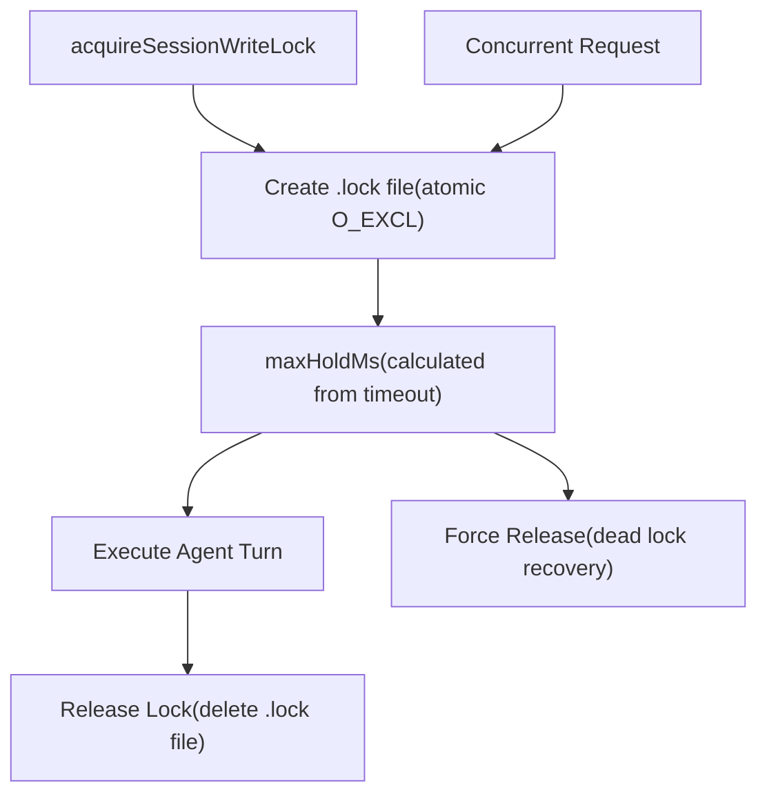
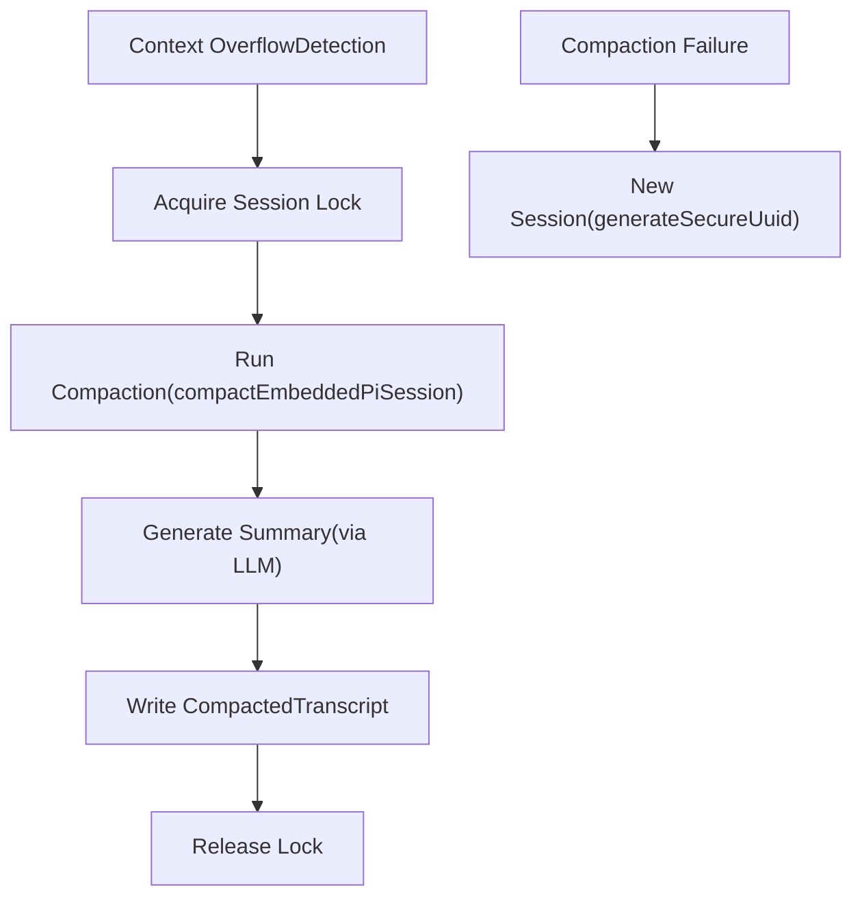
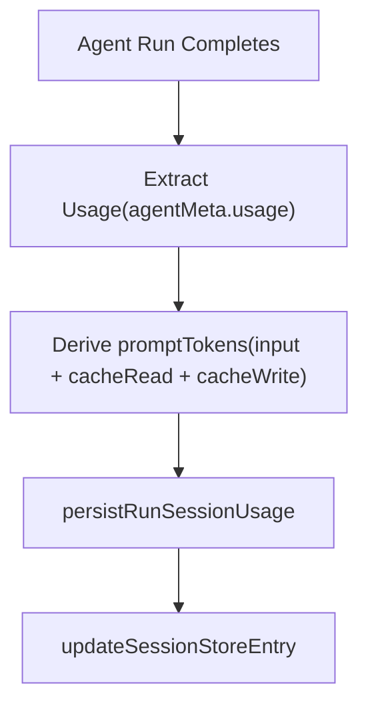

# 会话管理 (Session Management)

相关源文件

-   [apps/macos/Sources/OpenClawProtocol/GatewayModels.swift](https://github.com/openclaw/openclaw/blob/8873e13f/apps/macos/Sources/OpenClawProtocol/GatewayModels.swift)
-   [apps/shared/OpenClawKit/Sources/OpenClawProtocol/GatewayModels.swift](https://github.com/openclaw/openclaw/blob/8873e13f/apps/shared/OpenClawKit/Sources/OpenClawProtocol/GatewayModels.swift)
-   [docs/concepts/typing-indicators.md](https://github.com/openclaw/openclaw/blob/8873e13f/docs/concepts/typing-indicators.md)
-   [docs/experiments/onboarding-config-protocol.md](https://github.com/openclaw/openclaw/blob/8873e13f/docs/experiments/onboarding-config-protocol.md)
-   [scripts/protocol-gen-swift.ts](https://github.com/openclaw/openclaw/blob/8873e13f/scripts/protocol-gen-swift.ts)
-   [src/agents/auth-profiles.runtime-snapshot-save.test.ts](https://github.com/openclaw/openclaw/blob/8873e13f/src/agents/auth-profiles.runtime-snapshot-save.test.ts)
-   [src/agents/auth-profiles/oauth.openai-codex-refresh-fallback.test.ts](https://github.com/openclaw/openclaw/blob/8873e13f/src/agents/auth-profiles/oauth.openai-codex-refresh-fallback.test.ts)
-   [src/agents/auth-profiles/oauth.test.ts](https://github.com/openclaw/openclaw/blob/8873e13f/src/agents/auth-profiles/oauth.test.ts)
-   [src/agents/auth-profiles/oauth.ts](https://github.com/openclaw/openclaw/blob/8873e13f/src/agents/auth-profiles/oauth.ts)
-   [src/agents/openclaw-gateway-tool.test.ts](https://github.com/openclaw/openclaw/blob/8873e13f/src/agents/openclaw-gateway-tool.test.ts)
-   [src/agents/pi-embedded-runner/compact.ts](https://github.com/openclaw/openclaw/blob/8873e13f/src/agents/pi-embedded-runner/compact.ts)
-   [src/agents/pi-embedded-runner/run.ts](https://github.com/openclaw/openclaw/blob/8873e13f/src/agents/pi-embedded-runner/run.ts)
-   [src/agents/pi-embedded-runner/run/attempt.ts](https://github.com/openclaw/openclaw/blob/8873e13f/src/agents/pi-embedded-runner/run/attempt.ts)
-   [src/agents/pi-embedded-runner/run/params.ts](https://github.com/openclaw/openclaw/blob/8873e13f/src/agents/pi-embedded-runner/run/params.ts)
-   [src/agents/pi-embedded-runner/run/types.ts](https://github.com/openclaw/openclaw/blob/8873e13f/src/agents/pi-embedded-runner/run/types.ts)
-   [src/agents/pi-embedded-runner/system-prompt.ts](https://github.com/openclaw/openclaw/blob/8873e13f/src/agents/pi-embedded-runner/system-prompt.ts)
-   [src/agents/tools/gateway-tool.ts](https://github.com/openclaw/openclaw/blob/8873e13f/src/agents/tools/gateway-tool.ts)
-   [src/auto-reply/reply/agent-runner-execution.ts](https://github.com/openclaw/openclaw/blob/8873e13f/src/auto-reply/reply/agent-runner-execution.ts)
-   [src/auto-reply/reply/agent-runner-memory.ts](https://github.com/openclaw/openclaw/blob/8873e13f/src/auto-reply/reply/agent-runner-memory.ts)
-   [src/auto-reply/reply/agent-runner-utils.test.ts](https://github.com/openclaw/openclaw/blob/8873e13f/src/auto-reply/reply/agent-runner-utils.test.ts)
-   [src/auto-reply/reply/agent-runner-utils.ts](https://github.com/openclaw/openclaw/blob/8873e13f/src/auto-reply/reply/agent-runner-utils.ts)
-   [src/auto-reply/reply/agent-runner.ts](https://github.com/openclaw/openclaw/blob/8873e13f/src/auto-reply/reply/agent-runner.ts)
-   [src/auto-reply/reply/followup-runner.ts](https://github.com/openclaw/openclaw/blob/8873e13f/src/auto-reply/reply/followup-runner.ts)
-   [src/auto-reply/reply/test-helpers.ts](https://github.com/openclaw/openclaw/blob/8873e13f/src/auto-reply/reply/test-helpers.ts)
-   [src/auto-reply/reply/typing-mode.ts](https://github.com/openclaw/openclaw/blob/8873e13f/src/auto-reply/reply/typing-mode.ts)
-   [src/browser/control-auth.auto-token.test.ts](https://github.com/openclaw/openclaw/blob/8873e13f/src/browser/control-auth.auto-token.test.ts)
-   [src/browser/control-auth.test.ts](https://github.com/openclaw/openclaw/blob/8873e13f/src/browser/control-auth.test.ts)
-   [src/browser/control-auth.ts](https://github.com/openclaw/openclaw/blob/8873e13f/src/browser/control-auth.ts)
-   [src/config/schema.test.ts](https://github.com/openclaw/openclaw/blob/8873e13f/src/config/schema.test.ts)
-   [src/discord/monitor/thread-bindings.shared-state.test.ts](https://github.com/openclaw/openclaw/blob/8873e13f/src/discord/monitor/thread-bindings.shared-state.test.ts)
-   [src/gateway/method-scopes.test.ts](https://github.com/openclaw/openclaw/blob/8873e13f/src/gateway/method-scopes.test.ts)
-   [src/gateway/method-scopes.ts](https://github.com/openclaw/openclaw/blob/8873e13f/src/gateway/method-scopes.ts)
-   [src/gateway/protocol/index.ts](https://github.com/openclaw/openclaw/blob/8873e13f/src/gateway/protocol/index.ts)
-   [src/gateway/protocol/schema.ts](https://github.com/openclaw/openclaw/blob/8873e13f/src/gateway/protocol/schema.ts)
-   [src/gateway/protocol/schema/config.ts](https://github.com/openclaw/openclaw/blob/8873e13f/src/gateway/protocol/schema/config.ts)
-   [src/gateway/protocol/schema/protocol-schemas.ts](https://github.com/openclaw/openclaw/blob/8873e13f/src/gateway/protocol/schema/protocol-schemas.ts)
-   [src/gateway/protocol/schema/types.ts](https://github.com/openclaw/openclaw/blob/8873e13f/src/gateway/protocol/schema/types.ts)
-   [src/gateway/server-methods-list.ts](https://github.com/openclaw/openclaw/blob/8873e13f/src/gateway/server-methods-list.ts)
-   [src/gateway/server-methods.ts](https://github.com/openclaw/openclaw/blob/8873e13f/src/gateway/server-methods.ts)
-   [src/gateway/server-methods/config.ts](https://github.com/openclaw/openclaw/blob/8873e13f/src/gateway/server-methods/config.ts)
-   [src/gateway/server-methods/restart-request.ts](https://github.com/openclaw/openclaw/blob/8873e13f/src/gateway/server-methods/restart-request.ts)
-   [src/gateway/server-methods/update.ts](https://github.com/openclaw/openclaw/blob/8873e13f/src/gateway/server-methods/update.ts)
-   [src/gateway/server.config-patch.test.ts](https://github.com/openclaw/openclaw/blob/8873e13f/src/gateway/server.config-patch.test.ts)
-   [src/gateway/server.ts](https://github.com/openclaw/openclaw/blob/8873e13f/src/gateway/server.ts)
-   [src/gateway/startup-auth.test.ts](https://github.com/openclaw/openclaw/blob/8873e13f/src/gateway/startup-auth.test.ts)
-   [src/gateway/startup-auth.ts](https://github.com/openclaw/openclaw/blob/8873e13f/src/gateway/startup-auth.ts)

## 目的与范围 (Purpose and Scope)

本文档描述了 OpenClaw 的会话管理系统：对话如何被标识、隔离、持久化，并在网关 (Gateway) 和智能体 (Agent) 执行层之间同步。会话维护对话历史，跟踪智能体状态，并通过基于文件的锁定确保安全的并发访问。

有关如何通过入站通道消息创建和路由会话的信息，请参见 [消息流与智能体轮次执行 (Message Flow and Agent Turn Execution)](/openclaw/openclaw/2-gateway)。有关会话存储格式和修复机制的详细信息，请参见下文的转录部分。

---

## 会话架构概览 (Session Architecture Overview)

会话是 OpenClaw 中对话状态的基本单位。每个会话代表一个独特的对话线程（私信、群聊或内部交互），并维护自己的转录、元数据和执行上下文。


**来源：** [src/config/sessions.ts](https://github.com/openclaw/openclaw/blob/8873e13f/src/config/sessions.ts) [src/agents/session-write-lock.ts](https://github.com/openclaw/openclaw/blob/8873e13f/src/agents/session-write-lock.ts) [src/agents/pi-embedded-runner/run/attempt.ts536-541](https://github.com/openclaw/openclaw/blob/8873e13f/src/agents/pi-embedded-runner/run/attempt.ts#L536-L541) [src/auto-reply/reply/agent-runner.ts181-195](https://github.com/openclaw/openclaw/blob/8873e13f/src/auto-reply/reply/agent-runner.ts#L181-L195)

---

## 会话密钥与标识 (Session Keys and Identification)

### 会话密钥格式

会话密钥是结构化的字符串标识符，编码了对话的路由和隔离上下文：

```
<provider>:<accountId>:<chatId>:<dmScope>
```
针对特定的会话类型，可能会附加额外的后缀：

-   **线程会话**：`:thread:<threadId>` 或 `:topic:<topicId>`
-   **子智能体会话**：`:acp:<subagentName>`
-   **Cron 会话**：`:cron:<jobId>`


**来源：** [src/routing/session-key.ts](https://github.com/openclaw/openclaw/blob/8873e13f/src/routing/session-key.ts) [src/agents/agent-scope.ts](https://github.com/openclaw/openclaw/blob/8873e13f/src/agents/agent-scope.ts) [src/config/sessions.ts](https://github.com/openclaw/openclaw/blob/8873e13f/src/config/sessions.ts)

### dmScope 隔离

`dmScope` 组件将会话隔离，以防止交叉污染。即使对于相同的用户和提供商，不同的 `dmScope` 值也会创建完全独立的对话上下文：

| dmScope 值 | 目的 |
| --- | --- |
| `dm` | 标准私信会话 |
| `group` | 群聊会话 |
| `internal` | 内部系统会话 (控制 UI, CLI) |
| `cron` | 计划任务会话 |
| `acp` | 智能体控制面 (Agent Control Plane, 子智能体) 会话 |

**来源：** [src/routing/session-key.ts](https://github.com/openclaw/openclaw/blob/8873e13f/src/routing/session-key.ts) [src/agents/pi-embedded-runner/run/attempt.ts606-611](https://github.com/openclaw/openclaw/blob/8873e13f/src/agents/pi-embedded-runner/run/attempt.ts#L606-L611)

---

## 会话存储与注册表 (Session Store and Registry)

### SessionEntry 结构

会话存储维护一个将会话密钥映射到其元数据的注册表。每个 `SessionEntry` 包含：

```
type SessionEntry = {  sessionId: string;              // 唯一会话 UUID  sessionFile: string;            // JSONL 转录文件路径  updatedAt: number;              // 最后活跃时间戳 (ms)  createdAt?: number;             // 会话创建时间戳  contextTokens?: number;         // 模型上下文窗口大小  systemSent?: boolean;           // 系统介绍是否已发送  abortedLastRun?: boolean;       // 上次运行是否被中止  totalTokens?: number;           // 累计使用的 Token 数  promptTokens?: number;          // 上次提示词使用的 Token 数  fallbackNoticeSelectedModel?: string;  // 回退追踪  fallbackNoticeActiveModel?: string;  fallbackNoticeReason?: string;  compactionCount?: number;       // 自动压缩计数器  groupActivationNeedsSystemIntro?: boolean;  systemPromptReport?: object;    // 上次系统提示词元数据  cliSessionId?: string;          // CLI 提供商会话追踪};
```
**来源：** [src/config/sessions.ts](https://github.com/openclaw/openclaw/blob/8873e13f/src/config/sessions.ts) [src/auto-reply/reply/agent-runner.ts256-284](https://github.com/openclaw/openclaw/blob/8873e13f/src/auto-reply/reply/agent-runner.ts#L256-L284)

### 持久化存储文件

会话存储持久化在 `~/.openclaw/state/sessions.json` 中。所有更新操作都会获取一个文件锁以确保原子性：


**来源：** [src/config/sessions.ts](https://github.com/openclaw/openclaw/blob/8873e13f/src/config/sessions.ts) [src/auto-reply/reply/agent-runner.ts189-194](https://github.com/openclaw/openclaw/blob/8873e13f/src/auto-reply/reply/agent-runner.ts#L189-L194) [src/infra/file-lock.ts](https://github.com/openclaw/openclaw/blob/8873e13f/src/infra/file-lock.ts)

### 会话存储操作

| 函数 | 目的 |
| --- | --- |
| `updateSessionStore` | 使用原子回调更新整个存储 |
| `updateSessionStoreEntry` | 更新单个会话条目 |
| `touchActiveSessionEntry` | 更新 `updatedAt` 时间戳 |
| `resolveSessionFilePath` | 从条目中解析转录文件路径 |
| `resolveSessionTranscriptPath` | 从 `sessionId` 生成转录路径 |

**来源：** [src/config/sessions.ts](https://github.com/openclaw/openclaw/blob/8873e13f/src/config/sessions.ts) [src/auto-reply/reply/agent-runner.ts181-195](https://github.com/openclaw/openclaw/blob/8873e13f/src/auto-reply/reply/agent-runner.ts#L181-L195)

---

## 会话转录 (Session Transcripts)

### JSONL 格式

会话转录以换行符分隔的 JSON (JSONL) 文件形式存储在 `~/.openclaw/sessions/` 中。每一行代表对话历史中的一条消息：

```
{"sessionId":"uuid","role":"user","content":"Hello","timestamp":1234567890}{"sessionId":"uuid","role":"assistant","content":"Hi there","timestamp":1234567891}{"sessionId":"uuid","role":"toolCall","name":"exec","arguments":{"command":"ls"},"timestamp":1234567892}{"sessionId":"uuid","role":"toolResult","name":"exec","content":"file1.txt","timestamp":1234567893}
```
转录格式遵循 Pi 智能体消息模式，并针对工具执行元数据进行了 OpenClaw 特有的扩展。

**来源：** [src/agents/pi-embedded-runner/run/attempt.ts](https://github.com/openclaw/openclaw/blob/8873e13f/src/agents/pi-embedded-runner/run/attempt.ts) [@mariozechner/pi-coding-agent SessionManager](https://github.com/openclaw/openclaw/blob/8873e13f/@mariozechner/pi-coding-agent SessionManager)

### 转录路径与解析


**来源：** [src/config/sessions.ts](https://github.com/openclaw/openclaw/blob/8873e13f/src/config/sessions.ts) [src/agents/agent-paths.ts](https://github.com/openclaw/openclaw/blob/8873e13f/src/agents/agent-paths.ts)

### 转录修复 (Transcript Repair)

系统在打开转录文件之前会自动修复损坏的文件：

> **[Mermaid sequence]**
> *(图表结构无法解析)*

**来源：** [src/agents/session-file-repair.ts](https://github.com/openclaw/openclaw/blob/8873e13f/src/agents/session-file-repair.ts) [src/agents/pi-embedded-runner/run/attempt.ts543-546](https://github.com/openclaw/openclaw/blob/8873e13f/src/agents/pi-embedded-runner/run/attempt.ts#L543-L546)

---

## 基于文件的锁定 (File-Based Locking)

### 锁获取与持有时间

OpenClaw 使用基于文件的锁定，在智能体轮次期间将会话转录的访问序列化。当多个请求针对同一个会话时，这可以防止竞态条件：


**锁持有时间计算：**

```
maxHoldMs = timeoutMs + LOCK_HOLD_BUFFER_MS
```
其中 `LOCK_HOLD_BUFFER_MS` 提供额外的余量，以防止在耗时操作（压缩、工具执行）期间锁提前过期。

**来源：** [src/agents/session-write-lock.ts](https://github.com/openclaw/openclaw/blob/8873e13f/src/agents/session-write-lock.ts) [src/agents/pi-embedded-runner/run/attempt.ts536-541](https://github.com/openclaw/openclaw/blob/8873e13f/src/agents/pi-embedded-runner/run/attempt.ts#L536-L541)

### 锁范围与保证

会话写入锁保证：

-   **互斥性**：同一时间每个会话只执行一个智能体轮次。
-   **死锁预防**：具有可配置 `maxHoldMs` 的锁过期机制。
-   **转录一致性**：防止交错的消息写入。

锁文件路径派生自转录路径：

```
<transcript-path>.lock
```
**来源：** [src/agents/session-write-lock.ts](https://github.com/openclaw/openclaw/blob/8873e13f/src/agents/session-write-lock.ts) [src/infra/file-lock.ts](https://github.com/openclaw/openclaw/blob/8873e13f/src/infra/file-lock.ts)

---

## 会话生命周期 (Session Lifecycle)

### 创建与初始化

当新会话密钥的第一条消息到达时，会话将被延迟创建：

> **[Mermaid sequence]**
> *(图表结构无法解析)*

**来源：** [src/auto-reply/reply/agent-runner.ts63-93](https://github.com/openclaw/openclaw/blob/8873e13f/src/auto-reply/reply/agent-runner.ts#L63-L93) [src/config/sessions.ts](https://github.com/openclaw/openclaw/blob/8873e13f/src/config/sessions.ts)

### 活跃会话更新

在智能体轮次期间，会话条目会被更新以追踪：

```
// 触摸会话以更新活动时间戳await updateSessionStoreEntry({  storePath,  sessionKey,  update: async () => ({ updatedAt: Date.now() }),}); // 轮次完成后持久化使用量await persistRunSessionUsage({  storePath,  sessionKey,  usage,  lastCallUsage,  promptTokens,  modelUsed,  providerUsed,  contextTokensUsed,  systemPromptReport,});
```
**来源：** [src/auto-reply/reply/agent-runner.ts189-194](https://github.com/openclaw/openclaw/blob/8873e13f/src/auto-reply/reply/agent-runner.ts#L189-L194) [src/auto-reply/reply/session-run-accounting.ts](https://github.com/openclaw/openclaw/blob/8873e13f/src/auto-reply/reply/session-run-accounting.ts)

### 会话压缩 (Session Compaction)

当对话历史超过模型的上下文窗口时，会自动触发压缩，对旧消息进行总结：


**压缩会触发会话条目中 `compactionCount` 的自动递增。**

**来源：** [src/agents/pi-embedded-runner/compact.ts](https://github.com/openclaw/openclaw/blob/8873e13f/src/agents/pi-embedded-runner/compact.ts) [src/auto-reply/reply/agent-runner.ts328-340](https://github.com/openclaw/openclaw/blob/8873e13f/src/auto-reply/reply/agent-runner.ts#L328-L340) [src/auto-reply/reply/session-run-accounting.ts](https://github.com/openclaw/openclaw/blob/8873e13f/src/auto-reply/reply/session-run-accounting.ts)

### 会话重置与删除

会话可以被重置（新的转录，相同的密钥）或完全删除：

| 操作 | 效果 | API 方法 |
| --- | --- | --- |
| **重置** | 生成新的 `sessionId`，保留密钥 | `sessions.reset` |
| **删除** | 移除条目和转录文件 | `sessions.delete` |
| **清理** | 移除孤立/过期的会话 | 加载存储时自动清理 |

**重置实现：**

```
const nextSessionId = generateSecureUuid();const nextEntry: SessionEntry = {  ...prevEntry,  sessionId: nextSessionId,  updatedAt: Date.now(),  systemSent: false,  abortedLastRun: false,  // 清除 fallbackNotice* 字段};
```
**来源：** [src/auto-reply/reply/agent-runner.ts256-340](https://github.com/openclaw/openclaw/blob/8873e13f/src/auto-reply/reply/agent-runner.ts#L256-L340) [src/gateway/server-methods/sessions.ts](https://github.com/openclaw/openclaw/blob/8873e13f/src/gateway/server-methods/sessions.ts)

---

## 会话操作 (RPC 方法)

网关通过 WebSocket 协议暴露的 RPC 方法提供会话管理功能：

### sessions.list

**请求：**

```
{  method: "sessions.list",  params: {    agentId?: string;    dmScope?: string;    limit?: number;    offset?: number;  }}
```
**响应：**

```
{  sessions: Array<{    sessionKey: string;    sessionId: string;    updatedAt: number;    totalTokens?: number;    agentId: string;    messageChannel?: string;  }>;  total: number;}
```
**来源：** [src/gateway/protocol/schema/sessions.ts](https://github.com/openclaw/openclaw/blob/8873e13f/src/gateway/protocol/schema/sessions.ts) [src/gateway/server-methods/sessions.ts](https://github.com/openclaw/openclaw/blob/8873e13f/src/gateway/server-methods/sessions.ts)

### sessions.preview

从会话转录中检索最后 N 条消息，而无需加载完整历史：

```
{  method: "sessions.preview",  params: {    sessionKey: string;    limit?: number;  // 默认值: 10  }}
```
**来源：** [src/gateway/server-methods/sessions.ts](https://github.com/openclaw/openclaw/blob/8873e13f/src/gateway/server-methods/sessions.ts)

### sessions.patch

在不修改转录的情况下更新会话元数据：

```
{  method: "sessions.patch",  params: {    sessionKey: string;    updates: {      contextTokens?: number;      totalTokens?: number;      responseUsage?: "off" | "minimal" | "full";      // ... 其他 SessionEntry 字段    }  }}
```
**返回：** 包含更新后条目的 `SessionsPatchResult`。

**来源：** [src/gateway/protocol/schema/sessions.ts](https://github.com/openclaw/openclaw/blob/8873e13f/src/gateway/protocol/schema/sessions.ts) [src/gateway/session-utils.types.ts](https://github.com/openclaw/openclaw/blob/8873e13f/src/gateway/session-utils.types.ts)

### sessions.reset

通过生成新的 `sessionId` 并创建全新的转录来重置会话：

```
{  method: "sessions.reset",  params: {    sessionKey: string;    preserveMetadata?: boolean;  }}
```
**清理行为**：可选地删除旧的转录文件。

**来源：** [src/gateway/server-methods/sessions.ts](https://github.com/openclaw/openclaw/blob/8873e13f/src/gateway/server-methods/sessions.ts) [src/auto-reply/reply/agent-runner.ts261-327](https://github.com/openclaw/openclaw/blob/8873e13f/src/auto-reply/reply/agent-runner.ts#L261-L327)

### sessions.delete

永久移除会话条目及其转录文件：

```
{  method: "sessions.delete",  params: {    sessionKey: string;  }}
```
**来源：** [src/gateway/server-methods/sessions.ts](https://github.com/openclaw/openclaw/blob/8873e13f/src/gateway/server-methods/sessions.ts)

### sessions.compact

手动触发会话压缩（通常会自动发生）：

```
{  method: "sessions.compact",  params: {    sessionKey: string;    force?: boolean;    tokenBudget?: number;  }}
```
**响应：**

```
{  ok: boolean;  compacted: boolean;  reason?: string;  messagesBefore?: number;  messagesAfter?: number;}
```
**来源：** [src/gateway/protocol/schema/sessions.ts](https://github.com/openclaw/openclaw/blob/8873e13f/src/gateway/protocol/schema/sessions.ts) [src/gateway/server-methods/sessions.ts](https://github.com/openclaw/openclaw/blob/8873e13f/src/gateway/server-methods/sessions.ts)

---

## 会话元数据与状态追踪 (Session Metadata and State Tracking)

### 使用量统计 (Usage Accounting)

会话追踪各轮次的 Token 使用量，以实现精确的上下文窗口管理：

```
type UsageSnapshot = {  totalTokens: number;        // 累计使用量  promptTokens: number;       // 上次调用的提示词 Token 数  contextTokens: number;      // 模型上下文窗口大小};
```
**使用量持久化流程：**


**来源：** [src/auto-reply/reply/session-run-accounting.ts](https://github.com/openclaw/openclaw/blob/8873e13f/src/auto-reply/reply/session-run-accounting.ts) [src/agents/usage.ts](https://github.com/openclaw/openclaw/blob/8873e13f/src/agents/usage.ts)

### 回退状态 (Fallback State)

当发生模型回退（提供商不可用、受限等）时，会话会追踪这一转变：

```
{  fallbackNoticeSelectedModel: "anthropic/claude-3-5-sonnet",  fallbackNoticeActiveModel: "openai/gpt-4o",  fallbackNoticeReason: "rate_limit"}
```
此状态会一直持续到选定的模型再次可用，允许系统向用户显示通知性说明。

**来源：** [src/auto-reply/reply/agent-runner.ts422-454](https://github.com/openclaw/openclaw/blob/8873e13f/src/auto-reply/reply/agent-runner.ts#L422-L454) [src/auto-reply/fallback-state.ts](https://github.com/openclaw/openclaw/blob/8873e13f/src/auto-reply/fallback-state.ts)

### 系统提示词报告 (System Prompt Reporting)

`systemPromptReport` 字段存储关于上一个轮次所用系统提示词的元数据：

```
type SessionSystemPromptReport = {  promptCharacters: number;  bootstrapFilesInjected: number;  skillsPromptIncluded: boolean;  contextFilesInjected: number;  truncationWarnings?: string[];  // ... 其他元数据};
```
这为诊断和调试上下文窗口预算问题提供了可能。

**来源：** [src/config/sessions/types.ts](https://github.com/openclaw/openclaw/blob/8873e13f/src/config/sessions/types.ts) [src/agents/system-prompt-report.ts](https://github.com/openclaw/openclaw/blob/8873e13f/src/agents/system-prompt-report.ts)

---

## 会话管理器集成 (Session Manager Integration)

### SessionManager 生命周期

来自 `@mariozechner/pi-coding-agent` 的 `SessionManager` 类提供了转录文件的底层接口：

> **[Mermaid sequence]**
> *(图表结构无法解析)*

**来源：** [src/agents/pi-embedded-runner/run/attempt.ts536-605](https://github.com/openclaw/openclaw/blob/8873e13f/src/agents/pi-embedded-runner/run/attempt.ts#L536-L605) [@mariozechner/pi-coding-agent](https://github.com/openclaw/openclaw/blob/8873e13f/@mariozechner/pi-coding-agent)

### 保护性包装器 (Guard Wrappers)

`guardSessionManager` 包装器增加了 OpenClaw 特有的安全性检查：

```
const sessionManager = guardSessionManager(  SessionManager.open(sessionFile),  {    agentId: sessionAgentId,    sessionKey: params.sessionKey,    allowSyntheticToolResults: transcriptPolicy.allowSyntheticToolResults,    allowedToolNames,  });
```
保护机制强制执行：

-   工具名称白名单（防止未经授权的工具注入）。
-   合成工具结果策略（某些提供商要求真实的工具调用）。
-   转录修复与验证。

**来源：** [src/agents/session-tool-result-guard-wrapper.ts](https://github.com/openclaw/openclaw/blob/8873e13f/src/agents/session-tool-result-guard-wrapper.ts) [src/agents/pi-embedded-runner/run/attempt.ts554-558](https://github.com/openclaw/openclaw/blob/8873e13f/src/agents/pi-embedded-runner/run/attempt.ts#L554-L558)

### 会话管理器缓存

`prewarmSessionFile` 函数实现了一个 LRU 缓存，以避免冗余的文件读取：

```
const SESSION_CACHE_SIZE = 32;const sessionCache = new Map<string, { content: string; mtime: number }>(); async function prewarmSessionFile(path: string): Promise<void> {  const stats = await fs.stat(path);  const cached = sessionCache.get(path);  if (cached && cached.mtime === stats.mtimeMs) {    return; // 缓存命中  }  const content = await fs.readFile(path, "utf-8");  sessionCache.set(path, { content, mtime: stats.mtimeMs });  // 如果缓存超过大小，驱逐最旧的条目}
```
**来源：** [src/agents/pi-embedded-runner/session-manager-cache.ts](https://github.com/openclaw/openclaw/blob/8873e13f/src/agents/pi-embedded-runner/session-manager-cache.ts) [src/agents/pi-embedded-runner/run/attempt.ts547](https://github.com/openclaw/openclaw/blob/8873e13f/src/agents/pi-embedded-runner/run/attempt.ts#L547-L547)

---

## 会话隔离与安全性 (Session Isolation and Security)

### dmScope 边界

具有不同 `dmScope` 值的会话是完全隔离的：

| 场景 | 会话密钥模式 | 隔离情况 |
| --- | --- | --- |
| 用户在 Telegram 上私聊机器人 | `telegram:bot1:user123:dm` | 与群聊隔离 |
| 同一用户在群聊中 | `telegram:bot1:user123:group:chat456` | 独立的转录 |
| 控制 UI 交互 | `internal:webchat:session789:internal` | 与通道隔离 |
| 在私聊中衍生的子智能体 | `telegram:bot1:user123:dm:acp:researcher` | 嵌套会话 |

**访问控制**：网关的路由层在解析会话密钥之前会强制执行 `dmPolicy` 和 `groupPolicy`，防止未经授权的跨作用域访问。

**来源：** [src/routing/session-key.ts](https://github.com/openclaw/openclaw/blob/8873e13f/src/routing/session-key.ts) [src/gateway/server.impl.ts](https://github.com/openclaw/openclaw/blob/8873e13f/src/gateway/server.impl.ts)

### 子智能体会话嵌套

ACP (智能体控制面) 子智能体在其父会话下创建嵌套会话：

```
父会话:  telegram:bot1:user123:dm子会话: telegram:bot1:user123:dm:acp:researcher
```
`isSubagentSessionKey` 谓词标识这些会话以便进行特殊处理（最简系统提示词、线程绑定持久性）。

**来源：** [src/routing/session-key.ts](https://github.com/openclaw/openclaw/blob/8873e13f/src/routing/session-key.ts) [src/agents/pi-embedded-runner/run/attempt.ts606-611](https://github.com/openclaw/openclaw/blob/8873e13f/src/agents/pi-embedded-runner/run/attempt.ts#L606-L611)

---

## 性能考量 (Performance Considerations)

### 锁争用

对同一会话的高频请求可能导致锁争用。系统通过以下方式缓解此问题：

-   **队列策略**：`mode: "enqueue"` 会将后续轮次推迟到当前活跃轮次完成后执行。
-   **锁超时**：过期的锁会被强制释放，以防止永久死锁。
-   **正在输入指示器**：在耗时轮次期间向用户提供反馈。

**来源：** [src/auto-reply/reply/queue-policy.ts](https://github.com/openclaw/openclaw/blob/8873e13f/src/auto-reply/reply/queue-policy.ts) [src/auto-reply/reply/agent-runner.ts206-223](https://github.com/openclaw/openclaw/blob/8873e13f/src/auto-reply/reply/agent-runner.ts#L206-L223)

### 转录文件膨胀

超大转录文件会影响性能。OpenClaw 通过以下方式管理：

-   **自动压缩**：当 `estimateMessagesTokens()` 超过上下文窗口时触发。
-   **历史限制**：`dmHistoryLimit` 配置项限制消息保留数量。
-   **工具结果截断**：超大的工具输出在持久化之前会被截断。

**来源：** [src/agents/compaction.ts](https://github.com/openclaw/openclaw/blob/8873e13f/src/agents/compaction.ts) [src/agents/pi-embedded-runner/history.ts](https://github.com/openclaw/openclaw/blob/8873e13f/src/agents/pi-embedded-runner/history.ts) [src/agents/pi-embedded-runner/tool-result-truncation.ts](https://github.com/openclaw/openclaw/blob/8873e13f/src/agents/pi-embedded-runner/tool-result-truncation.ts)

### 会话存储大小

随着活跃会话增多，全局 `sessions.json` 文件可能会变得很大。清理策略包括：

-   **自动过期**：在加载时移除超过配置 TTL 的非活跃会话。
-   **手动删除**：通过 `sessions.delete` RPC 方法。
-   **智能体作用域隔离**：每个智能体维护独立的会话子目录。

**来源：** [src/config/sessions.ts](https://github.com/openclaw/openclaw/blob/8873e13f/src/config/sessions.ts)
