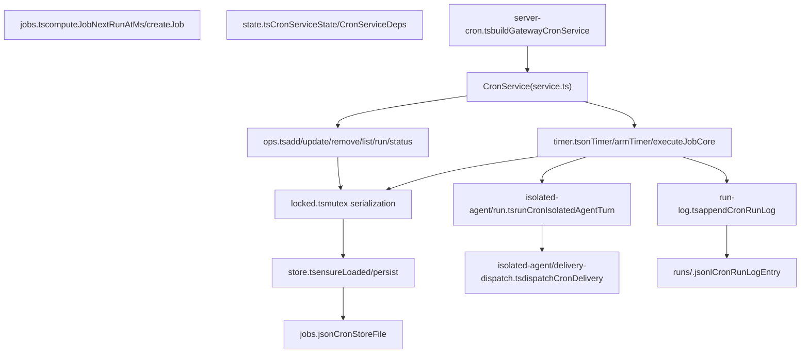
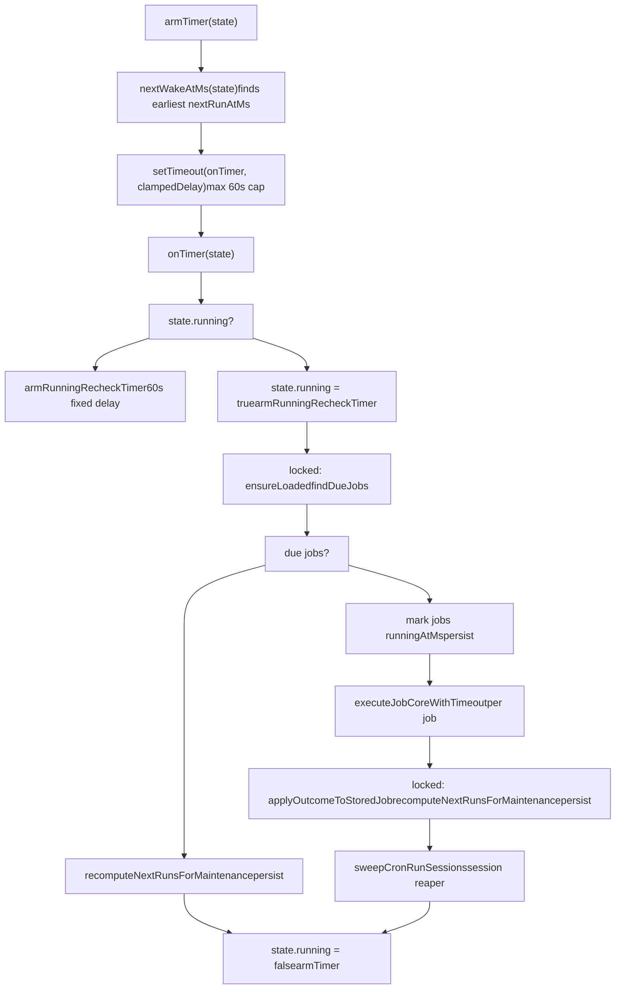
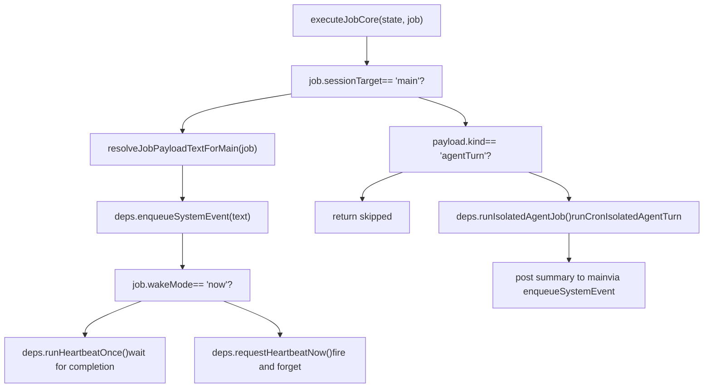
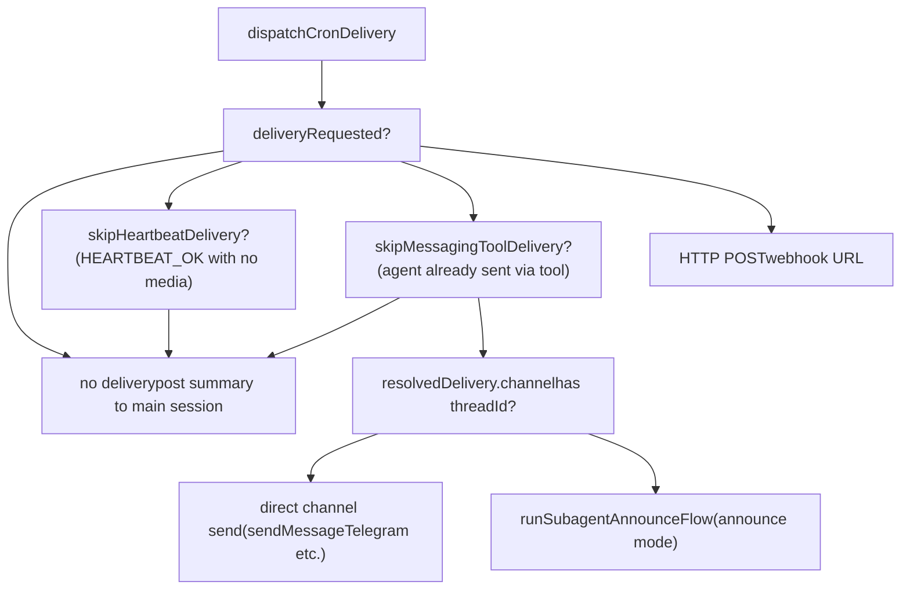

# Cron 服务 (Cron Service)

相关源文件

-   [CHANGELOG.md](https://github.com/openclaw/openclaw/blob/8873e13f/CHANGELOG.md)
-   [README.md](https://github.com/openclaw/openclaw/blob/8873e13f/README.md)
-   [apps/android/app/build.gradle.kts](https://github.com/openclaw/openclaw/blob/8873e13f/apps/android/app/build.gradle.kts)
-   [apps/ios/Sources/Info.plist](https://github.com/openclaw/openclaw/blob/8873e13f/apps/ios/Sources/Info.plist)
-   [apps/ios/Tests/Info.plist](https://github.com/openclaw/openclaw/blob/8873e13f/apps/ios/Tests/Info.plist)
-   [apps/ios/project.yml](https://github.com/openclaw/openclaw/blob/8873e13f/apps/ios/project.yml)
-   [apps/macos/Sources/OpenClaw/Resources/Info.plist](https://github.com/openclaw/openclaw/blob/8873e13f/apps/macos/Sources/OpenClaw/Resources/Info.plist)
-   [assets/avatar-placeholder.svg](https://github.com/openclaw/openclaw/blob/8873e13f/assets/avatar-placeholder.svg)
-   [docs/cli/index.md](https://github.com/openclaw/openclaw/blob/8873e13f/docs/cli/index.md)
-   [docs/gateway/configuration.md](https://github.com/openclaw/openclaw/blob/8873e13f/docs/gateway/configuration.md)
-   [docs/gateway/doctor.md](https://github.com/openclaw/openclaw/blob/8873e13f/docs/gateway/doctor.md)
-   [docs/gateway/index.md](https://github.com/openclaw/openclaw/blob/8873e13f/docs/gateway/index.md)
-   [docs/gateway/troubleshooting.md](https://github.com/openclaw/openclaw/blob/8873e13f/docs/gateway/troubleshooting.md)
-   [docs/index.md](https://github.com/openclaw/openclaw/blob/8873e13f/docs/index.md)
-   [docs/platforms/mac/release.md](https://github.com/openclaw/openclaw/blob/8873e13f/docs/platforms/mac/release.md)
-   [docs/start/getting-started.md](https://github.com/openclaw/openclaw/blob/8873e13f/docs/start/getting-started.md)
-   [docs/start/wizard.md](https://github.com/openclaw/openclaw/blob/8873e13f/docs/start/wizard.md)
-   [extensions/bluebubbles/src/send-helpers.ts](https://github.com/openclaw/openclaw/blob/8873e13f/extensions/bluebubbles/src/send-helpers.ts)
-   [package.json](https://github.com/openclaw/openclaw/blob/8873e13f/package.json)
-   [pnpm-lock.yaml](https://github.com/openclaw/openclaw/blob/8873e13f/pnpm-lock.yaml)
-   [scripts/clawtributors-map.json](https://github.com/openclaw/openclaw/blob/8873e13f/scripts/clawtributors-map.json)
-   [scripts/update-clawtributors.ts](https://github.com/openclaw/openclaw/blob/8873e13f/scripts/update-clawtributors.ts)
-   [scripts/update-clawtributors.types.ts](https://github.com/openclaw/openclaw/blob/8873e13f/scripts/update-clawtributors.types.ts)
-   [src/agents/bash-tools.test.ts](https://github.com/openclaw/openclaw/blob/8873e13f/src/agents/bash-tools.test.ts)
-   [src/agents/model-auth.ts](https://github.com/openclaw/openclaw/blob/8873e13f/src/agents/model-auth.ts)
-   [src/agents/models-config.providers.ts](https://github.com/openclaw/openclaw/blob/8873e13f/src/agents/models-config.providers.ts)
-   [src/agents/pi-tools-agent-config.test.ts](https://github.com/openclaw/openclaw/blob/8873e13f/src/agents/pi-tools-agent-config.test.ts)
-   [src/agents/subagent-registry-cleanup.test.ts](https://github.com/openclaw/openclaw/blob/8873e13f/src/agents/subagent-registry-cleanup.test.ts)
-   [src/cli/program.ts](https://github.com/openclaw/openclaw/blob/8873e13f/src/cli/program.ts)
-   [src/cli/program/register.onboard.ts](https://github.com/openclaw/openclaw/blob/8873e13f/src/cli/program/register.onboard.ts)
-   [src/commands/auth-choice-options.test.ts](https://github.com/openclaw/openclaw/blob/8873e13f/src/commands/auth-choice-options.test.ts)
-   [src/commands/auth-choice-options.ts](https://github.com/openclaw/openclaw/blob/8873e13f/src/commands/auth-choice-options.ts)
-   [src/commands/auth-choice.apply.api-providers.ts](https://github.com/openclaw/openclaw/blob/8873e13f/src/commands/auth-choice.apply.api-providers.ts)
-   [src/commands/auth-choice.preferred-provider.ts](https://github.com/openclaw/openclaw/blob/8873e13f/src/commands/auth-choice.preferred-provider.ts)
-   [src/commands/auth-choice.test.ts](https://github.com/openclaw/openclaw/blob/8873e13f/src/commands/auth-choice.test.ts)
-   [src/commands/auth-choice.ts](https://github.com/openclaw/openclaw/blob/8873e13f/src/commands/auth-choice.ts)
-   [src/commands/configure.ts](https://github.com/openclaw/openclaw/blob/8873e13f/src/commands/configure.ts)
-   [src/commands/doctor.ts](https://github.com/openclaw/openclaw/blob/8873e13f/src/commands/doctor.ts)
-   [src/commands/onboard-auth.config-core.ts](https://github.com/openclaw/openclaw/blob/8873e13f/src/commands/onboard-auth.config-core.ts)
-   [src/commands/onboard-auth.credentials.ts](https://github.com/openclaw/openclaw/blob/8873e13f/src/commands/onboard-auth.credentials.ts)
-   [src/commands/onboard-auth.models.ts](https://github.com/openclaw/openclaw/blob/8873e13f/src/commands/onboard-auth.models.ts)
-   [src/commands/onboard-auth.test.ts](https://github.com/openclaw/openclaw/blob/8873e13f/src/commands/onboard-auth.test.ts)
-   [src/commands/onboard-auth.ts](https://github.com/openclaw/openclaw/blob/8873e13f/src/commands/onboard-auth.ts)
-   [src/commands/onboard-non-interactive.ts](https://github.com/openclaw/openclaw/blob/8873e13f/src/commands/onboard-non-interactive.ts)
-   [src/commands/onboard-non-interactive/local/auth-choice.ts](https://github.com/openclaw/openclaw/blob/8873e13f/src/commands/onboard-non-interactive/local/auth-choice.ts)
-   [src/commands/onboard-types.ts](https://github.com/openclaw/openclaw/blob/8873e13f/src/commands/onboard-types.ts)
-   [src/config/config.ts](https://github.com/openclaw/openclaw/blob/8873e13f/src/config/config.ts)
-   [src/config/types.ts](https://github.com/openclaw/openclaw/blob/8873e13f/src/config/types.ts)
-   [src/config/zod-schema.ts](https://github.com/openclaw/openclaw/blob/8873e13f/src/config/zod-schema.ts)
-   [src/wizard/onboarding.ts](https://github.com/openclaw/openclaw/blob/8873e13f/src/wizard/onboarding.ts)
-   [ui/package.json](https://github.com/openclaw/openclaw/blob/8873e13f/ui/package.json)

Cron 服务是嵌入在网关 (Gateway) 中的内部调度器，用于运行时间触发的任务。它支持一次性和周期性调度，两种执行模式（注入到主会话或运行完整的隔离智能体轮次），以及可选的将结果外发到消息通道的功能。

本页涵盖了调度器内部机制、任务数据结构、执行管道、交付系统、运行日志，以及通过网关 WebSocket 协议公开的 `cron.*` RPC 方法。有关网关的整体架构，请参见第 [2](/openclaw/openclaw/2-gateway) 页；有关隔离 Cron 任务调用的智能体执行管道，请参见第 [3.1](/openclaw/openclaw/3-agents/3.1-agent-execution-pipeline) 页。

---

## 核心数据模型 (Core Data Model)

### CronJob

`CronJob` 是中心记录。其类型定义在 [src/cron/types.ts111-128](https://github.com/openclaw/openclaw/blob/8873e13f/src/cron/types.ts#L111-L128)

| 字段 | 类型 | 描述 |
| --- | --- | --- |
| `id` | `string` | 任务唯一标识符 |
| `name` | `string` | 易于理解的标签 |
| `agentId` | `string?` | 目标智能体；回退到默认智能体 |
| `sessionKey` | `string?` | 用于唤醒路由的源会话命名空间 |
| `enabled` | `boolean` | 任务是否参与调度 |
| `deleteAfterRun` | `boolean?` | 成功运行后是否删除该任务 |
| `schedule` | `CronSchedule` | 何时触发 |
| `sessionTarget` | `CronSessionTarget` | `"main"` (主会话) 或 `"isolated"` (隔离会话) |
| `wakeMode` | `CronWakeMode` | `"now"` (立即) 或 `"next-heartbeat"` (下次心跳) |
| `payload` | `CronPayload` | 触发时执行的操作 |
| `delivery` | `CronDelivery?` | 如何将结果交付到通道 |
| `state` | `CronJobState` | 运行时追踪字段 |

### 调度类型 (Schedule Types)

定义在 [src/cron/types.ts3-12](https://github.com/openclaw/openclaw/blob/8873e13f/src/cron/types.ts#L3-L12)

| `kind` (种类) | 字段 | 行为 |
| --- | --- | --- |
| `at` | `at: string` (ISO 8601) | 一次性：在指定时间触发一次 |
| `every` | `everyMs: number`, `anchorMs?: number` | 间隔性：以相对于锚点的固定间隔重复触发 |
| `cron` | `expr: string`, `tz?: string`, `staggerMs?: number` | Cron 表达式（支持秒级）；可选时区和确定性的交错窗口 |

`cron` 调度中的 `staggerMs` 字段引入了一个派生自任务 ID（通过 SHA-256 哈希）的确定性偏移量，以避免所有任务在整点准时同时触发。

### 负载种类 (Payload Kinds)

定义在 [src/cron/types.ts58-72](https://github.com/openclaw/openclaw/blob/8873e13f/src/cron/types.ts#L58-L72)

| `kind` (种类) | 字段 | 行为 |
| --- | --- | --- |
| `systemEvent` | `text: string` | 将 `text` 作为系统事件注入到主会话中 |
| `agentTurn` | `message`, `model?`, `thinking?`, `timeoutSeconds?`, `allowUnsafeExternalContent?` | 使用给定的消息运行一次完整的隔离智能体轮次 |

### 会话目标 (Session Targets)

| 值 | 描述 |
| --- | --- |
| `"main"` | 负载文本作为系统事件排队到主会话中；不创建单独的智能体上下文 |
| `"isolated"` | 为该任务创建（或重用）一个专用会话；智能体独立运行 |

### 交付模式 (Delivery Modes)

定义在 [src/cron/types.ts19-27](https://github.com/openclaw/openclaw/blob/8873e13f/src/cron/types.ts#L19-L27)

| 模式 | 行为 |
| --- | --- |
| `"none"` | 不进行外发交付；结果仅在运行日志中可见 |
| `"announce"` | 隔离运行后，通过子智能体公告流或直接频道发送将输出分发到指定通道 |
| `"webhook"` | 将结果摘要通过 POST 请求发送到指定的 HTTP URL |

---

## 服务架构 (Service Architecture)

**标题：CronService 内部结构**


来源：[src/cron/service/state.ts](https://github.com/openclaw/openclaw/blob/8873e13f/src/cron/service/state.ts) [src/cron/service/ops.ts](https://github.com/openclaw/openclaw/blob/8873e13f/src/cron/service/ops.ts) [src/cron/service/timer.ts](https://github.com/openclaw/openclaw/blob/8873e13f/src/cron/service/timer.ts) [src/cron/run-log.ts](https://github.com/openclaw/openclaw/blob/8873e13f/src/cron/run-log.ts) [src/gateway/server-cron.ts](https://github.com/openclaw/openclaw/blob/8873e13f/src/gateway/server-cron.ts)

---

### CronServiceDeps

`CronServiceDeps` 接口 ([src/cron/service/state.ts37-92](https://github.com/openclaw/openclaw/blob/8873e13f/src/cron/service/state.ts#L37-L92)) 将调度器连接到网关的其他部分：

| 依赖 (Dep) | 签名 | 目的 |
| --- | --- | --- |
| `enqueueSystemEvent` | `(text, opts?) => void` | 将文本注入到主会话事件队列中 |
| `requestHeartbeatNow` | `(opts?) => void` | 立即触发心跳运行器，不等待 |
| `runHeartbeatOnce` | `(opts?) => Promise<HeartbeatRunResult>` | 等待单个心跳周期完成 |
| `runIsolatedAgentJob` | `(params) => Promise<...>` | 为 Cron 任务运行完整的隔离智能体轮次 |
| `onEvent` | `(evt: CronEvent) => void` | 接收任务生命周期事件（添加/启动/完成/移除） |
| `cronConfig` | `CronConfig?` | 会话保留和运行日志设置 |
| `resolveSessionStorePath` | `(agentId?) => string` | 查找每个智能体的 sessions.json 路径 |

---

### CronServiceState

`CronServiceState` ([src/cron/service/state.ts98-107](https://github.com/openclaw/openclaw/blob/8873e13f/src/cron/service/state.ts#L98-L107)) 是贯穿所有内部操作的运行时状态对象：

| 字段 | 类型 | 描述 |
| --- | --- | --- |
| `deps` | `CronServiceDepsInternal` | 所有连接的依赖项 |
| `store` | `CronStoreFile | null` | `jobs.json` 的内存副本 |
| `timer` | `NodeJS.Timeout | null` | 活跃的 `setTimeout` 句柄 |
| `running` | `boolean` | 定时器 tick 正在执行时为 `true` |
| `storeLoadedAtMs` | `number | null` | 上次加载存储的时间 |
| `storeFileMtimeMs` | `number | null` | 上次加载时存储文件的修改时间；用于变更检测 |

---

## 调度与定时器循环 (Scheduling & Timer Loop)

**标题：定时器 tick 和任务执行流**


来源：[src/cron/service/timer.ts239-278](https://github.com/openclaw/openclaw/blob/8873e13f/src/cron/service/timer.ts#L239-L278) [src/cron/service/timer.ts291-443](https://github.com/openclaw/openclaw/blob/8873e13f/src/cron/service/timer.ts#L291-L443)

#### 关键不变性 (Key Invariants)

-   定时器延迟被限制在 `MAX_TIMER_DELAY_MS = 60_000` 毫秒内。即使任务被调度在几年后，每 60 秒也会产生一次 tick。
-   如果定时器触发时 `state.running` 已经为 `true`（表示任务仍在运行），则会装载一个新的 60 秒重检定时器，并且本次 tick 立即退出。这可以防止调度器在长时间运行的任务期间进入静默状态（issue #12025）。
-   在每次 tick 之后，存储会被强制重新加载后再写入结果，这样就不会覆盖并发磁盘写入（例如来自隔离交付路径的写入）。

#### 启动补偿 (Startup Catch-up)

在 `start()` ([src/cron/service/ops.ts89-128](https://github.com/openclaw/openclaw/blob/8873e13f/src/cron/service/ops.ts#L89-L128)) 时，服务会：

1.  清除上次崩溃留下的陈旧 `runningAtMs` 标记。
2.  调用 `runMissedJobs` ([src/cron/service/timer.ts500-578](https://github.com/openclaw/openclaw/blob/8873e13f/src/cron/service/timer.ts#L500-L578)) 立即执行任何 `nextRunAtMs` 已过时且自上次终端状态后尚未运行的任务（受 `skipAtIfAlreadyRan` 保护）。
3.  重新计算所有 `nextRunAtMs` 值并装载定时器。

---

## 任务执行 (Job Execution)

**标题：按会话目标和负载种类分支的 executeJobCore**


来源：[src/cron/service/timer.ts591-765](https://github.com/openclaw/openclaw/blob/8873e13f/src/cron/service/timer.ts#L591-L765)

### 主会话任务 (Main Session Jobs)

当 `sessionTarget === "main"` 时：

-   负载 `text` 被传递给 `enqueueSystemEvent`，后者将其放入相应会话的系统事件队列中。
-   在 `wakeMode === "now"` 模式下：会等待 `runHeartbeatOnce`。如果主车道正忙（返回 `reason: "requests-in-flight"`），服务将重试直到 `wakeNowHeartbeatBusyMaxWaitMs`（默认 2 分钟），然后回退到 `requestHeartbeatNow`。
-   在 `wakeMode === "next-heartbeat"` 模式下：非阻塞调用 `requestHeartbeatNow`。

### 隔离智能体任务 (Isolated Agent Jobs)

当 `sessionTarget === "isolated"` 且 `payload.kind === "agentTurn"` 时：

1.  调用 `runIsolatedAgentJob`，该函数委派给 `runCronIsolatedAgentTurn` ([src/cron/isolated-agent/run.ts90-646](https://github.com/openclaw/openclaw/blob/8873e13f/src/cron/isolated-agent/run.ts#L90-L646))。
2.  隔离运行解析智能体配置、模型、身份验证配置文件和会话；然后调用 `runEmbeddedPiAgent`（或针对 CLI 支持的提供商调用 `runCliAgent`）。
3.  运行完成后，如果尚未处理交付且摘要可用，摘要将作为系统事件排队到主会话中。

#### 安全：外部钩子内容 (External Hook Content)

如果会话密钥将任务标记为外部钩子（例如 `hook:gmail:`），`runCronIsolatedAgentTurn` 会使用 `buildSafeExternalPrompt` 将消息包裹在安全边界内以防止提示词注入，除非在负载上设置了 `allowUnsafeExternalContent: true` ([src/cron/isolated-agent/run.ts327-362](https://github.com/openclaw/openclaw/blob/8873e13f/src/cron/isolated-agent/run.ts#L327-L362))。

---

## 错误退避 (Error Backoff)

定义在 [src/cron/service/timer.ts94-105](https://github.com/openclaw/openclaw/blob/8873e13f/src/cron/service/timer.ts#L94-L105)

当一个重复性任务出错时，其下一次运行将被指数退避延迟。系统会比较自然下一次运行时间和退避时间，并取较晚的一个：

| 连续错误次数 | 延迟 |
| --- | --- |
| 1 | 30 秒 |
| 2 | 1 分钟 |
| 3 | 5 分钟 |
| 4 | 15 分钟 |
| 5+ | 60 分钟 |

成功运行后，`consecutiveErrors` 计数器重置为 `0`。

### 一次性任务 (One-shot Jobs)

对于 `schedule.kind === "at"` 的任务 ([src/cron/service/timer.ts153-167](https://github.com/openclaw/openclaw/blob/8873e13f/src/cron/service/timer.ts#L153-L167))：

-   在任何终端状态（`ok`, `error`, 或 `skipped`）之后，任务将被禁用 (`enabled = false`) 并清除 `nextRunAtMs`。
-   如果 `deleteAfterRun === true` **且** 状态为 `ok`，任务将完全从存储中删除。

---

## 交付 (Delivery)

隔离运行完成后，`dispatchCronDelivery` ([src/cron/isolated-agent/delivery-dispatch.ts](https://github.com/openclaw/openclaw/blob/8873e13f/src/cron/isolated-agent/delivery-dispatch.ts)) 根据任务的 `delivery` 配置对输出进行路由。

**标题：交付分发决策树**


来源：[src/cron/isolated-agent/run.ts585-645](https://github.com/openclaw/openclaw/blob/8873e13f/src/cron/isolated-agent/run.ts#L585-L645) [src/gateway/server-cron.ts52-70](https://github.com/openclaw/openclaw/blob/8873e13f/src/gateway/server-cron.ts#L52-L70)

**交付模式详情：**

| `delivery.mode` | 行为 |
| --- | --- |
| `"none"` | 输出仅在运行日志中可见；不进行外发。 |
| `"announce"` | 调用 `runSubagentAnnounceFlow`（或针对带线程的目标直接发送到通道）。如果 `bestEffort: true`，交付失败会将运行状态从 `error` 降级为 `ok`。 |
| `"webhook"` | 以 JSON 格式将运行摘要 POST 到 `delivery.to`；超时时间为 10 秒。 |

`delivery.channel` 字段接受任何 `ChannelId`（例如 `"telegram"`, `"discord"`）或特殊值 `"last"`（解析为该会话中最近一次对话所用的通道）。

---

## 运行日志 (Run Log)

每次完成的任务执行都会追加到按任务划分的 JSONL 文件中。相关代码在 [src/cron/run-log.ts](https://github.com/openclaw/openclaw/blob/8873e13f/src/cron/run-log.ts)

**存储布局：**

```
~/.openclaw/cron/
  jobs.json              # CronStoreFile (所有任务定义 + 状态)
  runs/
    <jobId>.jsonl        # 每次完成执行的 CronRunLogEntry
```
`CronRunLogEntry` 字段 ([src/cron/run-log.ts7-23](https://github.com/openclaw/openclaw/blob/8873e13f/src/cron/run-log.ts#L7-L23))：

| 字段 | 描述 |
| --- | --- |
| `ts` | 写入日志的 Unix 时间戳 |
| `jobId` | 任务标识符 |
| `status` | `ok` / `error` / `skipped` |
| `error` | 出错时的错误消息（如有） |
| `summary` | 智能体输出摘要 |
| `delivered` | 输出是否已交付到通道 |
| `deliveryStatus` | `delivered` / `not-delivered` / `unknown` / `not-requested` |
| `durationMs` | 运行的实际挂钟时长 |
| `model` / `provider` | 运行时使用的模型 |
| `usage` | Token 使用量遥测 |

日志文件会自动清理：默认上限为 **2 MB** 和 **2000 行** (`DEFAULT_CRON_RUN_LOG_MAX_BYTES`, `DEFAULT_CRON_RUN_LOG_KEEP_LINES`)。这些限制可以在 `openclaw.json` 中的 `cron.runLog.maxBytes` 和 `cron.runLog.keepLines` 进行配置（见第 [2.3.1](/openclaw/openclaw/2.3-configuration-system/2.3.1-configuration-reference) 页）。

---

## 存储持久化 (Store Persistence)

定义在 [src/cron/store.ts](https://github.com/openclaw/openclaw/blob/8873e13f/src/cron/store.ts)

| 符号 | 值 |
| --- | --- |
| `DEFAULT_CRON_STORE_PATH` | `~/.openclaw/cron/jobs.json` |
| `resolveCronStorePath(cfg?)` | 从配置或默认值解析存储路径 |
| `loadCronStore(storePath)` | 读取并解析；在 `ENOENT` 时返回空存储 |
| `saveCronStore(storePath, store)` | 通过临时文件重命名的原子写入 |

在每次定时器 tick（强制重新加载）和每次变更操作时，存储都会被热加载。服务会追踪 `storeFileMtimeMs`，以便在文件未更改时跳过不必要的磁盘读取。

---

## RPC 方法

`cron.*` 方法通过网关 WebSocket 协议提供给经过身份验证的操作员客户端（见第 [2.1](/openclaw/openclaw/2.1-websocket-protocol-and-rpc) 页）。模式定义在 [src/gateway/protocol/schema/cron.ts](https://github.com/openclaw/openclaw/blob/8873e13f/src/gateway/protocol/schema/cron.ts)

**标题：映射到内部操作的 cron.* RPC 界面**

```mermaid
flowchart TD
    add["cron.addCronAddParamsSchema"]
    update["cron.updateCronJobPatchSchema"]
    remove["cron.remove"]
    list["cron.listCronListParamsSchema"]
    listPage["cron.listPage"]
    status["cron.status"]
    run["cron.runmode: force | due"]
    runsRead["cron.runs.readcron.runs.listcron.runs.page"]
    addOp["add(state, input)"]
    updateOp["update(state, id, patch)"]
    removeOp["remove(state, id)"]
    listOp["list(state, opts)"]
    listPageOp["listPage(state, opts)"]
    statusOp["status(state)"]
    runOp["run(state, id, mode)"]
    readLog["readCronRunLogEntries"]
    readLogPage["readCronRunLogEntriesPage"]

    add --> addOp
    update --> updateOp
    remove --> removeOp
    list --> listOp
    listPage --> listPageOp
    status --> statusOp
    run --> runOp
    runsRead --> readLog
    runsRead --> readLogPage
```


来源：[src/cron/service/ops.ts](https://github.com/openclaw/openclaw/blob/8873e13f/src/cron/service/ops.ts) [src/gateway/protocol/schema/cron.ts](https://github.com/openclaw/openclaw/blob/8873e13f/src/gateway/protocol/schema/cron.ts) [src/cron/run-log.ts](https://github.com/openclaw/openclaw/blob/8873e13f/src/cron/run-log.ts)

### 方法参考 (Method Reference)

| 方法 | 参数 | 返回值 |
| --- | --- | --- |
| `cron.add` | `CronAddParamsSchema` | `CronJob` |
| `cron.update` | `id`, `CronJobPatchSchema` | `CronJob` |
| `cron.remove` | `id` | `{ ok, removed }` |
| `cron.list` | `includeDisabled?`, `limit?`, `offset?`, `query?`, `enabled?`, `sortBy?`, `sortDir?` | `CronJob[]` |
| `cron.listPage` | 与 list 相同 | `CronListPageResult` |
| `cron.status` | — | `{ enabled, storePath, jobs, nextWakeAtMs }` |
| `cron.run` | `id`, `mode: "force" | "due"` | `CronRunResult` |
| `cron.runs.read` | `jobId`, `limit?` | `CronRunLogEntry[]` |
| `cron.runs.page` | `jobId`, `offset?`, `limit?`, `status?`, `sortDir?` | `CronRunLogPageResult` |

使用 `mode: "force"` 的 `cron.run` 方法会绕过调度检查并立即运行任务。如果任务已经在运行中（已设置 `runningAtMs`），它将返回 `{ ok: true, ran: false, reason: "already-running" }` 而不执行第二个实例。

---

## 网关集成 (Gateway Integration)

[src/gateway/server-cron.ts72](https://github.com/openclaw/openclaw/blob/8873e13f/src/gateway/server-cron.ts#L72) 中的 `buildGatewayCronService` 实例化了 `CronService` 并将其连接到运行中的网关：

-   **存储路径**：通过 `resolveCronStorePath` 从 `cfg.cron?.store` 解析。
-   **启用标志**：通过 `OPENCLAW_SKIP_CRON=1` 环境变量或配置中的 `cron.enabled: false` 禁用。
-   **智能体/会话解析**：`enqueueSystemEvent` 和 `requestHeartbeatNow` 回调在调用时通过重新读取实时配置（热重载安全）来解析目标 `agentId` 和 `sessionKey`。
-   **Webhook 交付**：在 `buildGatewayCronService` 内部的 `onEvent` 回调中处理；使用 `fetchWithSsrFGuard`（带 SSRF 保护）和 10 秒超时时间发起 HTTP POST 请求。
-   **WebSocket 广播**：每一个 `CronEvent`（添加/更新/启动/完成/移除）都会通过网关的 `broadcast` 函数广播给所有连接的操作员客户端。

来源：[src/gateway/server-cron.ts](https://github.com/openclaw/openclaw/blob/8873e13f/src/gateway/server-cron.ts)

---

## 并发 (Concurrency)

该服务通过异步互斥锁（[src/cron/service/locked.ts](https://github.com/openclaw/openclaw/blob/8873e13f/src/cron/service/locked.ts) 中的 `locked`）对变更操作进行序列化。读取操作（`list`, `status`, `listPage`）会获取相同的锁，但使用仅维护用的重算路径，绝不会在不执行任务的情况下推进过期的 `nextRunAtMs`，因此即使在长时间运行的隔离轮次期间，它们也保持非阻塞状态。

并发任务执行由 `cronConfig.maxConcurrentRuns` 控制（在 [src/cron/service/timer.ts73-79](https://github.com/openclaw/openclaw/blob/8873e13f/src/cron/service/timer.ts#L73-L79) 中的 `resolveRunConcurrency` 中解析）。默认值为 `1`（顺序执行）。当大于 1 时，定时器 tick 会在工作池中扇出任务，直到达到 `min(maxConcurrentRuns, dueJobCount)`。
