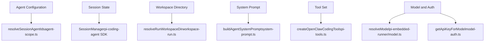
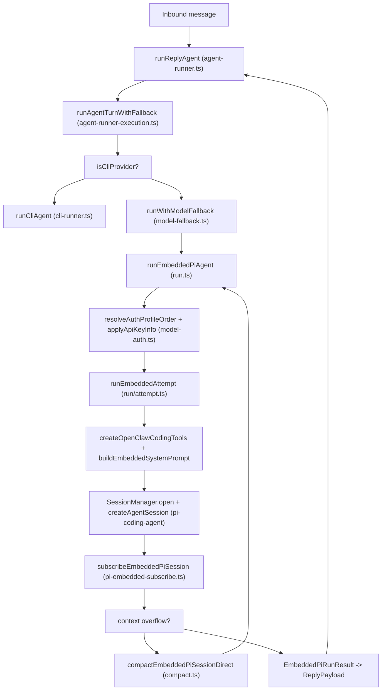

# 智能体 (Agents)

相关源文件

-   [docs/concepts/system-prompt.md](https://github.com/openclaw/openclaw/blob/8873e13f/docs/concepts/system-prompt.md)
-   [docs/concepts/typing-indicators.md](https://github.com/openclaw/openclaw/blob/8873e13f/docs/concepts/typing-indicators.md)
-   [docs/gateway/background-process.md](https://github.com/openclaw/openclaw/blob/8873e13f/docs/gateway/background-process.md)
-   [src/agents/auth-profiles.runtime-snapshot-save.test.ts](https://github.com/openclaw/openclaw/blob/8873e13f/src/agents/auth-profiles.runtime-snapshot-save.test.ts)
-   [src/agents/auth-profiles/oauth.openai-codex-refresh-fallback.test.ts](https://github.com/openclaw/openclaw/blob/8873e13f/src/agents/auth-profiles/oauth.openai-codex-refresh-fallback.test.ts)
-   [src/agents/auth-profiles/oauth.test.ts](https://github.com/openclaw/openclaw/blob/8873e13f/src/agents/auth-profiles/oauth.test.ts)
-   [src/agents/auth-profiles/oauth.ts](https://github.com/openclaw/openclaw/blob/8873e13f/src/agents/auth-profiles/oauth.ts)
-   [src/agents/bash-process-registry.test.ts](https://github.com/openclaw/openclaw/blob/8873e13f/src/agents/bash-process-registry.test.ts)
-   [src/agents/bash-process-registry.ts](https://github.com/openclaw/openclaw/blob/8873e13f/src/agents/bash-process-registry.ts)
-   [src/agents/bash-tools.ts](https://github.com/openclaw/openclaw/blob/8873e13f/src/agents/bash-tools.ts)
-   [src/agents/pi-embedded-helpers.ts](https://github.com/openclaw/openclaw/blob/8873e13f/src/agents/pi-embedded-helpers.ts)
-   [src/agents/pi-embedded-runner.ts](https://github.com/openclaw/openclaw/blob/8873e13f/src/agents/pi-embedded-runner.ts)
-   [src/agents/pi-embedded-runner/compact.ts](https://github.com/openclaw/openclaw/blob/8873e13f/src/agents/pi-embedded-runner/compact.ts)
-   [src/agents/pi-embedded-runner/run.ts](https://github.com/openclaw/openclaw/blob/8873e13f/src/agents/pi-embedded-runner/run.ts)
-   [src/agents/pi-embedded-runner/run/attempt.ts](https://github.com/openclaw/openclaw/blob/8873e13f/src/agents/pi-embedded-runner/run/attempt.ts)
-   [src/agents/pi-embedded-runner/run/params.ts](https://github.com/openclaw/openclaw/blob/8873e13f/src/agents/pi-embedded-runner/run/params.ts)
-   [src/agents/pi-embedded-runner/run/types.ts](https://github.com/openclaw/openclaw/blob/8873e13f/src/agents/pi-embedded-runner/run/types.ts)
-   [src/agents/pi-embedded-runner/system-prompt.ts](https://github.com/openclaw/openclaw/blob/8873e13f/src/agents/pi-embedded-runner/system-prompt.ts)
-   [src/agents/pi-embedded-subscribe.ts](https://github.com/openclaw/openclaw/blob/8873e13f/src/agents/pi-embedded-subscribe.ts)
-   [src/agents/pi-tools.ts](https://github.com/openclaw/openclaw/blob/8873e13f/src/agents/pi-tools.ts)
-   [src/agents/system-prompt.test.ts](https://github.com/openclaw/openclaw/blob/8873e13f/src/agents/system-prompt.test.ts)
-   [src/agents/system-prompt.ts](https://github.com/openclaw/openclaw/blob/8873e13f/src/agents/system-prompt.ts)
-   [src/auto-reply/reply/agent-runner-execution.ts](https://github.com/openclaw/openclaw/blob/8873e13f/src/auto-reply/reply/agent-runner-execution.ts)
-   [src/auto-reply/reply/agent-runner-memory.ts](https://github.com/openclaw/openclaw/blob/8873e13f/src/auto-reply/reply/agent-runner-memory.ts)
-   [src/auto-reply/reply/agent-runner-utils.test.ts](https://github.com/openclaw/openclaw/blob/8873e13f/src/auto-reply/reply/agent-runner-utils.test.ts)
-   [src/auto-reply/reply/agent-runner-utils.ts](https://github.com/openclaw/openclaw/blob/8873e13f/src/auto-reply/reply/agent-runner-utils.ts)
-   [src/auto-reply/reply/agent-runner.ts](https://github.com/openclaw/openclaw/blob/8873e13f/src/auto-reply/reply/agent-runner.ts)
-   [src/auto-reply/reply/followup-runner.ts](https://github.com/openclaw/openclaw/blob/8873e13f/src/auto-reply/reply/followup-runner.ts)
-   [src/auto-reply/reply/test-helpers.ts](https://github.com/openclaw/openclaw/blob/8873e13f/src/auto-reply/reply/test-helpers.ts)
-   [src/auto-reply/reply/typing-mode.ts](https://github.com/openclaw/openclaw/blob/8873e13f/src/auto-reply/reply/typing-mode.ts)
-   [src/browser/control-auth.auto-token.test.ts](https://github.com/openclaw/openclaw/blob/8873e13f/src/browser/control-auth.auto-token.test.ts)
-   [src/browser/control-auth.test.ts](https://github.com/openclaw/openclaw/blob/8873e13f/src/browser/control-auth.test.ts)
-   [src/browser/control-auth.ts](https://github.com/openclaw/openclaw/blob/8873e13f/src/browser/control-auth.ts)
-   [src/gateway/startup-auth.test.ts](https://github.com/openclaw/openclaw/blob/8873e13f/src/gateway/startup-auth.test.ts)
-   [src/gateway/startup-auth.ts](https://github.com/openclaw/openclaw/blob/8873e13f/src/gateway/startup-auth.ts)

本页涵盖了 OpenClaw 中智能体 (Agent) 的定义、多智能体的配置与相互隔离方式、工作区目录的解析，以及嵌入式运行器 (Embedded Runner) 如何协调对话轮次。有关详细的端到端执行追踪，请参见 [智能体执行管道 (Agent Execution Pipeline)](/openclaw/openclaw/3.1-agent-execution-pipeline)。有关系统提示词的构建，请参见 [系统提示词 (System Prompt)](/openclaw/openclaw/3.2-system-prompt-and-context)。有关模型和 API 密钥的配置，请参见 [模型配置与身份验证 (Model Configuration & Authentication)](/openclaw/openclaw/3.3-model-providers-and-authentication)。有关工具系统，请参见 [工具 (Tools)](/openclaw/openclaw/3.4-tools-system)。有关位于智能体之上的命令处理层，请参见 [命令与自动回复 (Commands & Auto-Reply)](/openclaw/openclaw/3.5-commands-and-directives)。

---

## 什么是智能体 (What is an Agent)

智能体是一个具名的 AI 助手配置，负责处理入站消息并生成回复。每个智能体：

-   拥有唯一的 **智能体 ID** —— 它是 `openclaw.json` 中 `agents` 节点下的一个键，其中 `"default"` 是基准回退项。
-   拥有磁盘上的 **工作区目录 (Workspace Directory)**，用于文件的读写。
-   被分配一个主 **AI 模型和提供商 (Provider)**（具有可选的回退方案）。
-   拥有一套 **工具策略 (Tool Policy)**，控制其可以调用的工具以及可以访问的文件系统路径。
-   在每个会话的 JSONL 转录文件中维护 **对话历史**。

智能体与会话 (Session) 是不同的概念。一个智能体可以拥有多个并发会话（每个 Telegram 聊天、每个 Discord 线程、每个 cron 任务等对应一个会话）。智能体定义了配置，而会话持有对话状态。

主要的运行时是 **嵌入式运行器 (Embedded Runner)** —— 一个基于 `@mariozechner/pi-coding-agent` SDK (`createAgentSession`, `SessionManager`) 构建的进程内引擎。对于公开了自身智能体 CLI 的提供商（如 Claude Code, Codex CLI, Gemini CLI 等），存在一个单独的 **CLI 运行器 (CLI Runner)** 路径 (`runCliAgent`)。

---

## 智能体配置 (Agent Configuration)

智能体在 `openclaw.json` 的 `agents.defaults`（基准设置，始终应用）和 `agents.<agentId>`（各智能体覆盖设置）下声明。有关完整的字段参考，请参见 [配置参考 (Configuration Reference)](/openclaw/openclaw/2.3.1-configuration-reference)。

| 配置路径 | 目的 |
| --- | --- |
| `agents.defaults.workspace` | 文件操作的工作区根目录 |
| `agents.defaults.userTimezone` | 注入到系统提示词中的时区字符串 |
| `agents.defaults.timeFormat` | `auto` / `12` / `24` —— 时间显示格式 |
| `agents.defaults.heartbeat.prompt` | 由 cron 服务发送的定期心跳轮询消息 |
| `agents.defaults.bootstrapMaxChars` | 注入的工作区上下文文件的单文件大小限制 (默认: 20,000) |
| `agents.defaults.bootstrapTotalMaxChars` | 所有注入的工作区文件的总大小上限 (默认: 150,000) |

`resolveSessionAgentIds` 函数（位于 `src/agents/agent-scope.ts`）将会话密钥和配置映射为 `{ defaultAgentId, sessionAgentId }`。`sessionAgentId` 驱动所有针对每个会话的决策：工作区解析、工具策略、模型选择和提示词模式。通过检查 `isDefaultAgent`（当 `sessionAgentId === defaultAgentId` 时）来有条件地包含仅适用于主智能体的特性，如心跳。

---

## 会话隔离 (Session Isolation)

每个会话通过多种机制独立隔离：

| 隔离维度 | 机制 |
| --- | --- |
| 对话历史 | 每个会话拥有唯一的 `sessionFile` (`.jsonl` JSONL 转录文件)，通过 `SessionManager.open(sessionFile)` 打开 |
| 文件访问 | 每个智能体拥有通过 `resolveRunWorkspaceDir` 使用智能体 ID 和会话密钥解析的 `workspaceDir` |
| 并发控制 | 每个会话通过 `resolveSessionLane(sessionKey)` 拥有独立的命令车道 —— 同一会话的并发消息将被序列化；通过 `resolveGlobalLane` 提供的全局车道实现共享执行队列 |
| 子智能体 | 通过 `isSubagentSessionKey(sessionKey)` 检测；自动分配 `promptMode: "minimal"` 并过滤引导文件 |

会话密钥是结构化的字符串，编码了智能体路由上下文。它们作为工作区解析、会话文件路径、命令车道路由和工具策略查找的稳定标识符。

---

## 工作区目录 (Workspace Directory)

工作区是智能体执行所有文件操作的根目录。它由 `resolveRunWorkspaceDir`（位于 `src/agents/workspace-run.ts`）使用智能体 ID、会话密钥和配置解析得出。在每次运行尝试开始时，进程的工作目录会 `chdir` 到此路径 [src/agents/pi-embedded-runner/run/attempt.ts454](https://github.com/openclaw/openclaw/blob/8873e13f/src/agents/pi-embedded-runner/run/attempt.ts#L454-L454)。

当 Docker 沙箱模式激活时（见 [沙箱 (Sandboxing)](/openclaw/openclaw/7.2-sandboxing)），工作区分为两个路径：

-   **宿主机路径** (`workspaceDir`) —— 由文件工具 (`read`, `write`, `edit`) 使用，将宿主机文件系统桥接到沙箱中。
-   **容器路径** (`containerWorkspaceDir`) —— Docker 内部运行 `exec` 命令的路径；作为工作目录指南注入到系统提示词中。

工作区上下文文件 (`AGENTS.md`, `SOUL.md`, `MEMORY.md` 等) 在每一轮通过 `resolveBootstrapContextForRun` 读取并注入到系统提示词中。它们的大小受 `bootstrapMaxChars` 和 `bootstrapTotalMaxChars` 限制。有关注入文件的完整列表和截断行为，请参见 [系统提示词 (System Prompt)](/openclaw/openclaw/3.2-system-prompt-and-context)。

---

## 智能体系统架构 (Agent System Architecture)

下图将智能体系统的关键概念映射到其实现的代码实体。

**智能体系统：概念到代码实体映射图**

**来源：** [src/agents/pi-embedded-runner/run/attempt.ts](https://github.com/openclaw/openclaw/blob/8873e13f/src/agents/pi-embedded-runner/run/attempt.ts) [src/agents/system-prompt.ts](https://github.com/openclaw/openclaw/blob/8873e13f/src/agents/system-prompt.ts) [src/agents/pi-embedded-runner/run.ts](https://github.com/openclaw/openclaw/blob/8873e13f/src/agents/pi-embedded-runner/run.ts)

---

## 嵌入式运行器 (The Embedded Runner)

嵌入式运行器组织为分层的调用栈。每一层都有明确的职责：

| 层级 | 函数 | 文件 | 主要关注点 |
| --- | --- | --- | --- |
| 1. 轮次编排 | `runReplyAgent` | `src/auto-reply/reply/agent-runner.ts` | 队列策略、引导/注入、正在输入、后处理 |
| 2. 回退循环包装器 | `runAgentTurnWithFallback` | `src/auto-reply/reply/agent-runner-execution.ts` | 重试循环 (压缩、瞬时错误、角色排序冲突) |
| 3. 模型回退 | `runWithModelFallback` | `src/agents/model-fallback.ts` | 配置的主模型尝试及其回退序列 |
| 4. 认证与重试循环 | `runEmbeddedPiAgent` | `src/agents/pi-embedded-runner/run.ts` | 车道排队、模型解析、认证配置文件迭代 |
| 5. 单次尝试 | `runEmbeddedAttempt` | `src/agents/pi-embedded-runner/run/attempt.ts` | 工作区设置、工具创建、会话初始化、单次尝试 |
| 6. 流式事件处理程序 | `subscribeEmbeddedPiSession` | `src/agents/pi-embedded-subscribe.ts` | 流式事件、块切分、标签剥离、工具回调 |

**`runEmbeddedPiAgent`** 负责：

-   解析模型对象 (`resolveModel`) 并强制执行上下文窗口最小值 (`evaluateContextWindowGuard`)。
-   按优先级顺序解析认证配置文件 (`resolveAuthProfileOrder`)，并在失败时进行轮换 (`advanceAuthProfile`)。
-   运行包含思考级别回退和压缩重试的单次尝试重试循环。

**`runEmbeddedAttempt`** 负责：

-   加载工作区技能 (`loadWorkspaceSkillEntries`, `resolveSkillsPromptForRun`)。
-   加载并限制大小的引导文件 (`resolveBootstrapContextForRun`)。
-   组装工具集 (`createOpenClawCodingTools`, `sanitizeToolsForGoogle`, `splitSdkTools`)。
-   构建系统提示词 (`buildEmbeddedSystemPrompt`)。
-   获取会话写入锁 (`acquireSessionWriteLock`)。
-   打开会话文件并初始化 SDK 会话 (`SessionManager.open`, `createAgentSession`)。
-   订阅流式模型事件 (`subscribeEmbeddedPiSession`)。

**轮次执行调用链 (Turn Execution Call Chain)**

**来源：** [src/auto-reply/reply/agent-runner.ts](https://github.com/openclaw/openclaw/blob/8873e13f/src/auto-reply/reply/agent-runner.ts) [src/auto-reply/reply/agent-runner-execution.ts](https://github.com/openclaw/openclaw/blob/8873e13f/src/auto-reply/reply/agent-runner-execution.ts) [src/agents/pi-embedded-runner/run.ts](https://github.com/openclaw/openclaw/blob/8873e13f/src/agents/pi-embedded-runner/run.ts) [src/agents/pi-embedded-runner/run/attempt.ts](https://github.com/openclaw/openclaw/blob/8873e13f/src/agents/pi-embedded-runner/run/attempt.ts) [src/agents/pi-embedded-subscribe.ts](https://github.com/openclaw/openclaw/blob/8873e13f/src/agents/pi-embedded-subscribe.ts)

---

## 会话与转录管理 (Session & Transcript Management)

对话历史存储在 JSONL 文件中 —— 每行一个 JSON 对象，每个会话一个文件。`SessionManager` 类（来自 `@mariozechner/pi-coding-agent`）负责读取并向这些文件追加消息。

围绕会话执行的关键操作：

| 操作 | 函数 | 文件 |
| --- | --- | --- |
| 解析文件路径 | `resolveSessionTranscriptPath` | `src/config/sessions.ts` |
| 防止并发写入 | `acquireSessionWriteLock` | `src/agents/session-write-lock.ts` |
| 修复孤立的用户消息 | `repairSessionFileIfNeeded` | `src/agents/session-file-repair.ts` |
| 移除未配对的工具条目 | `sanitizeToolUseResultPairing` | `src/agents/session-transcript-repair.ts` |
| 将文件预热进读取缓存 | `prewarmSessionFile` | `src/agents/pi-embedded-runner/session-manager-cache.ts` |
| 强制执行工具名称白名单 | `guardSessionManager` | `src/agents/session-tool-result-guard-wrapper.ts` |

会话写入锁防止了由于指向同一会话的两个并发消息产生交错转录条目的竞态条件。锁的最大持有时间由运行的 `timeoutMs` 通过 `resolveSessionLockMaxHoldFromTimeout` 计算得出。

**来源：** [src/agents/pi-embedded-runner/run/attempt.ts707-741](https://github.com/openclaw/openclaw/blob/8873e13f/src/agents/pi-embedded-runner/run/attempt.ts#L707-L741)

---

## 系统提示词模式 (System Prompt Modes)

[src/agents/system-prompt.ts](https://github.com/openclaw/openclaw/blob/8873e13f/src/agents/system-prompt.ts) 中的 `buildAgentSystemPrompt` 从注入的上下文文件、工具列表、技能、心跳配置、运行时信息和安全护栏中组装系统提示词。`promptMode` 参数控制包含内容的范围：

| 模式 | 触发条件 | 相对 `"full"` 模式省略的内容 |
| --- | --- | --- |
| `"full"` | 所有正常智能体会话 | 无 |
| `"minimal"` | 子智能体会话 (`isSubagentSessionKey` → `true`) | 授权发送者、回复标签、消息传递、记忆回溯、心跳、静默回复、模型别名、OpenClaw 自我更新 |
| `"none"` | 仅基础身份 | 所有章节；仅返回单行身份信息 |

该模式由 `resolvePromptModeForSession(sessionKey)` 自动选择 [src/agents/pi-embedded-runner/run/attempt.ts347-352](https://github.com/openclaw/openclaw/blob/8873e13f/src/agents/pi-embedded-runner/run/attempt.ts#L347-L352)。子智能体会话针对任何 `extraSystemPrompt` 注入使用 `"Subagent Context"` 标题，而非全模式下的 `"Group Chat Context"` 标题。

有关提示词结构和工作区文件注入的完整细节，请参见 [系统提示词 (System Prompt)](/openclaw/openclaw/3.2-system-prompt-and-context)。

**来源：** [src/agents/system-prompt.ts11-17](https://github.com/openclaw/openclaw/blob/8873e13f/src/agents/system-prompt.ts#L11-L17) [src/agents/pi-embedded-runner/run/attempt.ts347-352](https://github.com/openclaw/openclaw/blob/8873e13f/src/agents/pi-embedded-runner/run/attempt.ts#L347-L352)

---

## 上下文压缩 (Context Compaction)

当对话历史接近模型的上下文窗口限制时，运行器会触发自动压缩：

1.  **检测溢出** —— `isContextOverflowError` 或 `isLikelyContextOverflowError`（在 `src/agents/pi-embedded-helpers/errors.ts` 中）识别溢出条件。
2.  **执行压缩** —— [src/agents/pi-embedded-runner/compact.ts](https://github.com/openclaw/openclaw/blob/8873e13f/src/agents/pi-embedded-runner/compact.ts) 中的 `compactEmbeddedPiSessionDirect` 使用相同的配置模型运行摘要通过轮次，冷缩会话历史。
3.  **注入上下文** —— `readPostCompactionContext` 将压缩后的工作区快照作为下一轮的系统事件注入。
4.  **重试** —— `runEmbeddedPiAgent` 的外层循环使用压缩后的历史重试原始提示词。
5.  **失败重置** —— 如果压缩本身失败（重试次数过多），会话将被重置：生成新的 `sessionId`，丢弃转录，并从头开始运行。

压缩计数在 `EmbeddedPiAgentMeta.compactionCount` 中追踪，并通过 `persistRunSessionUsage` 持久化到会话存储中。

**来源：** [src/agents/pi-embedded-runner/compact.ts](https://github.com/openclaw/openclaw/blob/8873e13f/src/agents/pi-embedded-runner/compact.ts) [src/agents/pi-embedded-runner/run.ts](https://github.com/openclaw/openclaw/blob/8873e13f/src/agents/pi-embedded-runner/run.ts) [src/auto-reply/reply/agent-runner.ts676-704](https://github.com/openclaw/openclaw/blob/8873e13f/src/auto-reply/reply/agent-runner.ts#L676-L704)

---

## 关键类型参考 (Key Types Reference)

| 类型 | 文件 | 目的 |
| --- | --- | --- |
| `EmbeddedPiRunResult` | `src/agents/pi-embedded-runner/types.ts` | `runEmbeddedPiAgent` 的返回值 —— 回复负载、元数据、通过消息工具发送的文本 |
| `EmbeddedPiRunMeta` | `src/agents/pi-embedded-runner/types.ts` | 持续时间、智能体元数据、错误种类 (`context_overflow`, `compaction_failure`, `role_ordering`, `retry_limit`)、停止原因 |
| `EmbeddedPiAgentMeta` | `src/agents/pi-embedded-runner/types.ts` | 会话 ID、提供商、模型、Token 使用明细、`lastCallUsage`、压缩计数 |
| `EmbeddedRunAttemptParams` | `src/agents/pi-embedded-runner/run/types.ts` | 传递给 `runEmbeddedAttempt` 的完整参数集，扩展了带有已解析模型/认证的 `RunEmbeddedPiAgentParams` |
| `EmbeddedRunAttemptResult` | `src/agents/pi-embedded-runner/run/types.ts` | 单次尝试的结果：助手文本、工具元数据、使用情况、错误标志、消息工具状态、客户端工具调用 |
| `RunEmbeddedPiAgentParams` | `src/agents/pi-embedded-runner/run/params.ts` | `runEmbeddedPiAgent` 的顶层参数 —— 会话、工作区、配置、提示词、流式回调 |
| `PromptMode` | `src/agents/system-prompt.ts` | `"full"` / `"minimal"` / `"none"` —— 控制系统提示词范围 |
| `CompactEmbeddedPiSessionParams` | `src/agents/pi-embedded-runner/compact.ts` | 压缩操作的参数 —— 会话、模型、提供商、工作区、技能快照 |

**来源：** [src/agents/pi-embedded-runner/types.ts](https://github.com/openclaw/openclaw/blob/8873e13f/src/agents/pi-embedded-runner/types.ts) [src/agents/pi-embedded-runner/run/types.ts](https://github.com/openclaw/openclaw/blob/8873e13f/src/agents/pi-embedded-runner/run/types.ts) [src/agents/pi-embedded-runner/run/params.ts](https://github.com/openclaw/openclaw/blob/8873e13f/src/agents/pi-embedded-runner/run/params.ts) [src/agents/system-prompt.ts11-17](https://github.com/openclaw/openclaw/blob/8873e13f/src/agents/system-prompt.ts#L11-L17) [src/agents/pi-embedded-runner/compact.ts88-125](https://github.com/openclaw/openclaw/blob/8873e13f/src/agents/pi-embedded-runner/compact.ts#L88-L125)
