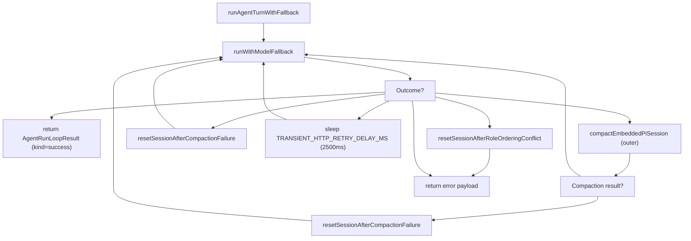
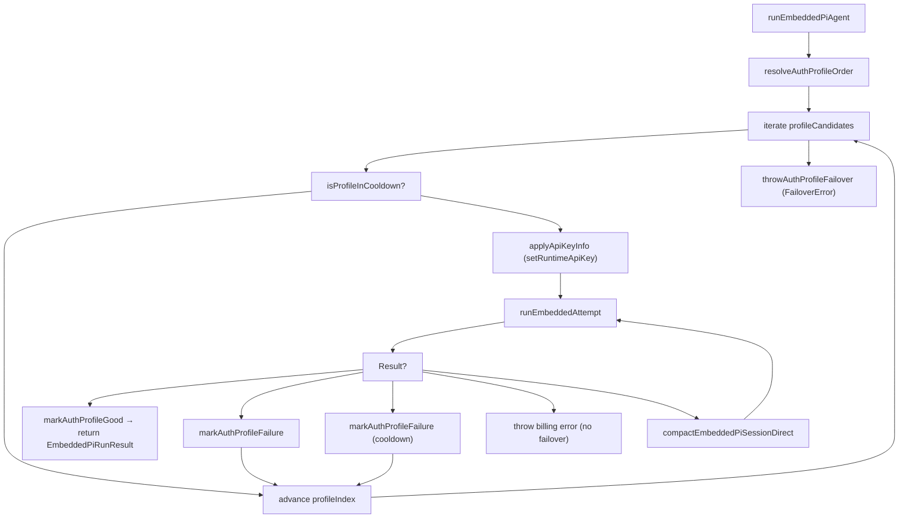
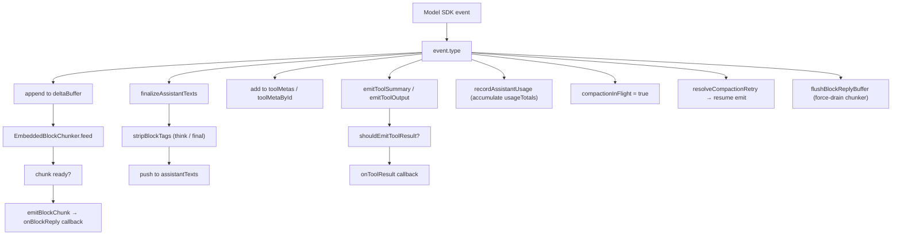
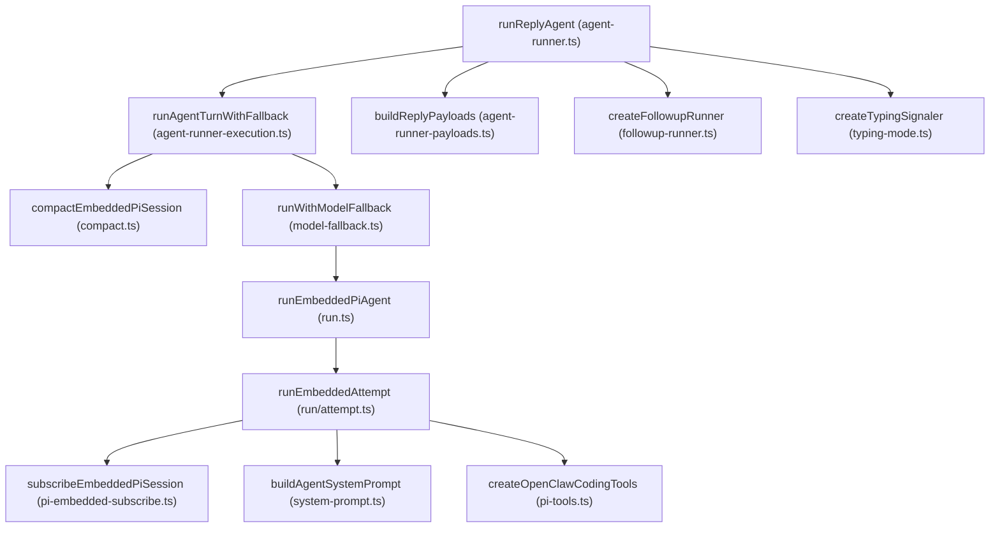

# 智能体执行管道 (Agent Execution Pipeline)

相关源文件

-   [docs/concepts/typing-indicators.md](https://github.com/openclaw/openclaw/blob/8873e13f/docs/concepts/typing-indicators.md)
-   [src/agents/auth-profiles.runtime-snapshot-save.test.ts](https://github.com/openclaw/openclaw/blob/8873e13f/src/agents/auth-profiles.runtime-snapshot-save.test.ts)
-   [src/agents/auth-profiles/oauth.openai-codex-refresh-fallback.test.ts](https://github.com/openclaw/openclaw/blob/8873e13f/src/agents/auth-profiles/oauth.openai-codex-refresh-fallback.test.ts)
-   [src/agents/auth-profiles/oauth.test.ts](https://github.com/openclaw/openclaw/blob/8873e13f/src/agents/auth-profiles/oauth.test.ts)
-   [src/agents/auth-profiles/oauth.ts](https://github.com/openclaw/openclaw/blob/8873e13f/src/agents/auth-profiles/oauth.ts)
-   [src/agents/pi-embedded-runner/compact.ts](https://github.com/openclaw/openclaw/blob/8873e13f/src/agents/pi-embedded-runner/compact.ts)
-   [src/agents/pi-embedded-runner/run.ts](https://github.com/openclaw/openclaw/blob/8873e13f/src/agents/pi-embedded-runner/run.ts)
-   [src/agents/pi-embedded-runner/run/attempt.ts](https://github.com/openclaw/openclaw/blob/8873e13f/src/agents/pi-embedded-runner/run/attempt.ts)
-   [src/agents/pi-embedded-runner/run/params.ts](https://github.com/openclaw/openclaw/blob/8873e13f/src/agents/pi-embedded-runner/run/params.ts)
-   [src/agents/pi-embedded-runner/run/types.ts](https://github.com/openclaw/openclaw/blob/8873e13f/src/agents/pi-embedded-runner/run/types.ts)
-   [src/agents/pi-embedded-runner/system-prompt.ts](https://github.com/openclaw/openclaw/blob/8873e13f/src/agents/pi-embedded-runner/system-prompt.ts)
-   [src/auto-reply/reply/agent-runner-execution.ts](https://github.com/openclaw/openclaw/blob/8873e13f/src/auto-reply/reply/agent-runner-execution.ts)
-   [src/auto-reply/reply/agent-runner-memory.ts](https://github.com/openclaw/openclaw/blob/8873e13f/src/auto-reply/reply/agent-runner-memory.ts)
-   [src/auto-reply/reply/agent-runner-utils.test.ts](https://github.com/openclaw/openclaw/blob/8873e13f/src/auto-reply/reply/agent-runner-utils.test.ts)
-   [src/auto-reply/reply/agent-runner-utils.ts](https://github.com/openclaw/openclaw/blob/8873e13f/src/auto-reply/reply/agent-runner-utils.ts)
-   [src/auto-reply/reply/agent-runner.ts](https://github.com/openclaw/openclaw/blob/8873e13f/src/auto-reply/reply/agent-runner.ts)
-   [src/auto-reply/reply/followup-runner.ts](https://github.com/openclaw/openclaw/blob/8873e13f/src/auto-reply/reply/followup-runner.ts)
-   [src/auto-reply/reply/test-helpers.ts](https://github.com/openclaw/openclaw/blob/8873e13f/src/auto-reply/reply/test-helpers.ts)
-   [src/auto-reply/reply/typing-mode.ts](https://github.com/openclaw/openclaw/blob/8873e13f/src/auto-reply/reply/typing-mode.ts)
-   [src/browser/control-auth.auto-token.test.ts](https://github.com/openclaw/openclaw/blob/8873e13f/src/browser/control-auth.auto-token.test.ts)
-   [src/browser/control-auth.test.ts](https://github.com/openclaw/openclaw/blob/8873e13f/src/browser/control-auth.test.ts)
-   [src/browser/control-auth.ts](https://github.com/openclaw/openclaw/blob/8873e13f/src/browser/control-auth.ts)
-   [src/gateway/startup-auth.test.ts](https://github.com/openclaw/openclaw/blob/8873e13f/src/gateway/startup-auth.test.ts)
-   [src/gateway/startup-auth.ts](https://github.com/openclaw/openclaw/blob/8873e13f/src/gateway/startup-auth.ts)

本页追踪了一条消息的端到端执行过程：从经过处理的消息正文到达智能体层开始，历经模型调用、流式传输，直到回复交付。内容涵盖了函数调用链、车道排队、模型解析、认证配置文件回退、会话初始化、流式部分回复、上下文溢出时的压缩，以及正在输入指示器。

关于在调用智能体*之前*如何检测并分发命令和指令，请参见 [命令与自动回复 (Commands & Auto-Reply)](/openclaw/openclaw/3.5-commands-and-directives)。关于每一轮构建的系统提示词内容，请参见 [系统提示词 (System Prompt)](/openclaw/openclaw/3.2-system-prompt-and-context)。关于工具如何组装及强制执行策略，请参见 [工具 (Tools)](/openclaw/openclaw/3.4-tools-system)。关于会话存储和生命周期管理，请参见 [会话管理 (Session Management)](/openclaw/openclaw/2.4-session-management)。

---

## 管道层级 (Pipeline Layers)

单次智能体轮次在到达模型 API 之前会经过四个具名的函数层。

| 层级 | 函数 | 文件 | 主要关注点 |
| --- | --- | --- | --- |
| 1 | `runReplyAgent` | `src/auto-reply/reply/agent-runner.ts` | 队列策略、引导/注入、正在输入指示、后处理 |
| 2 | `runAgentTurnWithFallback` | `src/auto-reply/reply/agent-runner-execution.ts` | 重试循环 (压缩、瞬时错误、角色排序冲突) |
| 3 | `runEmbeddedPiAgent` | `src/agents/pi-embedded-runner/run.ts` | 车道排队、模型解析、认证配置文件迭代 |
| 4 | `runEmbeddedAttempt` | `src/agents/pi-embedded-runner/run/attempt.ts` | 工作区设置、工具创建、会话初始化、单次尝试执行 |
| — | `subscribeEmbeddedPiSession` | `src/agents/pi-embedded-subscribe.ts` | 流式事件、块切分、标签剥离、工具回调 |

**来源：** [src/auto-reply/reply/agent-runner.ts92-122](https://github.com/openclaw/openclaw/blob/8873e13f/src/auto-reply/reply/agent-runner.ts#L92-L122) [src/auto-reply/reply/agent-runner-execution.ts72-99](https://github.com/openclaw/openclaw/blob/8873e13f/src/auto-reply/reply/agent-runner-execution.ts#L72-L99) [src/agents/pi-embedded-runner/run.ts192-212](https://github.com/openclaw/openclaw/blob/8873e13f/src/agents/pi-embedded-runner/run.ts#L192-L212) [src/agents/pi-embedded-runner/run/attempt.ts427-440](https://github.com/openclaw/openclaw/blob/8873e13f/src/agents/pi-embedded-runner/run/attempt.ts#L427-L440) [src/agents/pi-embedded-subscribe.ts34-82](https://github.com/openclaw/openclaw/blob/8873e13f/src/agents/pi-embedded-subscribe.ts#L34-L82)

---

**管道调用链与主要数据流图**

> **[Mermaid sequence]**
> *(图表结构无法解析)*

**来源：** [src/auto-reply/reply/agent-runner.ts92-728](https://github.com/openclaw/openclaw/blob/8873e13f/src/auto-reply/reply/agent-runner.ts#L92-L728) [src/auto-reply/reply/agent-runner-execution.ts72-380](https://github.com/openclaw/openclaw/blob/8873e13f/src/auto-reply/reply/agent-runner-execution.ts#L72-L380) [src/agents/pi-embedded-runner/run.ts192](https://github.com/openclaw/openclaw/blob/8873e13f/src/agents/pi-embedded-runner/run.ts#L192-LNaN) [src/agents/pi-embedded-runner/run/attempt.ts427](https://github.com/openclaw/openclaw/blob/8873e13f/src/agents/pi-embedded-runner/run/attempt.ts#L427-LNaN) [src/agents/pi-embedded-subscribe.ts34](https://github.com/openclaw/openclaw/blob/8873e13f/src/agents/pi-embedded-subscribe.ts#L34-LNaN)

---

## 第一层：runReplyAgent

`runReplyAgent` [src/auto-reply/reply/agent-runner.ts92-728](https://github.com/openclaw/openclaw/blob/8873e13f/src/auto-reply/reply/agent-runner.ts#L92-L728) 是智能体路径上的第一个函数。它接收：

-   `commandBody` —— 经过处理的消息文本（剥离指令后）
-   `followupRun` —— 包含 `run` 对象（`sessionId`, `sessionFile`, `provider`, `model`, `config`, `prompt` 等）的 `FollowupRun` 结构
-   `sessionCtx` —— 包含发送者/通道元数据的 `TemplateContext`
-   `typing` —— 用于管理正在输入指示器生命周期的 `TypingController`
-   队列、会话存储以及详细级别参数

### 队列与引导检查 (Queue and Steer Checks)

在调用模型之前，会运行两项提前退出检查：

**引导检查 (Steer check)** —— 如果 `shouldSteer && isStreaming` 为真，则调用 `queueEmbeddedPiMessage` 将新消息注入到同一会话当前活跃的流式运行中。如果注入成功，函数将提前返回，不再启动新轮次。

**队列策略 (Queue policy)** —— `resolveActiveRunQueueAction` [src/auto-reply/reply/queue-policy.ts](https://github.com/openclaw/openclaw/blob/8873e13f/src/auto-reply/reply/queue-policy.ts) 返回以下操作之一：

-   `"drop"` —— 静默丢弃消息
-   `"enqueue-followup"` —— 通过 `enqueueFollowupRun` 将运行保存到后续队列中
-   `"proceed"` —— 继续进行模型调用

### 后处理 (Post-Processing)

当 `runAgentTurnWithFallback` 完成后，`runReplyAgent` 执行以下操作：

| 操作 | 函数 |
| --- | --- |
| 回退状态追踪 | `resolveFallbackTransition` → 更新会话存储中的 `fallbackNotice*` 字段 |
| 压缩计数 | `incrementRunCompactionCount` (如果执行了压缩) |
| 使用量持久化 | `persistRunSessionUsage` |
| 诊断事件 | `emitDiagnosticEvent` (`type: "model.usage"`) |
| 响应使用量行 | `formatResponseUsageLine` (如果启用了 `/usage` 则追加) |
| 详细模式通知 | 在回复负载前置新会话、回退和压缩事件的通知 |
| 未预定提醒注释 | 如果智能体承诺了提醒但未创建 cron 任务，则调用 `appendUnscheduledReminderNote` |

**来源：** [src/auto-reply/reply/agent-runner.ts154-248](https://github.com/openclaw/openclaw/blob/8873e13f/src/auto-reply/reply/agent-runner.ts#L154-L248) [src/auto-reply/reply/agent-runner.ts362-716](https://github.com/openclaw/openclaw/blob/8873e13f/src/auto-reply/reply/agent-runner.ts#L362-L716) [src/auto-reply/reply/session-run-accounting.ts](https://github.com/openclaw/openclaw/blob/8873e13f/src/auto-reply/reply/session-run-accounting.ts)

---

## 第二层：runAgentTurnWithFallback

`runAgentTurnWithFallback` [src/auto-reply/reply/agent-runner-execution.ts72-380](https://github.com/openclaw/openclaw/blob/8873e13f/src/auto-reply/reply/agent-runner-execution.ts#L72-L380) 将模型调用包裹在一个处理多种失败模式的重试循环中。

**runAgentTurnWithFallback 中的重试循环图**


使用的关键失败分类：

| 分类器 | 来源 | 操作 |
| --- | --- | --- |
| `isContextOverflowError` | `pi-embedded-helpers.ts` | 触发压缩后重试 |
| `isLikelyContextOverflowError` | `pi-embedded-helpers.ts` | 同上 |
| `isCompactionFailureError` | `pi-embedded-helpers.ts` | 重置会话 ID 后重试 |
| `isTransientHttpError` | `pi-embedded-helpers.ts` | 等待 2,500 毫秒后重试一次 |
| 角色排序冲突 (Role ordering conflict) | Google/Gemini 特有 | 重置会话 + 删除转录文件 |

`resetSessionAfterCompactionFailure` 通过 `generateSecureUuid` 生成新的 `sessionId` 和 `sessionFile`，更新会话存储，并将 `followupRun` 指向新文件。

`resetSessionAfterRoleOrderingConflict` 执行相同操作，但还会删除旧的转录文件。

该层还管理用于流式部分回复的 `blockReplyPipeline` (`createBlockReplyPipeline`)。`createBlockReplyDeliveryHandler` 在轮次进行期间将刷新后的块直接路由到通道。

**来源：** [src/auto-reply/reply/agent-runner-execution.ts100-380](https://github.com/openclaw/openclaw/blob/8873e13f/src/auto-reply/reply/agent-runner-execution.ts#L100-L380) [src/agents/pi-embedded-helpers.ts](https://github.com/openclaw/openclaw/blob/8873e13f/src/agents/pi-embedded-helpers.ts) [src/auto-reply/reply/block-reply-pipeline.ts](https://github.com/openclaw/openclaw/blob/8873e13f/src/auto-reply/reply/block-reply-pipeline.ts)

---

## 第三层：runEmbeddedPiAgent

`runEmbeddedPiAgent` [src/agents/pi-embedded-runner/run.ts192](https://github.com/openclaw/openclaw/blob/8873e13f/src/agents/pi-embedded-runner/run.ts#L192-LNaN) 负责并发控制、模型解析和认证配置文件迭代。

### 车道排队 (Lane Queuing)

每次调用都通过两个车道进行序列化：

```
enqueueSession(() =>
  enqueueGlobal(async () => { ... })
)
```
-   **会话车道 (Session lane)** —— 以 `sessionKey`（或 `sessionId`）为键，通过 `resolveSessionLane` 序列化。防止对同一会话文件的并发写入。
-   **全局车道 (Global lane)** —— 以配置的 `lane` 名称（或默认名称）为键，通过 `resolveGlobalLane` 序列化。限制所有会话中并行的模型调用总数。

两者都使用 `src/process/command-queue.ts` 中的 `enqueueCommandInLane`。

### 模型解析 (Model Resolution)

`resolveModel(provider, modelId, agentDir, config)` [src/agents/pi-embedded-runner/model.ts](https://github.com/openclaw/openclaw/blob/8873e13f/src/agents/pi-embedded-runner/model.ts) 从 `openclaw-models.json` 注册表中查找模型定义（API 类型、上下文窗口、输入模态、费用）。如果未找到模型，则抛出 `FailoverError`，原因为 `"model_not_found"`。

随后 `evaluateContextWindowGuard` 检查解析后的上下文窗口：

-   低于 `CONTEXT_WINDOW_WARN_BELOW_TOKENS` → 记录警告
-   低于 `CONTEXT_WINDOW_HARD_MIN_TOKENS` → 抛出 `FailoverError` 并阻塞运行

### 认证配置文件迭代 (Auth Profile Iteration)

**runEmbeddedPiAgent 中的认证配置文件迭代与故障转移图**


`authStore`（一个 `AuthProfileStore`）从 `agentDir` 下的 `auth-profiles.json` 加载。`resolveAuthProfileOrder` 按优先级对配置文件进行排序。锁定后的 `authProfileId`（由用户通过 `/model ... @profile` 设置）会跳过迭代，仅使用该配置文件。

当某个配置文件因临时原因（如速率限制）失败时，`markAuthProfileFailure` 会设置冷却时间戳。`isProfileInCooldown` 会在后续迭代中跳过该配置文件。

**来源：** [src/agents/pi-embedded-runner/run.ts192-480](https://github.com/openclaw/openclaw/blob/8873e13f/src/agents/pi-embedded-runner/run.ts#L192-L480) [src/agents/pi-embedded-runner/run.ts354-480](https://github.com/openclaw/openclaw/blob/8873e13f/src/agents/pi-embedded-runner/run.ts#L354-L480) [src/agents/pi-embedded-runner/lanes.ts](https://github.com/openclaw/openclaw/blob/8873e13f/src/agents/pi-embedded-runner/lanes.ts) [src/agents/auth-profiles.ts](https://github.com/openclaw/openclaw/blob/8873e13f/src/agents/auth-profiles.ts)

---

## 第四层：runEmbeddedAttempt

`runEmbeddedAttempt` [src/agents/pi-embedded-runner/run/attempt.ts427](https://github.com/openclaw/openclaw/blob/8873e13f/src/agents/pi-embedded-runner/run/attempt.ts#L427-LNaN) 执行单次模型调用尝试，并设置完整的执行环境。

### 执行环境设置 (Execution Environment Setup)

| 步骤 | 关键函数 / 类 | 目的 |
| --- | --- | --- |
| 工作区 | `resolveUserPath`, `fs.mkdir` | 解析并创建工作区目录 |
| 沙箱 | `resolveSandboxContext` | 检测 Docker 沙箱；确定有效工作区 |
| 技能 | `loadWorkspaceSkillEntries`, `resolveSkillsPromptForRun` | 从工作区加载技能定义 |
| 引导文件 | `resolveBootstrapContextForRun` | 加载 `AGENTS.md`, `SOUL.md`, `MEMORY.md` 等作为 `EmbeddedContextFile[]` |
| 智能体 ID | `resolveSessionAgentIds` | 确定 `sessionAgentId` 和 `defaultAgentId` |
| 工具 | `createOpenClawCodingTools` | 为该智能体和会话构建完整工具集 |
| Google 净化 | `sanitizeToolsForGoogle` | 调整工具模式以兼容 Gemini API |
| 系统提示词 | `buildEmbeddedSystemPrompt` | 委派给 `buildAgentSystemPrompt`，带有所有已解析参数 |
| 会话锁 | `acquireSessionWriteLock` | 防止对 JSONL 转录文件的并发写入 |
| 会话修复 | `repairSessionFileIfNeeded` | 修复损坏或不完整的会话转录 |
| 会话打开 | `SessionManager.open` + `guardSessionManager` | 打开会话文件，带有工具使用配对护栏 |
| 会话初始化 | `prepareSessionManagerForRun` | 初始化 cwd，必要时注入会话头信息 |
| 扩展 | `buildEmbeddedExtensionFactories` | 注册压缩和上下文修剪扩展 |
| 工具拆分 | `splitSdkTools` | 将工具划分为 `builtInTools` 和 `customTools` |
| 智能体会话 | `createAgentSession` (pi-coding-agent SDK) | 使用模型、工具和会话管理器创建 `AgentSession` |
| 提示词注入 | `applySystemPromptOverrideToSession` | 将计算出的系统提示词写入会话 |
| 工具结果护栏 | `installToolResultContextGuard` | 防范会导致上下文溢出的工具结果 |

**来源：** [src/agents/pi-embedded-runner/run/attempt.ts427-820](https://github.com/openclaw/openclaw/blob/8873e13f/src/agents/pi-embedded-runner/run/attempt.ts#L427-L820) [src/agents/pi-embedded-runner/system-prompt.ts](https://github.com/openclaw/openclaw/blob/8873e13f/src/agents/pi-embedded-runner/system-prompt.ts) [src/agents/pi-tools.ts](https://github.com/openclaw/openclaw/blob/8873e13f/src/agents/pi-tools.ts)

### 系统提示词构建 (System Prompt Construction)

`buildEmbeddedSystemPrompt` [src/agents/pi-embedded-runner/system-prompt.ts](https://github.com/openclaw/openclaw/blob/8873e13f/src/agents/pi-embedded-runner/system-prompt.ts) 调用 `buildAgentSystemPrompt` [src/agents/system-prompt.ts189-664](https://github.com/openclaw/openclaw/blob/8873e13f/src/agents/system-prompt.ts#L189-L664)，包含所有解析参数，如工具、运行时信息、上下文文件、技能提示词、时区、沙箱信息和反应指南。

`promptMode` 由 `resolvePromptModeForSession` 解析 [src/agents/pi-embedded-runner/run/attempt.ts347-352](https://github.com/openclaw/openclaw/blob/8873e13f/src/agents/pi-embedded-runner/run/attempt.ts#L347-L352)：带有子智能体密钥的会话使用 `"minimal"` 模式；其他所有会话使用 `"full"` 模式。极简模式省略了 `## Authorized Senders`, `## Heartbeats`, `## Silent Replies` 和 `## Messaging` 等章节。

---

## 流式传输：subscribeEmbeddedPiSession

`subscribeEmbeddedPiSession` [src/agents/pi-embedded-subscribe.ts34-640](https://github.com/openclaw/openclaw/blob/8873e13f/src/agents/pi-embedded-subscribe.ts#L34-L640) 在智能体轮次开始前调用。它返回一个事件处理程序对象，pi-coding-agent SDK 会在模型流式输出时调用该对象。

### 内部状态 (Internal State)

| 字段 | 类型 | 目的 |
| --- | --- | --- |
| `assistantTexts` | `string[]` | 收集的助手文本段 → 最终的 `ReplyPayload` |
| `toolMetas` | 数组 | 用于详细模式/工具结果展示的工具调用元数据 |
| `deltaBuffer` | `string` | 正在进行的文本增量累积 |
| `blockBuffer` | `string` | 为块回复分段缓存的文本 |
| `blockState` | `{thinking, final, inlineCode}` | 有状态的标签剥离上下文（跨分段边界） |
| `messagingToolSentTexts` | `string[]` | 已通过 `message` 工具发送的文本（去重） |
| `compactionInFlight` | `boolean` | 压缩期间暂停块发射 |
| `pendingCompactionRetry` | `number` | 待处理压缩计数，待全部完成后解决 |

### 标签剥离 (Tag Stripping)

`stripBlockTags` [src/agents/pi-embedded-subscribe.ts355-443](https://github.com/openclaw/openclaw/blob/8873e13f/src/agents/pi-embedded-subscribe.ts#L355-L443) 处理跨分段边界的两组标签：

-   **`<think>` / `<thinking>` / `<thought>` / `<antthinking>`** —— 内部内容会从用户可见的回复中剥离。通过 `blockState.thinking` 跨分段追踪开启/闭合状态。
-   **`<final>`** —— 当 `enforceFinalTag` 为真（具有推理标签的提供商）时，仅发射 `<final>` 内部的内容；丢弃所有其他文本。

代码跨度检测 (`buildCodeSpanIndex`) 防止在反引号代码跨度内匹配标签。

### 块回复流 (Block Reply Streaming)

当提供 `onBlockReply` 回调时，文本将增量交付。`EmbeddedBlockChunker` [src/agents/pi-embedded-block-chunker.ts](https://github.com/openclaw/openclaw/blob/8873e13f/src/agents/pi-embedded-block-chunker.ts) 根据 `blockReplyChunking` 配置（`minChars`, `maxChars`, `breakPreference`）将流切分为适合交付的大小。

`emitBlockChunk` [src/agents/pi-embedded-subscribe.ts465-521](https://github.com/openclaw/openclaw/blob/8873e13f/src/agents/pi-embedded-subscribe.ts#L465-L521) 为每个块调用。它：

1.  通过 `stripBlockTags` 剥离 `<think>` / `<final>` 标签。
2.  通过 `stripDowngradedToolCallText` 剥离降级的工具调用文本。
3.  对照 `messagingToolSentTextsNormalized` 检查净化后的文本，以抑制已通过 `message` 工具发送的重复内容。
4.  调用 `onBlockReply`，携带 `{text, mediaUrls, audioAsVoice, replyToId, replyToCurrent}`。

**subscribeEmbeddedPiSession 内部事件流图**


### 推理流 (Reasoning Stream)

当 `reasoningMode === "stream"` 时，思考块内容会被转发到 `emitReasoningStream` [src/agents/pi-embedded-subscribe.ts543-573](https://github.com/openclaw/openclaw/blob/8873e13f/src/agents/pi-embedded-subscribe.ts#L543-L573)，该函数：

-   计算与先前发送推理文本的增量。
-   调用 `emitAgentEvent`，携带 `stream: "thinking"`（广播给 WebSocket 客户端）。
-   调用 `onReasoningStream` 回调。

**来源：** [src/agents/pi-embedded-subscribe.ts34-640](https://github.com/openclaw/openclaw/blob/8873e13f/src/agents/pi-embedded-subscribe.ts#L34-L640) [src/agents/pi-embedded-block-chunker.ts](https://github.com/openclaw/openclaw/blob/8873e13f/src/agents/pi-embedded-block-chunker.ts)

---

## 上下文溢出时的压缩

当模型报告上下文溢出时，压缩功能会冷缩对话历史以释放上下文空间。它可以在两个层级触发：

| 触发点 | 时机 | 调用的函数 |
| --- | --- | --- |
| `runEmbeddedPiAgent` 内部 | 在执行尝试期间检测到溢出 | `compactEmbeddedPiSessionDirect` |
| `runAgentTurnWithFallback` 内部 | 溢出从 `runEmbeddedPiAgent` 向外传播 | `compactEmbeddedPiSession` |

两者最终都执行 [src/agents/pi-embedded-runner/compact.ts](https://github.com/openclaw/openclaw/blob/8873e13f/src/agents/pi-embedded-runner/compact.ts) 中的逻辑，该逻辑：

1.  通过 `SessionManager.open` 打开会话转录。
2.  构建压缩专用的系统提示词和工具集。
3.  运行专门的智能体轮次，将转录总结为压缩形式。
4.  用摘要替换原始转录条目。
5.  返回包含新消息计数和 Token 估算的 `EmbeddedPiCompactResult`。

压缩后，被中断的运行将重试。`incrementRunCompactionCount` [src/auto-reply/reply/session-run-accounting.ts](https://github.com/openclaw/openclaw/blob/8873e13f/src/auto-reply/reply/session-run-accounting.ts) 更新会话存储，以便 `/status` 报告压缩次数。压缩后的工作区上下文快照 (`readPostCompactionContext`) 会作为下一轮的系统事件注入。

使用的检测辅助函数：来自 [src/agents/pi-embedded-helpers.ts](https://github.com/openclaw/openclaw/blob/8873e13f/src/agents/pi-embedded-helpers.ts) 的 `isContextOverflowError`, `isLikelyContextOverflowError`, `isCompactionFailureError`。

**来源：** [src/agents/pi-embedded-runner/compact.ts88](https://github.com/openclaw/openclaw/blob/8873e13f/src/agents/pi-embedded-runner/compact.ts#L88-LNaN) [src/agents/pi-embedded-runner/run.ts53-57](https://github.com/openclaw/openclaw/blob/8873e13f/src/agents/pi-embedded-runner/run.ts#L53-L57) [src/auto-reply/reply/agent-runner-execution.ts90-130](https://github.com/openclaw/openclaw/blob/8873e13f/src/auto-reply/reply/agent-runner-execution.ts#L90-L130) [src/auto-reply/reply/agent-runner.ts676-703](https://github.com/openclaw/openclaw/blob/8873e13f/src/auto-reply/reply/agent-runner.ts#L676-L703)

---

## 模型回退 (Model Fallback)

`runWithModelFallback` [src/agents/model-fallback.ts](https://github.com/openclaw/openclaw/blob/8873e13f/src/agents/model-fallback.ts) 尝试配置的主模型。在遇到 `FailoverError` 时，它会按顺序尝试配置的回退模型。

`FailoverError` 携带 `reason` 字段：

| 原因 | 含义 |
| --- | --- |
| `"rate_limit"` | 受到速率限制；尝试下一个配置文件或模型 |
| `"auth"` | 认证失败；尝试下一个配置文件 |
| `"context_overflow"` | 超过上下文窗口 |
| `"model_not_found"` | 注册表中不存在该模型 |
| `"billing"` | 账单问题；不进行故障转移 |
| `"unknown"` | 通用失败 |

当发生回退切换时，`runReplyAgent` 通过 `fallbackNoticeSelectedModel`, `fallbackNoticeActiveModel`, `fallbackNoticeReason` 将其记录在会话存储中，并发出 `phase: "fallback"` 智能体事件。如果开启了详细模式，通知会前置在回复负载中。

当主模型在后续轮次中重新可用时，系统会检测到 `fallbackCleared` 并发出 `phase: "fallback_cleared"` 事件。

**来源：** [src/agents/model-fallback.ts](https://github.com/openclaw/openclaw/blob/8873e13f/src/agents/model-fallback.ts) [src/agents/pi-embedded-runner/run.ts232-240](https://github.com/openclaw/openclaw/blob/8873e13f/src/agents/pi-embedded-runner/run.ts#L232-L240) [src/auto-reply/reply/agent-runner.ts444-674](https://github.com/openclaw/openclaw/blob/8873e13f/src/auto-reply/reply/agent-runner.ts#L444-L674) [src/auto-reply/fallback-state.ts](https://github.com/openclaw/openclaw/blob/8873e13f/src/auto-reply/fallback-state.ts)

---

## 正在输入指示器 (Typing Indicators)

正在输入指示器由传递给 `runReplyAgent` 的 `TypingController` 管理。工厂函数 `createTypingSignaler` [src/auto-reply/reply/typing-mode.ts](https://github.com/openclaw/openclaw/blob/8873e13f/src/auto-reply/reply/typing-mode.ts) 对其进行包裹，并基于 `typingMode` 配置控制信号发送时机。

| 信号方法 | 调用时机 |
| --- | --- |
| `signalRunStart` | 队列检查通过后，模型调用前 |
| `signalTextDelta(text)` | 流式传输期间，每个部分文本块 |
| `markRunComplete` | `runReplyAgent` 的 `finally` 块中 |
| `markDispatchIdle` | 同样在 `finally` 块中（卡住的保持活跃循环的保险措施） |

心跳轮次 (`isHeartbeat === true`) 跳过正在输入指示器。`TypingMode` 的值（`"off"`, `"pre-reply"`, `"streaming"` 等）决定哪些信号被抑制。

**来源：** [src/auto-reply/reply/agent-runner.ts154-159](https://github.com/openclaw/openclaw/blob/8873e13f/src/auto-reply/reply/agent-runner.ts#L154-L159) [src/auto-reply/reply/typing-mode.ts](https://github.com/openclaw/openclaw/blob/8873e13f/src/auto-reply/reply/typing-mode.ts) [src/auto-reply/reply/agent-runner.ts717-727](https://github.com/openclaw/openclaw/blob/8873e13f/src/auto-reply/reply/agent-runner.ts#L717-L727)

---

## 回复负载组装 (Reply Payload Assembly)

在模型轮次完成后，`buildReplyPayloads` [src/auto-reply/reply/agent-runner-payloads.ts](https://github.com/openclaw/openclaw/blob/8873e13f/src/auto-reply/reply/agent-runner-payloads.ts) 从收集的 `assistantTexts` 和工具相关负载组装最终的 `ReplyPayload[]`。

应用的的关键转换：

| 转换 | 细节 |
| --- | --- |
| 静默回复过滤 | 全文为 `SILENT_REPLY_TOKEN` 的负载会被丢弃 |
| `HEARTBEAT_OK` 剥离 | `stripHeartbeatToken` 从非心跳回复中移除该令牌 |
| 消息工具去重 | 过滤掉匹配 `messagingToolSentTexts` 的文本 |
| 回复至线程 | `applyReplyToMode` 根据通道配置应用 `[[reply_to_current]]` 或 `[[reply_to:<id>]]` |
| 媒体 URL 附加 | 将工具结果中的截图和图片附加到负载 |
| 块流去重 | 排除已通过 `blockReplyPipeline` 发送的块 |

随后 `finalizeWithFollowup` 检查是否存在排队的后续运行，如果存在，则通过 `createFollowupRunner` [src/auto-reply/reply/followup-runner.ts](https://github.com/openclaw/openclaw/blob/8873e13f/src/auto-reply/reply/followup-runner.ts) 发送。

**来源：** [src/auto-reply/reply/agent-runner-payloads.ts](https://github.com/openclaw/openclaw/blob/8873e13f/src/auto-reply/reply/agent-runner-payloads.ts) [src/auto-reply/reply/agent-runner.ts506-534](https://github.com/openclaw/openclaw/blob/8873e13f/src/auto-reply/reply/agent-runner.ts#L506-L534) [src/auto-reply/reply/followup-runner.ts35-45](https://github.com/openclaw/openclaw/blob/8873e13f/src/auto-reply/reply/followup-runner.ts#L35-L45)

---

## 代码实体参考 (Code Entity Reference)

**关键函数及其文件位置图**


**来源：** [src/auto-reply/reply/agent-runner.ts](https://github.com/openclaw/openclaw/blob/8873e13f/src/auto-reply/reply/agent-runner.ts) [src/auto-reply/reply/agent-runner-execution.ts](https://github.com/openclaw/openclaw/blob/8873e13f/src/auto-reply/reply/agent-runner-execution.ts) [src/auto-reply/reply/agent-runner-payloads.ts](https://github.com/openclaw/openclaw/blob/8873e13f/src/auto-reply/reply/agent-runner-payloads.ts) [src/auto-reply/reply/followup-runner.ts](https://github.com/openclaw/openclaw/blob/8873e13f/src/auto-reply/reply/followup-runner.ts) [src/auto-reply/reply/typing-mode.ts](https://github.com/openclaw/openclaw/blob/8873e13f/src/auto-reply/reply/typing-mode.ts) [src/agents/pi-embedded-runner/run.ts](https://github.com/openclaw/openclaw/blob/8873e13f/src/agents/pi-embedded-runner/run.ts) [src/agents/pi-embedded-runner/run/attempt.ts](https://github.com/openclaw/openclaw/blob/8873e13f/src/agents/pi-embedded-runner/run/attempt.ts) [src/agents/pi-embedded-runner/compact.ts](https://github.com/openclaw/openclaw/blob/8873e13f/src/agents/pi-embedded-runner/compact.ts) [src/agents/pi-embedded-subscribe.ts](https://github.com/openclaw/openclaw/blob/8873e13f/src/agents/pi-embedded-subscribe.ts) [src/agents/system-prompt.ts](https://github.com/openclaw/openclaw/blob/8873e13f/src/agents/system-prompt.ts) [src/agents/pi-tools.ts](https://github.com/openclaw/openclaw/blob/8873e13f/src/agents/pi-tools.ts) [src/agents/model-fallback.ts](https://github.com/openclaw/openclaw/blob/8873e13f/src/agents/model-fallback.ts)
