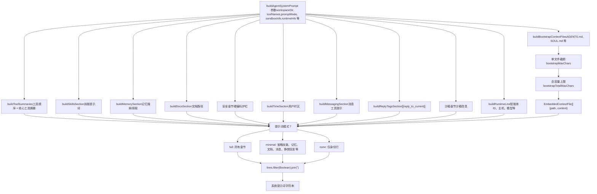
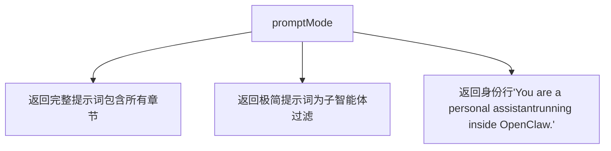
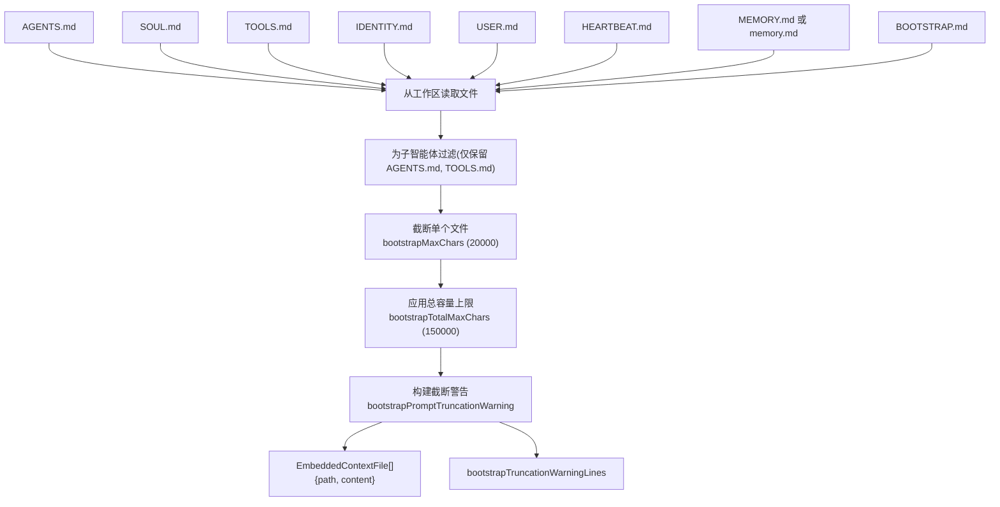
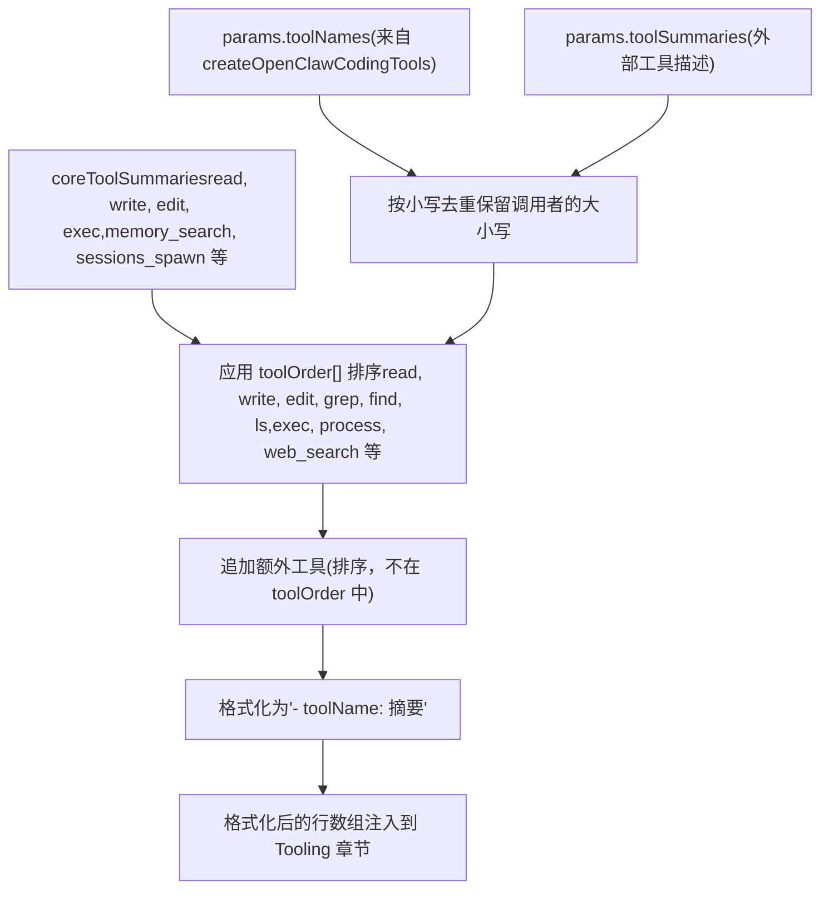

# 系统提示词与上下文 (System Prompt & Context)

相关源文件

-   [docs/concepts/system-prompt.md](https://github.com/openclaw/openclaw/blob/8873e13f/docs/concepts/system-prompt.md)
-   [docs/gateway/background-process.md](https://github.com/openclaw/openclaw/blob/8873e13f/docs/gateway/background-process.md)
-   [src/agents/bash-process-registry.test.ts](https://github.com/openclaw/openclaw/blob/8873e13f/src/agents/bash-process-registry.test.ts)
-   [src/agents/bash-process-registry.ts](https://github.com/openclaw/openclaw/blob/8873e13f/src/agents/bash-process-registry.ts)
-   [src/agents/bash-tools.ts](https://github.com/openclaw/openclaw/blob/8873e13f/src/agents/bash-tools.ts)
-   [src/agents/pi-embedded-helpers.ts](https://github.com/openclaw/openclaw/blob/8873e13f/src/agents/pi-embedded-helpers.ts)
-   [src/agents/pi-embedded-runner.ts](https://github.com/openclaw/openclaw/blob/8873e13f/src/agents/pi-embedded-runner.ts)
-   [src/agents/pi-embedded-subscribe.ts](https://github.com/openclaw/openclaw/blob/8873e13f/src/agents/pi-embedded-subscribe.ts)
-   [src/agents/pi-tools.ts](https://github.com/openclaw/openclaw/blob/8873e13f/src/agents/pi-tools.ts)
-   [src/agents/system-prompt.test.ts](https://github.com/openclaw/openclaw/blob/8873e13f/src/agents/system-prompt.test.ts)
-   [src/agents/system-prompt.ts](https://github.com/openclaw/openclaw/blob/8873e13f/src/agents/system-prompt.ts)

本页记录了 OpenClaw 如何为每次智能体运行组装系统提示词，包括硬编码章节、引导上下文注入和运行时元数据。系统提示词是按轮次动态构建的，并在模型调用前注入到智能体的上下文窗口中。

有关智能体执行流程和工具配置，请参见 [智能体执行管道 (Agent Execution Pipeline)](/openclaw/openclaw/3.1-agent-execution-pipeline)。有关引导文件及其限制的配置，请参见 [配置参考 (Configuration Reference)](/openclaw/openclaw/2.3.1-configuration-reference)。

---

## 概览 (Overview)

OpenClaw 完全拥有系统提示词——它不使用默认的 pi-coding-agent 提示词。提示词由 [`buildAgentSystemPrompt()`](https://github.com/openclaw/openclaw/blob/8873e13f/src/agents/system-prompt.ts#L189) 函数组装，包含：

-   **硬编码章节**：工具、安全、OpenClaw CLI、工作区、运行时等。
-   **动态内容**：工具摘要、运行时能力、模型信息、时区。
-   **注入的引导文件**：`AGENTS.md`、`SOUL.md`、`TOOLS.md`、`IDENTITY.md`、`USER.md`、`HEARTBEAT.md`、`MEMORY.md`、`BOOTSTRAP.md`（当存在于工作区时）。
-   **提示词模式过滤**：`full`、`minimal` 或 `none` 以控制详细程度（子智能体使用 `minimal`）。

组装后的提示词作为对话历史中的系统消息传递给智能体运行时。

**来源：** [src/agents/system-prompt.ts189-686](https://github.com/openclaw/openclaw/blob/8873e13f/src/agents/system-prompt.ts#L189-L686) [docs/concepts/system-prompt.md1-133](https://github.com/openclaw/openclaw/blob/8873e13f/docs/concepts/system-prompt.md#L1-L133)

---

## 系统提示词组装管道 (System Prompt Assembly Pipeline)


**提示词组装流**

系统提示词通过根据 `promptMode` 和可用数据有条件地组装各个章节而构建。每个章节构建器在向最终提示词数组贡献行之前，都会检查前提条件（例如 `isMinimal`、工具可用性）。

**来源：** [src/agents/system-prompt.ts189-686](https://github.com/openclaw/openclaw/blob/8873e13f/src/agents/system-prompt.ts#L189-L686) [src/agents/system-prompt.ts422-684](https://github.com/openclaw/openclaw/blob/8873e13f/src/agents/system-prompt.ts#L422-L684)

---

## 提示词模式 (Prompt Modes)

OpenClaw 支持三种提示词模式，由传递给 [`buildAgentSystemPrompt()`](https://github.com/openclaw/openclaw/blob/8873e13f/src/agents/system-prompt.ts#L189) 的 `promptMode` 参数控制：

| 模式 | 用途 | 包含章节 | 省略章节 |
| --- | --- | --- | --- |
| `full` | 主智能体运行 | 所有章节 | 无 |
| `minimal` | 子智能体、隔离会话 | 工具、安全、工作区、沙箱、运行时、技能（若提供）、子智能体上下文 | 记忆回溯、文档、用户身份、回复标签、消息传递、静默回复、心跳、模型别名、OpenClaw 自我更新 |
| `none` | 罕见/实验性 | 仅身份行 | 所有章节 |

**模式选择逻辑：**


**极简模式原理**：子智能体继承自父会话的上下文，不需要用户身份、心跳或消息引导。当提供 `skillsPrompt` 时（用于 cron 会话），技能仍被包含。当 `promptMode="minimal"` 时，`extraSystemPrompt` 参数被标记为 "Subagent Context"（子智能体上下文），而非 "Group Chat Context"（群聊上下文）。

**来源：** [src/agents/system-prompt.ts16-17](https://github.com/openclaw/openclaw/blob/8873e13f/src/agents/system-prompt.ts#L16-L17) [src/agents/system-prompt.ts379-420](https://github.com/openclaw/openclaw/blob/8873e13f/src/agents/system-prompt.ts#L379-L420) [src/agents/system-prompt.test.ts96-133](https://github.com/openclaw/openclaw/blob/8873e13f/src/agents/system-prompt.test.ts#L96-L133) [docs/concepts/system-prompt.md35-50](https://github.com/openclaw/openclaw/blob/8873e13f/docs/concepts/system-prompt.md#L35-L50)

---

## 系统提示词章节 (System Prompt Sections)

下表列出了可能出现在系统提示词中的所有硬编码章节、其触发条件以及负责的构建函数。

| 章节 | 条件 | 构建器 / 代码行 | 描述 |
| --- | --- | --- | --- |
| **身份 (Identity)** | 始终 | 硬编码行 | "You are a personal assistant running inside OpenClaw." |
| **工具 (Tooling)** | 始终 (除 `none`) | [system-prompt.ts422-448](https://github.com/openclaw/openclaw/blob/8873e13f/src/agents/system-prompt.ts#L422-L448) | 列出可用工具及摘要（按策略过滤） |
| **工具调用风格** | 非 `minimal` | [system-prompt.ts461-467](https://github.com/openclaw/openclaw/blob/8873e13f/src/agents/system-prompt.ts#L461-L467) | 默认：不要解说常规工具调用 |
| **安全 (Safety)** | 始终 (除 `none`) | [system-prompt.ts394-400](https://github.com/openclaw/openclaw/blob/8873e13f/src/agents/system-prompt.ts#L394-L400) | "You have no independent goals..." 护栏 |
| **OpenClaw CLI 速查** | 非 `minimal` | [system-prompt.ts469-477](https://github.com/openclaw/openclaw/blob/8873e13f/src/agents/system-prompt.ts#L469-L477) | `openclaw gateway start/stop/restart` |
| **技能 (Skills)** | 提供 `skillsPrompt` | [`buildSkillsSection()`](https://github.com/openclaw/openclaw/blob/8873e13f/src/agents/system-prompt.ts#L274) | 可用技能列表 + 按需读取说明 |
| **记忆回溯 (Memory Recall)** | 可用 `memory_search/get`，非 `minimal` | [`buildMemorySection()`](https://github.com/openclaw/openclaw/blob/8873e13f/src/agents/system-prompt.ts#L21) | 记忆工具使用指南 + 引用模式 |
| **OpenClaw 自我更新** | `gateway` 工具可用 + 非 `minimal` | [system-prompt.ts481-491](https://github.com/openclaw/openclaw/blob/8873e13f/src/agents/system-prompt.ts#L481-L491) | `config.apply`, `config.patch`, `update.run` 指南 |
| **模型别名 (Model Aliases)** | 提供 `modelAliasLines`，非 `minimal` | [system-prompt.ts494-503](https://github.com/openclaw/openclaw/blob/8873e13f/src/agents/system-prompt.ts#L494-L503) | 优先使用 "opus" 等别名而非完整提供商/模型 |
| **工作区 (Workspace)** | 始终 (除 `none`) | [system-prompt.ts507-511](https://github.com/openclaw/openclaw/blob/8873e13f/src/agents/system-prompt.ts#L507-L511) | 工作目录 + 沙箱路径区别 |
| **文档 (Documentation)** | 提供 `docsPath`，非 `minimal` | [`buildDocsSection()`](https://github.com/openclaw/openclaw/blob/8873e13f/src/agents/system-prompt.ts#L341) | 本地文档路径、镜像、社区链接 |
| **沙箱 (Sandbox)** | `sandboxInfo.enabled` 为真 | [system-prompt.ts513-560](https://github.com/openclaw/openclaw/blob/8873e13f/src/agents/system-prompt.ts#L513-L560) | 容器工作目录、提权执行、浏览器桥接 |
| **授权发送者** | 提供 `ownerNumbers`，非 `minimal` | [`buildUserIdentitySection()`](https://github.com/openclaw/openclaw/blob/8873e13f/src/agents/system-prompt.ts#L52) | 哈希处理或原始的所有者 ID |
| **当前日期与时间** | 提供 `userTimezone` | [`buildTimeSection()`](https://github.com/openclaw/openclaw/blob/8873e13f/src/agents/system-prompt.ts#L97) | 仅时区（不含当前时间，以保持缓存稳定性） |
| **工作区文件 (已注入)** | 始终 (除 `none`) | [system-prompt.ts565-567](https://github.com/openclaw/openclaw/blob/8873e13f/src/agents/system-prompt.ts#L565-L567) | 引导上下文的标题 |
| **回复标签 (Reply Tags)** | 非 `minimal` | [`buildReplyTagsSection()`](https://github.com/openclaw/openclaw/blob/8873e13f/src/agents/system-prompt.ts#L113) | `[[reply_to_current]]` 语法 |
| **消息传递 (Messaging)** | 非 `minimal` | [`buildMessagingSection()`](https://github.com/openclaw/openclaw/blob/8873e13f/src/agents/system-prompt.ts#L134) | `message` 工具用法、内联按钮、跨会话发送 |
| **语音 (TTS)** | 提供 `ttsHint`，非 `minimal` | [`buildVoiceSection()`](https://github.com/openclaw/openclaw/blob/8873e13f/src/agents/system-prompt.ts#L178) | TTS 指南 |
| **群聊 / 子智能体上下文** | 提供 `extraSystemPrompt` | [system-prompt.ts580-585](https://github.com/openclaw/openclaw/blob/8873e13f/src/agents/system-prompt.ts#L580-L585) | 自定义注入上下文（标题随模式变化） |
| **反应 (Reactions)** | 提供 `reactionGuidance` | [system-prompt.ts586-608](https://github.com/openclaw/openclaw/blob/8873e13f/src/agents/system-prompt.ts#L586-L608) | 最简或广泛的反应频率建议 |
| **推理格式** | 启用了 `reasoningTagHint` | [system-prompt.ts352-363](https://github.com/openclaw/openclaw/blob/8873e13f/src/agents/system-prompt.ts#L352-L363) [system-prompt.ts609-611](https://github.com/openclaw/openclaw/blob/8873e13f/src/agents/system-prompt.ts#L609-L611) | \`\` + `<final>...</final>` 标签 |
| **项目上下文** | 存在 `contextFiles` 或截断警告 | [system-prompt.ts613-646](https://github.com/openclaw/openclaw/blob/8873e13f/src/agents/system-prompt.ts#L613-L646) | 注入的引导文件（AGENTS.md, SOUL.md 等） |
| **静默回复** | 非 `minimal` | [system-prompt.ts649-664](https://github.com/openclaw/openclaw/blob/8873e13f/src/agents/system-prompt.ts#L649-L664) | `[SILENT_REPLY_TOKEN]` 规则 |
| **心跳 (Heartbeats)** | 非 `minimal` | [system-prompt.ts666-677](https://github.com/openclaw/openclaw/blob/8873e13f/src/agents/system-prompt.ts#L666-L677) | 心跳确认行为 |
| **运行时 (Runtime)** | 始终 (除 `none`) | [`buildRuntimeLine()`](https://github.com/openclaw/openclaw/blob/8873e13f/src/agents/system-prompt.ts#L688) | \`agent=X | ...\` 元数据行 |

**来源：** [src/agents/system-prompt.ts189-686](https://github.com/openclaw/openclaw/blob/8873e13f/src/agents/system-prompt.ts#L189-L686) [src/agents/system-prompt.ts20-187](https://github.com/openclaw/openclaw/blob/8873e13f/src/agents/system-prompt.ts#L20-L187)

---

## 引导上下文注入 (Bootstrap Context Injection)

引导文件是工作区中会自动加载并注入到系统提示词 **Project Context** 章节的文件。这使得智能体无需显式调用 `read` 工具即可看到其身份、偏好和记忆。

### 引导文件加载流程


**引导文件规则：**

1.  **主会话**：注入在工作区中找到的所有引导文件。
2.  **子智能体会话**：仅注入 `AGENTS.md` 和 `TOOLS.md`（通过 [`buildBootstrapContextFiles()`](https://github.com/openclaw/openclaw/blob/8873e13f/src/agents/pi-embedded-helpers/bootstrap.ts#L1) 过滤）。
3.  **单文件上限**：每个文件被截断至 `bootstrapMaxChars`（默认 20,000 字符）。
4.  **总容量上限**：所有注入内容的总和上限为 `bootstrapTotalMaxChars`（默认 150,000 字符）。
5.  **截断警告**：当启用 `bootstrapPromptTruncationWarning`（`once` 或 `always`）时，一个警告块会被注入到 Project Context 中，显示哪些文件被截断以及截断了多少。

**特殊处理：**

-   **SOUL.md**：当检测到此文件时（不区分大小写的基准名检查），提示词会包含：*"If SOUL.md is present, embody its persona and tone. Avoid stiff, generic replies; follow its guidance unless higher-priority instructions override it."* ([system-prompt.ts623-633](https://github.com/openclaw/openclaw/blob/8873e13f/src/agents/system-prompt.ts#L623-L633))
-   **MEMORY.md**：如果存在 `MEMORY.md` 或 `memory.md`（区分大小写检查），两者都会被注入。
-   **BOOTSTRAP.md**：仅为全新的工作区注入（初始设置后不再重新注入）。
-   **memory/\*.md 日期文件**：**不会**自动注入；通过 `memory_search` 和 `memory_get` 工具按需访问。

**配置：**

```
agents.defaults.bootstrapMaxChars          // 默认: 20000agents.defaults.bootstrapTotalMaxChars     // 默认: 150000agents.defaults.bootstrapPromptTruncationWarning  // "off" | "once" | "always"
```
**来源：** [src/agents/pi-embedded-helpers/bootstrap.ts1-11](https://github.com/openclaw/openclaw/blob/8873e13f/src/agents/pi-embedded-helpers/bootstrap.ts#L1-L11) [docs/concepts/system-prompt.md51-88](https://github.com/openclaw/openclaw/blob/8873e13f/docs/concepts/system-prompt.md#L51-L88) [src/agents/system-prompt.ts613-646](https://github.com/openclaw/openclaw/blob/8873e13f/src/agents/system-prompt.ts#L613-L646)

---

## 工具摘要 (Tool Summaries)

**Tooling** 章节列出了智能体可用的所有工具，按策略（全局、智能体级别、群组级别、沙箱、子智能体）进行过滤。工具名称区分大小写，并按配置确切显示。

### 工具摘要组装流程


**核心工具摘要** ([system-prompt.ts240-272](https://github.com/openclaw/openclaw/blob/8873e13f/src/agents/system-prompt.ts#L240-L272))：

-   `read`: "Read file contents"
-   `write`: "Create or overwrite files"
-   `edit`: "Make precise edits to files"
-   `apply_patch`: "Apply multi-file patches"
-   `exec`: "Run shell commands (pty available for TTY-required CLIs)"
-   `process`: "Manage background exec sessions"
-   `memory_search`: 根据 ACP 运行时状态而变化
-   `sessions_spawn`: 根据 ACP 运行时状态而变化
-   `subagents`: "List, steer, or kill sub-agent runs for this requester session"
-   `session_status`: "Show a /status-equivalent status card..."
-   `image`: "Analyze an image with the configured image model"
-   ...（详见 [system-prompt.ts240-272](https://github.com/openclaw/openclaw/blob/8873e13f/src/agents/system-prompt.ts#L240-L272) 中的完整映射）

**ACP 感知的摘要**：当 `acpSpawnRuntimeEnabled` 为真（非沙箱且启用了 ACP）时，`agents_list`、`sessions_spawn` 及相关工具的摘要会包含 ACP 框架指南。沙箱化时，会省略 ACP 衍生参考并增加沙箱阻断说明。

**工具排序**：工具按 `toolOrder` 数组排序以保持显示的一致性。不在 `toolOrder` 中的额外工具按字母顺序追加。

**来源：** [src/agents/system-prompt.ts240-339](https://github.com/openclaw/openclaw/blob/8873e13f/src/agents/system-prompt.ts#L240-L339) [src/agents/system-prompt.ts422-448](https://github.com/openclaw/openclaw/blob/8873e13f/src/agents/system-prompt.ts#L422-L448)

---

## 运行时信息 (Runtime Information)

**Runtime** 章节是当前执行上下文的单行摘要，由 [`buildRuntimeLine()`](https://github.com/openclaw/openclaw/blob/8873e13f/src/agents/system-prompt.ts#L688) 构建。

**格式：**

```
Runtime: agent=<agentId> | host=<hostname> | repo=<repoRoot> | os=<os> (<arch>) | node=<version> | model=<modelId> | default_model=<defaultModel> | shell=<shell> | channel=<channel> | capabilities=<cap1,cap2,...> | thinking=<thinkLevel>
```
**组件：**

| 字段 | 来源 | 示例 |
| --- | --- | --- |
| `agent` | `runtimeInfo.agentId` | `agent=work` |
| `host` | `runtimeInfo.host` | `host=macbook-pro.local` |
| `repo` | `runtimeInfo.repoRoot` | `repo=/Users/me/openclaw` |
| `os` | `runtimeInfo.os` + `runtimeInfo.arch` | `os=macOS (arm64)` |
| `node` | `runtimeInfo.node` | `node=v20.11.0` |
| `model` | `runtimeInfo.model` | `model=anthropic/claude-sonnet-4` |
| `default_model` | `runtimeInfo.defaultModel` | `default_model=anthropic/claude-sonnet-3-5` |
| `shell` | `runtimeInfo.shell` | `shell=/bin/zsh` |
| `channel` | `runtimeInfo.channel` | `channel=telegram` |
| `capabilities` | `runtimeInfo.capabilities` | `capabilities=inlineButtons,reactions` |
| `thinking` | `defaultThinkLevel` | `thinking=off` |

所有字段均为可选；仅非空值会出现在最终行中。

**额外运行时上下文：**

Runtime 行之后是 **Reasoning** 行，显示当前的推理可见性级别：

```
Reasoning: <reasoningLevel> (hidden unless on/stream). Toggle /reasoning; /status shows Reasoning when enabled.
```
**来源：** [src/agents/system-prompt.ts688-725](https://github.com/openclaw/openclaw/blob/8873e13f/src/agents/system-prompt.ts#L688-L725) [src/agents/system-prompt.ts679-684](https://github.com/openclaw/openclaw/blob/8873e13f/src/agents/system-prompt.ts#L679-L684)

---

## 配置参数 (Configuration Parameters)

`buildAgentSystemPrompt()` 函数通过其参数接受广泛的配置。关键参数包括：

| 参数 | 类型 | 目的 |
| --- | --- | --- |
| `workspaceDir` | `string` | 必填。智能体工作区目录。 |
| `promptMode` | `PromptMode` | `"full"` \| `"minimal"` \| `"none"`. 默认: `"full"`. |
| `toolNames` | `string[]` | 可用工具名称（区分大小写）。 |
| `toolSummaries` | `Record<string, string>` | 外部工具描述。 |
| `contextFiles` | `EmbeddedContextFile[]` | 要注入的引导文件。 |
| `sandboxInfo` | `EmbeddedSandboxInfo` | 沙箱运行时详情（启用、路径、浏览器、提权）。 |
| `runtimeInfo` | 对象 | 用于 Runtime 行的运行时元数据。 |
| `skillsPrompt` | `string` | 可用技能的 XML 块。 |
| `docsPath` | `string` | 本地 OpenClaw 文档目录路径。 |
| `userTimezone` | `string` | 用户时区（例如 `"America/Chicago"`）。 |
| `ownerNumbers` | `string[]` | 已授权发送者 ID（电话号码等）。 |
| `ownerDisplay` | `"raw"` \| `"hash"` | 所有者 ID 显示模式。 |
| `ownerDisplaySecret` | `string` | 用于哈希处理所有者 ID 的 HMAC 密钥。 |
| `modelAliasLines` | `string[]` | 模型别名显示行。 |
| `reasoningTagHint` | `boolean` | 启用 `<think>/<final>` 标签说明。 |
| `reasoningLevel` | `ReasoningLevel` | `"off"` \| `"on"` \| `"stream"`. |
| `defaultThinkLevel` | `ThinkLevel` | 用于 Runtime 行的思考级别。 |
| `extraSystemPrompt` | `string` | 自定义上下文（群聊上下文或子智能体上下文）。 |
| `workspaceNotes` | `string[]` | 额外的工作区引导行。 |
| `ttsHint` | `string` | 语音 (TTS) 引导。 |
| `messageToolHints` | `string[]` | 额外的消息工具引导。 |
| `reactionGuidance` | 对象 | 反应频率引导。 |
| `memoryCitationsMode` | `MemoryCitationsMode` | `"on"` \| `"off"`. 控制引用显示。 |
| `acpEnabled` | `boolean` | 是否包含 ACP 框架指南。默认: `true`。 |
| `bootstrapTruncationWarningLines` | `string[]` | 截断警告行。 |

**来源：** [src/agents/system-prompt.ts189-236](https://github.com/openclaw/openclaw/blob/8873e13f/src/agents/system-prompt.ts#L189-L236)

---

## 上下文注入钩子 (Context Injection Hook)

引导文件加载步骤可以通过 `agent:bootstrap` 钩子被内部钩子拦截。这允许插件或运行时逻辑：

-   将 `SOUL.md` 替换为备用人格。
-   注入不在工作区中的额外上下文文件。
-   在注入前对已加载文件进行修改或过滤。

**钩子调用**：该钩子由 [`buildBootstrapContextFiles()`](https://github.com/openclaw/openclaw/blob/8873e13f/src/agents/pi-embedded-runner.ts#L2) 调用。

**来源：** [docs/concepts/system-prompt.md84-86](https://github.com/openclaw/openclaw/blob/8873e13f/docs/concepts/system-prompt.md#L84-L86)

---

## 时区处理 (Time Zone Handling)

系统提示词在 "Current Date & Time" 章节中 **仅包含时区**，不包含当前日期或时间。这一设计选择旨在保持 **提示词缓存稳定性** —— 包含动态时间戳会在每次请求时导致缓存失效。

**对智能体的引导：**

```
If you need the current date, time, or day of week, run session_status (📊 session_status).
```
`session_status` 工具会返回一个状态卡片，其中包含一行按 `agents.defaults.timeFormat`（`auto`, `12` 或 `24`）格式化后的当前日期/时间。

**为什么系统提示词中不含时间戳？**

-   提示词缓存（尤其是 Anthropic 的）依赖于稳定的系统提示词。
-   动态内容（如时间戳）会导致每一轮缓存都失效。
-   在消息中注入网关层级的时间戳是首选方案（参见测试注释中的 issue 引用）。

**来源：** [src/agents/system-prompt.ts97-102](https://github.com/openclaw/openclaw/blob/8873e13f/src/agents/system-prompt.ts#L97-L102) [src/agents/system-prompt.test.ts409-426](https://github.com/openclaw/openclaw/blob/8873e13f/src/agents/system-prompt.test.ts#L409-L426) [docs/concepts/system-prompt.md89-104](https://github.com/openclaw/openclaw/blob/8873e13f/docs/concepts/system-prompt.md#L89-L104)
