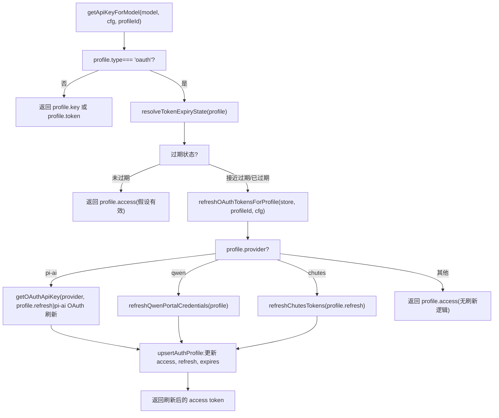
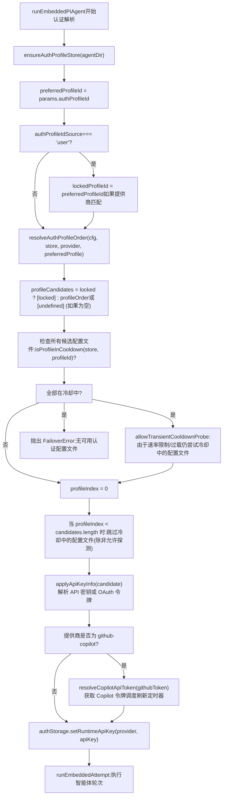
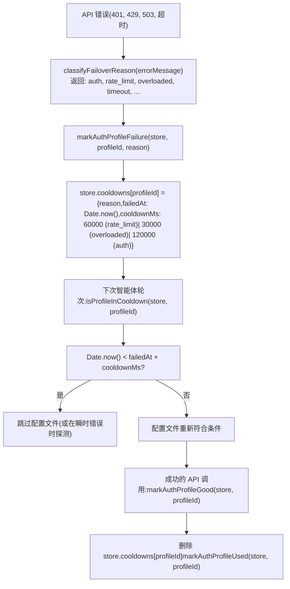
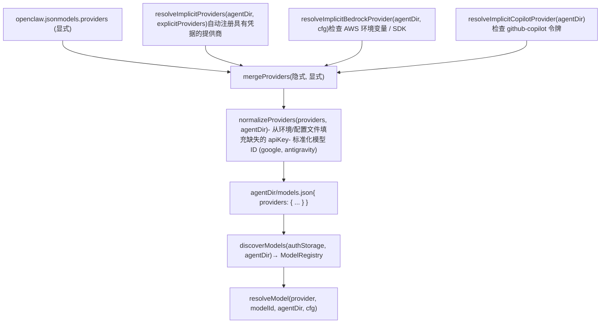
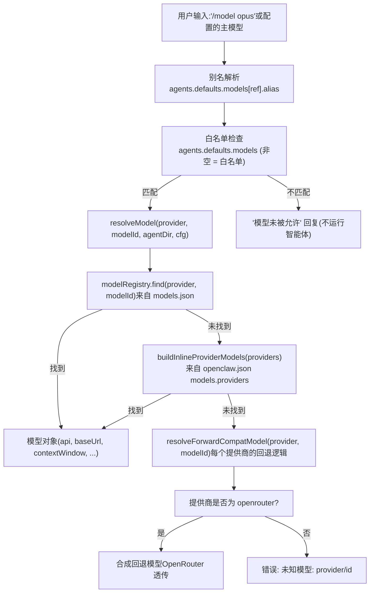

# 模型配置与身份验证 (Model Configuration & Authentication)

相关源文件

-   [docs/concepts/typing-indicators.md](https://github.com/openclaw/openclaw/blob/8873e13f/docs/concepts/typing-indicators.md)
-   [docs/gateway/doctor.md](https://github.com/openclaw/openclaw/blob/8873e13f/docs/gateway/doctor.md)
-   [src/agents/auth-profiles.runtime-snapshot-save.test.ts](https://github.com/openclaw/openclaw/blob/8873e13f/src/agents/auth-profiles.runtime-snapshot-save.test.ts)
-   [src/agents/auth-profiles/oauth.openai-codex-refresh-fallback.test.ts](https://github.com/openclaw/openclaw/blob/8873e13f/src/agents/auth-profiles/oauth.openai-codex-refresh-fallback.test.ts)
-   [src/agents/auth-profiles/oauth.test.ts](https://github.com/openclaw/openclaw/blob/8873e13f/src/agents/auth-profiles/oauth.test.ts)
-   [src/agents/auth-profiles/oauth.ts](https://github.com/openclaw/openclaw/blob/8873e13f/src/agents/auth-profiles/oauth.ts)
-   [src/agents/bash-tools.test.ts](https://github.com/openclaw/openclaw/blob/8873e13f/src/agents/bash-tools.test.ts)
-   [src/agents/model-auth.ts](https://github.com/openclaw/openclaw/blob/8873e13f/src/agents/model-auth.ts)
-   [src/agents/models-config.providers.ts](https://github.com/openclaw/openclaw/blob/8873e13f/src/agents/models-config.providers.ts)
-   [src/agents/pi-embedded-runner/compact.ts](https://github.com/openclaw/openclaw/blob/8873e13f/src/agents/pi-embedded-runner/compact.ts)
-   [src/agents/pi-embedded-runner/run.ts](https://github.com/openclaw/openclaw/blob/8873e13f/src/agents/pi-embedded-runner/run.ts)
-   [src/agents/pi-embedded-runner/run/attempt.ts](https://github.com/openclaw/openclaw/blob/8873e13f/src/agents/pi-embedded-runner/run/attempt.ts)
-   [src/agents/pi-embedded-runner/run/params.ts](https://github.com/openclaw/openclaw/blob/8873e13f/src/agents/pi-embedded-runner/run/params.ts)
-   [src/agents/pi-embedded-runner/run/types.ts](https://github.com/openclaw/openclaw/blob/8873e13f/src/agents/pi-embedded-runner/run/types.ts)
-   [src/agents/pi-embedded-runner/system-prompt.ts](https://github.com/openclaw/openclaw/blob/8873e13f/src/agents/pi-embedded-runner/system-prompt.ts)
-   [src/agents/pi-tools-agent-config.test.ts](https://github.com/openclaw/openclaw/blob/8873e13f/src/agents/pi-tools-agent-config.test.ts)
-   [src/auto-reply/reply/agent-runner-execution.ts](https://github.com/openclaw/openclaw/blob/8873e13f/src/auto-reply/reply/agent-runner-execution.ts)
-   [src/auto-reply/reply/agent-runner-memory.ts](https://github.com/openclaw/openclaw/blob/8873e13f/src/auto-reply/reply/agent-runner-memory.ts)
-   [src/auto-reply/reply/agent-runner-utils.test.ts](https://github.com/openclaw/openclaw/blob/8873e13f/src/auto-reply/reply/agent-runner-utils.test.ts)
-   [src/auto-reply/reply/agent-runner-utils.ts](https://github.com/openclaw/openclaw/blob/8873e13f/src/auto-reply/reply/agent-runner-utils.ts)
-   [src/auto-reply/reply/agent-runner.ts](https://github.com/openclaw/openclaw/blob/8873e13f/src/auto-reply/reply/agent-runner.ts)
-   [src/auto-reply/reply/followup-runner.ts](https://github.com/openclaw/openclaw/blob/8873e13f/src/auto-reply/reply/followup-runner.ts)
-   [src/auto-reply/reply/test-helpers.ts](https://github.com/openclaw/openclaw/blob/8873e13f/src/auto-reply/reply/test-helpers.ts)
-   [src/auto-reply/reply/typing-mode.ts](https://github.com/openclaw/openclaw/blob/8873e13f/src/auto-reply/reply/typing-mode.ts)
-   [src/browser/control-auth.auto-token.test.ts](https://github.com/openclaw/openclaw/blob/8873e13f/src/browser/control-auth.auto-token.test.ts)
-   [src/browser/control-auth.test.ts](https://github.com/openclaw/openclaw/blob/8873e13f/src/browser/control-auth.test.ts)
-   [src/browser/control-auth.ts](https://github.com/openclaw/openclaw/blob/8873e13f/src/browser/control-auth.ts)
-   [src/cli/program/register.onboard.ts](https://github.com/openclaw/openclaw/blob/8873e13f/src/cli/program/register.onboard.ts)
-   [src/commands/auth-choice-options.test.ts](https://github.com/openclaw/openclaw/blob/8873e13f/src/commands/auth-choice-options.test.ts)
-   [src/commands/auth-choice-options.ts](https://github.com/openclaw/openclaw/blob/8873e13f/src/commands/auth-choice-options.ts)
-   [src/commands/auth-choice.apply.api-providers.ts](https://github.com/openclaw/openclaw/blob/8873e13f/src/commands/auth-choice.apply.api-providers.ts)
-   [src/commands/auth-choice.preferred-provider.ts](https://github.com/openclaw/openclaw/blob/8873e13f/src/commands/auth-choice.preferred-provider.ts)
-   [src/commands/auth-choice.test.ts](https://github.com/openclaw/openclaw/blob/8873e13f/src/commands/auth-choice.test.ts)
-   [src/commands/auth-choice.ts](https://github.com/openclaw/openclaw/blob/8873e13f/src/commands/auth-choice.ts)
-   [src/commands/configure.ts](https://github.com/openclaw/openclaw/blob/8873e13f/src/commands/configure.ts)
-   [src/commands/doctor.ts](https://github.com/openclaw/openclaw/blob/8873e13f/src/commands/doctor.ts)
-   [src/commands/onboard-auth.config-core.ts](https://github.com/openclaw/openclaw/blob/8873e13f/src/commands/onboard-auth.config-core.ts)
-   [src/commands/onboard-auth.credentials.ts](https://github.com/openclaw/openclaw/blob/8873e13f/src/commands/onboard-auth.credentials.ts)
-   [src/commands/onboard-auth.models.ts](https://github.com/openclaw/openclaw/blob/8873e13f/src/commands/onboard-auth.models.ts)
-   [src/commands/onboard-auth.test.ts](https://github.com/openclaw/openclaw/blob/8873e13f/src/commands/onboard-auth.test.ts)
-   [src/commands/onboard-auth.ts](https://github.com/openclaw/openclaw/blob/8873e13f/src/commands/onboard-auth.ts)
-   [src/commands/onboard-non-interactive.ts](https://github.com/openclaw/openclaw/blob/8873e13f/src/commands/onboard-non-interactive.ts)
-   [src/commands/onboard-non-interactive/local/auth-choice.ts](https://github.com/openclaw/openclaw/blob/8873e13f/src/commands/onboard-non-interactive/local/auth-choice.ts)
-   [src/commands/onboard-types.ts](https://github.com/openclaw/openclaw/blob/8873e13f/src/commands/onboard-types.ts)
-   [src/gateway/startup-auth.test.ts](https://github.com/openclaw/openclaw/blob/8873e13f/src/gateway/startup-auth.test.ts)
-   [src/gateway/startup-auth.ts](https://github.com/openclaw/openclaw/blob/8873e13f/src/gateway/startup-auth.ts)
-   [src/wizard/onboarding.ts](https://github.com/openclaw/openclaw/blob/8873e13f/src/wizard/onboarding.ts)

本页涵盖了 OpenClaw 如何配置 AI 模型提供商、存储并解析凭据、选择主模型和回退模型，以及公开的 `openclaw models` CLI 命令。它适用于智能体端的模型 API（Anthropic, OpenAI, Ollama 等）。

有关 **网关身份验证** (Gateway authentication)（WebSocket 令牌、密码、Tailscale），请参见第 [2.2](/openclaw/openclaw/2.2-authentication-and-device-pairing) 页。有关完整的 `openclaw.json` 配置参考，请参见第 [2.3.1](/openclaw/openclaw/2.3.1-configuration-reference) 页。

---

## 认证配置文件 (Auth Profiles)

模型提供商的凭据存储在 `auth-profiles.json` 中，该文件位于智能体目录（`~/.openclaw/agents/<agentId>/agent/auth-profiles.json`）。该文件由 `upsertAuthProfile` 管理，并由 `ensureAuthProfileStore` 读取，这两者都在 [src/agents/auth-profiles.js](https://github.com/openclaw/openclaw/blob/8873e13f/src/agents/auth-profiles.js) 中实现。

### 配置文件 ID 格式

配置文件 ID 遵循 `<provider>:<name>` 模式，例如：

| 配置文件 ID | 含义 |
| --- | --- |
| `anthropic:default` | 默认 Anthropic 凭据 |
| `openai-codex:user@example.com` | 按电子邮件分类的 Codex OAuth 凭据 |
| `google:default` | 默认 Google Gemini 凭据 |
| `minimax:default` | 默认 MiniMax 凭据 |

名称段对于 API 密钥通常为 `default`，对于 OAuth 配置文件通常为账户电子邮件。

### 凭据类型

`auth-profiles.json` 中的 `profiles` 映射包含三种类型的条目：

| `type` | 字段 | 用途 |
| --- | --- | --- |
| `api_key` | `key` (字符串) 或 `keyRef` (SecretRef) | 大多数提供商的 API 密钥 |
| `oauth` | `access`, `refresh`, `expires`, `email` | OAuth 流程 (OpenAI Codex, GitHub Copilot, Chutes, 等) |
| `token` | `token`, 可选的 `expires` | Anthropic setup-token |

`SecretRef` 对象（类型为 `keyRef`）允许存储对环境变量的引用，而不是原始密钥值：

```
{  "source": "env",  "provider": "env",  "id": "ANTHROPIC_API_KEY"}
```
这通过 `openclaw onboard` / `openclaw configure` 中的 `--secret-input-mode ref` 标志激活，该标志调用 [src/commands/onboard-auth.credentials.ts52-70](https://github.com/openclaw/openclaw/blob/8873e13f/src/commands/onboard-auth.credentials.ts#L52-L70) 中的 `resolveApiKeySecretInput`。

**来源：** [src/agents/model-auth.ts](https://github.com/openclaw/openclaw/blob/8873e13f/src/agents/model-auth.ts) [src/commands/onboard-auth.credentials.ts](https://github.com/openclaw/openclaw/blob/8873e13f/src/commands/onboard-auth.credentials.ts)

---

## 按提供商划分的认证模式 (Auth Modes by Provider)

[src/commands/onboard-types.ts5-53](https://github.com/openclaw/openclaw/blob/8873e13f/src/commands/onboard-types.ts#L5-L53) 中的 `AuthChoice` 联合类型列举了所有受支持的认证流程。入门向导 (`openclaw onboard`) 和 `openclaw configure` 命令都通过 [src/commands/auth-choice.apply.js](https://github.com/openclaw/openclaw/blob/8873e13f/src/commands/auth-choice.apply.js) 中的 `applyAuthChoice` 来解析这些选择。

### 常见提供商认证流程

| 认证选择 | 配置文件类型 | 配置文件 ID | 机制 |
| --- | --- | --- | --- |
| `apiKey` | `api_key` | `anthropic:default` | Anthropic API 密钥 |
| `token` | `token` | `anthropic:<name>` | Anthropic setup-token (来自 `claude setup-token`) |
| `openai-api-key` | `api_key` | `openai:default` | OpenAI API 密钥 |
| `openai-codex` | `oauth` | `openai-codex:<email>` | OpenAI Codex OAuth (ChatGPT 订阅) |
| `gemini-api-key` | `api_key` | `google:default` | Google Gemini API 密钥 |
| `google-gemini-cli` | `oauth` | `google:<email>` | Gemini CLI OAuth (非官方) |
| `github-copilot` | `oauth` | `github-copilot:*` | GitHub 设备流 OAuth |
| `openrouter-api-key` | `api_key` | `openrouter:default` | OpenRouter API 密钥 |
| `minimax-api` | `api_key` | `minimax:default` | MiniMax API 密钥 |
| `minimax-portal` | `oauth` | `minimax-portal:*` | MiniMax OAuth |
| `moonshot-api-key` | `api_key` | `moonshot:default` | Moonshot (Kimi) API 密钥 |
| `vllm` | `api_key` | `vllm:default` | vLLM (任意值) |

对于 OAuth 提供商，[src/commands/onboard-auth.credentials.ts153-199](https://github.com/openclaw/openclaw/blob/8873e13f/src/commands/onboard-auth.credentials.ts#L153-L199) 中的 `writeOAuthCredentials` 处理凭据的持久化，并在设置了 `syncSiblingAgents` 时向同级智能体目录进行广播同步。

### Anthropic Setup-Token 流程

setup-token 是由 Claude Code CLI (`claude setup-token`) 生成的长效凭据。它作为 `token` 类型的配置文件存储，而不是 `api_key`。流程如下：

1.  在任何机器上运行 `claude setup-token`。
2.  复制令牌字符串。
3.  在向导中选择 "Anthropic token (paste setup-token)" 或运行：

    ```
    openclaw models auth paste-token --provider anthropic
    ```

4.  [src/commands/auth-token.ts39-65](https://github.com/openclaw/openclaw/blob/8873e13f/src/commands/auth-token.ts#L39-L65) 中的 `validateAnthropicSetupToken` 在通过 `upsertAuthProfile` 存储前验证格式。

**来源：** [src/commands/onboard-types.ts5-53](https://github.com/openclaw/openclaw/blob/8873e13f/src/commands/onboard-types.ts#L5-L53) [src/commands/auth-choice-options.ts](https://github.com/openclaw/openclaw/blob/8873e13f/src/commands/auth-choice-options.ts) [src/commands/onboard-auth.credentials.ts](https://github.com/openclaw/openclaw/blob/8873e13f/src/commands/onboard-auth.credentials.ts) [src/commands/auth-token.ts39-65](https://github.com/openclaw/openclaw/blob/8873e13f/src/commands/auth-token.ts#L39-L65)

---

## OAuth 令牌刷新 (OAuth Token Refresh)

OpenAI Codex, Google Gemini CLI, GitHub Copilot, Chutes, Qwen Portal 和 MiniMax Portal 等提供商的 OAuth 凭据需要定期刷新令牌。[src/agents/auth-profiles/oauth.ts27-213](https://github.com/openclaw/openclaw/blob/8873e13f/src/agents/auth-profiles/oauth.ts#L27-L213) 中的 `refreshOAuthTokensForProfile` 函数处理所有 OAuth 提供商的刷新逻辑。

### OAuth 刷新流程图


### GitHub Copilot 令牌管理 (GitHub Copilot Token Management)

GitHub Copilot OAuth 令牌每小时过期，需要主动刷新。`runEmbeddedPiAgent` 执行路径为 Copilot 会话管理一个刷新定时器 [src/agents/pi-embedded-runner/run.ts431-529](https://github.com/openclaw/openclaw/blob/8873e13f/src/agents/pi-embedded-runner/run.ts#L431-L529)：

1.  **初始令牌获取**：`resolveCopilotApiToken(githubToken)` 将 GitHub 令牌兑换为带有过期时间戳的 Copilot API 令牌。
2.  **调度刷新**：`scheduleCopilotRefresh()` 设置一个定时器，在过期前 5 分钟 (`COPILOT_REFRESH_MARGIN_MS`) 进行刷新。
3.  **错误时刷新**：如果 API 调用因认证错误而失败且提供商为 Copilot，则 `maybeRefreshCopilotForAuthError` [src/agents/pi-embedded-runner/run.ts702-775](https://github.com/openclaw/openclaw/blob/8873e13f/src/agents/pi-embedded-runner/run.ts#L702-L775) 会立即刷新令牌并重试。
4.  **清理**：运行完成时，`stopCopilotRefreshTimer()` 取消定时器。

刷新定时器在单次智能体轮次内的工具调用之间持续存在，确保令牌在整个执行过程中保持有效。

**来源：** [src/agents/auth-profiles/oauth.ts27-213](https://github.com/openclaw/openclaw/blob/8873e13f/src/agents/auth-profiles/oauth.ts#L27-L213) [src/agents/pi-embedded-runner/run.ts431-775](https://github.com/openclaw/openclaw/blob/8873e13f/src/agents/pi-embedded-runner/run.ts#L431-L775) [src/providers/github-copilot-token.ts](https://github.com/openclaw/openclaw/blob/8873e13f/src/providers/github-copilot-token.ts)

---

## 运行时身份验证解析 (Auth Resolution at Runtime)

当智能体尝试调用模型时，[src/agents/model-auth.ts135-233](https://github.com/openclaw/openclaw/blob/8873e13f/src/agents/model-auth.ts#L135-L233) 中的 `getApiKeyForModel` 通过按优先级检查来源来解析凭据。`runEmbeddedPiAgent` [src/agents/pi-embedded-runner/run.ts253-1450](https://github.com/openclaw/openclaw/blob/8873e13f/src/agents/pi-embedded-runner/run.ts#L253-L1450) 中的运行时执行管理配置文件选择、冷却追踪以及失败时的配置文件递进。

**标题：`runEmbeddedPiAgent` 中的认证配置文件选择图**


**标题：认证配置文件失败追踪与冷却图**


**来源：** [src/agents/pi-embedded-runner/run.ts253-1450](https://github.com/openclaw/openclaw/blob/8873e13f/src/agents/pi-embedded-runner/run.ts#L253-L1450) [src/agents/model-auth.ts135-233](https://github.com/openclaw/openclaw/blob/8873e13f/src/agents/model-auth.ts#L135-L233) [src/agents/auth-profiles.ts17-383](https://github.com/openclaw/openclaw/blob/8873e13f/src/agents/auth-profiles.ts#L17-L383)

---

## 提供商配置 (Provider Configuration)

### `openclaw.json` 中的 `models.providers`

显式的提供商条目位于 `openclaw.json` 的 `models.providers` 下。每个条目指定了 API 接口、基准 URL、认证模式和模型目录：

```
{  models: {    providers: {      "openrouter": {        baseUrl: "https://openrouter.ai/api/v1",        api: "openai-completions",        // 或 "anthropic-messages", "ollama"        apiKey: "OPENROUTER_API_KEY",     // 环境变量名或字面值        models: [          {            id: "auto",            name: "OpenRouter Auto",            reasoning: false,            input: ["text", "image"],            contextWindow: 200000,            maxTokens: 8192,            cost: { input: 0, output: 0, cacheRead: 0, cacheWrite: 0 }          }        ]      }    }  }}
```
`api` 字段选择通信协议：

| 值 | 通信协议 |
| --- | --- |
| `anthropic-messages` | Anthropic Messages API |
| `openai-completions` | OpenAI 聊天补全 (Chat Completions) |
| `openai-responses` | OpenAI 响应 API (Responses API) |
| `ollama` | Ollama 原生 API (`/api/chat`) |

一个常见的配置错误是将 `apiKey` 设置为 `"${ENV_VAR}"` 而不是 `"ENV_VAR"`。[src/agents/models-config.providers.ts387-391](https://github.com/openclaw/openclaw/blob/8873e13f/src/agents/models-config.providers.ts#L387-L391) 中的 `normalizeApiKeyConfig` 函数会自动剥离 `${}` 包装器。

### `models.json` 与合并管道 (Merge Pipeline)

[src/agents/models-config.ts113-199](https://github.com/openclaw/openclaw/blob/8873e13f/src/agents/models-config.ts#L113-L199) 中的 `ensureOpenClawModelsJson` 是在智能体目录下生成 `models.json` 的中心程序。它在网关启动和配置重载时运行。

**标题：`ensureOpenClawModelsJson` 中的 `models.json` 生成管道图**


**来源：** [src/agents/models-config.ts113-199](https://github.com/openclaw/openclaw/blob/8873e13f/src/agents/models-config.ts#L113-L199) [src/agents/models-config.providers.ts904-1060](https://github.com/openclaw/openclaw/blob/8873e13f/src/agents/models-config.providers.ts#L904-L1060)

### 隐式提供商注册 (Implicit Provider Registration)

[src/agents/models-config.providers.ts904-1060](https://github.com/openclaw/openclaw/blob/8873e13f/src/agents/models-config.providers.ts#L904-L1060) 中的 `resolveImplicitProviders` 在凭据存在（环境变量或认证配置文件）时会自动注册提供商，**无需**显式的 `models.providers` 配置。例如，如果设置了 `MINIMAX_API_KEY` 或 `auth-profiles.json` 中存在 `minimax:default` 配置文件，`minimax` 提供商将自动与其内置模型目录一起注册。

隐式注册的提供商包括：`minimax`, `minimax-portal`, `moonshot`, `kimi-coding`, `synthetic`, `venice`, `qwen-portal`, `volcengine`, `byteplus`, `xiaomi`, `cloudflare-ai-gateway` 等。

### 自动发现提供商 (Ollama 和 vLLM)

**Ollama**：[src/agents/models-config.providers.ts273-332](https://github.com/openclaw/openclaw/blob/8873e13f/src/agents/models-config.providers.ts#L273-L332) 中的 `discoverOllamaModels` 调用 `/api/tags` 列出本地运行的模型，然后调用 `/api/show` 查询每个模型的实际上下文窗口大小。在测试环境中会跳过发现。

**vLLM**：[src/agents/models-config.providers.ts334-385](https://github.com/openclaw/openclaw/blob/8873e13f/src/agents/models-config.providers.ts#L334-L385) 中的 `discoverVllmModels` 调用配置的基准 URL（默认 `http://127.0.0.1:8000/v1`）上的 `/models` 端点。

这两个提供商都需要在 `auth-profiles.json` 或环境变量中至少有一个占位 API 密钥值（任何非空字符串）来触发注册。

**来源：** [src/agents/models-config.providers.ts273-385](https://github.com/openclaw/openclaw/blob/8873e13f/src/agents/models-config.providers.ts#L273-L385) [src/agents/models-config.ts113-199](https://github.com/openclaw/openclaw/blob/8873e13f/src/agents/models-config.ts#L113-L199)

---

## 模型选择 (Model Selection)

### 模型引用格式

模型被引用为 `<provider>/<model-id>`，例如：

-   `anthropic/claude-sonnet-4-5`
-   `openai-codex/gpt-5.3-codex`
-   `openrouter/moonshotai/kimi-k2` (透传提供商使用双斜杠)
-   `ollama/llama3.2`

[src/agents/pi-embedded-runner/model.ts42-127](https://github.com/openclaw/openclaw/blob/8873e13f/src/agents/pi-embedded-runner/model.ts#L42-L127) 中的 `resolveModel` 函数在第一个 `/` 处进行拆分以获取提供商和模型 ID，然后查询从 `models.json` 构建的 `ModelRegistry`。

### 主模型与回退模型 (Primary and Fallback Models)

模型选择配置在 `agents.defaults.model`（或特定智能体的 `agents.list[].model`）中：

```
{  agents: {    defaults: {      model: {        primary: "anthropic/claude-sonnet-4-5",        fallbacks: [          "openai-codex/gpt-5.3-codex",          "openrouter/auto"        ]      }    }  }}
```
[3.1](/openclaw/openclaw/3.1-agent-execution-pipeline) 中的智能体管道首先尝试主模型，然后按顺序依次尝试回退模型列表。提供商级别的认证故障转移（在同一提供商的多个凭据之间轮换）会在切换到下一个回退条目前在提供商内部发生。

### 模型别名 (Model Aliases)

别名将短名称映射到完整的模型引用。它们配置在 `agents.defaults.models` 中：

```
{  agents: {    defaults: {      models: {        "anthropic/claude-opus-4-6": { alias: "opus" },        "anthropic/claude-sonnet-4-5": { alias: "sonnet" },        "openrouter/auto": { alias: "router" }      }    }  }}
```
此映射还充当 **白名单 (Allowlist)**：当 `agents.defaults.models` 非空时，只有列出的模型可以在聊天中通过 `/model` 选择。不在白名单中的模型在生成回复前会返回错误。内置的别名构建器（[src/agents/pi-embedded-runner/model.ts23](https://github.com/openclaw/openclaw/blob/8873e13f/src/agents/pi-embedded-runner/model.ts#L23-L23) 中的 `buildModelAliasLines`）会将别名元数据注入到系统提示词中。

**标题：`resolveModel` 中的模型解析流图**


**来源：** [src/agents/pi-embedded-runner/model.ts42-127](https://github.com/openclaw/openclaw/blob/8873e13f/src/agents/pi-embedded-runner/model.ts#L42-L127) [docs/concepts/models.md](https://github.com/openclaw/openclaw/blob/8873e13f/docs/concepts/models.md)

---

## `openclaw models` CLI

`openclaw models` 命令组用于管理模型和认证配置，无需直接编辑 `openclaw.json`。来自 [docs/concepts/models.md](https://github.com/openclaw/openclaw/blob/8873e13f/docs/concepts/models.md) 的子命令：

| 命令 | 效果 |
| --- | --- |
| `openclaw models status` | 显示已配置的提供商、认证候选、模型可用性 |
| `openclaw models list` | 从配置的目录中列出模型 |
| `openclaw models list --all` | 完整目录，包括自动发现的提供商 |
| `openclaw models set <provider/model>` | 设置 `agents.defaults.model.primary` |
| `openclaw models set-image <provider/model>` | 设置 `agents.defaults.imageModel.primary` |
| `openclaw models aliases list` | 列出 `agents.defaults.models` 中的所有别名 |
| `openclaw models aliases add <alias> <ref>` | 添加别名条目 |
| `openclaw models aliases remove <alias>` | 移除别名条目 |
| `openclaw models fallbacks list` | 显示 `agents.defaults.model.fallbacks` |
| `openclaw models fallbacks add <ref>` | 追加到回退模型列表 |
| `openclaw models fallbacks remove <ref>` | 从回退模型列表中移除 |
| `openclaw models fallbacks clear` | 清空所有回退模型 |
| `openclaw models scan` | 探测已配置模型的工具和图像支持情况 |

`openclaw models status` 内部会调用 `openclaw status --deep` 以获取提供商探测详情。

---

## 环境变量 (Environment Variables)

[src/agents/model-auth.ts238-269](https://github.com/openclaw/openclaw/blob/8873e13f/src/agents/model-auth.ts#L238-L269) 中的 `resolveEnvApiKey` 将提供商名称映射到已知的环境变量。[src/secrets/provider-env-vars.ts](https://github.com/openclaw/openclaw/blob/8873e13f/src/secrets/provider-env-vars.ts) 中的 `PROVIDER_ENV_VARS` 映射定义了每个提供商的规范环境变量。标准环境变量如下：

| 提供商 | 环境变量 |
| --- | --- |
| `anthropic` | `ANTHROPIC_API_KEY` |
| `openai` | `OPENAI_API_KEY` |
| `google` | `GEMINI_API_KEY`, `GOOGLE_API_KEY` |
| `openrouter` | `OPENROUTER_API_KEY` |
| `ollama` | `OLLAMA_API_KEY` (任意值均可启用 Ollama) |
| `vllm` | `VLLM_API_KEY` |
| `amazon-bedrock` | `AWS_BEARER_TOKEN_BEDROCK`, `AWS_ACCESS_KEY_ID`+`AWS_SECRET_ACCESS_KEY`, 或 `AWS_PROFILE` |
| `minimax` | `MINIMAX_API_KEY` |
| `moonshot` | `MOONSHOT_API_KEY` |
| `huggingface` | `HF_TOKEN`, `HUGGINGFACE_HUB_TOKEN` |
| `mistral` | `MISTRAL_API_KEY` |
| `xai` | `XAI_API_KEY` |

`openclaw models status` 中的标签区分了 "shell env"（通过守护进程环境加载器从 `~/.openclaw/.env` 加载）和 "env"（已存在于进程环境中）。

对于网关守护进程 (`launchd`/`systemd`)，未在系统环境中设置的环境变量必须放置在 `~/.openclaw/.env` 中。有关环境变量加载的详情，请参见第 [2.3](/openclaw/openclaw/2.3-configuration-system) 页。网关在衍生智能体运行时之前，通过 shell 环境加载器 [src/infra/shell-env.ts](https://github.com/openclaw/openclaw/blob/8873e13f/src/infra/shell-env.ts) 加载环境变量。

**来源：** [src/agents/model-auth.ts238-269](https://github.com/openclaw/openclaw/blob/8873e13f/src/agents/model-auth.ts#L238-L269) [src/secrets/provider-env-vars.ts](https://github.com/openclaw/openclaw/blob/8873e13f/src/secrets/provider-env-vars.ts) [docs/gateway/authentication.md](https://github.com/openclaw/openclaw/blob/8873e13f/docs/gateway/authentication.md)

---

## 自定义与第三方提供商 (Custom and Third-Party Providers)

任何兼容 OpenAI 或 Anthropic 的 HTTP 端点都可以作为自定义提供商注册在 `models.providers` 中：

```
{  models: {    providers: {      "my-proxy": {        baseUrl: "https://my-llm-proxy.example.com/v1",        api: "openai-completions",        apiKey: "MY_PROXY_KEY",   // 环境变量名        models: [          {            id: "my-model-id",            name: "My Model",            reasoning: false,            input: ["text"],            contextWindow: 128000,            maxTokens: 8192,            cost: { input: 0, output: 0, cacheRead: 0, cacheWrite: 0 }          }        ]      }    }  }}
```
入门向导通过 [src/commands/onboard-custom.js](https://github.com/openclaw/openclaw/blob/8873e13f/src/commands/onboard-custom.js) 中的 `applyCustomApiConfig` 将此功能公开为 `--auth-choice custom-api-key`，它接受 `--custom-base-url`, `--custom-api-key`, `--custom-model-id` 和 `--custom-compatibility openai|anthropic` 参数。

**来源：** [src/agents/models-config.providers.ts](https://github.com/openclaw/openclaw/blob/8873e13f/src/agents/models-config.providers.ts) [src/commands/auth-choice-options.ts184-188](https://github.com/openclaw/openclaw/blob/8873e13f/src/commands/auth-choice-options.ts#L184-L188)
