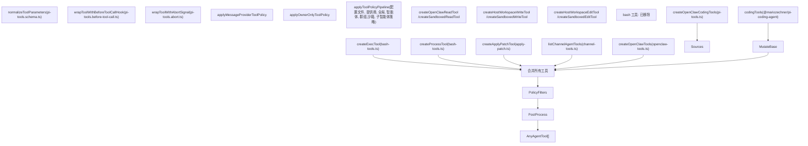
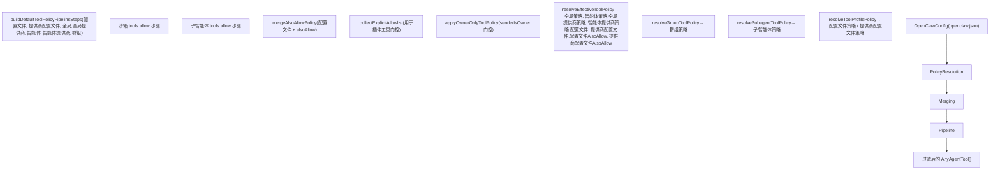
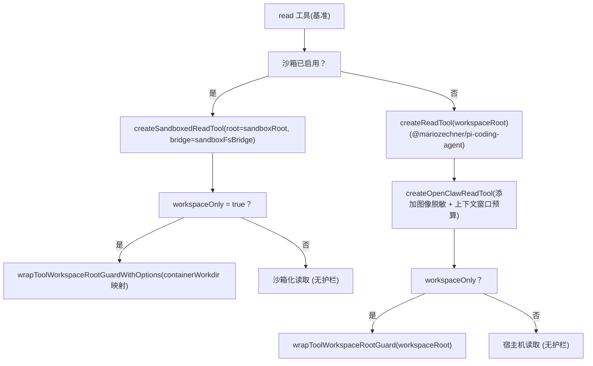

# 工具 (Tools)

相关源文件

-   [docs/concepts/system-prompt.md](https://github.com/openclaw/openclaw/blob/8873e13f/docs/concepts/system-prompt.md)
-   [docs/gateway/background-process.md](https://github.com/openclaw/openclaw/blob/8873e13f/docs/gateway/background-process.md)
-   [src/agents/bash-process-registry.test.ts](https://github.com/openclaw/openclaw/blob/8873e13f/src/agents/bash-process-registry.test.ts)
-   [src/agents/bash-process-registry.ts](https://github.com/openclaw/openclaw/blob/8873e13f/src/agents/bash-process-registry.ts)
-   [src/agents/bash-tools.ts](https://github.com/openclaw/openclaw/blob/8873e13f/src/agents/bash-tools.ts)
-   [src/agents/pi-embedded-helpers.ts](https://github.com/openclaw/openclaw/blob/8873e13f/src/agents/pi-embedded-helpers.ts)
-   [src/agents/pi-embedded-runner.ts](https://github.com/openclaw/openclaw/blob/8873e13f/src/agents/pi-embedded-runner.ts)
-   [src/agents/pi-embedded-subscribe.ts](https://github.com/openclaw/openclaw/blob/8873e13f/src/agents/pi-embedded-subscribe.ts)
-   [src/agents/pi-tools.ts](https://github.com/openclaw/openclaw/blob/8873e13f/src/agents/pi-tools.ts)
-   [src/agents/system-prompt.test.ts](https://github.com/openclaw/openclaw/blob/8873e13f/src/agents/system-prompt.test.ts)
-   [src/agents/system-prompt.ts](https://github.com/openclaw/openclaw/blob/8873e13f/src/agents/system-prompt.ts)

本页涵盖了智能体工具系统：工具如何为每个智能体轮次进行组装、过滤和保护这些工具的策略执行管道、工作区根目录保护、模式标准化，以及可用工具的完整清单。

有关特定工具子系统的详细信息，请参见：

-   Exec 工具、执行审批和 PTY 支持：[3.4.1](/openclaw/openclaw/3.4.1-exec-tool-and-background-processes)
-   记忆工具 (`memory_search`, `memory_get`)：[3.4.2](/openclaw/openclaw/3.4.2-memory-and-search)
-   通过 `sessions_spawn` 衍生子智能体：[3.4.3](/openclaw/openclaw/3.4.3-subagents-and-acp)
-   工具如何注入到系统提示词中：[3.2](/openclaw/openclaw/3.2-system-prompt-and-context)
-   沙箱与工具的交互：[7.2](/openclaw/openclaw/7.2-sandboxing)

---

## 工具组装入口点 (Tool Assembly Entry Point)

每个智能体轮次都通过调用 [src/agents/pi-tools.ts182-544](https://github.com/openclaw/openclaw/blob/8873e13f/src/agents/pi-tools.ts#L182-L544) 中的 `createOpenClawCodingTools` 开始。该函数构造并返回传递给模型 API 的完整 `AnyAgentTool[]` 列表。它接受一个丰富的 `options` 对象，涵盖了智能体身份、模型提供商、沙箱上下文、文件系统策略、消息路由和策略覆盖。

组装后的列表是多项顺序操作的结果：

**工具组装示意图**


**来源：** [src/agents/pi-tools.ts331-543](https://github.com/openclaw/openclaw/blob/8873e13f/src/agents/pi-tools.ts#L331-L543)

---

## 工具类别 (Tool Categories)

工具源自两个方面：上游的 `codingTools` 集（来自 `@mariozechner/pi-coding-agent`）和在 `createOpenClawTools` ([src/agents/openclaw-tools.ts](https://github.com/openclaw/openclaw/blob/8873e13f/src/agents/openclaw-tools.ts)) 中创建的 OpenClaw 原生工具。

### 基础编码工具 (Base Coding Tools)

来自 `@mariozechner/pi-coding-agent` 的 `codingTools` 数组提供了核心文件系统工具。OpenClaw 在组装期间会就地替换其中的几个：

| 工具名称 | `createOpenClawCodingTools` 中的替换项 | 来源 |
| --- | --- | --- |
| `read` | `createOpenClawReadTool` 或 `createSandboxedReadTool` | `pi-tools.read.ts` |
| `write` | `createHostWorkspaceWriteTool` 或 `createSandboxedWriteTool` | `pi-tools.read.ts` |
| `edit` | `createHostWorkspaceEditTool` 或 `createSandboxedEditTool` | `pi-tools.read.ts` |
| `bash` | **完全移除** | — |
| `exec` | **从基础集中移除，通过 `createExecTool` 重新添加** | `bash-tools.ts` |

**来源：** [src/agents/pi-tools.ts331-373](https://github.com/openclaw/openclaw/blob/8873e13f/src/agents/pi-tools.ts#L331-L373)

### OpenClaw 原生工具

`createOpenClawTools` ([src/agents/openclaw-tools.ts](https://github.com/openclaw/openclaw/blob/8873e13f/src/agents/openclaw-tools.ts)) 添加了以下工具组。这些在 [docs/tools/index.md](https://github.com/openclaw/openclaw/blob/8873e13f/docs/tools/index.md) 中有详细记录：

| 工具组简写 | 包含的工具 |
| --- | --- |
| `group:runtime` | `exec`, `bash`, `process` |
| `group:fs` | `read`, `write`, `edit`, `apply_patch` |
| `group:sessions` | `sessions_list`, `sessions_history`, `sessions_send`, `sessions_spawn`, `session_status` |
| `group:memory` | `memory_search`, `memory_get` |
| `group:web` | `web_search`, `web_fetch` |
| `group:ui` | `browser`, `canvas` |
| `group:automation` | `cron`, `gateway` |
| `group:messaging` | `message` |
| `group:nodes` | `nodes` |
| `group:openclaw` | 所有内置工具 |

其他工具：`image`, `agents_list`, `tts`（语音；当 `messageProvider=voice` 时排除）。

通道插件也可以通过 `listChannelAgentTools` ([src/agents/channel-tools.ts](https://github.com/openclaw/openclaw/blob/8873e13f/src/agents/channel-tools.ts)) 贡献工具。

**来源：** [docs/tools/index.md141-164](https://github.com/openclaw/openclaw/blob/8873e13f/docs/tools/index.md#L141-L164) [src/agents/pi-tools.ts454-496](https://github.com/openclaw/openclaw/blob/8873e13f/src/agents/pi-tools.ts#L454-L496)

---

## 工具策略管道 (Tool Policy Pipeline)

策略强制执行是工具组装中最复杂的部分。多个独立的策略层被解析，然后通过 `applyToolPolicyPipeline` ([src/agents/tool-policy-pipeline.ts](https://github.com/openclaw/openclaw/blob/8873e13f/src/agents/tool-policy-pipeline.ts)) 按顺序应用。

### 策略层

**工具策略解析图**


**来源：** [src/agents/pi-tools.ts244-521](https://github.com/openclaw/openclaw/blob/8873e13f/src/agents/pi-tools.ts#L244-L521) [src/agents/pi-tools.policy.ts](https://github.com/openclaw/openclaw/blob/8873e13f/src/agents/pi-tools.policy.ts) [src/agents/tool-policy-pipeline.ts](https://github.com/openclaw/openclaw/blob/8873e13f/src/agents/tool-policy-pipeline.ts) [src/agents/tool-policy.ts](https://github.com/openclaw/openclaw/blob/8873e13f/src/agents/tool-policy.ts)

### 策略优先级

管道按顺序步骤应用策略。在每个步骤中，`deny` (拒绝) 优先于 `allow` (允许)。有效的优先级（从最宽到最窄）为：

1.  **配置文件策略 (Profile policy)** (`tools.profile`) —— 显式允许/拒绝之前的基准白名单。
2.  **提供商配置文件策略 (Provider profile policy)** (`tools.byProvider[provider].profile`) —— 为特定模型提供商或 `provider/model` 进一步缩小范围。
3.  **全局策略 (Global policy)** (`tools.allow` / `tools.deny`)。
4.  **全局提供商策略 (Global provider policy)** (`tools.byProvider[provider].allow/deny`)。
5.  **智能体策略 (Agent policy)** (`agents.list[].tools.allow/deny`)。
6.  **智能体提供商策略 (Agent provider policy)** (`agents.list[].tools.byProvider`)。
7.  **群组策略 (Group policy)** —— 通道级限制（通过 `resolveGroupToolPolicy` 解析）。
8.  **沙箱工具策略 (Sandbox tools policy)** (`sandbox.tools.allow/deny`)。
9.  **子智能体策略 (Subagent policy)** —— 基于深度的限制（通过 `resolveSubagentToolPolicy` 解析）。

此外：

-   **所有者专用策略 (Owner-only policy)** (`applyOwnerOnlyToolPolicy`)：某些工具被门控在 `senderIsOwner === true`。
-   **消息提供商策略 (Message provider policy)**：例如，当 `messageProvider=voice` 时，排除 `tts`。

**来源：** [src/agents/pi-tools.ts259-522](https://github.com/openclaw/openclaw/blob/8873e13f/src/agents/pi-tools.ts#L259-L522) [docs/tools/index.md34-136](https://github.com/openclaw/openclaw/blob/8873e13f/docs/tools/index.md#L34-L136)

### 工具配置文件 (Tool Profiles)

`tools.profile` 设置在显式 `allow`/`deny` 列表之前建立基准白名单：

| 配置文件 | 包含的工具 |
| --- | --- |
| `minimal` | 仅 `session_status` |
| `coding` | `group:fs`, `group:runtime`, `group:sessions`, `group:memory`, `image` |
| `messaging` | `group:messaging`, `sessions_list`, `sessions_history`, `sessions_send`, `session_status` |
| `full` | 无限制（等同于未设置） |

针对每个智能体的覆盖：`agents.list[].tools.profile`。针对提供商的覆盖：`tools.byProvider[key].profile`。

**来源：** [docs/tools/index.md34-80](https://github.com/openclaw/openclaw/blob/8873e13f/docs/tools/index.md#L34-L80)

---

## 工作区根目录护栏 (Workspace Root Guards)

当 `tools.fs.workspaceOnly` 为 `true`（或者智能体在沙箱中运行）时，文件系统工具会被强制执行路径包含的护栏所包裹。这是通过 [src/agents/pi-tools.read.ts](https://github.com/openclaw/openclaw/blob/8873e13f/src/agents/pi-tools.read.ts) 中定义的包装器完成的：

| 包装器 | 应用时机 | 目的 |
| --- | --- | --- |
| `wrapToolWorkspaceRootGuard` | 宿主机 (非沙箱) 模式 + `workspaceOnly` | 拒绝 `workspaceRoot` 之外的路径 |
| `wrapToolWorkspaceRootGuardWithOptions` | 沙箱模式 + `workspaceOnly` | 同上，但还通过 `containerWorkdir` 映射容器路径 |

**工作区护栏流程图**


**来源：** [src/agents/pi-tools.ts331-373](https://github.com/openclaw/openclaw/blob/8873e13f/src/agents/pi-tools.ts#L331-L373) [src/agents/pi-tools.read.ts](https://github.com/openclaw/openclaw/blob/8873e13f/src/agents/pi-tools.read.ts)

`workspaceRoot` 通过 `resolveWorkspaceRoot` ([src/agents/workspace-dir.ts](https://github.com/openclaw/openclaw/blob/8873e13f/src/agents/workspace-dir.ts)) 解析，该函数使用 `options.workspaceDir` 或回退到配置的智能体工作区。文件系统策略本身由 [src/agents/tool-fs-policy.ts](https://github.com/openclaw/openclaw/blob/8873e13f/src/agents/tool-fs-policy.ts) 中的 `createToolFsPolicy` 创建。

对于 `apply_patch`，类似的标志 `applyPatchConfig.workspaceOnly` 默认值为 `true` 并独立检查：

```
applyPatchWorkspaceOnly = workspaceOnly || applyPatchConfig?.workspaceOnly !== false
```
**来源：** [src/agents/pi-tools.ts311-323](https://github.com/openclaw/openclaw/blob/8873e13f/src/agents/pi-tools.ts#L311-L323)

---

## Exec 工具配置

`exec` 工具通过 [src/agents/bash-tools.ts](https://github.com/openclaw/openclaw/blob/8873e13f/src/agents/bash-tools.ts) 中的 `createExecTool` 构建，它合并了来自以下方面的配置：

1.  内联 `options.exec` 覆盖（由调用者直接传递）。
2.  智能体特定的 exec 配置 (`agents.list[id].tools.exec`)。
3.  全局 exec 配置 (`tools.exec`)。

此合并由 [src/agents/pi-tools.ts118-145](https://github.com/openclaw/openclaw/blob/8873e13f/src/agents/pi-tools.ts#L118-L145) 中的 `resolveExecConfig` 完成。无论策略如何，生成的 `execTool` 始终包含在组装列表中（策略过滤在此之后发生）。

`process` 工具（用于管理后台 exec 会话）通过 [src/agents/bash-tools.ts](https://github.com/openclaw/openclaw/blob/8873e13f/src/agents/bash-tools.ts) 中的 `createProcessTool` 创建，具有其自身的 `cleanupMs` 和 `scopeKey`。当策略不允许 `process` 时，`exec` 将同步运行，并忽略 `yieldMs`/`background` 参数。

**来源：** [src/agents/pi-tools.ts374-413](https://github.com/openclaw/openclaw/blob/8873e13f/src/agents/pi-tools.ts#L374-L413) [docs/tools/index.md188-226](https://github.com/openclaw/openclaw/blob/8873e13f/docs/tools/index.md#L188-L226)

---

## 模式标准化与提供商特性 (Schema Normalization and Provider Quirks)

在策略过滤之后，列表中的每个工具都会通过 [src/agents/pi-tools.schema.ts](https://github.com/openclaw/openclaw/blob/8873e13f/src/agents/pi-tools.schema.ts) 中的 `normalizeToolParameters`：

-   **OpenAI 及大多数提供商**：剥离可能被拒绝的根级联合模式。
-   **Gemini**：应用 `cleanToolSchemaForGemini`，移除 Gemini API 拒绝的约束关键字（例如 `minLength`, `pattern`）。

此操作统一应用，以防止模型 API 层由于提供商特定的模式要求而导致拒绝。

此外，在 `createOpenClawCodingTools` 中还存在两条针对特定提供商的门控规则：

-   `apply_patch` 仅为 OpenAI 系列提供商启用（[src/agents/pi-tools.ts60-63](https://github.com/openclaw/openclaw/blob/8873e13f/src/agents/pi-tools.ts#L60-L63) 中的 `isOpenAIProvider` 检查）。
-   Anthropic OAuth 传输会在传输线上将工具名称重映射为 Claude Code 风格的名称（在 `pi-ai` 中处理，不在本层）。

**来源：** [src/agents/pi-tools.ts524-528](https://github.com/openclaw/openclaw/blob/8873e13f/src/agents/pi-tools.ts#L524-L528) [src/agents/pi-tools.schema.ts](https://github.com/openclaw/openclaw/blob/8873e13f/src/agents/pi-tools.schema.ts)

---

## 工具生命周期包装器 (Tool Lifecycle Wrappers)

在模式标准化之后，每个工具会依次接受两个额外的包装器：

**`wrapToolWithBeforeToolCallHook`** ([src/agents/pi-tools.before-tool-call.ts](https://github.com/openclaw/openclaw/blob/8873e13f/src/agents/pi-tools.before-tool-call.ts))：

-   在执行前拦截每一次工具调用。
-   运行死循环检测逻辑（见下文）。
-   接收 `agentId`, `sessionKey` 和 `loopDetection` 配置。

**`wrapToolWithAbortSignal`** ([src/agents/pi-tools.abort.ts](https://github.com/openclaw/openclaw/blob/8873e13f/src/agents/pi-tools.abort.ts))：

-   使用 `AbortSignal` 包裹工具执行。
-   仅在提供了 `options.abortSignal` 时应用。
-   在工具执行前或执行期间若收到中止信号则抛出错误。

**来源：** [src/agents/pi-tools.ts529-541](https://github.com/openclaw/openclaw/blob/8873e13f/src/agents/pi-tools.ts#L529-L541)

---

## 工具调用死循环检测 (Tool-Call Loop Detection)

死循环检测通过 `openclaw.json` 中的 `tools.loopDetection` 进行配置，并由 [src/agents/pi-tools.ts147-172](https://github.com/openclaw/openclaw/blob/8873e13f/src/agents/pi-tools.ts#L147-L172) 中的 `resolveToolLoopDetectionConfig` 为每个智能体进行解析：

```
{  tools: {    loopDetection: {      enabled: true,      warningThreshold: 10,      criticalThreshold: 20,      globalCircuitBreakerThreshold: 30,      historySize: 30,      detectors: {        genericRepeat: true,        knownPollNoProgress: true,        pingPong: true,      },    },  },}
```
| 检测器 | 描述 |
| --- | --- |
| `genericRepeat` | 重复调用相同的工具 + 相同的参数 |
| `knownPollNoProgress` | 类轮询工具返回完全相同的内容 |
| `pingPong` | 无进展的 A/B/A/B 交替调用模式 |

当全局和智能体配置同时存在时，智能体配置会覆盖全局配置，其中 `detectors` 字段进行浅合并。针对智能体的覆盖：`agents.list[].tools.loopDetection`。

**来源：** [src/agents/pi-tools.ts147-172](https://github.com/openclaw/openclaw/blob/8873e13f/src/agents/pi-tools.ts#L147-L172) [docs/tools/index.md228-255](https://github.com/openclaw/openclaw/blob/8873e13f/docs/tools/index.md#L228-L255)

---

## 沙箱集成 (Sandbox Integration)

当提供了 `options.sandbox` 且 `sandbox.enabled` 为 `true` 时，工具组装会在多个方面进行适配：

-   `read`, `write`, `edit` 使用沙箱变体，通过 `sandboxFsBridge` 路由。
-   用于路径护栏的文件系统根目录变为 `sandboxRoot`（容器工作区路径）。
-   `exec` 接收一个包含 `containerName`, `workspaceDir`, `containerWorkdir` 和 Docker 环境变量的 `sandbox` 对象。
-   仅在允许工作区写入时（即 `sandbox.workspaceAccess !== "ro"`）创建 `apply_patch`。
-   从 `sandbox.tools.allow` 计算出的插件工具白名单作为额外的管道步骤。

`SandboxContext` 类型定义在 [src/agents/sandbox.ts](https://github.com/openclaw/openclaw/blob/8873e13f/src/agents/sandbox.ts) 中。

**来源：** [src/agents/pi-tools.ts241-328](https://github.com/openclaw/openclaw/blob/8873e13f/src/agents/pi-tools.ts#L241-L328) [src/agents/pi-tools.ts400-450](https://github.com/openclaw/openclaw/blob/8873e13f/src/agents/pi-tools.ts#L400-L450)

---

## 工具显示元数据 (Tool Display Metadata)

控制 UI 中的工具调用显示由 [src/agents/tool-display.json](https://github.com/openclaw/openclaw/blob/8873e13f/src/agents/tool-display.json) 驱动，该文件将工具名称映射到 Emoji、显示标题，以及指定从参数中提取哪些键作为详情标签。例如：

| 工具 | Emoji | 详情键 |
| --- | --- | --- |
| `exec` | 🛠️ | `command` |
| `read` | 📖 | `path` |
| `browser` | 🌐 | 动作相关 (例如 `targetUrl`) |
| `nodes` | 📱 | 动作相关 (例如 `node`, `facing`) |
| `cron` | ⏰ | 动作相关 |
| `sessions_spawn` | 🤖 | `task`, `agentId`, `mode` |

`fallback` 条目负责处理任何未显式列出的工具。

**来源：** [src/agents/tool-display.json1-50](https://github.com/openclaw/openclaw/blob/8873e13f/src/agents/tool-display.json#L1-L50)

---

## 关键类型与文件参考 (Key Types and Files Reference)

| 符号 | 文件 | 角色 |
| --- | --- | --- |
| `createOpenClawCodingTools` | [src/agents/pi-tools.ts](https://github.com/openclaw/openclaw/blob/8873e13f/src/agents/pi-tools.ts) | 主工具组装入口点 |
| `AnyAgentTool` | `src/agents/pi-tools.types.ts` | 所有工具对象的联合类型 |
| `resolveEffectiveToolPolicy` | `src/agents/pi-tools.policy.ts` | 解析全局/智能体/提供商策略 |
| `resolveGroupToolPolicy` | `src/agents/pi-tools.policy.ts` | 解析通道级群组限制 |
| `resolveSubagentToolPolicy` | `src/agents/pi-tools.policy.ts` | 基于深度的子智能体工具限制 |
| `applyToolPolicyPipeline` | `src/agents/tool-policy-pipeline.ts` | 对工具列表应用顺序策略步骤 |
| `applyOwnerOnlyToolPolicy` | `src/agents/tool-policy.ts` | 基于 `senderIsOwner` 门控所有者专用工具 |
| `resolveToolProfilePolicy` | `src/agents/tool-policy.ts` | 将配置文件字符串转换为允许集合 |
| `mergeAlsoAllowPolicy` | `src/agents/tool-policy.ts` | 将 `alsoAllow` 扩展合并到配置文件策略中 |
| `wrapToolWorkspaceRootGuard` | `src/agents/pi-tools.read.ts` | 强制执行路径包含 (宿主机模式) |
| `createToolFsPolicy` | `src/agents/tool-fs-policy.ts` | 从配置创建文件系统策略对象 |
| `resolveWorkspaceRoot` | `src/agents/workspace-dir.ts` | 解析有效的路径工作区根目录 |
| `normalizeToolParameters` | `src/agents/pi-tools.schema.ts` | 感知提供商的 JSON Schema 标准化 |
| `cleanToolSchemaForGemini` | `src/agents/pi-tools.schema.ts` | 移除 Gemini 不兼容的模式关键字 |
| `wrapToolWithBeforeToolCallHook` | `src/agents/pi-tools.before-tool-call.ts` | 死循环检测拦截 |
| `wrapToolWithAbortSignal` | `src/agents/pi-tools.abort.ts` | 中止信号包装器 |
| `createExecTool` | `src/agents/bash-tools.ts` | 创建 `exec` 工具 |
| `createProcessTool` | `src/agents/bash-tools.ts` | 创建 `process` 工具 |
| `createApplyPatchTool` | `src/agents/apply-patch.ts` | 创建 `apply_patch` 工具 |
| `createOpenClawTools` | `src/agents/openclaw-tools.ts` | 创建所有 OpenClaw 原生工具 |
| `listChannelAgentTools` | `src/agents/channel-tools.ts` | 返回通道插件贡献的工具 |
| `resolveExecConfig` | [src/agents/pi-tools.ts118-145](https://github.com/openclaw/openclaw/blob/8873e13f/src/agents/pi-tools.ts#L118-L145) | 合并全局 + 智能体 exec 配置 |
| `resolveToolLoopDetectionConfig` | [src/agents/pi-tools.ts147-172](https://github.com/openclaw/openclaw/blob/8873e13f/src/agents/pi-tools.ts#L147-L172) | 合并全局 + 智能体死循环检测配置 |
