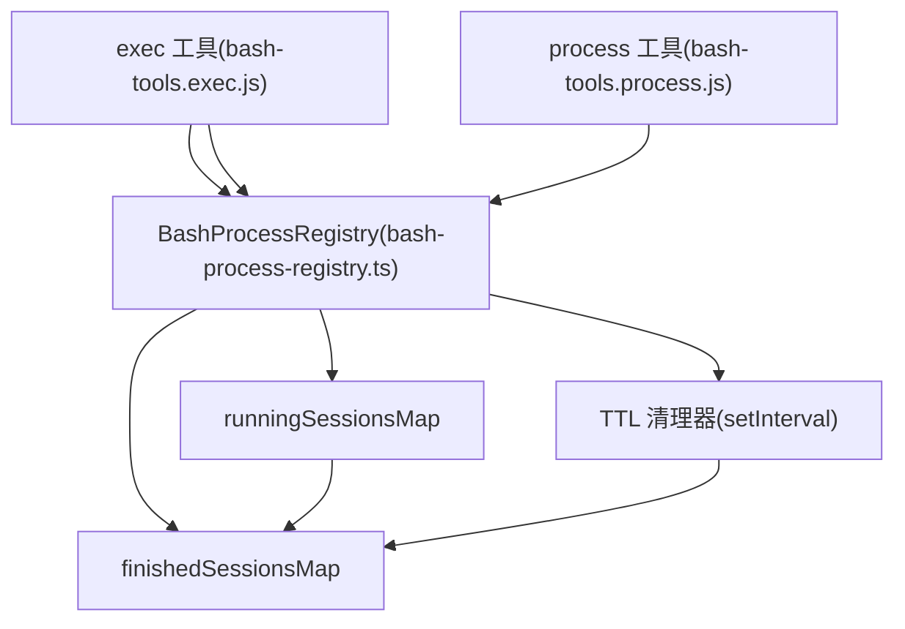

# Exec 工具与后台进程 (Exec Tool & Background Processes)

相关源文件

-   [docs/concepts/system-prompt.md](https://github.com/openclaw/openclaw/blob/8873e13f/docs/concepts/system-prompt.md)
-   [docs/gateway/background-process.md](https://github.com/openclaw/openclaw/blob/8873e13f/docs/gateway/background-process.md)
-   [src/agents/bash-process-registry.test.ts](https://github.com/openclaw/openclaw/blob/8873e13f/src/agents/bash-process-registry.test.ts)
-   [src/agents/bash-process-registry.ts](https://github.com/openclaw/openclaw/blob/8873e13f/src/agents/bash-process-registry.ts)
-   [src/agents/bash-tools.ts](https://github.com/openclaw/openclaw/blob/8873e13f/src/agents/bash-tools.ts)
-   [src/agents/pi-embedded-helpers.ts](https://github.com/openclaw/openclaw/blob/8873e13f/src/agents/pi-embedded-helpers.ts)
-   [src/agents/pi-embedded-runner.ts](https://github.com/openclaw/openclaw/blob/8873e13f/src/agents/pi-embedded-runner.ts)
-   [src/agents/pi-embedded-subscribe.ts](https://github.com/openclaw/openclaw/blob/8873e13f/src/agents/pi-embedded-subscribe.ts)
-   [src/agents/pi-tools.ts](https://github.com/openclaw/openclaw/blob/8873e13f/src/agents/pi-tools.ts)
-   [src/agents/system-prompt.test.ts](https://github.com/openclaw/openclaw/blob/8873e13f/src/agents/system-prompt.test.ts)
-   [src/agents/system-prompt.ts](https://github.com/openclaw/openclaw/blob/8873e13f/src/agents/system-prompt.ts)

本页记录了 `exec` 和 `process` 工具，它们允许 OpenClaw 智能体执行 shell 命令并管理后台作业。`exec` 工具用于衍生具有可配置超时和后台运行行为的 shell 命令，而 `process` 工具则通过轮询、标准输入写入和生命周期控制来管理长寿命会话。

有关工具策略和过滤，请参见 [工具系统 (Tools System)](/openclaw/openclaw/3.4-tools-system)。有关 exec 命令的沙箱隔离，请参见 [沙箱 (Sandboxing)](/openclaw/openclaw/7.2-sandboxing)。有关 exec 相关的配置字段，请参见 [配置参考 (Configuration Reference)](/openclaw/openclaw/2.3.1-configuration-reference)。

---

## 架构概览 (Architecture Overview)

exec 和 process 工具形成了一套配对系统：`exec` 负责衍生命令并根据需要将其转入后台，而 `process` 负责管理转入后台的会话。后台进程注册表 (background process registry) 维护正在运行和已结束会话的内存状态。

**图表：Exec 与 Process 工具架构**


**来源：** [src/agents/bash-tools.ts1-10](https://github.com/openclaw/openclaw/blob/8873e13f/src/agents/bash-tools.ts#L1-L10) [src/agents/bash-process-registry.ts73-310](https://github.com/openclaw/openclaw/blob/8873e13f/src/agents/bash-process-registry.ts#L73-L310)

---

## Exec 工具

`exec` 工具通过 `child_process.spawn` 衍生 shell 命令，支持 PTY 分配、后台执行、提权模式（从沙箱在宿主机执行）和输出捕获。它通过工具模式暴露给智能体，并将会话管理委派给进程注册表。

### 参数

| 参数 | 类型 | 默认值 | 描述 |
| --- | --- | --- | --- |
| `command` | `string` | (必填) | 要执行的 shell 命令 |
| `yieldMs` | `number` | `10000` (通过配置) | 超过此时长后自动转入后台 (毫秒) |
| `background` | `boolean` | `false` | 立即将命令转入后台 |
| `timeout` | `number` | `1800` (通过配置) | 超时后杀死进程 (秒) |
| `elevated` | `boolean` | `false` | 在宿主机运行（若已启用并允许提权模式） |
| `pty` | `boolean` | `false` | 分配伪终端 (pseudo-TTY，用于交互式 CLI) |
| `workdir` | `string` | (智能体工作区) | 执行的工作目录 |
| `env` | `Record<string, string>` | (继承 + 覆盖) | 环境变量 |

**来源：** [docs/gateway/background-process.md14-31](https://github.com/openclaw/openclaw/blob/8873e13f/docs/gateway/background-process.md#L14-L31) [src/agents/pi-tools.ts394-428](https://github.com/openclaw/openclaw/blob/8873e13f/src/agents/pi-tools.ts#L394-L428)

### 行为

1.  **前台执行**：当未超过 `yieldMs` 且 `background` 为 `false` 时，工具在完成后返回完整的 stdout/stderr。
2.  **后台执行**：当 `yieldMs` 过期或 `background` 为 `true` 时，工具返回 `status: "running"`、一个 `sessionId` 和一小段尾部输出。会话将在进程注册表中注册。
3.  **同步回退**：如果策略不允许使用 `process` 工具，`exec` 会忽略 `yieldMs` 和 `background`，并同步运行直至完成。
4.  **环境标记**：衍生的进程会接收到 `OPENCLAW_SHELL=exec`，以启用感知上下文的 shell 配置文件逻辑。

**来源：** [docs/gateway/background-process.md26-31](https://github.com/openclaw/openclaw/blob/8873e13f/docs/gateway/background-process.md#L26-L31) [src/agents/bash-tools.ts1-10](https://github.com/openclaw/openclaw/blob/8873e13f/src/agents/bash-tools.ts#L1-L10)

### 返回格式

**前台完成：**

```
{  "status": "completed",  "exitCode": 0,  "stdout": "...",  "stderr": "...",  "truncated": false}
```
**转入后台：**

```
{  "status": "running",  "sessionId": "abc123",  "pid": 12345,  "tail": "..."}
```
**来源：** [docs/gateway/background-process.md26-31](https://github.com/openclaw/openclaw/blob/8873e13f/docs/gateway/background-process.md#L26-L31)

---

## Process 工具

`process` 工具通过一系列动作管理转入后台的 exec 会话。会话作用域限定在 `scopeKey`（通常是每个会话或每个智能体），因此智能体只能看到自己的后台作业。

### 动作 (Actions)

| 动作 | 参数 | 描述 |
| --- | --- | --- |
| `list` | (无) | 列出正在运行和已结束的会话 |
| `poll` | `sessionId` | 排出自上次轮询以来的新输出；若已结束则报告退出状态 |
| `log` | `sessionId`, `offset?`, `limit?` | 读取聚合输出 (基于行的分页) |
| `write` | `sessionId`, `data`, `eof?` | 向标准输入 (stdin) 发送数据；可选通过 `eof: true` 关闭标准输入 |
| `kill` | `sessionId` | 终止正在运行的会话 (先 SIGTERM，后 SIGKILL) |
| `clear` | `sessionId` | 从内存中移除已结束的会话 |
| `remove` | `sessionId` | 若在运行则杀死，否则若已结束则清除 |

**来源：** [docs/gateway/background-process.md54-73](https://github.com/openclaw/openclaw/blob/8873e13f/docs/gateway/background-process.md#L54-L73) [src/agents/bash-process-registry.ts86-103](https://github.com/openclaw/openclaw/blob/8873e13f/src/agents/bash-process-registry.ts#L86-L103)

### List 输出格式

`list` 动作返回一个派生的 `name` 字段（命令动词 + 目标），以便快速识别：

```
{  "running": [    {      "id": "abc123",      "command": "npm run build",      "name": "npm: build",      "pid": 12345,      "startedAt": 1699999999000,      "cwd": "/workspace"    }  ],  "finished": [    {      "id": "def456",      "command": "git pull",      "name": "git: pull",      "status": "completed",      "exitCode": 0,      "startedAt": 1699999998000,      "endedAt": 1699999999000    }  ]}
```
**来源：** [docs/gateway/background-process.md54-73](https://github.com/openclaw/openclaw/blob/8873e13f/docs/gateway/background-process.md#L54-L73)

### 日志分页 (Log Pagination)

`log` 动作使用基于行的 `offset` 和 `limit`：

-   **默认（无 offset/limit）**：返回最后 200 行并附带分页提示。
-   **仅带 offset**：返回从 `offset` 到末尾的内容（不封顶）。
-   **两者皆有**：返回从 `offset` 开始的 `limit` 行。
