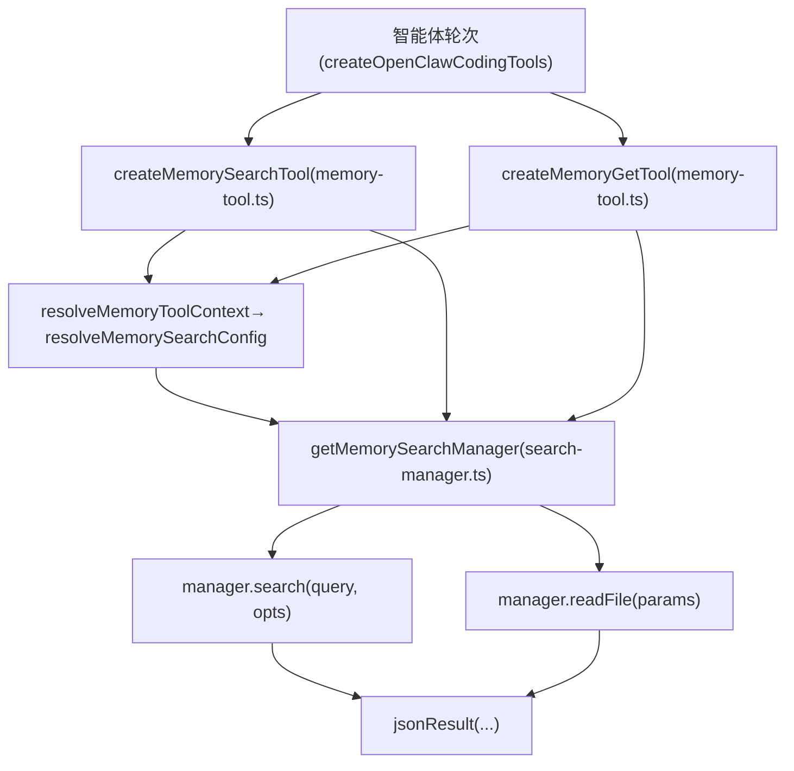
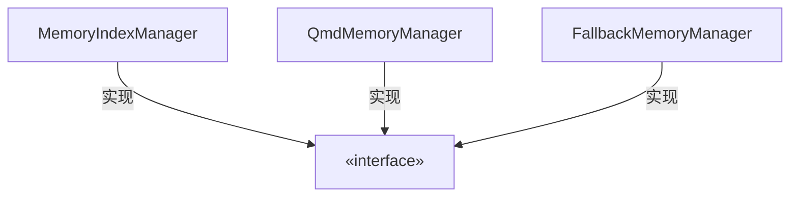
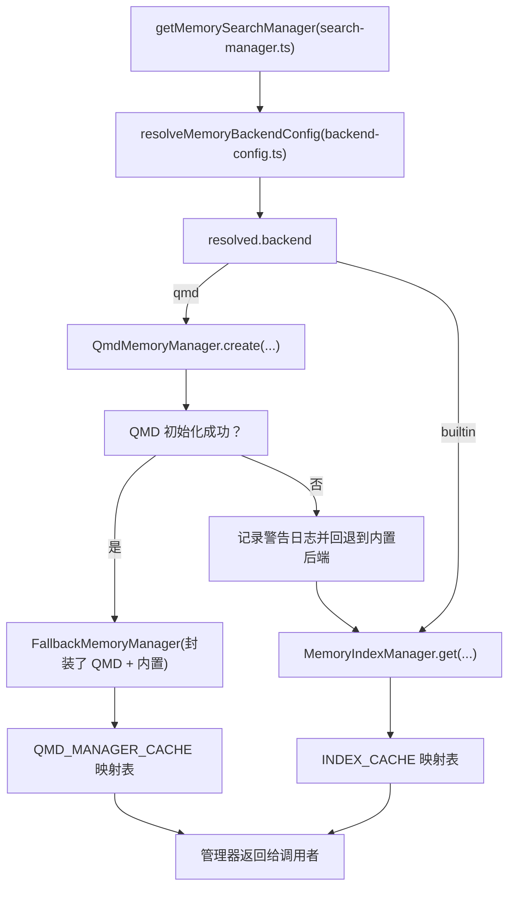
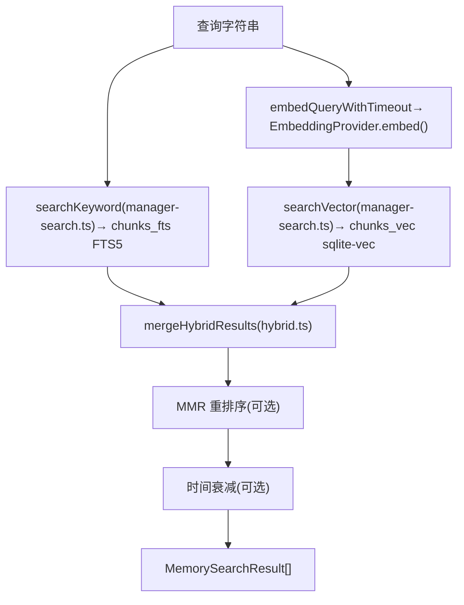
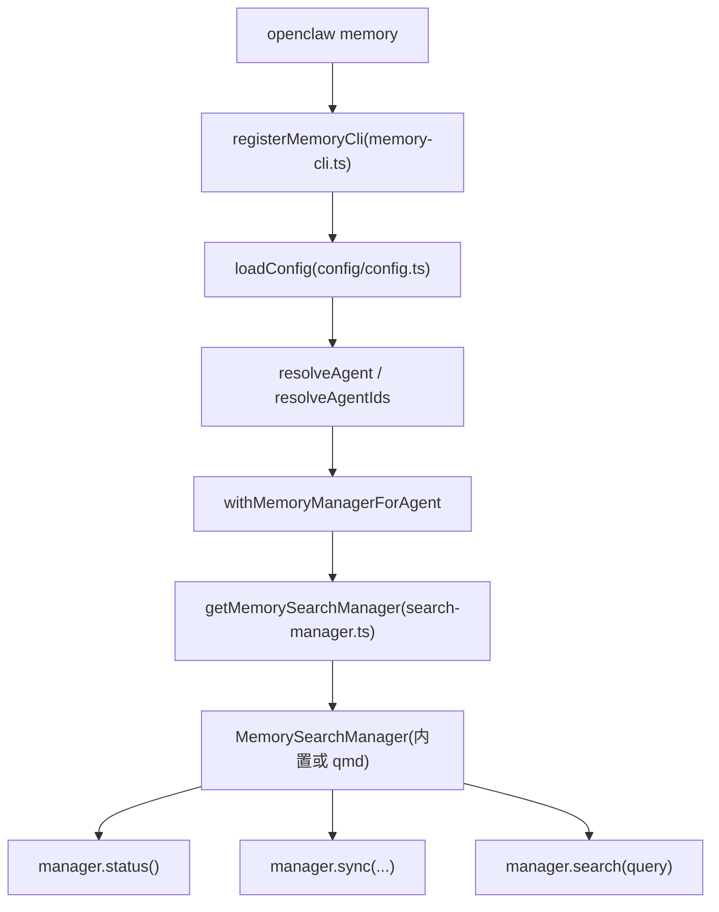

# 记忆工具 (Memory Tools)

相关源文件

-   [docs/cli/memory.md](https://github.com/openclaw/openclaw/blob/8873e13f/docs/cli/memory.md)
-   [docs/concepts/memory.md](https://github.com/openclaw/openclaw/blob/8873e13f/docs/concepts/memory.md)
-   [src/agents/memory-search.test.ts](https://github.com/openclaw/openclaw/blob/8873e13f/src/agents/memory-search.test.ts)
-   [src/agents/memory-search.ts](https://github.com/openclaw/openclaw/blob/8873e13f/src/agents/memory-search.ts)
-   [src/agents/tools/memory-tool.ts](https://github.com/openclaw/openclaw/blob/8873e13f/src/agents/tools/memory-tool.ts)
-   [src/cli/memory-cli.test.ts](https://github.com/openclaw/openclaw/blob/8873e13f/src/cli/memory-cli.test.ts)
-   [src/cli/memory-cli.ts](https://github.com/openclaw/openclaw/blob/8873e13f/src/cli/memory-cli.ts)
-   [src/config/schema.ts](https://github.com/openclaw/openclaw/blob/8873e13f/src/config/schema.ts)
-   [src/config/types.memory.ts](https://github.com/openclaw/openclaw/blob/8873e13f/src/config/types.memory.ts)
-   [src/config/types.tools.ts](https://github.com/openclaw/openclaw/blob/8873e13f/src/config/types.tools.ts)
-   [src/config/zod-schema.agent-runtime.ts](https://github.com/openclaw/openclaw/blob/8873e13f/src/config/zod-schema.agent-runtime.ts)
-   [src/memory/backend-config.test.ts](https://github.com/openclaw/openclaw/blob/8873e13f/src/memory/backend-config.test.ts)
-   [src/memory/backend-config.ts](https://github.com/openclaw/openclaw/blob/8873e13f/src/memory/backend-config.ts)
-   [src/memory/manager.ts](https://github.com/openclaw/openclaw/blob/8873e13f/src/memory/manager.ts)
-   [src/memory/qmd-manager.test.ts](https://github.com/openclaw/openclaw/blob/8873e13f/src/memory/qmd-manager.test.ts)
-   [src/memory/qmd-manager.ts](https://github.com/openclaw/openclaw/blob/8873e13f/src/memory/qmd-manager.ts)
-   [src/memory/search-manager.test.ts](https://github.com/openclaw/openclaw/blob/8873e13f/src/memory/search-manager.test.ts)
-   [src/memory/search-manager.ts](https://github.com/openclaw/openclaw/blob/8873e13f/src/memory/search-manager.ts)

本页涵盖了 `memory_search` 和 `memory_get` 智能体工具、`MemorySearchManager` 接口及其两个后端实现（`MemoryIndexManager` 和 `QmdMemoryManager`）、嵌入模型提供商的选择、向量/BM25/混合搜索机制，以及 `openclaw memory` CLI 命令。

有关记忆文件的更广泛概念（它们是什么、存放在智能体工作区的何处，以及压缩前的记忆刷新如何工作），请参见“Memory”概念文档。有关这些工具如何组装到呈现给智能体的完整工具集中的，请参见第 [3.4](https://github.com/openclaw/openclaw/blob/8873e13f/3.4) 页。

---

## 面向智能体的工具 (Agent-Facing Tools)

当为智能体启用记忆搜索时，会注册两个工具：

| 工具名称 | 创建函数 | 描述 |
| --- | --- | --- |
| `memory_search` | `createMemorySearchTool` | 语义搜索 `MEMORY.md` + `memory/*.md`（以及可选的会话转录）。返回带有路径和行号范围的顶层片段。 |
| `memory_get` | `createMemoryGetTool` | 通过工作区相对路径读取特定的记忆 Markdown 文件，可选地从起始行开始读取 N 行。 |

这两个函数都位于 [src/agents/tools/memory-tool.ts](https://github.com/openclaw/openclaw/blob/8873e13f/src/agents/tools/memory-tool.ts) 中，并共享一个通用的上下文解析器 `resolveMemoryToolContext`。该解析器在注册任一工具前，会检查 `resolveMemorySearchConfig` 是否返回非空结果。如果智能体禁用了记忆搜索，则不会添加这两个工具。

**工具参数：**

`memory_search` (`MemorySearchSchema`)：

-   `query` (字符串，必填)
-   `maxResults` (数字，可选)
-   `minScore` (数字，可选)

`memory_get` (`MemoryGetSchema`)：

-   `path` (字符串，必填) —— 工作区相对路径；必须位于 `MEMORY.md` 或 `memory/` 内
-   `from` (整数，可选) —— 从 1 开始的起始行号
-   `lines` (整数，可选) —— 要返回的行数

**`memory_search` 返回格式：**

```
{  "results": [ { "path": "MEMORY.md", "startLine": 1, "endLine": 20, "score": 0.87, "snippet": "..." } ],  "provider": "openai",  "model": "text-embedding-3-small",  "fallback": false,  "citations": "auto",  "mode": "search"}
```
如果管理器不可用（嵌入模型未配置、索引错误），`memory_search` 将返回 `{ "disabled": true }` 而不是抛出异常，以便智能体能够优雅地处理该问题。

对缺失文件执行 `memory_get` 会返回 `{ "text": "", "path": "<relpath>" }` 而不是抛出 `ENOENT`。

**图表：工具分发到管理器**


**来源：** [src/agents/tools/memory-tool.ts1-170](https://github.com/openclaw/openclaw/blob/8873e13f/src/agents/tools/memory-tool.ts#L1-L170)

---

## `MemorySearchManager` 接口

两个后端均实现了 `MemorySearchManager` 接口（定义于 `src/memory/types.ts`）：

| 方法 | 目的 |
| --- | --- |
| `search(query, opts?)` | 返回 `MemorySearchResult[]` |
| `readFile(params)` | 返回 `{ text, path }` |
| `sync(params?)` | 触发索引刷新 |
| `status()` | 返回 `MemoryProviderStatus` |
| `close()` | 释放资源 |
| `probeVectorAvailability()` | 检查 sqlite-vec 扩展（仅限内置后端） |
| `probeEmbeddingAvailability()` | 检查嵌入模型提供商的连接性 |

`MemorySearchResult` 字段：`path`、`startLine`、`endLine`、`score`、`snippet`、`source` (`"memory"` | `"sessions"`)。

**图表：MemorySearchManager 实现类**


**来源：** [src/memory/manager.ts44-212](https://github.com/openclaw/openclaw/blob/8873e13f/src/memory/manager.ts#L44-L212) [src/memory/qmd-manager.ts141-242](https://github.com/openclaw/openclaw/blob/8873e13f/src/memory/qmd-manager.ts#L141-L242) [src/memory/search-manager.ts75-180](https://github.com/openclaw/openclaw/blob/8873e13f/src/memory/search-manager.ts#L75-L180)

---

## 后端选择 (Backend Selection)

[src/memory/search-manager.ts](https://github.com/openclaw/openclaw/blob/8873e13f/src/memory/search-manager.ts) 中的 `getMemorySearchManager` 是工具和 CLI 的唯一入口点。它读取 `resolveMemoryBackendConfig` 并路由到正确的实现。

**图表：后端选择流程**


`resolveMemoryBackendConfig` 读取 `cfg.memory.backend`（默认值：`"builtin"`）并生成一个 `ResolvedMemoryBackendConfig`。对于 QMD 路径，它还将集合、更新间隔和限制解析为 `ResolvedQmdConfig`。

当 `purpose = "status"`（由 CLI 使用）时，`getMemorySearchManager` 会跳过 `FallbackMemoryManager` 封装器并跳过缓存 —— 它会创建一个不启动定时器或运行启动更新的轻量级实例。

**来源：** [src/memory/search-manager.ts19-73](https://github.com/openclaw/openclaw/blob/8873e13f/src/memory/search-manager.ts#L19-L73) [src/memory/backend-config.ts1-72](https://github.com/openclaw/openclaw/blob/8873e13f/src/memory/backend-config.ts#L1-L72)

---

## 内置后端 (Builtin Backend) — `MemoryIndexManager`

[src/memory/manager.ts](https://github.com/openclaw/openclaw/blob/8873e13f/src/memory/manager.ts) 中的 `MemoryIndexManager` 使用 Node.js 内置的 `DatabaseSync` (SQLite)，并带有一个可选的用于向量搜索的扩展。

### SQLite 模式 (Schema)

| 表名 | 目的 |
| --- | --- |
| `files` | 每个已索引的 Markdown 文件占一行；存储路径、修改时间、哈希值和来源 |
| `chunks` | 从每个文件派生出的文本块（~`DEFAULT_CHUNK_TOKENS` = 400 token，`DEFAULT_CHUNK_OVERLAP` = 80 重叠） |
| `chunks_vec` (`VECTOR_TABLE`) | sqlite-vec 虚表；存储每个块的嵌入向量 |
| `chunks_fts` (`FTS_TABLE`) | FTS5 虚表，用于 BM25 关键词搜索 |
| `embedding_cache` (`EMBEDDING_CACHE_TABLE`) | 缓存以内容哈希为键的嵌入向量 |

数据库默认存储在 `~/.openclaw/memory/<agentId>.sqlite`（可通过 `agents.defaults.memorySearch.store.path` 配置，支持 `{agentId}` 令牌）。

### 嵌入模型提供商 (Embedding Providers)

`src/memory/embeddings.ts` 中的 `createEmbeddingProvider` 用于选择并初始化嵌入模型客户端。当 `memorySearch.provider = "auto"` 时，提供商的自动选择顺序如下：

1.  `local` —— 如果磁盘上存在 `memorySearch.local.modelPath`
2.  `openai` —— 如果可以解析出 OpenAI API 密钥
3.  `gemini` —— 如果 Gemini API 密钥可用
4.  `voyage` —— 如果 Voyage API 密钥可用
5.  `mistral` —— 如果 Mistral API 密钥可用
6.  无提供商 —— 仅限 FTS 模式（只有 BM25，无向量搜索）

| 提供商 | 默认模型 | 密钥来源 |
| --- | --- | --- |
| `openai` | `text-embedding-3-small` | 认证配置文件 / `OPENAI_API_KEY` |
| `gemini` | `gemini-embedding-001` | `GEMINI_API_KEY` / `models.providers.google.apiKey` |
| `voyage` | `voyage-4-large` | `VOYAGE_API_KEY` / `models.providers.voyage.apiKey` |
| `mistral` | `mistral-embed` | `MISTRAL_API_KEY` / `models.providers.mistral.apiKey` |
| `local` | 用户指定的 GGUF | `memorySearch.local.modelPath` |

**来源：** [src/agents/memory-search.ts81-100](https://github.com/openclaw/openclaw/blob/8873e13f/src/agents/memory-search.ts#L81-L100) [src/memory/manager.ts128-212](https://github.com/openclaw/openclaw/blob/8873e13f/src/memory/manager.ts#L128-L212)

### 同步与索引 (Sync and Indexing)

管理器使用 `chokidar` 监视 `MEMORY.md` 和 `memory/`（去抖动处理，默认 1500 毫秒）。同步也可以由以下条件触发：

-   会话启动时 (`sync.onSessionStart = true`)
-   每次搜索调用且索引已脏时 (`sync.onSearch = true`)
-   周期性定时器 (`sync.intervalMinutes`)
-   通过 `memory index` CLI 命令

会话转录的索引受 `delta` 阈值（`sync.sessions.deltaBytes`, `sync.sessions.deltaMessages`）门控，以避免每轮都重新索引。

如果 SQLite 句柄变为只读（例如在文件系统重新挂载后），`runSyncWithReadonlyRecovery` 会重新打开数据库并在报错前重试一次。

### 混合搜索管道 (Hybrid Search Pipeline)

**图表：`MemoryIndexManager.search()` 执行流程**


评分组合（来自 [src/memory/hybrid.ts](https://github.com/openclaw/openclaw/blob/8873e13f/src/memory/hybrid.ts)）：

```
textScore  = 1 / (1 + max(0, bm25Rank))
finalScore = vectorWeight * vectorScore + textWeight * textScore
```
默认值：`vectorWeight = 0.7`, `textWeight = 0.3`, `candidateMultiplier = 4`, `maxResults = 6`, `minScore = 0.35`。

如果嵌入提供商返回全零向量，则仅使用关键词搜索结果。如果 FTS5 不可用，则仅使用向量搜索结果。

可选的后处理步骤：

-   **MMR** (Maximal Marginal Relevance, 最大边际相关性)：通过惩罚与已选块类似的块来减少冗余。默认禁用。由 `memorySearch.query.hybrid.mmr` 控制。
-   **时间衰减 (Temporal decay)**：降低旧块的权重。默认禁用。默认半衰期为 30 天。

**来源：** [src/memory/manager.ts230-316](https://github.com/openclaw/openclaw/blob/8873e13f/src/memory/manager.ts#L230-L316) [src/memory/hybrid.ts](https://github.com/openclaw/openclaw/blob/8873e13f/src/memory/hybrid.ts) [src/memory/manager-search.ts](https://github.com/openclaw/openclaw/blob/8873e13f/src/memory/manager-search.ts) [src/agents/memory-search.ts91-99](https://github.com/openclaw/openclaw/blob/8873e13f/src/agents/memory-search.ts#L91-L99)

---

## QMD 后端 (QMD Backend) — `QmdMemoryManager`

[src/memory/qmd-manager.ts](https://github.com/openclaw/openclaw/blob/8873e13f/src/memory/qmd-manager.ts) 中的 `QmdMemoryManager` 通过 shell 调用 `qmd` CLI 二进制文件进行所有的索引和检索操作。Markdown 文件仍然是事实来源；QMD 在其内部管理自己的 SQLite 索引。

### XDG 隔离

每个智能体都获得一个独立的 QMD 主目录：

```
~/.openclaw/agents/<agentId>/qmd/
  xdg-config/   ← XDG_CONFIG_HOME
  xdg-cache/    ← XDG_CACHE_HOME
    qmd/
      index.sqlite   ← QMD 的 SQLite 数据库 (indexPath)
      models/        ← 软链接自 ~/.cache/qmd/models/ 以共享下载
  sessions/     ← 会话转录导出（若启用）
```
传递给每次 `spawn` 调用的 `env` 对象包含 `XDG_CONFIG_HOME`、`XDG_CACHE_HOME` 和 `NO_COLOR=1`。

### 集合管理 (Collection Management)

QMD 集合将集合名称映射到文件系统路径 + glob 模式。`QmdMemoryManager.ensureCollections()` 在启动时运行：

1.  通过 `qmd collection list --json` 列出已有集合。
2.  通过 `migrateLegacyUnscopedCollections` 迁移旧的不带作用域的集合名称（例如 `memory-root` → `memory-root-main`）。
3.  重新绑定任何路径指向其他智能体目录的集合。
4.  通过 `qmd collection add <path> --name <name> --mask <pattern>` 添加缺失的集合。

当 `memory.qmd.includeDefaultMemory = true` 时的默认集合：

| 集合名称 | 路径 | 模式 |
| --- | --- | --- |
| `memory-root-<agentId>` | 工作区 | `MEMORY.md` |
| `memory-alt-<agentId>` | 工作区 | `memory.md` |
| `memory-dir-<agentId>` | 工作区/memory | `**/*.md` |

来自 `memory.qmd.paths[]` 的额外集合将以用户提供的稳定名称添加。

当 `memory.qmd.sessions.enabled = true` 时，会添加一个指向会话导出目录的 `sessions-<agentId>` 集合。

### 搜索模式 (Search Modes)

`memory.qmd.searchMode` 设置（默认值：`"search"`）控制使用哪个子命令：

| `searchMode` | 使用的 QMD 命令 |
| --- | --- |
| `"search"` | `qmd search <query> --json -n <maxResults> -c <collection>` |
| `"vsearch"` | `qmd vsearch <query> --json -n <maxResults> -c <collection>` |
| `"query"` | `qmd query <query> --json -n <maxResults> -c <collection>` |

如果选择的模式因“不支持标志”错误而失败，管理器将使用 `qmd query` 进行重试。

### 更新周期 (Update Cycle)

`runUpdate` 按顺序执行 shell 命令：

1.  `qmd update` —— 重新摄取更改的文档。
2.  `qmd embed` —— 重新生成嵌入向量（通过全局序列化锁 `runWithQmdEmbedLock` 运行，以避免并发智能体产生竞态）。

**定时器：**

-   启动更新：可选，默认在后台运行 (`memory.qmd.update.waitForBootSync = false`)。
-   周期性更新：由 `setInterval` 触发，间隔为 `memory.qmd.update.intervalMs`（默认 5 分钟）。
-   去抖动：`memory.qmd.update.debounceMs` 防止重复同步（默认 60 秒）。

### 空字节恢复 (Null-byte Recovery)

如果 `qmd update` 失败且错误消息匹配 `NUL_MARKER_RE`（如 `^@`, `\0`, `null byte` 等模式），管理器会认为集合元数据已损坏，移除并重新添加所有受管理的集合，并重试一次更新。非空字节导致的失败将原样传播。

### 回退行为 (Fallback Behaviour)

`getMemorySearchManager` 将 `QmdMemoryManager` 封装在 `FallbackMemoryManager` 中。在第一次 `search()` 失败时，`FallbackMemoryManager` 会执行：

1.  标记 `primaryFailed = true`。
2.  关闭 QMD 管理器。
3.  驱逐 `QMD_MANAGER_CACHE` 中的条目。
4.  在随后的调用中激活 `MemoryIndexManager` 作为回退。

**来源：** [src/memory/qmd-manager.ts141-300](https://github.com/openclaw/openclaw/blob/8873e13f/src/memory/qmd-manager.ts#L141-L300) [src/memory/search-manager.ts75-140](https://github.com/openclaw/openclaw/blob/8873e13f/src/memory/search-manager.ts#L75-L140) [src/memory/backend-config.ts60-160](https://github.com/openclaw/openclaw/blob/8873e13f/src/memory/backend-config.ts#L60-L160)

---

## 配置参考 (Configuration Reference)

### 内置后端 (`agents.defaults.memorySearch`)

针对每个智能体在 `agents.defaults.memorySearch` 进行配置（并在 `agents.list[*].memorySearch` 中进行针对每个智能体的覆盖）。由 [src/agents/memory-search.ts](https://github.com/openclaw/openclaw/blob/8873e13f/src/agents/memory-search.ts) 中的 `resolveMemorySearchConfig` 进行解析。

| 字段 | 默认值 | 描述 |
| --- | --- | --- |
| `enabled` | `true` | 启用/禁用记忆工具 |
| `provider` | `"auto"` | 嵌入模型提供商 |
| `model` | 提供商默认值 | 嵌入模型 ID |
| `fallback` | `"none"` | 主提供商失败时的回退提供商 |
| `store.path` | `~/.openclaw/memory/<agentId>.sqlite` | SQLite 数据库路径 |
| `store.vector.enabled` | `true` | 启用 sqlite-vec 向量索引 |
| `store.vector.extensionPath` | — | `sqlite-vec` 共享库路径 |
| `chunking.tokens` | `400` | 目标每个块的 token 数 |
| `chunking.overlap` | `80` | 块之间的重叠 token 数 |
| `query.maxResults` | `6` | 最大搜索结果数 |
| `query.minScore` | `0.35` | 最小相似度评分 |
| `query.hybrid.enabled` | `true` | 启用 BM25 + 向量的混合搜索 |
| `query.hybrid.vectorWeight` | `0.7` | 向量评分权重 |
| `query.hybrid.textWeight` | `0.3` | BM25 评分权重 |
| `query.hybrid.candidateMultiplier` | `4` | 候选池乘数 |
| `query.hybrid.mmr.enabled` | `false` | 启用 MMR 重排序 |
| `query.hybrid.temporalDecay.enabled` | `false` | 启用时间衰减 |
| `sync.watch` | `true` | 监视文件更改 |
| `sync.watchDebounceMs` | `1500` | 监视去抖动延迟 |
| `sync.onSessionStart` | `true` | 在每次会话启动时同步 |
| `sync.onSearch` | `false` | 在每次搜索前同步 |
| `cache.enabled` | `true` | 启用嵌入向量缓存 |
| `extraPaths` | `[]` | 额外要建立索引的目录/文件 |

### QMD 后端 (`memory.qmd.*`)

通过 `memory.backend = "qmd"` 激活。模式定义于 [src/config/zod-schema.ts100-112](https://github.com/openclaw/openclaw/blob/8873e13f/src/config/zod-schema.ts#L100-L112) (`MemoryQmdSchema`)。类型定义于 [src/config/types.memory.ts](https://github.com/openclaw/openclaw/blob/8873e13f/src/config/types.memory.ts)。

| 字段 | 默认值 | 描述 |
| --- | --- | --- |
| `memory.backend` | `"builtin"` | `"builtin"` 或 `"qmd"` |
| `memory.citations` | `"auto"` | `"auto"`, `"on"`, `"off"` —— 控制片段中的 `Source:` 页脚 |
| `memory.qmd.command` | `"qmd"` | QMD 二进制文件的路径/名称 |
| `memory.qmd.searchMode` | `"search"` | `"search"`, `"vsearch"`, `"query"` |
| `memory.qmd.includeDefaultMemory` | `true` | 自动添加 `MEMORY.md` + `memory/**` 集合 |
| `memory.qmd.paths[]` | `[]` | 额外集合：`{ path, name?, pattern? }` |
| `memory.qmd.sessions.enabled` | `false` | 导出会话转录以供索引 |
| `memory.qmd.sessions.retentionDays` | — | 清理超过 N 天的会话导出 |
| `memory.qmd.update.interval` | `"5m"` | 周期性更新间隔 |
| `memory.qmd.update.debounceMs` | `60000` | 更新之间的最小毫秒数 |
| `memory.qmd.update.onBoot` | `true` | 在网关启动时运行更新 |
| `memory.qmd.update.waitForBootSync` | `false` | 阻塞启动直至启动更新完成 |
| `memory.qmd.update.commandTimeoutMs` | `30000` | 引导 QMD 命令的超时时间 |
| `memory.qmd.update.updateTimeoutMs` | `120000` | `qmd update` 的超时时间 |
| `memory.qmd.update.embedTimeoutMs` | `120000` | `qmd embed` 的超时时间 |
| `memory.qmd.limits.maxResults` | `6` | 返回的最大搜索结果数 |
| `memory.qmd.limits.maxSnippetChars` | — | 截断每个片段 |
| `memory.qmd.limits.maxInjectedChars` | — | 所有结果的总字符预算 |
| `memory.qmd.limits.timeoutMs` | — | 搜索子进程的超时时间 |
| `memory.qmd.scope` | 仅限私信 | `SessionSendPolicyConfig` —— 控制哪些会话可以使用 QMD 结果 |

示例最小 QMD 配置：

```
{  memory: {    backend: "qmd",    citations: "auto",    qmd: {      includeDefaultMemory: true,      update: { interval: "5m", debounceMs: 15000 },      limits: { maxResults: 6, timeoutMs: 4000 }    }  }}
```
**来源：** [src/config/zod-schema.ts44-121](https://github.com/openclaw/openclaw/blob/8873e13f/src/config/zod-schema.ts#L44-L121) [src/config/types.memory.ts1-68](https://github.com/openclaw/openclaw/blob/8873e13f/src/config/types.memory.ts#L1-L68) [src/memory/backend-config.ts72-160](https://github.com/openclaw/openclaw/blob/8873e13f/src/memory/backend-config.ts#L72-L160)

---

## `openclaw memory` CLI

由 [src/cli/memory-cli.ts](https://github.com/openclaw/openclaw/blob/8873e13f/src/cli/memory-cli.ts) 中的 `registerMemoryCli` 注册。所有命令在内部都会调用 `getMemorySearchManager`。

| 命令 | 作用 |
| --- | --- |
| `openclaw memory status` | 显示提供商、模型、文件/块计数、向量可用性、FTS 状态、缓存信息 |
| `openclaw memory status --deep` | 同时探测嵌入模型 API 的连接性 (`probeEmbeddingAvailability`) |
| `openclaw memory status --deep --index` | 如果索引已脏，运行 `sync({ reason: "cli", force: false })` |
| `openclaw memory index` | 强制运行 `sync({ reason: "cli", force: false })` 并输出进度 |
| `openclaw memory index --force` | 无论脏标志如何，强制执行完整重新索引 |
| `openclaw memory search <query>` | 调用 `manager.search()` 并打印结果 |

常用标志：

-   `--agent <id>` —— 限定到特定智能体（对于 `status` 默认为所有已配置智能体，对于其他命令默认为默认智能体）
-   `--verbose` —— 通过 `setVerbose(true)` 启用详细日志
-   `--json` —— 以 JSON 格式输出

**图表：CLI → 管理器链路**


**来源：** [src/cli/memory-cli.ts86-109](https://github.com/openclaw/openclaw/blob/8873e13f/src/cli/memory-cli.ts#L86-L109) [src/cli/memory-cli.ts1-50](https://github.com/openclaw/openclaw/blob/8873e13f/src/cli/memory-cli.ts#L1-L50)

---

## 路径访问护栏 (Path Access Guards)

`memory_get` 强制要求 `relPath` 解析为工作区记忆区域内的文件。允许的集合包括：

-   匹配 `isMemoryPath(relPath)` 的文件 —— 路径以 `MEMORY.md`、`memory.md` 或 `memory/` 开头。
-   位于 `memorySearch.extraPaths`（针对内置后端）所列目录内的文件。
-   带有 `qmd/<collection>/` 前缀的路径（针对 QMD 后端；`memory_get` 会将这些映射回集合的文件系统根目录）。

符号链接 (Symlinks) 始终被拒绝。仅允许 `.md` 文件。绝对路径会被解析，然后通过 `path.relative` 检查以确认它们留在允许的根目录内。

**来源：** [src/memory/manager.ts505-576](https://github.com/openclaw/openclaw/blob/8873e13f/src/memory/manager.ts#L505-L576) [src/agents/tools/memory-tool.ts101-130](https://github.com/openclaw/openclaw/blob/8873e13f/src/agents/tools/memory-tool.ts#L101-L130)
