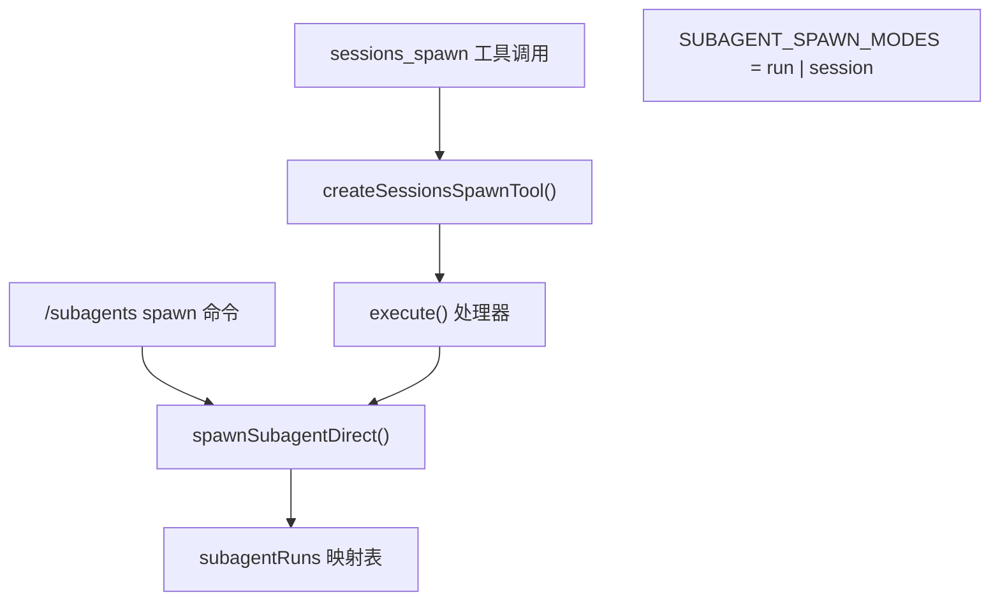
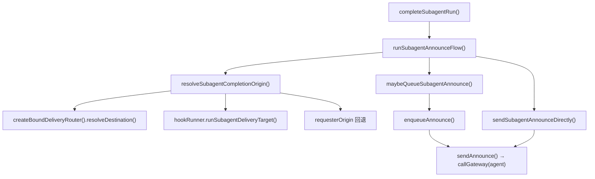
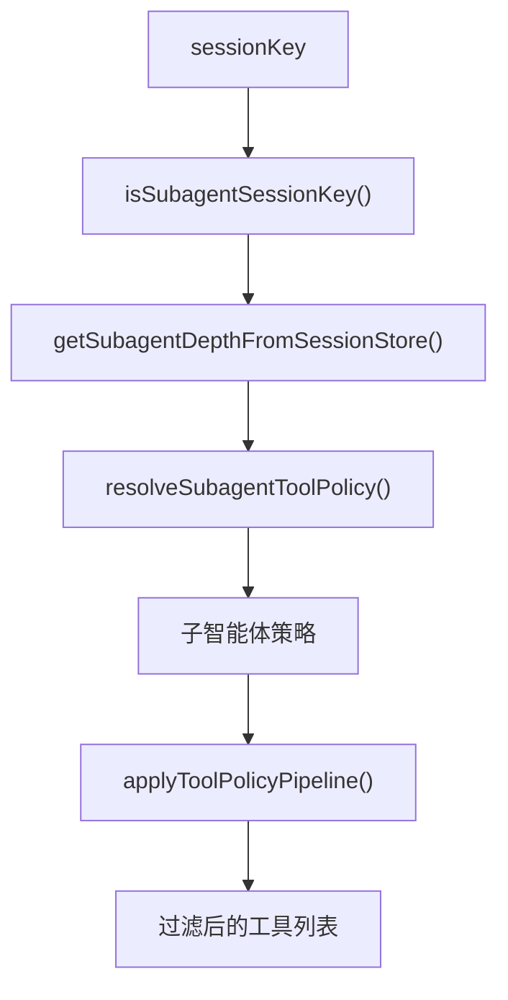

# 子智能体 (Subagents)

相关源文件

-   [docs/channels/discord.md](https://github.com/openclaw/openclaw/blob/8873e13f/docs/channels/discord.md)
-   [docs/channels/telegram.md](https://github.com/openclaw/openclaw/blob/8873e13f/docs/channels/telegram.md)
-   [docs/concepts/system-prompt.md](https://github.com/openclaw/openclaw/blob/8873e13f/docs/concepts/system-prompt.md)
-   [docs/gateway/background-process.md](https://github.com/openclaw/openclaw/blob/8873e13f/docs/gateway/background-process.md)
-   [docs/gateway/configuration-reference.md](https://github.com/openclaw/openclaw/blob/8873e13f/docs/gateway/configuration-reference.md)
-   [src/acp/control-plane/manager.core.ts](https://github.com/openclaw/openclaw/blob/8873e13f/src/acp/control-plane/manager.core.ts)
-   [src/agents/bash-process-registry.test.ts](https://github.com/openclaw/openclaw/blob/8873e13f/src/agents/bash-process-registry.test.ts)
-   [src/agents/bash-process-registry.ts](https://github.com/openclaw/openclaw/blob/8873e13f/src/agents/bash-process-registry.ts)
-   [src/agents/bash-tools.ts](https://github.com/openclaw/openclaw/blob/8873e13f/src/agents/bash-tools.ts)
-   [src/agents/pi-embedded-helpers.ts](https://github.com/openclaw/openclaw/blob/8873e13f/src/agents/pi-embedded-helpers.ts)
-   [src/agents/pi-embedded-runner.ts](https://github.com/openclaw/openclaw/blob/8873e13f/src/agents/pi-embedded-runner.ts)
-   [src/agents/pi-embedded-runner/tool-result-char-estimator.ts](https://github.com/openclaw/openclaw/blob/8873e13f/src/agents/pi-embedded-runner/tool-result-char-estimator.ts)
-   [src/agents/pi-embedded-runner/tool-result-context-guard.ts](https://github.com/openclaw/openclaw/blob/8873e13f/src/agents/pi-embedded-runner/tool-result-context-guard.ts)
-   [src/agents/pi-embedded-subscribe.ts](https://github.com/openclaw/openclaw/blob/8873e13f/src/agents/pi-embedded-subscribe.ts)
-   [src/agents/pi-tools.ts](https://github.com/openclaw/openclaw/blob/8873e13f/src/agents/pi-tools.ts)
-   [src/agents/system-prompt.test.ts](https://github.com/openclaw/openclaw/blob/8873e13f/src/agents/system-prompt.test.ts)
-   [src/agents/system-prompt.ts](https://github.com/openclaw/openclaw/blob/8873e13f/src/agents/system-prompt.ts)
-   [src/agents/tools/telegram-actions.test.ts](https://github.com/openclaw/openclaw/blob/8873e13f/src/agents/tools/telegram-actions.test.ts)
-   [src/agents/tools/telegram-actions.ts](https://github.com/openclaw/openclaw/blob/8873e13f/src/agents/tools/telegram-actions.ts)
-   [src/auto-reply/skill-commands.test.ts](https://github.com/openclaw/openclaw/blob/8873e13f/src/auto-reply/skill-commands.test.ts)
-   [src/auto-reply/skill-commands.ts](https://github.com/openclaw/openclaw/blob/8873e13f/src/auto-reply/skill-commands.ts)
-   [src/channels/allowlists/resolve-utils.test.ts](https://github.com/openclaw/openclaw/blob/8873e13f/src/channels/allowlists/resolve-utils.test.ts)
-   [src/channels/allowlists/resolve-utils.ts](https://github.com/openclaw/openclaw/blob/8873e13f/src/channels/allowlists/resolve-utils.ts)
-   [src/channels/plugins/actions/actions.test.ts](https://github.com/openclaw/openclaw/blob/8873e13f/src/channels/plugins/actions/actions.test.ts)
-   [src/channels/plugins/actions/telegram.ts](https://github.com/openclaw/openclaw/blob/8873e13f/src/channels/plugins/actions/telegram.ts)
-   [src/config/schema.help.quality.test.ts](https://github.com/openclaw/openclaw/blob/8873e13f/src/config/schema.help.quality.test.ts)
-   [src/config/schema.help.ts](https://github.com/openclaw/openclaw/blob/8873e13f/src/config/schema.help.ts)
-   [src/config/schema.labels.ts](https://github.com/openclaw/openclaw/blob/8873e13f/src/config/schema.labels.ts)
-   [src/config/types.agent-defaults.ts](https://github.com/openclaw/openclaw/blob/8873e13f/src/config/types.agent-defaults.ts)
-   [src/config/types.discord.ts](https://github.com/openclaw/openclaw/blob/8873e13f/src/config/types.discord.ts)
-   [src/config/types.telegram.ts](https://github.com/openclaw/openclaw/blob/8873e13f/src/config/types.telegram.ts)
-   [src/config/zod-schema.agent-defaults.ts](https://github.com/openclaw/openclaw/blob/8873e13f/src/config/zod-schema.agent-defaults.ts)
-   [src/config/zod-schema.providers-core.ts](https://github.com/openclaw/openclaw/blob/8873e13f/src/config/zod-schema.providers-core.ts)
-   [src/discord/monitor.test.ts](https://github.com/openclaw/openclaw/blob/8873e13f/src/discord/monitor.test.ts)
-   [src/discord/monitor/listeners.test.ts](https://github.com/openclaw/openclaw/blob/8873e13f/src/discord/monitor/listeners.test.ts)
-   [src/discord/monitor/listeners.ts](https://github.com/openclaw/openclaw/blob/8873e13f/src/discord/monitor/listeners.ts)
-   [src/discord/monitor/provider.allowlist.test.ts](https://github.com/openclaw/openclaw/blob/8873e13f/src/discord/monitor/provider.allowlist.test.ts)
-   [src/discord/monitor/provider.allowlist.ts](https://github.com/openclaw/openclaw/blob/8873e13f/src/discord/monitor/provider.allowlist.ts)
-   [src/discord/monitor/provider.skill-dedupe.test.ts](https://github.com/openclaw/openclaw/blob/8873e13f/src/discord/monitor/provider.skill-dedupe.test.ts)
-   [src/discord/monitor/provider.test.ts](https://github.com/openclaw/openclaw/blob/8873e13f/src/discord/monitor/provider.test.ts)
-   [src/discord/monitor/provider.ts](https://github.com/openclaw/openclaw/blob/8873e13f/src/discord/monitor/provider.ts)
-   [src/slack/monitor/provider.ts](https://github.com/openclaw/openclaw/blob/8873e13f/src/slack/monitor/provider.ts)
-   [src/telegram/send.test.ts](https://github.com/openclaw/openclaw/blob/8873e13f/src/telegram/send.test.ts)
-   [src/telegram/send.ts](https://github.com/openclaw/openclaw/blob/8873e13f/src/telegram/send.ts)

本页涵盖了 OpenClaw 如何通过 `sessions_spawn` 工具衍生子智能体会话、这些会话在子智能体注册表中的生命周期、将结果返回给请求者的公告流 (announce flow)、深度限制，以及应用于子智能体会话的工具策略限制。

有关通用的会话管理概念（会话密钥、转录、会话存储），请参见 [2.4](/openclaw/openclaw/2.4-session-management)。有关门控子智能体获得哪些工具的工具策略管道，请参见 [3.4](/openclaw/openclaw/3.4-tools-system)。对于具有独立运行路径的 ACP 运行时子智能体 (`runtime: "acp"`)，请参见 ACP 智能体文档。

---

## 概览 (Overview)

子智能体是在其自身隔离会话中执行的智能体运行，由父智能体轮次或用户命令 (`/subagents spawn`) 请求衍生。当子智能体完成任务时，它会通过公告流将其结果**公告**回请求者的聊天通道。

子智能体实现了以下功能：

-   并行或后台工作，而不阻塞主智能体轮次
-   会话级隔离（独立的上下文窗口、独立的工具范围）
-   通过深度限制实现可配置的嵌套

每个子智能体会话密钥的格式为 `agent:<agentId>:subagent:<uuid>`，可通过 `src/routing/session-key.ts` 中的 `isSubagentSessionKey` 进行识别。

---

## 衍生入口点 (Spawn Entry Points)

衍生子智能体有两种方式：

| 入口点 | 描述 |
| --- | --- |
| `sessions_spawn` 工具（智能体调用） | 正在运行的智能体在轮次期间调用该工具 |
| `/subagents spawn` 斜杠命令 | 用户直接在聊天中发出命令 |

两者最终都会调用 `src/agents/subagent-spawn.ts` 中的 `spawnSubagentDirect`。

**图表：衍生入口点到代码实体的映射**


**来源：** [src/agents/tools/sessions-spawn-tool.ts1-119](https://github.com/openclaw/openclaw/blob/8873e13f/src/agents/tools/sessions-spawn-tool.ts#L1-L119) [src/agents/subagent-registry.ts48-55](https://github.com/openclaw/openclaw/blob/8873e13f/src/agents/subagent-registry.ts#L48-L55)

---

## `sessions_spawn` 工具参数

由 `src/agents/tools/sessions-spawn-tool.ts` 中的 `createSessionsSpawnTool` 定义。

| 参数 | 类型 | 默认值 | 描述 |
| --- | --- | --- | --- |
| `task` | 字符串 (必填) | — | 作为子智能体提示词发送的任务描述 |
| `label` | 字符串? | — | 会话的人性化标签 |
| `runtime` | `"subagent"` | `"acp"` | `"subagent"` | 使用哪种运行环境 |
| `agentId` | 字符串? | 调用者的智能体 ID | 在不同的智能体身份下衍生 |
| `model` | 字符串? | 继承 | 覆盖此运行的模型 |
| `thinking` | 字符串? | 继承 | 覆盖思考级别 |
| `runTimeoutSeconds` | 数字? | `agents.defaults.subagents.runTimeoutSeconds` 或 `0` | 在 N 秒后中止运行 |
| `thread` | 布尔值 | `false` | 请求通道线程绑定 |
| `mode` | `"run"` | `"session"` | `"run"` (或当 `thread: true` 时为 `"session"`) | 一次性任务 vs 持久会话 |
| `cleanup` | `"delete"` | `"keep"` | `"keep"` | 完成后是否删除会话 |

`mode: "session"` 要求 `thread: true`。当 `thread: true` 且省略 `mode` 时，mode 默认为 `"session"`。

该工具立即返回 `status: "accepted"` —— 它是非阻塞的。

**来源：** [src/agents/tools/sessions-spawn-tool.ts11-119](https://github.com/openclaw/openclaw/blob/8873e13f/src/agents/tools/sessions-spawn-tool.ts#L11-L119)

---

## 子智能体生命周期 (Subagent Lifecycle)

**图表：子智能体运行生命周期与注册表状态转换**

**来源：** [src/agents/subagent-registry.ts213-272](https://github.com/openclaw/openclaw/blob/8873e13f/src/agents/subagent-registry.ts#L213-L272) [src/agents/subagent-registry.ts48-92](https://github.com/openclaw/openclaw/blob/8873e13f/src/agents/subagent-registry.ts#L48-L92)

### 注册表 (Registry)

子智能体注册表是 `src/agents/subagent-registry.ts` 中的一个模块级 `Map`：

```
subagentRuns: Map<runId, SubagentRunRecord>
```
`SubagentRunRecord`（来自 `src/agents/subagent-registry.types.ts`）追踪：

-   `runId`, `childSessionKey`, `requesterSessionKey`
-   `requesterOrigin: DeliveryContext`
-   `startedAt`, `endedAt`
-   `outcome: SubagentRunOutcome`
-   `endedReason: SubagentLifecycleEndedReason`
-   `cleanupHandled`, `cleanupCompletedAt`
-   `announceRetryCount`

注册表通过 `persistSubagentRunsToDisk` 将其状态持久化到磁盘，并在启动时通过 `restoreSubagentRunsFromDisk`（均在 `src/agents/subagent-registry-state.ts` 中）进行恢复。这确保了子智能体状态在网关重启后依然存在。

**孤立对齐 (Orphan reconciliation)** 在恢复时运行：如果一个运行在会话存储中没有对应的会话条目，它会被标记为错误并由 `reconcileOrphanedRun` 移除。

**来源：** [src/agents/subagent-registry.ts48-209](https://github.com/openclaw/openclaw/blob/8873e13f/src/agents/subagent-registry.ts#L48-L209)

### 生命周期事件处理

注册表通过 `src/infra/agent-events.ts` 中的 `onAgentEvent` 订阅智能体生命周期事件。关键转换如下：

-   `lifecycle.start` —— 清除运行任务的所有挂起延迟错误（处理模型回退重试）。
-   `lifecycle.end` —— 以 `SUBAGENT_ENDED_REASON_COMPLETE` 调用 `completeSubagentRun`。
-   `lifecycle.error` —— 通过 `schedulePendingLifecycleError` 调度一个延迟错误，具有 `LIFECYCLE_ERROR_RETRY_GRACE_MS`（15 秒）的宽限期，允许进行中的模型重试取消该错误。

**来源：** [src/agents/subagent-registry.ts213-272](https://github.com/openclaw/openclaw/blob/8873e13f/src/agents/subagent-registry.ts#L213-L272)

---

## 公告流 (Announce Flow)

当子智能体运行完成时，`completeSubagentRun` 会调用 `src/agents/subagent-announce.ts` 中的 `runSubagentAnnounceFlow`，将结果交付回请求者。

**图表：公告交付路由**


**来源：** [src/agents/subagent-announce.ts471-603](https://github.com/openclaw/openclaw/blob/8873e13f/src/agents/subagent-announce.ts#L471-L603) [src/agents/subagent-announce.ts704-802](https://github.com/openclaw/openclaw/blob/8873e13f/src/agents/subagent-announce.ts#L704-L802)

### 交付目标解析 (Delivery Target Resolution)

`src/agents/subagent-announce.ts` 中的 `resolveSubagentCompletionOrigin` 按优先级顺序决定将公告交付至何处：

1.  **绑定路由 (Bound route)** —— `createBoundDeliveryRouter().resolveDestination()` 检查子会话上是否注册了用于 `task_completion` 事件的通道线程绑定。返回 `routeMode: "bound"`。
2.  **钩子 (Hook)** —— 如果注册了 `subagent_delivery_target` 钩子（通过 `getGlobalHookRunner()`），则使用其结果。返回 `routeMode: "hook"`。
3.  **回退 (Fallback)** —— 使用衍生时捕获的 `requesterOrigin`。返回 `routeMode: "fallback"`。

### 交付 vs 队列

解析目标后，公告要么直接发送，要么排队：

-   **队列路径** (`maybeQueueSubagentAnnounce`)：如果请求者会话当前处于活动状态（嵌入式运行正在进行中），则消息通过 `enqueueAnnounce` 路由，使用来自 `resolveQueueSettings` 的队列设置。队列处理去抖动 (debounce)、引导 (steer) 和收集 (collect) 模式。
-   **直接路径** (`sendSubagentAnnounceDirectly`)：调用网关的 `agent` 方法并携带完成消息，使用由 `buildAnnounceIdempotencyKey` 构建的稳定幂等键。

### 瞬时重试 (Transient Retry)

直接交付在遇到瞬时失败时，通过 `runAnnounceDeliveryWithRetry` 进行重试，延迟分别为 `[5_000, 10_000, 20_000]` 毫秒（生产环境下）。匹配 `econnreset`、`gateway not connected` 或 `UNAVAILABLE` 等模式的错误被视为瞬时错误。像“机器人被屏蔽”、“找不到聊天”或“不支持的通道”等错误是永久性的，不会重试。

注册表本身也会重试公告交付最多 `MAX_ANNOUNCE_RETRY_COUNT = 3` 次，并采用指数退避（`MIN_ANNOUNCE_RETRY_DELAY_MS = 1_000`, `MAX_ANNOUNCE_RETRY_DELAY_MS = 8_000`）。早于 `ANNOUNCE_EXPIRY_MS = 5 分钟` 的条目将被强制过期。

**来源：** [src/agents/subagent-announce.ts117-201](https://github.com/openclaw/openclaw/blob/8873e13f/src/agents/subagent-announce.ts#L117-L201) [src/agents/subagent-registry.ts56-92](https://github.com/openclaw/openclaw/blob/8873e13f/src/agents/subagent-registry.ts#L56-L92)

### 完成消息格式

`src/agents/subagent-announce.ts` 中的 `buildCompletionDeliveryMessage` 格式化公告：

```
✅ 子智能体 <name> 已完成      ← 或 ❌ 失败 / ⏱️ 超时

<来自子智能体的输出文本>

统计：时长 12s • token 4.2k (入 3.1k / 出 1.1k)
```
对于 `mode: "session"`，状态行显示为“已完成此任务（会话保持活动）”。

`Result` 文本来自子智能体转录中的最新助手回复，如果助手回复为空，则回退到 `toolResult` (`readLatestAssistantReply` → `readLatestSubagentOutput`)。

如果输出文本是特殊的 `SILENT_REPLY_TOKEN` 或匹配 `isAnnounceSkip`，则会抑制完成消息。

**来源：** [src/agents/subagent-announce.ts68-98](https://github.com/openclaw/openclaw/blob/8873e13f/src/agents/subagent-announce.ts#L68-L98) [src/agents/subagent-announce.ts292-334](https://github.com/openclaw/openclaw/blob/8873e13f/src/agents/subagent-announce.ts#L292-L334)

---

## 子智能体工具策略 (Tool Policy for Subagents)

与父智能体相比，子智能体会话会自动获得受限的工具策略。这在 `src/agents/pi-tools.ts` 的 `createOpenClawCodingTools` 中应用。

**图表：子智能体工具策略解析**


**来源：** [src/agents/pi-tools.ts285-301](https://github.com/openclaw/openclaw/blob/8873e13f/src/agents/pi-tools.ts#L285-L301) [src/agents/pi-tools.ts502-522](https://github.com/openclaw/openclaw/blob/8873e13f/src/agents/pi-tools.ts#L502-L522)

子智能体策略（`src/agents/pi-tools.policy.ts` 中的 `resolveSubagentToolPolicy`）作为工具策略管道 (`applyToolPolicyPipeline`) 的最后一步应用，在所有全局、智能体、群组和沙箱策略之后运行。这意味着它只能进一步限制工具集，绝不能扩展它。

默认情况下，子智能体**不**会获得会话工具（`sessions_spawn`, `sessions_send` 等），除非被显式允许，以防止失控的递归衍生。

---

## 深度限制 (Depth Limits)

OpenClaw 追踪衍生深度以防止无限递归。

-   常量 `DEFAULT_SUBAGENT_MAX_SPAWN_DEPTH` 定义在 `src/config/agent-limits.ts` 中。
-   深度通过 `src/agents/subagent-depth.ts` 中的 `getSubagentDepthFromSessionStore` 从会话存储中读取。
-   `resolveSubagentToolPolicy` 接收当前深度，并可以在更深层级应用日益严格的策略。
-   可在 `openclaw.json` 中的 `agents.defaults.subagents.maxSpawnDepth` 进行配置。

会话的深度编码在其会话存储条目中，而不是在会话密钥本身中。会话密钥前缀 `agent:<agentId>:subagent:` 将其标识为子智能体会话；深度是一个单独的持久化字段。

**来源：** [src/agents/pi-tools.ts285-291](https://github.com/openclaw/openclaw/blob/8873e13f/src/agents/pi-tools.ts#L285-L291)

---

## 配置参考 (Configuration Reference)

所有与子智能体相关的配置都位于 `agents.defaults.subagents` 下（并在 `agents.list[].subagents` 中按智能体设置）：

| 字段 | 描述 |
| --- | --- |
| `model` | 衍生子智能体的默认模型（若未设置则使用调用者的模型） |
| `thinking` | 衍生子智能体的默认思考级别 |
| `runTimeoutSeconds` | 子智能体运行的默认超时时间（0 = 无超时） |
| `maxSpawnDepth` | 允许的最大嵌套深度 |
| `announceTimeoutMs` | 公告网关调用的超时时间（默认 60 秒） |

单个 `sessions_spawn` 工具调用参数会覆盖单次运行的这些默认值。例如，工具调用中的显式 `model` 优先级高于 `agents.defaults.subagents.model`。

**来源：** [src/agents/subagent-announce.ts60-66](https://github.com/openclaw/openclaw/blob/8873e13f/src/agents/subagent-announce.ts#L60-L66) [docs/tools/subagents.md74-91](https://github.com/openclaw/openclaw/blob/8873e13f/docs/tools/subagents.md#L74-L91)

---

## 会话密钥与身份 (Session Key and Identity)

子智能体会话密钥的格式为：

```
agent:<agentId>:subagent:<uuid>
```
该前缀由 `src/routing/session-key.ts` 中的 `isSubagentSessionKey` 识别，并用于：

-   应用子智能体工具策略（见上文）
-   从会话存储中确定衍生深度
-   将公告路由到正确的请求者

`requesterSessionKey` 存储在 `SubagentRunRecord` 中，并在整个公告流中传递。如果请求者本身就是一个子智能体（`requesterDepth >= 1`），则公告交付至网关，而无需显式的通道/目标路由（因为请求者是一个内部会话，而非消息通道）。

**来源：** [src/agents/subagent-announce.ts572-603](https://github.com/openclaw/openclaw/blob/8873e13f/src/agents/subagent-announce.ts#L572-L603) [src/agents/subagent-registry.ts1-48](https://github.com/openclaw/openclaw/blob/8873e13f/src/agents/subagent-registry.ts#L1-L48)

---

## 线程绑定会话 (Thread-Bound Sessions) (`mode: "session"`)

当 `thread: true` 传递给 `sessions_spawn` 时，子智能体会话可以绑定到通道线程，以便该线程中的后续消息路由到同一个子智能体会话，而不是衍生一个新会话。

目前仅在 **Discord** 上受支持。相关配置项：

| 配置项 | 描述 |
| --- | --- |
| `channels.discord.threadBindings.enabled` | 总开关 |
| `channels.discord.threadBindings.idleHours` | 线程绑定会话的闲置超时时间 |
| `channels.discord.threadBindings.maxAgeHours` | 绑定过期前的最大时长 |
| `channels.discord.threadBindings.spawnSubagentSessions` | 允许衍生至线程绑定会话 |

`resolveSubagentCompletionOrigin` 中的 `createBoundDeliveryRouter().resolveDestination()` 调用使用线程绑定注册表将完成公告路由到正确的线程。

**来源：** [docs/tools/subagents.md93-99](https://github.com/openclaw/openclaw/blob/8873e13f/docs/tools/subagents.md#L93-L99) [src/agents/subagent-announce.ts471-570](https://github.com/openclaw/openclaw/blob/8873e13f/src/agents/subagent-announce.ts#L471-L570)
