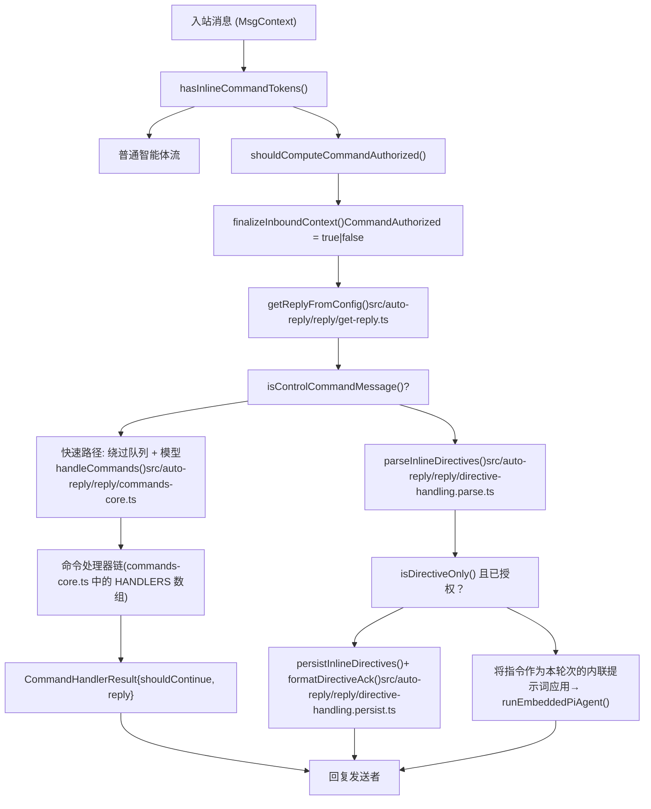
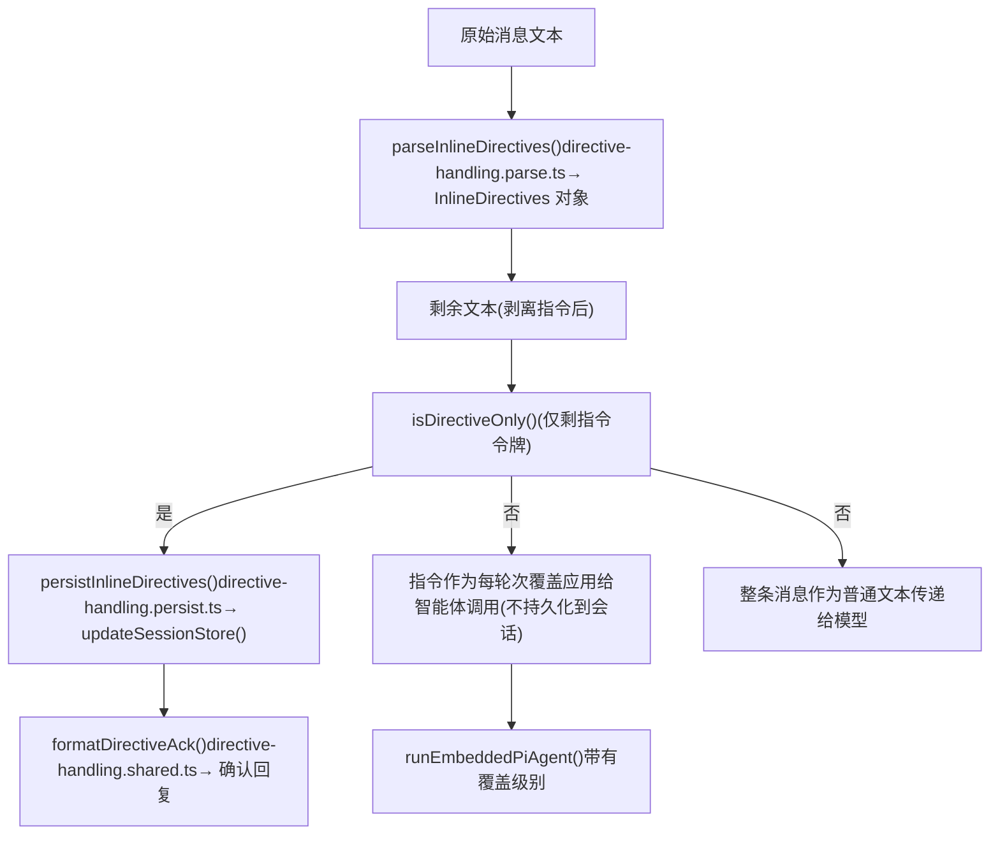
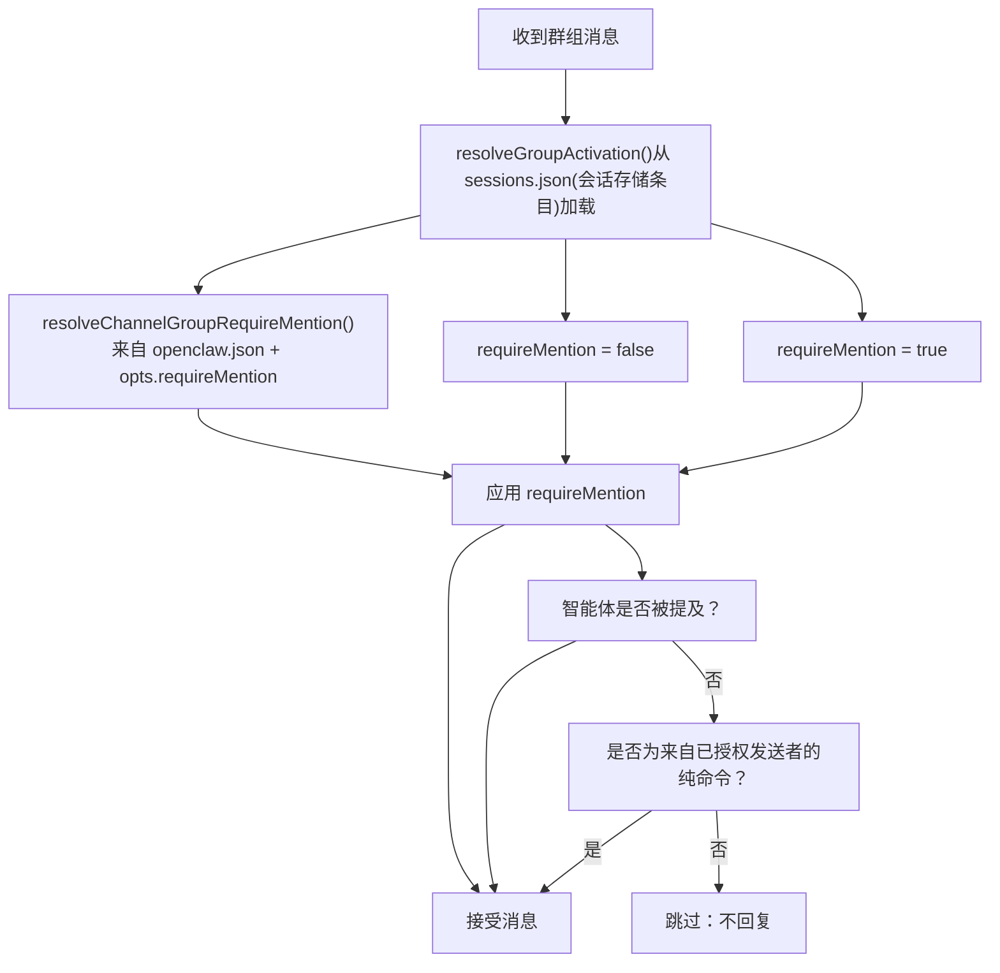

# 命令与自动回复 (Commands & Auto-Reply)

相关源文件

-   [docs/tools/slash-commands.md](https://github.com/openclaw/openclaw/blob/8873e13f/docs/tools/slash-commands.md)
-   [src/agents/tools/session-status-tool.ts](https://github.com/openclaw/openclaw/blob/8873e13f/src/agents/tools/session-status-tool.ts)
-   [src/auto-reply/command-detection.ts](https://github.com/openclaw/openclaw/blob/8873e13f/src/auto-reply/command-detection.ts)
-   [src/auto-reply/commands-args.ts](https://github.com/openclaw/openclaw/blob/8873e13f/src/auto-reply/commands-args.ts)
-   [src/auto-reply/commands-registry.data.ts](https://github.com/openclaw/openclaw/blob/8873e13f/src/auto-reply/commands-registry.data.ts)
-   [src/auto-reply/commands-registry.test.ts](https://github.com/openclaw/openclaw/blob/8873e13f/src/auto-reply/commands-registry.test.ts)
-   [src/auto-reply/commands-registry.ts](https://github.com/openclaw/openclaw/blob/8873e13f/src/auto-reply/commands-registry.ts)
-   [src/auto-reply/commands-registry.types.ts](https://github.com/openclaw/openclaw/blob/8873e13f/src/auto-reply/commands-registry.types.ts)
-   [src/auto-reply/group-activation.ts](https://github.com/openclaw/openclaw/blob/8873e13f/src/auto-reply/group-activation.ts)
-   [src/auto-reply/reply.ts](https://github.com/openclaw/openclaw/blob/8873e13f/src/auto-reply/reply.ts)
-   [src/auto-reply/reply/commands-core.ts](https://github.com/openclaw/openclaw/blob/8873e13f/src/auto-reply/reply/commands-core.ts)
-   [src/auto-reply/reply/commands-info.ts](https://github.com/openclaw/openclaw/blob/8873e13f/src/auto-reply/reply/commands-info.ts)
-   [src/auto-reply/reply/commands-status.ts](https://github.com/openclaw/openclaw/blob/8873e13f/src/auto-reply/reply/commands-status.ts)
-   [src/auto-reply/reply/commands.test.ts](https://github.com/openclaw/openclaw/blob/8873e13f/src/auto-reply/reply/commands.test.ts)
-   [src/auto-reply/reply/commands.ts](https://github.com/openclaw/openclaw/blob/8873e13f/src/auto-reply/reply/commands.ts)
-   [src/auto-reply/reply/directive-handling.ts](https://github.com/openclaw/openclaw/blob/8873e13f/src/auto-reply/reply/directive-handling.ts)
-   [src/auto-reply/send-policy.ts](https://github.com/openclaw/openclaw/blob/8873e13f/src/auto-reply/send-policy.ts)
-   [src/auto-reply/status.test.ts](https://github.com/openclaw/openclaw/blob/8873e13f/src/auto-reply/status.test.ts)
-   [src/auto-reply/status.ts](https://github.com/openclaw/openclaw/blob/8873e13f/src/auto-reply/status.ts)
-   [src/discord/monitor/native-command.options.test.ts](https://github.com/openclaw/openclaw/blob/8873e13f/src/discord/monitor/native-command.options.test.ts)
-   [test/mocks/baileys.ts](https://github.com/openclaw/openclaw/blob/8873e13f/test/mocks/baileys.ts)

本页记录了自动回复命令处理系统：如何检查入站消息中的斜杠命令和内联指令、如何将其分发到处理器、如何组装状态消息，以及群组激活和发送策略如何在群聊中管控回复。

本页**不**涵盖命令通过后的智能体执行管道（见 [3.1](/openclaw/openclaw/3.1-agent-execution-pipeline)）、特定通道的消息摄取（见 [4](/openclaw/openclaw/4-channels)）或会话生命周期管理（见 [2.4](/openclaw/openclaw/2.4-session-management)）。

---

## 架构概览 (Architecture Overview)

在调用模型之前，每条入站消息都会经过命令检测和指令提取。存在两条主要路径：

1.  **独立命令消息**（如 `/status`, `/reset` 等）完全无需调用模型即可处理 —— 这是一个绕过队列的“快速路径”。
2.  **普通聊天消息**可能包含嵌入的**内联指令**（如 `/think high`）或**内联快捷方式**（如 `hey /status`），这些内容会被提取，剩余部分则转发给智能体。

顶级入口点是 `src/auto-reply/reply/get-reply.ts` 中的 `getReplyFromConfig()`。

**命令处理管道**


**来源：** `src/auto-reply/command-detection.ts`, `src/auto-reply/reply/directive-handling.ts`, `src/auto-reply/reply/commands-core.ts`

---

## 消息分类与检测 (Message Classification & Detection)

在自动回复系统运行之前，通道监听器会调用轻量级检测函数来决定是否计算授权。

| 函数 | 目的 |
| --- | --- |
| `hasInlineCommandTokens()` | 粗略的正则检查 (\`/(?:^ |
| `isControlCommandMessage()` | 若整条消息为已识别的命令或中止触发词，则返回 `true` |
| `hasControlCommand()` | 若文本以已识别的命令别名开头，则返回 `true` |
| `shouldComputeCommandAuthorized()` | 结合上述两者；通道用其决定是否需要认证 |

这四个函数均位于 `src/auto-reply/command-detection.ts`。

`isControlCommandMessage()` 同时调用 `hasControlCommand()`（注册表查找）和 `src/auto-reply/reply/abort.ts` 中的 `isAbortTrigger()`，以捕获如 "stop" 之类的停止词。

---

## 命令注册表 (Command Registry)

所有斜杠命令均在 `src/auto-reply/commands-registry.data.ts` 中定义，并通过 `src/auto-reply/commands-registry.ts` 暴露。

### `ChatCommandDefinition` 结构

| 字段 | 类型 | 目的 |
| --- | --- | --- |
| `key` | `string` | 内部标识符（如 `"status"`, `"dock:telegram"`） |
| `nativeName` | `string?` | 在 Discord/Telegram/Slack 上注册的原生名称 |
| `textAliases` | `string[]` | 文本别名（如 `["/think", "/thinking", "/t"]`） |
| `scope` | `"text" | "native" | "both"` | 命令可用的范围 |
| `acceptsArgs` | `boolean` | 命令是否接受尾随参数 |
| `args` | `CommandArgDefinition[]?` | 用于结构化解析的有类型参数定义 |
| `argsParsing` | `"positional" | "none"` | 如何从原始文本解析参数 |
| `argsMenu` | `"auto" | {arg, title}?` | Telegram/Slack 上交互式按钮菜单的规范 |
| `category` | `CommandCategory` | `/commands` 输出中的显示分组 |

### 关键注册表函数

| 函数 | 目的 |
| --- | --- |
| `getChatCommands()` | 返回完整的缓存 `ChatCommandDefinition[]` |
| `listChatCommands()` | 返回命令，可选追加技能命令定义 |
| `listChatCommandsForConfig()` | 按配置标志过滤 (`bash`, `config`, `debug`) |
| `listNativeCommandSpecs()` | 返回用于原生注册的 `NativeCommandSpec[]` |
| `normalizeCommandBody()` | 解析冒号语法、机器人用户名后缀、别名规范化 |
| `getCommandDetection()` | 返回预构建的 `{exact: Set, regex: RegExp}` 以进行快速查找 |
| `findCommandByNativeName()` | 按原生名称查找命令（感知提供商） |
| `shouldHandleTextCommands()` | 若文本命令应在给定表面运行，则返回 `true` |

### 文本命令规范化

`normalizeCommandBody()` 按顺序处理以下转换：

1.  **冒号语法**：`/think: high` → `/think high`
2.  **Telegram 机器人后缀**：`/help@mybot` → `/help`（仅当 `botUsername` 匹配时）
3.  **别名解析**：`/thinking` → `/think`, `/dock_telegram` → `/dock-telegram`

### 原生名称覆盖 (Native name overrides)

某些提供商保留了特定名称。这些覆盖由 [src/auto-reply/commands-registry.ts133-144](https://github.com/openclaw/openclaw/blob/8873e13f/src/auto-reply/commands-registry.ts#L133-L144) 中的 `resolveNativeName()` 应用：

| 提供商 | 命令键 | 注册的原生名称 |
| --- | --- | --- |
| `discord` | `tts` | `voice` (Discord 保留了 `/tts`) |
| `slack` | `status` | `agentstatus` (Slack 保留了 `/status`) |

### 命令类别

`src/auto-reply/status.ts` 中的 `CATEGORY_ORDER` 数组定义了显示顺序：`session` → `options` → `status` → `management` → `media` → `tools` → `docks`。

**来源：** `src/auto-reply/commands-registry.ts`, `src/auto-reply/commands-registry.data.ts`

---

## 命令处理器 (Command Handlers)

`src/auto-reply/reply/commands-core.ts` 中的 `handleCommands()` 是主分发器。它遍历 `CommandHandler` 函数组成的 `HANDLERS` 数组，返回第一个非空的 `CommandHandlerResult`。

**命令分发器 → 处理器源文件映射图**

```mermaid
flowchart TD
    HC["handleCommands()commands-core.ts"]
    INFO["commands-info.ts/help, /commands, /status,/whoami, /id, /context, /export-session"]
    SESS["commands-session.ts/stop, /restart, /new, /reset,/activation, /send, /usage,中止触发词"]
    COMPACT["commands-compact.ts/compact"]
    MODELS["commands-models.ts/model, /models"]
    BASH["commands-bash.ts/bash, !cmd, !poll, !stop"]
    CFG["commands-config.ts/config, /debug"]
    ALLOW["commands-allowlist.ts/allowlist"]
    APPROVE["commands-approve.ts/approve"]
    SUB["commands-subagents.ts/subagents, /kill, /steer, /focus"]
    TTS["commands-tts.ts/tts"]
    ACP["commands-acp.ts/acp"]
    PLUG["commands-plugin.ts插件注册的命令"]

    HC --> INFO
    HC --> SESS
    HC --> COMPACT
    HC --> MODELS
    HC --> BASH
    HC --> CFG
    HC --> ALLOW
    HC --> APPROVE
    HC --> SUB
    HC --> TTS
    HC --> ACP
    HC --> PLUG
```


**来源：** `src/auto-reply/reply/commands-core.ts`, `src/auto-reply/reply/commands-info.ts`

### `CommandContext` 与 `HandleCommandsParams`

处理器接收一个 `HandleCommandsParams` 对象。嵌套在其中的 `CommandContext` 的关键字段如下：

| 字段 | 目的 |
| --- | --- |
| `commandBodyNormalized` | 规范化后的命令字符串（如 `/status`） |
| `isAuthorizedSender` | 发送者是否拥有命令权限 |
| `senderId` | 发送者标识字符串 |
| `channel` | 通道类型（如 `"telegram"`, `"discord"`） |
| `surface` | 提供商表面标签 |
| `resetHookTriggered` | 追踪重置钩子是否已触发 |

`HandleCommandsParams` 还携带：`cfg` (`OpenClawConfig`)、`ctx` (`MsgContext`)、`sessionEntry`、`elevated`（访问检查结果）以及解析后的指令级别（`thinkLevel`, `verboseLevel` 等）。

`CommandHandlerResult` 为 `{ shouldContinue: boolean; reply?: ReplyPayload }`。返回 `null` 表示“此处理器不适用；尝试下一个”。

---

## 指令 (Directives)

指令是嵌入在消息中的令牌，用于修改智能体行为。指令与命令的不同之处在于它们可以出现在普通聊天消息内部，而不是独立存在。

### 已识别的指令

| 指令 | 提取器 | 源文件 |
| --- | --- | --- |
| `/think <level>` | `extractThinkDirective()` | `src/auto-reply/reply/directives.ts` |
| `/verbose <level>` | `extractVerboseDirective()` | `src/auto-reply/reply/directives.ts` |
| `/elevated <level>` | `extractElevatedDirective()` | `src/auto-reply/reply/directives.ts` |
| `/reasoning <mode>` | `extractReasoningDirective()` | `src/auto-reply/reply/directives.ts` |
| `/exec <params>` | `extractExecDirective()` | `src/auto-reply/reply/exec.ts` |
| `/queue <mode>` | `extractQueueDirective()` | `src/auto-reply/reply/queue.ts` |
| `/model <ref>` | 由 `handleModelsCommand` 处理 | `src/auto-reply/reply/commands-models.ts` |

所有提取器均从 `src/auto-reply/reply.ts` 重新导出。

### 仅指令 vs 指令+文本行为

| 消息类型 | 已授权发送者 | 行为 |
| --- | --- | --- |
| 仅指令（如 `/think high`） | 是 | `persistInlineDirectives()` → 更新会话，`formatDirectiveAck()` 回复 |
| 仅指令 | 否 | 静默忽略 |
| 混合（文本 + 指令） | 是 | 指令作为仅限本轮次的内联提示应用；不持久化 |
| 混合 | 否 | 指令被视为普通文本；传递给模型 |

**指令提取与应用流图**


**来源：** `src/auto-reply/reply/directive-handling.ts`, `src/auto-reply/reply.ts`

### 内联快捷方式 (Inline shortcuts)

命令的一个子集可以嵌入在普通消息中，并在模型看到剩余部分之前被剥离。由 `src/auto-reply/reply/directive-handling.ts` 中的 `applyInlineDirectivesFastLane()` 处理。

| 内联快捷方式 | 效果 |
| --- | --- |
| `/help` | 发送帮助回复；剩余文本继续传给智能体 |
| `/commands` | 发送命令列表；剩余文本继续传给智能体 |
| `/status` | 发送状态卡片；剩余文本继续传给智能体 |
| `/whoami` / `/id` | 发送发送者 ID；剩余文本继续传给智能体 |

这些仅为**已授权发送者**激活，并在群聊中绕过提及 (mention) 要求。

---

## 授权 (Authorization)

`FinalizedMsgContext` 中的 `CommandAuthorized` 始终为一个 `boolean` 值，默认拒绝 —— 参见 `src/auto-reply/templating.ts` [src/auto-reply/templating.ts155-161](https://github.com/openclaw/openclaw/blob/8873e13f/src/auto-reply/templating.ts#L155-L161)。

解析优先级：

1.  **`commands.allowFrom`** —— 若已配置，它是**唯一**的授权来源。通道白名单和配对将被忽略。
2.  **通道白名单 + 配对** —— 当未设置 `commands.allowFrom` 时的标准来源。
3.  **`commands.useAccessGroups`**（默认 `true`） —— 强制执行标准的允许/策略检查。

对于未授权的发送者：

-   独立命令消息将被**静默忽略**（不发送回复）。
-   混合消息中的内联指令被视为传给模型的**普通文本**。

三个命令 (`bash`, `config`, `debug`) 额外要求其各自的配置标志显式为 `true` 且作为自有属性（非原型链继承） —— 这由 `isCommandFlagEnabled()` 强制执行，并由 `listChatCommandsForConfig()` 检查 [src/auto-reply/commands-registry.ts98-109](https://github.com/openclaw/openclaw/blob/8873e13f/src/auto-reply/commands-registry.ts#L98-L109)。

---

## 状态消息 (Status Messages)

`/status` 命令通过 `src/auto-reply/status.ts` 中的 `buildStatusMessage()` 生成详细的状态卡片。`session_status` 智能体工具也使用该函数。

### 状态卡片字段明细

```
🦞 OpenClaw <version> (<commit>)
<timeLine>
🧠 模型: <provider>/<model> · 🔑 <authMode> [· 通道覆盖]
↪️ 回退: <model> · 🔑 <auth> (<reason>)       ← 仅在激活时显示
🧮 Token: <input>k 入 / <output>k 出  [· 💵 费用: $X.XX]
🗄️ 缓存: <hit>% 命中 · <cached>k 已缓存, <new>k 新增
📚 上下文: <total>/<window> (<pct>%) · 🧹 压缩次数: N
📎 媒体: <各能力决策>
<usageLine>                                         ← 提供商额度窗口
🧵 会话: <sessionKey> · 更新于 X 分钟前
🤖 子智能体: N 个活动 [· 已完成: M]
⚙️ 运行时: <mode> · 思考: <level> [· 详细] [· 提权]
🔊 语音: <mode> · 提供商=<p> · 限制=<n> · 摘要=<开|关>
👥 激活: 提及|始终  · 🪢 队列: <mode> [(深度 N)]
```
`src/auto-reply/reply/commands-status.ts` 中的 `buildStatusReply()` 负责协调该过程：

1.  通过 `resolveModelAuthLabel()` 解析模型认证。
2.  通过 `loadProviderUsageSummary()` 加载提供商额度。
3.  通过 `resolveQueueSettings()` 解析队列设置。
4.  通过 `listSubagentRunsForRequester()` 列出活跃的子智能体。
5.  从会话条目解析群组激活设置。
6.  携带所有解析后的数据调用 `buildStatusMessage()`。

### 帮助与命令列表

| 函数 | 命令 | 备注 |
| --- | --- | --- |
| `buildHelpMessage()` | `/help` | 紧凑摘要；有条件地包含 `/config` 和 `/debug` |
| `buildCommandsMessage()` | `/commands` | 按类别分组的完整列表；包含插件命令 |
| `buildCommandsMessagePaginated()` | Telegram 上的 `/commands` | 每页 8 项进行分页；返回 `{text, totalPages, currentPage, hasNext, hasPrev}` |

插件命令通过 `src/plugins/commands.ts` 中的 `listPluginCommands()` 获取，并追加在“Plugins”类别下。

**来源：** `src/auto-reply/status.ts`, `src/auto-reply/reply/commands-status.ts`

---

## 群组激活策略 (Group Activation Policies)

在群聊中，智能体的响应性取决于每个会话的**群组激活**设置。

| 模式 | 行为 |
| --- | --- |
| `mention` (默认) | 仅在被明确提及时响应 |
| `always` | 响应群组内的每一条消息 |

**群组激活解析图**


`/activation mention|always` 将设置持久化到会话存储。解析由 `src/auto-reply/group-activation.ts` 中的 `parseActivationCommand()` 完成。处理器为 `src/auto-reply/reply/commands-session.ts` 中的 `handleActivationCommand`。

群组策略配置 (`groupPolicy`, `requireMention`) 通过 `src/config/group-policy.ts` 中的 `resolveChannelGroupPolicy()` 和 `resolveChannelGroupRequireMention()` 进行解析。

**来源：** `src/auto-reply/group-activation.ts`, `src/telegram/bot.ts`, `src/config/group-policy.ts`

---

## 发送策略 (Send Policies)

`/send on|off|inherit` 命令（仅限所有者）控制是否交付该对话的智能体回复。

`src/auto-reply/send-policy.ts` 中的 `parseSendPolicyCommand()` 解析该命令。生成的 `SendPolicyOverride` 存储在会话中，并由交付层通过 `src/sessions/send-policy.ts` 中的 `resolveSendPolicy()` 读取。

| 值 | 含义 |
| --- | --- |
| `on` / `allow` | 强制发送回复 |
| `off` / `deny` | 抑制所有回复 |
| `inherit` / `default` / `reset` | 遵循通道/全局默认值 |

---

## 配置参考 (Configuration Reference)

命令在 `openclaw.json` 的 `commands` 键下进行配置。完整的配置字段参考请参见 [2.3.1](/openclaw/openclaw/2.3.1-configuration-reference)。

| 键 | 默认值 | 目的 |
| --- | --- | --- |
| `commands.text` | `true` | 解析聊天消息中的 `/...`（对于无原生支持的平台始终开启） |
| `commands.native` | `"auto"` | 在 Discord/Telegram 上注册原生命令（对于这些提供商 auto = 开启） |
| `commands.nativeSkills` | `"auto"` | 在原生平台上注册技能命令 |
| `commands.bash` | `false` | 启用 `! <cmd>` / `/bash <cmd>` |
| `commands.bashForegroundMs` | `2000` | 在将 bash 切换到后台前等待的毫秒数 |
| `commands.config` | `false` | 启用 `/config`（读取/写入 `openclaw.json`） |
| `commands.debug` | `false` | 启用 `/debug`（仅限运行时的覆盖） |
| `commands.restart` | `true` | 启用 `/restart` |
| `commands.allowFrom` | (无) | 按提供商设置的发送者白名单；设置后将覆盖所有其他授权来源 |
| `commands.useAccessGroups` | `true` | 当未设置 `allowFrom` 时，强制执行通道白名单/策略 |

[src/auto-reply/commands-registry.ts378-420](https://github.com/openclaw/openclaw/blob/8873e13f/src/auto-reply/commands-registry.ts#L378-L420) 中的 `shouldHandleTextCommands()` 实现了表面门控：无原生命令支持的平台（WhatsApp, Signal, iMessage, Google Chat, MS Teams, WebChat）无论 `commands.text` 设置如何，始终处理文本命令。

**来源：** `docs/tools/slash-commands.md`, `src/auto-reply/commands-registry.ts`, `src/config/commands.ts`
