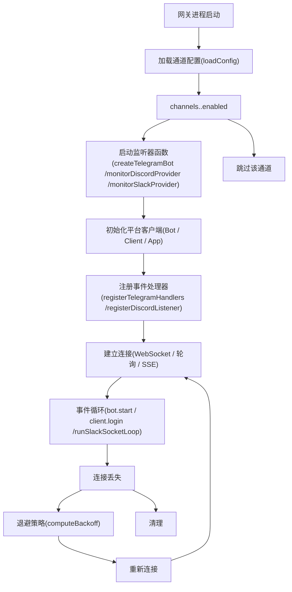
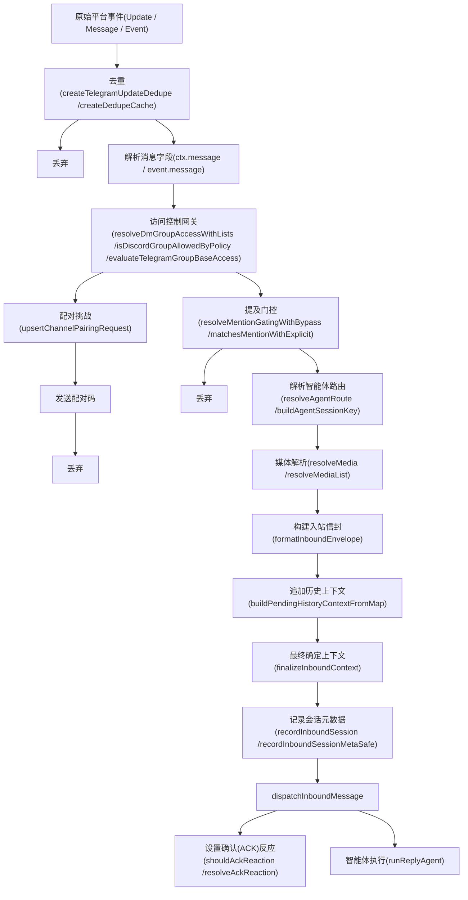
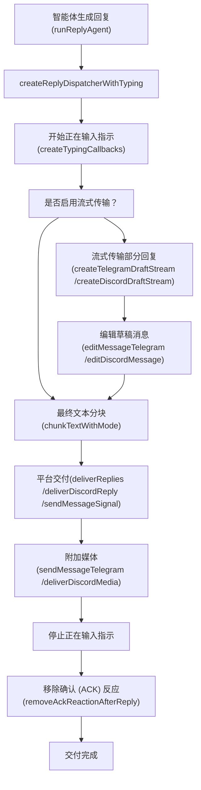
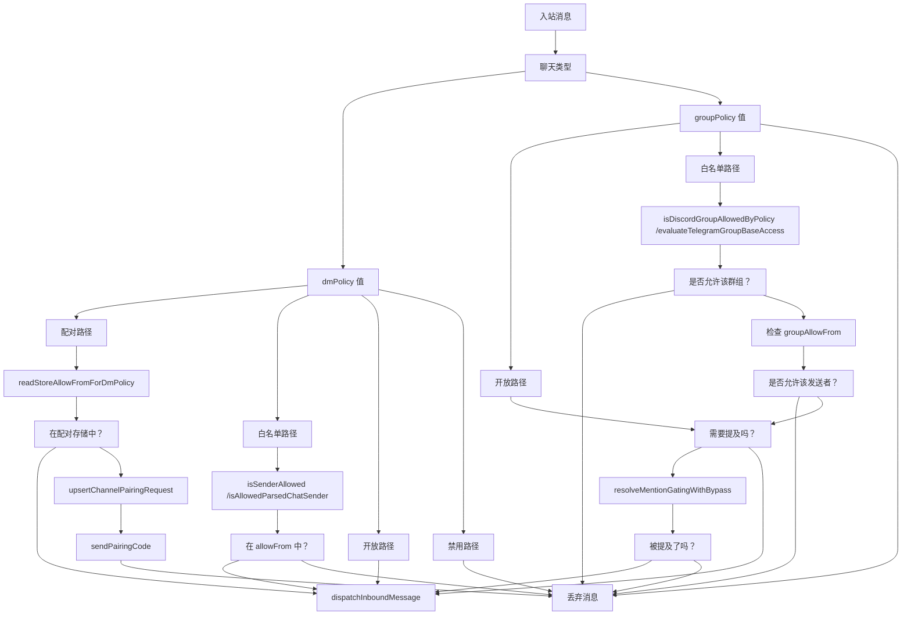
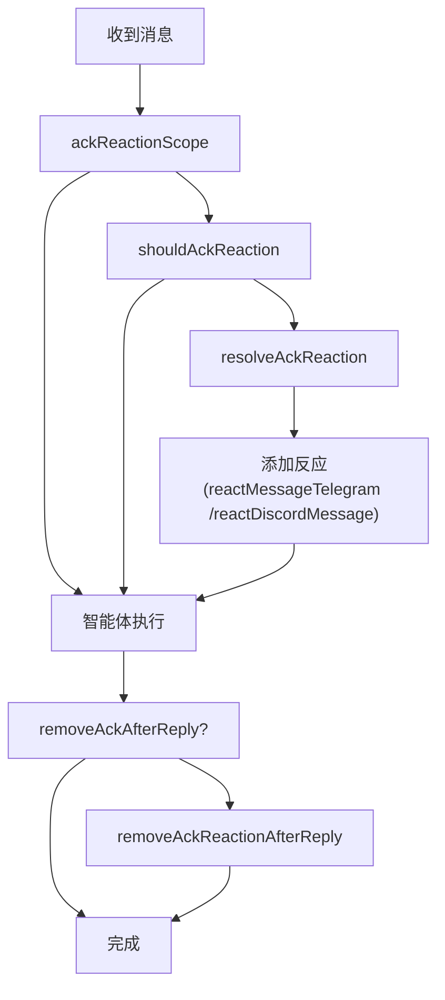

# 通道 (Channels)

相关源文件

-   [docs/channels/discord.md](https://github.com/openclaw/openclaw/blob/8873e13f/docs/channels/discord.md)
-   [docs/channels/telegram.md](https://github.com/openclaw/openclaw/blob/8873e13f/docs/channels/telegram.md)
-   [docs/gateway/configuration-reference.md](https://github.com/openclaw/openclaw/blob/8873e13f/docs/gateway/configuration-reference.md)
-   [src/acp/control-plane/manager.core.ts](https://github.com/openclaw/openclaw/blob/8873e13f/src/acp/control-plane/manager.core.ts)
-   [src/agents/pi-embedded-runner/tool-result-char-estimator.ts](https://github.com/openclaw/openclaw/blob/8873e13f/src/agents/pi-embedded-runner/tool-result-char-estimator.ts)
-   [src/agents/pi-embedded-runner/tool-result-context-guard.ts](https://github.com/openclaw/openclaw/blob/8873e13f/src/agents/pi-embedded-runner/tool-result-context-guard.ts)
-   [src/agents/tools/telegram-actions.test.ts](https://github.com/openclaw/openclaw/blob/8873e13f/src/agents/tools/telegram-actions.test.ts)
-   [src/agents/tools/telegram-actions.ts](https://github.com/openclaw/openclaw/blob/8873e13f/src/agents/tools/telegram-actions.ts)
-   [src/auto-reply/reply/agent-runner.runreplyagent.e2e.test.ts](https://github.com/openclaw/openclaw/blob/8873e13f/src/auto-reply/reply/agent-runner.runreplyagent.e2e.test.ts)
-   [src/auto-reply/reply/normalize-reply.ts](https://github.com/openclaw/openclaw/blob/8873e13f/src/auto-reply/reply/normalize-reply.ts)
-   [src/auto-reply/skill-commands.test.ts](https://github.com/openclaw/openclaw/blob/8873e13f/src/auto-reply/skill-commands.test.ts)
-   [src/auto-reply/skill-commands.ts](https://github.com/openclaw/openclaw/blob/8873e13f/src/auto-reply/skill-commands.ts)
-   [src/auto-reply/tokens.test.ts](https://github.com/openclaw/openclaw/blob/8873e13f/src/auto-reply/tokens.test.ts)
-   [src/auto-reply/tokens.ts](https://github.com/openclaw/openclaw/blob/8873e13f/src/auto-reply/tokens.ts)
-   [src/channels/allowlists/resolve-utils.test.ts](https://github.com/openclaw/openclaw/blob/8873e13f/src/channels/allowlists/resolve-utils.test.ts)
-   [src/channels/allowlists/resolve-utils.ts](https://github.com/openclaw/openclaw/blob/8873e13f/src/channels/allowlists/resolve-utils.ts)
-   [src/channels/draft-stream-loop.ts](https://github.com/openclaw/openclaw/blob/8873e13f/src/channels/draft-stream-loop.ts)
-   [src/channels/plugins/actions/actions.test.ts](https://github.com/openclaw/openclaw/blob/8873e13f/src/channels/plugins/actions/actions.test.ts)
-   [src/channels/plugins/actions/telegram.ts](https://github.com/openclaw/openclaw/blob/8873e13f/src/channels/plugins/actions/telegram.ts)
-   [src/config/schema.help.quality.test.ts](https://github.com/openclaw/openclaw/blob/8873e13f/src/config/schema.help.quality.test.ts)
-   [src/config/schema.help.ts](https://github.com/openclaw/openclaw/blob/8873e13f/src/config/schema.help.ts)
-   [src/config/schema.labels.ts](https://github.com/openclaw/openclaw/blob/8873e13f/src/config/schema.labels.ts)
-   [src/config/types.agent-defaults.ts](https://github.com/openclaw/openclaw/blob/8873e13f/src/config/types.agent-defaults.ts)
-   [src/config/types.discord.ts](https://github.com/openclaw/openclaw/blob/8873e13f/src/config/types.discord.ts)
-   [src/config/types.telegram.ts](https://github.com/openclaw/openclaw/blob/8873e13f/src/config/types.telegram.ts)
-   [src/config/zod-schema.agent-defaults.ts](https://github.com/openclaw/openclaw/blob/8873e13f/src/config/zod-schema.agent-defaults.ts)
-   [src/config/zod-schema.providers-core.ts](https://github.com/openclaw/openclaw/blob/8873e13f/src/config/zod-schema.providers-core.ts)
-   [src/discord/monitor.test.ts](https://github.com/openclaw/openclaw/blob/8873e13f/src/discord/monitor.test.ts)
-   [src/discord/monitor.ts](https://github.com/openclaw/openclaw/blob/8873e13f/src/discord/monitor.ts)
-   [src/discord/monitor/listeners.test.ts](https://github.com/openclaw/openclaw/blob/8873e13f/src/discord/monitor/listeners.test.ts)
-   [src/discord/monitor/listeners.ts](https://github.com/openclaw/openclaw/blob/8873e13f/src/discord/monitor/listeners.ts)
-   [src/discord/monitor/provider.allowlist.test.ts](https://github.com/openclaw/openclaw/blob/8873e13f/src/discord/monitor/provider.allowlist.test.ts)
-   [src/discord/monitor/provider.allowlist.ts](https://github.com/openclaw/openclaw/blob/8873e13f/src/discord/monitor/provider.allowlist.ts)
-   [src/discord/monitor/provider.skill-dedupe.test.ts](https://github.com/openclaw/openclaw/blob/8873e13f/src/discord/monitor/provider.skill-dedupe.test.ts)
-   [src/discord/monitor/provider.test.ts](https://github.com/openclaw/openclaw/blob/8873e13f/src/discord/monitor/provider.test.ts)
-   [src/discord/monitor/provider.ts](https://github.com/openclaw/openclaw/blob/8873e13f/src/discord/monitor/provider.ts)
-   [src/imessage/monitor.ts](https://github.com/openclaw/openclaw/blob/8873e13f/src/imessage/monitor.ts)
-   [src/signal/monitor.ts](https://github.com/openclaw/openclaw/blob/8873e13f/src/signal/monitor.ts)
-   [src/slack/monitor.tool-result.test.ts](https://github.com/openclaw/openclaw/blob/8873e13f/src/slack/monitor.tool-result.test.ts)
-   [src/slack/monitor.ts](https://github.com/openclaw/openclaw/blob/8873e13f/src/slack/monitor.ts)
-   [src/slack/monitor/provider.ts](https://github.com/openclaw/openclaw/blob/8873e13f/src/slack/monitor/provider.ts)
-   [src/telegram/bot-handlers.ts](https://github.com/openclaw/openclaw/blob/8873e13f/src/telegram/bot-handlers.ts)
-   [src/telegram/bot-message-context.dm-threads.test.ts](https://github.com/openclaw/openclaw/blob/8873e13f/src/telegram/bot-message-context.dm-threads.test.ts)
-   [src/telegram/bot-message-context.ts](https://github.com/openclaw/openclaw/blob/8873e13f/src/telegram/bot-message-context.ts)
-   [src/telegram/bot-message-dispatch.test.ts](https://github.com/openclaw/openclaw/blob/8873e13f/src/telegram/bot-message-dispatch.test.ts)
-   [src/telegram/bot-message-dispatch.ts](https://github.com/openclaw/openclaw/blob/8873e13f/src/telegram/bot-message-dispatch.ts)
-   [src/telegram/bot-native-commands.ts](https://github.com/openclaw/openclaw/blob/8873e13f/src/telegram/bot-native-commands.ts)
-   [src/telegram/bot.test.ts](https://github.com/openclaw/openclaw/blob/8873e13f/src/telegram/bot.test.ts)
-   [src/telegram/bot.ts](https://github.com/openclaw/openclaw/blob/8873e13f/src/telegram/bot.ts)
-   [src/telegram/bot/delivery.replies.ts](https://github.com/openclaw/openclaw/blob/8873e13f/src/telegram/bot/delivery.replies.ts)
-   [src/telegram/bot/delivery.test.ts](https://github.com/openclaw/openclaw/blob/8873e13f/src/telegram/bot/delivery.test.ts)
-   [src/telegram/bot/delivery.ts](https://github.com/openclaw/openclaw/blob/8873e13f/src/telegram/bot/delivery.ts)
-   [src/telegram/bot/helpers.test.ts](https://github.com/openclaw/openclaw/blob/8873e13f/src/telegram/bot/helpers.test.ts)
-   [src/telegram/bot/helpers.ts](https://github.com/openclaw/openclaw/blob/8873e13f/src/telegram/bot/helpers.ts)
-   [src/telegram/draft-stream.test-helpers.ts](https://github.com/openclaw/openclaw/blob/8873e13f/src/telegram/draft-stream.test-helpers.ts)
-   [src/telegram/draft-stream.test.ts](https://github.com/openclaw/openclaw/blob/8873e13f/src/telegram/draft-stream.test.ts)
-   [src/telegram/draft-stream.ts](https://github.com/openclaw/openclaw/blob/8873e13f/src/telegram/draft-stream.ts)
-   [src/telegram/lane-delivery.test.ts](https://github.com/openclaw/openclaw/blob/8873e13f/src/telegram/lane-delivery.test.ts)
-   [src/telegram/lane-delivery.ts](https://github.com/openclaw/openclaw/blob/8873e13f/src/telegram/lane-delivery.ts)
-   [src/telegram/send.test.ts](https://github.com/openclaw/openclaw/blob/8873e13f/src/telegram/send.test.ts)
-   [src/telegram/send.ts](https://github.com/openclaw/openclaw/blob/8873e13f/src/telegram/send.ts)
-   [src/web/auto-reply.ts](https://github.com/openclaw/openclaw/blob/8873e13f/src/web/auto-reply.ts)
-   [src/web/inbound.test.ts](https://github.com/openclaw/openclaw/blob/8873e13f/src/web/inbound.test.ts)
-   [src/web/inbound.ts](https://github.com/openclaw/openclaw/blob/8873e13f/src/web/inbound.ts)
-   [src/web/vcard.ts](https://github.com/openclaw/openclaw/blob/8873e13f/src/web/vcard.ts)

OpenClaw 的通道 (Channel) 子系统通过**提供者模式**集成外部消息平台：每个平台作为独立的监听器 (Monitor) 运行，接收原始事件、强制执行访问控制、将消息规范化为通用的信封 (envelope) 格式，并利用平台特定的交付机制路由回复。本页记录了核心架构、访问控制流、消息规范化和出站交付抽象。有关平台特定的集成细节，请参见 [通道架构 (Channel Architecture)](/openclaw/openclaw/4.1-channel-architecture)、[Telegram](/openclaw/openclaw/4.2-telegram-integration)、[Discord](/openclaw/openclaw/4.3-discord-integration) 以及 [其他通道 (Other Channels)](/openclaw/openclaw/4.4-other-channels)。

---

## 支持的平台 (Supported Platforms)

通道分为**核心 (core)** 通道（内置在主 `src/` 树中）或**扩展 (extension)** 通道（位于 `extensions/` 下的独立包）。

| 平台 | 监听器入口点 | 配置键 | 备注 |
| --- | --- | --- | --- |
| Telegram | `createTelegramBot` [`src/telegram/bot.ts`](https://github.com/openclaw/openclaw/blob/8873e13f/src/telegram/bot.ts) | `channels.telegram` | grammY，长轮询或 Webhook |
| Discord | `monitorDiscordProvider` [`src/discord/monitor/provider.ts`](https://github.com/openclaw/openclaw/blob/8873e13f/src/discord/monitor/provider.ts) | `channels.discord` | @buape/carbon 网关 |
| Slack | `monitorSlackProvider` [`src/slack/monitor/provider.ts`](https://github.com/openclaw/openclaw/blob/8873e13f/src/slack/monitor/provider.ts) | `channels.slack` | Socket 模式或 HTTP |
| Signal | `monitorSignalProvider` [`src/signal/monitor.ts`](https://github.com/openclaw/openclaw/blob/8873e13f/src/signal/monitor.ts) | `channels.signal` | signal-cli JSON-RPC / SSE |
| iMessage | `monitorIMessageProvider` [`src/imessage/monitor/monitor-provider.ts`](https://github.com/openclaw/openclaw/blob/8873e13f/src/imessage/monitor/monitor-provider.ts) | `channels.imessage` | `imsg` CLI，仅限 macOS |
| WhatsApp | `monitorWebInbox` [`src/web/inbound.ts`](https://github.com/openclaw/openclaw/blob/8873e13f/src/web/inbound.ts) | `channels.whatsapp` | Baileys / Web 协议 |
| Matrix | `MatrixMonitorHandlerParams` [`extensions/matrix/src/matrix/monitor/handler.ts`](https://github.com/openclaw/openclaw/blob/8873e13f/extensions/matrix/src/matrix/monitor/handler.ts) | `channels.matrix` | 扩展 |
| 飞书 (Feishu) | `handleFeishuMessageEvent` [`extensions/feishu/src/bot.ts`](https://github.com/openclaw/openclaw/blob/8873e13f/extensions/feishu/src/bot.ts) | `channels.feishu` | 扩展 |
| Mattermost | `monitorMattermostProvider` [`extensions/mattermost/src/mattermost/monitor.ts`](https://github.com/openclaw/openclaw/blob/8873e13f/extensions/mattermost/src/mattermost/monitor.ts) | `channels.mattermost` | 扩展 |
| MS Teams | (处理器) [`extensions/msteams/src/monitor-handler/message-handler.ts`](https://github.com/openclaw/openclaw/blob/8873e13f/extensions/msteams/src/monitor-handler/message-handler.ts) | `channels.msteams` | 扩展 |
| Zalo | (监听器) [`extensions/zalo/src/monitor.ts`](https://github.com/openclaw/openclaw/blob/8873e13f/extensions/zalo/src/monitor.ts) | `channels.zalo` | 扩展 |
| Google Chat | (模式) [`src/config/zod-schema.providers-core.ts610-695`](https://github.com/openclaw/openclaw/blob/8873e13f/src/config/zod-schema.providers-core.ts#L610-L695) | `channels.googlechat` | 基于 Webhook |
| LINE | `resolveLineAccount` [`src/plugin-sdk/index.ts562-590`](https://github.com/openclaw/openclaw/blob/8873e13f/src/plugin-sdk/index.ts#L562-L590) | `channels.line` | 扩展 |
| BlueBubbles | (插件) | `channels.bluebubbles` | 扩展 |
| IRC | (插件) | `channels.irc` | 扩展 |
| Nextcloud Talk | (插件) | `channels.nextcloud` | 扩展 |

**来源**：[`src/plugin-sdk/index.ts`](https://github.com/openclaw/openclaw/blob/8873e13f/src/plugin-sdk/index.ts) [`src/config/zod-schema.providers-core.ts`](https://github.com/openclaw/openclaw/blob/8873e13f/src/config/zod-schema.providers-core.ts) [`src/discord/monitor.ts`](https://github.com/openclaw/openclaw/blob/8873e13f/src/discord/monitor.ts) [`src/slack/monitor.ts`](https://github.com/openclaw/openclaw/blob/8873e13f/src/slack/monitor.ts) [`src/signal/monitor.ts`](https://github.com/openclaw/openclaw/blob/8873e13f/src/signal/monitor.ts) [`src/imessage/monitor.ts`](https://github.com/openclaw/openclaw/blob/8873e13f/src/imessage/monitor.ts) [`src/web/inbound.ts`](https://github.com/openclaw/openclaw/blob/8873e13f/src/web/inbound.ts)

---

## 提供商架构与监听器模式 (Provider Architecture and Monitor Pattern)

每个通道集成都实现了一种**提供商模式**：专门的监听器函数建立平台连接，注册事件处理器，并拥有从入站接收、访问控制到出站交付的完整消息生命周期。监听器作为长寿命异步函数运行，由网关在进程初始化时启动。

**各平台的提供商模式实现**

| 平台 | 监听器函数 | 客户端库 | 连接类型 | 处理器注册 |
| --- | --- | --- | --- | --- |
| Telegram | `createTelegramBot` | grammY `Bot` | 长轮询或 Webhook | `registerTelegramHandlers` |
| Discord | `monitorDiscordProvider` | @buape/carbon `Client` | 网关 WebSocket | `registerDiscordListener` |
| Slack | `monitorSlackProvider` | @slack/bolt `App` | Socket 模式或 HTTP | `app.message`, `app.event` |
| Signal | `monitorSignalProvider` | signal-cli JSON-RPC | SSE 流 | `createSignalEventHandler` |
| iMessage | `monitorIMessageProvider` | imsg CLI stdio | 轮询循环 | 监听器中的直接处理器 |
| WhatsApp | `monitorWebInbox` | Baileys Web | WebSocket | Web 事件监听器 |

**通道监听器初始化与生命周期**


监听器函数由网关的通道协调器调用，并持续运行直到进程终止。重新连接逻辑视提供商而定，但通常使用 `computeBackoff` [`src/infra/backoff.js`](https://github.com/openclaw/openclaw/blob/8873e13f/src/infra/backoff.js) 提供的带有抖动的指数退避。

**来源**：[src/telegram/bot.ts69-416](https://github.com/openclaw/openclaw/blob/8873e13f/src/telegram/bot.ts#L69-L416) [src/discord/monitor/provider.ts307-633](https://github.com/openclaw/openclaw/blob/8873e13f/src/discord/monitor/provider.ts#L307-L633) [src/slack/monitor/provider.ts48-547](https://github.com/openclaw/openclaw/blob/8873e13f/src/slack/monitor/provider.ts#L48-L547) [src/signal/monitor.ts30-362](https://github.com/openclaw/openclaw/blob/8873e13f/src/signal/monitor.ts#L30-L362) [src/web/inbound/monitor.ts](https://github.com/openclaw/openclaw/blob/8873e13f/src/web/inbound/monitor.ts)

---

## 入站消息处理管道 (Inbound Message Processing Pipeline)

原始平台事件通过一个统一的管道流转：该管道负责消息规范化、强制执行访问控制、解析路由并分发到智能体运行时。每个阶段都通过消费规范化数据结构的平台无关函数来实现。

**入站消息处理阶段（代码实体映射）**


### 核心管道函数 (Core Pipeline Functions)

| 阶段 | 主要函数 | 回退 / 备选 | 位置 |
| --- | --- | --- | --- |
| 去重 | `createTelegramUpdateDedupe` | `createDedupeCache` | [src/telegram/bot-updates.ts](https://github.com/openclaw/openclaw/blob/8873e13f/src/telegram/bot-updates.ts) [src/auto-reply/reply/inbound-dedupe.js](https://github.com/openclaw/openclaw/blob/8873e13f/src/auto-reply/reply/inbound-dedupe.js) |
| 访问控制 (DM) | `resolveDmGroupAccessWithLists` | `readStoreAllowFromForDmPolicy` | [src/security/dm-policy-shared.js](https://github.com/openclaw/openclaw/blob/8873e13f/src/security/dm-policy-shared.js) |
| 访问控制 (群组) | `isDiscordGroupAllowedByPolicy` | `evaluateTelegramGroupBaseAccess` | [src/discord/monitor/allow-list.ts](https://github.com/openclaw/openclaw/blob/8873e13f/src/discord/monitor/allow-list.ts) [src/telegram/group-access.ts](https://github.com/openclaw/openclaw/blob/8873e13f/src/telegram/group-access.ts) |
| 提及检测 | `matchesMentionWithExplicit` | `hasBotMention` | [src/auto-reply/reply/mentions.js](https://github.com/openclaw/openclaw/blob/8873e13f/src/auto-reply/reply/mentions.js) [src/telegram/bot/helpers.ts](https://github.com/openclaw/openclaw/blob/8873e13f/src/telegram/bot/helpers.ts) |
| 路由 | `resolveAgentRoute` | `buildAgentSessionKey` | [src/routing/resolve-route.js](https://github.com/openclaw/openclaw/blob/8873e13f/src/routing/resolve-route.js) |
| 媒体解析 | `resolveMedia` (Telegram) | `buildDiscordMediaPayload` | [src/telegram/bot/delivery.resolve-media.ts](https://github.com/openclaw/openclaw/blob/8873e13f/src/telegram/bot/delivery.resolve-media.ts) [src/discord/monitor/message-utils.ts](https://github.com/openclaw/openclaw/blob/8873e13f/src/discord/monitor/message-utils.ts) |
| 信封格式 | `formatInboundEnvelope` | — | [src/auto-reply/envelope.js](https://github.com/openclaw/openclaw/blob/8873e13f/src/auto-reply/envelope.js) |
| 历史上下文 | `buildPendingHistoryContextFromMap` | — | [src/auto-reply/reply/history.js](https://github.com/openclaw/openclaw/blob/8873e13f/src/auto-reply/reply/history.js) |
| 上下文终态化 | `finalizeInboundContext` | — | [src/auto-reply/reply/inbound-context.js](https://github.com/openclaw/openclaw/blob/8873e13f/src/auto-reply/reply/inbound-context.js) |
| 会话记录 | `recordInboundSession` | `recordInboundSessionMetaSafe` | [src/channels/session.js](https://github.com/openclaw/openclaw/blob/8873e13f/src/channels/session.js) [src/channels/session-meta.ts](https://github.com/openclaw/openclaw/blob/8873e13f/src/channels/session-meta.ts) |
| 入站分发 | `dispatchInboundMessage` | — | [src/auto-reply/dispatch.js](https://github.com/openclaw/openclaw/blob/8873e13f/src/auto-reply/dispatch.js) |
| 确认 (ACK) 反应 | `shouldAckReaction` | `resolveAckReaction` | [src/channels/ack-reactions.js](https://github.com/openclaw/openclaw/blob/8873e13f/src/channels/ack-reactions.js) [src/agents/identity.js](https://github.com/openclaw/openclaw/blob/8873e13f/src/agents/identity.js) |

**Telegram 特定实现**: [src/telegram/bot-message-context.ts170-720](https://github.com/openclaw/openclaw/blob/8873e13f/src/telegram/bot-message-context.ts#L170-L720)
**Discord 特定实现**: [src/discord/monitor/message-handler.process.ts1-500](https://github.com/openclaw/openclaw/blob/8873e13f/src/discord/monitor/message-handler.process.ts#L1-L500)
**Slack 特定实现**: [src/slack/monitor/message-handler/process.ts](https://github.com/openclaw/openclaw/blob/8873e13f/src/slack/monitor/message-handler/process.ts)

**来源**：[src/telegram/bot-message-context.ts](https://github.com/openclaw/openclaw/blob/8873e13f/src/telegram/bot-message-context.ts) [src/discord/monitor/message-handler.process.ts](https://github.com/openclaw/openclaw/blob/8873e13f/src/discord/monitor/message-handler.process.ts) [src/slack/monitor/message-handler/process.ts](https://github.com/openclaw/openclaw/blob/8873e13f/src/slack/monitor/message-handler/process.ts) [src/signal/monitor/event-handler.ts](https://github.com/openclaw/openclaw/blob/8873e13f/src/signal/monitor/event-handler.ts) [src/channels/mention-gating.js](https://github.com/openclaw/openclaw/blob/8873e13f/src/channels/mention-gating.js) [src/security/dm-policy-shared.js](https://github.com/openclaw/openclaw/blob/8873e13f/src/security/dm-policy-shared.js)

---

## 会话密钥格式 (Session Key Format)

每条入站消息都会被分配一个**会话密钥**，用于确定该消息属于哪个智能体对话。格式随上下文而异：

| 聊天类型 | 会话密钥模式 |
| --- | --- |
| 私信 (默认作用域) | `agent:<agentId>:main` |
| 私信 (按用户作用域) | `agent:<agentId>:<channel>:user:<userId>` |
| 群聊 | `agent:<agentId>:<channel>:group:<groupId>` |
| 频道 (Discord/Slack) | `agent:<agentId>:<channel>:channel:<channelId>` |
| Telegram 论坛话题 | `agent:<agentId>:telegram:group:<chatId>:topic:<threadId>` |

会话密钥由 `src/routing/resolve-route.js` 中的 `buildAgentSessionKey` 构建，并由 `resolveAgentRoute` 解析。

**来源**：[`src/discord/monitor/message-handler.process.ts282-297`](https://github.com/openclaw/openclaw/blob/8873e13f/src/discord/monitor/message-handler.process.ts#L282-L297) [`src/telegram/bot.ts66-114`](https://github.com/openclaw/openclaw/blob/8873e13f/src/telegram/bot.ts#L66-L114)

---

## 出站回复交付 (Outbound Reply Delivery)

回复交付由 `createReplyDispatcherWithTyping` [`src/auto-reply/reply/reply-dispatcher.js`](https://github.com/openclaw/openclaw/blob/8873e13f/src/auto-reply/reply/reply-dispatcher.js) 协调，该函数统筹了正在输入指示器、流式预览、文本分块、媒体附件以及确认 (ACK) 反应的清理。调度器调用封装了协议差异的平台特定交付函数。

**回复交付阶段**


### 平台特定交付函数 (Platform-Specific Delivery Functions)

| 平台 | 主要函数 | 流式实现 | 重试策略 | 位置 |
| --- | --- | --- | --- | --- |
| Telegram | `deliverReplies` | `createTelegramDraftStream` 配合 `sendChatAction("typing")` 循环 | `createTelegramRetryRunner` | [src/telegram/bot/delivery.replies.ts](https://github.com/openclaw/openclaw/blob/8873e13f/src/telegram/bot/delivery.replies.ts) |
| Discord | `deliverDiscordReply` | `createDiscordDraftStream` 配合消息编辑 | `createDiscordRetryRunner` | [src/discord/monitor/message-handler.process.ts400-620](https://github.com/openclaw/openclaw/blob/8873e13f/src/discord/monitor/message-handler.process.ts#L400-L620) |
| Slack | `deliverReplies` | `startSlackStream` / `stopSlackStream` 配合 chat.update | Bolt SDK 内部实现 | [src/slack/monitor/replies.js](https://github.com/openclaw/openclaw/blob/8873e13f/src/slack/monitor/replies.js) |
| Signal | `sendMessageSignal` | 不支持 | `sendSignalMessage` 中的手动重试 | [src/signal/send.ts](https://github.com/openclaw/openclaw/blob/8873e13f/src/signal/send.ts) |
| iMessage | `sendMessageIMessage` | 不支持 | 无 | [src/imessage/send.js](https://github.com/openclaw/openclaw/blob/8873e13f/src/imessage/send.js) |
| WhatsApp | `sendMessageWeb` | 不支持 | 无 | [src/web/send.ts](https://github.com/openclaw/openclaw/blob/8873e13f/src/web/send.ts) |

**文本分块 (Text chunking)**：

-   `chunkTextWithMode` [src/auto-reply/chunk.js80-150](https://github.com/openclaw/openclaw/blob/8873e13f/src/auto-reply/chunk.js#L80-L150) 分割超过 `textChunkLimit` 的回复。
-   `chunkMode: "length"` 在字符边界分割。
-   `chunkMode: "newline"` 在段落边界分割。
-   每个通道的限制：Telegram 4000，Discord 2000，Slack 4000（可配置）。

**媒体交付 (Media delivery)**：

-   媒体路径由 `resolveMedia` (Telegram) 或 `buildDiscordMediaPayload` (Discord) 解析。
-   通过 `sendMessageTelegram` 发送 `InputFile` 附件，通过 `deliverDiscordMedia` 上传文件。
-   媒体大小限制由 `mediaMaxMb` 配置强制执行（默认：Telegram 100MB，Discord 8MB）。

**重试行为**：

-   Telegram：`createTelegramRetryRunner` [src/infra/retry-policy.js20-80](https://github.com/openclaw/openclaw/blob/8873e13f/src/infra/retry-policy.js#L20-L80)，采用指数退避。
-   Discord：`createDiscordRetryRunner` [src/infra/retry-policy.js120-180](https://github.com/openclaw/openclaw/blob/8873e13f/src/infra/retry-policy.js#L120-L180)。
-   重试配置来自 `channels.<provider>.retry` 或 `channels.<provider>.accounts.<id>.retry`。

**来源**：[src/auto-reply/reply/reply-dispatcher.js](https://github.com/openclaw/openclaw/blob/8873e13f/src/auto-reply/reply/reply-dispatcher.js) [src/telegram/bot/delivery.replies.ts](https://github.com/openclaw/openclaw/blob/8873e13f/src/telegram/bot/delivery.replies.ts) [src/discord/monitor/message-handler.process.ts400-620](https://github.com/openclaw/openclaw/blob/8873e13f/src/discord/monitor/message-handler.process.ts#L400-L620) [src/slack/monitor/replies.js](https://github.com/openclaw/openclaw/blob/8873e13f/src/slack/monitor/replies.js) [src/signal/send.ts](https://github.com/openclaw/openclaw/blob/8873e13f/src/signal/send.ts) [src/auto-reply/chunk.js](https://github.com/openclaw/openclaw/blob/8873e13f/src/auto-reply/chunk.js) [src/infra/retry-policy.js](https://github.com/openclaw/openclaw/blob/8873e13f/src/infra/retry-policy.js)

---

## 访问控制策略 (Access Control Policies)

访问控制的执行发生在消息到达智能体运行时之前。两层独立的策略门控入站消息：

1.  **私信策略 (DM policy)** (`dmPolicy`) —— 控制私信发送者的授权。
2.  **群组策略 (Group policy)** (`groupPolicy`) —— 控制群组/服务器成员身份和发送者授权。

两项策略均由 `resolveDmGroupAccessWithLists` [src/security/dm-policy-shared.js90-180](https://github.com/openclaw/openclaw/blob/8873e13f/src/security/dm-policy-shared.js#L90-L180) 进行评估，该函数会参考配对存储、配置白名单和群组成员规则。

### 私信策略 (DM Policy) 取值

| 策略 | 验证函数 | 行为 | 配置要求 |
| --- | --- | --- | --- |
| `pairing` (默认) | `readStoreAllowFromForDmPolicy` | 未知发送者将收到配对码；已批准的发送者存储在配对存储 [`~/.openclaw/credentials/<channel>/pairing.json`](https://github.com/openclaw/openclaw/blob/8873e13f/~/.openclaw/credentials/<channel>/pairing.json) 中 | 无 |
| `allowlist` | `isAllowedParsedChatSender` | 仅接受 `allowFrom` 中的条目 | `allowFrom` 中至少有 1 个条目 |
| `open` | — | 接受任何发送者（无门控） | 需设置 `allowFrom: ["*"]` |
| `disabled` | — | 拒绝所有私信 | 无 |

**配对流实现**：

-   `upsertChannelPairingRequest` [src/pairing/pairing.js50-120](https://github.com/openclaw/openclaw/blob/8873e13f/src/pairing/pairing.js#L50-L120) 创建有效期为 1 小时的待处理请求。
-   `sendPairingCode` [src/pairing/pairing.js180-220](https://github.com/openclaw/openclaw/blob/8873e13f/src/pairing/pairing.js#L180-L220) 将挑战发送给用户。
-   `approvePairingRequest` [src/pairing/pairing.js250-290](https://github.com/openclaw/openclaw/blob/8873e13f/src/pairing/pairing.js#L250-L290) 将批准提交到配对存储。

### 群组策略 (Group Policy) 取值

| 策略 | 验证函数 | 行为 | 缺失配置时的回退 |
| --- | --- | --- | --- |
| `open` | — | 接受任何群组；允许所有发送者 | — |
| `allowlist` (默认) | `isDiscordGroupAllowedByPolicy` | 群组必须匹配 `groups` 配置；发送者按 `groupAllowFrom` 过滤 | 当缺少 `channels.<provider>` 时应用 |
| `disabled` | — | 拒绝所有群组消息 | — |

**各提供商的群组验证**：

-   Telegram: `evaluateTelegramGroupBaseAccess` [src/telegram/group-access.ts20-95](https://github.com/openclaw/openclaw/blob/8873e13f/src/telegram/group-access.ts#L20-L95)
-   Discord: `isDiscordGroupAllowedByPolicy` [src/discord/monitor/allow-list.ts140-210](https://github.com/openclaw/openclaw/blob/8873e13f/src/discord/monitor/allow-list.ts#L140-L210)
-   Slack: `isSlackChannelAllowedByPolicy` [src/slack/monitor/policy.ts](https://github.com/openclaw/openclaw/blob/8873e13f/src/slack/monitor/policy.ts)
-   Signal: `createSignalEventHandler` [src/signal/monitor/event-handler.ts120-180](https://github.com/openclaw/openclaw/blob/8873e13f/src/signal/monitor/event-handler.ts#L120-L180) 中的群组解析。

### 提及门控 (Mention Gating)

设置了 `requireMention: true` 的群组在分发前会强制执行提及检测。提及来源包括：

1.  **平台元数据提及** —— 从消息实体中提取的原生 @提及。
2.  **正则模式匹配** —— `agents.list[].groupChat.mentionPatterns` 和 `messages.groupChat.mentionPatterns`。

实现：`resolveMentionGatingWithBypass` [src/channels/mention-gating.js15-80](https://github.com/openclaw/openclaw/blob/8873e13f/src/channels/mention-gating.js#L15-L80) 返回 `{ pass, bypass }`，其中 `bypass` 允许命令绕过提及要求。

**访问控制决策树（代码实体参考）**


用于用户名到 ID 转换的**白名单解析**由平台特定的解析器处理：

-   Telegram：`resolveTelegramAccount` [src/telegram/accounts.ts](https://github.com/openclaw/openclaw/blob/8873e13f/src/telegram/accounts.ts)
-   Discord：`resolveDiscordAllowlistConfig` [src/discord/monitor/provider.allowlist.ts](https://github.com/openclaw/openclaw/blob/8873e13f/src/discord/monitor/provider.allowlist.ts)
-   Slack：`resolveSlackUserAllowlist` [src/slack/resolve-users.ts](https://github.com/openclaw/openclaw/blob/8873e13f/src/slack/resolve-users.ts)

解析后的 ID 可通过 `openclaw doctor --fix` 选择性地写回配置。

**来源**：[src/security/dm-policy-shared.js](https://github.com/openclaw/openclaw/blob/8873e13f/src/security/dm-policy-shared.js) [src/config/runtime-group-policy.js](https://github.com/openclaw/openclaw/blob/8873e13f/src/config/runtime-group-policy.js) [src/channels/mention-gating.js](https://github.com/openclaw/openclaw/blob/8873e13f/src/channels/mention-gating.js) [src/telegram/group-access.ts](https://github.com/openclaw/openclaw/blob/8873e13f/src/telegram/group-access.ts) [src/discord/monitor/allow-list.ts](https://github.com/openclaw/openclaw/blob/8873e13f/src/discord/monitor/allow-list.ts) [src/slack/monitor/policy.ts](https://github.com/openclaw/openclaw/blob/8873e13f/src/slack/monitor/policy.ts) [src/pairing/pairing.js](https://github.com/openclaw/openclaw/blob/8873e13f/src/pairing/pairing.js) [src/config/zod-schema.core.ts20-34](https://github.com/openclaw/openclaw/blob/8873e13f/src/config/zod-schema.core.ts#L20-L34)

---

## 配置与模式验证 (Configuration and Schema Validation)

通道配置定义在 `channels.<provider>` 下，并在加载配置时通过 Zod 模式进行验证。每个提供商模式都通过平台特定的选项扩展了通用字段。

### 通用通道配置字段 (Common Channel Configuration Fields)

| 字段 | 类型 | 模式位置 | 默认值 | 描述 |
| --- | --- | --- | --- | --- |
| `enabled` | `boolean` | 所有提供商模式 | — | 启用/禁用通道监听器 |
| `dmPolicy` | `DmPolicySchema` | `zod-schema.core.ts:22-26` | `"pairing"` | 私信访问策略 |
| `allowFrom` | `Array<string | number>` | — | `[]` | 私信发送者白名单 |
| `groupPolicy` | `GroupPolicySchema` | `zod-schema.core.ts:28-32` | `"allowlist"` | 群组访问策略 |
| `groupAllowFrom` | `Array<string | number>` | — | `allowFrom` | 群组发送者白名单 (回退) |
| `requireMention` | `boolean` | — | `true` | 在群组中是否需要提及 |
| `historyLimit` | `number` | — | 50 | 每轮次群组历史消息数 |
| `textChunkLimit` | `number` | — | 视平台而定 | 最大出站消息长度 |
| `chunkMode` | `"length" | "newline"` | `zod-schema.core.ts:95-97` | `"length"` | 文本切分策略 |
| `streaming` | `boolean | StreamMode` | — | `"off"` | 回复流模式 |
| `mediaMaxMb` | `number` | — | 视平台而定 | 入站媒体大小限制 |
| `ackReaction` | `string` | — | 智能体表情 | 确认 (ACK) 反应表情 |
| `commands.native` | `boolean | "auto"` | `ProviderCommandsSchema` | `"auto"` | 原生命令注册 |

**模式定义位置**：

-   核心类型：[src/config/zod-schema.core.ts15-120](https://github.com/openclaw/openclaw/blob/8873e13f/src/config/zod-schema.core.ts#L15-L120)
-   Telegram: [src/config/zod-schema.providers-core.ts152-310](https://github.com/openclaw/openclaw/blob/8873e13f/src/config/zod-schema.providers-core.ts#L152-L310)
-   Discord: [src/config/zod-schema.providers-core.ts315-590](https://github.com/openclaw/openclaw/blob/8873e13f/src/config/zod-schema.providers-core.ts#L315-L590)
-   Slack: [src/config/zod-schema.providers-core.ts595-750](https://github.com/openclaw/openclaw/blob/8873e13f/src/config/zod-schema.providers-core.ts#L595-L750)

### 多账户配置 (Multi-Account Configuration)

支持多账户的通道（Telegram, Discord, Slack）在 `channels.<provider>.accounts.<accountId>` 下定义账户。账户级配置通过 `resolveXAccount` 函数与顶级通道配置进行浅合并：

**账户解析逻辑**：

```
// Telegram: src/telegram/accounts.ts:30-80export function resolveTelegramAccount(params: {  cfg: OpenClawConfig;  accountId?: string;}): ResolvedTelegramAccount {  const channelConfig = cfg.channels?.telegram;  const accountId = params.accountId ??     channelConfig?.defaultAccount ??     "default";  const accountConfig = channelConfig?.accounts?.[accountId];    // 浅合并：账户配置覆盖通道默认值  return {    accountId,    token: accountConfig?.botToken ?? channelConfig?.botToken,    config: {      ...channelConfig,      ...accountConfig,      accountId,    },  };}
```
**多账户路由**：

-   `accountId` 流经整个管道：`resolveAgentRoute` → `buildAgentSessionKey` → 会话文件 → 智能体上下文。
-   绑定支持 `match.accountId` 以将特定账户路由到特定智能体。
-   默认账户选择：显式 `defaultAccount` 配置 → `"default"` 账户 → 第一个账户（按 ID 排序）。

示例多账户配置：

```
{  channels: {    telegram: {      defaultAccount: "main",      accounts: {        main: {          name: "Primary bot",          botToken: "${TELEGRAM_MAIN_TOKEN}",          allowFrom: ["123456789"],        },        alerts: {          name: "Alerts bot",          botToken: "${TELEGRAM_ALERTS_TOKEN}",          allowFrom: ["987654321"],        },      },    },  },}
```
**来源**：[src/config/zod-schema.providers-core.ts](https://github.com/openclaw/openclaw/blob/8873e13f/src/config/zod-schema.providers-core.ts) [src/config/zod-schema.core.ts](https://github.com/openclaw/openclaw/blob/8873e13f/src/config/zod-schema.core.ts) [src/telegram/accounts.ts](https://github.com/openclaw/openclaw/blob/8873e13f/src/telegram/accounts.ts) [src/discord/accounts.ts](https://github.com/openclaw/openclaw/blob/8873e13f/src/discord/accounts.ts) [src/slack/accounts.ts](https://github.com/openclaw/openclaw/blob/8873e13f/src/slack/accounts.ts)

---

## 正在输入指示器与确认反应 (Typing Indicators and Acknowledgement Reactions)

### 正在输入指示器 (Typing Indicators)

正在输入指示器通过 `createTypingCallbacks` [src/channels/typing.ts15-80](https://github.com/openclaw/openclaw/blob/8873e13f/src/channels/typing.ts#L15-L80) 实现，该函数封装了平台特定的启动函数。返回的回调与 `createReplyDispatcherWithTyping` 集成，并在智能体执行期间循环运行。

**各平台的输入指示实现**

| 平台 | 启动函数 | 停止方法 | 备注 |
| --- | --- | --- | --- |
| Telegram | `sendChatActionHandler.sendChatAction(chatId, "typing")` | 自动超时 | 每 5 秒循环一次 |
| Discord | `channel.sendTyping()` | 自动超时 | 每 9 秒循环一次 |
| Slack | `client.chat.setTyping(channel, true)` | 无显式停止 | 单次调用 |
| Signal | 不支持 | — | 无输入指示 API |
| iMessage | 不支持 | — | 无输入指示 API |

**实现示例**：

```
// Telegram: src/telegram/bot.ts:356-366const sendTyping = async () => {  await sendChatActionHandler.sendChatAction(    chatId,    "typing",    buildTypingThreadParams(replyThreadId)  );}; // Discord: src/discord/monitor/message-handler.process.ts:200-210const typingStart = async () => {  await channel.sendTyping();};
```
输入指示错误通过 `logTypingFailure` [src/channels/logging.js40-55](https://github.com/openclaw/openclaw/blob/8873e13f/src/channels/logging.js#L40-L55) 在详细 (verbose) 级别记录，且绝不阻塞消息处理。

### 确认 (ACK) 反应 (Acknowledgement Reactions)

ACK 反应在智能体处理消息时提供即时的用户反馈。反应表情按优先级顺序解析：

1.  `channels.<provider>.accounts.<accountId>.ackReaction`
2.  `channels.<provider>.ackReaction`
3.  `messages.ackReaction`
4.  `agents.list[].identity.emoji`（默认 `"👀"`）

**ACK 反应流**


**作用域过滤**（由 `shouldAckReaction` [src/channels/ack-reactions.js15-70](https://github.com/openclaw/openclaw/blob/8873e13f/src/channels/ack-reactions.js#L15-L70) 强制执行）：

| `ackReactionScope` | 私信 | 群组 (未提及) | 群组 (已提及) |
| --- | --- | --- | --- |
| `off` | 否 | 否 | 否 |
| `dm` | 是 | 否 | 否 |
| `group-mentions` | 是 | 否 | 是 |
| `group-all` | 是 | 是 | 是 |
| `all` | 是 | 是 | 是 |

不支持反应的平台（Signal, iMessage）会静默跳过 ACK 反应调用。

**来源**：[src/channels/typing.ts](https://github.com/openclaw/openclaw/blob/8873e13f/src/channels/typing.ts) [src/channels/ack-reactions.js](https://github.com/openclaw/openclaw/blob/8873e13f/src/channels/ack-reactions.js) [src/telegram/bot-message-context.ts477-490](https://github.com/openclaw/openclaw/blob/8873e13f/src/telegram/bot-message-context.ts#L477-L490) [src/discord/monitor/message-handler.process.ts124-170](https://github.com/openclaw/openclaw/blob/8873e13f/src/discord/monitor/message-handler.process.ts#L124-L170) [src/channels/logging.js](https://github.com/openclaw/openclaw/blob/8873e13f/src/channels/logging.js)

---

## 群聊历史 (Group Chat History)

一些通道会在入站上下文中前置最近的对话历史，以便智能体在当前消息之外拥有对话背景。这由 `src/auto-reply/reply/history.js` 中的 `buildPendingHistoryContextFromMap` 管理。

-   历史记录存储在以通道或群组 ID 为键的 `Map<string, HistoryEntry[]>` 中，由监听器保存在内存中。
-   容量由 `historyLimit`（按通道配置）或 `messages.groupChat.historyLimit`（全局回退，默认 50）控制。
-   设置 `historyLimit: 0` 将禁用该通道的历史记录。
-   分发后，通过 `clearHistoryEntriesIfEnabled` 从 Map 中清除历史记录。

**来源**：[`src/telegram/bot.ts262-268`](https://github.com/openclaw/openclaw/blob/8873e13f/src/telegram/bot.ts#L262-L268) [`src/discord/monitor/provider.ts293-295`](https://github.com/openclaw/openclaw/blob/8873e13f/src/discord/monitor/provider.ts#L293-L295) [`src/signal/monitor.ts`](https://github.com/openclaw/openclaw/blob/8873e13f/src/signal/monitor.ts)

---

## 心跳 (Heartbeat)

支持 `ChannelHeartbeatAdapter` 接口的通道可以定期向配置的目标发出出站消息（心跳）。这在 `channels.<provider>.heartbeat` 下进行配置，使用 `src/config/zod-schema.channels.js` 中的 `ChannelHeartbeatVisibilitySchema`。心跳目标由 cron 子系统在网关级别解析。有关 cron 系统的详细信息，请参见 [Cron 服务 (Cron Service)](/openclaw/openclaw/2.5-service-lifecycle-and-diagnostics)。

**来源**：[`src/config/zod-schema.providers-core.ts214-215`](https://github.com/openclaw/openclaw/blob/8873e13f/src/config/zod-schema.providers-core.ts#L214-L215) [`src/plugin-sdk/index.ts25`](https://github.com/openclaw/openclaw/blob/8873e13f/src/plugin-sdk/index.ts#L25-L25)
