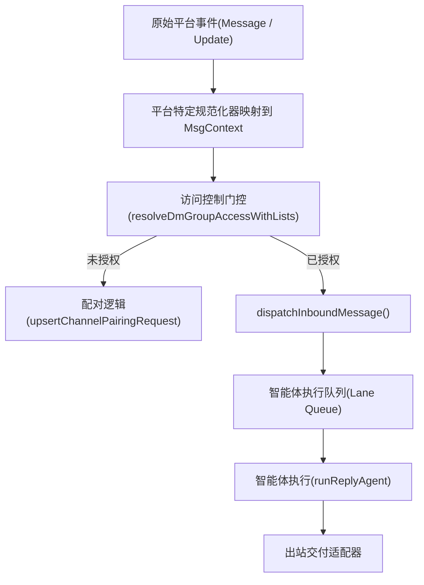

# 通道架构与插件 SDK (Channel Architecture & Plugin SDK)

相关源文件

-   [docs/channels/discord.md](https://github.com/openclaw/openclaw/blob/8873e13f/docs/channels/discord.md)
-   [docs/channels/telegram.md](https://github.com/openclaw/openclaw/blob/8873e13f/docs/channels/telegram.md)
-   [docs/gateway/configuration-reference.md](https://github.com/openclaw/openclaw/blob/8873e13f/docs/gateway/configuration-reference.md)
-   [src/acp/control-plane/manager.core.ts](https://github.com/openclaw/openclaw/blob/8873e13f/src/acp/control-plane/manager.core.ts)
-   [src/agents/pi-embedded-runner/tool-result-char-estimator.ts](https://github.com/openclaw/openclaw/blob/8873e13f/src/agents/pi-embedded-runner/tool-result-char-estimator.ts)
-   [src/agents/pi-embedded-runner/tool-result-context-guard.ts](https://github.com/openclaw/openclaw/blob/8873e13f/src/agents/pi-embedded-runner/tool-result-context-guard.ts)
-   [src/agents/tools/telegram-actions.test.ts](https://github.com/openclaw/openclaw/blob/8873e13f/src/agents/tools/telegram-actions.test.ts)
-   [src/agents/tools/telegram-actions.ts](https://github.com/openclaw/openclaw/blob/8873e13f/src/agents/tools/telegram-actions.ts)
-   [src/auto-reply/reply/agent-runner.runreplyagent.e2e.test.ts](https://github.com/openclaw/openclaw/blob/8873e13f/src/auto-reply/reply/agent-runner.runreplyagent.e2e.test.ts)
-   [src/auto-reply/reply/normalize-reply.ts](https://github.com/openclaw/openclaw/blob/8873e13f/src/auto-reply/reply/normalize-reply.ts)
-   [src/auto-reply/skill-commands.test.ts](https://github.com/openclaw/openclaw/blob/8873e13f/src/auto-reply/skill-commands.test.ts)
-   [src/auto-reply/skill-commands.ts](https://github.com/openclaw/openclaw/blob/8873e13f/src/auto-reply/skill-commands.ts)
-   [src/auto-reply/tokens.test.ts](https://github.com/openclaw/openclaw/blob/8873e13f/src/auto-reply/tokens.test.ts)
-   [src/auto-reply/tokens.ts](https://github.com/openclaw/openclaw/blob/8873e13f/src/auto-reply/tokens.ts)
-   [src/channels/allowlists/resolve-utils.test.ts](https://github.com/openclaw/openclaw/blob/8873e13f/src/channels/allowlists/resolve-utils.test.ts)
-   [src/channels/allowlists/resolve-utils.ts](https://github.com/openclaw/openclaw/blob/8873e13f/src/channels/allowlists/resolve-utils.ts)
-   [src/channels/draft-stream-loop.ts](https://github.com/openclaw/openclaw/blob/8873e13f/src/channels/draft-stream-loop.ts)
-   [src/channels/plugins/actions/actions.test.ts](https://github.com/openclaw/openclaw/blob/8873e13f/src/channels/plugins/actions/actions.test.ts)
-   [src/channels/plugins/actions/telegram.ts](https://github.com/openclaw/openclaw/blob/8873e13f/src/channels/plugins/actions/telegram.ts)
-   [src/config/schema.help.quality.test.ts](https://github.com/openclaw/openclaw/blob/8873e13f/src/config/schema.help.quality.test.ts)
-   [src/config/schema.help.ts](https://github.com/openclaw/openclaw/blob/8873e13f/src/config/schema.help.ts)
-   [src/config/schema.labels.ts](https://github.com/openclaw/openclaw/blob/8873e13f/src/config/schema.labels.ts)
-   [src/config/types.agent-defaults.ts](https://github.com/openclaw/openclaw/blob/8873e13f/src/config/types.agent-defaults.ts)
-   [src/config/types.discord.ts](https://github.com/openclaw/openclaw/blob/8873e13f/src/config/types.discord.ts)
-   [src/config/types.telegram.ts](https://github.com/openclaw/openclaw/blob/8873e13f/src/config/types.telegram.ts)
-   [src/config/zod-schema.agent-defaults.ts](https://github.com/openclaw/openclaw/blob/8873e13f/src/config/zod-schema.agent-defaults.ts)
-   [src/config/zod-schema.providers-core.ts](https://github.com/openclaw/openclaw/blob/8873e13f/src/config/zod-schema.providers-core.ts)
-   [src/discord/monitor.test.ts](https://github.com/openclaw/openclaw/blob/8873e13f/src/discord/monitor.test.ts)
-   [src/discord/monitor.ts](https://github.com/openclaw/openclaw/blob/8873e13f/src/discord/monitor.ts)
-   [src/discord/monitor/listeners.test.ts](https://github.com/openclaw/openclaw/blob/8873e13f/src/discord/monitor/listeners.test.ts)
-   [src/discord/monitor/listeners.ts](https://github.com/openclaw/openclaw/blob/8873e13f/src/discord/monitor/listeners.ts)
-   [src/discord/monitor/provider.allowlist.test.ts](https://github.com/openclaw/openclaw/blob/8873e13f/src/discord/monitor/provider.allowlist.test.ts)
-   [src/discord/monitor/provider.allowlist.ts](https://github.com/openclaw/openclaw/blob/8873e13f/src/discord/monitor/provider.allowlist.ts)
-   [src/discord/monitor/provider.skill-dedupe.test.ts](https://github.com/openclaw/openclaw/blob/8873e13f/src/discord/monitor/provider.skill-dedupe.test.ts)
-   [src/discord/monitor/provider.test.ts](https://github.com/openclaw/openclaw/blob/8873e13f/src/discord/monitor/provider.test.ts)
-   [src/discord/monitor/provider.ts](https://github.com/openclaw/openclaw/blob/8873e13f/src/discord/monitor/provider.ts)
-   [src/imessage/monitor.ts](https://github.com/openclaw/openclaw/blob/8873e13f/src/imessage/monitor.ts)
-   [src/signal/monitor.ts](https://github.com/openclaw/openclaw/blob/8873e13f/src/signal/monitor.ts)
-   [src/slack/monitor.tool-result.test.ts](https://github.com/openclaw/openclaw/blob/8873e13f/src/slack/monitor.tool-result.test.ts)
-   [src/slack/monitor.ts](https://github.com/openclaw/openclaw/blob/8873e13f/src/slack/monitor.ts)
-   [src/slack/monitor/provider.ts](https://github.com/openclaw/openclaw/blob/8873e13f/src/slack/monitor/provider.ts)
-   [src/telegram/bot-handlers.ts](https://github.com/openclaw/openclaw/blob/8873e13f/src/telegram/bot-handlers.ts)
-   [src/telegram/bot-message-context.dm-threads.test.ts](https://github.com/openclaw/openclaw/blob/8873e13f/src/telegram/bot-message-context.dm-threads.test.ts)
-   [src/telegram/bot-message-context.ts](https://github.com/openclaw/openclaw/blob/8873e13f/src/telegram/bot-message-context.ts)
-   [src/telegram/bot-message-dispatch.test.ts](https://github.com/openclaw/openclaw/blob/8873e13f/src/telegram/bot-message-dispatch.test.ts)
-   [src/telegram/bot-message-dispatch.ts](https://github.com/openclaw/openclaw/blob/8873e13f/src/telegram/bot-message-dispatch.ts)
-   [src/telegram/bot-native-commands.ts](https://github.com/openclaw/openclaw/blob/8873e13f/src/telegram/bot-native-commands.ts)
-   [src/telegram/bot.test.ts](https://github.com/openclaw/openclaw/blob/8873e13f/src/telegram/bot.test.ts)
-   [src/telegram/bot.ts](https://github.com/openclaw/openclaw/blob/8873e13f/src/telegram/bot.ts)
-   [src/telegram/bot/delivery.replies.ts](https://github.com/openclaw/openclaw/blob/8873e13f/src/telegram/bot/delivery.replies.ts)
-   [src/telegram/bot/delivery.test.ts](https://github.com/openclaw/openclaw/blob/8873e13f/src/telegram/bot/delivery.test.ts)
-   [src/telegram/bot/delivery.ts](https://github.com/openclaw/openclaw/blob/8873e13f/src/telegram/bot/delivery.ts)
-   [src/telegram/bot/helpers.test.ts](https://github.com/openclaw/openclaw/blob/8873e13f/src/telegram/bot/helpers.test.ts)
-   [src/telegram/bot/helpers.ts](https://github.com/openclaw/openclaw/blob/8873e13f/src/telegram/bot/helpers.ts)
-   [src/telegram/draft-stream.test-helpers.ts](https://github.com/openclaw/openclaw/blob/8873e13f/src/telegram/draft-stream.test-helpers.ts)
-   [src/telegram/draft-stream.test.ts](https://github.com/openclaw/openclaw/blob/8873e13f/src/telegram/draft-stream.test.ts)
-   [src/telegram/draft-stream.ts](https://github.com/openclaw/openclaw/blob/8873e13f/src/telegram/draft-stream.ts)
-   [src/telegram/lane-delivery.test.ts](https://github.com/openclaw/openclaw/blob/8873e13f/src/telegram/lane-delivery.test.ts)
-   [src/telegram/lane-delivery.ts](https://github.com/openclaw/openclaw/blob/8873e13f/src/telegram/lane-delivery.ts)
-   [src/telegram/send.test.ts](https://github.com/openclaw/openclaw/blob/8873e13f/src/telegram/send.test.ts)
-   [src/telegram/send.ts](https://github.com/openclaw/openclaw/blob/8873e13f/src/telegram/send.ts)
-   [src/web/auto-reply.ts](https://github.com/openclaw/openclaw/blob/8873e13f/src/web/auto-reply.ts)
-   [src/web/inbound.test.ts](https://github.com/openclaw/openclaw/blob/8873e13f/src/web/inbound.test.ts)
-   [src/web/inbound.ts](https://github.com/openclaw/openclaw/blob/8873e13f/src/web/inbound.ts)
-   [src/web/vcard.ts](https://github.com/openclaw/openclaw/blob/8873e13f/src/web/vcard.ts)

OpenClaw 的通道架构围绕统一的插件模型构建，该模型支持第一方（核心）和第三方集成。本页记录了定义通道行为的核心接口、插件 SDK 以及通道与智能体运行时之间的分发流。

有关特定通道实现的详细信息，请参见 [Telegram](/openclaw/openclaw/4.2-telegram-integration)、[Discord](/openclaw/openclaw/4.3-discord-integration) 以及 [其他通道](/openclaw/openclaw/4.4-other-channels)。有关通道如何融入整体系统，请参见 [通道概览 (Channels Overview)](/openclaw/openclaw/4)。

---

## 插件模型 (Plugin Model)

通道是作为“外部监听器” (external monitors) 实现的扩展。一个通道集成通常由以下部分组成：

1.  **配置模式 (Config Schema)**：定义在 `openclaw.json` 中的设置。
2.  **监听器函数 (Monitor Function)**：连接到平台并监听事件的长寿命进程。
3.  **分发逻辑 (Dispatch Logic)**：将平台事件映射到 OpenClaw 的 `MsgContext` 的代码。
4.  **交付实现 (Delivery Implementation)**：发送回复消息和附件的函数。

通道可以通过以下两种方式注册：

-   **内置 (Built-in)**：在 `src/gateway/server.impl.ts` 中显式初始化（例如 Telegram, Discord, Slack, WhatsApp, Signal, iMessage）。
-   **插件扩展 (Plugin Extension)**：通过 `openclaw/plugin-sdk` 动态加载。

---

## 插件 SDK 接口 (Plugin SDK Interfaces)

插件 SDK ([`src/plugin-sdk/index.ts`](https://github.com/openclaw/openclaw/blob/8873e13f/src/plugin-sdk/index.ts)) 提供了构建通道集成所需的类型和辅助函数。

### ChannelMonitor 接口

每个通道必须实现一个监听器函数，该函数接收 `PluginRuntime`：

```ts
export type ChannelMonitor = (runtime: PluginRuntime) => Promise<void>;
```
`PluginRuntime` 公开了对配置、会话、智能体执行和分发管道的访问权限。

### 关键 SDK 导出

| 类别 | 符号 | 描述 |
| --- | --- | --- |
| **运行时 (Runtime)** | `PluginRuntime` | 用于访问网关功能的主界面。 |
| **分发 (Dispatch)** | `dispatchInboundMessage` | 将处理后的消息推送到智能体管道的入口点。 |
| **上下文 (Context)** | `MsgContext` | 包含内容、发送者和路由元数据的规范化消息信封。 |
| **安全 (Security)** | `createScopedPairingAccess` | 针对特定通道的配对请求/批准的管理辅助函数。 |
| **策略 (Policy)** | `resolveDmGroupAccessWithLists` | 用于 DM 和群组策略评估的共享逻辑。 |
| **回复 (Reply)** | `OutboundReplyPayload` | 发送回通道的规范化回复。 |
| **心跳 (Heartbeat)** | `ChannelHeartbeatAdapter` | 支持定期状态检查/消息的通道接口。 |

**来源**：[`src/plugin-sdk/index.ts1-100`](https://github.com/openclaw/openclaw/blob/8873e13f/src/plugin-sdk/index.ts#L1-L100)

---

## 分发管道 (Dispatch Pipeline)

分发管道负责获取原始平台消息并将其转化为智能体轮次 (agent turn)。


### 1. 规范化 (Normalization)

规范化器将平台特定的消息格式（例如 Telegram 的 `Message` 或 Slack 的 `event`）转换为 `MsgContext`：

```ts
export interface MsgContext {
  body: string;               // 消息文本
  chatId: string;             // 通道内的聊天/房间 ID
  senderId: string;           // 发送者标识符
  senderName?: string;        // 显示名称
  replyToId?: string;         // 被回复的消息 ID
  media?: MediaItem[];        // 图像、音频、视频附件
  isOwner?: boolean;          // 是否为已配对/白名单发送者
  // ... 其他元数据
}
```
### 2. 访问控制 (Access Control)

通道使用 SDK 中的 `resolveDmGroupAccessWithLists` [`src/security/dm-policy-shared.js`](https://github.com/openclaw/openclaw/blob/8873e13f/src/security/dm-policy-shared.js) 来强制执行：

-   **DM 策略** (`dmPolicy`)：`pairing`, `allowlist`, `open`, 或 `disabled`。
-   **群组策略** (`groupPolicy`)：`allowlist`, `open`, 或 `disabled`。
-   **提及门控**：根据 `requireMention` 设置过滤群组消息。

### 3. 分发 (Dispatch)

一旦消息通过了访问控制，它会被传递给 `dispatchInboundMessage`。该函数：

1.  根据配置解析目标的 **智能体 ID**。
2.  为该对话构造一个 **会话密钥 (Session Key)**。
3.  通过 `runReplyAgent` 启动智能体执行管道。

**来源**：[`src/auto-reply/dispatch.js`](https://github.com/openclaw/openclaw/blob/8873e13f/src/auto-reply/dispatch.js) [`src/routing/resolve-route.js`](https://github.com/openclaw/openclaw/blob/8873e13f/src/routing/resolve-route.js)

---

## 交付适配器 (Delivery Adapters)

智能体完成后，其回复通过交付适配器路由回通道。

### 单个回复交付 (Single Reply Delivery)

大多数通道实现了一个 `sendMessage` 函数，该函数接收 `ReplyPayload`。核心职责包括：

-   **文本格式化**：将 Markdown 转换为平台原生格式。
-   **分块 (Chunking)**：如果回复超过平台限制（例如 Telegram 的 4000 字符），则将其分割。
-   **媒体处理**：上传并附加图像、音频或视频。
-   **交互式组件**：渲染按钮或选择菜单（例如在 Discord 上）。

### 流式预览 (Streaming Previews)

支持流式的通道（Telegram, Discord, Slack）使用 `createDraftStream` 模式。随着智能体生成 Token，它们会：

1.  发送一个临时的“草稿”消息。
2.  随着新文本的产生持续更新/编辑该消息。
3.  完成后，用最终格式化的回复替换草稿。

**来源**：[`src/channels/draft-stream-loop.ts`](https://github.com/openclaw/openclaw/blob/8873e13f/src/channels/draft-stream-loop.ts) [`src/telegram/draft-stream.ts`](https://github.com/openclaw/openclaw/blob/8873e13f/src/telegram/draft-stream.ts)

---

## 配置架构 (Configuration Schema)

通道配置定义在 `openclaw.json` 的 `channels` 部分。插件可以导出它们自己的 Zod 模式，这些模式会在加载时合并到根配置中。

### 通用通道配置

所有通道均继承基础设置：

| 字段 | 默认值 | 描述 |
| --- | --- | --- |
| `enabled` | `true` | 是否启动此通道。 |
| `dmPolicy` | `pairing` | 私信访问规则。 |
| `groupPolicy` | `allowlist` | 群组/房间访问规则。 |
| `allowFrom` | `[]` | 白名单用户 ID 数组。 |
| `requireMention` | `true` | 在群组中是否需要提到智能体。 |
| `streaming` | `off` | 是否启用实时回复预览。 |

**来源**：[`src/config/zod-schema.providers-core.ts1-35`](https://github.com/openclaw/openclaw/blob/8873e13f/src/config/zod-schema.providers-core.ts#L1-L35)

---

## 扩展性钩子 (Extensibility Hooks)

通道可以通过 SDK 注册钩子以修改全局行为：

-   `agent:system-prompt`：在提示词发送给模型之前对其进行修改。
-   `agent:bootstrap`：修改注入到智能体工作区的文件。
-   `inbound:message`：在消息分发前进行全局拦截。

有关钩子系统的详情，请参见 [插件 (Plugins)](/openclaw/openclaw/8.3-plugins)。
