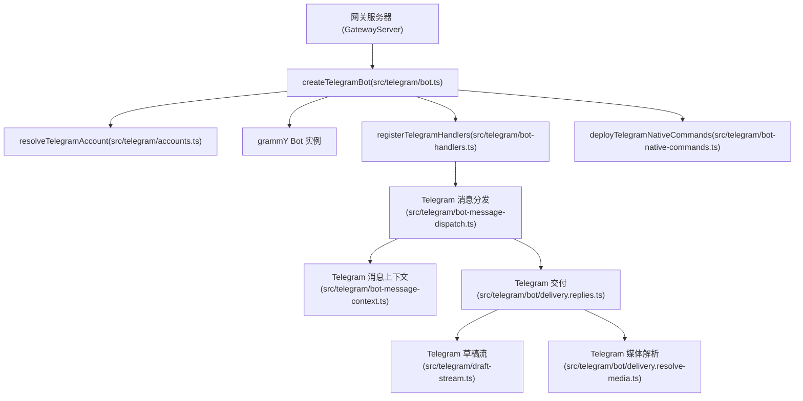

# Telegram 集成 (Telegram Integration)

相关源文件

-   [docs/channels/telegram.md](https://github.com/openclaw/openclaw/blob/8873e13f/docs/channels/telegram.md)
-   [src/telegram/bot.ts](https://github.com/openclaw/openclaw/blob/8873e13f/src/telegram/bot.ts)
-   [src/telegram/bot-handlers.ts](https://github.com/openclaw/openclaw/blob/8873e13f/src/telegram/bot-handlers.ts)
-   [src/telegram/bot-message-context.ts](https://github.com/openclaw/openclaw/blob/8873e13f/src/telegram/bot-message-context.ts)
-   [src/telegram/bot-message-dispatch.ts](https://github.com/openclaw/openclaw/blob/8873e13f/src/telegram/bot-message-dispatch.ts)
-   [src/telegram/bot-native-commands.ts](https://github.com/openclaw/openclaw/blob/8873e13f/src/telegram/bot-native-commands.ts)
-   [src/telegram/bot/delivery.replies.ts](https://github.com/openclaw/openclaw/blob/8873e13f/src/telegram/bot/delivery.replies.ts)
-   [src/telegram/bot/delivery.resolve-media.ts](https://github.com/openclaw/openclaw/blob/8873e13f/src/telegram/bot/delivery.resolve-media.ts)
-   [src/telegram/draft-stream.ts](https://github.com/openclaw/openclaw/blob/8873e13f/src/telegram/draft-stream.ts)
-   [src/telegram/group-access.ts](https://github.com/openclaw/openclaw/blob/8873e13f/src/telegram/group-access.ts)
-   [src/telegram/send.ts](https://github.com/openclaw/openclaw/blob/8873e13f/src/telegram/send.ts)
-   [src/config/zod-schema.providers-core.ts](https://github.com/openclaw/openclaw/blob/8873e13f/src/config/zod-schema.providers-core.ts)

本页详细介绍了 OpenClaw 中的 Telegram 通道集成：机器人运行时的生命周期、入站消息的处理与分发、访问控制、媒体处理、流式预览以及配置模式。

有关通用的通道架构和插件 SDK 模式，请参见 [4.1](/openclaw/openclaw/4.1-channel-architecture)。有关配置字段的详细参考，请参见 [2.3.1](/openclaw/openclaw/2.3.1-configuration-reference)。

---

## 概览 (Overview)

Telegram 集成通过官方的 Telegram 机器人 API (Bot API) 将 OpenClaw 连接到 Telegram，底层使用了 `grammY` 框架。它支持长轮询 (long-polling) 和 Webhook 两种连接模式。主入口点是 [src/telegram/bot.ts](https://github.com/openclaw/openclaw/blob/8873e13f/src/telegram/bot.ts) 中的 `createTelegramBot`，该函数协调身份验证、处理器注册、原生命令部署和事件循环。

**图表：Telegram 集成顶层结构**

**来源**：[src/telegram/bot.ts1-416](https://github.com/openclaw/openclaw/blob/8873e13f/src/telegram/bot.ts#L1-L416)

---

## 机器人设置与连接模式

Telegram 机器人需要从 `@BotFather` 获取机器人令牌。OpenClaw 支持两种运行模式：

| 模式 | 触发条件 | 说明 |
| --- | --- | --- |
| **长轮询 (Long Polling)** | 默认 | 机器人主动向 Telegram 发起 GET 请求以获取更新。无需公共 IP 或 TLS。 |
| **Webhook** | 配置了 `webhookUrl` 或通过插件启用 | Telegram 在收到更新时将其推送到 OpenClaw 的 HTTP 端点。需要 TLS 和公共访问。 |

令牌解析顺序：

1.  `opts.token` (程序化)
2.  `channels.telegram.botToken` (配置)
3.  `TELEGRAM_BOT_TOKEN` 环境变量 (仅限默认账户)

**来源**：[src/telegram/bot.ts69-114](https://github.com/openclaw/openclaw/blob/8873e13f/src/telegram/bot.ts#L69-L114) [src/config/zod-schema.providers-core.ts152-315](https://github.com/openclaw/openclaw/blob/8873e13f/src/config/zod-schema.providers-core.ts#L152-L315)

---

## `createTelegramBot` 生命周期

关键步骤如下：

1.  **账户解析**：`resolveTelegramAccount` 将各账户的配置与根 `channels.telegram` 块合并。
2.  **处理器注册**：`registerTelegramHandlers` 将各种 Telegram 事件映射到处理函数。
3.  **原生命令部署**：`deployTelegramNativeCommands` 将斜杠命令（如 `/status`, `/help`）推送到 Telegram 菜单。
4.  **启动**：在长轮询模式下调用 `bot.start()`，或者在 Webhook 模式下设置相应的路由。

**来源**：[src/telegram/bot.ts116-416](https://github.com/openclaw/openclaw/blob/8873e13f/src/telegram/bot.ts#L116-L416)

---

## 消息处理与分发

所有的入站消息都会通过 [src/telegram/bot-message-dispatch.ts](https://github.com/openclaw/openclaw/blob/8873e13f/src/telegram/bot-message-dispatch.ts) 中的 `dispatchTelegramMessage` 进行处理。

### 处理流程

1.  **去重**：`createTelegramUpdateDedupe` 基于 `update_id` 过滤重复更新。
2.  **上下文构建**：`buildTelegramMessageContext` 将 Telegram 的 `ctx` 对象转换为 OpenClaw 规范化的 `MsgContext`。这包括解析发送者身份、聊天 ID 和媒体内容。
3.  **访问控制**：
    -   **私信 (DM)**：由 `handleSignalDirectMessageAccess` 解析 `dmPolicy`（`pairing` | `allowlist` | `open` | `disabled`）。
    -   **群组**：`evaluateTelegramGroupBaseAccess` 根据白名单和策略检查群组访问权限。
4.  **提及检测**：在群组中，`resolveMentionGatingWithBypass` 检查机器人是否被提及（通过原生实体或正则模式）。
5.  **路由**：`resolveAgentRoute` 确定应由哪个智能体处理该会话。
6.  **智能体执行**：调用 `runReplyAgent` 启动 AI 执行。

**来源**：[src/telegram/bot-message-dispatch.ts1-250](https://github.com/openclaw/openclaw/blob/8873e13f/src/telegram/bot-message-dispatch.ts#L1-L250) [src/telegram/bot-message-context.ts170-720](https://github.com/openclaw/openclaw/blob/8873e13f/src/telegram/bot-message-context.ts#L170-L720) [src/telegram/group-access.ts1-100](https://github.com/openclaw/openclaw/blob/8873e13f/src/telegram/group-access.ts#L1-L100)

---

## 媒体处理 (Media Handling)

### 入站媒体解析

[src/telegram/bot/delivery.resolve-media.ts](https://github.com/openclaw/openclaw/blob/8873e13f/src/telegram/bot/delivery.resolve-media.ts) 中的 `resolveMedia` 通过 `bot.api.getFile()` 获取媒体，并从 Telegram CDN 下载：

1.  **文件 ID 解析**：从照片、视频、文档、音频、语音、贴纸中提取 `file_id`。
2.  **文件元数据获取**：`bot.api.getFile(fileId)` → `file_path`。
3.  **下载**：从 `https://api.telegram.org/file/bot<token>/<file_path>` 下载。
4.  **保存至磁盘**：`saveMediaBuffer` 将其写入 `~/.openclaw/media`。

**媒体组处理**：具有相同 `media_group_id` 的更新会被收集 `MEDIA_GROUP_TIMEOUT_MS`（默认 1000 毫秒）时长，然后批量处理 [src/telegram/bot-handlers.ts107](https://github.com/openclaw/openclaw/blob/8873e13f/src/telegram/bot-handlers.ts#L107-LNaN)。

**贴纸缓存**：[src/telegram/sticker-cache.ts](https://github.com/openclaw/openclaw/blob/8873e13f/src/telegram/sticker-cache.ts) 中的 `cacheSticker` 存储贴纸图片的描述，以便重复发送贴纸时可以重用描述而无需重新分析。

**来源**：[src/telegram/bot/delivery.resolve-media.ts](https://github.com/openclaw/openclaw/blob/8873e13f/src/telegram/bot/delivery.resolve-media.ts) [src/telegram/bot-handlers.ts107](https://github.com/openclaw/openclaw/blob/8873e13f/src/telegram/bot-handlers.ts#L107-LNaN) [src/telegram/bot-updates.ts](https://github.com/openclaw/openclaw/blob/8873e13f/src/telegram/bot-updates.ts) [src/telegram/sticker-cache.ts](https://github.com/openclaw/openclaw/blob/8873e13f/src/telegram/sticker-cache.ts)

### 出站媒体交付

`sendMessageTelegram` 处理媒体交付 [src/telegram/send.ts600](https://github.com/openclaw/openclaw/blob/8873e13f/src/telegram/send.ts#L600-LNaN)：

-   **照片**：带说明文字的 `sendPhoto`。
-   **视频**：带说明文字的 `sendVideo`。
-   **音频**：`sendAudio`（若 `asVoice: true` 则为 `sendVoice`）。
-   **文档**：带说明文字的 `sendDocument`。
-   **贴纸**：通过 `sendStickerTelegram`。

**媒体加载**：[src/web/media.ts](https://github.com/openclaw/openclaw/blob/8873e13f/src/web/media.ts) 中的 `loadWebMedia` 根据 `mediaUrl` / `mediaLocalRoots` 选项从 URL 或本地路径获取媒体。

**说明文字分割**：[src/telegram/caption.ts](https://github.com/openclaw/openclaw/blob/8873e13f/src/telegram/caption.ts) 中的 `splitTelegramCaption` 将超过 1024 字符的说明文字分割为单独的文本消息。

**来源**：[src/telegram/send.ts600](https://github.com/openclaw/openclaw/blob/8873e13f/src/telegram/send.ts#L600-LNaN) [src/web/media.ts](https://github.com/openclaw/openclaw/blob/8873e13f/src/web/media.ts) [src/telegram/caption.ts](https://github.com/openclaw/openclaw/blob/8873e13f/src/telegram/caption.ts)

---

## 配置模式 (Configuration Schema)

### 账户级模式：`TelegramAccountSchema`

定义于 [src/config/zod-schema.providers-core.ts152-260](https://github.com/openclaw/openclaw/blob/8873e13f/src/config/zod-schema.providers-core.ts#L152-L260)：

| 字段 | 类型 | 目的 |
| --- | --- | --- |
| `botToken` | `SecretInputSchema` | 机器人令牌（或 `tokenFile`，或 `TELEGRAM_BOT_TOKEN` 环境变量） |
| `dmPolicy` | `DmPolicySchema` | `pairing` | `allowlist` | `open` | `disabled` |
| `allowFrom` | `Array<string | number>` | 私信发送者白名单（数字 ID 或带前缀的 ID） |
| `groups` | `Record<string, TelegramGroupSchema>` | 针对每个群组的配置（ID 或 `"*"`） |
| `groupPolicy` | `GroupPolicySchema` | `allowlist` | `open` | `disabled` |
| `groupAllowFrom` | `Array<string | number>` | 群组发送者白名单 |
| `streaming` | `boolean | enum` | `off` | `partial` | `block` | `progress` |
| `customCommands` | `Array<TelegramCustomCommandSchema>` | 自定义机器人菜单命令 |
| `historyLimit` | `number` | 群组历史消息数量 |
| `dmHistoryLimit` | `number` | 私信历史消息数量 |
| `direct` | `Record<string, TelegramDirectSchema>` | 针对每个私信的配置覆盖 |
| `threadBindings` | `object` | 线程绑定策略（启用、闲置时长、最大时长） |

**群组模式**：`TelegramGroupSchema` 支持 `requireMention`、`allowFrom`、`skills`、`systemPrompt` 以及嵌套的 `topics` [src/config/zod-schema.providers-core.ts75-88](https://github.com/openclaw/openclaw/blob/8873e13f/src/config/zod-schema.providers-core.ts#L75-L88)。

**话题模式**：`TelegramTopicSchema` 允许针对每个话题覆盖 `requireMention`、`allowFrom`、`skills`、`systemPrompt` 和 `agentId` [src/config/zod-schema.providers-core.ts62-73](https://github.com/openclaw/openclaw/blob/8873e13f/src/config/zod-schema.providers-core.ts#L62-L73)。

**来源**：[src/config/zod-schema.providers-core.ts152-315](https://github.com/openclaw/openclaw/blob/8873e13f/src/config/zod-schema.providers-core.ts#L152-L315) [src/config/types.telegram.ts](https://github.com/openclaw/openclaw/blob/8873e13f/src/config/types.telegram.ts)

### 顶级模式：`TelegramConfigSchema`

定义于 [src/config/zod-schema.providers-core.ts262-315](https://github.com/openclaw/openclaw/blob/8873e13f/src/config/zod-schema.providers-core.ts#L262-L315)，扩展了 `TelegramAccountSchemaBase`，增加了：

-   `accounts`：`Record<string, TelegramAccountSchema>`，用于多账户设置。
-   `defaultAccount`：`string`，用于选择默认账户。

**验证精化 (Validation refinements)**：

-   `requireOpenAllowFrom`：若 `dmPolicy="open"`，则要求 `allowFrom` 包含 `"*"`。
-   `requireAllowlistAllowFrom`：若 `dmPolicy="allowlist"`，则要求 `allowFrom` 中至少有一个发送者。
-   `validateTelegramCustomCommands`：检查命令名称冲突和无效模式。
-   针对每个账户的验证：对每个账户条目应用相同的验证逻辑。

**来源**：[src/config/zod-schema.providers-core.ts262-315](https://github.com/openclaw/openclaw/blob/8873e13f/src/config/zod-schema.providers-core.ts#L262-L315) [src/config/telegram-custom-commands.ts](https://github.com/openclaw/openclaw/blob/8873e13f/src/config/telegram-custom-commands.ts)
