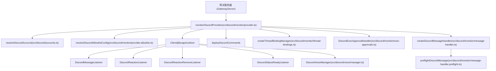
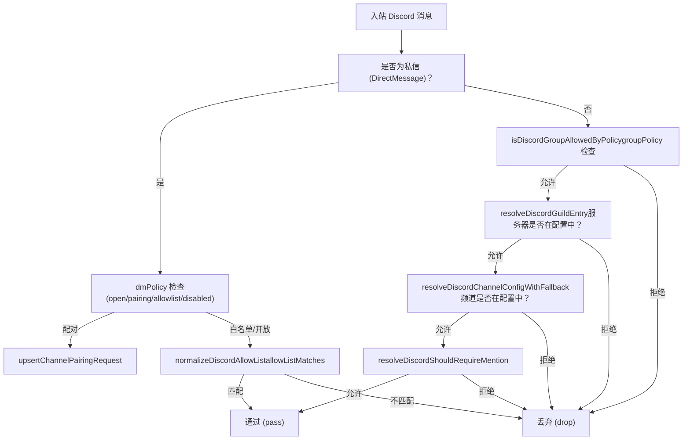
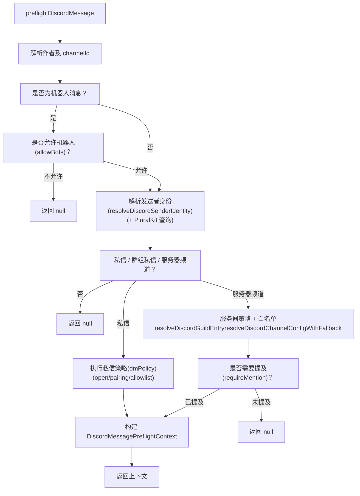
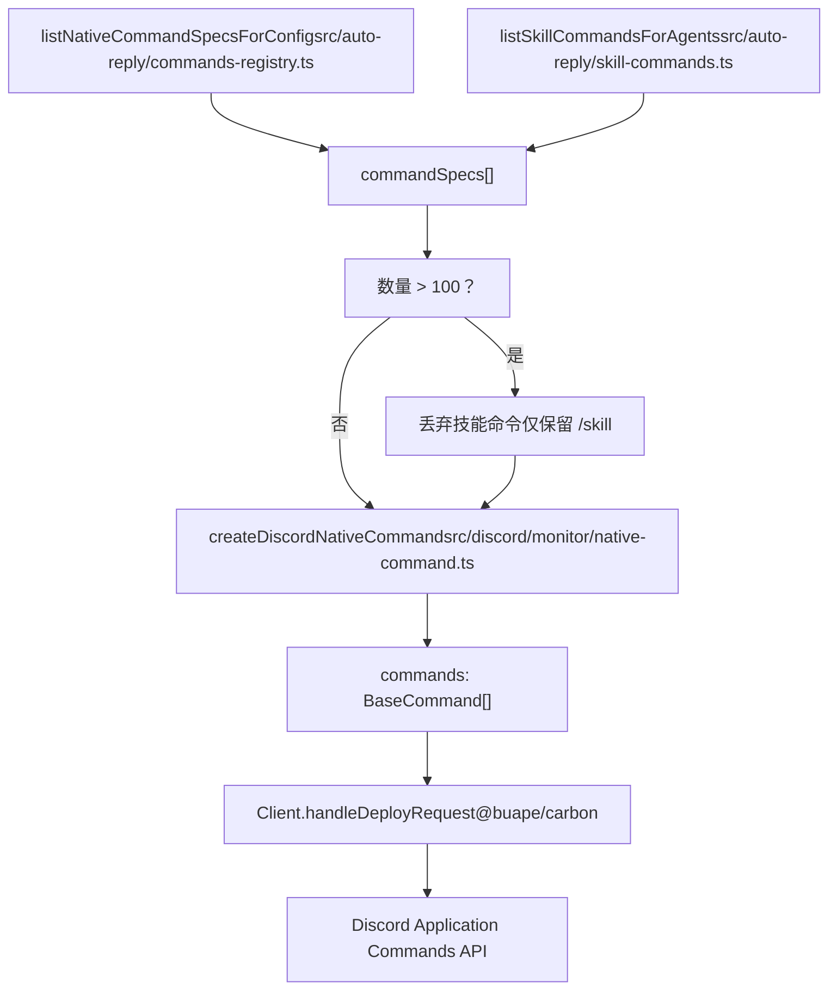
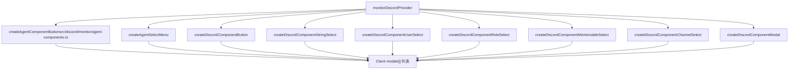

# Discord 集成 (Discord Integration)

相关源文件

-   [docs/channels/discord.md](https://github.com/openclaw/openclaw/blob/8873e13f/docs/channels/discord.md)
-   [docs/channels/telegram.md](https://github.com/openclaw/openclaw/blob/8873e13f/docs/channels/telegram.md)
-   [docs/gateway/configuration-reference.md](https://github.com/openclaw/openclaw/blob/8873e13f/docs/gateway/configuration-reference.md)
-   [src/acp/control-plane/manager.core.ts](https://github.com/openclaw/openclaw/blob/8873e13f/src/acp/control-plane/manager.core.ts)
-   [src/agents/pi-embedded-runner/tool-result-char-estimator.ts](https://github.com/openclaw/openclaw/blob/8873e13f/src/agents/pi-embedded-runner/tool-result-char-estimator.ts)
-   [src/agents/pi-embedded-runner/tool-result-context-guard.ts](https://github.com/openclaw/openclaw/blob/8873e13f/src/agents/pi-embedded-runner/tool-result-context-guard.ts)
-   [src/agents/tools/telegram-actions.test.ts](https://github.com/openclaw/openclaw/blob/8873e13f/src/agents/tools/telegram-actions.test.ts)
-   [src/agents/tools/telegram-actions.ts](https://github.com/openclaw/openclaw/blob/8873e13f/src/agents/tools/telegram-actions.ts)
-   [src/auto-reply/skill-commands.test.ts](https://github.com/openclaw/openclaw/blob/8873e13f/src/auto-reply/skill-commands.test.ts)
-   [src/auto-reply/skill-commands.ts](https://github.com/openclaw/openclaw/blob/8873e13f/src/auto-reply/skill-commands.ts)
-   [src/channels/allowlists/resolve-utils.test.ts](https://github.com/openclaw/openclaw/blob/8873e13f/src/channels/allowlists/resolve-utils.test.ts)
-   [src/channels/allowlists/resolve-utils.ts](https://github.com/openclaw/openclaw/blob/8873e13f/src/channels/allowlists/resolve-utils.ts)
-   [src/channels/plugins/actions/actions.test.ts](https://github.com/openclaw/openclaw/blob/8873e13f/src/channels/plugins/actions/actions.test.ts)
-   [src/channels/plugins/actions/telegram.ts](https://github.com/openclaw/openclaw/blob/8873e13f/src/channels/plugins/actions/telegram.ts)
-   [src/config/schema.help.quality.test.ts](https://github.com/openclaw/openclaw/blob/8873e13f/src/config/schema.help.quality.test.ts)
-   [src/config/schema.help.ts](https://github.com/openclaw/openclaw/blob/8873e13f/src/config/schema.help.ts)
-   [src/config/schema.labels.ts](https://github.com/openclaw/openclaw/blob/8873e13f/src/config/schema.labels.ts)
-   [src/config/types.agent-defaults.ts](https://github.com/openclaw/openclaw/blob/8873e13f/src/config/types.agent-defaults.ts)
-   [src/config/types.discord.ts](https://github.com/openclaw/openclaw/blob/8873e13f/src/config/types.discord.ts)
-   [src/config/types.telegram.ts](https://github.com/openclaw/openclaw/blob/8873e13f/src/config/types.telegram.ts)
-   [src/config/zod-schema.agent-defaults.ts](https://github.com/openclaw/openclaw/blob/8873e13f/src/config/zod-schema.agent-defaults.ts)
-   [src/config/zod-schema.providers-core.ts](https://github.com/openclaw/openclaw/blob/8873e13f/src/config/zod-schema.providers-core.ts)
-   [src/discord/monitor.test.ts](https://github.com/openclaw/openclaw/blob/8873e13f/src/discord/monitor.test.ts)
-   [src/discord/monitor/listeners.test.ts](https://github.com/openclaw/openclaw/blob/8873e13f/src/discord/monitor/listeners.test.ts)
-   [src/discord/monitor/listeners.ts](https://github.com/openclaw/openclaw/blob/8873e13f/src/discord/monitor/listeners.ts)
-   [src/discord/monitor/provider.allowlist.test.ts](https://github.com/openclaw/openclaw/blob/8873e13f/src/discord/monitor/provider.allowlist.test.ts)
-   [src/discord/monitor/provider.allowlist.ts](https://github.com/openclaw/openclaw/blob/8873e13f/src/discord/monitor/provider.allowlist.ts)
-   [src/discord/monitor/provider.skill-dedupe.test.ts](https://github.com/openclaw/openclaw/blob/8873e13f/src/discord/monitor/provider.skill-dedupe.test.ts)
-   [src/discord/monitor/provider.test.ts](https://github.com/openclaw/openclaw/blob/8873e13f/src/discord/monitor/provider.test.ts)
-   [src/discord/monitor/provider.ts](https://github.com/openclaw/openclaw/blob/8873e13f/src/discord/monitor/provider.ts)
-   [src/slack/monitor/provider.ts](https://github.com/openclaw/openclaw/blob/8873e13f/src/slack/monitor/provider.ts)
-   [src/telegram/send.test.ts](https://github.com/openclaw/openclaw/blob/8873e13f/src/telegram/send.test.ts)
-   [src/telegram/send.ts](https://github.com/openclaw/openclaw/blob/8873e13f/src/telegram/send.ts)

本页详细记录了 OpenClaw 中的 Discord 通道集成：Discord 机器人的运行时生命周期、入站消息的授权与分发、服务器（Guild）/频道白名单的解析方式、线程绑定行为、执行审批的交互式组件以及原生斜杠命令的部署。

有关通用的通道架构和插件 SDK 模式，请参见 [4.1](/openclaw/openclaw/4.1-channel-architecture)。有关配置字段的详细参考，请参见 [2.3.1](/openclaw/openclaw/2.3.1-configuration-reference)。

---

## 概览 (Overview)

Discord 集成通过官方的网关 WebSocket 将 OpenClaw 连接到 Discord，底层使用了 `@buape/carbon` 库。它作为通道启动的一部分由 OpenClaw 网关启动。主入口点是 [src/discord/monitor/provider.ts](https://github.com/openclaw/openclaw/blob/8873e13f/src/discord/monitor/provider.ts) 中的 `monitorDiscordProvider`，该函数协调身份验证、命令部署、消息监听器、线程绑定、执行审批处理器和智能体组件。

**图表：Discord 集成顶层结构**

**来源**：[src/discord/monitor/provider.ts1-687](https://github.com/openclaw/openclaw/blob/8873e13f/src/discord/monitor/provider.ts#L1-L687)

---

## 机器人设置与特权 Intent

Discord 机器人需要从 Discord 开发者门户获取机器人令牌，并在应用程序中启用特定的**特权网关 Intent (privileged gateway intents)**：

| Intent | 是否必填 | 目的 |
| --- | --- | --- |
| 消息内容 Intent | 是 | 接收服务器内的消息文本 |
| 服务器成员 Intent | 推荐 | 角色白名单、名称到 ID 的解析 |
| 在线状态 Intent | 可选 | 在线状态追踪 (`channels.discord.intents.presence`) |

令牌解析顺序：

1.  `opts.token` (程序化)
2.  `channels.discord.token` (配置)
3.  `DISCORD_BOT_TOKEN` 环境变量 (仅限默认账户)

多账户设置在 `channels.discord.accounts.<accountId>` 下进行配置。具名账户在未设置自身的 `allowFrom` 时，会继承根级别的 `channels.discord.allowFrom`，但不会继承 `channels.discord.accounts.default.allowFrom`。

**来源**：[src/discord/monitor/provider.ts249-261](https://github.com/openclaw/openclaw/blob/8873e13f/src/discord/monitor/provider.ts#L249-L261) [src/config/zod-schema.providers-core.ts406-554](https://github.com/openclaw/openclaw/blob/8873e13f/src/config/zod-schema.providers-core.ts#L406-L554)

---

## `monitorDiscordProvider` 生命周期

**图表：`monitorDiscordProvider` 启动序列**

**来源**：[src/discord/monitor/provider.ts249-662](https://github.com/openclaw/openclaw/blob/8873e13f/src/discord/monitor/provider.ts#L249-L662)

`monitorDiscordProvider` 中的关键步骤：

1.  **账户解析**：`resolveDiscordAccount` 将每个账户的配置与根 `channels.discord` 块合并。
2.  **白名单解析**：`resolveDiscordAllowlistConfig` 调用 Discord REST API 将服务器标识 (slug) 解析为 ID，并验证用户白名单。`channels.discord.guilds` 中基于标识的条目会在启动时被解析为数字 ID。
3.  **获取应用程序 ID**：调用 `fetchDiscordApplicationId`，超时时间为 4 秒，以获取机器人的 Discord 应用程序 ID。
4.  **命令构建**：`listNativeCommandSpecsForConfig` 从原生命令注册表中组装斜杠命令；每个命令都用 `createDiscordNativeCommand` 封装。如果总数超过 100 个命令，则会丢弃特定技能的命令并记录警告。
5.  **组件注册**：在 `Client` 上注册交互式组件，包括执行审批按钮、智能体组件按钮、模型选择器和模态框。
6.  **监听器注册**：通过 `registerDiscordListener` 挂载 `DiscordMessageListener`、`DiscordReactionListener`、`DiscordReactionRemoveListener` 以及可选的 `DiscordPresenceListener`。
7.  **网关生命周期**：`runDiscordGatewayLifecycle` 驱动 WebSocket 连接，处理重新连接和中止信号。

**来源**：[src/discord/monitor/provider.ts249-662](https://github.com/openclaw/openclaw/blob/8873e13f/src/discord/monitor/provider.ts#L249-L662)

---

## 访问控制：服务器与频道白名单

白名单解析由 [src/discord/monitor/allow-list.ts](https://github.com/openclaw/openclaw/blob/8873e13f/src/discord/monitor/allow-list.ts) 中的函数处理。

**图表：白名单解析层级**

**来源**：[src/discord/monitor/message-handler.preflight.ts108-400](https://github.com/openclaw/openclaw/blob/8873e13f/src/discord/monitor/message-handler.preflight.ts#L108-L400) [src/discord/monitor/allow-list.ts1-200](https://github.com/openclaw/openclaw/blob/8873e13f/src/discord/monitor/allow-list.ts#L1-L200)

### 服务器条目解析

`resolveDiscordGuildEntry` 通过以下方式在 `channels.discord.guilds` 中查找服务器：

1.  精确的数字 ID 匹配。
2.  标识 (slug) 键匹配（例如 `"friends-of-openclaw"`）。
3.  通配符 `"*"` 回退。

标识通过 `normalizeDiscordSlug` 进行规范化：转换为小写，剥离 `#`，并将非字母数字字符序列合并为 `-`。

### 频道配置解析

`resolveDiscordChannelConfigWithFallback` 用于普通频道和线程：

-   对于普通频道：按频道 ID 匹配，然后按标识匹配，最后按通配符 `"*"` 回退。
-   对于线程：使用其**父级**频道的 ID/标识进行匹配（有意不根据线程名称/标识匹配频道配置）。

已解析配置上的 `matchSource` 字段指示匹配来源为 `"direct"`、`"parent"` 或 `"wildcard"`。

### 用户与角色白名单

每个服务器和每个频道的配置都接受 `users`（ID 或名称）和 `roles`（仅限角色 ID）。当发送者匹配 `users` **或** `roles` 时，即视为允许。名称/标签匹配默认禁用；通过 `channels.discord.dangerouslyAllowNameMatching: true` 开启。

`normalizeDiscordAllowList` 解析原始列表，将数字 ID（放入 `ids` 集合）与类似名称的字符串（放入 `names` 集合）分开。前缀 `discord:`、`user:`、`pk:` 会被剥离。

**来源**：[src/discord/monitor/allow-list.ts56-200](https://github.com/openclaw/openclaw/blob/8873e13f/src/discord/monitor/allow-list.ts#L56-L200) [src/discord/monitor/message-handler.preflight.ts177-310](https://github.com/openclaw/openclaw/blob/8873e13f/src/discord/monitor/message-handler.preflight.ts#L177-L310)

---

## 消息预检 (Message Preflight)

每个入站消息都会经过 [src/discord/monitor/message-handler.preflight.ts](https://github.com/openclaw/openclaw/blob/8873e13f/src/discord/monitor/message-handler.preflight.ts) 中的 `preflightDiscordMessage` 处理。该函数在成功时返回一个 `DiscordMessagePreflightContext`，或者返回 `null` 以丢弃消息。

**图表：`preflightDiscordMessage` 决策流程**

**配对流**：当 `dmPolicy="pairing"` 且发送者不在白名单中时，调用 `upsertChannelPairingRequest`，机器人通过 `buildPairingReply` 发送配对码回复。

`resolveDiscordSenderIdentity` 处理 PluralKit 代理消息：当 `pluralkit.enabled=true` 时，在解析发送者身份之前会先调用 `fetchPluralKitMessageInfo`。

**来源**：[src/discord/monitor/message-handler.preflight.ts132-158](https://github.com/openclaw/openclaw/blob/8873e13f/src/discord/monitor/message-handler.preflight.ts#L132-L158) [src/discord/monitor/sender-identity.ts](https://github.com/openclaw/openclaw/blob/8873e13f/src/discord/monitor/sender-identity.ts)

---

## 会话密钥 (Session Keys)

| 场景 | 会话密钥模式 |
| --- | --- |
| 私信 (默认 `dmScope=main`) | `agent:<agentId>:main` |
| 服务器频道 | `agent:<agentId>:discord:channel:<channelId>` |
| 线程 | `agent:<agentId>:discord:channel:<threadId>` |
| 斜杠命令 | `agent:<agentId>:discord:slash:<userId>` |

服务器频道会话按频道 ID 隔离。线程会话使用线程自身的 ID 作为频道 ID 组件。

**来源**：[src/discord/monitor/provider.ts257-260](https://github.com/openclaw/openclaw/blob/8873e13f/src/discord/monitor/provider.ts#L257-L260) [docs/channels/discord.md254-260](https://github.com/openclaw/openclaw/blob/8873e13f/docs/channels/discord.md#L254-L260)

---

## 线程绑定 (Thread Bindings)

线程绑定将 Discord 线程与智能体会话关联起来，使自主子智能体能够直接在线程中发帖。

`createThreadBindingManager` 或 `createNoopThreadBindingManager` 在启动时根据 `channels.discord.threadBindings.enabled`（默认：`true`）构建。

`channels.discord.threadBindings` 下的配置字段：

| 字段 | 默认值 | 描述 |
| --- | --- | --- |
| `enabled` | `true` | 启用/禁用线程绑定子系统 |
| `idleHours` | `24` | 闲置超时后线程绑定过期 |
| `maxAgeHours` | `0` (禁用) | 到达绝对最大时长后过期 |
| `spawnSubagentSessions` | — | 控制子智能体在线程中的衍生行为 |
| `spawnAcpSessions` | — | 控制 ACP 路由的线程衍生行为 |

在启动时，`reconcileAcpThreadBindingsOnStartup` 移除先前会话中陈旧的 ACP 线程绑定。

`isRecentlyUnboundThreadWebhookMessage` 防止重复处理来自最近刚取消绑定的线程的 Webhook 消息。

**来源**：[src/discord/monitor/provider.ts382-401](https://github.com/openclaw/openclaw/blob/8873e13f/src/discord/monitor/provider.ts#L382-L401) [src/discord/monitor/thread-bindings.ts](https://github.com/openclaw/openclaw/blob/8873e13f/src/discord/monitor/thread-bindings.ts)

---

## 执行审批 (Exec Approvals)

当 `channels.discord.execApprovals.enabled=true` 时，OpenClaw 会将执行审批请求路由到 Discord，作为带有批准/拒绝按钮的交互式消息。

`DiscordExecApprovalHandler` ([src/discord/monitor/exec-approvals.ts](https://github.com/openclaw/openclaw/blob/8873e13f/src/discord/monitor/exec-approvals.ts)) 在 `monitorDiscordProvider` 中实例化，并接收账户配置。`createExecApprovalButton` 在 `Client` 上注册按钮组件。

`channels.discord.execApprovals` 下的配置：

| 字段 | 描述 |
| --- | --- |
| `enabled` | 启用 Discord 执行审批流 |
| `approvers` | 允许批准的 Discord 用户 ID |
| `agentFilter` | 限制哪些智能体 ID 触发审批 |
| `sessionFilter` | 限制哪些会话密钥触发审批 |
| `cleanupAfterResolve` | 批准/拒绝后删除按钮消息 |
| `target` | 发送审批请求的目标：`dm`、`channel` 或 `both` |

**来源**：[src/discord/monitor/provider.ts430-471](https://github.com/openclaw/openclaw/blob/8873e13f/src/discord/monitor/provider.ts#L430-L471) [src/config/zod-schema.providers-core.ts466-476](https://github.com/openclaw/openclaw/blob/8873e13f/src/config/zod-schema.providers-core.ts#L466-L476)

---

## 斜杠命令部署 (Slash Command Deployment)

原生斜杠命令在启动时通过 `deployDiscordCommands` 部署到 Discord。

**图表：命令构建与部署**

**来源**：[src/discord/monitor/provider.ts356-380](https://github.com/openclaw/openclaw/blob/8873e13f/src/discord/monitor/provider.ts#L356-L380) [src/discord/monitor/provider.ts189-206](https://github.com/openclaw/openclaw/blob/8873e13f/src/discord/monitor/provider.ts#L189-L206)

当显式设置 `commands.native=false` 时，`clearDiscordNativeCommands` 通过发送空内容的 `PUT /applications/<id>/commands` 请求来移除所有先前注册的命令。

每个原生命令规范都封装在 `createDiscordNativeCommand` 中，该类扩展了 Carbon 的 `Command` 类。命令通过 `createDiscordCommandArgFallbackButton` 和 `createDiscordModelPickerFallbackButton`/`createDiscordModelPickerFallbackSelect` 支持自动补全、参数菜单和模型选择流程。

斜杠命令会话是隔离的 (`agent:<agentId>:discord:slash:<userId>`)，并通过 `CommandTargetSessionKey` 指向目标对话会话。

默认斜杠命令配置：`ephemeral: true`。

**来源**：[src/discord/monitor/native-command.ts1-100](https://github.com/openclaw/openclaw/blob/8873e13f/src/discord/monitor/native-command.ts#L1-L100) [src/config/zod-schema.providers-core.ts478-483](https://github.com/openclaw/openclaw/blob/8873e13f/src/config/zod-schema.providers-core.ts#L478-L483)

---

## 智能体组件 (Agent Components)

当 `agentComponents.enabled` 为 `true`（默认值）时，`monitorDiscordProvider` 注册一组 Carbon 交互式组件处理器，将 Discord 的按钮/选择器/模态框交互路由回智能体。

**图表：智能体组件注册**

**来源**：[src/discord/monitor/provider.ts442-494](https://github.com/openclaw/openclaw/blob/8873e13f/src/discord/monitor/provider.ts#L442-L494) [src/discord/monitor/agent-components.ts1-60](https://github.com/openclaw/openclaw/blob/8873e13f/src/discord/monitor/agent-components.ts#L1-L60)

交互结果（按钮点击、选择、模态框提交）由 `formatDiscordComponentEventText` 格式化，并作为入站系统事件排队路由到相应的智能体会话。组件条目上的 `reusable` 标志控制交互组件在一次使用后是否保持活动状态。

每个按钮的 `allowedUsers` 限制了哪些 Discord 用户可以点击；未授权的用户会收到临时的拒绝提示。

**来源**：[src/discord/monitor/agent-components.ts](https://github.com/openclaw/openclaw/blob/8873e13f/src/discord/monitor/agent-components.ts)

---

## 监听器 (Listeners)

监听器扩展了 Carbon 基础类，并由 `registerDiscordListener` 注册，该函数按构造函数去重以防止重复注册。

| 类名 | 基础类 | 目的 |
| --- | --- | --- |
| `DiscordMessageListener` | `MessageCreateListener` | 分发到 `createDiscordMessageHandler` |
| `DiscordReactionListener` | `MessageReactionAddListener` | 将反应添加事件路由至系统事件 |
| `DiscordReactionRemoveListener` | `MessageReactionRemoveListener` | 路由反应移除事件 |
| `DiscordPresenceListener` | `PresenceUpdateListener` | 追踪在线状态更新 (可选) |
| `DiscordVoiceReadyListener` | — | 在就绪时初始化 `DiscordVoiceManager` |
| `DiscordStatusReadyListener` | `ReadyListener` | 在网关就绪时设置机器人在线状态 |

`DiscordMessageListener` 将处理器封装在 `runDiscordListenerWithSlowLog` 中，如果监听器处理事件超过 30 秒，则会记录一条警告。

**来源**：[src/discord/monitor/listeners.ts112-280](https://github.com/openclaw/openclaw/blob/8873e13f/src/discord/monitor/listeners.ts#L112-L280)

---

## 流式传输与输出

Discord 的输出流由 `channels.discord.streaming` 控制：

| 模式 | 行为 |
| --- | --- |
| `off` (默认) | 仅发送最终回复 |
| `partial` | 随着 Token 到达编辑临时消息 |
| `block` | 发送草稿大小的块，由 `draftChunk` 调节 |
| `progress` | `partial` 的别名 |

旧版的 `channels.discord.streamMode` 值在解析配置时由 `normalizeDiscordStreamingConfig` 自动迁移。

`channels.discord.textChunkLimit` 默认值为 2000（Discord 消息长度限制）。`channels.discord.maxLinesPerMessage` 为每个块提供了额外的行数上限。

**来源**：[src/config/zod-schema.providers-core.ts115-118](https://github.com/openclaw/openclaw/blob/8873e13f/src/config/zod-schema.providers-core.ts#L115-L118) [src/config/zod-schema.providers-core.ts427-430](https://github.com/openclaw/openclaw/blob/8873e13f/src/config/zod-schema.providers-core.ts#L427-L430)

---

## 配置快速参考 (Configuration Quick-Reference)

`channels.discord` 的关键字段：

| 字段 | 类型 | 默认值 | 描述 |
| --- | --- | --- | --- |
| `token` | `string` | — | 机器人令牌 (或 `DISCORD_BOT_TOKEN`) |
| `dmPolicy` | `pairing|allowlist|open|disabled` | `pairing` | 私信访问策略 |
| `allowFrom` | `string[]` | — | 私信白名单 (用户 ID) |
| `groupPolicy` | `open|allowlist|disabled` | `allowlist` | 服务器消息策略 |
| `guilds` | `Record<string, DiscordGuildEntry>` | — | 针对每个服务器的白名单 + 配置 |
| `guilds.<id>.users` | `string[]` | — | 发送者白名单 (推荐 ID) |
| `guilds.<id>.roles` | `string[]` | — | 角色 ID 白名单 |
| `guilds.<id>.channels` | `Record<string, DiscordGuildChannelConfig>` | — | 针对每个频道的覆盖 |
| `guilds.<id>.requireMention` | `boolean` | `true` | 在服务器中是否需要提及机器人 |
| `streaming` | `off|partial|block|progress` | `off` | 回复流模式 |
| `threadBindings.enabled` | `boolean` | `true` | 线程绑定子系统 |
| `execApprovals.enabled` | `boolean` | `false` | Discord 执行审批 UI |
| `commands.native` | `boolean|"auto"` | `"auto"` | 斜杠命令部署 |
| `slashCommand.ephemeral` | `boolean` | `true` | 斜杠回复的可见性 |
| `intents.presence` | `boolean` | `false` | 启用在线状态 Intent |
| `voice.enabled` | `boolean` | `true` | 语音频道支持 |
| `dangerouslyAllowNameMatching` | `boolean` | `false` | 允许名称/标签白名单匹配 |

配置中的 Discord ID 必须是字符串（用引号包裹数字 ID）。配置验证器通过 `DiscordIdSchema` 强制执行此规则。

**来源**：[src/config/zod-schema.providers-core.ts337-608](https://github.com/openclaw/openclaw/blob/8873e13f/src/config/zod-schema.providers-core.ts#L337-L608) [src/config/types.discord.ts1-200](https://github.com/openclaw/openclaw/blob/8873e13f/src/config/types.discord.ts#L1-L200)
