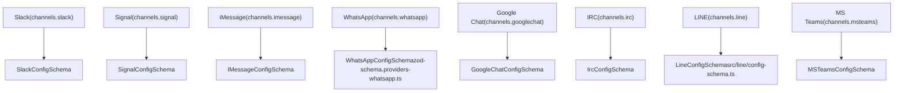
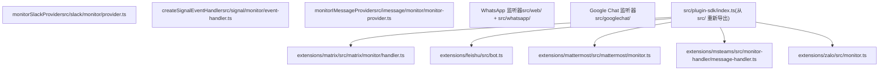
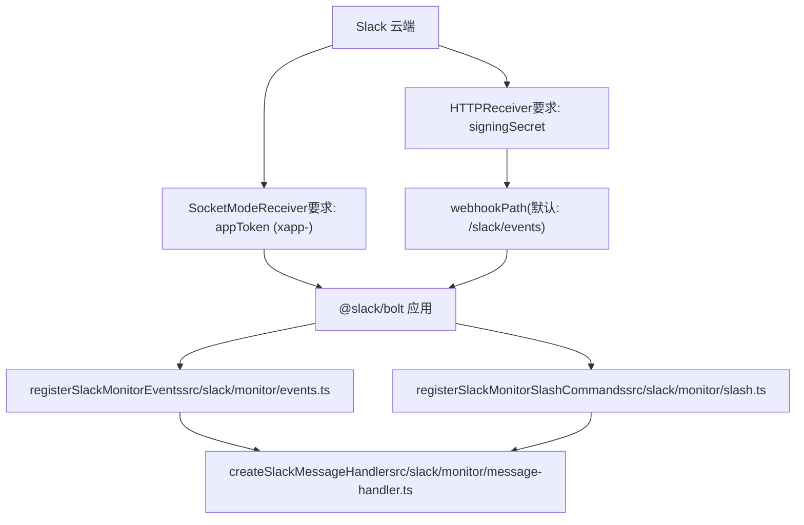
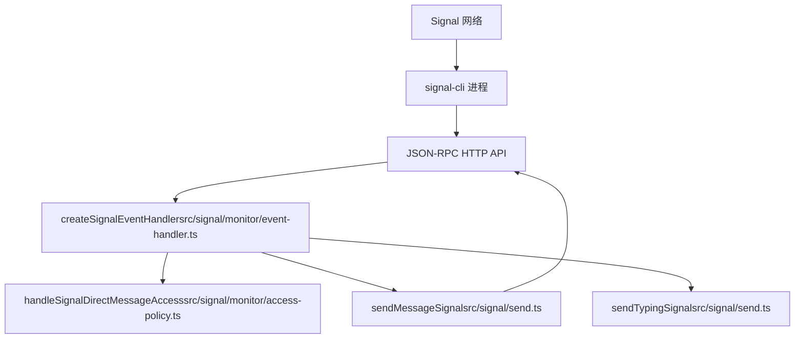
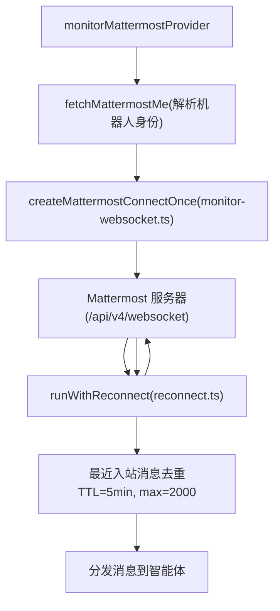

# 其他通道 (Other Channels)

相关源文件

-   [docs/channels/discord.md](https://github.com/openclaw/openclaw/blob/8873e13f/docs/channels/discord.md)
-   [docs/channels/telegram.md](https://github.com/openclaw/openclaw/blob/8873e13f/docs/channels/telegram.md)
-   [docs/gateway/configuration-reference.md](https://github.com/openclaw/openclaw/blob/8873e13f/docs/gateway/configuration-reference.md)
-   [src/discord/monitor.ts](https://github.com/openclaw/openclaw/blob/8873e13f/src/discord/monitor.ts)
-   [src/imessage/monitor.ts](https://github.com/openclaw/openclaw/blob/8873e13f/src/imessage/monitor.ts)
-   [src/signal/monitor.ts](https://github.com/openclaw/openclaw/blob/8873e13f/src/signal/monitor.ts)
-   [src/slack/monitor.ts](https://github.com/openclaw/openclaw/blob/8873e13f/src/slack/monitor.ts)
-   [src/telegram/bot.ts](https://github.com/openclaw/openclaw/blob/8873e13f/src/telegram/bot.ts)
-   [src/web/inbound.ts](https://github.com/openclaw/openclaw/blob/8873e13f/src/web/inbound.ts)

本页涵盖了除 Telegram ([4.2](/openclaw/openclaw/4.2-telegram-integration)) 和 Discord ([4.3](/openclaw/openclaw/4.3-discord-integration)) 之外所有受支持的消息通道的配置和集成细节。有关共享通道插件接口和消息分发架构，请参见 [通道架构与插件 SDK (Channel Architecture & Plugin SDK)](/openclaw/openclaw/4.1-channel-architecture)。有关模型配置，请参见 [3.3](/openclaw/openclaw/3.3-model-providers-and-authentication)。

通道分为两类实现：

-   **核心通道 (Core channels)** —— 随主程序包发布；模式位于 `src/config/`，监听器位于 `src/<channel>/`。
-   **扩展通道 (Extension channels)** —— 独立的 npm 程序包；源码位于 `extensions/`；基于 `openclaw/plugin-sdk` 构建。

---

## 通道索引 (Channel Index)

| 通道 | 配置键 | 配置模式 | 监听器入口点 | 默认 `dmPolicy` |
| --- | --- | --- | --- | --- |
| Slack | `channels.slack` | `SlackConfigSchema` | `monitorSlackProvider` | `pairing` |
| Signal | `channels.signal` | `SignalConfigSchema` | `createSignalEventHandler` | `pairing` |
| iMessage | `channels.imessage` | `IMessageConfigSchema` | `monitorIMessageProvider` | `pairing` |
| WhatsApp | `channels.whatsapp` | `WhatsAppConfigSchema` | — | `pairing` |
| Google Chat | `channels.googlechat` | `GoogleChatConfigSchema` | — | `pairing` |
| IRC | `channels.irc` | `IrcConfigSchema` | — | N/A |
| LINE | `channels.line` | `LineConfigSchema` | — | N/A |
| Matrix | `channels.matrix` | (扩展本地) | — | `pairing` |
| 飞书 (Feishu) | `channels.feishu` | (扩展本地) | — | N/A |
| Mattermost | `channels.mattermost` | (扩展本地) | `monitorMattermostProvider` | `pairing` |
| MS Teams | `channels.msteams` | `MSTeamsConfigSchema` | — | `pairing` |
| Zalo | `channels.zalo` | (扩展本地) | — | N/A |

---

## 架构图

**图表：通道名称 → 配置模式**

**来源**：[src/config/zod-schema.providers-core.ts1-35](https://github.com/openclaw/openclaw/blob/8873e13f/src/config/zod-schema.providers-core.ts#L1-L35) [src/plugin-sdk/index.ts176-184](https://github.com/openclaw/openclaw/blob/8873e13f/src/plugin-sdk/index.ts#L176-L184)

---

**图表：核心通道 vs 扩展通道实现**

**来源**：[src/plugin-sdk/index.ts1-100](https://github.com/openclaw/openclaw/blob/8873e13f/src/plugin-sdk/index.ts#L1-L100) [extensions/feishu/src/bot.ts1-15](https://github.com/openclaw/openclaw/blob/8873e13f/extensions/feishu/src/bot.ts#L1-L15) [extensions/mattermost/src/mattermost/monitor.ts1-30](https://github.com/openclaw/openclaw/blob/8873e13f/extensions/mattermost/src/mattermost/monitor.ts#L1-L30) [extensions/matrix/src/matrix/monitor/handler.ts1-15](https://github.com/openclaw/openclaw/blob/8873e13f/extensions/matrix/src/matrix/monitor/handler.ts#L1-L15)

---

## 核心通道 (Core Channels)

### Slack

提供商：[src/slack/monitor/provider.ts](https://github.com/openclaw/openclaw/blob/8873e13f/src/slack/monitor/provider.ts) 中的 `monitorSlackProvider`
模式：[src/config/zod-schema.providers-core.ts738-894](https://github.com/openclaw/openclaw/blob/8873e13f/src/config/zod-schema.providers-core.ts#L738-L894) 中的 `SlackConfigSchema` / `SlackAccountSchema`

Slack 支持两种传输模式。模式决定了需要哪些令牌。

**图表：Slack 双模式提供商架构**

**来源**：[src/slack/monitor/provider.ts44-136](https://github.com/openclaw/openclaw/blob/8873e13f/src/slack/monitor/provider.ts#L44-L136)

**关键配置字段 (`SlackAccountSchema`)：**

| 字段 | 类型 / 默认值 | 备注 |
| --- | --- | --- |
| `mode` | `"socket"` \| `"http"` (默认 `"socket"`) | 传输模式 |
| `botToken` | 字符串 | `xoxb-...` OAuth 机器人令牌 |
| `appToken` | 字符串 | 用于 Socket 模式的 `xapp-...` |
| `signingSecret` | 字符串 | `mode="http"` 时必填 |
| `webhookPath` | 字符串 (默认 `"/slack/events"`) | HTTP 入站端点 |
| `userToken` | 字符串 | 可选的 `xoxp-...` 用户令牌 |
| `userTokenReadOnly` | 布尔值 (默认 `true`) | 限制用户令牌仅为读取权限 |
| `groupPolicy` | `"open"` \| `"allowlist"` \| `"disabled"` (默认 `"allowlist"`) | 频道访问策略 |
| `dmPolicy` | `"pairing"` \| `"allowlist"` \| `"open"` \| `"disabled"` | 私信访问策略 |
| `requireMention` | 布尔值 | 是否在频道中要求 `@提及` |
| `streaming` | `"off"` \| `"partial"` \| `"block"` \| `"progress"` | 回复流模式 |
| `nativeStreaming` | 布尔值 | 启用 Slack 原生流 API |
| `replyToMode` | `"off"` \| `"first"` \| `"all"` | 回复线程行为 |
| `replyToModeByChatType` | 对象 | 按聊天类型设置 `replyToMode` 覆盖 |
| `ackReaction` | 字符串 | 收到消息时发送的 Emoji 反应 |

**线程配置** (`SlackThreadSchema`)：

-   `historyScope`: `"thread"` | `"channel"` —— 线程上下文是取自线程还是父频道。
-   `inheritParent`: 布尔值 —— 继承父频道会话。
-   `initialHistoryLimit`: 整数。

**针对每个频道的覆盖** (`channels.slack.channels.<id>`, `SlackChannelSchema`)：`requireMention`, `tools`, `toolsBySender`, `allowBots`, `users`, `skills`, `systemPrompt`。

**斜杠命令** (`slashCommand`)：可选的单个斜杠命令，带有 `name`（默认 `"openclaw"`）、`sessionPrefix`（默认 `"slack:slash"`）、`ephemeral`。原生多命令支持要求 `channels.slack.commands.native: true`。

**多账户**：`channels.slack.accounts` 映射；具名账户在未设置自身的 `allowFrom` 时，会继承顶级 `allowFrom`。

**验证**：没有 `signingSecret` 的 HTTP 模式将被拒绝。私信 `open` 策略要求 `allowFrom` 包含 `"*"`。

**来源**：[src/config/zod-schema.providers-core.ts697-894](https://github.com/openclaw/openclaw/blob/8873e13f/src/config/zod-schema.providers-core.ts#L697-L894) [src/slack/monitor/provider.ts59-136](https://github.com/openclaw/openclaw/blob/8873e13f/src/slack/monitor/provider.ts#L59-L136)

---

### Signal

模式：[src/config/zod-schema.providers-core.ts896-991](https://github.com/openclaw/openclaw/blob/8873e13f/src/config/zod-schema.providers-core.ts#L896-L991) 中的 `SignalConfigSchema` 扩展了 `SignalAccountSchemaBase`
事件处理器：[src/signal/monitor/event-handler.ts55](https://github.com/openclaw/openclaw/blob/8873e13f/src/signal/monitor/event-handler.ts#L55-L55) 中的 `createSignalEventHandler`

Signal 要求运行外部的 **signal-cli** 守护进程。OpenClaw 通过 HTTP API 连接到它，或者直接衍生其进程。

**图表：Signal-CLI 集成**

**来源**：[src/signal/monitor/event-handler.ts55-180](https://github.com/openclaw/openclaw/blob/8873e13f/src/signal/monitor/event-handler.ts#L55-L180)

**关键配置字段 (`SignalAccountSchemaBase`)：**

| 字段 | 类型 / 默认值 | 备注 |
| --- | --- | --- |
| `account` | 字符串 | Signal 电话号码 (E.164) |
| `httpUrl` | 字符串 | signal-cli HTTP 端点 (例如 `http://127.0.0.1:8080`) |
| `httpHost` / `httpPort` | 字符串 / 整数 | `httpUrl` 的替代方案 |
| `cliPath` | 字符串 | signal-cli 二进制文件路径 |
| `autoStart` | 布尔值 | 自动启动 signal-cli |
| `startupTimeoutMs` | 整数 (1000–120000) | 启动等待超时时间 |
| `receiveMode` | `"on-start"` \| `"manual"` | 何时开始接收消息 |
| `ignoreAttachments` | 布尔值 | 跳过入站附件 |
| `ignoreStories` | 布尔值 | 跳过 Signal 动态 (Stories) |
| `sendReadReceipts` | 布尔值 | 发送已读回执 |
| `reactionNotifications` | `"off"` \| `"own"` \| `"all"` \| `"allowlist"` | Emoji 反应处理 |
| `reactionLevel` | `"off"` \| `"ack"` \| `"minimal"` \| `"extensive"` | 确认反应的详细程度 |
| `dmPolicy` | (默认 `"pairing"`) | 私信访问策略 |
| `groupPolicy` | (默认 `"allowlist"`) | 群组访问策略 |

在分发之前会应用入站去抖动 (`resolveInboundDebounceMs`)。当设置了 `requireMention` 时，来自 `buildMentionRegexes` 的提及模式会用于门控群组消息。

**来源**：[src/config/zod-schema.providers-core.ts896-991](https://github.com/openclaw/openclaw/blob/8873e13f/src/config/zod-schema.providers-core.ts#L896-L991) [src/signal/monitor/event-handler.ts55-100](https://github.com/openclaw/openclaw/blob/8873e13f/src/signal/monitor/event-handler.ts#L55-L100)

---

### iMessage 与 BlueBubbles

Apple 消息存在两种集成路径：

| 方法 | 配置键 | 后端 | 位置 |
| --- | --- | --- | --- |
| imsg | `channels.imessage` | `imsg` JSON-RPC CLI | `src/imessage/` |
| BlueBubbles | `channels.bluebubbles` | BlueBubbles 服务器应用 (macOS) | `src/bluebubbles/` |

`imsg` 路径使用 [src/imessage/monitor/monitor-provider.ts84](https://github.com/openclaw/openclaw/blob/8873e13f/src/imessage/monitor/monitor-provider.ts#L84-L84) 中的 `monitorIMessageProvider`。

**关键配置字段 (iMessage / `IMessageConfigSchema`)：**

| 字段 | 备注 |
| --- | --- |
| `cliPath` | `imsg` 二进制文件路径 (默认 `"imsg"`) |
| `dbPath` | iMessage SQLite 数据库路径 |
| `includeAttachments` | 下载并传递入站附件 |
| `remoteHost` | 远程 Mac 设置的 SSH 主机；从 `cliPath` 处的 SSH 包装脚本自动检测 |
| `probeTimeoutMs` | 启动探测超时时间 (`DEFAULT_IMESSAGE_PROBE_TIMEOUT_MS`) |
| `dmPolicy` | 默认 `pairing` |
| `groupPolicy` | 默认来自配置；群聊使用 `groupAllowFrom` |

**附件安全**：`resolveIMessageAttachmentRoots` 和 `resolveIMessageRemoteAttachmentRoots` 定义了允许的文件根目录。在传递给智能体之前，每个入站附件路径都会通过 `isInboundPathAllowed` 进行验证。

**入站去抖动**：通过 `createInboundDebouncer` 启用。在没有媒体或控制命令的情况下，同一发送者在同一对话中的连续消息会被合并为单个智能体轮次。

**BlueBubbles**：独立的通道集成。插件 SDK 导出：

-   来自 `src/channels/plugins/bluebubbles-actions.ts` 的 `BLUEBUBBLES_ACTIONS`, `BLUEBUBBLES_ACTION_NAMES`, `BLUEBUBBLES_GROUP_ACTIONS`。
-   来自 `src/channels/plugins/group-mentions.ts` 的 `resolveBlueBubblesGroupRequireMention`, `resolveBlueBubblesGroupToolPolicy`。
-   来自 `src/channels/plugins/status-issues/bluebubbles.ts` 的 `collectBlueBubblesStatusIssues`。

**来源**：[src/imessage/monitor/monitor-provider.ts84-200](https://github.com/openclaw/openclaw/blob/8873e13f/src/imessage/monitor/monitor-provider.ts#L84-L200) [src/plugin-sdk/index.ts6-8](https://github.com/openclaw/openclaw/blob/8873e13f/src/plugin-sdk/index.ts#L6-L8)

---

### WhatsApp

配置键：`channels.whatsapp`
模式：`src/config/zod-schema.providers-whatsapp.ts` 中的 `WhatsAppConfigSchema`
实现：`src/web/`, `src/whatsapp/`；通过 `whatsappOnboardingAdapter` 入门。

WhatsApp 集成使用 Baileys (WhatsApp Web 协议)。网关拥有已链接的 WhatsApp 会话。

共享的插件 SDK 辅助函数：

-   `isWhatsAppGroupJid`, `normalizeWhatsAppTarget` —— JID 规范化。
-   `resolveWhatsAppOutboundTarget` —— 出站目标解析。
-   `normalizeWhatsAppAllowFromEntries` —— 白名单列表规范化。
-   `resolveWhatsAppGroupIntroHint`, `resolveWhatsAppMentionStripPatterns` —— 群组行为。
-   `resolveWhatsAppHeartbeatRecipients` —— 心跳交付目标。
-   `collectWhatsAppStatusIssues` —— 健康检查问题。

访问控制使用 `resolveWhatsAppGroupRequireMention` 和 `resolveWhatsAppGroupToolPolicy`（与其他通道模式一致）。

**来源**：[src/plugin-sdk/index.ts544-558](https://github.com/openclaw/openclaw/blob/8873e13f/src/plugin-sdk/index.ts#L544-L558)

---

### Google Chat

模式：[src/config/zod-schema.providers-core.ts692-695](https://github.com/openclaw/openclaw/blob/8873e13f/src/config/zod-schema.providers-core.ts#L692-L695) 中的 `GoogleChatConfigSchema`
账户模式：[src/config/zod-schema.providers-core.ts646-690](https://github.com/openclaw/openclaw/blob/8873e13f/src/config/zod-schema.providers-core.ts#L646-L690) 中的 `GoogleChatAccountSchema`

Google Chat 使用 GCP 服务账号进行身份验证。入站事件通过 Webhook 到达。

**关键配置字段 (`GoogleChatAccountSchema`)：**

| 字段 | 备注 |
| --- | --- |
| `serviceAccount` | GCP 服务账号 —— JSON 对象、路径字符串或 `SecretRef` |
| `serviceAccountRef` | 备选的 `SecretRef` 形式 |
| `serviceAccountFile` | 备选的文件路径 |
| `audienceType` | `"app-url"` \| `"project-number"` |
| `audience` | 用于令牌验证的受众 (Audience) 值 |
| `webhookPath` | 入站 Webhook 路由 |
| `webhookUrl` | 用于事件交付的公共 URL |
| `botUser` | 机器人邮箱，用于 `@提及` 检测 |
| `typingIndicator` | `"none"` \| `"message"` \| `"reaction"` |
| `streamMode` | `"replace"` (默认) \| `"status_final"` \| `"append"` |
| `requireMention` | 全局提及门控 |
| `groupPolicy` | 默认 `"allowlist"` |

**针对每个群组的配置** (`GoogleChatGroupSchema`)：`enabled`, `allow`, `requireMention`, `users`, `systemPrompt`。

**私信配置** (`GoogleChatDmSchema`)：`enabled`, `policy`, `allowFrom`（具有与其他通道相同的 `open`/`allowlist` 验证规则）。

**多账户**：`GoogleChatConfigSchema` 扩展了 `GoogleChatAccountSchema`，增加了 `accounts` 映射和 `defaultAccount` 选择器。

**来源**：[src/config/zod-schema.providers-core.ts610-695](https://github.com/openclaw/openclaw/blob/8873e13f/src/config/zod-schema.providers-core.ts#L610-L695)

---

### IRC

配置键：`channels.irc`
模式：`src/config/zod-schema.providers-core.ts` (第 993 行起) 中的 `IrcConfigSchema`
实现：`src/irc/`

针对每个频道的群组配置 (`IrcGroupSchema`) 支持 `requireMention`, `tools` 和 `toolsBySender`，遵循与其他感知群组的通道相同的模式。

**来源**：[src/config/zod-schema.providers-core.ts993](https://github.com/openclaw/openclaw/blob/8873e13f/src/config/zod-schema.providers-core.ts#L993-L993)

---

### LINE

配置键：`channels.line`
模式：来自 `src/line/config-schema.ts` 的 `LineConfigSchema`
账户解析：来自 `src/line/accounts.ts` 的 `resolveLineAccount`
类型：来自 `src/line/types.ts` 的 `LineConfig`, `LineAccountConfig`, `ResolvedLineAccount`, `LineChannelData`

LINE 支持丰富的 **Flex 消息 (Flex Messages)**。`src/line/flex-templates.ts` 模块提供了构建辅助函数：

| 函数 | 目的 |
| --- | --- |
| `createInfoCard` | 信息面板卡片 |
| `createListCard` | 列表布局卡片 |
| `createImageCard` | 带说明文字的图片 |
| `createActionCard` | 带操作按钮的卡片 |
| `createReceiptCard` | 收据/摘要卡片 |

出站 Markdown 会通过 `src/line/markdown-to-line.ts` 中的 `processLineMessage` 转换为 LINE 格式。可转换内容的检测使用 `hasMarkdownToConvert`；纯文本回退使用 `stripMarkdown`。

**来源**：[src/plugin-sdk/index.ts562-591](https://github.com/openclaw/openclaw/blob/8873e13f/src/plugin-sdk/index.ts#L562-L591)

---

## 扩展通道 (Extension Channels)

扩展通道是独立的程序包，它们从 `openclaw/plugin-sdk` 导入。SDK 重新导出了核心包中的实用程序，包括配对访问、群组策略解析、历史管理、输入回调以及插件运行时创建。

**图表：扩展通道 SDK 依赖模式**

```mermaid
flowchart TD
    PairingAccess["createScopedPairingAccess"]
    GroupPolicy["resolveOpenProviderRuntimeGroupPolicyresolveDefaultGroupPolicy"]
    History["buildPendingHistoryContextFromMaprecordPendingHistoryEntryIfEnabled"]
    TypingCB["createTypingCallbacks"]
    ReplyPrefix["createReplyPrefixOptions"]
    DmPolicy["resolveDmGroupAccessWithListsreadStoreAllowFromForDmPolicy"]
    FeishuImports["resolveOpenProviderRuntimeGroupPolicybuildPendingHistoryContextFromMapcreateDedupeCache"]
    MMImports["createScopedPairingAccesscreateTypingCallbacksresolveDmGroupAccessWithListsDEFAULT_GROUP_HISTORY_LIMIT"]
    MatrixImports["createScopedPairingAccesscreateTypingCallbacksformatAllowlistMatchMetaresolveControlCommandGate"]

    GroupPolicy --> FeishuImports
    History --> FeishuImports
    PairingAccess --> MMImports
    TypingCB --> MMImports
    DmPolicy --> MMImports
    PairingAccess --> MatrixImports
    TypingCB --> MatrixImports
```

**来源**：[extensions/feishu/src/bot.ts1-13](https://github.com/openclaw/openclaw/blob/8873e13f/extensions/feishu/src/bot.ts#L1-L13) [extensions/mattermost/src/mattermost/monitor.ts1-30](https://github.com/openclaw/openclaw/blob/8873e13f/extensions/mattermost/src/mattermost/monitor.ts#L1-L30) [extensions/matrix/src/matrix/monitor/handler.ts1-15](https://github.com/openclaw/openclaw/blob/8873e13f/extensions/matrix/src/matrix/monitor/handler.ts#L1-L15)

---

### Matrix

位置：`extensions/matrix/`
处理器：`extensions/matrix/src/matrix/monitor/handler.ts`
库：`@vector-im/matrix-bot-sdk` (`MatrixClient`)

**关键处理器参数 (`MatrixMonitorHandlerParams`)：**

| 字段 | 类型 | 备注 |
| --- | --- | --- |
| `dmPolicy` | `"open"` \| `"pairing"` \| `"allowlist"` \| `"disabled"` | 私信访问策略 |
| `groupPolicy` | `"open"` \| `"allowlist"` \| `"disabled"` | 房间访问策略 |
| `threadReplies` | `"off"` \| `"inbound"` \| `"always"` | 线程回复路由 |
| `replyToMode` | `ReplyToMode` | 回复线程行为 |
| `startupMs` | 数字 | 网关启动时间戳 |
| `startupGraceMs` | 数字 | 忽略 `startupMs + startupGraceMs` 之前的消息 |
| `roomsConfig` | `Record<string, MatrixRoomConfig>` | 针对每个房间的配置 |
| `dmEnabled` | 布尔值 | 启用私信房间 |
| `textLimit` | 数字 | 最大出站文本长度 |
| `mediaMaxBytes` | 数字 | 最大入站媒体大小 |

**支持的入站事件类型：**

-   标准文本消息。
-   投票开始事件 (`isPollStartType`, `parsePollStartContent`)。
-   位置事件 (`resolveMatrixLocation`) → `NormalizedLocation`。
-   媒体附件 (`downloadMatrixMedia`)。

**线程处理**：线程根通过 `resolveMatrixThreadRootId` 追踪。交付目标由 `resolveMatrixThreadTarget` 解析。当 `threadReplies: "always"` 时，所有回复都进入线程；`"inbound"` 仅对线程内的消息进行线程回复。

**访问控制**：`resolveMatrixAllowListMatch`, `resolveMatrixAllowListMatches`, `enforceMatrixDirectMessageAccess`, `resolveMatrixAccessState`。

**来源**：[extensions/matrix/src/matrix/monitor/handler.ts44-76](https://github.com/openclaw/openclaw/blob/8873e13f/extensions/matrix/src/matrix/monitor/handler.ts#L44-L76)

---

### 飞书 (Feishu / Lark)

位置：`extensions/feishu/`
机器人处理器：`extensions/feishu/src/bot.ts`
API 客户端：来自 `extensions/feishu/src/client.ts` 的 `createFeishuClient`

聊天类型由 `message.chat_type` 决定：`"p2p"` (私聊) vs `"group"` (群聊)。

**支持的消息类型：**

| `message_type` | 解析方式 | 下载媒体 |
| --- | --- | --- |
| `text` | JSON `.text` 字段 | 否 |
| `post` | `parsePostContent` —— 提取文本、链接、提及、内嵌图片 | 图片通过 `downloadMessageResourceFeishu` |
| `image` | `parseMediaKeys` → `image_key` | 是 |
| `file` | `parseMediaKeys` → `file_key` | 是 |
| `audio` | `parseMediaKeys` → `file_key` | 是 |
| `video` | 同时具有 `file_key` (视频) 和 `image_key` (缩略图) | 是 |
| `sticker` | `parseMediaKeys` → `file_key` | 是 |

**提及处理**：`checkBotMentioned` 检查 `message.mentions` 或帖子内容中的 `at` 标签。`stripBotMention` 从处理后的文本中移除机器人提及标记。

**发送者名称解析**：`resolveFeishuSenderName` 调用 `contact/v3/users/:user_id` API。结果缓存时间为 10 分钟 (`SENDER_NAME_TTL_MS = 10 * 60 * 1000`)。权限错误码 `99991672` (缺失联系人作用域) 会被捕获并显示授权 URL。

**权限错误去重**：`permissionErrorNotifiedAt` 映射表对重复通知进行节流，具有 5 分钟的冷却时间 (`PERMISSION_ERROR_COOLDOWN_MS`)。

**策略解析**：来自 `extensions/feishu/src/policy.ts` 的 `resolveFeishuGroupConfig`, `resolveFeishuReplyPolicy`, `resolveFeishuAllowlistMatch`, `isFeishuGroupAllowed`。

**动态智能体**：来自 `extensions/feishu/src/dynamic-agent.ts` 的 `maybeCreateDynamicAgent` 支持根据群组成员身份按需创建智能体会话。

**来源**：[extensions/feishu/src/bot.ts76-136](https://github.com/openclaw/openclaw/blob/8873e13f/extensions/feishu/src/bot.ts#L76-L136) [extensions/feishu/src/bot.ts180-330](https://github.com/openclaw/openclaw/blob/8873e13f/extensions/feishu/src/bot.ts#L180-L330)

---

### Mattermost

位置：`extensions/mattermost/`
监听器：`extensions/mattermost/src/mattermost/monitor.ts` 中的 `monitorMattermostProvider`

**必需配置：**

-   `botToken`：Mattermost 机器人用户令牌。
-   `baseUrl`：Mattermost 服务器 URL。

**图表：Mattermost WebSocket 连接**

**来源**：[extensions/mattermost/src/mattermost/monitor.ts167-220](https://github.com/openclaw/openclaw/blob/8873e13f/extensions/mattermost/src/mattermost/monitor.ts#L167-L220)

**缓存常量：**

| 常量 | 值 | 目的 |
| --- | --- | --- |
| `RECENT_MATTERMOST_MESSAGE_TTL_MS` | 5 分钟 | 入站消息去重窗口 |
| `RECENT_MATTERMOST_MESSAGE_MAX` | 2000 | 最大去重缓存条目 |
| `CHANNEL_CACHE_TTL_MS` | 5 分钟 | Mattermost 频道信息缓存 |
| `USER_CACHE_TTL_MS` | 10 分钟 | Mattermost 用户信息缓存 |

**通道类型映射**：`channelKind` 映射 Mattermost 频道类型代码：

-   `"D"` → `"direct"` (私信)
-   `"G"` → `"group"` (群组)
-   其他 → `"channel"` (频道)

系统帖子（非空的 `post.type` 字段）由 `isSystemPost` 过滤。

**WebSocket URL**：`buildMattermostWsUrl` 转换基础 URL 协议（`http` → `ws`）并追加 `/api/v4/websocket`。

**来源**：[extensions/mattermost/src/mattermost/monitor.ts77-166](https://github.com/openclaw/openclaw/blob/8873e13f/extensions/mattermost/src/mattermost/monitor.ts#L77-L166)

---

### MS Teams

位置：`extensions/msteams/`
处理器：`extensions/msteams/src/monitor-handler/message-handler.ts`
模式：从 `src/config/types.ts` 导出的 `MSTeamsConfigSchema`，类型 `MSTeamsConfig`, `MSTeamsTeamConfig`, `MSTeamsChannelConfig`, `MSTeamsReplyStyle`。

访问控制遵循插件 SDK 的标准模式：`createScopedPairingAccess`, `resolveDmGroupAccessWithLists`, `readStoreAllowFromForDmPolicy`, `resolveDefaultGroupPolicy`, `isDangerousNameMatchingEnabled`。

`MSTeamsReplyStyle`（通过 `MSTeamsReplyStyleSchema` 验证）控制回复是内联发布还是作为新消息发布。

通过 `MSTeamsTeamConfig` 和 `MSTeamsChannelConfig` 提供针对每个团队和每个频道的配置，允许针对每个作用域覆盖 `requireMention`, `users`, `roles` 和 `systemPrompt`。

**来源**：[extensions/msteams/src/monitor-handler/message-handler.ts1-15](https://github.com/openclaw/openclaw/blob/8873e13f/extensions/msteams/src/monitor-handler/message-handler.ts#L1-L15) [src/plugin-sdk/index.ts154-161](https://github.com/openclaw/openclaw/blob/8873e13f/src/plugin-sdk/index.ts#L154-L161)

---

### Zalo

位置：`extensions/zalo/`
监听器：`extensions/zalo/src/monitor.ts`

Zalo 集成基于 Webhook：Zalo 向 OpenClaw 发送 HTTP POST 事件。监听器处理入站事件的反序列化，并通过标准的插件 SDK 分发流将其分发给智能体。出站回复使用来自 `openclaw/plugin-sdk` 的 `OutboundReplyPayload`。Markdown 渲染遵循活跃配置中的 `MarkdownTableMode`。

**来源**：[extensions/zalo/src/monitor.ts1-5](https://github.com/openclaw/openclaw/blob/8873e13f/extensions/zalo/src/monitor.ts#L1-L5)

---

## 通用配置模式 (Common Configuration Patterns)

无论实现位置如何，所有通道都共享这些行为。有关每一项的详细信息，请参见 [通道架构与插件 SDK (Channel Architecture & Plugin SDK)](/openclaw/openclaw/4.1-channel-architecture)。

| 模式 | 配置字段 | 备注 |
| --- | --- | --- |
| 私信访问 | `dmPolicy`, `allowFrom` | `open` 要求 `allowFrom` 包含 `"*"`；`allowlist` 要求至少一个条目。 |
| 群组访问 | `groupPolicy`, `groupAllowFrom` | 默认 `"allowlist"` 在缺少提供商配置时会回退到拒绝。 |
| 多账户 | `accounts` 映射表 | 具名账户在未设置自身的 `allowFrom` 时，会继承顶级 `allowFrom`。 |
| 历史记录 | `historyLimit`, `dmHistoryLimit`, `dms[].historyLimit` | 控制群组/私信会话的上下文窗口。 |
| 媒体 | `mediaMaxMb` | 限制入站媒体下载大小。 |
| 确认反应 | `ackReaction` | 处理中发送的 Emoji；回退到智能体身份标识 Emoji。 |
| 文本分块 | `textChunkLimit`, `chunkMode` | 出站消息的 `"length"` (长度) 或 `"newline"` (换行) 分割。 |
