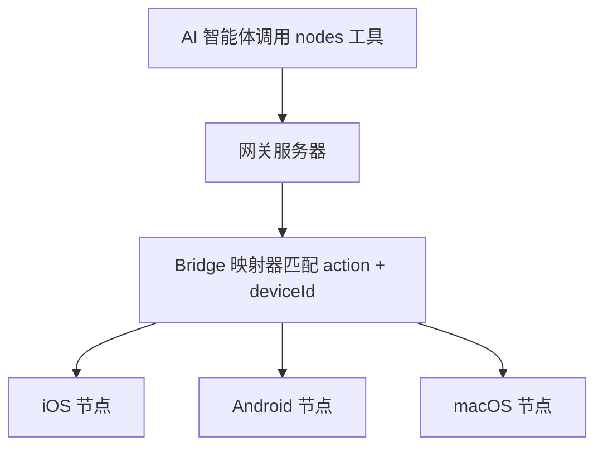

# 原生客户端 (节点) (Native Clients (Nodes))

## 概览 (Overview)

原生客户端是运行在远程设备（iOS、Android、macOS）上的专用应用程序，通过网关的 WebSocket 协议以 **`node` 角色**连接。它们的本质是 OpenClaw 的“感官和肢体”：将物理硬件功能（摄像头、位置、文件系统）和平台特定 API 暴露给 AI 智能体作为工具。

本页涵盖了节点角色协议、Bridge 映射模型、设备配对流以及节点管理的 CLI 参考。有关每个客户端的详细架构和能力，请参见：

-   **iOS 客户端 (Clawdis)**：[6.1](/openclaw/openclaw/6.1-ios-client)
-   **macOS 客户端 (OpenClaw.app)**：[6.2](/openclaw/openclaw/6.2-macos-client)
-   **Android 客户端**：[6.3](/openclaw/openclaw/6.3-android-client)

---

## 节点角色协议 (Node Role Protocol)

当原生客户端连接时，它在握手中声明其 `role: "node"`。网关将这些连接视为**功能提供者**，而非交互式用户。

### 职责

1.  **能力声明 (Capability Advertisement)**：通过 `node.describe` RPC 方法，节点向网关发送其支持的动作列表。
2.  **动作执行 (Action Execution)**：网关通过 `node.invoke` 事件向节点分发命令。
3.  **状态同步 (Status Sync)**：节点推送其本地状态（电池电量、连接状态、正在运行的任务）的更新。

### 能力树 (Capability Tree)

节点将其功能组织成层级的动作。例如，一个典型的节点可能注册：

-   `camera.snap` — 拍摄静止照片
-   `camera.clip` — 录制视频短片
-   `location.get` — 获取当前 GPS 坐标
-   `canvas.render` — 在设备屏幕上显示 URL

---

## Bridge 映射模型 (Bridge Mapping Model)

网关使用 **Bridge** 抽象来连接智能体和节点。当智能体调用 `nodes` 工具时，网关会通过 Bridge 查找已连接的节点并转发请求。

**来源**：[src/gateway/server-methods/nodes.ts1-150](https://github.com/openclaw/openclaw/blob/8873e13f/src/gateway/server-methods/nodes.ts#L1-L150) [README.md240-252](https://github.com/openclaw/openclaw/blob/8873e13f/README.md#L240-L252)

---

## 设备配对流 (Device Pairing Flow)

为了安全性，新节点必须在被允许连接之前与网关**配对**。该流程遵循挑战-响应模型：

1.  **请求**：节点发送 `node.pair.request` 并携带其设备公钥和显示名称。
2.  **挑战**：网关生成一个配对码（显示在网关日志或 UI 中）。
3.  **批准**：操作员通过 `openclaw nodes pair approve <code|deviceId>` 批准该请求。
4.  **令牌颁发**：网关向节点发送一个持久的身份验证令牌，节点将其安全地存储在设备密钥链中。

**来源**：[docs/gateway/pairing.md1-80](https://github.com/openclaw/openclaw/blob/8873e13f/docs/gateway/pairing.md#L1-L80) [src/gateway/server-methods/devices.ts](https://github.com/openclaw/openclaw/blob/8873e13f/src/gateway/server-methods/devices.ts)

---

## 节点管理 CLI (Node Management CLI)

`openclaw nodes` 命令组用于监控和管理已配对的设备。

| 命令 | 目的 |
| --- | --- |
| `openclaw nodes list` | 显示所有已配对和当前在线的节点 |
| `openclaw nodes status <deviceId>` | 检索特定节点的详细功能和状态 |
| `openclaw nodes pair list` | 列出挂起的配对请求 |
| `openclaw nodes pair approve <id>` | 批准一个新设备 |
| `openclaw nodes pair reject <id>` | 拒绝并删除配对请求 |
| `openclaw nodes rename <id> <name>` | 更新节点的友好显示名称 |
| `openclaw nodes remove <id>` | 撤销节点的访问权限并注销配对 |

**来源**：[src/cli/program/nodes.ts](https://github.com/openclaw/openclaw/blob/8873e13f/src/cli/program/nodes.ts) [docs/cli/nodes.md](https://github.com/openclaw/openclaw/blob/8873e13f/docs/cli/nodes.md)
