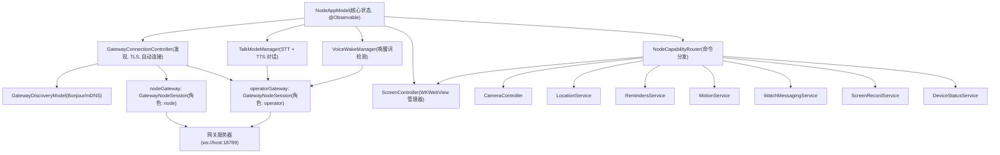
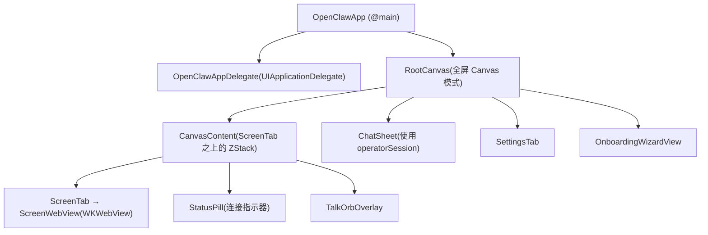

# iOS 客户端 (iOS Client)

相关源文件

-   [CHANGELOG.md](https://github.com/openclaw/openclaw/blob/8873e13f/CHANGELOG.md)
-   [README.md](https://github.com/openclaw/openclaw/blob/8873e13f/README.md)
-   [apps/android/app/build.gradle.kts](https://github.com/openclaw/openclaw/blob/8873e13f/apps/android/app/build.gradle.kts)
-   [apps/ios/Sources/Info.plist](https://github.com/openclaw/openclaw/blob/8873e13f/apps/ios/Sources/Info.plist)
-   [apps/ios/Tests/Info.plist](https://github.com/openclaw/openclaw/blob/8873e13f/apps/ios/Tests/Info.plist)
-   [apps/ios/project.yml](https://github.com/openclaw/openclaw/blob/8873e13f/apps/ios/project.yml)
-   [apps/macos/Sources/OpenClaw/Resources/Info.plist](https://github.com/openclaw/openclaw/blob/8873e13f/apps/macos/Sources/OpenClaw/Resources/Info.plist)
-   [assets/avatar-placeholder.svg](https://github.com/openclaw/openclaw/blob/8873e13f/assets/avatar-placeholder.svg)
-   [docs/cli/index.md](https://github.com/openclaw/openclaw/blob/8873e13f/docs/cli/index.md)
-   [docs/gateway/configuration.md](https://github.com/openclaw/openclaw/blob/8873e13f/docs/gateway/configuration.md)
-   [docs/gateway/index.md](https://github.com/openclaw/openclaw/blob/8873e13f/docs/gateway/index.md)
-   [docs/gateway/troubleshooting.md](https://github.com/openclaw/openclaw/blob/8873e13f/docs/gateway/troubleshooting.md)
-   [docs/index.md](https://github.com/openclaw/openclaw/blob/8873e13f/docs/index.md)
-   [docs/platforms/mac/release.md](https://github.com/openclaw/openclaw/blob/8873e13f/docs/platforms/mac/release.md)
-   [docs/start/getting-started.md](https://github.com/openclaw/openclaw/blob/8873e13f/docs/start/getting-started.md)
-   [docs/start/wizard.md](https://github.com/openclaw/openclaw/blob/8873e13f/docs/start/wizard.md)
-   [extensions/bluebubbles/src/send-helpers.ts](https://github.com/openclaw/openclaw/blob/8873e13f/extensions/bluebubbles/src/send-helpers.ts)
-   [package.json](https://github.com/openclaw/openclaw/blob/8873e13f/package.json)
-   [pnpm-lock.yaml](https://github.com/openclaw/openclaw/blob/8873e13f/pnpm-lock.yaml)
-   [scripts/clawtributors-map.json](https://github.com/openclaw/openclaw/blob/8873e13f/scripts/clawtributors-map.json)
-   [scripts/update-clawtributors.ts](https://github.com/openclaw/openclaw/blob/8873e13f/scripts/update-clawtributors.ts)
-   [scripts/update-clawtributors.types.ts](https://github.com/openclaw/openclaw/blob/8873e13f/scripts/update-clawtributors.types.ts)
-   [src/agents/subagent-registry-cleanup.test.ts](https://github.com/openclaw/openclaw/blob/8873e13f/src/agents/subagent-registry-cleanup.test.ts)
-   [src/cli/program.ts](https://github.com/openclaw/openclaw/blob/8873e13f/src/cli/program.ts)
-   [src/config/config.ts](https://github.com/openclaw/openclaw/blob/8873e13f/src/config/config.ts)
-   [src/config/types.ts](https://github.com/openclaw/openclaw/blob/8873e13f/src/config/types.ts)
-   [src/config/zod-schema.ts](https://github.com/openclaw/openclaw/blob/8873e13f/src/config/zod-schema.ts)
-   [ui/package.json](https://github.com/openclaw/openclaw/blob/8873e13f/ui/package.json)

本页记录了 iOS Clawdis 应用：其内部架构、如何连接到 OpenClaw 网关，以及它公开的设备能力服务。该应用的主要角色是作为“节点” (node) 客户端，向网关注册设备硬件（摄像头、位置、麦克风等），以便智能体能够调用它们。

关于应用所使用的网关 WebSocket 协议，请参见 [2.1](/openclaw/openclaw/2.1-websocket-protocol-and-rpc)。关于节点配对审批流，请参见 [2.2](/openclaw/openclaw/2.2-authentication-and-device-pairing)。关于 macOS 和 Android 客户端，请参见 [6.2](/openclaw/openclaw/6.2-macos-client) 和 [6.3](/openclaw/openclaw/6.3-android-client)。

---

## 架构概览 (Architecture Overview)

iOS 应用建立了**两个并发的 WebSocket 连接**到网关，每个连接扮演不同的角色：

| 连接 | 角色 | 目的 |
| --- | --- | --- |
| `nodeGateway` | `node` | 接收来自智能体的 `node.invoke` 命令；注册设备能力 |
| `operatorGateway` | `operator` | 向网关发起聊天、通话、配置和语音唤醒 (voicewake) 的 RPC 调用 |

两者都是由 `NodeAppModel` 持有的 `GatewayNodeSession` 实例。

**iOS 客户端架构图**


**来源**：[apps/ios/Sources/Model/NodeAppModel.swift95-116](https://github.com/openclaw/openclaw/blob/8873e13f/apps/ios/Sources/Model/NodeAppModel.swift#L95-L116) [apps/ios/Sources/Gateway/GatewayConnectionController.swift19-57](https://github.com/openclaw/openclaw/blob/8873e13f/apps/ios/Sources/Gateway/GatewayConnectionController.swift#L19-L57)

---

## NodeAppModel

`NodeAppModel` ([apps/ios/Sources/Model/NodeAppModel.swift50-217](https://github.com/openclaw/openclaw/blob/8873e13f/apps/ios/Sources/Model/NodeAppModel.swift#L50-L217)) 是 iOS 应用的核心 `@Observable` 类。它在应用启动时创建一次并注入到 SwiftUI 环境中。

**职责：**

-   持有两个 `GatewayNodeSession` 实例（`nodeGateway`, `operatorGateway`）。
-   管理连接生命周期：连接、断开、健康监测、后台抑制。
-   拥有 `VoiceWakeManager`、`TalkModeManager` 和 `ScreenController`。
-   构建 `NodeCapabilityRouter` 以分发入站的 `BridgeInvokeRequest` 命令。
-   处理深度链接 (`openclaw://agent?...`)、Canvas A2UI 动作、推送唤醒事件以及 Apple Watch 快速回复。
-   追踪 SwiftUI 视图使用的可观察状态：`gatewayStatusText`、`gatewayServerName`、`seamColorHex`、`cameraHUDKind` 等。

**能力路由**通过延迟初始化的 `capabilityRouter: NodeCapabilityRouter` 实现。所有入站的 `node.invoke` 请求到达 `nodeGateway` 后，会被传递给 `handleInvoke(_:)`，该方法在委派给路由器之前会应用后台及权限检查。

```
handleInvoke(_:)
  ↓ 后台检查 (Canvas/摄像头/屏幕/通话被阻塞)
  ↓ camera.enabled 检查
  ↓ capabilityRouter.handle(req)
    ↓ 按 req.command 前缀进行路由
```
**来源**：[apps/ios/Sources/Model/NodeAppModel.swift709-755](https://github.com/openclaw/openclaw/blob/8873e13f/apps/ios/Sources/Model/NodeAppModel.swift#L709-L755)

---

## GatewayConnectionController

`GatewayConnectionController` ([apps/ios/Sources/Gateway/GatewayConnectionController.swift21-57](https://github.com/openclaw/openclaw/blob/8873e13f/apps/ios/Sources/Gateway/GatewayConnectionController.swift#L21-L57)) 负责管理网关发现和连接设置。

**发现 (Discovery)**

该控制器使用 `GatewayDiscoveryModel` 在本地网络上通过 Bonjour/mDNS 进行发现。当网关出现时，它会调用 `maybeAutoConnect()`，该方法遵循以下规则：

-   `gateway.autoconnect` (UserDefaults)。
-   `gateway.preferredStableID` (先前连接过的网关)。
-   存储的 TLS 指纹 (自动连接仅连接到先前信任过的网关)。

**TLS 信任模型**

应用采用 TOFU (首次使用即信任) 模型，通过 SHA-256 指纹进行证书固定 (pinning)。首次连接到新网关时：

1.  控制器通过 `probeTLSFingerprint(url:)` 探测 TLS 端点。
2.  向用户显示一个 `TrustPrompt` (通过 `.gatewayTrustPromptAlert()` SwiftUI 修饰符展示)。
3.  用户接受后，指纹通过 `GatewayTLSStore.saveFingerprint(_:stableID:)` 存储。
4.  后续连接将对照存储的指纹进行验证，不再重复提示。

**连接流程图**

**网关连接与 TLS 信任流程**

**来源**：[apps/ios/Sources/Gateway/GatewayConnectionController.swift90-155](https://github.com/openclaw/openclaw/blob/8873e13f/apps/ios/Sources/Gateway/GatewayConnectionController.swift#L90-L155) [apps/ios/Sources/Gateway/GatewayConnectionController.swift241-277](https://github.com/openclaw/openclaw/blob/8873e13f/apps/ios/Sources/Gateway/GatewayConnectionController.swift#L241-L277)

---

## TalkModeManager

`TalkModeManager` ([apps/ios/Sources/Voice/TalkModeManager.swift16-103](https://github.com/openclaw/openclaw/blob/8873e13f/apps/ios/Sources/Voice/TalkModeManager.swift#L16-L103)) 实现了与智能体的双向语音对话。

**语音转文字 (STT)**：结合 `AVAudioEngine` 使用 `SFSpeechRecognizer`。从麦克风提取音频，输入到 `SFSpeechAudioBufferRecognitionRequest` 中，结果以部分或最终转录稿的形式发出。

**文字转语音 (TTS)**：由网关通过 ElevenLabs 处理。配置信息 (`apiKey`, `voiceId`, `modelId`) 在连接时从网关获取。流式音频通过 `PCMStreamingAudioPlayer` (PCM) 或 `StreamingAudioPlayer` (MP3) 播放。

**捕获模式 (Capture modes)：**

| 模式 | 枚举项 | 描述 |
| --- | --- | --- |
| 闲置 | `.idle` | 无活跃捕获 |
| 持续 | `.continuous` | 带有静音检测的常驻监听 |
| 一键通话 | `.pushToTalk` | 单次语音捕获 |

**关键方法：**

| 方法 | 描述 |
| --- | --- |
| `start()` | 进入持续捕获模式，请求权限，订阅聊天事件 |
| `stop()` | 清理所有音频资源和聊天订阅 |
| `beginPushToTalk()` | 开始单次 PTT 捕获，返回 `OpenClawTalkPTTStartPayload` |
| `endPushToTalk()` | 停止 PTT，发送转录稿给网关，返回 `OpenClawTalkPTTStopPayload` |
| `suspendForBackground(keepActive:)` | 释放麦克风；可选地在后台保持监听 |
| `resumeAfterBackground(wasSuspended:wasKeptActive:)` | 恢复捕获状态 |

**静音检测**：每 200 毫秒轮询一次的 `silenceTask` 会检查 `lastAudioActivity` 和 `lastHeard`。如果两者都超出了 `silenceWindow` (0.9 秒)，则处理当前转录稿并发送至网关。

**底噪校准 (Noise floor calibration)**：前 22 个音频样本用于校准 `noiseFloor`。VAD 阈值被限制在测得底噪之上 `[0.12, 0.35]` 的范围内。

**麦克风协调**：`TalkModeManager` 和 `VoiceWakeManager` 会竞争同一个麦克风。当通话模式启用时，`NodeAppModel.setTalkEnabled(_:)` 会调用 `voiceWake.setSuppressedByTalk(true)` 并暂停语音唤醒捕获。

**来源**：[apps/ios/Sources/Voice/TalkModeManager.swift1-340](https://github.com/openclaw/openclaw/blob/8873e13f/apps/ios/Sources/Voice/TalkModeManager.swift#L1-L340)

---

## VoiceWakeManager

`VoiceWakeManager` ([apps/ios/Sources/Voice/VoiceWakeManager.swift83-213](https://github.com/openclaw/openclaw/blob/8873e13f/apps/ios/Sources/Voice/VoiceWakeManager.swift#L83-L213)) 使用 `SFSpeechRecognizer` 运行持续的、常驻的唤醒词检测。

音频缓冲区通过 `AVAudioEngine` 抽头排队进入 `AudioBufferQueue`（一个线程安全的环形缓冲区）。`tapDrainTask` 每 40 毫秒清空一次队列并将缓冲区追加到识别请求中。

唤醒词匹配委派给来自 `SwabbleKit` 的 `WakeWordGate.match(transcript:segments:config:)`。活跃的触发词来自 `VoiceWakePreferences`（存储在 `UserDefaults` 中），并通过 `voicewake.changed` 服务器事件与网关保持同步。

匹配成功后，命令文本通过操作员会话上的 `NodeAppModel.sendVoiceTranscript(text:sessionKey:)` 发送至网关。

**状态转换：**

-   `setEnabled(true)` → `start()` → 请求麦克风 + 语音权限 → `startRecognition()` → `isListening = true`。
-   `suspendForExternalAudioCapture()` → 暂停识别，释放 `AVAudioSession`。
-   `resumeAfterExternalAudioCapture(wasSuspended:)` → 如果之前被暂停，则调用 `start()`。
-   识别出错时 → 延迟 700 毫秒后重启。

**来源**：[apps/ios/Sources/Voice/VoiceWakeManager.swift83-270](https://github.com/openclaw/openclaw/blob/8873e13f/apps/ios/Sources/Voice/VoiceWakeManager.swift#L83-L270)

---

## ScreenController

`ScreenController` ([apps/ios/Sources/Screen/ScreenController.swift8-374](https://github.com/openclaw/openclaw/blob/8873e13f/apps/ios/Sources/Screen/ScreenController.swift#L8-L374)) 管理构成应用主要视觉表面的单个 `WKWebView`。

**Canvas 模式：**

| 模式 | `urlString` | 滚动行为 |
| --- | --- | --- |
| 默认 Canvas (脚手架) | `""` | 禁用 (原始触摸透传) |
| 外部 URL | 非空 | 启用 |

默认 Canvas 加载来自 `OpenClawKit` 资源包的 `CanvasScaffold/scaffold.html`。

**安全**：从网关收到的回环 URL (`localhost`, `127.x.x.x`, `::1`) 会被静默重定向到默认 Canvas。本地网络 URL (LAN IP, `.local`, `.ts.net`, `.tailscale.net`, Tailscale CGNAT `100.64/10`) 是允许的。

**关键操作：**

| 方法 | 描述 |
| --- | --- |
| `navigate(to:)` | 在 Web 视图中加载 URL，或者对于空/回环 URL 显示默认 Canvas |
| `showDefaultCanvas()` | 重置回脚手架 HTML |
| `eval(javaScript:)` | 通过 `WKWebView.evaluateJavaScript` 执行 JS，带有 async/await 封装 |
| `snapshotBase64(maxWidth:format:quality:)` | 执行 `WKSnapshotConfiguration` 快照，返回 base64 编码的 PNG 或 JPEG |
| `waitForA2UIReady(timeoutMs:)` | 轮询 `globalThis.openclawA2UI.applyMessages` 直至就绪 |

**A2UI 动作**：Canvas 内部的按钮点击会发布一条 `userAction` 消息，该消息被 `ScreenWebView` 拦截并转发给 `NodeAppModel.handleCanvasA2UIAction(body:)`。该方法将动作封装为智能体消息，并通过 `sendAgentRequest(link:)` 发送。

**来源**：[apps/ios/Sources/Screen/ScreenController.swift1-374](https://github.com/openclaw/openclaw/blob/8873e13f/apps/ios/Sources/Screen/ScreenController.swift#L1-L374)

---

## 设备服务 (Device Services)

每项能力都由一个协议和具体实现支持。`GatewayConnectionController` 在构建连接选项时会列举当前启用的能力。

**设备服务协议映射图**

```mermaid
flowchart TD
    CR["NodeCapabilityRouter"]
    CAM["CameraServicing→ CameraController(camera.snap, camera.clip)"]
    SRS["ScreenRecordingServicing→ ScreenRecordService(screen.record)"]
    LOC["LocationServicing→ LocationService(location.get)"]
    DEV["DeviceStatusServicing→ DeviceStatusService(device.status, device.info)"]
    PHO["PhotosServicing→ PhotoLibraryService(photos.latest)"]
    CON["ContactsServicing→ ContactsService(contacts.search, contacts.add)"]
    CAL["CalendarServicing→ CalendarService(calendar.events, calendar.add)"]
    REM["RemindersServicing→ RemindersService(reminders.list, reminders.add)"]
    MOT["MotionServicing→ MotionService(motion.activities, motion.pedometer)"]
    WMS["WatchMessagingServicing→ WatchMessagingService(watch.status, watch.notify)"]
    SC["ScreenController(canvas.*, screen.snapshot)"]
    TMM["TalkModeManager(talk.ptt.*)"]

    CR --> CAM
    CR --> SRS
    CR --> LOC
    CR --> DEV
    CR --> PHO
    CR --> CON
    CR --> CAL
    CR --> REM
    CR --> MOT
    CR --> WMS
    CR --> SC
    CR --> TMM
```


**来源**：[apps/ios/Sources/Services/NodeServiceProtocols.swift1-103](https://github.com/openclaw/openclaw/blob/8873e13f/apps/ios/Sources/Services/NodeServiceProtocols.swift#L1-L103)

**能力摘要表：**

| 能力 | 协议 | 命令前缀 | iOS 权限 |
| --- | --- | --- | --- |
| 摄像头照片/视频 | `CameraServicing` | `camera.*` | NSCameraUsageDescription |
| 屏幕录制 | `ScreenRecordingServicing` | `screen.record` | ReplayKit |
| GPS 位置 | `LocationServicing` | `location.get` | NSLocationWhenInUseUsageDescription |
| 照片库 | `PhotosServicing` | `photos.latest` | NSPhotoLibraryUsageDescription |
| 通讯录 | `ContactsServicing` | `contacts.*` | NSContactsUsageDescription |
| 日历 | `CalendarServicing` | `calendar.*` | NSCalendarsUsageDescription |
| 提醒事项 | `RemindersServicing` | `reminders.*` | NSRemindersUsageDescription |
| 运动/计步 | `MotionServicing` | `motion.*` | NSMotionUsageDescription |
| Apple Watch | `WatchMessagingServicing` | `watch.*` | WatchConnectivity |
| Canvas Web 视图 | `ScreenController` | `canvas.*` | — |
| 语音 STT/TTS | `TalkModeManager` | `talk.ptt.*` | NSMicrophoneUsageDescription, NSSpeechRecognitionUsageDescription |
| 唤醒词 | `VoiceWakeManager` | — (仅出站) | 同上 |

**后台限制**：当 `isBackgrounded == true` 时，前缀为 `canvas.*`、`camera.*`、`screen.*` 和 `talk.*` 的命令会返回 `backgroundUnavailable` 错误。位置命令在后台运行时还额外要求 `Always` (始终) 授权。

**来源**：[apps/ios/Sources/Model/NodeAppModel.swift757-760](https://github.com/openclaw/openclaw/blob/8873e13f/apps/ios/Sources/Model/NodeAppModel.swift#L757-L760) [apps/ios/Sources/Services/NodeServiceProtocols.swift1-103](https://github.com/openclaw/openclaw/blob/8873e13f/apps/ios/Sources/Services/NodeServiceProtocols.swift#L1-L103)

---

## 前后台生命周期 (Background and Foreground Lifecycle)

`NodeAppModel.setScenePhase(_:)` 由 SwiftUI 的 `onChange(of: scenePhase)` 处理器调用。

**转入后台：**

1.  `isBackgrounded = true`。
2.  停止网关健康监测。
3.  开启 25 秒的 `UIBackgroundTask` (`beginBackgroundConnectionGracePeriod`)。
4.  释放语音唤醒和通话模式的麦克风 (`suspendForExternalAudioCapture`)。
5.  宽限期结束后，`suppressBackgroundReconnect` 断开两个 WebSocket 会话并将状态设为 "Background idle" (后台闲置)。
6.  可选的后台监听：如果设置了 `talk.background.enabled`，则通话模式保持活跃。

**转入前台：**

1.  取消宽限期任务。
2.  清除后台抑制标记。
3.  如果操作员已连接，则重启健康监测。
4.  如果处于后台时间 ≥ 3 秒：发送健康检查 (`health` RPC，2 秒超时)；如果不健康，则断开两个会话，由重新连接循环处理重连。
5.  恢复语音唤醒和通话模式的麦克风。

静默的 APNs 推送唤醒由 `OpenClawAppDelegate.application(_:didReceiveRemoteNotification:fetchCompletionHandler:)` 处理，该方法会调用 `NodeAppModel.handleSilentPushWake(_:)`。此外还安排了 `BGAppRefreshTask` 以进行定期唤醒。

**来源**：[apps/ios/Sources/Model/NodeAppModel.swift297-369](https://github.com/openclaw/openclaw/blob/8873e13f/apps/ios/Sources/Model/NodeAppModel.swift#L297-L369) [apps/ios/Sources/OpenClawApp.swift75-155](https://github.com/openclaw/openclaw/blob/8873e13f/apps/ios/Sources/OpenClawApp.swift#L75-L155)

---

## 入门与设置 (Onboarding and Settings)

**首次运行流程**由 `OnboardingWizardView` 管理 ([apps/ios/Sources/Onboarding/OnboardingWizardView.swift45](https://github.com/openclaw/openclaw/blob/8873e13f/apps/ios/Sources/Onboarding/OnboardingWizardView.swift#L45-LNaN))。步骤如下：

| 步骤 | 枚举项 | 内容 |
| --- | --- | --- |
| 欢迎 | `.welcome` | 启动屏幕 |
| 连接模式 | `.mode` | 手动输入 vs. 设置码 |
| 连接 | `.connect` | 网关列表或二维码扫描 |
| 身份验证 | `.auth` | 令牌/密码输入 |
| 成功 | `.success` | 确认 |

`RootCanvas.startupPresentationRoute(...)` 根据 `hasConnectedOnce`、`onboardingComplete` 以及是否存在保存的网关配置，决定启动时显示入门界面、设置界面还是不显示任何内容。

**设置** (`SettingsTab`, [apps/ios/Sources/Settings/SettingsTab.swift9](https://github.com/openclaw/openclaw/blob/8873e13f/apps/ios/Sources/Settings/SettingsTab.swift#L9-LNaN)) 公开了：

-   网关章节：设置码输入、已发现网关列表、手动主机/端口/TLS 覆盖、调试日志查看。
-   设备功能：语音唤醒开关、通话模式开关、后台监听、唤醒词、摄像头、位置模式 (`off`/`whileUsing`/`always`)、防止休眠。
-   智能体选择器 (选择会话密钥指向哪个网关智能体)。
-   设备信息：显示名称、实例 ID、平台字符串。

凭据 (令牌、密码) 通过 `GatewaySettingsStore`（由 iOS 钥匙串支持）按 `instanceId` 存储。

**来源**：[apps/ios/Sources/Settings/SettingsTab.swift61-509](https://github.com/openclaw/openclaw/blob/8873e13f/apps/ios/Sources/Settings/SettingsTab.swift#L61-L509) [apps/ios/Sources/RootCanvas.swift48-67](https://github.com/openclaw/openclaw/blob/8873e13f/apps/ios/Sources/RootCanvas.swift#L48-L67)

---

## UI 结构 (UI Structure)

**主视图层次结构图**


`ScreenTab` 渲染 `ScreenWebView`（一个封装了 `WKWebView` 的 `UIViewRepresentable`）。协调器类 `ScreenWebViewCoordinator` 在视图出现时调用 `ScreenController.attachWebView(_:)`。

`StatusPill` 显示网关连接状态 (`.connected`, `.connecting`, `.error`, `.disconnected`)，在连接时带有动画脉冲点，并设有一个活动槽位，展示摄像头 HUD、屏幕录制、配对状态和语音唤醒状态。

**来源**：[apps/ios/Sources/RootCanvas.swift69-263](https://github.com/openclaw/openclaw/blob/8873e13f/apps/ios/Sources/RootCanvas.swift#L69-L263) [apps/ios/Sources/Status/StatusPill.swift1-140](https://github.com/openclaw/openclaw/blob/8873e13f/apps/ios/Sources/Status/StatusPill.swift#L1-L140) [apps/ios/Sources/Screen/ScreenTab.swift1-27](https://github.com/openclaw/openclaw/blob/8873e13f/apps/ios/Sources/Screen/ScreenTab.swift#L1-L27)
