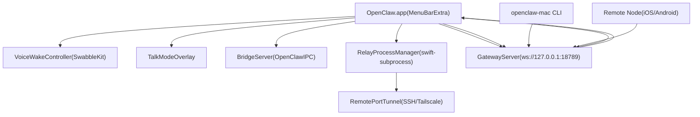
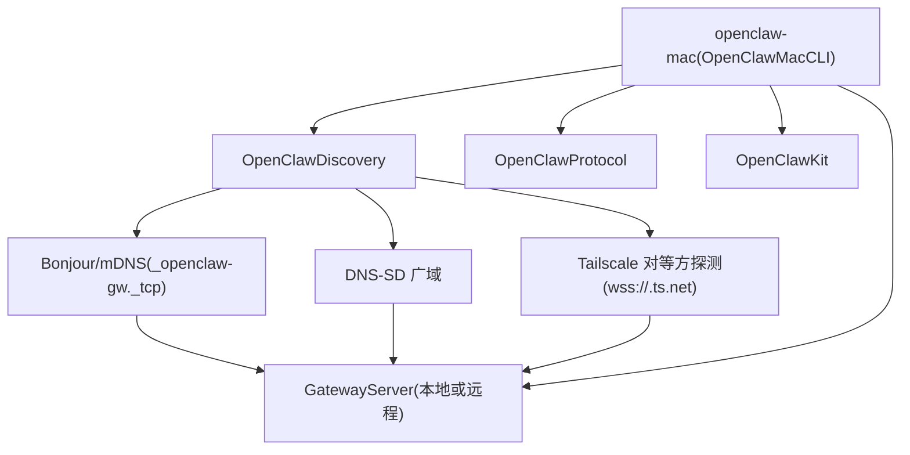
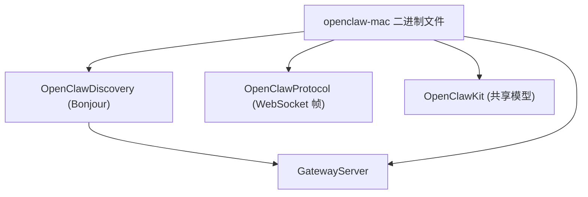

# macOS 客户端 (macOS Client)

相关源文件

-   [CHANGELOG.md](https://github.com/openclaw/openclaw/blob/8873e13f/CHANGELOG.md)
-   [README.md](https://github.com/openclaw/openclaw/blob/8873e13f/README.md)
-   [apps/android/app/build.gradle.kts](https://github.com/openclaw/openclaw/blob/8873e13f/apps/android/app/build.gradle.kts)
-   [apps/ios/Sources/Info.plist](https://github.com/openclaw/openclaw/blob/8873e13f/apps/ios/Sources/Info.plist)
-   [apps/ios/Tests/Info.plist](https://github.com/openclaw/openclaw/blob/8873e13f/apps/ios/Tests/Info.plist)
-   [apps/ios/project.yml](https://github.com/openclaw/openclaw/blob/8873e13f/apps/ios/project.yml)
-   [apps/macos/Sources/OpenClaw/Resources/Info.plist](https://github.com/openclaw/openclaw/blob/8873e13f/apps/macos/Sources/OpenClaw/Resources/Info.plist)
-   [assets/avatar-placeholder.svg](https://github.com/openclaw/openclaw/blob/8873e13f/assets/avatar-placeholder.svg)
-   [docs/cli/index.md](https://github.com/openclaw/openclaw/blob/8873e13f/docs/cli/index.md)
-   [docs/gateway/configuration.md](https://github.com/openclaw/openclaw/blob/8873e13f/docs/gateway/configuration.md)
-   [docs/gateway/index.md](https://github.com/openclaw/openclaw/blob/8873e13f/docs/gateway/index.md)
-   [docs/gateway/troubleshooting.md](https://github.com/openclaw/openclaw/blob/8873e13f/docs/gateway/troubleshooting.md)
-   [docs/index.md](https://github.com/openclaw/openclaw/blob/8873e13f/docs/index.md)
-   [docs/platforms/mac/release.md](https://github.com/openclaw/openclaw/blob/8873e13f/docs/platforms/mac/release.md)
-   [docs/start/getting-started.md](https://github.com/openclaw/openclaw/blob/8873e13f/docs/start/getting-started.md)
-   [docs/start/wizard.md](https://github.com/openclaw/openclaw/blob/8873e13f/docs/start/wizard.md)
-   [extensions/bluebubbles/src/send-helpers.ts](https://github.com/openclaw/openclaw/blob/8873e13f/extensions/bluebubbles/src/send-helpers.ts)
-   [package.json](https://github.com/openclaw/openclaw/blob/8873e13f/package.json)
-   [pnpm-lock.yaml](https://github.com/openclaw/openclaw/blob/8873e13f/pnpm-lock.yaml)
-   [scripts/clawtributors-map.json](https://github.com/openclaw/openclaw/blob/8873e13f/scripts/clawtributors-map.json)
-   [scripts/protocol-gen-swift.ts](https://github.com/openclaw/openclaw/blob/8873e13f/scripts/protocol-gen-swift.ts)
-   [scripts/update-clawtributors.ts](https://github.com/openclaw/openclaw/blob/8873e13f/scripts/update-clawtributors.ts)
-   [scripts/update-clawtributors.types.ts](https://github.com/openclaw/openclaw/blob/8873e13f/scripts/update-clawtributors.types.ts)
-   [src/agents/subagent-registry-cleanup.test.ts](https://github.com/openclaw/openclaw/blob/8873e13f/src/agents/subagent-registry-cleanup.test.ts)
-   [src/cli/program.ts](https://github.com/openclaw/openclaw/blob/8873e13f/src/cli/program.ts)
-   [src/config/config.ts](https://github.com/openclaw/openclaw/blob/8873e13f/src/config/config.ts)
-   [src/config/types.ts](https://github.com/openclaw/openclaw/blob/8873e13f/src/config/types.ts)
-   [src/config/zod-schema.ts](https://github.com/openclaw/openclaw/blob/8873e13f/src/config/zod-schema.ts)
-   [ui/package.json](https://github.com/openclaw/openclaw/blob/8873e13f/ui/package.json)

macOS 客户端 (`OpenClaw.app`) 是一个菜单栏应用程序，既充当网关 (Gateway) 控制界面，也充当设备节点 (node)。它提供语音唤醒 (Voice Wake)/一键通话 (push-to-talk)、通话模式 (Talk Mode) 叠加层、WebChat 访问、调试工具，以及通过 SSH 隧道和 Tailscale 发现实现的远程网关控制。该应用在 `apps/macos/` 作为一个 Swift 程序包进行打包。

相关页面：[iOS 客户端](/openclaw/openclaw/6.1-ios-client)、[Android 客户端](/openclaw/openclaw/6.3-android-client)、[WebSocket 协议与 RPC](/openclaw/openclaw/2.1-websocket-protocol-and-rpc)、[身份验证与设备配对](/openclaw/openclaw/2.2-authentication-and-device-pairing)。

---

## 架构概览 (Architecture Overview)

macOS 应用以双重模式运行：

1.  **节点模式 (Node mode)**：作为设备节点连接到网关，注册各项能力（屏幕自动化、摄像头、Canvas），并处理 `node.invoke` 请求。
2.  **操作员模式 (Operator mode)**：维护第二个 WebSocket 连接，用于聊天、会话管理和配置 RPC 调用。

它还充当配对审批界面：当 iOS/Android 节点发送 `node.pair.request` 时，macOS 应用会展示“批准/拒绝” UI。当请求包含 `silent: true` 且可以验证到网关主机的 SSH 连通性时，支持静默自动批准。

**关键特性**（源自 README.md 和 CHANGELOG.md）：

| 特性 | 目的 |
| --- | --- |
| 菜单栏控制 | 网关状态、会话列表、智能体选择器 |
| 语音唤醒 / PTT | 唤醒词检测 (`SwabbleKit`)、一键通话叠加层 |
| 通话模式 (Talk Mode) | 持续的语音交互叠加层 |
| WebChat | 应用内基于浏览器的聊天 UI |
| 调试工具 | 会话检查器、能力测试、日志查看器 |
| 远程网关控制 | SSH 隧道转发、Tailscale Serve/Funnel 发现 |
| 配对批准 | 针对远程节点的交互式/静默批准 |

**来源**：[README.md289-295](https://github.com/openclaw/openclaw/blob/8873e13f/README.md#L289-L295) [CHANGELOG.md161](https://github.com/openclaw/openclaw/blob/8873e13f/CHANGELOG.md#L161-L161) [package.json1-18](https://github.com/openclaw/openclaw/blob/8873e13f/package.json#L1-L18)

**组件交互图**

**来源**：[apps/macos/Package.swift1-92](https://github.com/openclaw/openclaw/blob/8873e13f/apps/macos/Package.swift#L1-L92) [README.md289-295](https://github.com/openclaw/openclaw/blob/8873e13f/README.md#L289-L295) [CHANGELOG.md161](https://github.com/openclaw/openclaw/blob/8873e13f/CHANGELOG.md#L161-L161)

---

## Swift 程序包结构 (Swift Package Structure)

macOS 应用是一个独立的 Swift 程序包 (`apps/macos/Package.swift`)，目标平台为 macOS 15+。它产生四个产品：

| 产品 | 类型 | 目的 |
| --- | --- | --- |
| `OpenClawIPC` | 库 | 菜单栏进程与其他进程（如 `BridgeServer`）之间的本地 IPC 协议 |
| `OpenClawDiscovery` | 库 | 本地网关实例的 Bonjour/mDNS 发现 |
| `OpenClaw` | 可执行文件 | 菜单栏应用本身 |
| `openclaw-mac` | 可执行文件 | 无界面的 CLI 伴侣（`OpenClawMacCLI` 目标） |

**主应用依赖项**

| 依赖项 | 在 macOS 应用中的角色 |
| --- | --- |
| `MenuBarExtraAccess` | 菜单栏窗口生命周期和访问管理 |
| `swift-subprocess` | 驱动 `RelayProcessManager` 以衍生子进程 |
| `swift-log` | 结构化日志记录 |
| `Sparkle` | 应用内自动更新 |
| `PeekabooBridge` / `PeekabooAutomationKit` | 暴露给智能体的屏幕自动化能力 |
| `OpenClawKit` | 共享模型、Bridge 帧、能力定义 |
| `OpenClawChatUI` | 共享聊天 UI 组件 |
| `OpenClawProtocol` | 网关 WebSocket 协议帧类型 |
| `SwabbleKit` | 唤醒词引擎（与 iOS 版相同） |

**来源**：[apps/macos/Package.swift1-92](https://github.com/openclaw/openclaw/blob/8873e13f/apps/macos/Package.swift#L1-L92) [apps/macos/Package.resolved1-132](https://github.com/openclaw/openclaw/blob/8873e13f/apps/macos/Package.resolved#L1-L132)

**程序包目标依赖图**

```mermaid
flowchart TD
    OpenClaw_exe["OpenClaw (可执行文件)"]
    OpenClawMacCLI_exe["OpenClawMacCLI (可执行文件)"]
    OpenClawIPC_lib["OpenClawIPC (库)"]
    OpenClawDiscovery_lib["OpenClawDiscovery (库)"]
    OpenClawKit_pkg["OpenClawKit"]
    OpenClawChatUI_pkg["OpenClawChatUI"]
    OpenClawProtocol_pkg["OpenClawProtocol"]
    SwabbleKit_pkg["SwabbleKit"]
    MenuBarExtraAccess_pkg["MenuBarExtraAccess"]
    Subprocess_pkg["swift-subprocess"]
    Logging_pkg["swift-log"]
    Sparkle_pkg["Sparkle"]
    PeekabooBridge_pkg["PeekabooBridge"]
    PeekabooAutomationKit_pkg["PeekabooAutomationKit"]

    OpenClaw --> exe_OpenClawIPC_lib
    OpenClaw --> exe_OpenClawDiscovery_lib
    OpenClaw --> exe_OpenClawKit_pkg
    OpenClaw --> exe_OpenClawChatUI_pkg
    OpenClaw --> exe_OpenClawProtocol_pkg
    OpenClaw --> exe_SwabbleKit_pkg
    OpenClaw --> exe_MenuBarExtraAccess_pkg
    OpenClaw --> exe_Subprocess_pkg
    OpenClaw --> exe_Logging_pkg
    OpenClaw --> exe_Sparkle_pkg
    OpenClaw --> exe_PeekabooBridge_pkg
    OpenClaw --> exe_PeekabooAutomationKit_pkg
    OpenClawMacCLI --> exe_OpenClawDiscovery_lib
    OpenClawMacCLI --> exe_OpenClawKit_pkg
    OpenClawMacCLI --> exe_OpenClawProtocol_pkg
    OpenClawDiscovery --> lib_OpenClawKit_pkg
```

**来源**：[apps/macos/Package.swift26-92](https://github.com/openclaw/openclaw/blob/8873e13f/apps/macos/Package.swift#L26-L92)

---

## 菜单栏特性

主可执行文件 `OpenClaw` 作为一个驻留在菜单栏的应用程序运行（无 Dock 图标）。它利用 `MenuBarExtraAccess` 进行生命周期管理，并展示一个包含以下表面的弹出 (popover) UI：

| 表面 | 目的 |
| --- | --- |
| 连接状态 | 网关的可达性（已连接/连接中/离线） |
| 会话列表 | 活动的聊天会话，可选择用于 WebChat |
| 智能体选择器 | 来自 `agents.list` 的已配置智能体 |
| 配对批准 | 针对 `node.pair.requested` 事件的交互式提示 |
| 语音唤醒控制 | 唤醒词开关、一键通话激活 |
| 通话模式切换 | 启用持续的语音叠加层 |
| WebChat 窗口 | 访问 `http://127.0.0.1:18789/` 的应用内浏览器视图 |
| 调试工具 | 会话检查器、能力探测、日志查看器 |
| 设置 | 网关 URL、身份验证令牌/密码、节点显示名称 |

**双重 WebSocket 连接**：

1.  **节点连接** (`node` 角色)：通过 `node.describe` 注册设备能力，处理 `node.invoke` 请求（屏幕自动化、摄像头、Canvas）。
2.  **操作员连接** (`operator` 角色)：处理 `chat.send`、`sessions.list`、`config.get` 及其他 RPC 方法。

**来源**：[apps/macos/Package.swift43-67](https://github.com/openclaw/openclaw/blob/8873e13f/apps/macos/Package.swift#L43-L67) [README.md289-295](https://github.com/openclaw/openclaw/blob/8873e13f/README.md#L289-L295) [CHANGELOG.md161](https://github.com/openclaw/openclaw/blob/8873e13f/CHANGELOG.md#L161-L161)

---

## BridgeServer 与 OpenClawIPC

`OpenClawIPC` 是一个零依赖的 Swift 库，实现了本地进程间通信。主应用托管了一个 `BridgeServer`，其他本地进程可以连接到它。这允许诸如 `openclaw-mac` CLI 或由 `RelayProcessManager` 管理的派生子进程在不经过网关的情况下与正在运行的应用进行通信。

IPC 帧格式镜像了网关的 Bridge 帧格式 —— 重用了 `OpenClawKit` 中定义的相同 `BridgeInvokeRequest` / `BridgeInvokeResponse` 类型，因此来自网关的能力调用与本地 IPC 调用流经相同的路径。

**来源**：[apps/macos/Package.swift27-31](https://github.com/openclaw/openclaw/blob/8873e13f/apps/macos/Package.swift#L27-L31) [apps/macos/Package.swift79-90](https://github.com/openclaw/openclaw/blob/8873e13f/apps/macos/Package.swift#L79-L90)

---

## RelayProcessManager

`RelayProcessManager` 使用 `swift-subprocess` 来衍生和监管中继 (relay) 进程。中继进程提供一个 `RemotePortTunnel`：它将本地端口转发到远程网关端点，使得菜单栏应用在不需要完整 VPN 的情况下也能访问不在本地网络上的网关。

**生命周期**

**来源**：[apps/macos/Package.swift52-54](https://github.com/openclaw/openclaw/blob/8873e13f/apps/macos/Package.swift#L52-L54)

---

**配对序列图**

**来源**：[CHANGELOG.md161](https://github.com/openclaw/openclaw/blob/8873e13f/CHANGELOG.md#L161-L161)

## openclaw-mac CLI

`OpenClawMacCLI` 目标产生一个用于无界面网关交互的独立二进制文件 (`openclaw-mac`)。它重用了 `OpenClawDiscovery` 进行 Bonjour/DNS-SD 发现，并通过 `OpenClawProtocol` 与网关进行 WebSocket 协议通信。

**使用场景**：

| 场景 | 示例 |
| --- | --- |
| 脚本化网关调用 | `openclaw-mac call sessions.list` |
| CI/CD 自动化 | 在不开启完整应用的情况下触发智能体运行 |
| 网关发现 | `openclaw-mac discover` (Bonjour/mDNS 探测) |
| Tailscale 对等方探测 | 通过 `wss://<peer>.ts.net` 发现网关 (CHANGELOG.md #32860) |

**架构**：纯命令行工具，不依赖 `OpenClawIPC` 或 UI。使用 `OpenClawDiscovery` 进行 mDNS (`_openclaw-gw._tcp`) 和 DNS-SD 广域查找，包括 Tailscale Serve/Funnel 端点。

---

## 设备能力 (Device Capabilities)

macOS 应用在完成 `connect.challenge` 握手后，通过 `node.describe` 向网关注册节点能力。这些能力以 `node.invoke` 动作的形式暴露，智能体运行时可以通过 `nodes` 工具进行调用。

**macOS 特有能力**：

| 能力 | 实现 | 智能体访问方式 |
| --- | --- | --- |
| `system.run` | 命令执行 (bash/zsh) | `node.invoke action=system.run` |
| `system.notify` | macOS 通知中心 | `node.invoke action=system.notify` |
| 屏幕自动化 | `PeekabooBridge`, `PeekabooAutomationKit` | `node.invoke action=screen.*` |
| 屏幕捕获 | 辅助功能 (Accessibility) + 屏幕录制权限 | `node.invoke action=screen.capture` |

**共享能力**（iOS 亦具备）：

| 能力 | 实现 | 智能体访问方式 |
| --- | --- | --- |
| Canvas 渲染 | `OpenClawKit` (Web 视图) | `canvas.*` 工具动作 |
| 摄像头拍照/短片 | 系统摄像头 API | `node.invoke action=camera.*` |
| 语音唤醒 (Voice Wake) | `SwabbleKit` 唤醒词引擎 | 唤醒词触发聊天会话 |

**权限模型**：macOS 应用跟踪屏幕录制、辅助功能、摄像头和麦克风的 TCC (Transparency, Consent, and Control) 权限。当 `node.invoke` 动作缺少所需权限时，响应将包含 `PERMISSION_MISSING` 以及可操作的指引。

**来源**：[apps/macos/Package.swift43-67](https://github.com/openclaw/openclaw/blob/8873e13f/apps/macos/Package.swift#L43-L67) [README.md240-252](https://github.com/openclaw/openclaw/blob/8873e13f/README.md#L240-L252)

---

## 配对审批流程 (Pairing Approval Flow)

当远程节点（iOS, Android）尝试配对时，网关会向所有已连接的操作员 (operator) 角色客户端发出 `node.pair.requested` 事件。macOS 应用接收该事件并展示审批 UI（或尝试静默自动批准）。

**配对序列**：

1.  远程节点连接并调用 `node.pair.request { silent: true/false }`。
2.  网关存储挂起的请求（5 分钟后过期），发出 `node.pair.requested`。
3.  macOS 应用接收事件并评估审批模式：
    -   **静默模式** (`silent: true`)：尝试对网关主机进行 SSH 连接验证。如果 SSH 成功（同一本地用户上下文），则自动批准。如果 SSH 失败，则回退到交互式提示。
    -   **交互模式**：向用户展示带有节点元数据（设备名称、平台、请求的能力）的“批准/拒绝” UI。
4.  批准后，macOS 应用调用 `node.pair.approve`，网关颁发新的身份验证令牌。
5.  网关发出 `node.pair.resolved`，远程节点收到令牌并重新连接。

**静默批准逻辑**（引入于 CHANGELOG.md #32860）：

-   要求在配对请求中设置 `silent: true`。
-   macOS 应用探测 SSH 连通性：`ssh <gateway-host> echo ok`。
-   如果探测成功，则自动批准（无需用户交互）。
-   如果探测失败（主机不可达、缺少凭据），则回退到交互式提示。

---

**openclaw-mac 依赖图**

**来源**：[apps/macos/Package.swift69-78](https://github.com/openclaw/openclaw/blob/8873e13f/apps/macos/Package.swift#L69-L78) [CHANGELOG.md161](https://github.com/openclaw/openclaw/blob/8873e13f/CHANGELOG.md#L161-L161)

**来源**：[apps/macos/Package.swift69-78](https://github.com/openclaw/openclaw/blob/8873e13f/apps/macos/Package.swift#L69-L78)

---

## 更新机制 (Update Mechanism)

应用集成了 `Sparkle` (版本 2.x) 用于自动更新。发布版本会发布资产，Sparkle 的 appcast 机制在后台处理更新发现和安装。有关 macOS 发布流程，请参见 [发布 (Releasing)](/openclaw/openclaw/8.2-release-process)。

**来源**：[apps/macos/Package.swift21](https://github.com/openclaw/openclaw/blob/8873e13f/apps/macos/Package.swift#L21-L21) [apps/macos/Package.resolved46-56](https://github.com/openclaw/openclaw/blob/8873e13f/apps/macos/Package.resolved#L46-L56)
