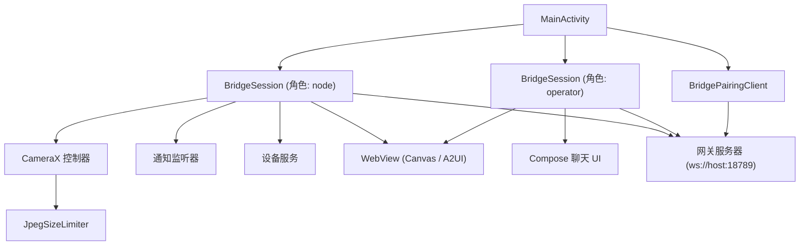
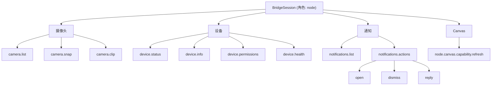

# Android 客户端 (Android Client)

相关源文件

-   [CHANGELOG.md](https://github.com/openclaw/openclaw/blob/8873e13f/CHANGELOG.md)
-   [README.md](https://github.com/openclaw/openclaw/blob/8873e13f/README.md)
-   [apps/android/app/build.gradle.kts](https://github.com/openclaw/openclaw/blob/8873e13f/apps/android/app/build.gradle.kts)
-   [apps/ios/Sources/Info.plist](https://github.com/openclaw/openclaw/blob/8873e13f/apps/ios/Sources/Info.plist)
-   [apps/ios/Tests/Info.plist](https://github.com/openclaw/openclaw/blob/8873e13f/apps/ios/Tests/Info.plist)
-   [apps/ios/project.yml](https://github.com/openclaw/openclaw/blob/8873e13f/apps/ios/project.yml)
-   [apps/macos/Sources/OpenClaw/Resources/Info.plist](https://github.com/openclaw/openclaw/blob/8873e13f/apps/macos/Sources/OpenClaw/Resources/Info.plist)
-   [assets/avatar-placeholder.svg](https://github.com/openclaw/openclaw/blob/8873e13f/assets/avatar-placeholder.svg)
-   [docs/cli/index.md](https://github.com/openclaw/openclaw/blob/8873e13f/docs/cli/index.md)
-   [docs/gateway/configuration.md](https://github.com/openclaw/openclaw/blob/8873e13f/docs/gateway/configuration.md)
-   [docs/gateway/index.md](https://github.com/openclaw/openclaw/blob/8873e13f/docs/gateway/index.md)
-   [docs/gateway/troubleshooting.md](https://github.com/openclaw/openclaw/blob/8873e13f/docs/gateway/troubleshooting.md)
-   [docs/index.md](https://github.com/openclaw/openclaw/blob/8873e13f/docs/index.md)
-   [docs/platforms/mac/release.md](https://github.com/openclaw/openclaw/blob/8873e13f/docs/platforms/mac/release.md)
-   [docs/start/getting-started.md](https://github.com/openclaw/openclaw/blob/8873e13f/docs/start/getting-started.md)
-   [docs/start/wizard.md](https://github.com/openclaw/openclaw/blob/8873e13f/docs/start/wizard.md)
-   [extensions/bluebubbles/src/send-helpers.ts](https://github.com/openclaw/openclaw/blob/8873e13f/extensions/bluebubbles/src/send-helpers.ts)
-   [package.json](https://github.com/openclaw/openclaw/blob/8873e13f/package.json)
-   [pnpm-lock.yaml](https://github.com/openclaw/openclaw/blob/8873e13f/pnpm-lock.yaml)
-   [scripts/clawtributors-map.json](https://github.com/openclaw/openclaw/blob/8873e13f/scripts/clawtributors-map.json)
-   [scripts/update-clawtributors.ts](https://github.com/openclaw/openclaw/blob/8873e13f/scripts/update-clawtributors.ts)
-   [scripts/update-clawtributors.types.ts](https://github.com/openclaw/openclaw/blob/8873e13f/scripts/update-clawtributors.types.ts)
-   [src/agents/subagent-registry-cleanup.test.ts](https://github.com/openclaw/openclaw/blob/8873e13f/src/agents/subagent-registry-cleanup.test.ts)
-   [src/cli/program.ts](https://github.com/openclaw/openclaw/blob/8873e13f/src/cli/program.ts)
-   [src/config/config.ts](https://github.com/openclaw/openclaw/blob/8873e13f/src/config/config.ts)
-   [src/config/types.ts](https://github.com/openclaw/openclaw/blob/8873e13f/src/config/types.ts)
-   [src/config/zod-schema.ts](https://github.com/openclaw/openclaw/blob/8873e13f/src/config/zod-schema.ts)
-   [ui/package.json](https://github.com/openclaw/openclaw/blob/8873e13f/ui/package.json)

Android 客户端 (`ai.openclaw.android`) 是 OpenClaw 的 Android 设备节点。它位于 `apps/android/` 目录下，通过 WebSocket 以 `node` 角色连接到网关 (Gateway)，注册设备能力（摄像头、设备状态、通知、Canvas），并托管了一个原生基于 Compose 的聊天 UI 和用于 A2UI 交互的 WebView Canvas。

本页涵盖了 Android 应用的连接架构、配对流、节点能力、图像处理以及构建配置。关于对应的 iOS 客户端，请参见 [6.1](/openclaw/openclaw/6.1-ios-client)；关于 macOS 客户端，请参见 [6.2](/openclaw/openclaw/6.2-macos-client)。关于共享的节点角色协议和 Bridge 连接模型，请参见 [6](/openclaw/openclaw/6-native-clients-(nodes))。

---

## 架构概览 (Architecture Overview)

应用保持了两个通向网关的并发 WebSocket 连接 —— 一个是 `node` 角色，另一个是 `operator` 角色 —— 均由 `BridgeSession` 实例管理。`node` 连接处理能力通告和 `node.invoke` 分发；`operator` 连接用于聊天、配置和 Canvas RPC。初始设备配对由 `BridgePairingClient` 处理。

**Android 应用组件图**

**来源**：[apps/android/app/build.gradle.kts](https://github.com/openclaw/openclaw/blob/8873e13f/apps/android/app/build.gradle.kts) [CHANGELOG.md11-12](https://github.com/openclaw/openclaw/blob/8873e13f/CHANGELOG.md#L11-L12) [CHANGELOG.md141](https://github.com/openclaw/openclaw/blob/8873e13f/CHANGELOG.md#L141-L141)

---

## BridgeSession

`BridgeSession` 管理一个通向网关的 WebSocket 连接。应用启动时会创建两个实例，每个角色对应一个：

| 实例 | 角色 | 职责 |
| --- | --- | --- |
| 节点会话 (node session) | `node` | 通告能力，接收并分发 `node.invoke` 命令 |
| 操作员会话 (operator session) | `operator` | 代表本地用户发起聊天、配置和 Canvas RPC |

WebSocket 传输层使用 OkHttp3。之前由于 OkHttp 添加了原生的 `Origin` 标头导致网关拒绝连接的 bug，已通过在连接设置中显式移除该标头而修复。

设备身份派生自密钥对。密钥对使用 `androidx.security:security-crypto`（加密的 SharedPreferences）进行存储，Bouncycastle (`bcprov-jdk18on`) 在 `connect.challenge` / `hello-ok` 握手期间提供底层的密钥生成和签名加密原语。

**来源**：[apps/android/app/build.gradle.kts124-127](https://github.com/openclaw/openclaw/blob/8873e13f/apps/android/app/build.gradle.kts#L124-L127) [CHANGELOG.md141](https://github.com/openclaw/openclaw/blob/8873e13f/CHANGELOG.md#L141-L141)

---

## BridgePairingClient

`BridgePairingClient` 实现了设备配对审批流。当 Android 节点首次连接时，网关会存储一个挂起的配对请求，操作员必须通过 CLI 或 UI 批准后，节点才会获得其身份验证令牌。这遵循了 [2.2](/openclaw/openclaw/2.2-authentication-and-device-pairing) 中描述的 `node.pair.*` 协议。

初始设置的二维码扫描使用 ZXing (`zxing-android-embedded`)。用户扫描网关或 CLI 输出显示的设置码，即可在不手动输入凭据的情况下引导连接。

**来源**：[apps/android/app/build.gradle.kts139-140](https://github.com/openclaw/openclaw/blob/8873e13f/apps/android/app/build.gradle.kts#L139-L140) [CHANGELOG.md141](https://github.com/openclaw/openclaw/blob/8873e13f/CHANGELOG.md#L141-L141)

---

## 节点能力 (Node Capabilities)

当 `node` 角色的 `BridgeSession` 连接时，它向网关通告一组能力。网关随后可以通过 `node.invoke` 调用这些能力。能力集随版本发布不断增加。

**Android 节点能力树**

**来源**：[CHANGELOG.md11-12](https://github.com/openclaw/openclaw/blob/8873e13f/CHANGELOG.md#L11-L12) [CHANGELOG.md40-42](https://github.com/openclaw/openclaw/blob/8873e13f/CHANGELOG.md#L40-L42) [CHANGELOG.md59-60](https://github.com/openclaw/openclaw/blob/8873e13f/CHANGELOG.md#L59-L60)

### 摄像头 (Camera)

摄像头命令使用 CameraX 库套件 (`camera-core`, `camera-camera2`, `camera-lifecycle`, `camera-video`, `camera-view`)。

| 命令 | 描述 | 备注 |
| --- | --- | --- |
| `camera.list` | 列出可用摄像头 | 返回设备 ID 和朝向信息 |
| `camera.snap` | 拍摄一张照片 | 输出受 `JpegSizeLimiter` 限制大小 |
| `camera.clip` | 录制一段短片 | 二进制上传；无 base64 回退 |

行为约束：

-   当同时指定了 `deviceId` 时，拒绝 `facing=both`，以防止标签错误的重复采集。
-   `maxWidth` 必须为正整数；非正值将回退到安全的默认缩放尺寸。
-   `camera.clip` 使用确定的二进制上传传输。为了使传输失败更加明确，移除了 base64 回退。
-   调用结果确认超时已扩展到完整的调用预算，以适应大型视频剪辑负载。

**来源**：[apps/android/app/build.gradle.kts134-139](https://github.com/openclaw/openclaw/blob/8873e13f/apps/android/app/build.gradle.kts#L134-L139) [CHANGELOG.md40-41](https://github.com/openclaw/openclaw/blob/8873e13f/CHANGELOG.md#L40-L41)

### 设备 (Device)

| 命令 | 描述 |
| --- | --- |
| `device.status` | 当前设备状态（电池、连通性等） |
| `device.info` | 静态设备元数据（型号、操作系统版本） |
| `device.permissions` | 运行时权限授予状态 |
| `device.health` | 设备健康诊断 |

**来源**：[CHANGELOG.md11](https://github.com/openclaw/openclaw/blob/8873e13f/CHANGELOG.md#L11-L11) [CHANGELOG.md59](https://github.com/openclaw/openclaw/blob/8873e13f/CHANGELOG.md#L59-L59)

### 通知 (Notifications)

| 命令 | 动作 | 备注 |
| --- | --- | --- |
| `notifications.list` | 列出活跃通知 | 返回通知元数据数组 |
| `notifications.actions open` | 打开/启动通知 | 允许对不可清除的条目进行操作 |
| `notifications.actions dismiss` | 消除通知 | 限制：仅限可清除的通知 |
| `notifications.actions reply` | 发送内联回复 | 允许对不可清除的条目进行操作 |

通知监听器会在执行任何通知动作前立即重新绑定，以确保动作针对的是当前的实时状态。

**来源**：[CHANGELOG.md11](https://github.com/openclaw/openclaw/blob/8873e13f/CHANGELOG.md#L11-L11) [CHANGELOG.md40](https://github.com/openclaw/openclaw/blob/8873e13f/CHANGELOG.md#L40-L40) [CHANGELOG.md60](https://github.com/openclaw/openclaw/blob/8873e13f/CHANGELOG.md#L60-L60)

### Canvas 与 A2UI

Android 节点支持 Canvas 能力。WebView 通过 `androidx.webkit:webkit` 承载。网关向节点推送 URL；节点在 WebView 中加载并执行 A2UI 交互。

关键行为：

-   `node.canvas.capability.refresh` 发送空对象参数 (`{}`) 以发出 A2UI 就绪信号，并在作用域能力过期后进行恢复。网关会验证 `params` 是否为对象（非 `null`），因此为了符合模式要求，必须发送 `{}` 而非空。
-   Canvas URL 在加载前会按作用域进行规范化。
-   通过在 WebView JavaScript 上下文中轮询 `openclawA2UI` 宿主对象来验证 A2UI 的就绪状态，并在加载延迟时进行重试。
-   可在运行时启用调试诊断 JSON 端点，用于 Canvas 故障排查。

**来源**：[apps/android/app/build.gradle.kts106](https://github.com/openclaw/openclaw/blob/8873e13f/apps/android/app/build.gradle.kts#L106-L106) [CHANGELOG.md12](https://github.com/openclaw/openclaw/blob/8873e13f/CHANGELOG.md#L12-L12) [CHANGELOG.md42](https://github.com/openclaw/openclaw/blob/8873e13f/CHANGELOG.md#L42-L42)

---

## JpegSizeLimiter

`JpegSizeLimiter` 在摄像头命令生成的 JPEG 图像传输至网关前，强制执行最大尺寸和字节大小限制。这可以防止超大负载压垮 WebSocket 传输或网关处理。

`JpegSizeLimiter` 强制执行的关键规则：

-   调用处会拒绝非正数的 `maxWidth` 值；改为使用安全的默认缩放尺寸。
-   通过 `androidx.exifinterface:exifinterface` 处理 EXIF 元数据，以在缩放期间保留或剥离方向信息。

**来源**：[apps/android/app/build.gradle.kts125](https://github.com/openclaw/openclaw/blob/8873e13f/apps/android/app/build.gradle.kts#L125-L125) [CHANGELOG.md40-42](https://github.com/openclaw/openclaw/blob/8873e13f/CHANGELOG.md#L40-L42)

---

## 聊天 UI (Chat UI)

原生的 Android 聊天界面使用 Jetpack Compose 构建，并由 `operator` 角色的 `BridgeSession` 驱动。流式的部分回复在渲染前会增量组装。

Markdown 渲染使用 CommonMark 库套件：

| 库 | 目的 |
| --- | --- |
| `commonmark` | 核心 CommonMark 块/行内解析 |
| `commonmark-ext-autolink` | 自动 URL 和邮箱链接化 |
| `commonmark-ext-gfm-strikethrough` | GitHub 风格 Markdown 删除线 |
| `commonmark-ext-gfm-tables` | GFM 表格渲染 |
| `commonmark-ext-task-list-items` | 任务列表复选框项目 |

**来源**：[apps/android/app/build.gradle.kts128-133](https://github.com/openclaw/openclaw/blob/8873e13f/apps/android/app/build.gradle.kts#L128-L133) [CHANGELOG.md152-153](https://github.com/openclaw/openclaw/blob/8873e13f/CHANGELOG.md#L152-L153)

---

## 构建配置 (Build Configuration)

应用模块位于 `apps/android/app/`，使用 Gradle Kotlin DSL 构建。

### 模块身份

| 属性 | 值 |
| --- | --- |
| 应用程序 ID (Application ID) | `ai.openclaw.android` |
| `compileSdk` | 36 |
| `minSdk` | 31 (Android 12) |
| `targetSdk` | 36 |
| `versionName` | `2026.2.27` (与 monorepo 版本匹配) |
| `versionCode` | `202602270` |
| 支持的 ABI | `armeabi-v7a`, `arm64-v8a`, `x86`, `x86_64` |

通过自定义的 `androidComponents.onVariants` 钩子，APK 输出文件被命名为 `openclaw-{versionName}-{buildType}.apk` [apps/android/app/build.gradle.kts78-89](https://github.com/openclaw/openclaw/blob/8873e13f/apps/android/app/build.gradle.kts#L78-L89)。

正式版 (Release) 构建启用了混淆和资源压缩 (`isMinifyEnabled = true`, `isShrinkResources = true`)。调试版 (Debug) 构建则均禁用。

应用通过将 `../../shared/OpenClawKit/Sources/OpenClawKit/Resources` 添加到 `main` 源码集的资源目录中，与跨平台的 `OpenClawKit` 库共享资源资产 [apps/android/app/build.gradle.kts13-17](https://github.com/openclaw/openclaw/blob/8873e13f/apps/android/app/build.gradle.kts#L13-L17)。

### 关键运行时依赖

| 依赖项 | 版本 | 角色 |
| --- | --- | --- |
| `okhttp3:okhttp` | 5.3.2 | WebSocket 传输 (`BridgeSession`) |
| `bouncycastle:bcprov-jdk18on` | 1.83 | 设备身份密钥对 |
| `security-crypto` | 1.1.0 | 加密凭据存储 |
| `webkit` | 1.15.0 | Canvas / A2UI WebView |
| `dnsjava:dnsjava` | 3.6.4 | 用于 Tailnet 网关发现的单播 DNS-SD |
| `camera-*` (CameraX) | 1.5.2 | 用于摄像头能力的 CameraX |
| `zxing-android-embedded` | 4.3.0 | 用于配对设置的二维码扫描 |
| `commonmark` 及扩展 | 0.27.1 | 聊天 Markdown 渲染 |
| `kotlinx-serialization-json` | 1.10.0 | JSON 序列化 |
| `exifinterface` | 1.4.2 | 图像 EXIF 元数据处理 |
| Compose BOM | 2026.02.00 | 原生 UI 框架 |

**来源**：[apps/android/app/build.gradle.kts98-151](https://github.com/openclaw/openclaw/blob/8873e13f/apps/android/app/build.gradle.kts#L98-L151)

---

## 开发命令 (Development Commands)

根目录 `package.json` 暴露了常用的 Android 任务 npm 脚本：

| 脚本 | 底层命令 | 描述 |
| --- | --- | --- |
| `android:assemble` | `./gradlew :app:assembleDebug` | 构建调试版 APK |
| `android:install` | `./gradlew :app:installDebug` | 在连接的 ADB 设备上安装 |
| `android:run` | `installDebug` + `adb shell am start -n ai.openclaw.android/.MainActivity` | 安装并启动 |
| `android:test` | `./gradlew :app:testDebugUnitTest` | 运行单元测试 |
| `android:test:integration` | `vitest run ... android-node.capabilities.live.test.ts` | 网关端的实时集成测试 |

集成测试套件位于 Node.js 网关代码库的 `src/gateway/android-node.capabilities.live.test.ts` 中，需要连接一台 Android 设备。该测试受环境变量 `OPENCLAW_LIVE_TEST=1` 和 `OPENCLAW_LIVE_ANDROID_NODE=1` 管控。

**来源**：[package.json50-54](https://github.com/openclaw/openclaw/blob/8873e13f/package.json#L50-L54)
