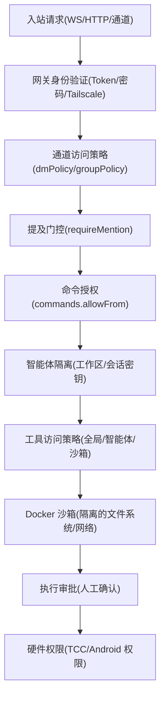

# 安全 (Security)

相关源文件

-   [CHANGELOG.md](https://github.com/openclaw/openclaw/blob/8873e13f/CHANGELOG.md)
-   [README.md](https://github.com/openclaw/openclaw/blob/8873e13f/README.md)
-   [apps/android/app/build.gradle.kts](https://github.com/openclaw/openclaw/blob/8873e13f/apps/android/app/build.gradle.kts)
-   [apps/ios/Sources/Info.plist](https://github.com/openclaw/openclaw/blob/8873e13f/apps/ios/Sources/Info.plist)
-   [apps/ios/Tests/Info.plist](https://github.com/openclaw/openclaw/blob/8873e13f/apps/ios/Tests/Info.plist)
-   [apps/ios/project.yml](https://github.com/openclaw/openclaw/blob/8873e13f/apps/ios/project.yml)
-   [apps/macos/Sources/OpenClaw/Resources/Info.plist](https://github.com/openclaw/openclaw/blob/8873e13f/apps/macos/Sources/OpenClaw/Resources/Info.plist)
-   [assets/avatar-placeholder.svg](https://github.com/openclaw/openclaw/blob/8873e13f/assets/avatar-placeholder.svg)
-   [docs/channels/discord.md](https://github.com/openclaw/openclaw/blob/8873e13f/docs/channels/discord.md)
-   [docs/channels/telegram.md](https://github.com/openclaw/openclaw/blob/8873e13f/docs/channels/telegram.md)
-   [docs/cli/index.md](https://github.com/openclaw/openclaw/blob/8873e13f/docs/cli/index.md)
-   [docs/concepts/system-prompt.md](https://github.com/openclaw/openclaw/blob/8873e13f/docs/concepts/system-prompt.md)
-   [docs/gateway/background-process.md](https://github.com/openclaw/openclaw/blob/8873e13f/docs/gateway/background-process.md)
-   [docs/gateway/configuration-reference.md](https://github.com/openclaw/openclaw/blob/8873e13f/docs/gateway/configuration-reference.md)
-   [docs/gateway/configuration.md](https://github.com/openclaw/openclaw/blob/8873e13f/docs/gateway/configuration.md)
-   [docs/gateway/index.md](https://github.com/openclaw/openclaw/blob/8873e13f/docs/gateway/index.md)
-   [docs/gateway/troubleshooting.md](https://github.com/openclaw/openclaw/blob/8873e13f/docs/gateway/troubleshooting.md)
-   [docs/index.md](https://github.com/openclaw/openclaw/blob/8873e13f/docs/index.md)
-   [docs/platforms/mac/release.md](https://github.com/openclaw/openclaw/blob/8873e13f/docs/platforms/mac/release.md)
-   [docs/start/getting-started.md](https://github.com/openclaw/openclaw/blob/8873e13f/docs/start/getting-started.md)
-   [docs/start/wizard.md](https://github.com/openclaw/openclaw/blob/8873e13f/docs/start/wizard.md)
-   [extensions/bluebubbles/src/send-helpers.ts](https://github.com/openclaw/openclaw/blob/8873e13f/extensions/bluebubbles/src/send-helpers.ts)
-   [package.json](https://github.com/openclaw/openclaw/blob/8873e13f/package.json)
-   [pnpm-lock.yaml](https://github.com/openclaw/openclaw/blob/8873e13f/pnpm-lock.yaml)
-   [scripts/clawtributors-map.json](https://github.com/openclaw/openclaw/blob/8873e13f/scripts/clawtributors-map.json)
-   [scripts/update-clawtributors.ts](https://github.com/openclaw/openclaw/blob/8873e13f/scripts/update-clawtributors.ts)
-   [scripts/update-clawtributors.types.ts](https://github.com/openclaw/openclaw/blob/8873e13f/scripts/update-clawtributors.types.ts)
-   [src/acp/control-plane/manager.core.ts](https://github.com/openclaw/openclaw/blob/8873e13f/src/acp/control-plane/manager.core.ts)
-   [src/agents/bash-process-registry.test.ts](https://github.com/openclaw/openclaw/blob/8873e13f/src/agents/bash-process-registry.test.ts)
-   [src/agents/bash-process-registry.ts](https://github.com/openclaw/openclaw/blob/8873e13f/src/agents/bash-process-registry.ts)
-   [src/agents/bash-tools.ts](https://github.com/openclaw/openclaw/blob/8873e13f/src/agents/bash-tools.ts)
-   [src/agents/pi-embedded-helpers.ts](https://github.com/openclaw/openclaw/blob/8873e13f/src/agents/pi-embedded-helpers.ts)
-   [src/agents/pi-embedded-runner.ts](https://github.com/openclaw/openclaw/blob/8873e13f/src/agents/pi-embedded-runner.ts)
-   [src/agents/pi-embedded-runner/tool-result-char-estimator.ts](https://github.com/openclaw/openclaw/blob/8873e13f/src/agents/pi-embedded-runner/tool-result-char-estimator.ts)
-   [src/agents/pi-embedded-runner/tool-result-context-guard.ts](https://github.com/openclaw/openclaw/blob/8873e13f/src/agents/pi-embedded-runner/tool-result-context-guard.ts)
-   [src/agents/pi-embedded-subscribe.ts](https://github.com/openclaw/openclaw/blob/8873e13f/src/agents/pi-embedded-subscribe.ts)
-   [src/agents/pi-tools.ts](https://github.com/openclaw/openclaw/blob/8873e13f/src/agents/pi-tools.ts)
-   [src/agents/subagent-registry-cleanup.test.ts](https://github.com/openclaw/openclaw/blob/8873e13f/src/agents/subagent-registry-cleanup.test.ts)
-   [src/agents/system-prompt.test.ts](https://github.com/openclaw/openclaw/blob/8873e13f/src/agents/system-prompt.test.ts)
-   [src/agents/system-prompt.ts](https://github.com/openclaw/openclaw/blob/8873e13f/src/agents/system-prompt.ts)
-   [src/agents/tools/telegram-actions.test.ts](https://github.com/openclaw/openclaw/blob/8873e13f/src/agents/tools/telegram-actions.test.ts)
-   [src/agents/tools/telegram-actions.ts](https://github.com/openclaw/openclaw/blob/8873e13f/src/agents/tools/telegram-actions.ts)
-   [src/auto-reply/skill-commands.test.ts](https://github.com/openclaw/openclaw/blob/8873e13f/src/auto-reply/skill-commands.test.ts)
-   [src/auto-reply/skill-commands.ts](https://github.com/openclaw/openclaw/blob/8873e13f/src/auto-reply/skill-commands.ts)
-   [src/channels/allowlists/resolve-utils.test.ts](https://github.com/openclaw/openclaw/blob/8873e13f/src/channels/allowlists/resolve-utils.test.ts)
-   [src/channels/allowlists/resolve-utils.ts](https://github.com/openclaw/openclaw/blob/8873e13f/src/channels/allowlists/resolve-utils.ts)
-   [src/channels/plugins/actions/actions.test.ts](https://github.com/openclaw/openclaw/blob/8873e13f/src/channels/plugins/actions/actions.test.ts)
-   [src/channels/plugins/actions/telegram.ts](https://github.com/openclaw/openclaw/blob/8873e13f/src/channels/plugins/actions/telegram.ts)
-   [src/cli/program.ts](https://github.com/openclaw/openclaw/blob/8873e13f/src/cli/program.ts)
-   [src/config/config.ts](https://github.com/openclaw/openclaw/blob/8873e13f/src/config/config.ts)
-   [src/config/schema.help.quality.test.ts](https://github.com/openclaw/openclaw/blob/8873e13f/src/config/schema.help.quality.test.ts)
-   [src/config/schema.help.ts](https://github.com/openclaw/openclaw/blob/8873e13f/src/config/schema.help.ts)
-   [src/config/schema.labels.ts](https://github.com/openclaw/openclaw/blob/8873e13f/src/config/schema.labels.ts)
-   [src/config/types.agent-defaults.ts](https://github.com/openclaw/openclaw/blob/8873e13f/src/config/types.agent-defaults.ts)
-   [src/config/types.discord.ts](https://github.com/openclaw/openclaw/blob/8873e13f/src/config/types.discord.ts)
-   [src/config/types.telegram.ts](https://github.com/openclaw/openclaw/blob/8873e13f/src/config/types.telegram.ts)
-   [src/config/types.ts](https://github.com/openclaw/openclaw/blob/8873e13f/src/config/types.ts)
-   [src/config/zod-schema.agent-defaults.ts](https://github.com/openclaw/openclaw/blob/8873e13f/src/config/zod-schema.agent-defaults.ts)
-   [src/config/zod-schema.providers-core.ts](https://github.com/openclaw/openclaw/blob/8873e13f/src/config/zod-schema.providers-core.ts)
-   [src/config/zod-schema.ts](https://github.com/openclaw/openclaw/blob/8873e13f/src/config/zod-schema.ts)
-   [src/discord/monitor.test.ts](https://github.com/openclaw/openclaw/blob/8873e13f/src/discord/monitor.test.ts)
-   [src/discord/monitor/listeners.test.ts](https://github.com/openclaw/openclaw/blob/8873e13f/src/discord/monitor/listeners.test.ts)
-   [src/discord/monitor/listeners.ts](https://github.com/openclaw/openclaw/blob/8873e13f/src/discord/monitor/listeners.ts)
-   [src/discord/monitor/provider.allowlist.test.ts](https://github.com/openclaw/openclaw/blob/8873e13f/src/discord/monitor/provider.allowlist.test.ts)
-   [src/discord/monitor/provider.allowlist.ts](https://github.com/openclaw/openclaw/blob/8873e13f/src/discord/monitor/provider.allowlist.ts)
-   [src/discord/monitor/provider.skill-dedupe.test.ts](https://github.com/openclaw/openclaw/blob/8873e13f/src/discord/monitor/provider.skill-dedupe.test.ts)
-   [src/discord/monitor/provider.test.ts](https://github.com/openclaw/openclaw/blob/8873e13f/src/discord/monitor/provider.test.ts)
-   [src/discord/monitor/provider.ts](https://github.com/openclaw/openclaw/blob/8873e13f/src/discord/monitor/provider.ts)
-   [src/slack/monitor/provider.ts](https://github.com/openclaw/openclaw/blob/8873e13f/src/slack/monitor/provider.ts)
-   [src/telegram/send.test.ts](https://github.com/openclaw/openclaw/blob/8873e13f/src/telegram/send.test.ts)
-   [src/telegram/send.ts](https://github.com/openclaw/openclaw/blob/8873e13f/src/telegram/send.ts)
-   [ui/package.json](https://github.com/openclaw/openclaw/blob/8873e13f/ui/package.json)

本页提供了 OpenClaw 安全模型的全面技术参考。该模型是一个深层防御架构，在多个层级（网关接入、通道路由、智能体执行和硬件控制）强制执行安全性。

有关特定的实现细节，请参见：

-   **访问控制策略**：控制谁可以与网关和通道交互。见 [7.1](/openclaw/openclaw/7.1-access-control-policies)。
-   **沙箱 (Sandboxing)**：使用 Docker 隔离不受信任的智能体执行。见 [7.2](/openclaw/openclaw/7.2-sandboxing)。
-   **身份验证与设备配对**：管理客户端连接和设备身份。见 [2.2](/openclaw/openclaw/2.2-authentication-and-device-pairing)。

---

## 安全架构概览 (Security Architecture Overview)

OpenClaw 安全模型采用分层方法，每个组件在分发消息或执行工具之前必须通过多个检查点。


**关键原则**：

1.  **最小特权**：智能体和客户端仅获得执行其任务所需的作用域和工具。
2.  **默认拒绝**：除非显式配置（例如 `groupPolicy: "allowlist"`），否则群组、服务器和不受信任的发送者将被阻止。
3.  **多因素路由**：会话由发送者 ID、通道和智能体绑定共同标识，以防止交叉访问。
4.  **人在回路 (Human-in-the-Loop)**：敏感操作（如 `exec`）可以被配置为需要通过消息通道进行显式审批。

---

## 威胁向量与缓解措施 (Threat Vectors & Mitigations)

| 威胁 | 缓解层级 | 机制 |
| --- | --- | --- |
| **未经授权的访问** | 接入层 | `gateway.auth.token`、设备配对、Tailscale 身份验证 |
| **提示词注入** | 执行层 | `subagent` 安全边界、`AGENTS.md` 中的系统护栏、沙箱化工具 |
| **恶意命令执行** | 工具层 | Docker 沙箱隔离、`exec` 审批流、提权模式限制 |
| **敏感数据泄露** | 配置层 | `SecretRef` (env/file)、日志脱敏 (`sensitive` Zod 标签) |
| **资源耗尽** | 运行时层 | Token 限制、智能体轮次超时、死循环检测器、速率限制 |
| **未经授权的硬件使用** | 节点层 | 操作系统级权限 (TCC)、设备配对挑战 |

**来源**：[README.md240-252](https://github.com/openclaw/openclaw/blob/8873e13f/README.md#L240-L252) [src/config/zod-schema.ts1-694](https://github.com/openclaw/openclaw/blob/8873e13f/src/config/zod-schema.ts#L1-L694) [src/gateway/server.impl.ts](https://github.com/openclaw/openclaw/blob/8873e13f/src/gateway/server.impl.ts)

---

## 敏感数据管理 (Sensitive Data Management)

OpenClaw 采取严格措施防止敏感信息（如 API 密钥）出现在日志、配置文件或源代码中。

### SecretRef 系统

配置值可以使用 `SecretRef` 模式来引用外部源，而不是直接存储原始字符串：

```json
{
  "models": {
    "providers": {
      "anthropic": {
        "apiKey": { "$ref": "env:ANTHROPIC_API_KEY" }
      }
    }
  }
}
```
**支持的源**：`env` (环境变量)、`file` (路径)、`exec` (命令输出)。

### 自动脱敏 (Redaction)

在 Zod 模式中标记为 `.register(sensitive)` 的字段在配置快照 (`config.get`) 和诊断日志中会被自动遮盖。

**来源**：[src/config/zod-schema.sensitive.ts](https://github.com/openclaw/openclaw/blob/8873e13f/src/config/zod-schema.sensitive.ts) [src/config/io.ts](https://github.com/openclaw/openclaw/blob/8873e13f/src/config/io.ts)

---

## 工具调用死循环检测 (Tool-Call Loop Detection)

为了防止模型陷入耗费资金的死循环（例如：重复执行失败的命令），OpenClaw 包含了一个有状态的检测器。

**检测器类型**：

-   `genericRepeat`：完全相同的工具 + 参数序列。
-   `knownPollNoProgress`：类轮询工具多次返回相同输出。
-   `pingPong`：在两个状态/操作之间循环。

**行为**：当达到 `warningThreshold` 时注入系统事件告警；当达到 `criticalThreshold` 或 `globalCircuitBreakerThreshold` 时强制中止智能体轮次。

**来源**：[src/agents/pi-tools.ts147-172](https://github.com/openclaw/openclaw/blob/8873e13f/src/agents/pi-tools.ts#L147-L172) [docs/tools/index.md228-255](https://github.com/openclaw/openclaw/blob/8873e13f/docs/tools/index.md#L228-L255)

---

## 管理与审计：`openclaw security`

`openclaw security` 命令组（及其别名 `openclaw acp`）允许操作员审计当前安全状态：

-   `security audit`：根据预定义的规则集（例如：是否启用了沙箱、是否存在开放的 DM 策略）扫描配置是否存在漏洞。
-   `security status`：查看活跃的会话、已连接的节点以及它们的当前特权级别。
-   `security secret-reload`：在不重启网关的情况下重新解析所有 `SecretRef` 源。

**来源**：[src/cli/program/security.ts](https://github.com/openclaw/openclaw/blob/8873e13f/src/cli/program/security.ts) [docs/cli/index.md](https://github.com/openclaw/openclaw/blob/8873e13f/docs/cli/index.md)
