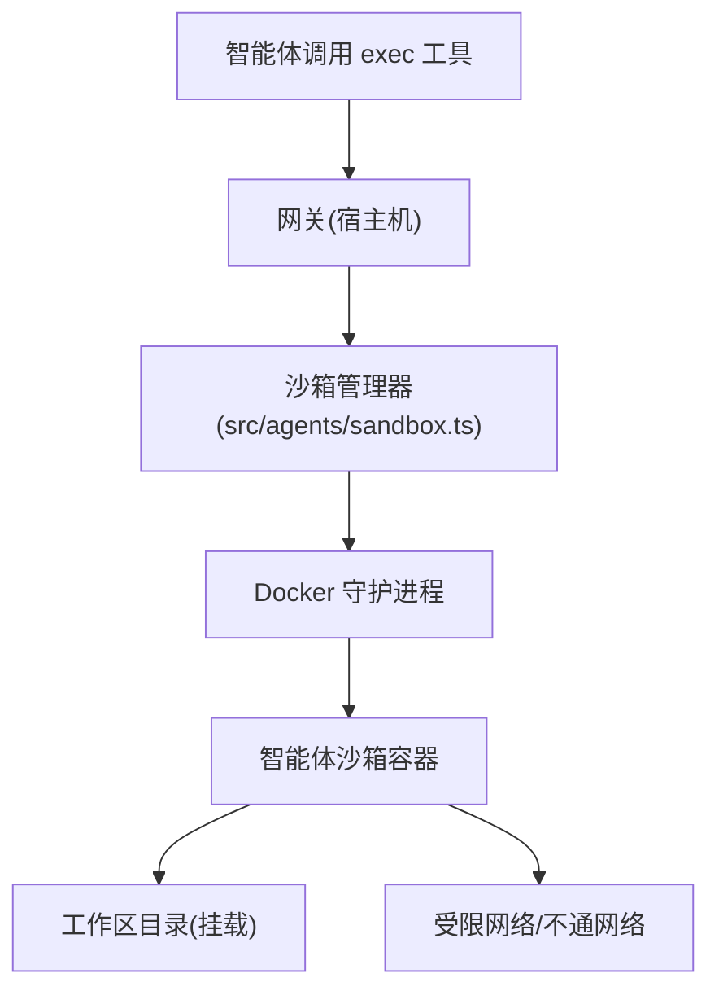

# 沙箱 (Sandboxing)

相关源文件

-   [docs/gateway/background-process.md](https://github.com/openclaw/openclaw/blob/8873e13f/docs/gateway/background-process.md)
-   [src/agents/bash-tools.ts](https://github.com/openclaw/openclaw/blob/8873e13f/src/agents/bash-tools.ts)
-   [src/agents/pi-embedded-runner/run/attempt.ts](https://github.com/openclaw/openclaw/blob/8873e13f/src/agents/pi-embedded-runner/run/attempt.ts)
-   [src/agents/pi-tools.ts](https://github.com/openclaw/openclaw/blob/8873e13f/src/agents/pi-tools.ts)
-   [src/agents/sandbox.ts](https://github.com/openclaw/openclaw/blob/8873e13f/src/agents/sandbox.ts)
-   [src/config/zod-schema.ts](https://github.com/openclaw/openclaw/blob/8873e13f/src/config/zod-schema.ts)

本页介绍了 OpenClaw 如何使用 Docker 将智能体执行环境与宿主机系统隔离。沙箱可以防止恶意或意外的智能体行为损害宿主机文件系统、访问不安全的网络资源或泄露敏感的系统信息。

有关智能体执行管道的更多信息，请参见 [3.1](/openclaw/openclaw/3.1-agent-execution-pipeline)。有关工具配置及其策略限制，请参见 [3.4](/openclaw/openclaw/3.4-tools-system)。

---

## 概览 (Overview)

OpenClaw 的沙箱系统基于 **Docker**。启用后，智能体发出的每一个 `exec` 命令都会在一个临时容器中运行。工作区文件会被挂载到容器内，允许智能体与其项目进行交互，同时保持与宿主机操作系统其他部分的隔离。

**核心特性**：

-   **临时性**：容器仅在命令执行期间存在（除非配置为常驻）。
-   **受限网络**：默认情况下禁用网络访问，或仅限于配置的白名单。
-   **文件系统隔离**：仅挂载智能体的工作区目录。
-   **资源限制**：可配置 CPU 和内存上限。

---

## 沙箱架构 (Sandbox Architecture)

**来源**：[src/agents/sandbox.ts](https://github.com/openclaw/openclaw/blob/8873e13f/src/agents/sandbox.ts) [src/agents/pi-tools.ts400-450](https://github.com/openclaw/openclaw/blob/8873e13f/src/agents/pi-tools.ts#L400-L450)

---

## 配置 (Configuration)

沙箱行为在 `openclaw.json` 的 `agents.defaults.sandbox` 下进行全局配置，或者在各智能体的 `agents.list[].sandbox` 中进行覆盖。

### 关键配置字段

| 字段 | 描述 |
| --- | --- |
| `mode` | `off` (禁用)、`non-main` (仅对非主智能体启用)、`all` (所有智能体)。 |
| `image` | 使用的 Docker 镜像 (默认: `node:22-bullseye` 或类似的开发镜像)。 |
| `workspaceAccess` | `rw` (读写)、`ro` (只读)。 |
| `network` | `none` (禁用网络)、`bridge` (启用网络)、或自定义 Docker 网络名称。 |
| `cpu` | 分配的 CPU 核心数上限。 |
| `memory` | 分配的 RAM 上限 (例如 `512m`)。 |

**来源**：[src/config/zod-schema.ts200-300](https://github.com/openclaw/openclaw/blob/8873e13f/src/config/zod-schema.ts#L200-L300)

---

## 工具在沙箱中的行为 (Tool Behavior in Sandbox)

当沙箱处于活动状态时，智能体工具会自动适配隔离环境。

### `exec` 与 `process`

-   命令不再直接在宿主机上运行，而是通过 `docker exec` 发送到容器中。
-   环境变量会被清理，仅保留配置允许的变量。
-   工作目录会被映射到容器内的挂载路径。

### 文件系统工具 (`read`, `write`, `edit`)

-   这些工具通常直接对挂载到容器的工作区目录进行操作。
-   **路径护栏**：强制要求路径必须位于工作区根目录内，防止智能体通过 `../../` 尝试逃逸容器挂载点。

**来源**：[src/agents/pi-tools.ts331-373](https://github.com/openclaw/openclaw/blob/8873e13f/src/agents/pi-tools.ts#L331-L373) [src/agents/pi-tools.read.ts](https://github.com/openclaw/openclaw/blob/8873e13f/src/agents/pi-tools.read.ts)

---

## 安全注意事项 (Security Considerations)

虽然沙箱提供了强有力的隔离，但应注意以下几点：

1.  **Docker 逃逸**：虽然 Docker 相对安全，但仍存在已知的内核漏洞风险。保持宿主机内核和 Docker 版本更新至关重要。
2.  **挂载安全**：绝不要将宿主机的敏感目录（如 `/etc`, `~/.ssh`, `~/.openclaw`）挂载到沙箱中。
3.  **网络侧信道**：即使网络被禁用，恶意代码也可能尝试通过 CPU 时间攻击或其他物理侧信道泄露数据。

**来源**：[README.md240-252](https://github.com/openclaw/openclaw/blob/8873e13f/README.md#L240-L252)
