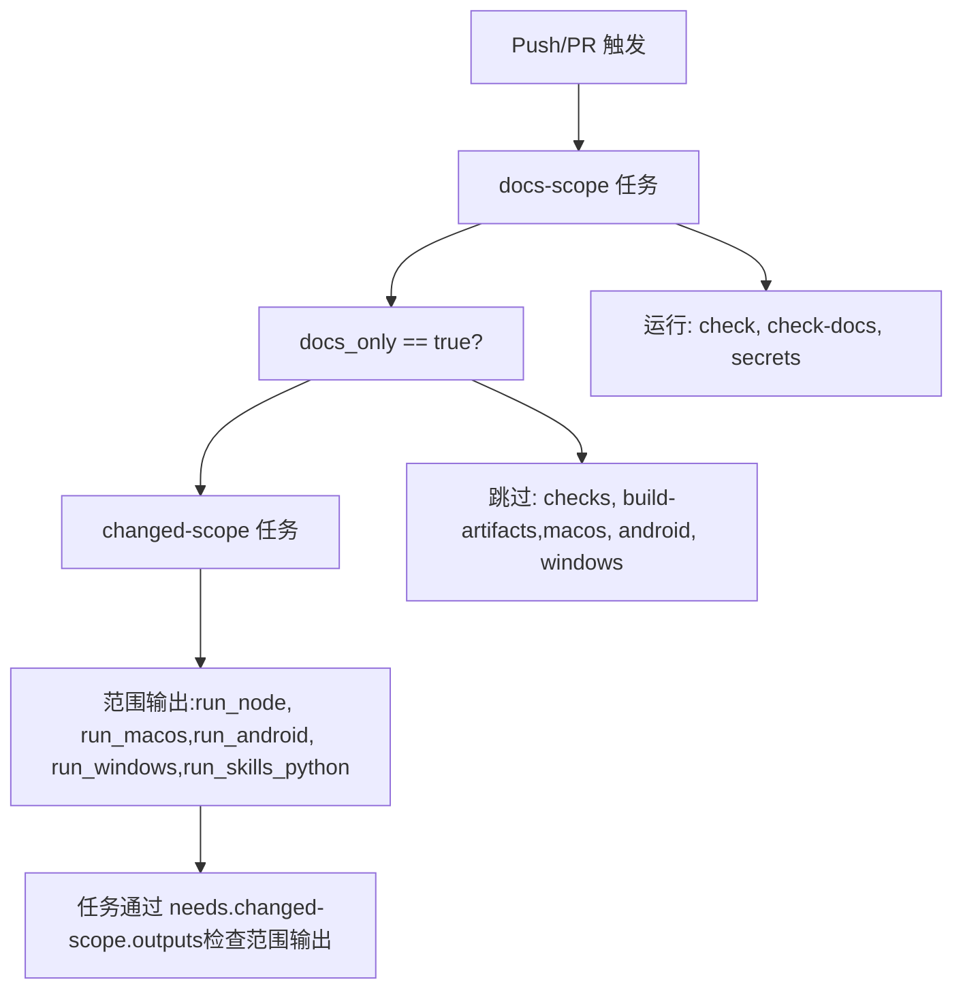
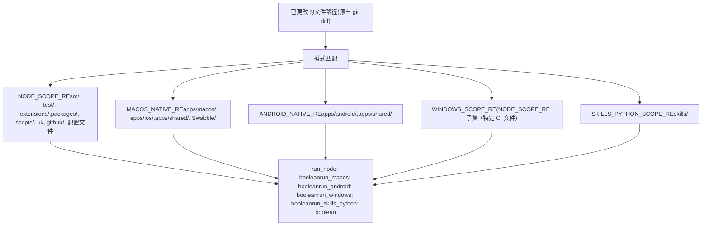
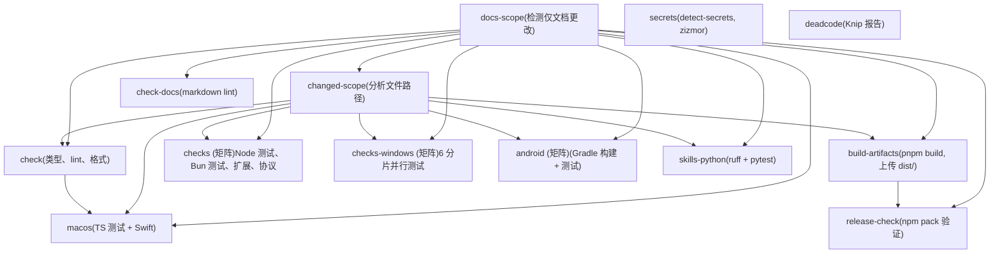
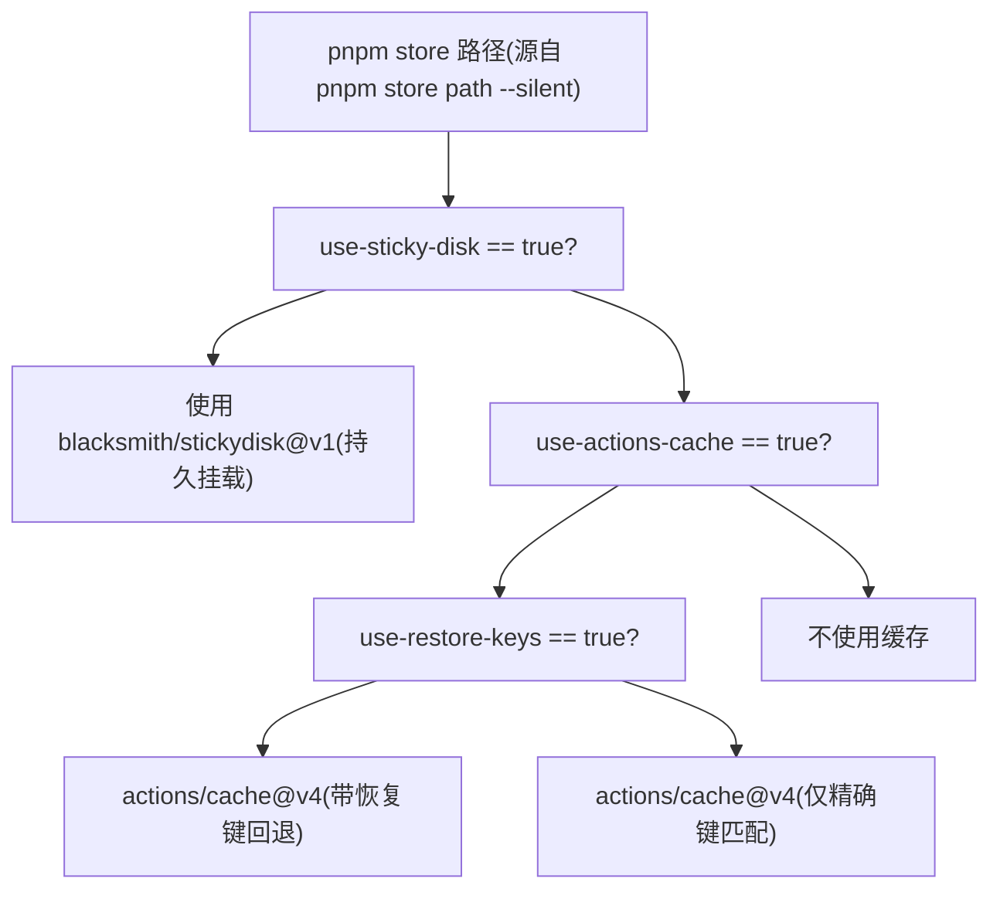

# CI/CD 管道 (CI/CD Pipeline)

相关源文件

-   [.github/actionlint.yaml](https://github.com/openclaw/openclaw/blob/8873e13f/.github/actionlint.yaml)
-   [.github/actions/setup-node-env/action.yml](https://github.com/openclaw/openclaw/blob/8873e13f/.github/actions/setup-node-env/action.yml)
-   [.github/actions/setup-pnpm-store-cache/action.yml](https://github.com/openclaw/openclaw/blob/8873e13f/.github/actions/setup-pnpm-store-cache/action.yml)
-   [.github/workflows/ci.yml](https://github.com/openclaw/openclaw/blob/8873e13f/.github/workflows/ci.yml)
-   [.shellcheckrc](https://github.com/openclaw/openclaw/blob/8873e13f/.shellcheckrc)
-   [docs/channels/irc.md](https://github.com/openclaw/openclaw/blob/8873e13f/docs/channels/irc.md)
-   [docs/ci.md](https://github.com/openclaw/openclaw/blob/8873e13f/docs/ci.md)
-   [docs/tools/creating-skills.md](https://github.com/openclaw/openclaw/blob/8873e13f/docs/tools/creating-skills.md)
-   [scripts/check-composite-action-input-interpolation.py](https://github.com/openclaw/openclaw/blob/8873e13f/scripts/check-composite-action-input-interpolation.py)
-   [scripts/ci-changed-scope.mjs](https://github.com/openclaw/openclaw/blob/8873e13f/scripts/ci-changed-scope.mjs)
-   [src/infra/outbound/abort.ts](https://github.com/openclaw/openclaw/blob/8873e13f/src/infra/outbound/abort.ts)
-   [src/plugins/source-display.test.ts](https://github.com/openclaw/openclaw/blob/8873e13f/src/plugins/source-display.test.ts)
-   [src/plugins/source-display.ts](https://github.com/openclaw/openclaw/blob/8873e13f/src/plugins/source-display.ts)
-   [src/scripts/ci-changed-scope.test.ts](https://github.com/openclaw/openclaw/blob/8873e13f/src/scripts/ci-changed-scope.test.ts)

## 目的与范围 (Purpose and Scope)

本文档描述了 OpenClaw 的持续集成与部署 (CI/CD) 基础设施，包括 GitHub Actions 工作流编排、优化任务执行的智能范围检测 (scope detection)、平台特定的测试策略以及缓存机制。有关发布流程本身（版本控制、变更日志、分发）的信息，请参见 [发布流程 (Release Process)](/openclaw/openclaw/8.2-release-process)。

**来源：** [.github/workflows/ci.yml1-776](https://github.com/openclaw/openclaw/blob/8873e13f/.github/workflows/ci.yml#L1-L776) [docs/ci.md1-57](https://github.com/openclaw/openclaw/blob/8873e13f/docs/ci.md#L1-L57)

## 概览 (Overview)

OpenClaw 的 CI 管道在每次向 `main` 分支推送代码以及每次提交拉取请求 (PR) 时执行。该工作流采用两阶段范围检测系统，当仅更改文档或平台特定代码时，会跳过高耗时任务。这种优化减少了大多数 PR 的 CI 时间，同时保持了 `main` 分支推送的完整覆盖。

管道定义在 `.github/workflows/ci.yml` 中，包含：

-   早期范围检测门限 (`docs-scope`, `changed-scope`)
-   静态分析任务 (`check`, `check-docs`, `deadcode`, `secrets`)
-   平台特定的测试套件 (`checks`, `checks-windows`, `macos`, `android`)
-   构建与发布验证 (`build-artifacts`, `release-check`)
-   Python 技能验证 (`skills-python`)

**来源：** [.github/workflows/ci.yml1-12](https://github.com/openclaw/openclaw/blob/8873e13f/.github/workflows/ci.yml#L1-L12) [.github/workflows/ci.yml139-776](https://github.com/openclaw/openclaw/blob/8873e13f/.github/workflows/ci.yml#L139-L776)

## 范围检测系统 (Scope Detection System)

### 两阶段检测

CI 使用两阶段检测系统来确定应运行哪些任务：


**阶段 1: docs-scope**

`docs-scope` 任务 ([.github/workflows/ci.yml15-36](https://github.com/openclaw/openclaw/blob/8873e13f/.github/workflows/ci.yml#L15-L36)) 首先运行，通过 `detect-docs-changes` 操作检测是否所有更改均为仅文档。它输出 `docs_only` 和 `docs_changed` 标志供后续任务引用。

**阶段 2: changed-scope**

如果不是仅文档更改，`changed-scope` 任务 ([.github/workflows/ci.yml41-77](https://github.com/openclaw/openclaw/blob/8873e13f/.github/workflows/ci.yml#L41-L77)) 会分析 git diff 以确定应运行哪些平台特定的任务。它调用 `scripts/ci-changed-scope.mjs` 并传入基准 (base) 和头部 (head) 提交。

**来源：** [.github/workflows/ci.yml15-77](https://github.com/openclaw/openclaw/blob/8873e13f/.github/workflows/ci.yml#L15-L77) [scripts/ci-changed-scope.mjs1-167](https://github.com/openclaw/openclaw/blob/8873e13f/scripts/ci-changed-scope.mjs#L1-L167)

### 范围检测逻辑

`scripts/ci-changed-scope.mjs` 中的 `detectChangedScope` 函数根据正则表达式模式检查更改的文件路径，以设置布尔标志：


定义在 [scripts/ci-changed-scope.mjs6-17](https://github.com/openclaw/openclaw/blob/8873e13f/scripts/ci-changed-scope.mjs#L6-L17) 中的关键模式：

-   `DOCS_PATH_RE`：匹配 `docs/` 和 `*.md` 文件
-   `NODE_SCOPE_RE`：匹配 Node/TypeScript 源码、测试、扩展、配置文件
-   `WINDOWS_SCOPE_RE`：Node 范围的较小子集加上 CI 工作流文件
-   `MACOS_NATIVE_RE`：匹配 macOS/iOS Swift 代码
-   `ANDROID_NATIVE_RE`：匹配 Android Kotlin 代码和共享的 Swift 代码
-   `SKILLS_PYTHON_SCOPE_RE`：匹配 `skills/` 目录

该函数包含特殊逻辑 ([scripts/ci-changed-scope.mjs79-81](https://github.com/openclaw/openclaw/blob/8873e13f/scripts/ci-changed-scope.mjs#L79-L81))：

-   如果更改了非文档、非原生文件，则将 `runNode=true` 作为回退方案
-   排除生成的协议文件触发 macOS 构建 ([scripts/ci-changed-scope.mjs58-60](https://github.com/openclaw/openclaw/blob/8873e13f/scripts/ci-changed-scope.mjs#L58-L60))

**故障保护行为**：如果未检测到更改路径或发生错误，所有范围标志默认设为 `true` ([scripts/ci-changed-scope.mjs24-31](https://github.com/openclaw/openclaw/blob/8873e13f/scripts/ci-changed-scope.mjs#L24-L31) [scripts/ci-changed-scope.mjs158-165](https://github.com/openclaw/openclaw/blob/8873e13f/scripts/ci-changed-scope.mjs#L158-L165))。

**来源：** [scripts/ci-changed-scope.mjs19-167](https://github.com/openclaw/openclaw/blob/8873e13f/scripts/ci-changed-scope.mjs#L19-L167) [src/scripts/ci-changed-scope.test.ts1-143](https://github.com/openclaw/openclaw/blob/8873e13f/src/scripts/ci-changed-scope.test.ts#L1-L143)

### 范围输出消费

任务使用范围输出声明依赖关系和条件：

```
needs: [docs-scope, changed-scope]if: needs.docs-scope.outputs.docs_only != 'true' &&     (github.event_name == 'push' || needs.changed-scope.outputs.run_node == 'true')
```
这种模式出现在 `checks`、`check`、`build-artifacts` 及其他任务中。向 `main` 分支推送的事件会绕过 PR 优化，以确保完全覆盖 ([.github/workflows/ci.yml82](https://github.com/openclaw/openclaw/blob/8873e13f/.github/workflows/ci.yml#L82-L82) [.github/workflows/ci.yml141](https://github.com/openclaw/openclaw/blob/8873e13f/.github/workflows/ci.yml#L141-L141))。

**来源：** [.github/workflows/ci.yml80-82](https://github.com/openclaw/openclaw/blob/8873e13f/.github/workflows/ci.yml#L80-L82) [.github/workflows/ci.yml139-141](https://github.com/openclaw/openclaw/blob/8873e13f/.github/workflows/ci.yml#L139-L141)

## 任务编排与依赖关系

### 任务依赖图


管道强制执行一种故障快速转移顺序：低成本检查在昂贵的平台测试运行前完成。`check` 任务必须通过后，`macos` 任务才会启动 ([.github/workflows/ci.yml498](https://github.com/openclaw/openclaw/blob/8873e13f/.github/workflows/ci.yml#L498-L498))。

**并发控制**：工作流使用并发组，在推送新提交时取消正在进行的 PR 运行 ([.github/workflows/ci.yml8-10](https://github.com/openclaw/openclaw/blob/8873e13f/.github/workflows/ci.yml#L8-L10))：

```
concurrency:  group: ci-${{ github.workflow }}-${{ github.event.pull_request.number || github.ref }}  cancel-in-progress: ${{ github.event_name == 'pull_request' }}
```
**来源：** [.github/workflows/ci.yml8-10](https://github.com/openclaw/openclaw/blob/8873e13f/.github/workflows/ci.yml#L8-L10) [.github/workflows/ci.yml139-776](https://github.com/openclaw/openclaw/blob/8873e13f/.github/workflows/ci.yml#L139-L776) [docs/ci.md31-38](https://github.com/openclaw/openclaw/blob/8873e13f/docs/ci.md#L31-L38)

## 平台特定任务

### Node/Bun 检查

`checks` 任务 ([.github/workflows/ci.yml139-188](https://github.com/openclaw/openclaw/blob/8873e13f/.github/workflows/ci.yml#L139-L188)) 运行 Node 和 Bun 测试套件的矩阵：

| 运行时 | 任务 | 命令 |
| --- | --- | --- |
| node | test | `pnpm canvas:a2ui:bundle && pnpm test` |
| node | extensions | `pnpm test:extensions` |
| node | protocol | `pnpm protocol:check` |
| bun | test | `pnpm canvas:a2ui:bundle && bunx vitest run` |

Bun 路径在推送到 `main` 分支时会跳过 ([.github/workflows/ci.yml160-162](https://github.com/openclaw/openclaw/blob/8873e13f/.github/workflows/ci.yml#L160-L162))，以减少排队时间，同时仍保持 PR 上的 Bun 兼容性验证。

**测试 Worker 配置**：Node 测试通过环境变量配置并行 worker 限制和堆大小 ([.github/workflows/ci.yml177-183](https://github.com/openclaw/openclaw/blob/8873e13f/.github/workflows/ci.yml#L177-L183))：

```
OPENCLAW_TEST_WORKERS=2OPENCLAW_TEST_MAX_OLD_SPACE_SIZE_MB=6144
```
**来源：** [.github/workflows/ci.yml139-188](https://github.com/openclaw/openclaw/blob/8873e13f/.github/workflows/ci.yml#L139-L188)

### 带有分片的 Windows 测试

`checks-windows` 任务 ([.github/workflows/ci.yml372-492](https://github.com/openclaw/openclaw/blob/8873e13f/.github/workflows/ci.yml#L372-L492)) 在 `blacksmith-32vcpu-windows-2025` 上运行，采用激进的 6 路分片来管理庞大的测试套件：

```
strategy:  fail-fast: false  matrix:    include:      - runtime: node        task: test        shard_index: 1        shard_count: 6        command: pnpm test      # ... 重复 2-6 分片
```
每个分片独立运行，并由矩阵设置环境变量 ([.github/workflows/ci.yml480-484](https://github.com/openclaw/openclaw/blob/8873e13f/.github/workflows/ci.yml#L480-L484))：

```
OPENCLAW_TEST_SHARDS=${{ matrix.shard_count }}OPENCLAW_TEST_SHARD_INDEX=${{ matrix.shard_index }}
```
**Windows Defender 排除**：工作流尝试将工作区排除在 Windows Defender 扫描之外 ([.github/workflows/ci.yml425-442](https://github.com/openclaw/openclaw/blob/8873e13f/.github/workflows/ci.yml#L425-L442))，以提高 Vitest worker 的进程派生性能。这是尽力而为的操作，即使失败也会继续。

**缓存配置**：Windows 分片禁用了持久磁盘 (sticky disk) 和恢复键 (restore keys) ([.github/workflows/ci.yml457-459](https://github.com/openclaw/openclaw/blob/8873e13f/.github/workflows/ci.yml#L457-L459))，因为它们会导致重试并为每个分片增加约 50 秒时间，且无法提高 pnpm store 的重用率。

**来源：** [.github/workflows/ci.yml372-492](https://github.com/openclaw/openclaw/blob/8873e13f/.github/workflows/ci.yml#L372-L492)

### macOS 合并任务

`macos` 任务 ([.github/workflows/ci.yml493-569](https://github.com/openclaw/openclaw/blob/8873e13f/.github/workflows/ci.yml#L493-L569)) 在单台机器上顺序运行所有 macOS 验证，以避免耗尽 GitHub 的 5 台并发 macOS 任务限制：

**执行顺序：**

1.  TypeScript 测试 (`pnpm test`)
2.  Swift 代码风格检查 (`swiftlint`, `swiftformat`)
3.  Swift 发布版构建 (`swift build --configuration release`)
4.  带覆盖率的 Swift 测试 (`swift test --enable-code-coverage`)

该任务使用 Xcode 26.1 ([.github/workflows/ci.yml519-522](https://github.com/openclaw/openclaw/blob/8873e13f/.github/workflows/ci.yml#L519-L522))，并包含 Swift 构建/测试命令的重试逻辑 ([.github/workflows/ci.yml546-568](https://github.com/openclaw/openclaw/blob/8873e13f/.github/workflows/ci.yml#L546-L568))，以处理 SwiftPM 依赖解析中的瞬时网络故障。

**SwiftPM 缓存**：任务缓存 `~/Library/Caches/org.swift.swiftpm`，以 `Package.resolved` 为键 ([.github/workflows/ci.yml538-544](https://github.com/openclaw/openclaw/blob/8873e13f/.github/workflows/ci.yml#L538-L544))。

**来源：** [.github/workflows/ci.yml493-569](https://github.com/openclaw/openclaw/blob/8873e13f/.github/workflows/ci.yml#L493-L569)

### Android 任务

`android` 任务 ([.github/workflows/ci.yml730-776](https://github.com/openclaw/openclaw/blob/8873e13f/.github/workflows/ci.yml#L730-L776)) 运行 Gradle 任务矩阵：

| 任务 | 命令 |
| --- | --- |
| 测试 | `./gradlew --no-daemon :app:testDebugUnitTest` |
| 构建 | `./gradlew --no-daemon :app:assembleDebug` |

任务设置 Java 17（JDK 21 会导致 CI 中的 sdkmanager 崩溃，[.github/workflows/ci.yml752-753](https://github.com/openclaw/openclaw/blob/8873e13f/.github/workflows/ci.yml#L752-L753))、Android SDK 包以及 Gradle 8.11.1。

**来源：** [.github/workflows/ci.yml730-776](https://github.com/openclaw/openclaw/blob/8873e13f/.github/workflows/ci.yml#L730-L776)

### Python 技能

`skills-python` 任务 ([.github/workflows/ci.yml264-288](https://github.com/openclaw/openclaw/blob/8873e13f/.github/workflows/ci.yml#L264-L288)) 验证 Python 技能脚本：

```
python -m ruff check skillspython -m pytest -q skills
```
该任务在 `run_skills_python` 范围激活或推送到 `main` 分支时运行 ([.github/workflows/ci.yml265-266](https://github.com/openclaw/openclaw/blob/8873e13f/.github/workflows/ci.yml#L265-L266))。

**来源：** [.github/workflows/ci.yml264-288](https://github.com/openclaw/openclaw/blob/8873e13f/.github/workflows/ci.yml#L264-L288)

## 构建产物与缓存

### Build Artifacts 任务

`build-artifacts` 任务 ([.github/workflows/ci.yml80-111](https://github.com/openclaw/openclaw/blob/8873e13f/.github/workflows/ci.yml#L80-L111)) 每个工作流运行一次，并与下游任务共享构建好的 `dist/` 目录：

```
pnpm build
```
任务将 `dist/` 目录作为名为 `dist-build` 的产物上传，保留期为 1 天 ([.github/workflows/ci.yml106-111](https://github.com/openclaw/openclaw/blob/8873e13f/.github/workflows/ci.yml#L106-L111))。`release-check` 任务会下载此产物以验证 npm pack 的内容 ([.github/workflows/ci.yml130-137](https://github.com/openclaw/openclaw/blob/8873e13f/.github/workflows/ci.yml#L130-L137))。

**来源：** [.github/workflows/ci.yml80-111](https://github.com/openclaw/openclaw/blob/8873e13f/.github/workflows/ci.yml#L80-L111) [.github/workflows/ci.yml114-137](https://github.com/openclaw/openclaw/blob/8873e13f/.github/workflows/ci.yml#L114-L137)

### pnpm Store 缓存

大多数任务使用 `setup-node-env` 复合操作 ([.github/actions/setup-node-env/action.yml1-110](https://github.com/openclaw/openclaw/blob/8873e13f/.github/actions/setup-node-env/action.yml#L1-L110))，该操作委派给 `setup-pnpm-store-cache` ([.github/actions/setup-pnpm-store-cache/action.yml1-75](https://github.com/openclaw/openclaw/blob/8873e13f/.github/actions/setup-pnpm-store-cache/action.yml#L1-L75)) 进行存储管理。

**缓存策略：**


**持久磁盘 (Sticky disks)** ([.github/actions/setup-pnpm-store-cache/action.yml53-58](https://github.com/openclaw/openclaw/blob/8873e13f/.github/actions/setup-pnpm-store-cache/action.yml#L53-L58))：Blacksmith runner 支持按代码仓库和操作系统挂载持久磁盘。这比 `actions/cache` 的缓存命中速度更快，但目前针对 Windows 分片已禁用 ([.github/workflows/ci.yml457](https://github.com/openclaw/openclaw/blob/8873e13f/.github/workflows/ci.yml#L457-L457))。

**缓存键** ([.github/actions/setup-pnpm-store-cache/action.yml65](https://github.com/openclaw/openclaw/blob/8873e13f/.github/actions/setup-pnpm-store-cache/action.yml#L65-L65) [.github/actions/setup-pnpm-store-cache/action.yml72](https://github.com/openclaw/openclaw/blob/8873e13f/.github/actions/setup-pnpm-store-cache/action.yml#L72-L72))：

```
${{ runner.os }}-pnpm-store-${{ inputs.cache-key-suffix }}-${{ hashFiles('pnpm-lock.yaml') }}
```
`cache-key-suffix` 输入（默认 `"node22"`) 允许在 Node 版本更改时使缓存失效。

**来源：** [.github/actions/setup-node-env/action.yml1-110](https://github.com/openclaw/openclaw/blob/8873e13f/.github/actions/setup-node-env/action.yml#L1-L110) [.github/actions/setup-pnpm-store-cache/action.yml1-75](https://github.com/openclaw/openclaw/blob/8873e13f/.github/actions/setup-pnpm-store-cache/action.yml#L1-L75)

### 子模块初始化

`setup-node-env` 操作包含针对子模块检出的重试逻辑 ([.github/actions/setup-node-env/action.yml33-45](https://github.com/openclaw/openclaw/blob/8873e13f/.github/actions/setup-node-env/action.yml#L33-L45))：

```
for attempt in 1 2 3 4 5; do  if git -c protocol.version=2 submodule update --init --force --depth=1 --recursive; then    exit 0  fi  echo "子模块更新失败 (尝试 $attempt/5)。正在重试…"  sleep $((attempt * 10))done
```
这处理了获取子模块时的瞬时网络故障。

**来源：** [.github/actions/setup-node-env/action.yml33-45](https://github.com/openclaw/openclaw/blob/8873e13f/.github/actions/setup-node-env/action.yml#L33-L45)

## 安全检查

### 机密扫描 (Secrets Job)

`secrets` 任务 ([.github/workflows/ci.yml290-371](https://github.com/openclaw/openclaw/blob/8873e13f/.github/workflows/ci.yml#L290-L371)) 独立于范围检测运行，以确保安全扫描始终执行：

**执行的 Pre-commit 钩子：**

1.  `detect-secrets`：扫描泄露的 API 密钥、令牌和凭据
2.  `detect-private-key`：检测提交的 SSH/PGP 私钥
3.  `zizmor`：审计 GitHub Actions 工作流的安全问题
4.  `pnpm-audit-prod`：检查生产环境依赖的漏洞

**扫描优化**：在 PR 中，`detect-secrets` 仅运行于更改的文件 ([.github/workflows/ci.yml330-346](https://github.com/openclaw/openclaw/blob/8873e13f/.github/workflows/ci.yml#L330-L346))。在向 `main` 分支推送时，目前会跳过此步骤，待白名单清理后再启用 ([.github/workflows/ci.yml319-322](https://github.com/openclaw/openclaw/blob/8873e13f/.github/workflows/ci.yml#L319-L322))。

**Zizmor 工作流审计**：仅在 `.github/workflows/*.yml` 文件更改时运行 ([.github/workflows/ci.yml351-367](https://github.com/openclaw/openclaw/blob/8873e13f/.github/workflows/ci.yml#L351-L367))：

```
mapfile -t workflow_files < <(git diff --name-only "$BASE" HEAD -- '.github/workflows/*.yml' '.github/workflows/*.yaml')if [ "${#workflow_files[@]}" -eq 0 ]; then  echo "未检测到工作流更改；跳过 zizmor。"  exit 0fipre-commit run zizmor --files "${workflow_files[@]}"
```
**来源：** [.github/workflows/ci.yml290-371](https://github.com/openclaw/openclaw/blob/8873e13f/.github/workflows/ci.yml#L290-L371)

### 输入插值策略 (Input Interpolation Policy)

Python 脚本强制执行一项安全策略：禁止在复合操作的 `run` 块中直接进行输入插值 ([scripts/check-composite-action-input-interpolation.py1-82](https://github.com/openclaw/openclaw/blob/8873e13f/scripts/check-composite-action-input-interpolation.py#L1-L82))：

```
INPUT_INTERPOLATION_RE = re.compile(r"\$\{\{\s*inputs\.")
```
这防止了注入漏洞，即不可信输入可能在 shell 脚本中被展开。该策略要求使用 `env:` 声明并引用 shell 变量。

**来源：** [scripts/check-composite-action-input-interpolation.py1-82](https://github.com/openclaw/openclaw/blob/8873e13f/scripts/check-composite-action-input-interpolation.py#L1-L82)

## 静态分析任务

### Check 任务

`check` 任务 ([.github/workflows/ci.yml190-215](https://github.com/openclaw/openclaw/blob/8873e13f/.github/workflows/ci.yml#L190-L215)) 在 Node 代码上运行静态分析：

```
pnpm check               # TypeScript 类型、ESLint、oxfmtpnpm build:strict-smoke  # 严格的 TypeScript 编译pnpm lint:ui:no-raw-window-open  # 强制执行安全的 URL 打开策略
```
`pnpm check` 命令内部运行类型检查、lint 以及格式验证 ([.github/workflows/ci.yml208](https://github.com/openclaw/openclaw/blob/8873e13f/.github/workflows/ci.yml#L208-L208))。

**来源：** [.github/workflows/ci.yml190-215](https://github.com/openclaw/openclaw/blob/8873e13f/.github/workflows/ci.yml#L190-L215)

### 死代码报告 (Dead Code Report)

`deadcode` 任务 ([.github/workflows/ci.yml217-243](https://github.com/openclaw/openclaw/blob/8873e13f/.github/workflows/ci.yml#L217-L243)) 运行 Knip 来检测未使用的导出、依赖和配置：

```
pnpm deadcode:report:ci:knip
```
目前这仅作为报告使用 ([.github/workflows/ci.yml219](https://github.com/openclaw/openclaw/blob/8873e13f/.github/workflows/ci.yml#L219-L219))，并将结果存储为产物供手动分诊 ([.github/workflows/ci.yml238-242](https://github.com/openclaw/openclaw/blob/8873e13f/.github/workflows/ci.yml#L238-L242))，而不会导致构建失败。

**来源：** [.github/workflows/ci.yml217-243](https://github.com/openclaw/openclaw/blob/8873e13f/.github/workflows/ci.yml#L217-L243)

### 文档验证

当文档文件更改时，`check-docs` 任务 ([.github/workflows/ci.yml245-262](https://github.com/openclaw/openclaw/blob/8873e13f/.github/workflows/ci.yml#L245-L262)) 验证：

```
pnpm check:docs  # Markdown 格式、lint、损坏链接检测
```
该任务的触发条件是 `docs_changed == 'true'` ([.github/workflows/ci.yml247](https://github.com/openclaw/openclaw/blob/8873e13f/.github/workflows/ci.yml#L247-L247))，而非更广泛的 `docs_only` 标志。

**来源：** [.github/workflows/ci.yml245-262](https://github.com/openclaw/openclaw/blob/8873e13f/.github/workflows/ci.yml#L245-L262)

## 运行器基础设施 (Runner Infrastructure)

### 运行器类型

| 运行器 | CPU | 任务 | 备注 |
| --- | --- | --- | --- |
| `blacksmith-16vcpu-ubuntu-2404` | 16 vCPU | 范围检测、checks、构建产物、android、python | Blacksmith 优化的 Linux |
| `blacksmith-32vcpu-windows-2025` | 32 vCPU | checks-windows (6 分片) | 用于并行测试的高并发性 |
| `macos-latest` | 变化 | macos, ios (已禁用) | GitHub 托管的 macOS 运行器 |

相比标准的 GitHub 运行器，**Blacksmith 运行器**提供更快的网络、磁盘 I/O 和更好的缓存性能。配置在 `.github/actionlint.yaml` ([.github/actionlint.yaml4-12](https://github.com/openclaw/openclaw/blob/8873e13f/.github/actionlint.yaml#L4-L12)) 中声明以进行 actionlint 验证。

**来源：** [.github/workflows/ci.yml16](https://github.com/openclaw/openclaw/blob/8873e13f/.github/workflows/ci.yml#L16-L16) [.github/workflows/ci.yml375](https://github.com/openclaw/openclaw/blob/8873e13f/.github/workflows/ci.yml#L375-L375) [.github/workflows/ci.yml500](https://github.com/openclaw/openclaw/blob/8873e13f/.github/workflows/ci.yml#L500-L500) [.github/actionlint.yaml1-24](https://github.com/openclaw/openclaw/blob/8873e13f/.github/actionlint.yaml#L1-L24) [docs/ci.md42-47](https://github.com/openclaw/openclaw/blob/8873e13f/docs/ci.md#L42-L47)

### 资源限制

**Node 堆大小**：各任务设置 `NODE_OPTIONS` 以增加 V8 堆限制 ([.github/workflows/ci.yml378](https://github.com/openclaw/openclaw/blob/8873e13f/.github/workflows/ci.yml#L378-L378) [.github/workflows/ci.yml515](https://github.com/openclaw/openclaw/blob/8873e13f/.github/workflows/ci.yml#L515-L515))：

```
NODE_OPTIONS=--max-old-space-size=6144  # WindowsNODE_OPTIONS=--max-old-space-size=4096  # macOS
```
**测试 Worker**：`OPENCLAW_TEST_WORKERS` 环境变量控制并行 worker 数量 ([.github/workflows/ci.yml182](https://github.com/openclaw/openclaw/blob/8873e13f/.github/workflows/ci.yml#L182-L182) [.github/workflows/ci.yml381](https://github.com/openclaw/openclaw/blob/8873e13f/.github/workflows/ci.yml#L381-L381))：

```
OPENCLAW_TEST_WORKERS=2  # LinuxOPENCLAW_TEST_WORKERS=1  # Windows (每个分片，因观察到不稳定性)
```
**来源：** [.github/workflows/ci.yml177-183](https://github.com/openclaw/openclaw/blob/8873e13f/.github/workflows/ci.yml#L177-L183) [.github/workflows/ci.yml377-381](https://github.com/openclaw/openclaw/blob/8873e13f/.github/workflows/ci.yml#L377-L381) [.github/workflows/ci.yml514-516](https://github.com/openclaw/openclaw/blob/8873e13f/.github/workflows/ci.yml#L514-L516)

## 本地开发等效命令

开发人员可以在本地运行 CI 检查，无需使用 GitHub Actions：

| CI 任务 | 本地命令 |
| --- | --- |
| `check` | `pnpm check` |
| `checks` (node 测试) | `pnpm test` |
| `checks` (协议) | `pnpm protocol:check` |
| `checks` (扩展) | `pnpm test:extensions` |
| `check-docs` | `pnpm check:docs` |
| `release-check` | `pnpm release:check` |
| `skills-python` | `python -m ruff check skills && python -m pytest -q skills` |
| `deadcode` | `pnpm deadcode:report:ci:knip` |

**范围检测测试**：范围检测逻辑在 `src/scripts/ci-changed-scope.test.ts` ([src/scripts/ci-changed-scope.test.ts1-143](https://github.com/openclaw/openclaw/blob/8873e13f/src/scripts/ci-changed-scope.test.ts#L1-L143)) 中有单元测试，可以使用 `pnpm test` 在本地运行。

**来源：** [docs/ci.md49-56](https://github.com/openclaw/openclaw/blob/8873e13f/docs/ci.md#L49-L56) [src/scripts/ci-changed-scope.test.ts1-143](https://github.com/openclaw/openclaw/blob/8873e13f/src/scripts/ci-changed-scope.test.ts#L1-L143)

## 优化策略

CI 管道采用了多种策略来最小化执行时间：

1.  **早期范围检测**：`docs-scope` 任务约 30 秒即可完成，并能为仅文档更改的 PR 跳过所有高负载任务。
2.  **并行范围分析**：`changed-scope` 任务独立运行，并生成多个布尔输出供各任务独立检查。
3.  **快速失败排序**：静态分析 (`check`) 必须通过后平台测试才会启动。
4.  **测试分片**：Windows 测试在 32 vCPU 的运行器上拆分为 6 个并行分片。
5.  **一次构建，多次共享**：`build-artifacts` 任务构建一次 `dist/`，下游任务直接下载。
6.  **选择性 Bun 测试**：Bun 测试在推送到 `main` 分支时跳过，以减少队列压力。
7.  **macOS 任务合并**：所有 macOS 验证在单台运行器上顺序执行，而非拆分为 4 个独立任务，以遵守 GitHub 的并发限制。

**来源：** [.github/workflows/ci.yml1-776](https://github.com/openclaw/openclaw/blob/8873e13f/.github/workflows/ci.yml#L1-L776) [docs/ci.md10-38](https://github.com/openclaw/openclaw/blob/8873e13f/docs/ci.md#L10-38)
