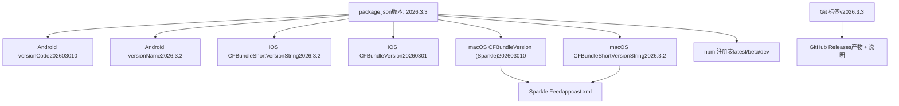
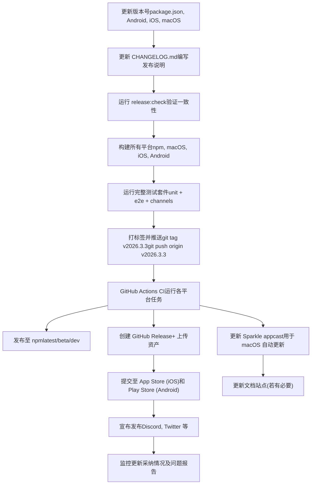

# 发布流程 (Release Process)

相关源文件

-   [CHANGELOG.md](https://github.com/openclaw/openclaw/blob/8873e13f/CHANGELOG.md)
-   [README.md](https://github.com/openclaw/openclaw/blob/8873e13f/README.md)
-   [apps/android/app/build.gradle.kts](https://github.com/openclaw/openclaw/blob/8873e13f/apps/android/app/build.gradle.kts)
-   [apps/ios/Sources/Info.plist](https://github.com/openclaw/openclaw/blob/8873e13f/apps/ios/Sources/Info.plist)
-   [apps/ios/Tests/Info.plist](https://github.com/openclaw/openclaw/blob/8873e13f/apps/ios/Tests/Info.plist)
-   [apps/ios/project.yml](https://github.com/openclaw/openclaw/blob/8873e13f/apps/ios/project.yml)
-   [apps/macos/Sources/OpenClaw/Resources/Info.plist](https://github.com/openclaw/openclaw/blob/8873e13f/apps/macos/Sources/OpenClaw/Resources/Info.plist)
-   [assets/avatar-placeholder.svg](https://github.com/openclaw/openclaw/blob/8873e13f/assets/avatar-placeholder.svg)
-   [docs/cli/index.md](https://github.com/openclaw/openclaw/blob/8873e13f/docs/cli/index.md)
-   [docs/gateway/configuration.md](https://github.com/openclaw/openclaw/blob/8873e13f/docs/gateway/configuration.md)
-   [docs/gateway/index.md](https://github.com/openclaw/openclaw/blob/8873e13f/docs/gateway/index.md)
-   [docs/gateway/troubleshooting.md](https://github.com/openclaw/openclaw/blob/8873e13f/docs/gateway/troubleshooting.md)
-   [docs/index.md](https://github.com/openclaw/openclaw/blob/8873e13f/docs/index.md)
-   [docs/platforms/mac/release.md](https://github.com/openclaw/openclaw/blob/8873e13f/docs/platforms/mac/release.md)
-   [docs/start/getting-started.md](https://github.com/openclaw/openclaw/blob/8873e13f/docs/start/getting-started.md)
-   [docs/start/wizard.md](https://github.com/openclaw/openclaw/blob/8873e13f/docs/start/wizard.md)
-   [extensions/bluebubbles/src/send-helpers.ts](https://github.com/openclaw/openclaw/blob/8873e13f/extensions/bluebubbles/src/send-helpers.ts)
-   [package.json](https://github.com/openclaw/openclaw/blob/8873e13f/package.json)
-   [pnpm-lock.yaml](https://github.com/openclaw/openclaw/blob/8873e13f/pnpm-lock.yaml)
-   [scripts/clawtributors-map.json](https://github.com/openclaw/openclaw/blob/8873e13f/scripts/clawtributors-map.json)
-   [scripts/update-clawtributors.ts](https://github.com/openclaw/openclaw/blob/8873e13f/scripts/update-clawtributors.ts)
-   [scripts/update-clawtributors.types.ts](https://github.com/openclaw/openclaw/blob/8873e13f/scripts/update-clawtributors.types.ts)
-   [src/agents/subagent-registry-cleanup.test.ts](https://github.com/openclaw/openclaw/blob/8873e13f/src/agents/subagent-registry-cleanup.test.ts)
-   [src/cli/program.ts](https://github.com/openclaw/openclaw/blob/8873e13f/src/cli/program.ts)
-   [src/config/config.ts](https://github.com/openclaw/openclaw/blob/8873e13f/src/config/config.ts)
-   [src/config/types.ts](https://github.com/openclaw/openclaw/blob/8873e13f/src/config/types.ts)
-   [src/config/zod-schema.ts](https://github.com/openclaw/openclaw/blob/8873e13f/src/config/zod-schema.ts)
-   [ui/package.json](https://github.com/openclaw/openclaw/blob/8873e13f/ui/package.json)

本文档描述了 OpenClaw 在 npm、GitHub 以及各平台特定渠道（macOS、iOS、Android）的版本控制策略、发布核对清单、变更日志维护以及分发流程。

有关 CI/CD 管道的详情，请参见 [CI/CD 管道 (CI/CD Pipeline)](/openclaw/openclaw/8.1-cicd-pipeline)。有关各平台的开发设置，请参见 [macOS 开发设置](https://github.com/openclaw/openclaw/blob/8873e13f/macOS Dev Setup)、[iOS](https://github.com/openclaw/openclaw/blob/8873e13f/iOS) 和 [Android](https://github.com/openclaw/openclaw/blob/8873e13f/Android)。

## 目的与范围 (Purpose and Scope)

本页涵盖：

-   版本命名方案及跨平台版本号协调
-   发布核对清单及预发布验证
-   变更日志格式及维护规范
-   分发至 npm、GitHub Releases 以及各平台应用商店
-   平台特定的发布流程（macOS 的 Sparkle 自动更新、移动端构建）
-   更新机制与通道（稳定版/测试版/开发版）

---

## 版本控制策略 (Versioning Strategy)

OpenClaw 使用**基于日期的版本方案**：`YYYY.M.D`（年.月.日）。

| 示例版本 | 含义 |
| --- | --- |
| `2026.3.3` | 2026 年 3 月 3 日（稳定发布版） |
| `2026.3.2` | 2026 年 3 月 2 日（前一个稳定版） |
| `2026.3.3-beta.1` | 3 月 3 日周期的 Beta 预发布版 |

**版本字段：**

-   **npm 包版本** ([package.json3](https://github.com/openclaw/openclaw/blob/8873e13f/package.json#L3-L3))：Node.js 分发的规范事实来源
-   **Android `versionCode`** ([apps/android/app/build.gradle.kts24](https://github.com/openclaw/openclaw/blob/8873e13f/apps/android/app/build.gradle.kts#L24-L24))：Google Play 的单调递增整数（例如 `202603010`）
-   **Android `versionName`** ([apps/android/app/build.gradle.kts25](https://github.com/openclaw/openclaw/blob/8873e13f/apps/android/app/build.gradle.kts#L25-L25))：可读的显示版本（例如 `"2026.3.2"`）
-   **iOS `CFBundleShortVersionString`** ([apps/ios/Sources/Info.plist22](https://github.com/openclaw/openclaw/blob/8873e13f/apps/ios/Sources/Info.plist#L22-L22))：营销版本（例如 `"2026.3.2"`）
-   **iOS `CFBundleVersion`** ([apps/ios/Sources/Info.plist35](https://github.com/openclaw/openclaw/blob/8873e13f/apps/ios/Sources/Info.plist#L35-L35))：构建版本号（例如 `"20260301"`）
-   **macOS `CFBundleShortVersionString`** ([apps/macos/Sources/OpenClaw/Resources/Info.plist18](https://github.com/openclaw/openclaw/blob/8873e13f/apps/macos/Sources/OpenClaw/Resources/Info.plist#L18-L18))：显示版本
-   **macOS `CFBundleVersion`** ([apps/macos/Sources/OpenClaw/Resources/Info.plist20](https://github.com/openclaw/openclaw/blob/8873e13f/apps/macos/Sources/OpenClaw/Resources/Info.plist#L20-L20))：Sparkle 版本号（单调递增的数字）

**分发渠道：**

-   `stable` (稳定版) —— 已打标签的发布版 (`vYYYY.M.D`)，npm dist-tag 为 `latest`
-   `beta` (测试版) —— 预发布标签 (`vYYYY.M.D-beta.N`)，npm dist-tag 为 `beta`
-   `dev` (开发版) —— `main` 分支的活动头部，npm dist-tag 为 `dev`

**来源**：[CHANGELOG.md5-31](https://github.com/openclaw/openclaw/blob/8873e13f/CHANGELOG.md#L5-L31) [package.json3](https://github.com/openclaw/openclaw/blob/8873e13f/package.json#L3-L3) [README.md85-90](https://github.com/openclaw/openclaw/blob/8873e13f/README.md#L85-L90)

---

## 跨平台版本协调


**关键不变性：**

-   **npm 版本**是所有平台版本的规范来源
-   **移动端构建号**必须是单调递增的整数，以便提交到应用商店
-   **macOS `APP_BUILD`** 必须是单调递增的数字，以便进行 Sparkle 版本比较 ([docs/platforms/mac/release.md29-31](https://github.com/openclaw/openclaw/blob/8873e13f/docs/platforms/mac/release.md#L29-L31))
-   Android `versionCode` 格式：`YYYYMMDDNN`（日期 + 车道后缀）
-   iOS `CFBundleVersion` 格式：`YYYYMMDD`（仅日期）

**来源**：[package.json3](https://github.com/openclaw/openclaw/blob/8873e13f/package.json#L3-L3) [apps/android/app/build.gradle.kts24-25](https://github.com/openclaw/openclaw/blob/8873e13f/apps/android/app/build.gradle.kts#L24-L25) [apps/ios/Sources/Info.plist22-35](https://github.com/openclaw/openclaw/blob/8873e13f/apps/ios/Sources/Info.plist#L22-L35) [apps/macos/Sources/OpenClaw/Resources/Info.plist18-20](https://github.com/openclaw/openclaw/blob/8873e13f/apps/macos/Sources/OpenClaw/Resources/Info.plist#L18-L20)

---

## 发布核对清单

### 预发布验证

**手动步骤：**

1.  **更新版本号**：使所有平台配置中的版本号保持一致

    -   [package.json3](https://github.com/openclaw/openclaw/blob/8873e13f/package.json#L3-L3)
    -   [apps/android/app/build.gradle.kts24-25](https://github.com/openclaw/openclaw/blob/8873e13f/apps/android/app/build.gradle.kts#L24-L25)
    -   [apps/ios/Sources/Info.plist22-35](https://github.com/openclaw/openclaw/blob/8873e13f/apps/ios/Sources/Info.plist#L22-L35)
    -   [apps/ios/project.yml101-102](https://github.com/openclaw/openclaw/blob/8873e13f/apps/ios/project.yml#L101-L102)
    -   [apps/macos/Sources/OpenClaw/Resources/Info.plist18-20](https://github.com/openclaw/openclaw/blob/8873e13f/apps/macos/Sources/OpenClaw/Resources/Info.plist#L18-L20)
2.  **更新 CHANGELOG.md**：编写发布说明

    -   在顶部添加新的 `## YYYY.M.D` 章节
    -   对更改进行分类：`### Changes`, `### Breaking`, `### Fixes`
    -   包含 PR 引用及贡献者致谢 ([CHANGELOG.md1-166](https://github.com/openclaw/openclaw/blob/8873e13f/CHANGELOG.md#L1-L166))
3.  **运行预发布检查：**

    ```
    npm run release:check
    ```

    该脚本 ([package.json294](https://github.com/openclaw/openclaw/blob/8873e13f/package.json#L294-L294)) 会验证版本一致性、变更日志是否存在以及 Git 状态。

4.  **验证跨平台构建：**

    ```bash
    pnpm build                    # Node/TS 构建
    pnpm ui:build                 # 控制 UI 构建
    pnpm android:assemble         # Android APK 生成
    pnpm ios:build               # iOS 构建
    # macOS: 见下方的平台特定章节
    ```

5.  **运行完整测试套件：**

    ```
    pnpm test                     # 单元测试
    pnpm test:e2e                # 端到端测试
    pnpm test:channels           # 通道集成测试
    ```

6.  **打标签并推送：**

    ```
    git tag v2026.3.3
    git push origin v2026.3.3
    ```


**自动化验证：**

-   CI 运行[范围检测](/openclaw/openclaw/8.1-cicd-pipeline)来决定执行哪些平台的任务
-   对所有推送进行类型检查、lint 以及格式检查
-   当相关文件更改时，运行各平台特定的测试

**来源**：[package.json294](https://github.com/openclaw/openclaw/blob/8873e13f/package.json#L294-L294) [CHANGELOG.md1-166](https://github.com/openclaw/openclaw/blob/8873e13f/CHANGELOG.md#L1-L166) [.github/workflows/ci.yml](https://github.com/openclaw/openclaw/blob/8873e13f/.github/workflows/ci.yml)

---

## 变更日志维护 (Changelog Maintenance)

变更日志采用**结构化格式**，包含三个主要类别：

| 章节 | 目的 |
| --- | --- |
| `### Changes` | 新特性、改进以及非破坏性更改 |
| `### Breaking` | 需要用户操作的破坏性更改（以加粗标出并提供迁移指导） |
| `### Fixes` | 包含症状、根因及修复方案的 Bug 修复 |

**变更日志条目格式：**

```
### Changes- 模块/领域: 包含上下文和用户影响的更改描述。(#PR) 感谢 @contributor。
```
**最佳实践：**

-   **以用户为中心的语言**：描述影响，而非实现细节
-   **包含上下文**：为什么需要此项更改，解决了什么问题
-   **引用 PR 和贡献者**：`(#12345) 感谢 @username`
-   **破坏性更改**：必须包含迁移路径或临时解决方案
-   **精确分类**：区分 Changes、Fixes 和 Breaking

**破坏性更改条目示例：**

```
### Breaking- **BREAKING:** 当同时配置了 `gateway.auth.token` 和 `gateway.auth.password` 时，  网关身份验证现在要求显式的 `gateway.auth.mode`。请在升级前将 `gateway.auth.mode`  设置为 `token` 或 `password` 以避免启动失败。(#35094) 感谢 @joshavant。
```
**来源**：[CHANGELOG.md1-166](https://github.com/openclaw/openclaw/blob/8873e13f/CHANGELOG.md#L1-L166)

---

## 分发渠道

### npm 注册表

OpenClaw 使用三个 dist-tags 发布到 npm：

| Dist-Tag | 目的 | 受众 |
| --- | --- | --- |
| `latest` | 稳定发布版 | 生产环境用户 |
| `beta` | 测试预发布版 | 早期采纳者、测试人员 |
| `dev` | 开发快照 | 贡献者、前沿用户 |

**发布命令：**

```bash
npm publish --tag latest      # 稳定版
npm publish --tag beta        # 测试版
npm publish --tag dev         # 开发快照
```
**程序包内容** ([package.json23-34](https://github.com/openclaw/openclaw/blob/8873e13f/package.json#L23-L34))：

-   `CHANGELOG.md`、`LICENSE`、`README.md`
-   `openclaw.mjs` (CLI 入口点)
-   `dist/` (编译后的 TypeScript)
-   `assets/`、`docs/`、`extensions/`、`skills/`

**预发布钩子** ([package.json289](https://github.com/openclaw/openclaw/blob/8873e13f/package.json#L289-L289))：

```
pnpm build && pnpm ui:build
```
确保在打包前 `dist/` 和控制 UI 资产是最新的。

**来源**：[package.json23-289](https://github.com/openclaw/openclaw/blob/8873e13f/package.json#L23-L289) [README.md85-90](https://github.com/openclaw/openclaw/blob/8873e13f/README.md#L85-L90)

---

### GitHub Releases

GitHub Releases 充当**变更日志归档**及**资产分发点**。

**发布工作流：**

1.  推送标签触发 CI
2.  CI 构建所有平台产物
3.  CI 创建 GitHub Release，包含：
    -   发布说明（从 CHANGELOG.md 提取）
    -   可下载资产：
        -   `openclaw-{version}.tgz` (npm tarball)
        -   `OpenClaw-{version}.dmg` (macOS)
        -   `openclaw-{version}-release.apk` (Android)
        -   `openclaw-{version}.ipa` (iOS, 若有构建)

**发布说明格式：**

```
## 2026.3.3### Changes- [来自 CHANGELOG.md 的列表]### Breaking- [来自 CHANGELOG.md 的列表]### Fixes- [来自 CHANGELOG.md 的列表]
```
**来源**：[CHANGELOG.md1-166](https://github.com/openclaw/openclaw/blob/8873e13f/CHANGELOG.md#L1-L166) [README.md16](https://github.com/openclaw/openclaw/blob/8873e13f/README.md#L16-L16)

---

## 平台特定的发布流程

### macOS: Sparkle 自动更新

macOS 发布版使用 **Sparkle** 进行应用内自动更新。

**Sparkle 版本约束：**

-   `APP_BUILD`（映射到 `sparkle:version` 和 `CFBundleVersion`）必须是**单调递增的数字**
-   `APP_VERSION`（映射到 `sparkle:shortVersionString` 和 `CFBundleShortVersionString`）是可读版本号
-   如果省略了 `APP_BUILD`，`scripts/package-mac-app.sh` 会根据 `APP_VERSION` 使用 `YYYYMMDDNN` 格式自动派生（稳定版默认为 `90`，预发布版使用派生自后缀的车道号）

**构建与打包命令：**

```bash
# 设置发布元数据BUNDLE_ID=ai.openclaw.mac \APP_VERSION=2026.3.2 \BUILD_CONFIG=release \SIGN_IDENTITY="Developer ID Application: <Name> (<TEAMID>)" \scripts/package-mac-app.sh# 创建已签名、已公证的分发产物BUNDLE_ID=ai.openclaw.mac \APP_VERSION=2026.3.2 \BUILD_CONFIG=release \SIGN_IDENTITY="Developer ID Application: <Name> (<TEAMID>)" \scripts/package-mac-dist.sh
```
**输出产物：**

-   `dist/OpenClaw.app` —— Developer ID 签名的应用包
-   `dist/OpenClaw-{version}.zip` —— Sparkle 签名的归档文件
-   `dist/OpenClaw-{version}.dmg` —— 已公证的磁盘镜像
-   `dist/openclaw-{version}.appcast.xml` —— Sparkle feed 条目

**Sparkle Feed 更新：**

```bash
# 生成/更新 appcast.xml~/.build/artifacts/sparkle/Sparkle/bin/generate_appcast \  --channel main \  dist/
```
**公证 (Notarization) 流程：**

1.  使用 Developer ID 构建并签名
2.  创建可分发的归档文件 (`.zip` 或 `.dmg`)
3.  提交至 Apple 公证服务：

    ```bash
    xcrun notarytool submit dist/OpenClaw-{version}.dmg \  --keychain-profile openclaw-notary \  --wait
    ```

4.  签署公证票据 (Staple)：

    ```bash
    xcrun stapler staple dist/OpenClaw-{version}.dmg
    ```


**前提条件：**

-   已安装 Developer ID Application 证书
-   Sparkle 私钥位于 `$SPARKLE_PRIVATE_KEY_FILE`
-   公证凭据已存储在钥匙串配置文件 `openclaw-notary` 中

**来源**：[docs/platforms/mac/release.md1-45](https://github.com/openclaw/openclaw/blob/8873e13f/docs/platforms/mac/release.md#L1-L45) [apps/macos/Sources/OpenClaw/Resources/Info.plist18-20](https://github.com/openclaw/openclaw/blob/8873e13f/apps/macos/Sources/OpenClaw/Resources/Info.plist#L18-L20)

---

### iOS 发布

**版本管理：**

-   `CFBundleShortVersionString` ([apps/ios/Sources/Info.plist22](https://github.com/openclaw/openclaw/blob/8873e13f/apps/ios/Sources/Info.plist#L22-L22))：营销版本（例如 `"2026.3.2"`）
-   `CFBundleVersion` ([apps/ios/Sources/Info.plist35](https://github.com/openclaw/openclaw/blob/8873e13f/apps/ios/Sources/Info.plist#L35-L35))：构建版本号（例如 `"20260301"`，单调递增）

**构建命令：**

```bash
# 根据 project.yml 生成 Xcode 项目pnpm ios:gen# 为模拟器构建IOS_DEST="platform=iOS Simulator,name=iPhone 17" pnpm ios:build# 为真机构建（需要签名）pnpm ios:build
```
**签名配置**：通过 `Signing.xcconfig` 和环境变量管理：

-   `OPENCLAW_CODE_SIGN_STYLE` (Automatic 或 Manual)
-   `OPENCLAW_DEVELOPMENT_TEAM` (团队 ID)
-   `OPENCLAW_APP_BUNDLE_ID` (Bundle 标识符)
-   `OPENCLAW_APP_PROFILE` (描述文件名称)

**发布步骤：**

1.  更新 [apps/ios/project.yml101-102](https://github.com/openclaw/openclaw/blob/8873e13f/apps/ios/project.yml#L101-L102) 和 [apps/ios/Sources/Info.plist22-35](https://github.com/openclaw/openclaw/blob/8873e13f/apps/ios/Sources/Info.plist#L22-L35) 中的版本号
2.  使用 release 配置运行 `pnpm ios:build`
3.  通过 Xcode 或 `xcodebuild archive` 进行归档
4.  通过 Xcode Organizer 或 `xcrun altool` 提交至 App Store Connect

**来源**：[apps/ios/project.yml1-119](https://github.com/openclaw/openclaw/blob/8873e13f/apps/ios/project.yml#L1-L119) [apps/ios/Sources/Info.plist1-91](https://github.com/openclaw/openclaw/blob/8873e13f/apps/ios/Sources/Info.plist#L1-L91) [package.json262-265](https://github.com/openclaw/openclaw/blob/8873e13f/package.json#L262-L265)

---

### Android 发布

**版本管理：**

-   `versionCode` ([apps/android/app/build.gradle.kts24](https://github.com/openclaw/openclaw/blob/8873e13f/apps/android/app/build.gradle.kts#L24-L24))：Play Store 的单调递增整数（例如 `202603010`）
-   `versionName` ([apps/android/app/build.gradle.kts25](https://github.com/openclaw/openclaw/blob/8873e13f/apps/android/app/build.gradle.kts#L25-L25))：显示版本（例如 `"2026.3.2"`）

**构建命令：**

```bash
# 调试版构建pnpm android:assemble# 正式版构建（需要签名密钥）cd apps/android./gradlew :app:assembleRelease
```
**输出文件名**：`androidComponents` 块 ([apps/android/app/build.gradle.kts82-94](https://github.com/openclaw/openclaw/blob/8873e13f/apps/android/app/build.gradle.kts#L82-L94)) 自定义了输出文件名：

```
openclaw-{versionName}-{buildType}.apk
```
示例：`openclaw-2026.3.2-release.apk`

**发布步骤：**

1.  更新 [apps/android/app/build.gradle.kts24-25](https://github.com/openclaw/openclaw/blob/8873e13f/apps/android/app/build.gradle.kts#L24-L25) 中的 `versionCode`（单调递增）和 `versionName`
2.  构建正式版 APK：`./gradlew :app:assembleRelease`
3.  使用正式版密钥库进行签名（在 `signing` 块中配置，未在提供的文件中显示）
4.  上传至 Google Play Console

**来源**：[apps/android/app/build.gradle.kts1-169](https://github.com/openclaw/openclaw/blob/8873e13f/apps/android/app/build.gradle.kts#L1-L169) [package.json218-224](https://github.com/openclaw/openclaw/blob/8873e13f/package.json#L218-L224)

---

## 自动化发布检查

`release:check` 脚本用于验证发布就绪状态：

```bash
npm run release:check
```
**验证步骤**（从脚本名称推断）：

1.  **版本格式**：确保所有版本字符串均符合预期的日期格式
2.  **版本一致性**：验证 npm 程序包版本与各平台版本匹配
3.  **变更日志是否存在**：要求当前版本在 CHANGELOG.md 中有对应的章节
4.  **Git 状态**：确保工作树整洁且位于 `main` 分支
5.  **构建状态**：验证 `dist/` 是否为最新（可选，可能需要手动 `pnpm build`）

**在 CI 中的使用**：`release:check` 脚本很可能作为标签推送工作流的一部分运行，以便在发布前拦截错误。

**来源**：[package.json294](https://github.com/openclaw/openclaw/blob/8873e13f/package.json#L294-L294)

---

## 更新机制

### 面向用户的更新命令

```bash
openclaw update [--channel stable|beta|dev]
```
**行为：**

-   检测当前的安装方法（npm、Git 源码或其他）
-   更新至指定渠道的最新版本
-   对于 npm 安装：`npm install -g openclaw@latest`（或 `@beta`, `@dev`）
-   对于 Git 安装：`git pull && pnpm install && pnpm build`

**自动更新配置** ([docs/gateway/configuration.md269-283](https://github.com/openclaw/openclaw/blob/8873e13f/docs/gateway/configuration.md#L269-L283))：

```json
{
  "update": {
    "channel": "stable",           // stable | beta | dev
    "checkOnStart": true,          // 启动网关时检查更新
    "auto": {
      "enabled": false,            // 自动安装更新（默认禁用）
      "stableDelayHours": 72,      // 应用稳定版更新前的延迟
      "stableJitterHours": 24,     // 分散更新负载的随机抖动
      "betaCheckIntervalHours": 6  // 检查 Beta 版更新的频率
    }
  }
}
```
**macOS 自动更新流程：**

1.  应用启动时，Sparkle 检查 appcast feed
2.  有可用更新时提示用户
3.  在后台下载更新
4.  用户选择“安装并重新启动”
5.  Sparkle 替换应用包并重新启动

**来源**：[README.md85-90](https://github.com/openclaw/openclaw/blob/8873e13f/README.md#L85-L90) [docs/gateway/configuration.md269-283](https://github.com/openclaw/openclaw/blob/8873e13f/docs/gateway/configuration.md#L269-L283)

---

## 贡献者致谢 (Contributor Credits)

`scripts/update-clawtributors.ts` 脚本用于维护 README.md 中的贡献者章节：

**数据源：**

-   GitHub API：通过 `gh api "repos/openclaw/openclaw/contributors"` 获取贡献者
-   Git 历史：解析提交记录以获取名称/邮箱映射
-   手动映射：[scripts/clawtributors-map.json1-41](https://github.com/openclaw/openclaw/blob/8873e13f/scripts/clawtributors-map.json#L1-L41) 用于显示名称覆盖

**更新命令：**

```bash
# 发布前手动运行
pnpm tsx scripts/update-clawtributors.ts
```
**输出**：更新 [README.md](https://github.com/openclaw/openclaw/blob/8873e13f/README.md) 中的贡献者网格，包含头像和个人主页链接。

**来源**：[scripts/update-clawtributors.ts1-227](https://github.com/openclaw/openclaw/blob/8873e13f/scripts/update-clawtributors.ts#L1-L227) [scripts/clawtributors-map.json1-41](https://github.com/openclaw/openclaw/blob/8873e13f/scripts/clawtributors-map.json#L1-L41)

---

## 工作流摘要图


**来源**：[package.json3-294](https://github.com/openclaw/openclaw/blob/8873e13f/package.json#L3-L294) [CHANGELOG.md1-166](https://github.com/openclaw/openclaw/blob/8873e13f/CHANGELOG.md#L1-L166) [docs/platforms/mac/release.md1-45](https://github.com/openclaw/openclaw/blob/8873e13f/docs/platforms/mac/release.md#L1-L45) [apps/android/app/build.gradle.kts24-25](https://github.com/openclaw/openclaw/blob/8873e13f/apps/android/app/build.gradle.kts#L24-L25) [apps/ios/Sources/Info.plist22-35](https://github.com/openclaw/openclaw/blob/8873e13f/apps/ios/Sources/Info.plist#L22-L35)
