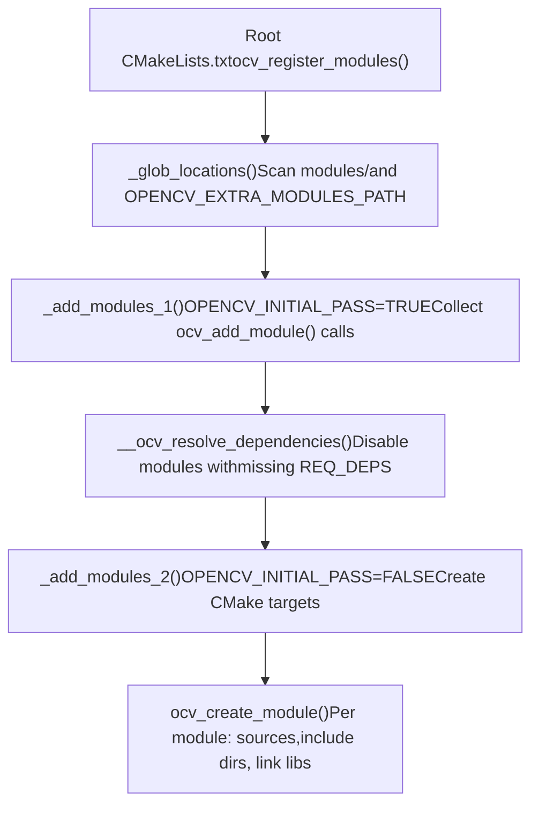
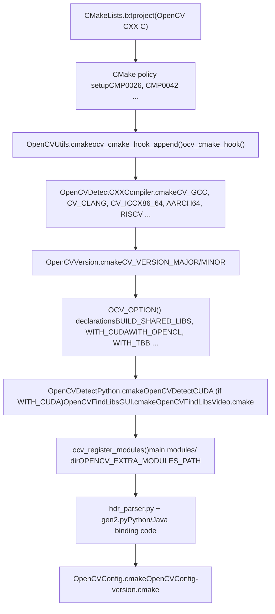
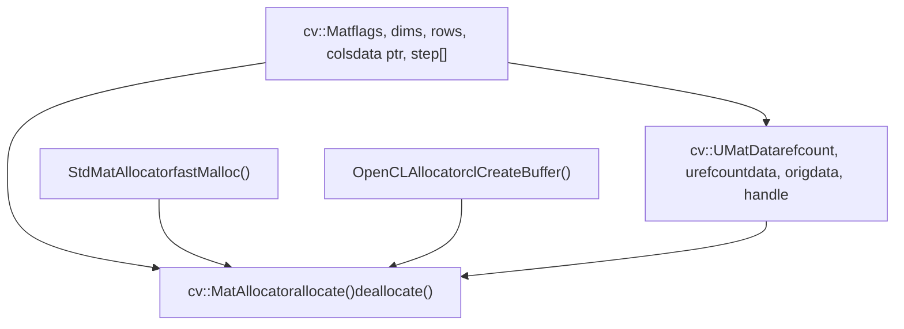
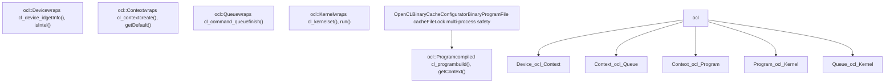
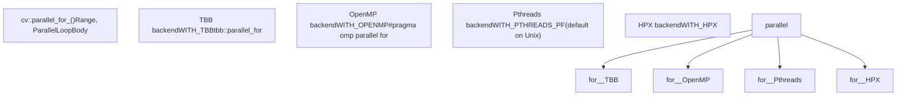
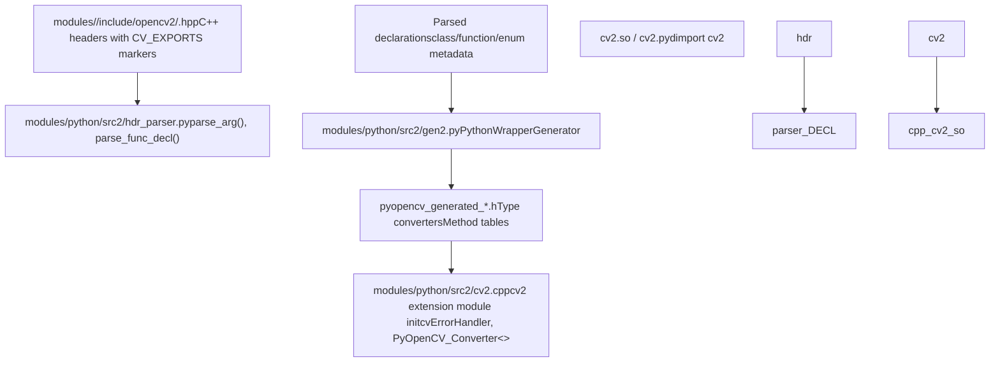
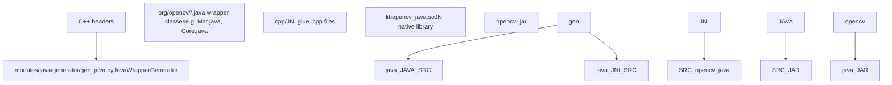

# OpenCV 概述

相关源文件

-   [CMakeLists.txt](https://github.com/opencv/opencv/blob/91c78f50/CMakeLists.txt)
-   [cmake/OpenCVCRTLinkage.cmake](https://github.com/opencv/opencv/blob/91c78f50/cmake/OpenCVCRTLinkage.cmake)
-   [cmake/OpenCVCompilerOptions.cmake](https://github.com/opencv/opencv/blob/91c78f50/cmake/OpenCVCompilerOptions.cmake)
-   [cmake/OpenCVDetectCXXCompiler.cmake](https://github.com/opencv/opencv/blob/91c78f50/cmake/OpenCVDetectCXXCompiler.cmake)
-   [cmake/OpenCVFindLibsGUI.cmake](https://github.com/opencv/opencv/blob/91c78f50/cmake/OpenCVFindLibsGUI.cmake)
-   [cmake/OpenCVFindLibsVideo.cmake](https://github.com/opencv/opencv/blob/91c78f50/cmake/OpenCVFindLibsVideo.cmake)
-   [cmake/OpenCVModule.cmake](https://github.com/opencv/opencv/blob/91c78f50/cmake/OpenCVModule.cmake)
-   [cmake/OpenCVPCHSupport.cmake](https://github.com/opencv/opencv/blob/91c78f50/cmake/OpenCVPCHSupport.cmake)
-   [cmake/OpenCVUtils.cmake](https://github.com/opencv/opencv/blob/91c78f50/cmake/OpenCVUtils.cmake)
-   [cmake/templates/OpenCVConfig.root-WIN32.cmake.in](https://github.com/opencv/opencv/blob/91c78f50/cmake/templates/OpenCVConfig.root-WIN32.cmake.in)
-   [cmake/templates/cvconfig.h.in](https://github.com/opencv/opencv/blob/91c78f50/cmake/templates/cvconfig.h.in)
-   [doc/tutorials/dnn/dnn\_android/dnn\_android.markdown](https://github.com/opencv/opencv/blob/91c78f50/doc/tutorials/dnn/dnn_android/dnn_android.markdown?plain=1)
-   [doc/tutorials/introduction/cross\_referencing/tutorial\_cross\_referencing.markdown](https://github.com/opencv/opencv/blob/91c78f50/doc/tutorials/introduction/cross_referencing/tutorial_cross_referencing.markdown?plain=1)
-   [modules/core/CMakeLists.txt](https://github.com/opencv/opencv/blob/91c78f50/modules/core/CMakeLists.txt)
-   [modules/core/include/opencv2/core/version.hpp](https://github.com/opencv/opencv/blob/91c78f50/modules/core/include/opencv2/core/version.hpp)
-   [modules/dnn/include/opencv2/dnn/version.hpp](https://github.com/opencv/opencv/blob/91c78f50/modules/dnn/include/opencv2/dnn/version.hpp)
-   [modules/highgui/CMakeLists.txt](https://github.com/opencv/opencv/blob/91c78f50/modules/highgui/CMakeLists.txt)
-   [modules/highgui/include/opencv2/highgui.hpp](https://github.com/opencv/opencv/blob/91c78f50/modules/highgui/include/opencv2/highgui.hpp)
-   [modules/highgui/include/opencv2/highgui/highgui.hpp](https://github.com/opencv/opencv/blob/91c78f50/modules/highgui/include/opencv2/highgui/highgui.hpp)
-   [modules/highgui/include/opencv2/highgui/highgui\_c.h](https://github.com/opencv/opencv/blob/91c78f50/modules/highgui/include/opencv2/highgui/highgui_c.h)
-   [modules/highgui/src/precomp.hpp](https://github.com/opencv/opencv/blob/91c78f50/modules/highgui/src/precomp.hpp)
-   [modules/highgui/src/window.cpp](https://github.com/opencv/opencv/blob/91c78f50/modules/highgui/src/window.cpp)
-   [modules/highgui/src/window\_QT.cpp](https://github.com/opencv/opencv/blob/91c78f50/modules/highgui/src/window_QT.cpp)
-   [modules/highgui/src/window\_QT.h](https://github.com/opencv/opencv/blob/91c78f50/modules/highgui/src/window_QT.h)
-   [modules/highgui/src/window\_cocoa.mm](https://github.com/opencv/opencv/blob/91c78f50/modules/highgui/src/window_cocoa.mm)
-   [modules/highgui/src/window\_gtk.cpp](https://github.com/opencv/opencv/blob/91c78f50/modules/highgui/src/window_gtk.cpp)
-   [modules/highgui/src/window\_w32.cpp](https://github.com/opencv/opencv/blob/91c78f50/modules/highgui/src/window_w32.cpp)
-   [modules/java/CMakeLists.txt](https://github.com/opencv/opencv/blob/91c78f50/modules/java/CMakeLists.txt)
-   [modules/python/package/setup.py](https://github.com/opencv/opencv/blob/91c78f50/modules/python/package/setup.py)
-   [modules/videoio/CMakeLists.txt](https://github.com/opencv/opencv/blob/91c78f50/modules/videoio/CMakeLists.txt)
-   [platforms/android/build\_sdk.py](https://github.com/opencv/opencv/blob/91c78f50/platforms/android/build_sdk.py)
-   [platforms/android/ndk-10.config.py](https://github.com/opencv/opencv/blob/91c78f50/platforms/android/ndk-10.config.py)
-   [platforms/android/ndk-16.config.py](https://github.com/opencv/opencv/blob/91c78f50/platforms/android/ndk-16.config.py)
-   [platforms/maven/opencv-it/pom.xml](https://github.com/opencv/opencv/blob/91c78f50/platforms/maven/opencv-it/pom.xml)
-   [platforms/maven/opencv/pom.xml](https://github.com/opencv/opencv/blob/91c78f50/platforms/maven/opencv/pom.xml)
-   [platforms/maven/pom.xml](https://github.com/opencv/opencv/blob/91c78f50/platforms/maven/pom.xml)

## OpenCV 是什么

OpenCV（Open Source Computer Vision Library）是一个用于实时计算机视觉和图像处理的 C++ 库。它提供：

-   图像和视频 I/O（读取、写入、摄像头采集）
-   图像处理（滤波、变换、颜色转换）
-   计算机视觉算法（特征检测、相机标定、目标检测）
-   深度神经网络推理（`opencv_dnn`）
-   通过 OpenCL 和 CUDA 提供 GPU 加速
-   Python 与 Java 语言绑定

该库组织为一组可独立构建的模块，每个模块位于 `modules/` 下。所有模块都依赖 `opencv_core`，它提供基础数据结构和实用工具。

## 仓库布局与版本

OpenCV 4.14.0-pre 是一个模块化 C++ 库，采用基于 CMake 的构建系统并自动生成语言绑定。

| Directory | Contents |
| --- | --- |
| `modules/` | 核心 OpenCV 模块（`core`、`imgproc`、`dnn`、`features2d` 等） |
| `cmake/` | 构建基础设施：检测脚本、模块宏、编译器选项 |
| `platforms/` | 平台特定构建脚本（Android SDK 构建器、Maven POM） |
| `3rdparty/` | 打包的第三方依赖（zlib、libjpeg、libpng 等） |

**Version constants** 定义于 [modules/core/include/opencv2/core/version.hpp8-11](https://github.com/opencv/opencv/blob/91c78f50/modules/core/include/opencv2/core/version.hpp#L8-L11)：

| Macro | Value |
| --- | --- |
| `CV_VERSION_MAJOR` | `4` |
| `CV_VERSION_MINOR` | `14` |
| `CV_VERSION_REVISION` | `0` |
| `CV_VERSION_STATUS` | `"-pre"` |

来源：[modules/core/include/opencv2/core/version.hpp1-27](https://github.com/opencv/opencv/blob/91c78f50/modules/core/include/opencv2/core/version.hpp#L1-L27)

## 支持的平台

OpenCV 面向广泛的平台。`CMAKE_SYSTEM_NAME` 变量与 [cmake/OpenCVDetectCXXCompiler.cmake94-116](https://github.com/opencv/opencv/blob/91c78f50/cmake/OpenCVDetectCXXCompiler.cmake#L94-L116) 中设置的处理器标志决定哪些路径会被激活。

| Platform | Notes |
| --- | --- |
| Linux (x86\_64, ARM, AArch64, RISC-V, LoongArch64) | 完整特性集；GTK 或 Qt GUI |
| Windows (x86, x64, ARM64) | Win32 UI 或 Qt GUI；MSVC、MinGW |
| macOS | Cocoa GUI；Apple Silicon 和 Intel |
| Android | NDK 构建；通过 `build_sdk.py` 支持多 ABI |
| iOS / visionOS | Framework 构建；AVFoundation 采集 |
| WebAssembly (Emscripten) | JS 绑定 |

来源：[cmake/OpenCVDetectCXXCompiler.cmake1-116](https://github.com/opencv/opencv/blob/91c78f50/cmake/OpenCVDetectCXXCompiler.cmake#L1-L116) [CMakeLists.txt18-26](https://github.com/opencv/opencv/blob/91c78f50/CMakeLists.txt#L18-L26) [platforms/android/build\_sdk.py70-79](https://github.com/opencv/opencv/blob/91c78f50/platforms/android/build_sdk.py#L70-L79)

## 模块组织与依赖

### 模块架构

OpenCV 的架构是分层的。每个模块都在自身的 `CMakeLists.txt` 中通过 `ocv_add_module` 声明，并列出必需与可选依赖。规范模块的固定排序定义于 [cmake/OpenCVModule.cmake424-426](https://github.com/opencv/opencv/blob/91c78f50/cmake/OpenCVModule.cmake#L424-L426)

**模块依赖图（规范模块）：**


来源：[cmake/OpenCVModule.cmake424-426](https://github.com/opencv/opencv/blob/91c78f50/cmake/OpenCVModule.cmake#L424-L426) [modules/core/CMakeLists.txt35-37](https://github.com/opencv/opencv/blob/91c78f50/modules/core/CMakeLists.txt#L35-L37) [modules/highgui/CMakeLists.txt4-6](https://github.com/opencv/opencv/blob/91c78f50/modules/highgui/CMakeLists.txt#L4-L6) [modules/videoio/CMakeLists.txt24](https://github.com/opencv/opencv/blob/91c78f50/modules/videoio/CMakeLists.txt#L24-L24)

### 通过 `ocv_add_module` 进行模块注册

每个模块都在其 `CMakeLists.txt` 中调用 `ocv_add_module`。该宏（定义于 [cmake/OpenCVModule.cmake124-223](https://github.com/opencv/opencv/blob/91c78f50/cmake/OpenCVModule.cmake#L124-L223)）在第一次 CMake 传递（`OPENCV_INITIAL_PASS=ON`）期间收集依赖信息，并在第二次传递时创建构建目标。

```
ocv_add_module(<name> [INTERNAL|BINDINGS]
               [REQUIRED] <deps>
               [OPTIONAL <optional_deps>]
               [WRAP <python|java|objc|js>])
```
存储在 CMake 缓存中的模块元数据：

| CMake Variable | Description |
| --- | --- |
| `OPENCV_MODULE_${the_module}_LOCATION` | 源码目录 |
| `OPENCV_MODULE_${the_module}_DEPS` | 展平后的已解析依赖列表 |
| `OPENCV_MODULE_${the_module}_CLASS` | `PUBLIC`、`INTERNAL` 或 `BINDINGS` |
| `OPENCV_MODULE_${the_module}_WRAPPERS` | 已启用的语言封装器 |
| `HAVE_${the_module}` | 若模块可构建则为 `ON` |

来源：[cmake/OpenCVModule.cmake1-117](https://github.com/opencv/opencv/blob/91c78f50/cmake/OpenCVModule.cmake#L1-L117) [CMakeLists.txt195-196](https://github.com/opencv/opencv/blob/91c78f50/CMakeLists.txt#L195-L196)

### 模块发现过程

构建系统使用 `_glob_locations`、`_add_modules_1` 和 `_add_modules_2` 函数来发现模块。模块路径通过扫描 [cmake/OpenCVModule.cmake250-280](https://github.com/opencv/opencv/blob/91c78f50/cmake/OpenCVModule.cmake#L250-L280) 中的 `CMakeLists.txt` 文件来发现。

**模块注册与构建流程：**


来源：[cmake/OpenCVModule.cmake246-399](https://github.com/opencv/opencv/blob/91c78f50/cmake/OpenCVModule.cmake#L246-L399) [CMakeLists.txt631-632](https://github.com/opencv/opencv/blob/91c78f50/CMakeLists.txt#L631-L632)

## 构建系统架构

### CMake 配置流程

根 `CMakeLists.txt` 驱动平台检测、编译器配置、第三方库发现和模块编译。有关构建系统的详细说明，请参见第 2 页。

**CMake 配置顺序：**


**关键配置变量：**

| Variable | Purpose | Default |
| --- | --- | --- |
| `BUILD_SHARED_LIBS` | `.so`/`.dll` 与 `.a`/`.lib` 的选择 | `ON`（Android/iOS 除外） |
| `BUILD_LIST` | 需构建模块的逗号分隔子集 | all |
| `OPENCV_EXTRA_MODULES_PATH` | 附加模块搜索路径 | empty |
| `OPENCV_FORCE_3RDPARTY_BUILD` | 从源码构建全部第三方库 | `OFF` |
| `BUILD_opencv_world` | 将全部模块合并为单一库 | `OFF` |

**CMake hooks** 允许外部自定义。它们通过 `ocv_cmake_hook_append()` 注册，并在具名节点（`CMAKE_INIT`、`POST_DETECT_COMPILER`、`POST_ADD_MODULE` 等）调用 [cmake/OpenCVUtils.cmake48-86](https://github.com/opencv/opencv/blob/91c78f50/cmake/OpenCVUtils.cmake#L48-L86)

来源：[CMakeLists.txt1-200](https://github.com/opencv/opencv/blob/91c78f50/CMakeLists.txt#L1-L200) [cmake/OpenCVUtils.cmake44-97](https://github.com/opencv/opencv/blob/91c78f50/cmake/OpenCVUtils.cmake#L44-L97) [cmake/OpenCVDetectCXXCompiler.cmake1-50](https://github.com/opencv/opencv/blob/91c78f50/cmake/OpenCVDetectCXXCompiler.cmake#L1-L50)

### 模块编译模式

每个模块的 `CMakeLists.txt` 都遵循 [cmake/OpenCVModule.cmake33-51](https://github.com/opencv/opencv/blob/91c78f50/cmake/OpenCVModule.cmake#L33-L51) 中记录的标准模式：

1.  `ocv_add_module(name <deps>)` —— 声明模块与依赖
2.  `ocv_glob_module_sources()` 或 `ocv_set_module_sources(SOURCES ... HEADERS ...)` —— 收集文件
3.  `ocv_module_include_directories()` —— 设置包含路径
4.  `ocv_create_module([extra_link_libs])` —— 创建 CMake 库目标
5.  `ocv_add_accuracy_tests()`、`ocv_add_perf_tests()` —— 注册测试目标

在任意模块 `CMakeLists.txt` 中，`${the_module}` 是完整目标名（例如 `opencv_core`），`${name}` 是短名称（例如 `core`）。

来源：[cmake/OpenCVModule.cmake33-51](https://github.com/opencv/opencv/blob/91c78f50/cmake/OpenCVModule.cmake#L33-L51) [modules/core/CMakeLists.txt35-173](https://github.com/opencv/opencv/blob/91c78f50/modules/core/CMakeLists.txt#L35-L173) [modules/highgui/CMakeLists.txt1-12](https://github.com/opencv/opencv/blob/91c78f50/modules/highgui/CMakeLists.txt#L1-L12)

## 核心数据结构

关于 `Mat`、`UMat`、OpenCL 加速、SIMD 分发及其他核心能力的完整细节，请参见第 3 页。

### Mat 与内存管理

`cv::Mat` 是基础数据容器，实现了带写时复制语义的引用计数内存管理。其定义位于 `modules/core/include/opencv2/core/mat.hpp`。

**Mat / UMatData / MatAllocator 关系：**


关键 `cv::Mat` 字段（[modules/core/include/opencv2/core/mat.hpp1753-2665](https://github.com/opencv/opencv/blob/91c78f50/modules/core/include/opencv2/core/mat.hpp#L1753-L2665)）：

| Field | Type | Purpose |
| --- | --- | --- |
| `flags` | `int` | 编码元素类型（`CV_8UC1`、`CV_32FC3` 等） |
| `dims` | `int` | 维度数量 |
| `rows`, `cols` | `int` | 2D 矩阵的尺寸 |
| `data` | `uchar*` | 指向首元素的指针 |
| `u` | `UMatData*` | 引用计数与分配器元数据 |
| `step` | `MatStep` | 行步长（字节） |

引用计数在 `UMatData::refcount` 上使用 `CV_XADD`（原子递增/递减）。`addref()` 与 `release()` 实现于 [modules/core/src/matrix.cpp541-565](https://github.com/opencv/opencv/blob/91c78f50/modules/core/src/matrix.cpp#L541-L565)。默认分配器 `StdMatAllocator` 使用 `fastMalloc()` [modules/core/src/matrix.cpp126-177](https://github.com/opencv/opencv/blob/91c78f50/modules/core/src/matrix.cpp#L126-L177)

来源：[modules/core/include/opencv2/core/mat.hpp1753-1950](https://github.com/opencv/opencv/blob/91c78f50/modules/core/include/opencv2/core/mat.hpp#L1753-L1950) [modules/core/src/matrix.cpp126-177](https://github.com/opencv/opencv/blob/91c78f50/modules/core/src/matrix.cpp#L126-L177) [modules/core/src/matrix.cpp336-446](https://github.com/opencv/opencv/blob/91c78f50/modules/core/src/matrix.cpp#L336-L446)

### UMat 与统一内存

`cv::UMat` 通过 OpenCL 提供透明的 GPU 执行。它与 `cv::Mat` 共享 `UMatData` 引用计数机制，但使用 `OpenCLAllocator` 以 `cl_mem` 缓冲区作为底层存储。

`UMat::getMat(accessFlags)` 会触发数据迁移：

-   `ACCESS_READ` —— 若 GPU 副本更新，则从 GPU→CPU 下载
-   `ACCESS_WRITE` —— 在 CPU 写入后将 GPU 数据标记为过期
-   `ACCESS_RW` —— 双向同步

`InputArray` 与 `OutputArray`（定义于 [modules/core/include/opencv2/core/mat.hpp160-356](https://github.com/opencv/opencv/blob/91c78f50/modules/core/include/opencv2/core/mat.hpp#L160-L356)）允许所有 OpenCV 函数在源码级无需修改即可接受 `Mat` 或 `UMat`。

来源：[modules/core/src/umatrix.cpp1-1200](https://github.com/opencv/opencv/blob/91c78f50/modules/core/src/umatrix.cpp#L1-L1200) [modules/core/include/opencv2/core/mat.hpp160-356](https://github.com/opencv/opencv/blob/91c78f50/modules/core/include/opencv2/core/mat.hpp#L160-L356)

## 硬件加速基础设施

关于 OpenCL 与 CUDA 加速的完整细节，请参见第 3.2 页和第 14 页。

### OpenCL 集成

OpenCL 支持通过 `cv::ocl` 命名空间管理。该类层次结构与 OpenCL 对象模型直接对应。

**`cv::ocl` 类层次结构：**


内核二进制缓存由 `OpenCLBinaryCacheConfigurator` 管理 [modules/core/src/ocl.cpp311-519](https://github.com/opencv/opencv/blob/91c78f50/modules/core/src/ocl.cpp#L311-L519)。缓存目录由 `OPENCV_OPENCL_CACHE_DIR` 控制。构建选项可通过 `OPENCV_OPENCL_BUILD_EXTRA_OPTIONS` 扩展 [modules/core/src/ocl.cpp233-245](https://github.com/opencv/opencv/blob/91c78f50/modules/core/src/ocl.cpp#L233-L245)

来源：[modules/core/src/ocl.cpp311-842](https://github.com/opencv/opencv/blob/91c78f50/modules/core/src/ocl.cpp#L311-L842) [modules/core/include/opencv2/core/ocl.hpp1-600](https://github.com/opencv/opencv/blob/91c78f50/modules/core/include/opencv2/core/ocl.hpp#L1-L600)

### 并行处理

`cv::parallel_for_()` 通过可插拔后端系统将循环体分发到 CPU 线程。


构建期 CMake 选项决定会编译哪些后端 [CMakeLists.txt351-362](https://github.com/opencv/opencv/blob/91c78f50/CMakeLists.txt#L351-L362)

来源：[CMakeLists.txt351-362](https://github.com/opencv/opencv/blob/91c78f50/CMakeLists.txt#L351-L362)

### SIMD 分发

OpenCV 会为热点函数编译多个优化变体，并在运行时选择最佳版本。细节请参见第 3.5 页。

CPU 能力由 [modules/core/src/system.cpp382-640](https://github.com/opencv/opencv/blob/91c78f50/modules/core/src/system.cpp#L382-L640) 中的 `HWFeatures` 检测：

-   x86：通过 CPUID 检测 `SSE2`、`AVX`、`AVX2`、`AVX512`
-   ARM/AArch64：通过辅助向量检测 `NEON`、`SVE`
-   PowerPC：通过 `getauxval()` 检测 `VSX`

模块使用 `ocv_add_dispatched_file()` 声明分发目标 [modules/core/CMakeLists.txt3-10](https://github.com/opencv/opencv/blob/91c78f50/modules/core/CMakeLists.txt#L3-L10)。例如：

```
ocv_add_dispatched_file(arithm SSE2 SSE4_1 AVX2 VSX3 LASX)
```
这会为每个 ISA 扩展生成一个编译单元。运行时分发通过 `CV_CPU_HAS_SUPPORT_*` 宏选择最佳版本。

来源：[modules/core/src/system.cpp382-640](https://github.com/opencv/opencv/blob/91c78f50/modules/core/src/system.cpp#L382-L640) [modules/core/CMakeLists.txt1-20](https://github.com/opencv/opencv/blob/91c78f50/modules/core/CMakeLists.txt#L1-L20)

## 语言绑定基础设施

关于 Python 与 Java 绑定的完整细节，请参见第 11.1 页和第 11.2 页。

### Python 绑定

Python 绑定由 C++ 头文件自动生成。该流水线在构建时运行。

**Python 绑定生成流水线：**


类型转换：`cv::Mat` ↔ `numpy.ndarray`，`std::vector<T>` ↔ Python list，`cv::Point`/`cv::Rect` ↔ Python tuples。

来源：[modules/python/CMakeLists.txt1-50](https://github.com/opencv/opencv/blob/91c78f50/modules/python/CMakeLists.txt#L1-L50)

### Java 绑定

Java 绑定使用相同的头文件解析方法，并将结果输入 JNI 层。

**Java 绑定生成：**


`opencv_java` 模块在 [modules/java/CMakeLists.txt16](https://github.com/opencv/opencv/blob/91c78f50/modules/java/CMakeLists.txt#L16-L16) 中声明为 `BINDINGS` 类。它在配置阶段需要 `ANT_EXECUTABLE`、`Java_FOUND` 或 Gradle。

来源：[modules/java/CMakeLists.txt1-42](https://github.com/opencv/opencv/blob/91c78f50/modules/java/CMakeLists.txt#L1-L42)

## 配置与构建选项

### 第三方依赖

所有可选集成都由 [CMakeLists.txt215-482](https://github.com/opencv/opencv/blob/91c78f50/CMakeLists.txt#L215-L482) 中声明的 `WITH_*` CMake 选项控制。每个选项在检测后都有对应的 `HAVE_*` 变量。

| Category | Option | Purpose |
| --- | --- | --- |
| Acceleration | `WITH_OPENCL` | OpenCL 运行时 |
| Acceleration | `WITH_CUDA` | NVIDIA CUDA 工具链 |
| Acceleration | `WITH_IPP` | Intel IPP（仅 x86/x64） |
| Acceleration | `WITH_TBB` | Intel Threading Building Blocks |
| Acceleration | `WITH_EIGEN` | Eigen3 线性代数 |
| Video I/O | `WITH_FFMPEG` | FFmpeg 视频编解码 |
| Video I/O | `WITH_GSTREAMER` | GStreamer 流水线 |
| Video I/O | `WITH_V4L` | Video4Linux（仅 Linux） |
| Video I/O | `WITH_MSMF` | Media Foundation（Windows） |
| Image codecs | `WITH_JPEG` / `WITH_PNG` / `WITH_TIFF` | 图像格式支持 |
| Image codecs | `WITH_WEBP` / `WITH_AVIF` / `WITH_OPENEXR` | 其他格式 |
| GUI | `WITH_QT` | Qt 窗口后端 |
| GUI | `WITH_GTK` | GTK 窗口后端（Linux） |
| GUI | `WITH_WIN32UI` | Win32 窗口后端 |
| DNN | `WITH_OPENVINO` | Intel OpenVINO 推理后端 |
| DNN | `WITH_CUDA` + `WITH_CUDNN` | CUDA/cuDNN DNN 后端 |

来源：[CMakeLists.txt215-483](https://github.com/opencv/opencv/blob/91c78f50/CMakeLists.txt#L215-L483) [cmake/OpenCVFindLibsVideo.cmake1-12](https://github.com/opencv/opencv/blob/91c78f50/cmake/OpenCVFindLibsVideo.cmake#L1-L12) [cmake/OpenCVFindLibsGUI.cmake1-50](https://github.com/opencv/opencv/blob/91c78f50/cmake/OpenCVFindLibsGUI.cmake#L1-L50)

### 平台特定配置

平台检测由 `cmake/OpenCVDetectCXXCompiler.cmake` 以及 `cmake/platforms/` 下的平台特定文件执行。

-   **Android**：`platforms/android/build_sdk.py` 统筹多 ABI NDK 构建（armeabi-v7a、arm64-v8a、x86、x86\_64）并生成 AAR。参见第 2.3 页。
-   **iOS/macOS**：Framework bundle 创建；`APPLE_FRAMEWORK` CMake 变量激活 framework 特定规则。
-   **Windows**：MSVC 特定编译器标志设置于 [cmake/OpenCVCompilerOptions.cmake96-103](https://github.com/opencv/opencv/blob/91c78f50/cmake/OpenCVCompilerOptions.cmake#L96-L103)。当 `WITH_WIN32UI` 为 `ON` 时选择 Win32 UI 后端。
-   **Emscripten (WebAssembly)**：通过 `BUILD_opencv_js` 提供 JS 绑定；插件系统被禁用。

来源：[platforms/android/build\_sdk.py70-80](https://github.com/opencv/opencv/blob/91c78f50/platforms/android/build_sdk.py#L70-L80) [cmake/OpenCVCompilerOptions.cmake96-340](https://github.com/opencv/opencv/blob/91c78f50/cmake/OpenCVCompilerOptions.cmake#L96-L340) [cmake/OpenCVDetectCXXCompiler.cmake92-140](https://github.com/opencv/opencv/blob/91c78f50/cmake/OpenCVDetectCXXCompiler.cmake#L92-L140)

## 扩展机制

### 自定义模块

OpenCV 通过 `OPENCV_EXTRA_MODULES_PATH` 支持外部模块：

1.  创建包含 `CMakeLists.txt` 的模块目录
2.  调用 `ocv_add_module(mymodule <dependencies>)`
3.  将 CMake 指向模块路径：`-DOPENCV_EXTRA_MODULES_PATH=/path/to/modules`

模块系统会自动将外部模块集成到：

-   构建流程
-   安装流程
-   语言绑定（如适用）
-   文档生成

来源：[cmake/OpenCVModule.cmake246-280](https://github.com/opencv/opencv/blob/91c78f50/cmake/OpenCVModule.cmake#L246-L280) [CMakeLists.txt632](https://github.com/opencv/opencv/blob/91c78f50/CMakeLists.txt#L632-L632)

### 插件架构

`highgui` 与 `videoio` 模块支持用于 GUI 和视频后端的运行时可加载插件。

**Plugin Registration：**后端通过 [modules/highgui/CMakeLists.txt196-204](https://github.com/opencv/opencv/blob/91c78f50/modules/highgui/CMakeLists.txt#L196-L204) 中的 `ocv_create_builtin_highgui_plugin()` 宏进行注册。

**Backend Selection：**`OPENCV_HIGHGUI_BUILTIN_BACKEND` 变量决定默认后端（例如 "QT5"、"GTK3"、"WIN32UI"）。

来源：[modules/highgui/CMakeLists.txt1-250](https://github.com/opencv/opencv/blob/91c78f50/modules/highgui/CMakeLists.txt#L1-L250)

---

本概述涵盖了 OpenCV 的模块化架构、构建基础设施、核心数据结构、硬件加速和语言绑定。有关特定子系统的实现细节，请查阅对应的专门文档页面。
